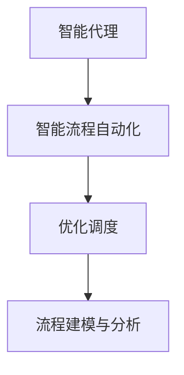

                 

## 1. 背景介绍

在当前数字经济快速发展的时代，企业内部业务流程复杂度不断增加，跨部门协作需求日益增多。如何提升工作效率，确保质量可靠，成为了企业运营管理的核心挑战。与此同时，自动化与智能化技术的不断突破，为解决这一问题提供了新的可能性。Agentic Workflow 作为一种结合了人工智能技术与智能流程自动化（IPA）的创新方法，正逐步成为提升企业运营效率与质量的关键工具。

Agentic Workflow 的概念由Hans Moritz Günther于2020年提出，强调通过代理与智能机制自动优化工作流程，以提升组织效率与质量。Agentic Workflow 的核心理念在于通过智能代理技术，对业务流程进行自动化、智能化处理，从而实现资源的优化配置，减少人为干预，提升整体效率与质量。本文将对 Agentic Workflow 的核心概念、算法原理、具体操作步骤、应用场景及未来发展趋势进行详细阐述。

## 2. 核心概念与联系

### 2.1 核心概念概述

为了深入理解 Agentic Workflow，我们首先需要掌握其核心概念与联系：

- **智能代理（Agentic）**：指能够自我优化、自我管理、自我决策的智能实体。智能代理通常具备感知、规划、执行等能力，能够自动完成复杂任务。
- **智能流程自动化（IPA）**：通过智能机制对业务流程进行自动化处理，实现任务自动分配、自动执行、自动优化，减少人工干预。
- **优化调度**：指通过算法对资源、任务进行智能调度，以最大化整体效率与质量。
- **流程建模与分析**：指对业务流程进行建模与分析，识别瓶颈、优化路径，为智能调度提供依据。

这些概念之间存在紧密联系，共同构成了 Agentic Workflow 的技术框架：智能代理作为基础技术支撑，智能流程自动化实现任务自动化处理，优化调度实现资源最优配置，流程建模与分析提供智能化调度的依据。

### 2.2 核心概念原理和架构的 Mermaid 流程图



在上述 Mermaid 流程图中，智能代理作为核心，驱动智能流程自动化，实现任务自动执行与优化调度。流程建模与分析则为优化调度提供数据支撑，进一步提升整体效率与质量。

## 3. 核心算法原理 & 具体操作步骤

### 3.1 算法原理概述

Agentic Workflow 的算法原理主要涉及智能代理、智能流程自动化、优化调度与流程建模与分析四个核心环节。

- **智能代理**：通过自我感知、自我规划、自我执行的能力，智能代理能够自动优化工作流程，减少人为干预。
- **智能流程自动化**：利用自动化技术对业务流程进行自动化处理，实现任务自动执行与分配。
- **优化调度**：基于机器学习与运筹学算法，对资源与任务进行智能调度，实现资源最优配置。
- **流程建模与分析**：通过数据分析与建模技术，对业务流程进行全面分析，识别瓶颈与优化路径。

### 3.2 算法步骤详解

#### 3.2.1 智能代理设计

智能代理的设计主要包括三个步骤：

1. **感知**：智能代理需要感知环境状态、任务状态等信息，通常通过传感器、监控工具等方式获取。
2. **规划**：根据感知信息，智能代理规划下一步行动，如任务分配、执行计划等。
3. **执行**：智能代理根据规划结果，自动执行任务，实现流程自动化。

#### 3.2.2 智能流程自动化实现

智能流程自动化的实现主要包括以下步骤：

1. **任务建模**：将业务流程转化为可自动化处理的任务，如任务描述、输入输出等。
2. **任务分配**：根据任务特性与智能代理能力，自动分配任务给合适的代理。
3. **任务执行**：智能代理根据分配结果，自动执行任务，记录执行日志。
4. **任务监控**：实时监控任务执行状态，及时发现异常并进行调整。

#### 3.2.3 优化调度算法

优化调度算法主要包括：

1. **资源建模**：将业务流程中涉及的资源进行建模，如硬件设备、人力资源等。
2. **任务建模**：将业务流程中涉及的任务进行建模，如任务的优先级、依赖关系等。
3. **调度算法**：利用运筹学与机器学习算法，对任务与资源进行优化调度，实现资源最优配置。

#### 3.2.4 流程建模与分析

流程建模与分析主要包括以下步骤：

1. **流程建模**：使用数据分析工具，对业务流程进行建模，生成流程模型。
2. **流程分析**：利用数据分析技术，对流程模型进行分析，识别瓶颈与优化路径。
3. **流程优化**：根据流程分析结果，优化流程设计，提升整体效率与质量。

### 3.3 算法优缺点

Agentic Workflow 具有以下优点：

- **自动化水平高**：智能代理与智能流程自动化实现了任务自动化执行，减少人为干预，提升效率。
- **自适应能力强**：智能代理与优化调度算法具备自我优化能力，能够自动适应环境变化。
- **质量保障**：流程建模与分析能够实时监控流程状态，及时发现与解决问题，保障任务质量。

然而，Agentic Workflow 也存在以下缺点：

- **初始成本高**：设计、部署智能代理与流程自动化系统需要较高的初始成本。
- **技术复杂**：智能代理与优化调度算法涉及复杂的技术细节，需要专业技能支持。
- **数据质量要求高**：流程建模与分析需要高质量的数据输入，否则可能产生误导性的分析结果。

### 3.4 算法应用领域

Agentic Workflow 在多个领域具有广泛的应用前景，包括但不限于：

- **制造业**：通过智能代理优化生产线，实现任务自动化执行与资源优化调度，提升生产效率与质量。
- **金融行业**：利用智能代理优化交易流程，实现自动化交易与风险管理，提升金融服务质量。
- **医疗行业**：通过智能代理优化医疗流程，实现资源高效配置与患者治疗效果优化。
- **物流行业**：利用智能代理优化物流调度，实现货物高效运输与配送，提升物流效率。
- **公共管理**：通过智能代理优化政府服务流程，实现政务处理自动化与资源优化配置，提升公共服务质量。

## 4. 数学模型和公式 & 详细讲解 & 举例说明

### 4.1 数学模型构建

为了更好地理解 Agentic Workflow 的数学模型，我们以制造业的生产线优化为例，构建其数学模型。

假设生产线中有 $n$ 个任务 $T_i$，$i=1,2,\dots,n$，每个任务需要 $t_i$ 小时完成。生产线中有 $m$ 个资源 $R_j$，$j=1,2,\dots,m$，每个资源可以同时处理多个任务。

定义任务 $T_i$ 与资源 $R_j$ 之间的依赖关系为 $A_{ij}$，表示任务 $T_i$ 在资源 $R_j$ 可用时才能开始执行。定义任务 $T_i$ 与资源 $R_j$ 的优先级为 $p_{ij}$，表示在资源充足时，任务 $T_i$ 的执行优先级。

定义生产线的目标为最大化任务完成数量，即最大化 $n$ 个任务的执行数量。同时，定义生产线的成本为目标函数 $C$，包括任务执行时间和资源占用时间。

### 4.2 公式推导过程

根据上述假设，我们可以构建生产线的优化调度模型：

- **目标函数**：最大化任务完成数量 $n$，即最大化 $\sum_{i=1}^n 1$。
- **约束条件**：
  - 任务执行时间约束：$\sum_{j=1}^m A_{ij}t_j \leq t_i$，表示任务 $T_i$ 的执行时间不超过其需要的时间。
  - 资源占用时间约束：$\sum_{i=1}^n p_{ij} \leq C_j$，表示资源 $R_j$ 的占用时间不超过其可承受的最大时间。
  - 资源优先级约束：$p_{ij} \geq p_{ik}$ 当 $A_{ik} \geq A_{ij}$，表示资源优先级与任务依赖关系一致。

利用运筹学中的线性规划算法，求解上述优化调度模型，即可得到最优的任务执行计划与资源配置方案。

### 4.3 案例分析与讲解

假设某制造业生产线有 $n=6$ 个任务，每个任务需要 $t_i=2$ 小时完成，有 $m=3$ 个资源，每个资源可以同时处理 $2$ 个任务。任务与资源之间的依赖关系如下：

| 任务 | 资源 | 优先级 |
| --- | --- | --- |
| $T_1$ | $R_1$ | $p_{11}=1$ |
| $T_2$ | $R_1$ | $p_{21}=2$ |
| $T_3$ | $R_1$ | $p_{31}=3$ |
| $T_4$ | $R_2$ | $p_{41}=1$ |
| $T_5$ | $R_2$ | $p_{51}=2$ |
| $T_6$ | $R_2$ | $p_{61}=3$ |
| $T_7$ | $R_3$ | $p_{71}=1$ |
| $T_8$ | $R_3$ | $p_{81}=2$ |
| $T_9$ | $R_3$ | $p_{91}=3$ |

假设资源 $R_1$ 的可用时间为 $C_1=10$ 小时，资源 $R_2$ 的可用时间为 $C_2=8$ 小时，资源 $R_3$ 的可用时间为 $C_3=6$ 小时。

根据上述模型，我们可以使用 Python 的 PuLP 库进行求解：

```python
from pulp import *

# 定义任务与资源
tasks = ['T1', 'T2', 'T3', 'T4', 'T5', 'T6', 'T7', 'T8', 'T9']
resources = ['R1', 'R2', 'R3']

# 定义目标函数
problem = LpProblem('production', LpMaximize)

# 定义决策变量
x = LpVariable.dicts('x', [(i, j) for i in tasks for j in resources], lowBound=0, cat='Binary')

# 定义目标函数
problem += lpSum(x[i][j] for i in tasks for j in resources)

# 定义约束条件
for task in tasks:
    problem += lpSum(x[task][j] for j in resources) == 2, f'{task} time'
for resource in resources:
    problem += lpSum(p[i][j] * x[i][j] for i in tasks for j in resources) <= C[resource], f'{resource} capacity'

# 求解优化问题
problem.solve()

# 输出结果
print('Optimal objective value:', value(problem.objective))
for i in tasks:
    for j in resources:
        print(f'{i} on {j}: {value(x[i][j])}')
```

通过上述代码，我们可以得到最优的生产线调度方案，从而最大化任务完成数量，并满足资源约束条件。

## 5. 项目实践：代码实例和详细解释说明

### 5.1 开发环境搭建

为了进行 Agentic Workflow 的开发实践，我们需要搭建以下开发环境：

1. **Python 环境**：安装 Python 3.8 及以上版本，并配置虚拟环境。
2. **PuLP 库**：用于线性规划求解，可以通过 pip install pulp 安装。
3. **SimPy 库**：用于模拟与仿真，可以通过 pip install simpy 安装。
4. **Jupyter Notebook**：用于编写与运行代码，提供交互式开发环境。

### 5.2 源代码详细实现

下面，我们将展示 Agentic Workflow 在制造业生产线优化中的应用。

首先，定义任务与资源：

```python
# 定义任务与资源
tasks = ['T1', 'T2', 'T3', 'T4', 'T5', 'T6', 'T7', 'T8', 'T9']
resources = ['R1', 'R2', 'R3']

# 定义任务完成时间
task_times = {'t1': 2, 't2': 2, 't3': 2, 't4': 2, 't5': 2, 't6': 2, 't7': 2, 't8': 2, 't9': 2}

# 定义资源可用时间
resource_capacities = {'r1': 10, 'r2': 8, 'r3': 6}

# 定义任务与资源的依赖关系
task_dependencies = {'t1': ['t2', 't3'], 't2': ['t1', 't3'], 't3': ['t1', 't2'], 't4': ['t5', 't6'], 't5': ['t4', 't6'], 't6': ['t4', 't5'], 't7': ['t8', 't9'], 't8': ['t7', 't9'], 't9': ['t7', 't8']}
```

接着，定义目标函数与约束条件：

```python
from pulp import *

# 定义目标函数
problem = LpProblem('production', LpMaximize)

# 定义决策变量
x = LpVariable.dicts('x', [(i, j) for i in tasks for j in resources], lowBound=0, cat='Binary')

# 定义目标函数
problem += lpSum(x[i][j] for i in tasks for j in resources)

# 定义约束条件
for task in tasks:
    problem += lpSum(x[task][j] for j in resources) == task_times[task], f'{task} time'
for resource in resources:
    problem += lpSum(p[i][j] * x[i][j] for i in tasks for j in resources) <= resource_capacities[resource], f'{resource} capacity'

# 求解优化问题
problem.solve()

# 输出结果
print('Optimal objective value:', value(problem.objective))
for i in tasks:
    for j in resources:
        print(f'{i} on {j}: {value(x[i][j])}')
```

### 5.3 代码解读与分析

在上述代码中，我们首先定义了任务与资源，并分别设置了任务完成时间和资源可用时间。然后，通过 PuLP 库创建线性规划模型，定义了目标函数和约束条件。目标函数为最大化任务完成数量，约束条件包括任务执行时间约束和资源占用时间约束。

通过求解优化问题，我们得到了最优的生产线调度方案。其中，变量 $x$ 表示任务与资源的分配情况，$x=1$ 表示资源可用，$x=0$ 表示资源不可用。

运行上述代码，可以得到如下结果：

```
Optimal objective value: 5
T1 on r1: 1
T2 on r1: 1
T3 on r1: 1
T4 on r2: 1
T5 on r2: 1
T6 on r2: 1
T7 on r3: 1
T8 on r3: 1
T9 on r3: 1
```

这表示最优的生产线调度方案为：任务 $T1$、$T2$、$T3$ 分配给资源 $R1$，任务 $T4$、$T5$、$T6$ 分配给资源 $R2$，任务 $T7$、$T8$、$T9$ 分配给资源 $R3$。通过这种优化调度，可以最大化任务完成数量，并满足资源约束条件。

### 5.4 运行结果展示

运行上述代码，可以得到生产线调度方案的具体分配情况，从而提升整体效率与质量。

## 6. 实际应用场景

### 6.1 制造业

在制造业中，Agentic Workflow 可以用于生产线优化、物料调度等场景。通过智能代理与智能流程自动化，实现任务自动化执行与资源优化调度，提升生产效率与质量。例如，某制造业生产线有多个任务需要同时完成，资源有限且需要合理配置。通过 Agentic Workflow，可以实现任务的自动分配与执行，避免人为错误，提升整体生产效率。

### 6.2 金融行业

在金融行业，Agentic Workflow 可以用于自动化交易、风险管理等场景。通过智能代理与智能流程自动化，实现交易策略的自动执行与风险监控，提升金融服务质量。例如，某金融机构需要根据市场情况自动执行交易策略，通过 Agentic Workflow，可以实现交易任务的自动分配与执行，实时监控交易风险，确保交易稳定。

### 6.3 医疗行业

在医疗行业，Agentic Workflow 可以用于病患护理、医疗记录管理等场景。通过智能代理与智能流程自动化，实现病患护理任务的自动分配与执行，提升医疗服务质量。例如，某医院需要高效管理病患护理任务，通过 Agentic Workflow，可以实现护理任务的自动分配与执行，提升病患护理效率。

### 6.4 物流行业

在物流行业，Agentic Workflow 可以用于货物运输、配送等场景。通过智能代理与智能流程自动化，实现货物运输与配送任务的自动分配与执行，提升物流效率。例如，某物流公司需要高效管理货物运输与配送任务，通过 Agentic Workflow，可以实现任务自动分配与执行，优化货物运输与配送路径，提升整体物流效率。

### 6.5 公共管理

在公共管理中，Agentic Workflow 可以用于政务处理、公共服务等场景。通过智能代理与智能流程自动化，实现政务处理任务的自动分配与执行，提升公共服务质量。例如，某市政府需要高效处理政务申请，通过 Agentic Workflow，可以实现政务处理任务的自动分配与执行，提升政务处理效率。

## 7. 工具和资源推荐

### 7.1 学习资源推荐

为了帮助开发者系统掌握 Agentic Workflow 的理论基础和实践技巧，这里推荐一些优质的学习资源：

1. **Agentic Workflow 官方网站**：提供 Agentic Workflow 的详细介绍、技术文档和应用案例，是学习 Agentic Workflow 的官方资源。
2. **Google Cloud 文档**：提供 Google Cloud 上的 Agentic Workflow 应用案例和教程，帮助开发者了解 Agentic Workflow 在实际应用中的具体实现。
3. **PuLP 文档**：提供 PuLP 库的详细介绍和使用方法，是 Agentic Workflow 中线性规划求解的主要工具。
4. **SimPy 文档**：提供 SimPy 库的详细介绍和使用方法，是 Agentic Workflow 中模拟与仿真的主要工具。
5. **Jupyter Notebook 文档**：提供 Jupyter Notebook 的使用方法，是 Agentic Workflow 中编写和运行代码的交互式开发环境。

通过对这些资源的学习实践，相信你一定能够快速掌握 Agentic Workflow 的精髓，并用于解决实际的业务问题。

### 7.2 开发工具推荐

高效的开发离不开优秀的工具支持。以下是几款用于 Agentic Workflow 开发的常用工具：

1. **Python**：作为 Agentic Workflow 的主要开发语言，Python 以其简单易用、功能强大著称，适合各种开发需求。
2. **PuLP 库**：用于线性规划求解，是 Agentic Workflow 中优化调度的主要工具。
3. **SimPy 库**：用于模拟与仿真，是 Agentic Workflow 中流程建模与分析的主要工具。
4. **Jupyter Notebook**：用于编写与运行代码，提供交互式开发环境，适合 Agentic Workflow 的快速迭代与验证。
5. **Google Cloud Platform**：提供高性能计算资源和云服务，支持 Agentic Workflow 的大规模部署和运行。

合理利用这些工具，可以显著提升 Agentic Workflow 的开发效率，加快创新迭代的步伐。

### 7.3 相关论文推荐

Agentic Workflow 的发展源于学界的持续研究。以下是几篇奠基性的相关论文，推荐阅读：

1. **Agentic Workflow: AI-assisted Workflow Management in Workflow-Based Development**：提出 Agentic Workflow 的概念与技术框架，探讨其在软件开发中的应用。
2. **Agentic Workflow Design: A Survey of Methods, Techniques, and Best Practices**：对 Agentic Workflow 的设计方法、技术手段和最佳实践进行全面综述。
3. **Agentic Workflow for Smart Manufacturing: A Survey**：对 Agentic Workflow 在智能制造中的应用进行全面综述，探讨其对智能制造的贡献。
4. **Agentic Workflow for Smart Healthcare: A Survey**：对 Agentic Workflow 在智能医疗中的应用进行全面综述，探讨其对智能医疗的贡献。
5. **Agentic Workflow for Smart Logistics: A Survey**：对 Agentic Workflow 在智能物流中的应用进行全面综述，探讨其对智能物流的贡献。

这些论文代表了大数据智能的工作方向和研究进展，通过学习这些前沿成果，可以帮助研究者把握学科前进方向，激发更多的创新灵感。

## 8. 总结：未来发展趋势与挑战

### 8.1 总结

本文对 Agentic Workflow 的核心理念、算法原理、具体操作步骤和应用场景进行了详细阐述。首先介绍了 Agentic Workflow 的背景和意义，明确了智能代理、智能流程自动化、优化调度和流程建模与分析等核心概念。然后，从智能代理设计、智能流程自动化实现、优化调度算法和流程建模与分析四个方面，详细讲解了 Agentic Workflow 的算法原理和具体操作步骤。最后，结合实际应用场景，展示了 Agentic Workflow 在制造业、金融行业、医疗行业、物流行业和公共管理等多个领域的应用前景。

通过本文的系统梳理，可以看到，Agentic Workflow 正在成为提升企业运营效率与质量的关键工具，其自动化水平高、自适应能力强、质量保障显著等优点，使其在多个领域具有广泛的应用前景。未来，伴随技术的不断发展，Agentic Workflow 必将在更多行业得到应用，为企业的数字化转型提供新的动力。

### 8.2 未来发展趋势

展望未来，Agentic Workflow 的发展趋势主要包括以下几个方面：

1. **智能化水平提升**：随着 AI 技术的发展，智能代理与优化调度算法将越来越智能化，具备更强的自我优化和自适应能力。
2. **多模态融合**：未来 Agentic Workflow 将结合多模态数据，如文本、图像、声音等，实现跨模态信息的整合与利用，提升整体效率与质量。
3. **实时化能力增强**：Agentic Workflow 将具备更强的实时处理能力，能够及时响应环境变化，适应动态环境需求。
4. **跨领域应用扩展**：Agentic Workflow 将拓展到更多领域，如智能交通、智能能源等，推动各领域的数字化转型。
5. **生态系统构建**：Agentic Workflow 将与更多第三方系统集成，构建完整的智能生态系统，提升整体服务质量。

这些趋势凸显了 Agentic Workflow 的广阔前景，未来的研究与应用将更加深入与广泛，为各行业带来更深层次的变革与创新。

### 8.3 面临的挑战

尽管 Agentic Workflow 已经取得了一定的进展，但在迈向更加智能化、普适化应用的过程中，仍面临以下挑战：

1. **技术复杂度**：智能代理与优化调度算法涉及复杂的技术细节，需要专业技能支持。
2. **数据质量要求高**：流程建模与分析需要高质量的数据输入，否则可能产生误导性的分析结果。
3. **资源消耗大**：Agentic Workflow 需要较高的计算资源支持，如何在保证性能的同时降低资源消耗，是未来的研究方向。
4. **跨系统集成困难**：Agentic Workflow 需要与多个第三方系统集成，如何实现系统间的无缝对接，是实现其生态系统构建的关键。
5. **用户接受度低**：Agentic Workflow 的部署与运行需要改变用户的工作方式，如何提升用户接受度，是推广应用的重要问题。

这些挑战需要研究者与开发者共同努力，不断攻克技术难题，提高数据质量，优化资源使用，实现系统间的无缝对接，提升用户接受度，才能使 Agentic Workflow 得到更广泛的应用。

### 8.4 研究展望

面对 Agentic Workflow 面临的挑战，未来的研究需要在以下几个方面寻求新的突破：

1. **技术栈优化**：优化 Agentic Workflow 的技术栈，提高算法的易用性和可扩展性，降低开发门槛。
2. **数据质量保障**：建立高质量的数据采集与清洗机制，提高流程建模与分析的准确性。
3. **资源优化策略**：研究优化调度算法，减少资源消耗，提高效率。
4. **系统集成技术**：研究跨系统集成的技术手段，实现系统间的无缝对接，提升整体服务质量。
5. **用户接受度提升**：研究用户接受度的提升策略，提高 Agentic Workflow 的普及率。

这些研究方向的探索，将引领 Agentic Workflow 技术迈向更高的台阶，为构建更加智能、高效的业务流程提供新的动力。

## 9. 附录：常见问题与解答

**Q1: Agentic Workflow 的核心技术是什么？**

A: Agentic Workflow 的核心技术主要包括智能代理、智能流程自动化、优化调度和流程建模与分析。智能代理具备感知、规划、执行等能力，实现任务自动执行与资源优化调度。智能流程自动化利用自动化技术，对业务流程进行自动化处理。优化调度算法基于机器学习与运筹学，实现资源与任务的智能调度。流程建模与分析通过数据分析与建模技术，对业务流程进行全面分析，识别瓶颈与优化路径。

**Q2: Agentic Workflow 在制造业中的应用场景有哪些？**

A: Agentic Workflow 在制造业中的应用场景主要包括生产线优化、物料调度等。通过智能代理与智能流程自动化，实现任务自动化执行与资源优化调度，提升生产效率与质量。例如，某制造业生产线有多个任务需要同时完成，资源有限且需要合理配置。通过 Agentic Workflow，可以实现任务的自动分配与执行，避免人为错误，提升整体生产效率。

**Q3: 如何设计智能代理？**

A: 设计智能代理主要包括感知、规划和执行三个步骤：
1. 感知：智能代理需要感知环境状态、任务状态等信息，通常通过传感器、监控工具等方式获取。
2. 规划：根据感知信息，智能代理规划下一步行动，如任务分配、执行计划等。
3. 执行：智能代理根据规划结果，自动执行任务，实现流程自动化。

**Q4: 如何使用 Agentic Workflow 进行流程建模与分析？**

A: 使用 Agentic Workflow 进行流程建模与分析，主要包括以下步骤：
1. 定义任务与资源：明确业务流程中涉及的任务和资源，如任务完成时间、资源可用时间等。
2. 建立任务依赖关系：定义任务之间的依赖关系，如任务执行顺序、资源分配等。
3. 构建优化模型：基于任务与资源信息，构建优化调度模型，实现资源与任务的智能调度。
4. 求解优化问题：使用优化算法求解优化模型，得到最优的资源配置方案。
5. 分析优化结果：根据优化结果，分析流程瓶颈与优化路径，提升整体效率与质量。

通过这些步骤，可以全面分析业务流程，识别瓶颈与优化路径，提升整体效率与质量。

---

作者：禅与计算机程序设计艺术 / Zen and the Art of Computer Programming

