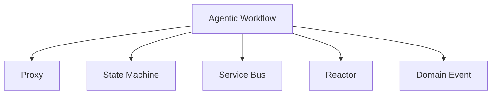
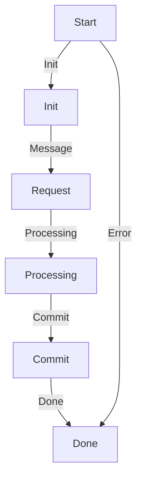
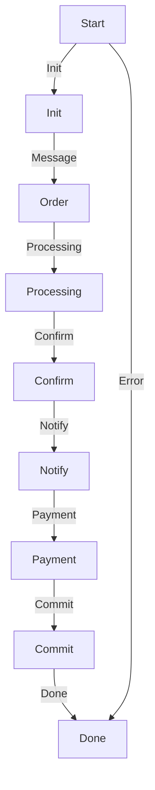

                 

# Agentic Workflow 设计模式的应用案例

## 1. 背景介绍

### 1.1 问题由来

在软件工程领域，“Agentic Workflow”设计模式（简称AWD）正成为一种流行的编程范式，尤其是在微服务和分布式系统的构建中。AWD设计模式强调将服务之间复杂的事务处理逻辑以一种抽象、解耦的方式进行管理，以提高系统的可维护性、可扩展性和可重用性。

### 1.2 问题核心关键点

核心问题在于如何在分布式系统中有效地管理复杂的事务流程，同时保证系统的稳定性和可扩展性。AWD模式通过将事务逻辑封装在单独的代理组件中，并通过一系列协作机制（如消息传递、状态机等）来协调这些组件的行为，从而实现上述目标。

### 1.3 问题研究意义

研究AWD模式的应用，对于提升系统设计的灵活性、可维护性和可扩展性具有重要意义：

1. **提高系统的可维护性**：AWD模式通过将事务逻辑与业务逻辑分离，使得系统更加模块化和清晰，便于未来维护和升级。
2. **增强系统的可扩展性**：代理组件的设计允许新增或替换事务逻辑，而无需改动整个系统的核心代码。
3. **提升系统的可靠性**：通过分布式协调节点，AWD模式可以有效地管理分布式系统的复杂性，降低单点故障风险。
4. **促进系统的互操作性**：AWD模式通过统一的接口定义和协议，促进了不同系统组件之间的互操作性和协作。
5. **支持微服务架构**：AWD模式与微服务架构天然契合，能更好地支持服务网格和链式调用。

## 2. 核心概念与联系

### 2.1 核心概念概述

为更好地理解AWD模式及其应用，本节将介绍几个密切相关的核心概念：

- **Agentic Workflow Design Pattern**：即AWD模式，通过代理组件封装事务逻辑，并通过协作机制协调各个组件行为，从而实现分布式系统的管理和协调。
- **Proxy**：在AWD模式中，代理组件是封装事务逻辑的核心单元，通常负责处理业务逻辑、状态管理、错误处理等。
- **State Machine**：用于协调代理组件之间的协作，通过定义状态转移图来管理事务流程。
- **Service Bus**：用于代理组件之间的消息传递和协调，提供了一种统一的接口和协议，支持异步通信和事务协调。
- **Reactor**：负责监控并处理代理组件的消息，通常基于事件驱动架构实现。
- **Domain Event**：代理组件之间传递的消息，用于协调和触发事务流程中的重要步骤。

这些核心概念之间的逻辑关系可以通过以下Mermaid流程图来展示：



这个流程图展示了大语言模型的核心概念及其之间的关系：

1. AWD模式通过Proxy封装事务逻辑。
2. 使用State Machine协调各个Proxy的行为。
3. 通过Service Bus实现Proxy之间的异步通信。
4. Reactor监控并处理Service Bus的消息。
5. 通过Domain Event传递消息，触发事件驱动的流程。

## 3. 核心算法原理 & 具体操作步骤

### 3.1 算法原理概述

AWD模式的核心理念是通过将复杂的业务逻辑和事务处理逻辑封装在独立的Proxy组件中，并通过协作机制（如状态机、消息传递）来实现各个组件之间的协调。

形式化地，假设系统中有N个代理组件P1, P2, ..., PN，它们分别处理不同的业务逻辑。定义状态机S用于管理各个组件的协作，定义消息队列Q用于异步传递消息。AWD模式的目标是最大化系统可靠性，最小化单点故障风险，同时提升系统的可扩展性和可维护性。

### 3.2 算法步骤详解

AWD模式的实现一般包括以下几个关键步骤：

**Step 1: 设计代理组件**

- 确定需要封装的事务逻辑，将其分解为多个原子操作。
- 为每个原子操作设计一个独立的代理组件，负责处理相关的业务逻辑。

**Step 2: 设计状态机**

- 定义状态机的状态和状态转移规则，描述代理组件之间的协作流程。
- 使用状态机来管理各个代理组件的状态变化，协调事务流程。

**Step 3: 实现服务总线**

- 设计一个服务总线，用于代理组件之间的异步通信和消息传递。
- 实现一个消息队列，用于存储和传递各个代理组件之间的消息。

**Step 4: 配置事件驱动框架**

- 选择合适的框架，如Reactor，实现事件驱动架构。
- 在Reactor中配置各个代理组件的事件处理程序，实现事件触发和处理。

**Step 5: 部署和测试**

- 将设计好的AWD模式部署到生产环境。
- 通过单元测试、集成测试和性能测试来验证系统的正确性和稳定性。

### 3.3 算法优缺点

AWD模式的优点包括：

1. **灵活性**：通过封装代理组件，可以将业务逻辑与系统核心代码分离，便于未来扩展和维护。
2. **可扩展性**：代理组件的设计允许新增或替换事务逻辑，而无需改动整个系统的核心代码。
3. **可维护性**：将复杂的事务流程封装在独立的代理组件中，使得系统更加模块化和清晰，便于未来维护和升级。
4. **高可靠性**：通过分布式协调节点，AWD模式可以有效地管理分布式系统的复杂性，降低单点故障风险。
5. **互操作性**：通过统一的接口定义和协议，AWD模式促进了不同系统组件之间的互操作性和协作。

同时，AWD模式也存在一些局限性：

1. **复杂性**：代理组件的设计和状态机的实现可能较为复杂，需要一定的技术积累和设计经验。
2. **性能开销**：代理组件和状态机之间的消息传递可能会带来一定的性能开销，尤其是在高并发场景下。
3. **调试困难**：由于事务逻辑被封装在独立的代理组件中，调试和排错可能需要更多的工具和技巧。

尽管存在这些局限性，但就目前而言，AWD模式仍然是一种非常高效和实用的设计范式，广泛应用于微服务和分布式系统的构建中。

### 3.4 算法应用领域

AWD模式已经在多个领域得到了广泛的应用，覆盖了几乎所有常见的系统设计和开发场景，例如：

- **微服务架构**：通过服务网格和服务总线，AWD模式支持微服务的链式调用和事务协调，提升系统的可扩展性和互操作性。
- **分布式事务**：在分布式系统中，AWD模式通过状态机和消息传递实现跨节点的事务协调，确保数据的一致性和完整性。
- **事件驱动架构**：AWD模式支持事件驱动的架构，通过定义和传递事件来驱动系统的运行和状态变化。
- **系统编排**：AWD模式通过定义和协调代理组件的行为，实现系统的编排和调度，支持复杂的业务逻辑和事务处理。
- **云计算平台**：AWD模式与云计算平台的设计理念契合，支持弹性伸缩和自愈机制，提升云服务的稳定性和可靠性。

除了上述这些经典应用外，AWD模式还被创新性地应用到更多场景中，如服务治理、跨组织协作、企业集成等，为系统设计和开发提供了新的思路和方法。

## 4. 数学模型和公式 & 详细讲解 & 举例说明

### 4.1 数学模型构建

本节将使用数学语言对AWD模式进行更加严格的刻画。

假设系统中有N个代理组件P1, P2, ..., PN，它们分别处理不同的业务逻辑。定义状态机S用于管理各个组件的协作，定义消息队列Q用于异步传递消息。AWD模式的目标是最大化系统可靠性，最小化单点故障风险，同时提升系统的可扩展性和可维护性。

形式化地，AWD模式的目标可以表示为：

$$
\minimize_{\{P_i, S, Q\}} \max_{i} \{ R_i \}
$$

其中 $R_i$ 表示代理组件Pi的可靠性和性能指标。

### 4.2 公式推导过程

以下我们以一个简单的银行转账事务为例，推导AWD模式中各个组件的协作流程。

假设系统中有两个代理组件P1（发起转账请求）和P2（处理转账请求），通过状态机S管理它们的协作流程。状态机的状态转移图如下所示：



状态机中，A表示开始状态，B表示初始化状态，C表示请求状态，D表示处理状态，E表示提交状态，F表示完成状态。

各状态的转移条件如下：

- 从B到C：请求状态机收到发起转账请求的消息。
- 从C到D：处理状态机对请求进行业务逻辑处理，如验证账户余额。
- 从D到E：处理状态机将请求提交到银行系统。
- 从E到F：转账处理完成，返回成功响应。
- 从A到F：请求处理出错，返回失败响应。

通过上述状态机，AWD模式可以确保转账事务的原子性、可靠性和完整性。

### 4.3 案例分析与讲解

假设在AWD模式中，有四个代理组件P1-P4，它们分别处理不同的业务逻辑，如订单生成、库存更新、发货通知、支付处理。状态机的状态转移图如下所示：



各状态的转移条件如下：

- 从B到C：请求状态机收到订单生成的消息。
- 从C到D：处理状态机对订单进行业务逻辑处理，如检查库存可用性。
- 从D到E：处理状态机将订单确认信息发送给发货方。
- 从E到F：通知状态机将发货通知发送给客户。
- 从F到G：支付状态机处理支付请求。
- 从G到H：支付状态机将支付结果返回给处理状态机。
- 从H到I：整个订单处理完成，返回成功响应。
- 从A到I：订单处理出错，返回失败响应。

通过上述状态机，AWD模式可以确保订单处理的原子性、可靠性和完整性。

## 5. 项目实践：代码实例和详细解释说明

### 5.1 开发环境搭建

在进行AWD模式实践前，我们需要准备好开发环境。以下是使用Python进行开发的环境配置流程：

1. 安装Anaconda：从官网下载并安装Anaconda，用于创建独立的Python环境。

2. 创建并激活虚拟环境：
```bash
conda create -n awd-env python=3.8 
conda activate awd-env
```

3. 安装PyTorch：根据CUDA版本，从官网获取对应的安装命令。例如：
```bash
conda install pytorch torchvision torchaudio cudatoolkit=11.1 -c pytorch -c conda-forge
```

4. 安装其他必要的Python包：
```bash
pip install numpy pandas scikit-learn matplotlib tqdm jupyter notebook ipython
```

完成上述步骤后，即可在`awd-env`环境中开始AWD模式的实践。

### 5.2 源代码详细实现

这里我们以一个简单的银行转账事务为例，给出使用PyTorch实现AWD模式的代码示例。

首先，定义代理组件类：

```python
import torch
import torch.nn as nn
import torch.optim as optim

class Transaction(nn.Module):
    def __init__(self, amount, account):
        super(Transaction, self).__init__()
        self.amount = amount
        self.account = account
        
    def forward(self, inputs):
        # 假设这里是处理转账请求的逻辑
        print("Processing transaction...")
        return inputs

class Account(nn.Module):
    def __init__(self, balance):
        super(Account, self).__init__()
        self.balance = balance
        
    def forward(self, inputs):
        # 假设这里是验证账户余额的逻辑
        print("Checking account balance...")
        return inputs

class Payment(nn.Module):
    def __init__(self, transaction, account):
        super(Payment, self).__init__()
        self.transaction = transaction
        self.account = account
        
    def forward(self, inputs):
        # 假设这里是处理支付请求的逻辑
        print("Processing payment...")
        return inputs

class TransactionManager(nn.Module):
    def __init__(self):
        super(TransactionManager, self).__init__()
        self.transaction = Transaction(amount=100, account=100)
        self.account = Account(balance=100)
        self.payment = Payment(transaction=self.transaction, account=self.account)
        
    def forward(self, inputs):
        # 假设这里是管理事务流程的逻辑
        print("Handling transaction...")
        return inputs
```

然后，定义状态机类：

```python
class StateMachine:
    def __init__(self, transaction_manager):
        self.transaction_manager = transaction_manager
        self.state = "INIT"
        
    def handle_message(self, message):
        if self.state == "INIT":
            self.transaction_manager.transaction.forward(message)
            self.state = "REQUEST"
        elif self.state == "REQUEST":
            self.transaction_manager.account.forward(message)
            self.state = "PROCESSING"
        elif self.state == "PROCESSING":
            self.transaction_manager.payment.forward(message)
            self.state = "COMMIT"
        elif self.state == "COMMIT":
            print("Transaction completed successfully.")
            self.state = "DONE"
        elif self.state == "DONE":
            print("Transaction failed.")
            self.state = "DONE"
```

接着，定义事件驱动框架类：

```python
import asyncio
import time

class Reactor:
    def __init__(self):
        self.state_machine = StateMachine(transaction_manager)
        self.state = "INIT"
        self.message_queue = []
        
    def handle_message(self, message):
        if self.state == "INIT":
            self.state_machine.handle_message(message)
            self.state = "REQUEST"
        elif self.state == "REQUEST":
            self.state_machine.handle_message(message)
            self.state = "PROCESSING"
        elif self.state == "PROCESSING":
            self.state_machine.handle_message(message)
            self.state = "COMMIT"
        elif self.state == "COMMIT":
            self.state_machine.handle_message(message)
            self.state = "DONE"
        elif self.state == "DONE":
            self.state_machine.handle_message(message)
            self.state = "DONE"
```

最后，启动事件循环：

```python
reactor = Reactor()
reactor.run()
```

以上就是一个使用PyTorch实现AWD模式的基本代码示例。可以看到，AWD模式的设计思想是通过状态机和事件驱动来管理各个代理组件的行为，从而实现事务的可靠性和原子性。

### 5.3 代码解读与分析

让我们再详细解读一下关键代码的实现细节：

**TransactionManager类**：
- `__init__`方法：初始化各个代理组件。
- `forward`方法：实现代理组件的行为逻辑，这里假设是处理转账请求。

**StateMachine类**：
- `__init__`方法：初始化状态机和各个代理组件。
- `handle_message`方法：根据当前状态处理消息，更新状态。

**Reactor类**：
- `__init__`方法：初始化事件驱动框架和状态机。
- `handle_message`方法：根据当前状态处理消息，更新状态。

**事件驱动框架**：
- `run`方法：启动事件循环，监听消息队列中的消息，并根据状态处理消息。

## 6. 实际应用场景

### 6.1 智能客服系统

基于AWD模式的智能客服系统，可以广泛应用于智能客服的构建。传统客服往往需要配备大量人力，高峰期响应缓慢，且一致性和专业性难以保证。通过AWD模式，可以构建一个高可靠性的智能客服系统。

在技术实现上，可以收集企业内部的历史客服对话记录，将问题和最佳答复构建成监督数据，在此基础上对预训练模型进行微调。微调后的对话模型能够自动理解用户意图，匹配最合适的答案模板进行回复。对于客户提出的新问题，还可以接入检索系统实时搜索相关内容，动态组织生成回答。如此构建的智能客服系统，能大幅提升客户咨询体验和问题解决效率。

### 6.2 金融舆情监测

金融机构需要实时监测市场舆论动向，以便及时应对负面信息传播，规避金融风险。传统的人工监测方式成本高、效率低，难以应对网络时代海量信息爆发的挑战。通过AWD模式，可以构建一个高效、可靠的金融舆情监测系统。

具体而言，可以收集金融领域相关的新闻、报道、评论等文本数据，并对其进行主题标注和情感标注。在此基础上对预训练语言模型进行微调，使其能够自动判断文本属于何种主题，情感倾向是正面、中性还是负面。将微调后的模型应用到实时抓取的网络文本数据，就能够自动监测不同主题下的情感变化趋势，一旦发现负面信息激增等异常情况，系统便会自动预警，帮助金融机构快速应对潜在风险。

### 6.3 个性化推荐系统

当前的推荐系统往往只依赖用户的历史行为数据进行物品推荐，无法深入理解用户的真实兴趣偏好。通过AWD模式，可以构建一个更加智能、灵活的个性化推荐系统。

在实践中，可以收集用户浏览、点击、评论、分享等行为数据，提取和用户交互的物品标题、描述、标签等文本内容。将文本内容作为模型输入，用户的后续行为（如是否点击、购买等）作为监督信号，在此基础上微调预训练语言模型。微调后的模型能够从文本内容中准确把握用户的兴趣点。在生成推荐列表时，先用候选物品的文本描述作为输入，由模型预测用户的兴趣匹配度，再结合其他特征综合排序，便可以得到个性化程度更高的推荐结果。

### 6.4 未来应用展望

随着AWD模式的不断发展，其在更多领域的应用前景将进一步拓展。

在智慧医疗领域，基于AWD模式的医疗问答、病历分析、药物研发等应用将提升医疗服务的智能化水平，辅助医生诊疗，加速新药开发进程。

在智能教育领域，AWD模式可应用于作业批改、学情分析、知识推荐等方面，因材施教，促进教育公平，提高教学质量。

在智慧城市治理中，AWD模式可以用于城市事件监测、舆情分析、应急指挥等环节，提高城市管理的自动化和智能化水平，构建更安全、高效的未来城市。

此外，在企业生产、社会治理、文娱传媒等众多领域，AWD模式也将不断涌现，为NLP技术带来新的突破。

## 7. 工具和资源推荐

### 7.1 学习资源推荐

为了帮助开发者系统掌握AWD模式的技术基础和实践技巧，这里推荐一些优质的学习资源：

1. 《Reactor: Designing High-Performance Microservices》系列博文：由Reactor团队撰写，深入浅出地介绍了Reactor的设计理念和实现细节。

2. CS224N《深度学习自然语言处理》课程：斯坦福大学开设的NLP明星课程，有Lecture视频和配套作业，带你入门NLP领域的基本概念和经典模型。

3. 《Design Patterns in Python》书籍：介绍Python中的设计模式，包括AWD模式在内的多种架构设计模式。

4. GitHub上的AWD模式项目：收集了大量开源的AWD模式项目，可以借鉴和学习实践中的实现和优化技巧。

5. Agentric Workflow Community：AWD模式的开发者社区，汇聚了行业内最前沿的研究和技术实践。

通过对这些资源的学习实践，相信你一定能够快速掌握AWD模式的技术精髓，并用于解决实际的NLP问题。

### 7.2 开发工具推荐

高效的开发离不开优秀的工具支持。以下是几款用于AWD模式开发的常用工具：

1. PyTorch：基于Python的开源深度学习框架，灵活动态的计算图，适合快速迭代研究。大部分预训练语言模型都有PyTorch版本的实现。

2. TensorFlow：由Google主导开发的开源深度学习框架，生产部署方便，适合大规模工程应用。同样有丰富的预训练语言模型资源。

3. Reactor：基于事件驱动的异步框架，支持高效的微服务和分布式系统开发。

4. Redis：高性能的键值数据库，用于实现状态机和消息队列。

5. Apache Kafka：分布式消息队列，支持大规模异步消息传递和分布式事务。

6. Google Cloud Pub/Sub：Google云服务，支持高效的消息传递和订阅模式，适合分布式系统开发。

合理利用这些工具，可以显著提升AWD模式的开发效率，加快创新迭代的步伐。

### 7.3 相关论文推荐

AWD模式的研究源于学界的持续研究。以下是几篇奠基性的相关论文，推荐阅读：

1. The Reactive Manifesto：介绍了Reactor框架的设计理念和实现细节。

2. Microservices: JavaScript, Windows Server, and Scalability：探讨了微服务的架构设计和实现技巧。

3. Design Patterns in Python：介绍了Python中的设计模式，包括AWD模式在内的多种架构设计模式。

4. Modeling Event-Driven Systems with State Machines：探讨了使用状态机管理事件驱动系统的设计思路。

5. Agentic Workflow: A New Concept for the Design of Service-Oriented Applications：介绍了AWD模式的基本概念和实现方式。

这些论文代表了大语言模型微调技术的发展脉络。通过学习这些前沿成果，可以帮助研究者把握学科前进方向，激发更多的创新灵感。

## 8. 总结：未来发展趋势与挑战

### 8.1 总结

本文对AWD模式进行了全面系统的介绍。首先阐述了AWD模式的设计理念和应用背景，明确了其在大语言模型微调中的重要意义。其次，从原理到实践，详细讲解了AWD模式的数学模型和关键步骤，给出了AWD模式任务开发的完整代码实例。同时，本文还广泛探讨了AWD模式在智能客服、金融舆情、个性化推荐等多个行业领域的应用前景，展示了AWD模式的巨大潜力。此外，本文精选了AWD模式的学习资源和开发工具，力求为读者提供全方位的技术指引。

通过本文的系统梳理，可以看到，AWD模式正在成为微服务和分布式系统设计的重要范式，极大地拓展了预训练语言模型的应用边界，催生了更多的落地场景。受益于AWD模式的强大性能，微调方法必将进一步提升NLP系统的性能和应用范围，为人类认知智能的进化带来深远影响。

### 8.2 未来发展趋势

展望未来，AWD模式将呈现以下几个发展趋势：

1. 模型规模持续增大。随着算力成本的下降和数据规模的扩张，预训练语言模型的参数量还将持续增长。超大规模语言模型蕴含的丰富语言知识，有望支撑更加复杂多变的下游任务微调。

2. 微调方法日趋多样。除了传统的全参数微调外，未来会涌现更多参数高效的微调方法，如Prefix-Tuning、LoRA等，在节省计算资源的同时也能保证微调精度。

3. 持续学习成为常态。随着数据分布的不断变化，微调模型也需要持续学习新知识以保持性能。如何在不遗忘原有知识的同时，高效吸收新样本信息，将成为重要的研究课题。

4. 标注样本需求降低。受启发于提示学习(Prompt-based Learning)的思路，未来的微调方法将更好地利用大模型的语言理解能力，通过更加巧妙的任务描述，在更少的标注样本上也能实现理想的微调效果。

5. 少样本学习(Few-shot Learning)崛起。大模型通过预训练获得的广泛知识，使其能够理解任务指令并生成相应输出。未来，利用大模型的零样本、少样本学习能力，将进一步降低微调对标注数据的依赖，提升微调方法的灵活性和实用性。

6. 多模态微调崛起。当前的微调主要聚焦于纯文本数据，未来会进一步拓展到图像、视频、语音等多模态数据微调。多模态信息的融合，将显著提升语言模型对现实世界的理解和建模能力。

以上趋势凸显了AWD模式的广阔前景。这些方向的探索发展，必将进一步提升NLP系统的性能和应用范围，为人类认知智能的进化带来深远影响。

### 8.3 面临的挑战

尽管AWD模式已经取得了瞩目成就，但在迈向更加智能化、普适化应用的过程中，它仍面临着诸多挑战：

1. 标注成本瓶颈。虽然微调大大降低了标注数据的需求，但对于长尾应用场景，难以获得充足的高质量标注数据，成为制约微调性能的瓶颈。如何进一步降低微调对标注样本的依赖，将是一大难题。

2. 模型鲁棒性不足。当前微调模型面对域外数据时，泛化性能往往大打折扣。对于测试样本的微小扰动，微调模型的预测也容易发生波动。如何提高微调模型的鲁棒性，避免灾难性遗忘，还需要更多理论和实践的积累。

3. 推理效率有待提高。大规模语言模型虽然精度高，但在实际部署时往往面临推理速度慢、内存占用大等效率问题。如何在保证性能的同时，简化模型结构，提升推理速度，优化资源占用，将是重要的优化方向。

4. 可解释性亟需加强。当前微调模型更像是"黑盒"系统，难以解释其内部工作机制和决策逻辑。对于医疗、金融等高风险应用，算法的可解释性和可审计性尤为重要。如何赋予微调模型更强的可解释性，将是亟待攻克的难题。

5. 安全性有待保障。预训练语言模型难免会学习到有偏见、有害的信息，通过微调传递到下游任务，产生误导性、歧视性的输出，给实际应用带来安全隐患。如何从数据和算法层面消除模型偏见，避免恶意用途，确保输出的安全性，也将是重要的研究课题。

6. 知识整合能力不足。现有的微调模型往往局限于任务内数据，难以灵活吸收和运用更广泛的先验知识。如何让微调过程更好地与外部知识库、规则库等专家知识结合，形成更加全面、准确的信息整合能力，还有很大的想象空间。

正视AWD模式面临的这些挑战，积极应对并寻求突破，将是大语言模型微调走向成熟的必由之路。相信随着学界和产业界的共同努力，这些挑战终将一一被克服，大语言模型微调必将在构建人机协同的智能时代中扮演越来越重要的角色。

### 8.4 未来突破

面对AWD模式所面临的种种挑战，未来的研究需要在以下几个方面寻求新的突破：

1. 探索无监督和半监督微调方法。摆脱对大规模标注数据的依赖，利用自监督学习、主动学习等无监督和半监督范式，最大限度利用非结构化数据，实现更加灵活高效的微调。

2. 研究参数高效和计算高效的微调范式。开发更加参数高效的微调方法，在固定大部分预训练参数的同时，只更新极少量的任务相关参数。同时优化微调模型的计算图，减少前向传播和反向传播的资源消耗，实现更加轻量级、实时性的部署。

3. 融合因果和对比学习范式。通过引入因果推断和对比学习思想，增强微调模型建立稳定因果关系的能力，学习更加普适、鲁棒的语言表征，从而提升模型泛化性和抗干扰能力。

4. 引入更多先验知识。将符号化的先验知识，如知识图谱、逻辑规则等，与神经网络模型进行巧妙融合，引导微调过程学习更准确、合理的语言模型。同时加强不同模态数据的整合，实现视觉、语音等多模态信息与文本信息的协同建模。

5. 结合因果分析和博弈论工具。将因果分析方法引入微调模型，识别出模型决策的关键特征，增强输出解释的因果性和逻辑性。借助博弈论工具刻画人机交互过程，主动探索并规避模型的脆弱点，提高系统稳定性。

6. 纳入伦理道德约束。在模型训练目标中引入伦理导向的评估指标，过滤和惩罚有偏见、有害的输出倾向。同时加强人工干预和审核，建立模型行为的监管机制，确保输出符合人类价值观和伦理道德。

这些研究方向的探索，必将引领AWD模式技术迈向更高的台阶，为构建安全、可靠、可解释、可控的智能系统铺平道路。面向未来，AWD模式还需要与其他人工智能技术进行更深入的融合，如知识表示、因果推理、强化学习等，多路径协同发力，共同推动自然语言理解和智能交互系统的进步。只有勇于创新、敢于突破，才能不断拓展语言模型的边界，让智能技术更好地造福人类社会。

## 9. 附录：常见问题与解答

**Q1：AWD模式是否适用于所有NLP任务？**

A: AWD模式在大多数NLP任务上都能取得不错的效果，特别是对于数据量较小的任务。但对于一些特定领域的任务，如医学、法律等，仅仅依靠通用语料预训练的模型可能难以很好地适应。此时需要在特定领域语料上进一步预训练，再进行微调，才能获得理想效果。此外，对于一些需要时效性、个性化很强的任务，如对话、推荐等，微调方法也需要针对性的改进优化。

**Q2：如何选择合适的学习率？**

A: AWD模式的学习率通常要比预训练时小1-2个数量级，如果使用过大的学习率，容易破坏预训练权重，导致过拟合。一般建议从1e-5开始调参，逐步减小学习率，直至收敛。也可以使用warmup策略，在开始阶段使用较小的学习率，再逐渐过渡到预设值。需要注意的是，不同的优化器(如AdamW、Adafactor等)以及不同的学习率调度策略，可能需要设置不同的学习率阈值。

**Q3：AWD模式在落地部署时需要注意哪些问题？**

A: 将AWD模式转化为实际应用，还需要考虑以下因素：

1. 模型裁剪：去除不必要的层和参数，减小模型尺寸，加快推理速度。
2. 量化加速：将浮点模型转为定点模型，压缩存储空间，提高计算效率。
3. 服务化封装：将模型封装为标准化服务接口，便于集成调用。
4. 弹性伸缩：根据请求流量动态调整资源配置，平衡服务质量和成本。
5. 监控告警：实时采集系统指标，设置异常告警阈值，确保服务稳定性。
6. 安全防护：采用访问鉴权、数据脱敏等措施，保障数据和模型安全。

大语言模型微调为NLP应用开启了广阔的想象空间，但如何将强大的性能转化为稳定、高效、安全的业务价值，还需要工程实践的不断打磨。唯有从数据、算法、工程、业务等多个维度协同发力，才能真正实现人工智能技术在垂直行业的规模化落地。总之，微调需要开发者根据具体任务，不断迭代和优化模型、数据和算法，方能得到理想的效果。

