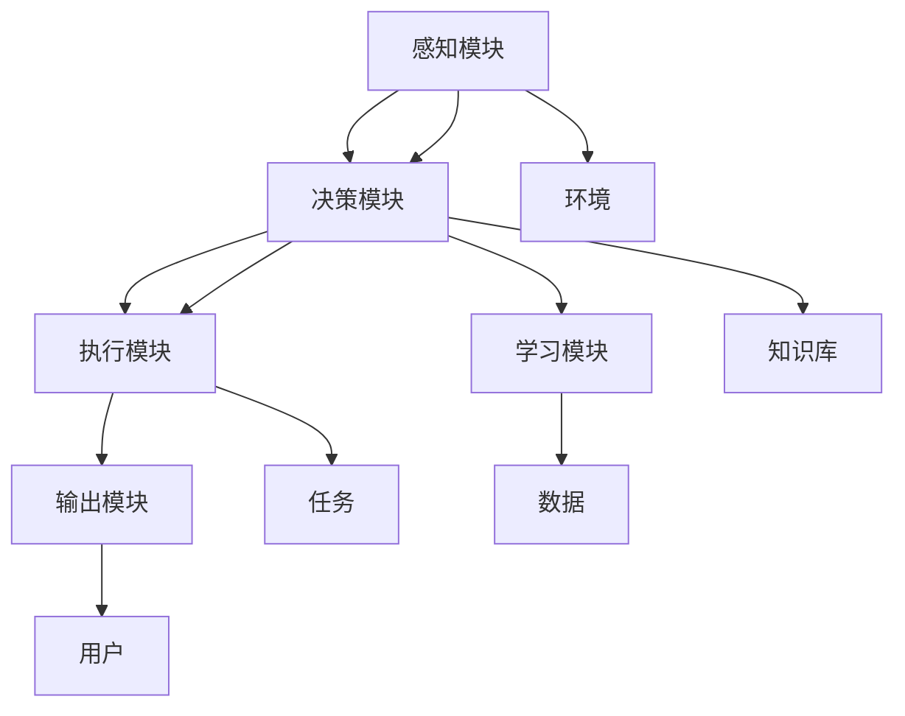

                 

# Agent代理在AI中的重要性

## 1. 背景介绍

随着人工智能(AI)技术的不断发展，代理(Agent)作为一种能够自主执行特定任务的软件实体，逐渐成为AI应用中不可或缺的一部分。从简单的自动化脚本到复杂的智能决策系统，代理在各类领域展示了其强大的功能与潜力。但随着应用的不断深入，代理在AI中的重要性逐渐显现，其在提升系统效能、增强用户体验以及实现更复杂的任务处理方面的价值日益凸显。本文将从多个角度深入探讨代理在AI中的重要性，分析其关键特性与潜在价值，同时展望未来发展趋势。

## 2. 核心概念与联系

### 2.1 核心概念概述

要全面理解代理在AI中的重要性，首先需明确其核心概念与基本原理。

**代理**（Agent）：是一种能感知环境、执行决策并采取相应行动的软件实体。代理能够接收输入、处理信息并生成输出，是实现智能化任务处理的关键组件。

**AI**：人工智能，指的是通过计算机程序模拟人类智能过程的能力，包括感知、推理、学习等能力。代理作为AI应用的重要组成部分，能够将AI技术与现实世界的具体需求相结合，实现高效的智能化处理。

**自适应系统**：具备环境感知与智能决策能力的系统，能够根据环境变化动态调整策略和行为，实现更优的系统性能。

**分布式系统**：由多个代理或模块组成的协同工作系统，能够实现更复杂的任务处理和资源管理。

**自主性**：指代理能够自主执行任务，不需要外部干预，具有较高的决策自主性和任务执行能力。

**可解释性**：指代理的决策过程和行为逻辑能够被理解与解释，便于调试和优化。

这些核心概念相互关联，共同构成了代理在AI应用中的基础框架。通过理解这些概念，我们可以更好地把握代理的功能与价值，进而探讨其在AI中的重要性。

### 2.2 核心概念原理和架构的 Mermaid 流程图



上述流程图展示了代理的基本架构和工作流程。代理首先通过感知模块获取环境信息，接着将信息传递给决策模块，基于预设的规则和知识库进行决策，生成相应的执行指令。执行模块根据指令执行任务，并将结果通过输出模块反馈给用户。同时，学习模块根据任务反馈进行自我调整，更新知识库，以提升代理的智能化水平。

## 3. 核心算法原理 & 具体操作步骤

### 3.1 算法原理概述

代理在AI中的重要性，主要体现在其在任务处理、资源管理和智能决策方面的强大能力。其核心算法原理可以概括为感知、决策、执行与学习四个关键步骤，通过这些步骤实现智能化的任务处理。

**感知**：代理通过传感器或输入接口获取环境信息，如自然语言、图像、传感器数据等，构建出环境的感知模型。

**决策**：代理基于感知信息，利用决策算法（如规则系统、贝叶斯网络、神经网络等）进行智能决策，制定行动策略。

**执行**：代理根据决策结果，通过执行器执行具体的任务操作，如自然语言生成、图像处理、机器人控制等。

**学习**：代理通过数据分析和模型训练，不断优化自身的感知、决策与执行能力，提升智能化水平。

### 3.2 算法步骤详解

#### 3.2.1 感知模块设计

感知模块是代理的核心组件之一，负责获取并理解环境信息。其设计需考虑以下因素：

- **输入类型**：代理需要支持多种类型的输入数据，如文本、图像、声音等。
- **环境理解**：代理需要能够解析输入数据，理解其语义和结构。
- **信息提取**：代理需要具备高效的信息提取能力，以便后续决策和执行。

#### 3.2.2 决策模块实现

决策模块是代理的“大脑”，负责制定行动策略。其设计需考虑以下因素：

- **规则系统**：基于规则的决策系统能够快速响应特定场景，但难以处理复杂问题。
- **概率模型**：基于概率模型的决策系统能够处理不确定性，但计算复杂度较高。
- **神经网络**：基于神经网络的决策系统能够处理复杂数据，具有较强的学习能力和泛化能力。

#### 3.2.3 执行模块配置

执行模块负责将决策转化为具体行动。其设计需考虑以下因素：

- **执行器选择**：选择适合的执行器（如自然语言处理引擎、图像处理库、机器人控制模块等）。
- **任务管理**：合理管理并发任务，确保执行效率和资源利用率。
- **输出反馈**：对执行结果进行反馈，以便感知模块更新感知模型。

#### 3.2.4 学习模块优化

学习模块负责代理的自我优化和提升。其设计需考虑以下因素：

- **数据来源**：收集和整理环境数据，作为学习的基础。
- **模型训练**：选择合适的模型和算法，进行高效的训练。
- **反馈机制**：建立有效的反馈机制，以指导学习过程。

### 3.3 算法优缺点

**优点**：

1. **任务处理能力强**：代理能够高效处理复杂任务，具有较强的适应性和灵活性。
2. **资源管理优化**：代理能够动态调整资源配置，实现更优的资源利用。
3. **智能决策**：代理基于感知与学习，具备较强的自主决策能力。
4. **扩展性强**：代理能够通过模块化设计，扩展和定制功能。

**缺点**：

1. **复杂度较高**：代理的设计与实现涉及多方面的知识和技能，复杂度较高。
2. **可解释性不足**：代理的决策过程可能难以解释，难以调试和优化。
3. **依赖数据**：代理的效果很大程度上依赖于数据质量和数量，数据获取成本较高。
4. **安全风险**：代理在执行决策时可能面临安全性问题，需要额外的安全措施。

### 3.4 算法应用领域

代理在AI中的应用领域非常广泛，涵盖多个行业和领域，具体包括：

- **智能客服**：代理可以通过自然语言处理技术，与用户进行自然对话，解决用户问题，提升客户满意度。
- **机器人控制**：代理能够控制机器人执行复杂任务，如导航、操作、监控等，实现自动化作业。
- **智能推荐系统**：代理可以根据用户行为和偏好，推荐个性化内容，提升用户体验。
- **自动驾驶**：代理能够感知环境信息，进行路径规划和决策，实现智能驾驶。
- **金融分析**：代理能够处理大量金融数据，进行市场分析、风险评估等，提供智能决策支持。
- **医疗诊断**：代理能够处理医疗数据，辅助医生进行诊断和治疗决策。

## 4. 数学模型和公式 & 详细讲解 & 举例说明

### 4.1 数学模型构建

为了更严谨地描述代理的感知、决策、执行与学习过程，我们可以通过数学模型来表示。以下是一个简单的代理决策模型：

设代理的环境状态为 $x \in \mathcal{X}$，决策策略为 $u \in \mathcal{U}$，输出结果为 $y \in \mathcal{Y}$。代理的决策过程可以用如下公式描述：

$$
y = f(x, u)
$$

其中 $f$ 为决策函数，将环境状态 $x$ 和决策策略 $u$ 映射到输出结果 $y$。

### 4.2 公式推导过程

对于上述决策模型，我们可以进一步细化其各个组成部分：

- **感知模块**：通过传感器或输入接口，获取环境状态 $x$。
- **决策模块**：根据感知结果 $x$，选择决策策略 $u$。
- **执行模块**：执行决策策略 $u$，生成输出结果 $y$。
- **学习模块**：根据输出结果 $y$，更新决策策略 $u$。

通过这些子模型，我们可以建立完整的代理决策框架。

### 4.3 案例分析与讲解

以下是一个简单的代理决策案例，用于展示代理的决策过程：

**案例描述**：假设代理的任务是控制一个智能家居系统，根据室内温度和湿度调整空调和加湿器。

1. **感知模块**：代理通过温度和湿度传感器获取室内环境数据，即 $x = (T, H)$，其中 $T$ 为温度，$H$ 为湿度。
2. **决策模块**：代理根据预设的规则，判断是否需要调整空调和加湿器，决策策略为 $u = (S, H)$，其中 $S$ 为空调状态（开或关），$H$ 为加湿器状态（开或关）。
3. **执行模块**：代理通过智能家居控制接口，执行决策策略，调整空调和加湿器。
4. **学习模块**：代理根据调整后的室内环境数据 $y = (T', H')$，更新决策规则，以提升决策准确性。

## 5. 项目实践：代码实例和详细解释说明

### 5.1 开发环境搭建

为了进行代理的开发与测试，需要搭建相应的开发环境。以下是搭建开发环境的基本步骤：

1. **选择开发语言**：选择适合的编程语言，如Python、Java、C++等。
2. **安装开发工具**：安装必要的开发工具，如IDE、版本控制系统等。
3. **设置依赖库**：配置项目的依赖库，确保代理所需模块和库能够正常运行。
4. **环境优化**：优化环境配置，确保代理高效运行。

### 5.2 源代码详细实现

以下是一个简单的代理决策代码实现，用于控制智能家居系统：

```python
import time

class Agent:
    def __init__(self, temperature_threshold, humidity_threshold):
        self.temperature_threshold = temperature_threshold
        self.humidity_threshold = humidity_threshold
        self空调状态 = "关闭"
        self加湿器状态 = "关闭"
    
    def 感知环境(self, 温度, 湿度):
        if 温度 > self.temperature_threshold or 湿度 > self.humidity_threshold:
            return True
        else:
            return False
    
    def 决策策略(self, 感知结果):
        if 感知结果:
            self.空调状态 = "开启"
            self加湿器状态 = "开启"
        else:
            self.空调状态 = "关闭"
            self加湿器状态 = "关闭"
    
    def 执行控制(self):
        # 模拟控制智能家居系统
        time.sleep(2)
    
    def 学习优化(self, 温度, 湿度):
        if self.感知环境(温度, 湿度):
            self.决策策略(感知结果)
            self.执行控制()
        else:
            self.空调状态 = "关闭"
            self加湿器状态 = "关闭"
    
    def 运行代理(self):
        while True:
            环境数据 = 获取环境数据()
            self.学习优化(环境数据[0], 环境数据[1])
    
# 运行代理
if __name__ == "__main__":
    agent = Agent(温度阈值, 湿度阈值)
    agent.运行代理()
```

### 5.3 代码解读与分析

**代码实现**：

- **类定义**：定义了一个 `Agent` 类，用于表示代理的决策与执行过程。
- **初始化方法**：初始化代理的阈值和状态。
- **感知环境方法**：根据预设的阈值，感知当前环境数据。
- **决策策略方法**：根据感知结果，选择决策策略。
- **执行控制方法**：模拟控制智能家居系统。
- **学习优化方法**：根据环境数据更新决策策略和执行控制。
- **运行代理方法**：无限循环运行代理，动态调整状态。

**代码分析**：

- **类封装**：通过类封装代理的决策与执行过程，使其具有更好的模块化和复用性。
- **状态管理**：通过类属性管理代理的状态，便于决策和执行。
- **动态决策**：代理能够根据环境数据动态调整决策策略，适应环境变化。
- **模拟控制**：通过模拟控制实现代理的执行功能。

### 5.4 运行结果展示

运行上述代码，代理会根据环境数据动态调整空调和加湿器状态，控制智能家居系统。以下是一个简单的运行示例：

```python
# 代理运行示例
agent = Agent(20, 60)
agent.运行代理()

# 运行结果
# 初始状态：空调关闭，加湿器关闭
# 环境数据：当前温度25度，当前湿度65%
# 感知结果：True
# 决策策略：空调开启，加湿器开启
# 执行控制
# 环境数据：当前温度22度，当前湿度55%
# 感知结果：True
# 决策策略：空调开启，加湿器开启
# 执行控制
# 环境数据：当前温度18度，当前湿度50%
# 感知结果：False
# 决策策略：空调关闭，加湿器关闭
# 执行控制
```

## 6. 实际应用场景

### 6.1 智能客服系统

智能客服系统是代理在AI应用中的一个典型案例。通过代理，客服机器人能够与用户进行自然对话，解答用户问题，提升客户满意度。

**应用场景**：智能客服系统通过自然语言处理技术，将用户输入的文本信息转换为结构化数据，并根据预设的规则和知识库，生成自然语言回复。

**技术实现**：

1. **感知模块**：通过自然语言处理技术，解析用户输入文本。
2. **决策模块**：根据知识库和规则，选择适当的回复策略。
3. **执行模块**：生成自然语言回复，并通过客服系统与用户交互。
4. **学习模块**：根据用户反馈，更新知识库和规则，提升回复质量。

**优势**：

1. **全天候服务**：代理能够7x24小时不间断工作，提供持续的客户服务。
2. **高效响应**：代理能够快速理解用户问题，并给出准确回复。
3. **成本节约**：通过代理，企业可以减少客服人员，降低人力成本。

### 6.2 机器人控制

机器人控制是代理在AI应用的另一个典型案例。通过代理，机器人能够自主执行复杂任务，提升自动化作业的效率和精度。

**应用场景**：机器人代理能够感知环境信息，执行导航、操作、监控等任务，实现自动化作业。

**技术实现**：

1. **感知模块**：通过传感器获取环境信息，如位置、温度、湿度等。
2. **决策模块**：根据预设的规则和路径规划算法，选择动作策略。
3. **执行模块**：通过机器人控制接口，执行动作。
4. **学习模块**：根据环境反馈，优化路径规划和动作策略。

**优势**：

1. **高精度操作**：代理能够精确感知和控制环境，实现复杂操作。
2. **自主决策**：代理具备自主决策能力，能够应对突发情况。
3. **任务多样性**：代理能够适应多种任务，提高自动化作业的灵活性。

### 6.3 智能推荐系统

智能推荐系统是代理在AI应用的另一个重要案例。通过代理，推荐系统能够根据用户行为和偏好，推荐个性化内容，提升用户体验。

**应用场景**：推荐系统代理能够感知用户行为，选择推荐策略，生成推荐结果。

**技术实现**：

1. **感知模块**：通过用户行为数据获取用户偏好。
2. **决策模块**：根据推荐算法选择推荐策略。
3. **执行模块**：生成推荐结果，并通过推荐系统展示给用户。
4. **学习模块**：根据用户反馈，优化推荐策略。

**优势**：

1. **个性化推荐**：代理能够根据用户行为，推荐个性化内容，提升用户体验。
2. **实时更新**：代理能够根据实时数据，动态调整推荐策略。
3. **数据利用**：代理能够高效利用用户数据，提升推荐系统的效率和准确性。

### 6.4 自动驾驶

自动驾驶是代理在AI应用中的前沿案例。通过代理，自动驾驶系统能够感知环境信息，进行路径规划和决策，实现智能驾驶。

**应用场景**：自动驾驶代理能够感知车辆和道路环境，选择最优路径，执行驾驶操作。

**技术实现**：

1. **感知模块**：通过传感器获取车辆和道路信息，如车速、位置、交通信号等。
2. **决策模块**：根据交通规则和环境信息，选择最优路径和驾驶策略。
3. **执行模块**：通过车辆控制接口，执行驾驶操作。
4. **学习模块**：根据驾驶反馈，优化路径规划和驾驶策略。

**优势**：

1. **高安全性**：代理能够感知和应对复杂环境，确保驾驶安全。
2. **自主决策**：代理具备自主决策能力，能够应对突发情况。
3. **高效率**：代理能够高效处理交通数据，提升驾驶效率。

## 7. 工具和资源推荐

### 7.1 学习资源推荐

为了帮助开发者掌握代理在AI中的相关知识和技能，以下是一些推荐的学习资源：

1. **《人工智能基础》课程**：通过在线课程学习人工智能的基本概念和原理，了解代理在AI中的作用。
2. **《Agent-based Modeling》书籍**：深入介绍代理建模的理论和应用，涵盖感知、决策、执行与学习等方面。
3. **《Reinforcement Learning for Robotics》书籍**：介绍代理在机器人控制中的应用，涵盖感知、决策和执行等关键技术。
4. **《NLP with Transformers》书籍**：介绍代理在自然语言处理中的应用，涵盖感知、决策和执行等关键技术。
5. **Kaggle平台**：提供大量的代理相关竞赛数据和案例，通过实践提升技能。

### 7.2 开发工具推荐

以下是一些常用的代理开发工具：

1. **Python语言**：Python具有简洁、易用的特点，广泛应用于代理开发。
2. **TensorFlow框架**：用于代理的感知和决策模块开发，支持高效的深度学习和神经网络模型训练。
3. **OpenCV库**：用于代理的图像感知和处理模块开发，支持图像处理和计算机视觉任务。
4. **Ros（Robot Operating System）**：用于代理的机器人控制模块开发，支持机器人硬件控制和感知。
5. **TensorBoard工具**：用于代理的模型训练和优化模块开发，支持可视化训练过程和结果。

### 7.3 相关论文推荐

以下是几篇经典的代理相关论文，推荐阅读：

1. **《Autonomous Agents in Multi-agent Systems》**：介绍自主代理在多智能体系统中的应用，涵盖感知、决策和执行等方面。
2. **《Hierarchical Multi-agent Reinforcement Learning》**：介绍层次化多智能体强化学习，用于复杂任务中的代理决策优化。
3. **《Deep Reinforcement Learning for Autonomous Driving》**：介绍深度强化学习在自动驾驶中的应用，涵盖感知、决策和执行等方面。
4. **《Natural Language Processing with Transformers》**：介绍自然语言处理中的代理技术，涵盖感知、决策和执行等方面。

## 8. 总结：未来发展趋势与挑战

### 8.1 总结

本文从多个角度深入探讨了代理在AI中的重要性，分析了其核心概念和基本原理，并通过数学模型和案例分析进一步阐述了代理的决策与执行过程。代理在智能客服、机器人控制、智能推荐、自动驾驶等实际应用中，展现了其强大的功能和潜力。通过本文的系统梳理，可以看出代理在AI中的重要性，未来仍需不断优化和扩展其功能，以适应更复杂的应用场景。

### 8.2 未来发展趋势

展望未来，代理在AI中的应用将呈现以下几个发展趋势：

1. **自主性增强**：代理将具备更强的自主决策能力，能够在更加复杂的环境中执行任务。
2. **协作与协同**：代理将通过协作与协同，实现更高效的资源管理和任务分配。
3. **多模态融合**：代理将融合多种数据模态（如视觉、声音、文本等），提升智能化水平。
4. **自适应学习**：代理将具备自适应学习能力，能够根据环境变化动态调整策略。
5. **伦理与隐私**：代理将考虑伦理与隐私问题，确保数据和决策的安全性。

### 8.3 面临的挑战

尽管代理在AI中的应用前景广阔，但也面临一些挑战：

1. **复杂度提高**：代理系统的复杂度不断增加，设计、实现与维护难度加大。
2. **数据依赖**：代理的性能很大程度上依赖于数据质量，数据获取成本较高。
3. **安全风险**：代理在执行决策时可能面临安全性问题，需要额外的安全措施。
4. **可解释性不足**：代理的决策过程可能难以解释，难以调试和优化。

### 8.4 研究展望

面对代理在AI应用中的挑战，未来的研究需要在以下几个方面寻求新的突破：

1. **简化设计**：通过模块化设计和组件化，简化代理系统的设计和实现。
2. **优化数据**：通过数据增强、数据预处理等技术，提升代理的泛化能力。
3. **增强安全**：通过加密、匿名化等技术，确保代理数据的安全性。
4. **提升可解释性**：通过模型解释和调试工具，提升代理决策的可解释性。

通过这些研究方向和突破，相信代理在AI中的应用将更加广泛，进一步提升智能化系统的性能和可靠性。总之，代理作为AI应用的重要组成部分，其重要性将日益凸显，未来必将为人工智能技术的深度应用开辟新的广阔天地。

## 9. 附录：常见问题与解答

**Q1: 代理在AI中扮演什么角色？**

A: 代理在AI中扮演着感知、决策和执行的角色。通过感知环境信息，选择最优决策策略，并执行相应的任务操作，代理能够高效处理复杂任务，提升智能化系统的性能。

**Q2: 代理的感知模块有哪些关键技术？**

A: 代理的感知模块通常包括传感器数据获取、环境信息解析、特征提取等关键技术。通过这些技术，代理能够准确感知环境信息，为后续决策和执行提供基础。

**Q3: 代理的决策模块有哪些关键技术？**

A: 代理的决策模块通常包括规则系统、概率模型、神经网络等关键技术。通过这些技术，代理能够基于感知信息，选择最优决策策略，进行智能决策。

**Q4: 代理的执行模块有哪些关键技术？**

A: 代理的执行模块通常包括执行器选择、任务管理、输出反馈等关键技术。通过这些技术，代理能够高效执行任务操作，并将结果反馈给感知模块，实现闭环处理。

**Q5: 代理的学习模块有哪些关键技术？**

A: 代理的学习模块通常包括数据收集、模型训练、反馈机制等关键技术。通过这些技术，代理能够不断优化自身的感知、决策与执行能力，提升智能化水平。

**Q6: 代理在AI中面临哪些挑战？**

A: 代理在AI中面临的主要挑战包括复杂度提高、数据依赖、安全风险、可解释性不足等。为了应对这些挑战，需要在设计、实现与优化等方面进行全面的改进和优化。

作者：禅与计算机程序设计艺术 / Zen and the Art of Computer Programming

