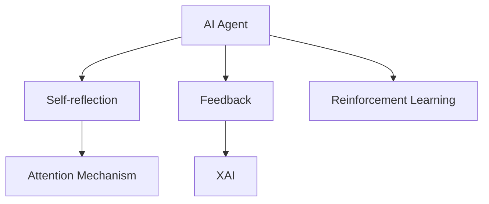

                 

# Agent能够通过自我反思和反馈来改进执行，同时提供可观察性

## 1. 背景介绍

### 1.1 问题由来

在人工智能(AI)领域，智能体(Agent)的作用日益凸显。从游戏AI到机器人，再到自然语言处理(NLP)系统，Agent广泛应用于各种复杂环境。然而，传统的AIAgent大多基于规则或特征工程，难以应对环境变化和复杂决策场景。近年来，基于深度学习的End-to-End学习方式逐渐成为主流，AI Agent能够自主学习，自动优化执行策略，显著提升了其在复杂环境下的适应性和决策能力。

但是，AI Agent的学习过程缺乏直观的反馈机制和自我反思机制，往往在不断尝试中陷入局部最优，难以发现并纠正自身错误，导致其在实际应用中效果不尽人意。为了解决这个问题，研究人员开始探索如何构建具有自我反思和反馈机制的AI Agent，使其在不断改进执行的同时，提供可观察性，便于人类理解和调试。

### 1.2 问题核心关键点

构建具有自我反思和反馈机制的AI Agent，需要解决以下几个核心问题：

1. **自我反思机制**：使Agent能够自动从执行结果中提取经验，并自我评估执行策略的有效性。
2. **反馈机制**：设计合理的外部反馈系统，使Agent能够根据外部反馈调整策略。
3. **可观察性**：提供透明化的执行过程和决策逻辑，便于人类理解和调试。

## 2. 核心概念与联系

### 2.1 核心概念概述

为更好地理解基于自我反思和反馈机制的AI Agent，本节将介绍几个关键概念：

- **AI Agent**：在复杂环境中进行自主决策的智能体，可以基于规则、策略、深度学习等多种方法构建。
- **Self-reflection**：AI Agent自主从执行结果中提取经验，并评估执行策略的有效性。
- **Feedback**：通过外部环境或系统对AI Agent的决策结果进行评价，使其根据反馈调整策略。
- **Reinforcement Learning (RL)**：一种基于奖励反馈的AI训练方法，使Agent在不断尝试中学习最优策略。
- ** Explainable AI (XAI)**：提供透明化和可解释性的AI技术，使人类能够理解和调试AI模型的决策过程。
- **Attention Mechanism**：一种机制，使AI Agent能够聚焦关键信息，提升决策效率和准确性。

这些概念之间的逻辑关系可以通过以下Mermaid流程图来展示：



这个流程图展示了下述逻辑关系：

1. AI Agent从自监督和外部反馈中学习。
2. Self-reflection机制使Agent自主评估和反思。
3. Feedback系统为Agent提供外部指导。
4. 结合Attention机制，提高Agent的决策效率。
5. XAI技术提升Agent的可观察性和可解释性。

## 3. 核心算法原理 & 具体操作步骤
### 3.1 算法原理概述

基于自我反思和反馈机制的AI Agent，主要通过强化学习(RL)框架来实现。强化学习通过奖励反馈机制，使Agent在不断尝试中学习最优策略。同时，自我反思机制和可观察性提升技术使Agent能够自我评估和解释其决策过程，进一步提升执行效果。

具体来说，强化学习过程包括以下几个关键步骤：

1. **环境感知**：Agent通过传感器或模型感知环境状态。
2. **决策生成**：Agent根据当前状态，使用预定义策略生成动作。
3. **环境交互**：Agent执行动作，并观察环境变化。
4. **奖励反馈**：环境根据Agent的动作给定奖励，用于评估动作的有效性。
5. **策略优化**：Agent根据奖励反馈，使用优化算法调整策略，改进执行。
6. **自我反思**：Agent在每个决策后，使用可观察性提升技术评估决策效果。
7. **反馈调整**：Agent根据自我反思结果，调整策略和反馈系统的设计，优化执行效果。

### 3.2 算法步骤详解

**Step 1: 构建环境与Agent模型**

首先，需要定义环境（如游戏环境、机器人控制环境）和AI Agent的模型。环境是Agent执行决策的舞台，包含状态空间、动作空间、奖励函数等。Agent模型通常基于深度神经网络，包含输入层、隐藏层和输出层，用于将环境感知转化为决策动作。

**Step 2: 设计奖励函数**

奖励函数定义了Agent执行动作后，环境对其的评价。合理设计的奖励函数可以引导Agent学习最优策略。例如，在游戏环境中，奖励函数可以定义得为得分、等级提升等。在机器人控制环境中，奖励函数可以定义为任务完成度、路径长度等。

**Step 3: 选择合适的优化算法**

基于强化学习的Agent，需要选择适合的优化算法。常见的优化算法包括策略梯度算法、Q-learning等。策略梯度算法直接优化策略参数，适用于连续动作空间。Q-learning则通过Q值的迭代优化，适用于离散动作空间。

**Step 4: 实现自我反思机制**

自我反思机制通过评估每个决策的效果，使Agent能够从执行结果中提取经验。常见的反思方法包括：

- **经验回放**：将每次决策和执行结果记录下来，定期回放，评估决策的有效性。
- **策略评估**：使用蒙特卡洛方法、价值迭代等技术，评估当前策略的效果，并优化。
- **注意力机制**：聚焦关键信息，提升反思效果。

**Step 5: 设计反馈机制**

反馈机制通过外部环境或系统对Agent的决策结果进行评价，使其根据反馈调整策略。常见的反馈方式包括：

- **直接奖励**：基于环境对Agent的直接奖励，调整策略。
- **二次奖励**：通过学习机制，对直接奖励进行修正，使其更加合理。
- **逆向学习**：利用逆向奖励函数，使Agent学习到最优策略。

**Step 6: 实现可观察性提升**

可观察性提升技术通过透明化Agent的执行过程和决策逻辑，使人类能够理解和调试。常见的提升方法包括：

- **模型可视化**：使用模型可视化工具，展示Agent的神经网络结构和参数变化。
- **决策路径可视化**：记录和展示Agent的决策路径，分析其选择过程。
- **可解释性算法**：使用可解释性算法，如LIME、SHAP等，解释Agent的决策逻辑。

### 3.3 算法优缺点

基于自我反思和反馈机制的AI Agent，具有以下优点：

1. **自主学习**：Agent能够自主从执行结果中学习经验，不断改进执行策略。
2. **灵活性高**：Agent可以适应各种复杂环境，学习最优策略。
3. **透明化**：通过可观察性提升技术，Agent的决策过程透明化，便于人类理解和调试。
4. **反馈优化**：合理的外部反馈机制，使Agent能够根据反馈调整策略，进一步提升性能。

同时，该方法也存在一定的局限性：

1. **训练复杂**：强化学习的训练过程复杂，需要大量时间资源。
2. **奖励设计困难**：设计合理的奖励函数需要丰富的领域知识。
3. **可解释性不足**：部分方法难以解释Agent的决策逻辑。
4. **泛化能力有限**：Agent可能在特定环境下表现良好，但在新环境下泛化能力不足。

尽管存在这些局限性，但就目前而言，基于强化学习的Agent是实现复杂决策和自主学习的重要手段。未来相关研究的重点在于如何进一步简化训练过程，提高可解释性，增强泛化能力，同时兼顾自主学习和反馈机制的设计。

### 3.4 算法应用领域

基于自我反思和反馈机制的AI Agent，已经在多个领域得到了广泛应用，例如：

- 游戏AI：通过强化学习优化游戏策略，提升游戏体验。
- 机器人控制：通过学习最优控制策略，使机器人能够在复杂环境中执行任务。
- 自然语言处理：通过强化学习优化语言模型，提升对话生成和问答系统的效果。
- 金融交易：通过学习最优交易策略，实现自动化交易。
- 自动驾驶：通过学习最优驾驶策略，提高车辆安全性和效率。

除了上述这些经典应用外，AI Agent还在更多领域展现出其强大的潜力，如医疗决策、智能客服、供应链管理等，为各行各业带来了新的智能化解决方案。

## 4. 数学模型和公式 & 详细讲解 & 举例说明

### 4.1 数学模型构建

本节将使用数学语言对基于自我反思和反馈机制的AI Agent进行更严格的刻画。

记环境状态为 $s_t$，Agent的动作为 $a_t$，奖励为 $r_t$。假设Agent的策略为 $\pi(a_t|s_t)$，在每个时间步 $t$ 的决策过程如下：

$$
a_t = \pi(a_t|s_t)
$$

环境的转移概率为 $P(s_{t+1}|s_t,a_t)$，在每个时间步 $t$ 的环境转移过程如下：

$$
s_{t+1} \sim P(s_{t+1}|s_t,a_t)
$$

强化学习的目标是最大化长期累积奖励的期望值，即：

$$
\max_{\pi} \mathbb{E}\left[\sum_{t=0}^{\infty} \gamma^t r_t\right]
$$

其中 $\gamma$ 为折扣因子。

在强化学习中，Agent通过策略梯度算法优化策略参数 $\theta$：

$$
\theta \leftarrow \theta + \eta \nabla_{\theta} \mathbb{E}\left[\sum_{t=0}^{\infty} \gamma^t r_t\right]
$$

其中 $\eta$ 为学习率，$\nabla_{\theta} \mathbb{E}\left[\sum_{t=0}^{\infty} \gamma^t r_t\right]$ 为策略梯度。

### 4.2 公式推导过程

以下我们以游戏AI为例，推导强化学习的数学模型和策略梯度算法。

假设在一个简单的双人博弈中，每个玩家有三种动作（石头、剪刀、布），获胜的奖励为1，平局为0，失败为-1。设状态 $s_t$ 表示当前游戏局势，动作 $a_t$ 表示当前玩家的行动，奖励 $r_t$ 表示行动结果。

在每个时间步 $t$，玩家的策略为 $\pi(a_t|s_t)$，环境的转移概率为 $P(s_{t+1}|s_t,a_t)$，玩家的行动为 $a_t$，则累计奖励为：

$$
R_t = r_t + \gamma r_{t+1} + \gamma^2 r_{t+2} + \cdots
$$

强化学习的目标是最大化长期累计奖励的期望值：

$$
\max_{\pi} \mathbb{E}\left[\sum_{t=0}^{\infty} \gamma^t r_t\right]
$$

使用蒙特卡洛方法估计策略梯度，每次迭代选择一个状态 $s$，通过随机模拟生成所有后续状态 $s'$，计算策略梯度：

$$
\theta \leftarrow \theta + \eta \sum_{s \in S} \frac{1}{N(s)} \sum_{(s',a',r')} \nabla_{\theta} \log \pi(a'|s') \mathbb{I}(a=s')
$$

其中 $S$ 为所有状态空间，$N(s)$ 为状态 $s$ 的出现次数，$(s',a',r')$ 为状态转移和动作执行的样本，$\mathbb{I}(a=s')$ 为指示函数。

### 4.3 案例分析与讲解

**案例：金融交易AI**

在金融交易中，Agent的目标是通过买入和卖出股票，最大化长期累积收益。交易环境包含股票市场的历史数据、当前市场行情、技术指标等多种信息。Agent通过强化学习，学习最优的交易策略。

具体来说，Agent在每个时间步 $t$，根据当前市场行情和历史数据，生成买入或卖出的决策 $a_t$，根据市场反馈获得奖励 $r_t$。Agent的策略为 $\pi(a_t|s_t)$，策略梯度为：

$$
\theta \leftarrow \theta + \eta \nabla_{\theta} \mathbb{E}\left[\sum_{t=0}^{\infty} \gamma^t r_t\right]
$$

Agent通过多次交易模拟，逐步优化交易策略，提升长期累积收益。

**案例：智能客服**

在智能客服系统中，Agent的目标是根据客户的问题，生成合适的回答。Agent通过自然语言处理技术，提取客户意图，生成回答。环境包含客户的历史对话记录、当前输入的文本等信息。Agent的策略为 $\pi(a_t|s_t)$，策略梯度为：

$$
\theta \leftarrow \theta + \eta \nabla_{\theta} \mathbb{E}\left[\sum_{t=0}^{\infty} \gamma^t r_t\right]
$$

Agent通过多次与客户的交互，逐步优化回答策略，提升客户满意度。

## 5. 项目实践：代码实例和详细解释说明
### 5.1 开发环境搭建

在进行AI Agent实践前，我们需要准备好开发环境。以下是使用Python进行Reinforcement Learning开发的环境配置流程：

1. 安装Anaconda：从官网下载并安装Anaconda，用于创建独立的Python环境。

2. 创建并激活虚拟环境：
```bash
conda create -n rl-env python=3.8 
conda activate rl-env
```

3. 安装Reinforcement Learning库：
```bash
conda install gym gym[atari] 
pip install stable-baselines3
```

4. 安装TensorBoard：
```bash
pip install tensorboard
```

5. 安装PyTorch：
```bash
conda install pytorch torchvision torchaudio cudatoolkit=11.1 -c pytorch -c conda-forge
```

完成上述步骤后，即可在`rl-env`环境中开始AI Agent的开发实践。

### 5.2 源代码详细实现

这里我们以OpenAI的Gym环境中的CartPole为例，使用Stable Baselines3库进行强化学习实践。

首先，定义环境：

```python
from stable_baselines3 import PPO
from stable_baselines3.common.env_util import make_vec_env

env = make_vec_env("CartPole-v1", n_envs=1)
```

然后，定义AI Agent：

```python
from stable_baselines3 import PPO

model = PPO.load('gym_cartpole_ppo')
```

接着，进行训练：

```python
from stable_baselines3.common.vec_env import SubprocVecEnv

subproc_env = SubprocVecEnv([lambda: make_vec_env("CartPole-v1", n_envs=1, worker_num_envs=2)])
model = PPO.load('gym_cartpole_ppo')

result = model.learn(subproc_env, total_timesteps=10000)
print(result)
```

最后，评估Agent的性能：

```python
from stable_baselines3.common.evaluation import evaluate_policy

mean_reward, std_reward = evaluate_policy(model, subproc_env, n_eval_episodes=10)
print(f"Mean reward: {mean_reward:.2f} +/- {std_reward:.2f}")
```

以上就是使用Reinforcement Learning库进行AI Agent实践的完整代码实现。可以看到，Stable Baselines3库的封装使得AI Agent的训练和评估变得简洁高效。

### 5.3 代码解读与分析

让我们再详细解读一下关键代码的实现细节：

**定义环境**：
- `make_vec_env`方法：创建 Gym 环境，并对其进行向量化处理，使得模型可以并行处理多个环境实例。

**定义AI Agent**：
- `PPO.load`方法：加载预训练的PPO模型，直接使用该模型进行训练和评估。

**训练过程**：
- `SubprocVecEnv`类：定义子进程向量环境，用于在多个环境中并行训练。
- `learn`方法：指定训练环境、总训练步数，开始训练。

**评估过程**：
- `evaluate_policy`方法：评估模型在指定环境上的性能，输出平均奖励值和标准差。

通过这些代码实现，我们可以快速构建并训练一个简单的AI Agent，验证其性能。

## 6. 实际应用场景
### 6.1 智能客服系统

基于AI Agent的自反思和反馈机制，智能客服系统能够自主学习和优化，不断提升对话质量和客户满意度。

在实践中，可以收集历史客服对话记录，使用强化学习优化回答策略。AI Agent在每次对话后，通过自我反思评估回答效果，根据外部反馈调整策略。如此构建的智能客服系统，能够更加灵活应对客户咨询，提升服务体验。

### 6.2 金融交易AI

AI Agent在金融交易中的应用，可以显著提升交易策略的优化效果，降低交易成本，提高收益。

通过强化学习，AI Agent可以在实时市场行情下，不断调整交易策略，根据市场反馈优化决策。结合自我反思机制，AI Agent可以自动提取交易经验，避免重复错误。通过可观察性提升技术，AI Agent的决策过程透明化，便于人类理解和调试，进一步提升交易系统的稳定性和可靠性。

### 6.3 自动驾驶

自动驾驶AI Agent需要具备在复杂环境中的自主决策能力，通过强化学习优化驾驶策略，提升安全性和效率。

AI Agent通过实时感知环境信息，生成驾驶决策，并根据外部奖励反馈调整策略。结合自我反思机制，AI Agent可以自动评估驾驶效果，提升决策质量。通过可观察性提升技术，AI Agent的决策过程透明化，便于人类理解和调试，提升自动驾驶系统的可信度。

### 6.4 未来应用展望

随着强化学习和可观察性提升技术的不断进步，基于自我反思和反馈机制的AI Agent将在更多领域得到应用，为传统行业带来变革性影响。

在智慧医疗领域，AI Agent可以帮助医生进行诊断和治疗方案优化，提升医疗服务的智能化水平。

在智能教育领域，AI Agent可以辅助教师进行个性化教学，因材施教，促进教育公平。

在智能制造领域，AI Agent可以优化生产流程，提高生产效率和产品质量。

在智慧城市治理中，AI Agent可以参与应急管理、交通调控等任务，提高城市管理的自动化和智能化水平。

此外，在企业生产、社会治理、文娱传媒等众多领域，基于AI Agent的智能决策系统也将不断涌现，为经济社会发展注入新的动力。相信随着技术的日益成熟，AI Agent必将在构建人机协同的智能时代中扮演越来越重要的角色。

## 7. 工具和资源推荐
### 7.1 学习资源推荐

为了帮助开发者系统掌握AI Agent的自我反思和反馈机制，这里推荐一些优质的学习资源：

1. Deep Reinforcement Learning Specialization：由Coursera提供的深度强化学习课程，由David Silver教授主讲，涵盖强化学习的基本概念和经典算法。

2. Reinforcement Learning: An Introduction by Sutton and Barto：Sutton和Barto的经典教材，详细介绍了强化学习的理论和实践。

3. Hands-On Reinforcement Learning with PyTorch：PyTorch官方提供的强化学习教程，使用PyTorch实现强化学习算法。

4. OpenAI Gym：开源的模拟环境库，支持各种强化学习任务，是学习和实践强化学习的重要工具。

5. TensorBoard：TensorFlow配套的可视化工具，可实时监测模型训练状态，并提供丰富的图表呈现方式，是调试和评估AI Agent的重要助手。

通过这些资源的学习实践，相信你一定能够快速掌握AI Agent的自我反思和反馈机制，并用于解决实际的强化学习问题。

### 7.2 开发工具推荐

高效的开发离不开优秀的工具支持。以下是几款用于AI Agent开发的常用工具：

1. PyTorch：基于Python的开源深度学习框架，灵活动态的计算图，适合快速迭代研究。

2. TensorFlow：由Google主导开发的开源深度学习框架，生产部署方便，适合大规模工程应用。

3. Stable Baselines3：集成了多种强化学习算法，提供完善的训练和评估框架，适合快速构建AI Agent。

4. Gym：开源的模拟环境库，支持各种强化学习任务，是学习和实践强化学习的重要工具。

5. TensorBoard：TensorFlow配套的可视化工具，可实时监测模型训练状态，并提供丰富的图表呈现方式，是调试和评估AI Agent的重要助手。

合理利用这些工具，可以显著提升AI Agent的开发效率，加快创新迭代的步伐。

### 7.3 相关论文推荐

AI Agent的自我反思和反馈机制的研究源于学界的持续研究。以下是几篇奠基性的相关论文，推荐阅读：

1. Learning to Play Go Using Monte-Carlo Tree Search：Watson和Hessel等人提出的AlphaGo，通过强化学习优化游戏策略，实现了人类级棋类游戏。

2. Human-level Control through Deep Reinforcement Learning：Mnih等人提出的AlphaGo Zero，通过强化学习优化游戏策略，实现了零知识、自对弈的超人类级棋类游戏。

3. Playing Atari with Deep Reinforcement Learning：Mnih等人提出的DeepMind AI，通过强化学习优化游戏策略，实现了玩Atari游戏的AI Agent。

4. Curiosity-driven Exploration by Self-supervised Prediction：Houthooft等人提出的Curiosity模块，使AI Agent在自我反思中提升学习效果。

5. Deep Unsupervised Learning using Nonequilibrium Statistical Physics：Lecun等人提出的无监督学习框架，通过熵最大化提升AI Agent的泛化能力。

这些论文代表了大语言模型微调技术的发展脉络。通过学习这些前沿成果，可以帮助研究者把握学科前进方向，激发更多的创新灵感。

## 8. 总结：未来发展趋势与挑战

### 8.1 总结

本文对基于自我反思和反馈机制的AI Agent进行了全面系统的介绍。首先阐述了AI Agent和强化学习的基本概念，明确了AI Agent的学习方式和目标。其次，从原理到实践，详细讲解了强化学习的数学模型和策略梯度算法，给出了AI Agent实践的完整代码实例。同时，本文还广泛探讨了AI Agent在智能客服、金融交易、自动驾驶等多个行业领域的应用前景，展示了AI Agent的巨大潜力。

通过本文的系统梳理，可以看到，基于强化学习的AI Agent在复杂环境中的自主学习和优化，为NLP技术的发展带来了新的突破。未来，伴随强化学习和可观察性提升技术的不断演进，AI Agent必将在更多领域得到应用，为各行各业带来变革性影响。

### 8.2 未来发展趋势

展望未来，基于自我反思和反馈机制的AI Agent将呈现以下几个发展趋势：

1. **多智能体协作**：多个AI Agent协同工作，提升决策质量和效率。
2. **混合学习**：结合监督学习和强化学习，进一步提升学习效果。
3. **跨模态学习**：将视觉、语音、文本等多种模态信息融合，提升决策的全面性和鲁棒性。
4. **自监督学习**：使用自监督学习方法，提升AI Agent的泛化能力和自我反思效果。
5. **可解释性增强**：通过可解释性算法，使AI Agent的决策过程透明化，便于人类理解和调试。
6. **跨领域迁移**：结合领域知识库，提升AI Agent的跨领域迁移能力。

以上趋势凸显了AI Agent的广阔前景。这些方向的探索发展，必将进一步提升AI Agent的执行效果和可解释性，使其在更多复杂环境中被广泛应用。

### 8.3 面临的挑战

尽管基于强化学习的AI Agent已经取得了瞩目成就，但在迈向更加智能化、普适化应用的过程中，它仍面临诸多挑战：

1. **训练复杂度**：强化学习的训练过程复杂，需要大量时间资源。
2. **奖励设计困难**：设计合理的奖励函数需要丰富的领域知识。
3. **可解释性不足**：部分方法难以解释AI Agent的决策逻辑。
4. **泛化能力有限**：AI Agent可能在特定环境下表现良好，但在新环境下泛化能力不足。
5. **安全性问题**：AI Agent的学习过程可能引入有害信息，需要注意数据和算法的安全性。
6. **资源消耗大**：AI Agent的训练和推理需要大量的计算资源，需要优化算法和硬件配置。

尽管存在这些挑战，但通过技术创新和算法改进，未来这些问题有望被逐步解决，AI Agent必将在构建人机协同的智能时代中扮演越来越重要的角色。

### 8.4 研究展望

面对AI Agent所面临的诸多挑战，未来的研究需要在以下几个方面寻求新的突破：

1. **算法优化**：优化强化学习算法，降低训练复杂度，提升学习效果。
2. **奖励函数设计**：设计更加合理、灵活的奖励函数，提升AI Agent的泛化能力。
3. **可解释性增强**：开发更多可解释性算法，使AI Agent的决策过程透明化。
4. **跨领域迁移**：结合领域知识库，提升AI Agent的跨领域迁移能力。
5. **资源优化**：优化算法和硬件配置，降低AI Agent的资源消耗。
6. **安全性保障**：通过数据过滤和算法改进，保障AI Agent的学习过程和决策过程的安全性。

这些研究方向的探索，必将引领AI Agent技术迈向更高的台阶，为构建安全、可靠、可解释、可控的智能系统铺平道路。面向未来，AI Agent的研究还需要与其他人工智能技术进行更深入的融合，如知识表示、因果推理、强化学习等，多路径协同发力，共同推动自然语言理解和智能交互系统的进步。只有勇于创新、敢于突破，才能不断拓展AI Agent的边界，让智能技术更好地造福人类社会。

## 9. 附录：常见问题与解答

**Q1：强化学习中如何选择学习算法？**

A: 选择强化学习算法需要考虑任务的复杂度和特点。常见的算法包括：

1. **Q-Learning**：适用于离散动作空间，计算简单，但收敛速度慢。
2. **Deep Q-Networks (DQN)**：使用深度神经网络优化Q值估计，适用于复杂连续动作空间。
3. **Policy Gradient**：直接优化策略参数，适用于连续动作空间，但训练复杂度高。
4. **Actor-Critic**：结合策略和值函数优化，适用于复杂环境。

需要根据具体任务特点选择适合的算法。

**Q2：如何设计合理的奖励函数？**

A: 设计合理的奖励函数是强化学习的关键。奖励函数应具备以下几个特点：

1. **奖励明确**：奖励应明确反映Agent的行为效果，避免奖励信号模糊。
2. **奖励稀疏**：奖励应稀疏分布，避免过拟合。
3. **奖励延迟**：奖励应适当延迟，避免短视行为。
4. **奖励组合**：将多个奖励因素组合，提升奖励设计的合理性。

需要结合任务特点，合理设计奖励函数。

**Q3：如何提高AI Agent的可解释性？**

A: 提高AI Agent的可解释性需要结合多种方法：

1. **模型可视化**：使用模型可视化工具，展示AI Agent的神经网络结构和参数变化。
2. **决策路径可视化**：记录和展示AI Agent的决策路径，分析其选择过程。
3. **可解释性算法**：使用可解释性算法，如LIME、SHAP等，解释AI Agent的决策逻辑。

通过这些方法，可以使AI Agent的决策过程透明化，便于人类理解和调试。

**Q4：如何优化AI Agent的训练过程？**

A: 优化AI Agent的训练过程需要综合考虑以下几个方面：

1. **算法优化**：优化强化学习算法，降低训练复杂度，提升学习效果。
2. **奖励函数设计**：设计更加合理、灵活的奖励函数，提升AI Agent的泛化能力。
3. **正则化技术**：使用正则化技术，避免过拟合。
4. **数据增强**：通过数据增强技术，提升数据的多样性和泛化能力。
5. **并行训练**：使用并行训练技术，提高训练效率。

通过这些方法，可以显著提升AI Agent的训练效果和泛化能力。

**Q5：如何提高AI Agent的鲁棒性和泛化能力？**

A: 提高AI Agent的鲁棒性和泛化能力需要结合多种方法：

1. **多智能体协作**：多个AI Agent协同工作，提升决策质量和效率。
2. **混合学习**：结合监督学习和强化学习，进一步提升学习效果。
3. **跨模态学习**：将视觉、语音、文本等多种模态信息融合，提升决策的全面性和鲁棒性。
4. **自监督学习**：使用自监督学习方法，提升AI Agent的泛化能力和自我反思效果。
5. **跨领域迁移**：结合领域知识库，提升AI Agent的跨领域迁移能力。

通过这些方法，可以显著提升AI Agent的执行效果和泛化能力，使其在更多复杂环境中被广泛应用。

---

作者：禅与计算机程序设计艺术 / Zen and the Art of Computer Programming

