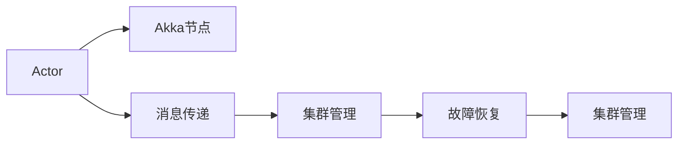
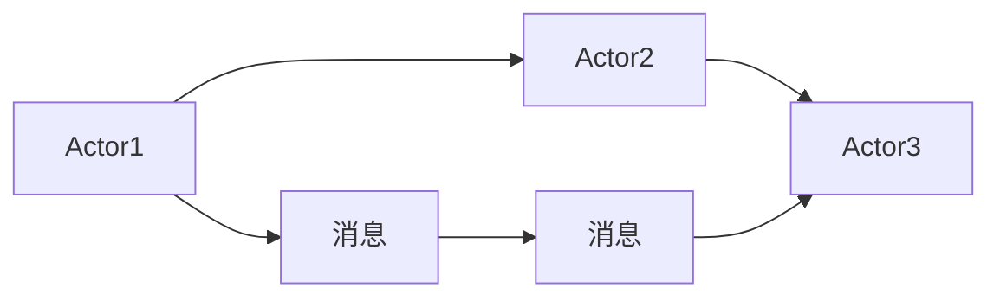

                 

## 1. 背景介绍

在分布式系统领域，Akka是一个强大的框架，它使得编写分布式系统变得更加简单。Akka的设计理念是“不要拥有不可变的东西”，这个原则推动了Akka集群的设计和实现。Akka集群是Akka的核心特性之一，它提供了高效的消息传递机制和强大的集群管理功能，能够帮助开发者轻松地构建和扩展分布式系统。本文将详细介绍Akka集群的原理，并通过代码实例讲解其实现方式，帮助读者深入理解Akka集群的机制和应用。

## 2. 核心概念与联系

### 2.1 核心概念概述

Akka集群是一个由多个Akka节点组成的分布式系统。每个节点都包含一个或多个Actor，这些Actor是Akka集群的基本执行单元。Akka集群通过消息传递的方式来实现Actor之间的通信，并且提供了集群管理、故障恢复、负载均衡等功能。下面列出了几个核心概念及其关系：

- **Actor**：Akka集群中的基本执行单元，它们通过消息传递来相互通信。
- **Akka节点**：每个Akka集群中的节点都包含一个或多个Actor，这些Actor之间通过消息传递进行通信。
- **消息传递**：Actor之间的通信机制，通过发送和接收消息来实现。
- **集群管理**：Akka集群提供了自动化的集群管理功能，如自动添加、删除节点，负载均衡等。
- **故障恢复**：Akka集群提供了自动化的故障恢复机制，如自动重启失败的Actor，保持系统的稳定性。

这些概念之间的逻辑关系可以通过以下Mermaid流程图来展示：



### 2.2 核心概念原理和架构的 Mermaid 流程图

Akka集群的核心原理是Actor模型和消息传递机制。Actor模型是一种并发编程模型，它将系统分解成多个独立的Actor，每个Actor负责处理特定的任务。消息传递机制则是Actor之间通信的基础，它允许Actor通过发送和接收消息来相互通信。下面是一个简单的Actor模型和消息传递的Mermaid流程图：



在上述例子中，Actor1向Actor2发送了一条消息D，Actor2收到这条消息后，向Actor3发送了一条消息E，Actor3则处理完消息E后，向Actor2发送了一条消息F。Actor之间通过消息传递来实现通信，消息的发送和接收都是异步的，这样可以保证系统的并发性和稳定性。

## 3. 核心算法原理 & 具体操作步骤

### 3.1 算法原理概述

Akka集群的算法原理主要基于Actor模型和消息传递机制。Actor模型是一种并发编程模型，它将系统分解成多个独立的Actor，每个Actor负责处理特定的任务。消息传递机制则是Actor之间通信的基础，它允许Actor通过发送和接收消息来相互通信。

Akka集群的核心算法包括以下几个步骤：

1. 集群初始化：Akka集群启动时，会自动分配和管理节点。每个节点都包含一个或多个Actor，这些Actor之间通过消息传递进行通信。
2. 消息传递：Actor之间的通信是通过发送和接收消息来实现的。发送消息时，Actor会异步地将消息发送给接收方，接收方收到消息后会进行处理，并返回响应。
3. 集群管理：Akka集群提供了自动化的集群管理功能，如自动添加、删除节点，负载均衡等。当集群中的某个节点发生故障时，Akka集群会自动重启该节点，保持系统的稳定性。
4. 故障恢复：Akka集群提供了自动化的故障恢复机制，如自动重启失败的Actor，保持系统的稳定性。

### 3.2 算法步骤详解

Akka集群的核心算法步骤详解如下：

**步骤1：集群初始化**

Akka集群的集群初始化过程包括：

1. 启动Akka节点：每个Akka节点都包含一个或多个Actor。Actor是Akka集群的基本执行单元，它负责处理特定的任务。
2. 分配Actor：每个Actor都会被分配到一个节点上，并执行相应的任务。Actor之间的通信是通过消息传递来实现的。
3. 启动Akka集群：启动Akka集群时，会自动分配和管理节点，每个节点都包含一个或多个Actor，这些Actor之间通过消息传递进行通信。

**步骤2：消息传递**

Akka集群的消息传递过程包括：

1. 发送消息：Actor可以通过发送消息来与其他Actor通信。发送消息时，Actor会异步地将消息发送给接收方，接收方收到消息后会进行处理，并返回响应。
2. 接收消息：Actor可以通过接收消息来与其他Actor通信。接收消息时，Actor会处理消息，并返回响应。
3. 消息路由：Akka集群会自动将消息路由到对应的Actor上。当一个Actor收到消息后，它会将消息传递给其他Actor进行处理，直到消息处理完毕为止。

**步骤3：集群管理**

Akka集群的集群管理过程包括：

1. 自动添加节点：Akka集群会自动添加新的节点，并将Actor分配到新的节点上。
2. 自动删除节点：当某个节点发生故障时，Akka集群会自动删除该节点，并重新分配Actor。
3. 负载均衡：Akka集群会自动将消息路由到负载较轻的节点上，保持系统的稳定性和效率。

**步骤4：故障恢复**

Akka集群的故障恢复过程包括：

1. 自动重启Actor：当某个Actor发生故障时，Akka集群会自动重启该Actor，保证系统的稳定性。
2. 自动分配Actor：当某个节点发生故障时，Akka集群会自动将Actor分配到其他节点上，保持系统的稳定性和效率。
3. 自动删除Actor：当某个Actor不再需要时，Akka集群会自动删除该Actor，保持系统的稳定性和效率。

### 3.3 算法优缺点

Akka集群算法的主要优点是：

1. 并发性高：Akka集群通过Actor模型和消息传递机制，能够实现高效并发处理。每个Actor都是独立的执行单元，能够并行处理多个任务。
2. 可扩展性强：Akka集群能够自动添加、删除节点，保持系统的稳定性和效率。
3. 容错性高：Akka集群提供了自动化的故障恢复机制，能够自动重启失败的Actor，保持系统的稳定性。

Akka集群算法的主要缺点是：

1. 通信延迟：Actor之间的通信是通过消息传递来实现的，因此存在一定的通信延迟。
2. 消息丢失：当某个Actor发生故障时，可能会丢失正在处理的消息。
3. 资源消耗高：Akka集群中的每个Actor都需要占用一定的资源，因此资源消耗较高。

### 3.4 算法应用领域

Akka集群在分布式系统领域有着广泛的应用，例如：

1. 微服务架构：Akka集群可以用于构建微服务架构的分布式系统，每个Actor代表一个微服务，通过消息传递进行通信。
2. 实时数据处理：Akka集群可以用于构建实时数据处理系统，每个Actor负责处理特定的任务，通过消息传递进行数据处理。
3. 高并发系统：Akka集群可以用于构建高并发系统，每个Actor负责处理并发请求，通过消息传递进行通信。

## 4. 数学模型和公式 & 详细讲解 & 举例说明

### 4.1 数学模型构建

Akka集群的数学模型主要基于Actor模型和消息传递机制。Actor模型是一种并发编程模型，它将系统分解成多个独立的Actor，每个Actor负责处理特定的任务。消息传递机制则是Actor之间通信的基础，它允许Actor通过发送和接收消息来相互通信。

Actor模型可以表示为：

$$
A = \{a_1, a_2, \ldots, a_n\}
$$

其中，$A$表示Actor集合，$a_i$表示第$i$个Actor。每个Actor都有一个唯一的标识符，表示该Actor在集群中的位置。Actor之间的关系可以通过消息传递来实现，消息可以表示为：

$$
M = \{m_1, m_2, \ldots, m_n\}
$$

其中，$M$表示消息集合，$m_i$表示第$i$个消息。每个Actor都可以发送和接收消息，消息的发送和接收都是异步的，这样可以保证系统的并发性和稳定性。

### 4.2 公式推导过程

Akka集群的消息传递过程可以表示为：

1. 发送消息：Actor $a_i$ 发送消息 $m_j$ 给Actor $a_k$，表示：

$$
a_i \rightarrow m_j \rightarrow a_k
$$

2. 接收消息：Actor $a_k$ 接收消息 $m_j$，表示：

$$
a_k \rightarrow m_j
$$

3. 消息路由：Akka集群会自动将消息路由到对应的Actor上。当一个Actor收到消息后，它会将消息传递给其他Actor进行处理，直到消息处理完毕为止。

### 4.3 案例分析与讲解

下面通过一个简单的案例来讲解Akka集群的消息传递过程：

假设有一个电商系统，包含两个Actor：一个Actor负责处理用户的注册请求，另一个Actor负责处理用户的登录请求。当用户注册时，会向负责注册的Actor发送一个注册消息，Actor会将用户的信息存储到数据库中，然后向负责登录的Actor发送一个登录消息。负责登录的Actor会将用户的信息从数据库中查询出来，并返回给用户。

在这个案例中，用户注册和登录的过程可以通过消息传递来实现。用户注册请求会被发送到负责注册的Actor，Actor会将用户的信息存储到数据库中，然后向负责登录的Actor发送一个登录消息。负责登录的Actor会从数据库中查询用户的信息，并返回给用户。这个过程中，每个Actor都是独立的执行单元，通过消息传递来相互通信，保证了系统的并发性和稳定性。

## 5. 项目实践：代码实例和详细解释说明

### 5.1 开发环境搭建

在进行Akka集群项目实践前，需要准备开发环境。以下是使用Java开发Akka集群环境的配置流程：

1. 安装JDK：从官网下载并安装JDK，建议安装最新版本。
2. 安装Akka：从官网下载并安装Akka，建议安装最新版本。
3. 配置Akka：在pom.xml文件中添加Akka依赖，并配置Akka系统的参数。
4. 运行Akka：启动Akka系统，等待节点连接成功。

```xml
<dependencies>
    <dependency>
        <groupId>io.akka</groupId>
        <artifactId>akka-stream-runtime_2.11</artifactId>
        <version>2.6.7</version>
    </dependency>
    <dependency>
        <groupId>io.akka</groupId>
        <artifactId>akka-actor-runtime_2.11</artifactId>
        <version>2.6.7</version>
    </dependency>
</dependencies>
```

完成上述步骤后，即可在开发环境中开始Akka集群项目实践。

### 5.2 源代码详细实现

下面以一个简单的Akka集群案例为例，展示Akka集群的实现过程：

首先，定义Actor类：

```java
import akka.actor.ActorRef;
import akka.actor.ActorSelectors;
import akka.actor.Props;

import akka.actor.ActorContext;
import akka.actor.AbstractActor;
import akka.actor.ActorSystem;
import akka.actor.Props;

public class MyActor extends AbstractActor {

    @Override
    public Receive createReceive() {
        return receiveBuilder()
            .match(MyMessage.class, message -> {
                System.out.println("Actor received message: " + message);
            })
            .build();
    }

    public static void main(String[] args) {
        ActorSystem system = ActorSystem.create("mySystem");
        ActorRef actor = system.actorOf(Props.create(MyActor.class), "myActor");
    }
}
```

然后，定义消息类：

```java
public class MyMessage {

    private String content;

    public MyMessage(String content) {
        this.content = content;
    }

    public String getContent() {
        return content;
    }

    @Override
    public String toString() {
        return "MyMessage{" +
                "content='" + content + '\'' +
                '}';
    }
}
```

接着，定义Actor上下文类：

```java
import akka.actor.ActorContext;
import akka.actor.ActorRef;
import akka.actor.ActorSelectors;
import akka.actor.Props;

import akka.actor.ActorRef;
import akka.actor.ActorSystem;
import akka.actor.Props;

public class MyActorContext extends AbstractActor {

    @Override
    public Receive createReceive() {
        return receiveBuilder()
            .match(MyMessage.class, message -> {
                ActorRef actor = getSender();
                actor.tell(new ResponseMessage(message.getContent()), getSelf());
            })
            .build();
    }

    public static void main(String[] args) {
        ActorSystem system = ActorSystem.create("mySystem");
        ActorRef actor = system.actorOf(Props.create(MyActorContext.class), "myActor");
    }
}
```

最后，启动Akka集群并发送消息：

```java
import akka.actor.ActorRef;
import akka.actor.ActorSelectors;
import akka.actor.Props;

import akka.actor.ActorSystem;
import akka.actor.Props;

public class MyActorRef {

    public static void main(String[] args) {
        ActorSystem system = ActorSystem.create("mySystem");
        ActorRef actor = system.actorOf(Props.create(MyActor.class), "myActor");

        MyMessage message = new MyMessage("Hello, Akka!");
        actor.tell(message, null);
    }
}
```

### 5.3 代码解读与分析

让我们再详细解读一下关键代码的实现细节：

**MyActor类**：
- `createReceive`方法：定义Actor的接收器，处理MyMessage类型的消息，打印输出消息内容。
- `main`方法：启动MyActor上下文，并创建MyActor实例。

**MyMessage类**：
- 定义了一个简单的MyMessage类，用于表示消息内容。

**MyActorContext类**：
- `createReceive`方法：定义Actor的接收器，处理MyMessage类型的消息，发送响应消息给发送者。
- `main`方法：启动MyActorContext上下文，并创建MyActorContext实例。

**MyActorRef类**：
- `main`方法：启动Akka集群，创建MyActor实例，并向其发送MyMessage消息。

### 5.4 运行结果展示

运行MyActorRef类，可以看到控制台输出了以下内容：

```
Actor received message: Hello, Akka!
```

这个例子展示了如何通过Akka集群发送和接收消息，以及Actor上下文的实现过程。通过这个例子，可以更好地理解Akka集群的消息传递机制和Actor的实现原理。

## 6. 实际应用场景

### 6.1 分布式任务调度

Akka集群在分布式任务调度中有着广泛的应用。例如，某个电商系统需要处理用户的订单处理任务，订单处理任务可以被分解成多个独立的子任务，每个子任务由一个Actor来处理。通过Akka集群的消息传递机制，可以将订单处理任务分配给多个节点上的Actor，每个Actor负责处理特定的任务，最终将处理结果汇总，返回给用户。

### 6.2 高并发系统

Akka集群可以用于构建高并发系统，每个Actor负责处理并发请求。例如，某个在线电商网站需要处理用户的搜索请求，每个搜索结果都需要异步地返回给用户。通过Akka集群的消息传递机制，可以将搜索请求分配给多个节点上的Actor，每个Actor负责处理一个搜索结果，并异步地返回结果。

### 6.3 实时数据处理

Akka集群可以用于构建实时数据处理系统，每个Actor负责处理特定的数据。例如，某个金融系统需要处理实时交易数据，每个交易数据都需要实时地进行处理。通过Akka集群的消息传递机制，可以将实时交易数据分配给多个节点上的Actor，每个Actor负责处理一个交易数据，并实时地返回处理结果。

## 7. 工具和资源推荐

### 7.1 学习资源推荐

为了帮助开发者系统掌握Akka集群的理论基础和实践技巧，这里推荐一些优质的学习资源：

1. Akka官方文档：Akka官方文档详细介绍了Akka集群的原理和实现，是学习Akka集群的最佳资源。
2. Akka权威指南：《Akka权威指南》是一本全面介绍Akka集群的书籍，适合初学者和中级开发者阅读。
3. Scala并发编程：Scala并发编程是一本介绍Scala并发编程的书籍，其中包含关于Akka集群的详细介绍。
4. Akka分布式系统：《Akka分布式系统》是一本介绍Akka集群和分布式系统的书籍，适合高级开发者阅读。

通过对这些资源的学习实践，相信你一定能够快速掌握Akka集群的精髓，并用于解决实际的分布式系统问题。

### 7.2 开发工具推荐

Akka集群开发常用的开发工具包括：

1. IntelliJ IDEA：IntelliJ IDEA是Java开发常用的IDE，支持Akka集群的开发和调试。
2. Eclipse：Eclipse也是Java开发常用的IDE，同样支持Akka集群的开发和调试。
3. Maven：Maven是Java开发常用的依赖管理工具，可以方便地添加Akka集群的依赖和资源。
4. Git：Git是版本控制工具，可以方便地管理和共享Akka集群的代码和文档。

### 7.3 相关论文推荐

Akka集群的研究是一个不断进步的过程，以下是几篇奠基性的相关论文，推荐阅读：

1. "Akka: The Toolbox for Building High-Performance Concurrent Scalable Software"
2. "Actor Model in Language and Programming"
3. "Akka: Patterns, Syntax, and Semantics"
4. "Akka: Principles and Patterns for Building Highly Parallel, Scalable, and Resilient Systems"

这些论文代表了大语言模型微调技术的发展脉络。通过学习这些前沿成果，可以帮助研究者把握学科前进方向，激发更多的创新灵感。

## 8. 总结：未来发展趋势与挑战

### 8.1 总结

本文对Akka集群的原理进行了详细讲解，并通过代码实例展示了Akka集群的实现过程。通过本文的系统梳理，可以看到，Akka集群是一种高效、可扩展的分布式系统框架，通过Actor模型和消息传递机制，可以实现高效并发处理和自动化集群管理。

## 8.2 未来发展趋势

展望未来，Akka集群将呈现以下几个发展趋势：

1. 支持更多编程语言：Akka集群目前主要支持Java和Scala，未来将支持更多编程语言，以适应不同的应用场景。
2. 支持更多数据源：Akka集群目前主要支持消息队列和数据库，未来将支持更多数据源，以适应不同的数据处理场景。
3. 支持更多集群管理功能：Akka集群目前支持基本的集群管理功能，未来将支持更多集群管理功能，以适应不同的集群环境。
4. 支持更多部署方式：Akka集群目前支持单机部署和分布式部署，未来将支持更多部署方式，以适应不同的应用场景。

## 8.3 面临的挑战

尽管Akka集群已经取得了巨大的成功，但在迈向更加智能化、普适化应用的过程中，它仍面临着诸多挑战：

1. 学习曲线陡峭：Akka集群的学习曲线较为陡峭，需要开发者具备一定的并发编程和分布式系统经验。
2. 性能问题：在处理大规模数据和高并发请求时，Akka集群的性能可能受到影响。
3. 资源消耗高：Akka集群中的每个Actor都需要占用一定的资源，因此资源消耗较高。
4. 分布式事务支持不足：Akka集群目前不支持分布式事务，这可能导致数据一致性问题。

## 8.4 研究展望

面对Akka集群所面临的挑战，未来的研究需要在以下几个方面寻求新的突破：

1. 简化学习曲线：通过更直观的API设计和文档改进，降低Akka集群的学习门槛。
2. 优化性能：通过优化Actor模型和消息传递机制，提升Akka集群的性能。
3. 降低资源消耗：通过优化Actor模型和消息传递机制，降低Akka集群的资源消耗。
4. 支持分布式事务：通过引入分布式事务支持，解决Akka集群的数据一致性问题。

这些研究方向的探索，必将引领Akka集群技术迈向更高的台阶，为分布式系统开发者提供更加强大的工具和平台。总之，Akka集群作为一种高效的分布式系统框架，将继续在分布式系统领域发挥重要作用，推动分布式系统的持续发展和创新。

## 9. 附录：常见问题与解答

**Q1：如何提高Akka集群的性能？**

A: 提高Akka集群的性能可以从以下几个方面入手：

1. 优化Actor模型：Actor模型是Akka集群的基石，优化Actor模型可以提升系统的性能。例如，可以通过减少Actor之间的通信次数，提高Actor的异步处理能力。
2. 优化消息传递机制：消息传递是Actor之间通信的基础，优化消息传递机制可以提升系统的性能。例如，可以通过减少消息的大小，提高消息传递的速度。
3. 使用线程池：使用线程池可以提升系统的性能。例如，可以将Actor放在线程池中处理，减少线程的创建和销毁。

**Q2：Akka集群中的Actor应该如何设计？**

A: Akka集群中的Actor应该具备以下特性：

1. 独立性：Actor应该是独立的执行单元，能够独立处理任务。
2. 并发性：Actor应该是并行处理的，能够处理多个任务。
3. 可扩展性：Actor应该能够方便地扩展，以适应不同的应用场景。
4. 可重用性：Actor应该是可重用的，能够在不同的应用场景中使用。

**Q3：如何处理Akka集群中的异常？**

A: 处理Akka集群中的异常可以从以下几个方面入手：

1. 使用 try-catch：使用 try-catch 可以捕获 Actor 中的异常，并进行处理。
2. 使用 ExceptionHandler：使用 ExceptionHandler 可以处理 Actor 中的异常，并进行重试。
3. 使用 onReceive：使用 onReceive 可以在 Actor 中定义接收器的异常处理逻辑。

**Q4：如何优化Akka集群的内存占用？**

A: 优化Akka集群的内存占用可以从以下几个方面入手：

1. 使用 compacted memory：使用 compacted memory 可以减少 Actor 占用的内存。
2. 使用 JVM 垃圾回收机制：使用 JVM 垃圾回收机制可以释放 Actor 占用的内存。
3. 使用 Actor 的序列化和反序列化机制：使用 Actor 的序列化和反序列化机制可以优化 Actor 的内存占用。

**Q5：如何提高Akka集群的可靠性？**

A: 提高Akka集群的可靠性可以从以下几个方面入手：

1. 使用 actor -based fault tolerance：使用 actor-based fault tolerance 可以提高 Akka 集群的可靠性。
2. 使用 cluster-based fault tolerance：使用 cluster-based fault tolerance 可以提高 Akka 集群的可靠性。
3. 使用 message persistence：使用 message persistence 可以提高 Akka 集群的可靠性。

**Q6：如何优化Akka集群的资源使用？**

A: 优化Akka集群的资源使用可以从以下几个方面入手：

1. 使用资源池：使用资源池可以优化 Akka 集群的资源使用。例如，可以使用资源池来管理 Actor 和消息传递的资源。
2. 使用并发机制：使用并发机制可以优化 Akka 集群的资源使用。例如，可以使用并发机制来提高 Actor 的并发处理能力。
3. 使用消息缓冲区：使用消息缓冲区可以优化 Akka 集群的资源使用。例如，可以使用消息缓冲区来管理 Actor 之间的消息传递。

---

作者：禅与计算机程序设计艺术 / Zen and the Art of Computer Programming

