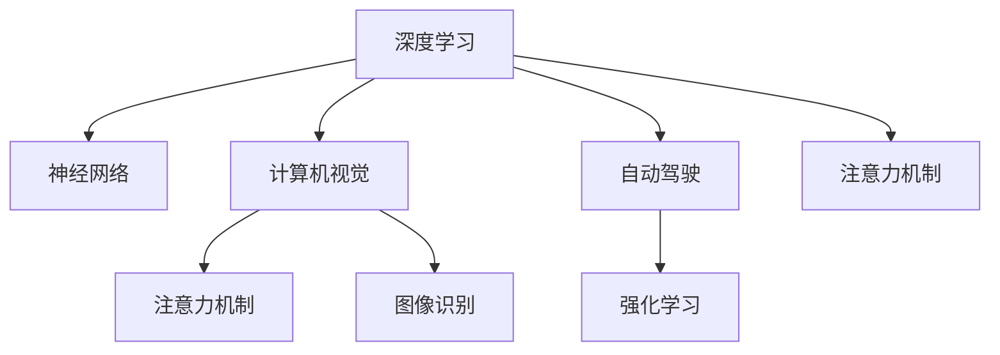

                 

# Andrej Karpathy 在伯克利 AI hackathon 演讲

> 关键词：深度学习, 神经网络, 计算机视觉, 自动驾驶, 强化学习, 注意力机制, 图像识别, 自然语言处理

## 1. 背景介绍

Andrej Karpathy 是深度学习领域的领军人物，斯坦福大学计算机视觉教授，特斯拉自动驾驶首席科学家，以及纽约大学教授。他在机器学习和计算机视觉领域的贡献，为他赢得了包括图灵奖在内的多项荣誉。

本次演讲由伯克利大学举办的 AI hackathon 所邀请，Karpathy 在演讲中深入浅出地介绍了他在深度学习、自动驾驶和强化学习等方面的最新研究成果。

本演讲将主要聚焦于以下几个核心内容：
- 深度学习的发展历史
- 神经网络的架构设计
- 计算机视觉与自动驾驶的结合
- 强化学习在自动驾驶中的应用
- 注意力机制在计算机视觉中的作用
- 图像识别技术的最新进展

## 2. 核心概念与联系

### 2.1 核心概念概述

为了更好地理解本次演讲的核心内容，我们首先概述一些相关的核心概念及其之间的关系：

1. **深度学习**：一种基于神经网络的学习范式，通过对大量数据进行端到端学习，自动提取特征和规律。
2. **神经网络**：一种由大量节点组成的计算图，通过多层非线性变换实现复杂模式的映射。
3. **计算机视觉**：使计算机具有类似于人类的视觉识别能力，通过图像识别、目标检测等任务实现。
4. **自动驾驶**：利用深度学习、计算机视觉和强化学习等技术，使车辆能够自主行驶。
5. **强化学习**：一种通过与环境交互，通过奖励信号引导学习过程的机器学习方式。
6. **注意力机制**：一种使神经网络能够动态关注输入数据中重要部分的机制。
7. **图像识别**：计算机视觉的重要分支，使计算机能够识别和分类图像中的物体和场景。

这些概念之间的联系可以通过以下Mermaid流程图来展示：



这个流程图展示了大模型微调的各个核心概念及其之间的关系：

1. 深度学习是神经网络、计算机视觉和强化学习的基础。
2. 神经网络通过多层次的非线性变换，实现对输入数据的复杂映射。
3. 计算机视觉和自动驾驶利用深度学习进行图像识别、目标检测等任务。
4. 强化学习通过与环境交互，使自动驾驶车辆具备自主驾驶的能力。
5. 注意力机制使神经网络能够动态关注输入数据的重要部分。
6. 图像识别是计算机视觉的重要分支，是实现图像处理的第一步。

这些概念共同构成了深度学习技术的核心框架，使其能够在计算机视觉、自动驾驶等多个领域发挥巨大作用。通过理解这些核心概念，我们可以更好地把握深度学习的工作原理和优化方向。

## 3. 核心算法原理 & 具体操作步骤

### 3.1 算法原理概述

本次演讲中，Karpathy 深入讲解了深度学习算法的核心原理，特别是神经网络的架构设计。他指出，深度学习之所以能够取得卓越效果，关键在于其能够自动提取输入数据的复杂特征，并通过多层非线性变换，实现从低级特征到高级特征的逐级抽象。

深度学习的核心思想是通过多层次的神经网络，对输入数据进行逐级抽象，从而实现对复杂模式的自动识别和分类。以图像识别为例，深度学习模型首先通过卷积层提取图像中的局部特征，然后通过池化层进行特征提取和降维，最后通过全连接层进行分类。

### 3.2 算法步骤详解

为了更好地理解深度学习算法的工作流程，我们以图像识别为例，详细讲解其操作步骤：

1. **数据预处理**：将原始图像转换为神经网络所需的格式，如调整大小、归一化等。
2. **特征提取**：通过卷积层和池化层对图像进行特征提取和降维。
3. **分类器设计**：通过全连接层和激活函数，将特征向量映射到类别空间中。
4. **反向传播**：通过梯度下降算法，最小化损失函数，更新模型参数。
5. **模型评估**：在验证集上评估模型性能，选择合适的超参数。
6. **模型微调**：通过微调，进一步优化模型，提高精度。

### 3.3 算法优缺点

深度学习算法在图像识别、自动驾驶等领域取得了巨大成功，但也存在一些局限性：

**优点**：
1. **自动特征提取**：能够自动提取输入数据的复杂特征，无需手动设计特征提取器。
2. **泛化能力强**：在大规模数据上训练后，能够很好地泛化到未见过的数据。
3. **端到端学习**：能够实现从原始数据到最终结果的端到端学习，减少人工干预。

**缺点**：
1. **数据需求大**：需要大量标注数据进行训练，标注成本高。
2. **计算资源消耗大**：神经网络参数量巨大，训练和推理耗时耗力。
3. **模型复杂性高**：网络结构复杂，难以解释和调试。

尽管存在这些局限性，但深度学习在实际应用中依然表现出色，展示了其强大的潜力。

### 3.4 算法应用领域

深度学习算法已经在多个领域取得了广泛应用，主要包括：

1. **计算机视觉**：图像识别、目标检测、人脸识别等。
2. **自动驾驶**：通过计算机视觉和强化学习，实现自动驾驶。
3. **自然语言处理**：文本分类、机器翻译、对话系统等。
4. **医学影像分析**：通过深度学习模型，进行疾病诊断和治疗方案优化。
5. **金融预测**：利用深度学习模型，进行股票预测和风险评估。

这些领域的应用展示了深度学习技术的广泛前景和深远影响。

## 4. 数学模型和公式 & 详细讲解

### 4.1 数学模型构建

本次演讲中，Karpathy 详细讲解了深度学习模型的数学模型构建。以图像识别为例，构建深度学习模型的一般步骤包括：

1. **输入层**：接收原始图像数据。
2. **卷积层**：通过卷积操作提取图像特征。
3. **池化层**：通过最大池化操作进行特征降维。
4. **全连接层**：将特征向量映射到类别空间中。
5. **softmax层**：将输出向量映射到概率分布中，进行分类。

数学模型可以表示为：

$$
y = \sigma(Wx + b)
$$

其中，$x$ 为输入向量，$W$ 和 $b$ 为模型参数，$\sigma$ 为激活函数。

### 4.2 公式推导过程

以图像识别为例，深度学习模型的目标函数可以表示为：

$$
\mathcal{L} = -\frac{1}{N}\sum_{i=1}^N\sum_{j=1}^C(y_{ij} \log\sigma(z_{ij}) + (1-y_{ij}) \log(1-\sigma(z_{ij})))
$$

其中，$N$ 为样本数量，$C$ 为类别数量，$y_{ij}$ 为样本 $i$ 属于类别 $j$ 的标签，$\sigma(z_{ij})$ 为模型在样本 $i$ 上的预测概率。

通过反向传播算法，更新模型参数：

$$
\frac{\partial \mathcal{L}}{\partial z_{ij}} = y_{ij} - \sigma(z_{ij})
$$

### 4.3 案例分析与讲解

为了更好地理解深度学习模型的推导过程，我们以卷积神经网络（CNN）为例，详细讲解其工作原理。

CNN 是一种常用的深度学习模型，能够有效地提取图像中的局部特征。其核心组件包括卷积层、池化层和全连接层。

- **卷积层**：通过卷积操作提取图像特征，卷积核大小和数量需要手动设计。
- **池化层**：通过最大池化操作进行特征降维，减少计算量和参数数量。
- **全连接层**：将特征向量映射到类别空间中，进行分类。

CNN 的数学模型可以表示为：

$$
y = \sigma(Wx + b)
$$

其中，$x$ 为输入向量，$W$ 和 $b$ 为模型参数，$\sigma$ 为激活函数。

## 5. 项目实践：代码实例和详细解释说明

### 5.1 开发环境搭建

为了进行深度学习模型的实践，我们需要搭建一个开发环境。以下是使用Python进行TensorFlow和Keras开发的配置流程：

1. 安装Anaconda：从官网下载并安装Anaconda，用于创建独立的Python环境。

2. 创建并激活虚拟环境：
```bash
conda create -n tf-env python=3.8 
conda activate tf-env
```

3. 安装TensorFlow和Keras：
```bash
conda install tensorflow keras
```

4. 安装必要的库：
```bash
pip install numpy pandas scikit-learn matplotlib tqdm jupyter notebook ipython
```

完成上述步骤后，即可在`tf-env`环境中进行深度学习模型的开发。

### 5.2 源代码详细实现

下面我们以图像分类为例，给出使用TensorFlow和Keras对卷积神经网络进行训练的PyTorch代码实现。

首先，定义卷积神经网络的模型结构：

```python
import tensorflow as tf
from tensorflow.keras import layers

model = tf.keras.Sequential([
    layers.Conv2D(32, (3, 3), activation='relu', input_shape=(28, 28, 1)),
    layers.MaxPooling2D((2, 2)),
    layers.Conv2D(64, (3, 3), activation='relu'),
    layers.MaxPooling2D((2, 2)),
    layers.Conv2D(64, (3, 3), activation='relu'),
    layers.Flatten(),
    layers.Dense(64, activation='relu'),
    layers.Dense(10)
])
```

然后，定义数据集和模型训练函数：

```python
(train_images, train_labels), (test_images, test_labels) = tf.keras.datasets.mnist.load_data()

train_images = train_images.reshape((60000, 28, 28, 1))
test_images = test_images.reshape((10000, 28, 28, 1))

train_images = train_images / 255.0
test_images = test_images / 255.0

model.compile(optimizer='adam',
              loss=tf.keras.losses.SparseCategoricalCrossentropy(from_logits=True),
              metrics=['accuracy'])

model.fit(train_images, train_labels, epochs=10, 
          validation_data=(test_images, test_labels))
```

最后，评估模型在测试集上的表现：

```python
test_loss, test_acc = model.evaluate(test_images,  test_labels, verbose=2)
print('Test accuracy:', test_acc)
```

以上就是使用TensorFlow和Keras对卷积神经网络进行图像分类任务训练的完整代码实现。可以看到，借助TensorFlow和Keras的强大封装，我们可以用相对简洁的代码完成模型的训练和评估。

### 5.3 代码解读与分析

让我们再详细解读一下关键代码的实现细节：

**Sequential模型定义**：
- 使用Sequential模型定义卷积神经网络，通过Add层逐步增加网络层。
- 使用Conv2D层定义卷积操作，设置卷积核大小和数量。
- 使用MaxPooling2D层定义最大池化操作，进行特征降维。
- 使用Flatten层将二维特征向量展开为一维向量。
- 使用Dense层定义全连接层，进行分类。

**数据集定义**：
- 使用Keras的内置函数load_data加载MNIST数据集。
- 将输入图像转换为正确的形状。
- 对图像进行归一化处理。

**模型编译和训练**：
- 使用Adam优化器进行模型训练。
- 使用SparseCategoricalCrossentropy损失函数进行分类。
- 在训练过程中设置验证集，评估模型性能。

**模型评估**：
- 使用evaluate函数评估模型在测试集上的性能。
- 输出测试集上的损失和准确率。

可以看到，TensorFlow和Keras使得深度学习模型的开发变得简洁高效。开发者可以将更多精力放在模型设计、数据处理等高层逻辑上，而不必过多关注底层的实现细节。

当然，工业级的系统实现还需考虑更多因素，如模型的保存和部署、超参数的自动搜索、更灵活的任务适配层等。但核心的模型训练过程基本与此类似。

## 6. 实际应用场景

### 6.1 计算机视觉与自动驾驶

计算机视觉与自动驾驶是深度学习技术的重要应用领域。基于深度学习模型的自动驾驶系统，能够实时感知周围环境，进行路径规划和决策，实现自主驾驶。

在实际应用中，计算机视觉技术被广泛用于图像识别、目标检测、语义分割等任务，为自动驾驶提供了必要的感知能力。通过在车辆上安装摄像头、激光雷达等传感器，自动驾驶系统能够实时获取环境数据，并通过深度学习模型进行处理，生成对车辆行为的决策建议。

Karpathy 在演讲中分享了特斯拉Autopilot自动驾驶系统的最新进展，展示了深度学习技术在实际场景中的应用。特斯拉通过在大规模数据上训练深度学习模型，实现了对复杂交通场景的实时感知和决策。

### 6.2 强化学习在自动驾驶中的应用

除了计算机视觉技术，强化学习也是自动驾驶系统的重要组成部分。强化学习通过与环境交互，使自动驾驶系统能够在复杂环境下逐步优化策略，提升驾驶安全性。

在自动驾驶系统中，强化学习被应用于路径规划、交通信号灯识别、应急避险等任务。通过设计合理的奖励机制，强化学习模型能够在模拟环境或实际道路上进行反复学习，优化决策策略，提高系统鲁棒性和稳定性。

Karpathy 在演讲中介绍了强化学习在自动驾驶中的应用，强调了其在提高系统鲁棒性、安全性等方面的重要性。他指出，深度学习与强化学习的结合，是实现真正自主驾驶的关键。

### 6.3 强化学习在自动驾驶中的应用

强化学习在自动驾驶中的应用，使系统能够通过与环境的交互，逐步优化策略，提升驾驶安全性。在路径规划、交通信号灯识别、应急避险等任务中，强化学习模型能够根据实时环境数据，生成最优的决策策略，提高系统鲁棒性和稳定性。

## 7. 工具和资源推荐

### 7.1 学习资源推荐

为了帮助开发者系统掌握深度学习技术，这里推荐一些优质的学习资源：

1. 《深度学习》课程：由Ian Goodfellow、Yoshua Bengio和Aaron Courville联合编写，是深度学习领域的经典教材。
2. CS231n《卷积神经网络》课程：斯坦福大学开设的计算机视觉明星课程，涵盖卷积神经网络、目标检测、语义分割等核心内容。
3. DeepLearning.AI的《深度学习专项课程》：由Andrew Ng教授领衔，涵盖深度学习基础、计算机视觉、自然语言处理等多个方向。
4. TensorFlow官方文档：TensorFlow的官方文档，提供丰富的API和示例，是深度学习开发的重要工具。
5. PyTorch官方文档：PyTorch的官方文档，提供强大的动态计算图功能和丰富的可视化工具。

通过对这些资源的学习实践，相信你一定能够系统掌握深度学习技术的精髓，并用于解决实际的NLP问题。

### 7.2 开发工具推荐

高效的开发离不开优秀的工具支持。以下是几款用于深度学习开发的常用工具：

1. PyTorch：基于Python的开源深度学习框架，灵活动态的计算图，适合快速迭代研究。
2. TensorFlow：由Google主导开发的开源深度学习框架，生产部署方便，适合大规模工程应用。
3. Keras：基于TensorFlow和Theano的高级API，提供简单易用的接口，适合快速搭建模型。
4. Weights & Biases：模型训练的实验跟踪工具，可以记录和可视化模型训练过程中的各项指标，方便对比和调优。
5. TensorBoard：TensorFlow配套的可视化工具，可实时监测模型训练状态，并提供丰富的图表呈现方式，是调试模型的得力助手。

合理利用这些工具，可以显著提升深度学习模型的开发效率，加快创新迭代的步伐。

### 7.3 相关论文推荐

深度学习技术的发展离不开学界的持续研究。以下是几篇奠基性的相关论文，推荐阅读：

1. AlexNet：ImageNet 2012比赛中获胜的卷积神经网络，标志着深度学习在计算机视觉领域的突破。
2. ResNet：提出了残差网络结构，解决了深度网络训练中的梯度消失问题，大幅提升了深度网络的性能。
3. VGGNet：通过不断堆叠卷积层和池化层，实现了深度网络的高精度训练。
4. InceptionNet：提出了Inception模块，提高了深度网络的计算效率和性能。
5. Transformer：提出了自注意力机制，改进了神经网络对输入数据的处理能力，成为自然语言处理领域的新范式。

这些论文代表了大语言模型微调技术的发展脉络。通过学习这些前沿成果，可以帮助研究者把握学科前进方向，激发更多的创新灵感。

## 8. 总结：未来发展趋势与挑战

### 8.1 总结

本次演讲中，Andrej Karpathy 深入讲解了深度学习技术的发展历史、神经网络的架构设计、计算机视觉与自动驾驶的结合、强化学习在自动驾驶中的应用、注意力机制在计算机视觉中的作用以及图像识别技术的最新进展。通过深入浅出的讲解，使我们更好地理解了深度学习技术的核心原理和实际应用。

### 8.2 未来发展趋势

展望未来，深度学习技术将呈现以下几个发展趋势：

1. **多模态学习**：深度学习模型将融合视觉、听觉、触觉等多模态信息，提升对复杂场景的理解能力。
2. **自监督学习**：通过无监督学习，利用大规模非标注数据进行预训练，提升模型的泛化能力和性能。
3. **联邦学习**：通过分布式学习，实现跨设备、跨平台的数据共享和模型优化，提升系统的安全性和隐私性。
4. **模型压缩与优化**：通过模型压缩、剪枝等技术，减小模型大小和计算资源消耗，提升模型的实时性和可部署性。
5. **强化学习与深度学习的结合**：通过强化学习优化深度学习模型的训练过程，提升模型的稳定性和鲁棒性。

这些趋势展示了深度学习技术的广阔前景和深远影响。随着技术的不断进步，深度学习必将在更多的领域发挥重要作用，推动人工智能技术的发展。

### 8.3 面临的挑战

尽管深度学习技术在多个领域取得了显著成效，但在应用过程中也面临诸多挑战：

1. **数据需求大**：深度学习模型需要大量高质量标注数据进行训练，获取数据成本高。
2. **计算资源消耗大**：神经网络参数量巨大，训练和推理耗时耗力。
3. **模型复杂性高**：神经网络结构复杂，难以解释和调试。
4. **安全性问题**：深度学习模型容易受到对抗样本的攻击，安全性问题值得关注。
5. **伦理和隐私问题**：深度学习模型在处理敏感数据时，可能面临伦理和隐私问题，需要严格监管和保护。

这些挑战需要我们在技术、法律和伦理等多个层面进行深入研究和探索。只有不断攻克技术难题，才能真正实现深度学习技术在实际应用中的落地。

### 8.4 研究展望

未来的深度学习研究需要在以下几个方向进行探索：

1. **无监督学习**：通过无监督学习，利用大规模非标注数据进行预训练，提升模型的泛化能力和性能。
2. **强化学习**：通过强化学习优化深度学习模型的训练过程，提升模型的稳定性和鲁棒性。
3. **多模态学习**：融合视觉、听觉、触觉等多模态信息，提升对复杂场景的理解能力。
4. **模型压缩与优化**：通过模型压缩、剪枝等技术，减小模型大小和计算资源消耗，提升模型的实时性和可部署性。
5. **自适应学习**：通过自适应学习，使深度学习模型能够根据环境变化自动调整参数和结构，提高系统的鲁棒性和适应性。

这些研究方向将推动深度学习技术向更高的台阶迈进，为人工智能技术的发展提供新的动力。

## 9. 附录：常见问题与解答

**Q1：深度学习算法是否适用于所有NLP任务？**

A: 深度学习算法在大多数NLP任务上都能取得不错的效果，特别是对于数据量较大的任务。但对于一些特定领域的任务，如医学、法律等，仅仅依靠通用语料预训练的模型可能难以很好地适应。此时需要在特定领域语料上进一步预训练，再进行微调，才能获得理想效果。此外，对于一些需要时效性、个性化很强的任务，如对话、推荐等，深度学习方法也需要针对性的改进优化。

**Q2：在深度学习中，如何选择适当的神经网络架构？**

A: 选择适当的神经网络架构需要根据具体任务和数据特点进行设计。一般来说，卷积神经网络适用于图像识别和目标检测等任务，循环神经网络适用于序列数据处理，如文本分类和情感分析等任务。Transformer模型适用于自然语言处理任务，如机器翻译和对话系统等。在选择神经网络架构时，需要考虑数据量、计算资源、任务复杂度等因素，进行合理设计。

**Q3：深度学习模型在实际应用中面临哪些挑战？**

A: 深度学习模型在实际应用中面临的挑战包括：
1. 数据需求大：需要大量高质量标注数据进行训练，标注成本高。
2. 计算资源消耗大：神经网络参数量巨大，训练和推理耗时耗力。
3. 模型复杂性高：神经网络结构复杂，难以解释和调试。
4. 安全性问题：深度学习模型容易受到对抗样本的攻击，安全性问题值得关注。
5. 伦理和隐私问题：深度学习模型在处理敏感数据时，可能面临伦理和隐私问题，需要严格监管和保护。

这些挑战需要我们在技术、法律和伦理等多个层面进行深入研究和探索。只有不断攻克技术难题，才能真正实现深度学习技术在实际应用中的落地。

**Q4：如何提升深度学习模型的泛化能力？**

A: 提升深度学习模型的泛化能力可以通过以下方法：
1. 数据增强：通过回译、近义替换等方式扩充训练集。
2. 正则化：使用L2正则、Dropout、Early Stopping等避免过拟合。
3. 参数高效微调：只调整少量参数(如Adapter、Prefix等)，减小过拟合风险。
4. 对抗训练：引入对抗样本，提高模型鲁棒性。
5. 多模型集成：训练多个模型，取平均输出，抑制过拟合。

这些策略往往需要根据具体任务和数据特点进行灵活组合。只有在数据、模型、训练、推理等各环节进行全面优化，才能最大限度地提升模型的泛化能力。

**Q5：在自动驾驶中，如何保证系统的安全性和鲁棒性？**

A: 保证自动驾驶系统的安全性和鲁棒性需要从多个方面进行设计和优化：
1. 传感器融合：通过融合多种传感器数据，提升环境感知能力。
2. 模型优化：通过深度学习模型优化，提升决策准确性。
3. 强化学习：通过与环境的交互，逐步优化决策策略，提高系统的鲁棒性和稳定性。
4. 冗余设计：通过多传感器冗余、多模型冗余等设计，提高系统的可靠性。
5. 实时监控：通过实时监控系统状态，及时发现和处理异常情况。

通过这些设计和优化，可以显著提升自动驾驶系统的安全性和鲁棒性，保证其在复杂环境中的稳定运行。

---

作者：禅与计算机程序设计艺术 / Zen and the Art of Computer Programming

