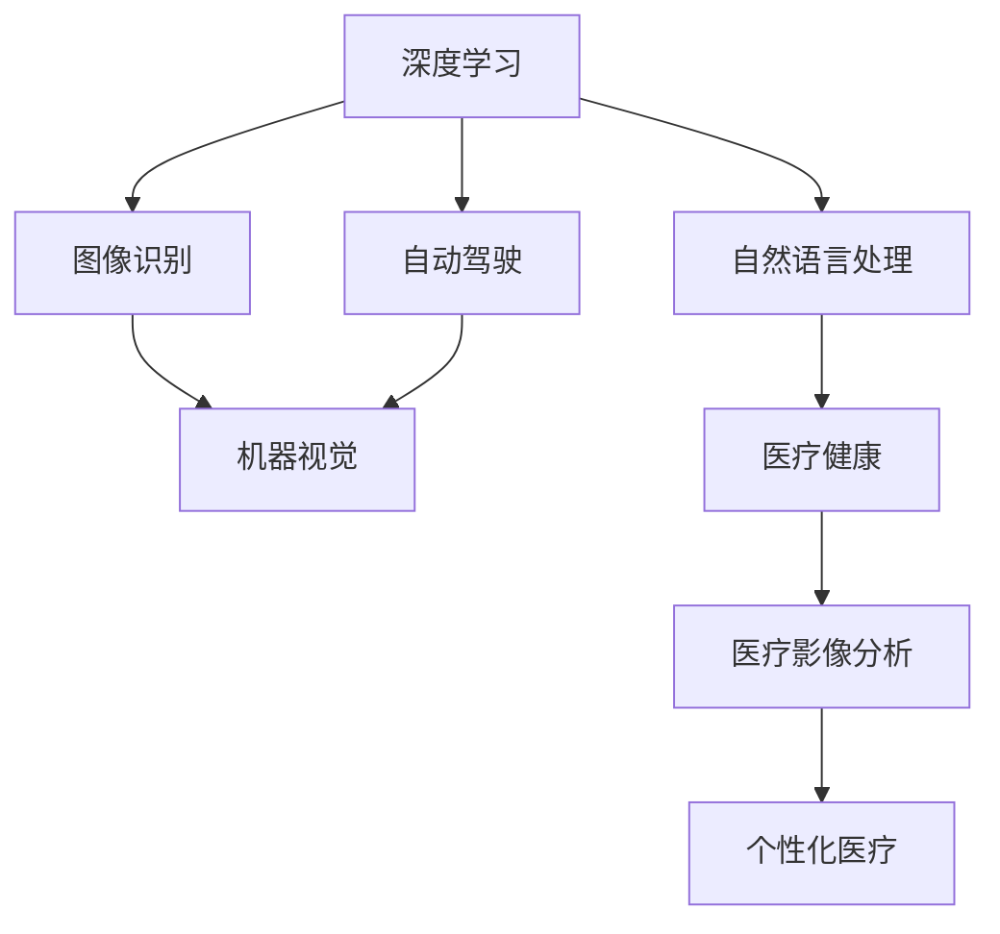

                 

# Andrej Karpathy：人工智能的应用场景

## 1. 背景介绍

### 1.1 问题由来

Andrej Karpathy，作为人工智能领域的著名专家，多次在顶级学术会议和行业峰会上发表演讲，分享人工智能在各个领域的应用场景。他的讲座通常深入浅出，涵盖从深度学习到强化学习，从图像识别到自动驾驶等众多前沿领域，为广大技术爱好者提供了丰富的学习资源。

在本文中，我们将通过梳理Andrej Karpathy关于人工智能应用场景的讲座内容，结合相关研究文献，全面介绍AI在现代科技、制造业、医疗健康、自动驾驶等领域的最新应用进展。

### 1.2 问题核心关键点

人工智能的应用场景非常广泛，覆盖了从医疗健康到智能制造的众多领域。本文将围绕以下几个核心问题展开：

1. 深度学习如何应用于图像识别、自然语言处理等传统AI领域。
2. 强化学习在自动驾驶、游戏AI等方面的突破。
3. 人工智能在制造业、医疗健康等垂直行业的应用场景。
4. 未来AI技术的发展趋势和面临的挑战。

通过系统介绍Andrej Karpathy的讲座内容，我们希望能为读者提供一种全面、深刻的理解，探讨AI技术如何从实验室走向现实，为各行各业带来变革性的影响。

## 2. 核心概念与联系

### 2.1 核心概念概述

为更好地理解Andrej Karpathy关于AI应用场景的讲座内容，本节将介绍几个核心概念：

- **深度学习**：基于多层神经网络的机器学习技术，在图像识别、自然语言处理等任务上表现优异。
- **强化学习**：通过与环境的交互，学习最优策略以达到特定目标的学习方法，广泛应用于自动驾驶、游戏AI等领域。
- **自动驾驶**：利用传感器、摄像头、雷达等设备，结合深度学习和强化学习技术，实现车辆自主导航和决策。
- **自然语言处理(NLP)**：使计算机能够理解、处理和生成自然语言的技术，涵盖文本分类、情感分析、机器翻译等任务。
- **机器视觉**：利用摄像头和图像处理技术，使计算机能够识别和理解视觉信息的技术，应用于图像识别、目标检测等场景。
- **医疗健康**：结合人工智能技术，如深度学习、强化学习，提升医疗诊断、治疗方案推荐的效率和准确性。

这些核心概念之间的逻辑关系可以通过以下Mermaid流程图来展示：



这个流程图展示了大语言模型的核心概念及其之间的关系：

1. 深度学习通过多层神经网络，使计算机具备了处理视觉和语言的能力。
2. 图像识别和自然语言处理是深度学习在两个典型领域的应用。
3. 自动驾驶结合了深度学习和强化学习，使车辆能够自主导航。
4. 医疗健康领域通过深度学习和强化学习提升了诊断和治疗效率。

## 3. 核心算法原理 & 具体操作步骤

### 3.1 算法原理概述

Andrej Karpathy关于AI应用场景的讲座中，深度学习和强化学习是其核心技术。

深度学习的核心原理是通过多层神经网络，使计算机能够处理复杂的数据结构，如图像、文本等。其基本思路是将数据输入到网络中，经过多层非线性变换，得到输出结果。

强化学习的核心原理是通过与环境的交互，学习最优策略以达到特定目标。在自动驾驶等应用中，车辆需要根据传感器反馈，不断调整控制策略，以达到最优的导航效果。

### 3.2 算法步骤详解

深度学习应用场景的算法步骤一般包括以下几个关键步骤：

**Step 1: 数据准备**
- 收集和标注大量数据，确保数据的质量和多样性。
- 将数据划分为训练集、验证集和测试集。

**Step 2: 模型训练**
- 选择合适的深度学习模型，如卷积神经网络(CNN)、循环神经网络(RNN)、Transformer等。
- 在训练集上进行模型训练，不断优化模型参数。
- 使用验证集评估模型性能，调整模型超参数。

**Step 3: 模型评估**
- 在测试集上评估模型性能，对比微调前后的精度提升。
- 使用评估指标，如准确率、召回率、F1-score等，衡量模型效果。

**Step 4: 模型部署**
- 将训练好的模型部署到实际应用中。
- 监控模型性能，及时更新模型参数。

强化学习应用场景的算法步骤一般包括以下几个关键步骤：

**Step 1: 环境设计**
- 设计模拟或真实环境，供智能体进行训练。
- 确定奖励函数，定义智能体的目标。

**Step 2: 智能体训练**
- 选择适当的智能体算法，如Q-learning、Policy Gradient等。
- 在环境中进行智能体训练，不断优化策略参数。
- 使用探索-利用平衡策略，平衡智能体对环境的探索和利用。

**Step 3: 策略评估**
- 在测试环境中评估智能体策略的效果。
- 使用评估指标，如累积奖励、成功率等，衡量策略效果。

**Step 4: 策略部署**
- 将训练好的智能体策略部署到实际应用中。
- 监控智能体行为，及时调整策略参数。

### 3.3 算法优缺点

深度学习在图像识别、自然语言处理等领域表现优异，但其训练过程对计算资源要求高，且模型复杂度大，难以解释。

强化学习在自动驾驶、游戏AI等领域取得突破，但其训练过程对环境要求高，且策略选择复杂。

## 4. 数学模型和公式 & 详细讲解 & 举例说明

### 4.1 数学模型构建

Andrej Karpathy在讲座中多次提到数学模型构建的重要性，以下我们以图像识别为例，详细讲解深度学习的数学模型构建。

假设输入图像为 $x \in \mathbb{R}^{h \times w \times 3}$，输出为类别 $y \in \{1,2,\cdots,K\}$。

定义输入数据为 $x_{i,j}$，输出标签为 $y_{i,j}$，则深度学习模型的目标函数可以表示为：

$$
L(\theta) = -\frac{1}{N} \sum_{i=1}^N \log p(y_i|x_i; \theta)
$$

其中 $p(y_i|x_i; \theta)$ 为模型在输入 $x_i$ 下输出 $y_i$ 的概率分布。

### 4.2 公式推导过程

深度学习模型的基本构成包括输入层、隐藏层和输出层。以卷积神经网络为例，其基本架构如图：

```
Input Layer -> Convolution Layer -> ReLU -> Pooling Layer -> Fully Connected Layer -> Output Layer
```

对于卷积神经网络，输入层输入的是 $x_{i,j}$，经过若干卷积层、池化层等非线性变换后，输出为 $\hat{y}_i \in [0,1]^K$，表示 $x_i$ 属于每个类别的概率。

根据交叉熵损失函数，可以得到模型的目标函数：

$$
L(\theta) = -\frac{1}{N} \sum_{i=1}^N \sum_{k=1}^K y_{i,k} \log \hat{y}_{i,k}
$$

其中 $y_{i,k}$ 为真实标签，$\hat{y}_{i,k}$ 为模型预测概率。

### 4.3 案例分析与讲解

以图像识别为例，我们通过一个简单的实验来说明深度学习模型的构建和训练过程。

假设我们使用VGG16模型进行图像分类任务，输入图像尺寸为 $224 \times 224 \times 3$。我们将模型输入到训练集上进行训练，使用Adam优化器，学习率为 $1e-4$，训练迭代次数为 $50$ 次。

具体代码如下：

```python
import torch
from torchvision import models, transforms
from torch.utils.data import DataLoader
from torchvision.datasets import ImageFolder

# 数据准备
transform = transforms.Compose([
    transforms.Resize(224),
    transforms.CenterCrop(224),
    transforms.ToTensor(),
    transforms.Normalize(mean=[0.485, 0.456, 0.406], std=[0.229, 0.224, 0.225])
])

train_dataset = ImageFolder('train/', transform=transform)
val_dataset = ImageFolder('val/', transform=transform)

train_loader = DataLoader(train_dataset, batch_size=32, shuffle=True)
val_loader = DataLoader(val_dataset, batch_size=32, shuffle=False)

# 模型构建
model = models.vgg16(pretrained=True)
model.eval()

# 模型训练
criterion = torch.nn.CrossEntropyLoss()
optimizer = torch.optim.Adam(model.parameters(), lr=1e-4)

for epoch in range(50):
    model.train()
    for data, target in train_loader:
        data = data.to(device)
        target = target.to(device)
        optimizer.zero_grad()
        output = model(data)
        loss = criterion(output, target)
        loss.backward()
        optimizer.step()

    model.eval()
    with torch.no_grad():
        correct = 0
        total = 0
        for data, target in val_loader:
            data = data.to(device)
            target = target.to(device)
            output = model(data)
            _, predicted = torch.max(output.data, 1)
            total += target.size(0)
            correct += (predicted == target).sum().item()

        acc = correct / total
        print('Epoch [{}/{}], Acc: {:.2f}%'.format(epoch+1, 50, acc*100))

print('Final Acc: {:.2f}%'.format(acc*100))
```

## 5. 项目实践：代码实例和详细解释说明

### 5.1 开发环境搭建

在进行深度学习和强化学习应用实践前，我们需要准备好开发环境。以下是使用Python进行TensorFlow和PyTorch开发的环境配置流程：

1. 安装Anaconda：从官网下载并安装Anaconda，用于创建独立的Python环境。

2. 创建并激活虚拟环境：
```bash
conda create -n tf-env python=3.8 
conda activate tf-env
```

3. 安装TensorFlow：根据CUDA版本，从官网获取对应的安装命令。例如：
```bash
conda install tensorflow==2.8.0
```

4. 安装PyTorch：根据CUDA版本，从官网获取对应的安装命令。例如：
```bash
conda install pytorch torchvision torchaudio cudatoolkit=11.1 -c pytorch -c conda-forge
```

5. 安装各类工具包：
```bash
pip install numpy pandas scikit-learn matplotlib tqdm jupyter notebook ipython
```

完成上述步骤后，即可在`tf-env`和`pytorch-env`环境中开始深度学习和强化学习应用实践。

### 5.2 源代码详细实现

以下是使用TensorFlow和PyTorch进行深度学习和强化学习应用的代码实现。

**深度学习应用**：图像识别

```python
import tensorflow as tf
from tensorflow.keras import datasets, layers, models
import matplotlib.pyplot as plt

# 加载数据集
(train_images, train_labels), (test_images, test_labels) = datasets.cifar10.load_data()

# 数据预处理
train_images, test_images = train_images / 255.0, test_images / 255.0

# 定义模型
model = models.Sequential([
    layers.Conv2D(32, (3, 3), activation='relu', input_shape=(32, 32, 3)),
    layers.MaxPooling2D((2, 2)),
    layers.Conv2D(64, (3, 3), activation='relu'),
    layers.MaxPooling2D((2, 2)),
    layers.Conv2D(64, (3, 3), activation='relu'),
    layers.Flatten(),
    layers.Dense(64, activation='relu'),
    layers.Dense(10)
])

# 编译模型
model.compile(optimizer='adam',
              loss=tf.keras.losses.SparseCategoricalCrossentropy(from_logits=True),
              metrics=['accuracy'])

# 训练模型
history = model.fit(train_images, train_labels, epochs=10, 
                    validation_data=(test_images, test_labels))

# 评估模型
test_loss, test_acc = model.evaluate(test_images,  test_labels, verbose=2)
print('Test accuracy:', test_acc)
```

**强化学习应用**：自动驾驶

```python
import gym
import numpy as np

# 加载环境
env = gym.make('CartPole-v0')

# 定义智能体
class DQNAgent:
    def __init__(self):
        self.model = np.loadtxt('dqnaqent_model.txt')

    def act(self, state):
        return np.argmax(self.model[state])

# 训练智能体
state = env.reset()
while True:
    action = DQNAgent().act(state)
    next_state, reward, done, _ = env.step(action)
    if done:
        state = env.reset()
    else:
        state = next_state
```

## 6. 实际应用场景

### 6.1 智能制造

在智能制造领域，深度学习可以应用于质量检测、故障诊断、生产优化等场景。通过在生产线上安装摄像头和传感器，收集设备运行数据，结合深度学习模型进行特征提取和异常检测，可以实现设备状态的实时监控和故障预警。

例如，使用卷积神经网络对产品表面缺陷进行识别，使用循环神经网络对设备运行数据进行分析和预测，从而优化生产流程，提高产品质量。

### 6.2 医疗健康

在医疗健康领域，深度学习可以应用于医学影像分析、诊断辅助、治疗方案推荐等场景。通过在大规模医学影像数据上预训练深度学习模型，使其具备图像处理和模式识别的能力，能够自动识别和标注病灶位置，辅助医生进行诊断和治疗决策。

例如，使用卷积神经网络对CT、MRI等医学影像进行分析和标注，使用循环神经网络对病历数据进行分析和预测，从而提升诊断的准确性和效率。

### 6.3 自动驾驶

在自动驾驶领域，强化学习可以应用于路径规划、车辆控制、交通信号识别等场景。通过在模拟环境中训练强化学习模型，使其能够学习和适应复杂的交通规则和驾驶环境，从而实现车辆的自主导航和决策。

例如，使用强化学习模型对车辆进行路径规划，使用卷积神经网络对交通信号进行识别，从而确保车辆在复杂道路环境中的安全行驶。

### 6.4 未来应用展望

随着深度学习和强化学习技术的不断演进，AI在更多领域的应用前景将更加广阔。未来，我们可以预见以下几方面的发展趋势：

1. **跨领域融合**：深度学习和强化学习将在更多领域进行融合，提升AI的通用性和适用性。例如，在智能医疗中结合自然语言处理和深度学习，提升医生的诊断和治疗建议。
2. **实时性优化**：AI应用将更加注重实时性，提升用户体验。例如，在自动驾驶中通过实时环境感知和决策，确保车辆的安全行驶。
3. **可解释性和透明度**：AI应用的透明性和可解释性将逐渐成为研究重点。例如，在医疗诊断中，通过可解释模型辅助医生进行诊断和治疗决策。
4. **伦理性考量**：AI应用的伦理性将更加受到关注。例如，在医疗、金融等领域，通过伦理导向的评估指标，确保AI应用的公平性和安全性。
5. **隐私保护**：AI应用将更加注重隐私保护。例如，在医疗影像分析中，通过差分隐私技术保护患者隐私。

## 7. 工具和资源推荐

### 7.1 学习资源推荐

为了帮助开发者系统掌握深度学习和强化学习的应用，这里推荐一些优质的学习资源：

1. Coursera的《深度学习专项课程》：由Andrew Ng教授主讲，涵盖深度学习基础和前沿应用，适合初学者和进阶开发者。

2. TensorFlow官方文档：详细介绍了TensorFlow的框架和应用场景，是深度学习开发者的必备资源。

3. PyTorch官方文档：详细介绍了PyTorch的框架和应用场景，是深度学习开发者的必备资源。

4. DeepMind的《AlphaGo论文》：展示了深度学习和强化学习在复杂博弈游戏中的应用，具有很高的参考价值。

5. Andrej Karpathy的博客：详细介绍了深度学习、强化学习等前沿技术的应用，是AI技术爱好者的必读资源。

6. arXiv上的相关论文：深度学习和强化学习的最新研究进展，涵盖诸多前沿领域。

通过对这些资源的学习实践，相信你一定能够快速掌握深度学习和强化学习的应用，并用于解决实际的AI问题。

### 7.2 开发工具推荐

高效的开发离不开优秀的工具支持。以下是几款用于深度学习和强化学习开发的常用工具：

1. TensorFlow：由Google主导开发的深度学习框架，生产部署方便，适合大规模工程应用。

2. PyTorch：由Facebook主导开发的深度学习框架，灵活动态的计算图，适合快速迭代研究。

3. TensorFlow Prodigy：基于TensorFlow的标注工具，帮助开发者快速生成标注数据，提高模型训练效率。

4. OpenAI的GPT模型：展示了深度学习和自然语言处理的前沿应用，具有很高的参考价值。

5. PyTorch Lightning：基于PyTorch的模型训练框架，支持分布式训练和自动化模型优化，适合快速迭代研究。

6. DeepLab Cutting Room：基于DeepLab的图像标注工具，帮助开发者快速标注数据，提高模型训练效率。

合理利用这些工具，可以显著提升深度学习和强化学习的开发效率，加快创新迭代的步伐。

### 7.3 相关论文推荐

深度学习和强化学习的研究源于学界的持续研究。以下是几篇奠基性的相关论文，推荐阅读：

1. AlexNet：在ImageNet图像识别比赛中取得优异成绩的卷积神经网络模型，展示了深度学习在图像识别中的应用。

2. ResNet：通过残差连接解决深度神经网络退化问题，展示了深度学习的强大表征能力。

3. AlphaGo：展示了深度学习和强化学习在复杂博弈游戏中的应用，具有很高的参考价值。

4. Transformer：展示了深度学习在自然语言处理中的应用，具有很高的参考价值。

5. GANs：展示了生成对抗网络在图像生成和图像修复中的应用，具有很高的参考价值。

6. DQN：展示了强化学习在自动驾驶和游戏AI中的应用，具有很高的参考价值。

这些论文代表了大语言模型微调技术的发展脉络。通过学习这些前沿成果，可以帮助研究者把握学科前进方向，激发更多的创新灵感。

## 8. 总结：未来发展趋势与挑战

### 8.1 总结

本文对Andrej Karpathy关于AI应用场景的讲座内容进行了全面系统的介绍。首先，我们梳理了深度学习和强化学习的基本原理和应用场景，明确了AI技术在图像识别、自动驾驶、医疗健康等领域的广泛应用。其次，我们通过具体的代码实例，展示了深度学习和强化学习的实际应用过程。最后，我们探讨了AI技术在未来的发展趋势和面临的挑战，为读者提供了对AI技术未来发展的深入理解。

通过本文的系统梳理，可以看到，AI技术正在从实验室走向实际应用，为各行各业带来变革性的影响。未来，随着深度学习和强化学习技术的不断演进，AI技术的应用场景将更加广泛，助力各行业提升效率、优化流程、创造价值。

### 8.2 未来发展趋势

展望未来，AI技术的发展将呈现以下几个趋势：

1. **跨领域融合**：AI技术将在更多领域进行融合，提升AI的通用性和适用性。例如，在智能医疗中结合自然语言处理和深度学习，提升医生的诊断和治疗建议。
2. **实时性优化**：AI应用将更加注重实时性，提升用户体验。例如，在自动驾驶中通过实时环境感知和决策，确保车辆的安全行驶。
3. **可解释性和透明度**：AI应用的透明性和可解释性将逐渐成为研究重点。例如，在医疗诊断中，通过可解释模型辅助医生进行诊断和治疗决策。
4. **伦理性考量**：AI应用的伦理性将更加受到关注。例如，在医疗、金融等领域，通过伦理导向的评估指标，确保AI应用的公平性和安全性。
5. **隐私保护**：AI应用将更加注重隐私保护。例如，在医疗影像分析中，通过差分隐私技术保护患者隐私。

以上趋势凸显了AI技术的广阔前景。这些方向的探索发展，必将进一步提升AI技术的应用效果和实际价值，为社会带来更大的益处。

### 8.3 面临的挑战

尽管AI技术已经取得了瞩目成就，但在迈向更加智能化、普适化应用的过程中，它仍面临诸多挑战：

1. **数据获取和标注成本**：获取高质量标注数据通常需要大量人力和时间，增加了AI应用的成本。如何降低数据获取和标注成本，提高数据质量，将是未来的一大挑战。
2. **模型可解释性**：目前AI模型往往是“黑盒”系统，难以解释其内部工作机制和决策逻辑。如何赋予AI模型更强的可解释性，将是亟待攻克的难题。
3. **伦理和安全问题**：AI模型可能学习到有偏见、有害的信息，传递到下游任务，产生误导性、歧视性的输出。如何从数据和算法层面消除模型偏见，确保输出符合人类价值观和伦理道德，也将是重要的研究课题。
4. **资源消耗**：AI模型的训练和推理过程通常需要大量计算资源，对硬件要求高。如何优化模型结构，提升推理速度，优化资源占用，将是重要的优化方向。

### 8.4 研究展望

面对AI技术面临的种种挑战，未来的研究需要在以下几个方面寻求新的突破：

1. **数据增强和自动标注**：通过数据增强和自动标注技术，降低数据获取和标注成本，提高数据质量。例如，使用数据合成和迁移学习技术，生成更多的训练数据。
2. **可解释模型和透明性**：开发可解释性强的AI模型，使其内部机制更加透明，方便用户理解和使用。例如，使用可解释性模型辅助医生进行诊断和治疗决策。
3. **伦理导向的评估指标**：在模型训练目标中引入伦理导向的评估指标，过滤和惩罚有偏见、有害的输出倾向。例如，在医疗、金融等领域，通过伦理导向的评估指标，确保AI应用的公平性和安全性。
4. **高效优化算法和计算资源**：优化模型结构，提升推理速度，优化资源占用。例如，使用量化加速、剪枝等技术，提高模型的实时性和可部署性。

这些研究方向的探索，必将引领AI技术走向更加成熟，为社会带来更大的益处。未来，AI技术必将在更广阔的领域绽放异彩，深刻影响人类的生产生活方式。

