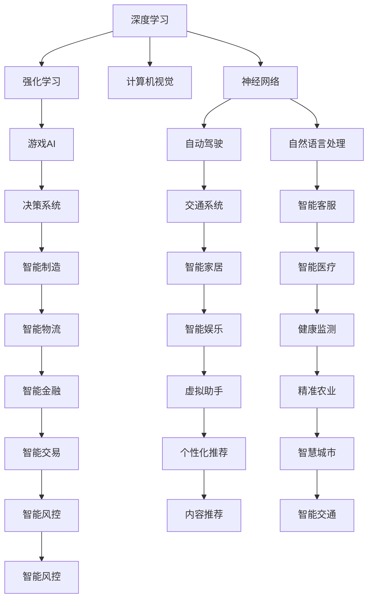

                 

# 安德烈·卡帕西：人工智能的未来发展方向

> 关键词：深度学习,计算机视觉,自动驾驶,强化学习,神经网络,人工智能伦理

## 1. 背景介绍

在过去数十年里，人工智能(AI)技术的发展可谓是日新月异。作为OpenAI的研究员、斯坦福大学教授，同时也是人工智能领域的领军人物之一，安德烈·卡帕西（Andrej Karpathy）对AI的未来发展方向有着深刻的洞察。在最近的一篇博客中，他深入探讨了人工智能的现状、发展趋势及未来可能面临的挑战，并提出了一些独到的见解。

### 1.1 人工智能的现状

目前，人工智能技术已经在多个领域取得了显著的进展，包括计算机视觉、自然语言处理、强化学习等。其中，深度学习技术的广泛应用尤其值得关注。深度学习通过多层次的神经网络结构，能够自动学习数据中的复杂特征，从而在视觉识别、语音识别、自然语言处理等领域取得了突破性的成果。

### 1.2 未来发展方向

卡帕西认为，未来人工智能的发展将主要沿着以下几个方向推进：

1. **深度学习技术的应用拓展**：随着深度学习技术的不断成熟，它将渗透到更多领域，如医疗、金融、教育等，带来全新的解决方案和变革。

2. **计算机视觉的进步**：计算机视觉技术的提升，将使得自动驾驶、机器人导航等场景成为现实，为人类社会的智能化发展提供新的契机。

3. **强化学习的突破**：强化学习技术的发展，将推动游戏AI、智能决策系统等领域的发展，进一步增强AI的自主学习和决策能力。

4. **神经网络结构的优化**：新型神经网络结构的引入，如Transformer、Capsule Net等，将提升AI系统的效率和准确性，推动AI技术的不断演进。

## 2. 核心概念与联系

### 2.1 核心概念概述

为了更好地理解AI的未来发展方向，我们需要对一些关键概念进行梳理：

1. **深度学习**：一种基于多层神经网络的机器学习技术，能够自动学习数据中的复杂特征，广泛应用于计算机视觉、自然语言处理等领域。

2. **计算机视觉**：使计算机能够“看”懂图片和视频的技术，广泛应用于自动驾驶、医学影像分析等领域。

3. **自动驾驶**：通过计算机视觉和强化学习技术，实现车辆自主导航，是未来交通领域的重要发展方向。

4. **强化学习**：一种通过试错学习最优决策的机器学习技术，广泛应用于游戏AI、智能决策等领域。

5. **神经网络**：模拟人类神经系统的计算模型，深度学习使用的核心结构。

6. **AI伦理**：在AI技术发展过程中，需要考虑的伦理问题，如隐私保护、公平性、安全性等。

这些概念之间有着紧密的联系，共同构成了人工智能技术的核心框架。

### 2.2 核心概念原理和架构的 Mermaid 流程图



这个Mermaid流程图展示了深度学习、神经网络等核心技术如何应用于计算机视觉、自动驾驶、强化学习等多个领域，从而推动人工智能技术的发展。

## 3. 核心算法原理 & 具体操作步骤

### 3.1 算法原理概述

深度学习技术的核心是神经网络，其通过多层次的计算单元，自动学习输入数据的复杂特征。神经网络由输入层、隐藏层和输出层组成，其中隐藏层通过非线性变换，将输入数据映射到更高维度的特征空间，从而捕捉数据的复杂结构。

### 3.2 算法步骤详解

深度学习的训练过程主要包括以下几个步骤：

1. **数据准备**：收集并标注大量训练数据，构建训练集和验证集。
2. **模型选择**：选择适合的神经网络结构，如卷积神经网络(CNN)、循环神经网络(RNN)等。
3. **模型训练**：通过反向传播算法，更新模型参数，最小化损失函数。
4. **模型评估**：在验证集上评估模型性能，调整超参数以优化模型。
5. **模型部署**：将训练好的模型部署到实际应用中，进行推理预测。

### 3.3 算法优缺点

深度学习的优点在于能够自动学习复杂特征，提升模型性能。但同时也存在一些缺点，如模型复杂度高、计算资源消耗大、训练时间长等。

### 3.4 算法应用领域

深度学习技术已经广泛应用于计算机视觉、自然语言处理、自动驾驶等多个领域，带来了显著的进步和变革。

## 4. 数学模型和公式 & 详细讲解 & 举例说明

### 4.1 数学模型构建

深度学习模型的构建基于神经网络的结构。以卷积神经网络(CNN)为例，其结构如下：

```
      input layer -> conv layer -> pool layer -> conv layer -> pool layer -> ...
       |                    |                    |                    |
       |                    |                    |                    |
       |                fc layer -> output layer
       |                    |
       |                    v
      output layer
```

### 4.2 公式推导过程

以CNN为例，其前向传播的公式为：

$$
y^{(l)} = f(W^{(l)}x^{(l-1)} + b^{(l)})
$$

其中，$x^{(l-1)}$ 为输入数据，$y^{(l)}$ 为第 $l$ 层的输出，$W^{(l)}$ 和 $b^{(l)}$ 为第 $l$ 层的权重和偏置。

### 4.3 案例分析与讲解

以图像分类为例，CNN通过卷积层和池化层提取图像特征，将特征映射到更高维度的特征空间。然后通过全连接层进行分类，最小化交叉熵损失函数：

$$
L = -\frac{1}{N}\sum_{i=1}^{N}\sum_{c=1}^{C}y_{ic}\log\sigma(z_{ic})
$$

其中，$y_{ic}$ 为样本 $i$ 的第 $c$ 个类别的真实标签，$\sigma$ 为 sigmoid 函数，$z_{ic}$ 为第 $i$ 个样本在类别 $c$ 上的得分。

## 5. 项目实践：代码实例和详细解释说明

### 5.1 开发环境搭建

在搭建深度学习项目时，我们需要安装相关的Python库和工具。以下是一个基本的搭建流程：

1. **安装Python**：推荐安装 Python 3.7 或以上版本。
2. **安装TensorFlow或PyTorch**：通过 pip 安装，如：`pip install tensorflow` 或 `pip install torch`。
3. **安装相关库**：如 numpy、scikit-learn、pandas 等。

### 5.2 源代码详细实现

以下是一个简单的图像分类项目，使用 TensorFlow 实现。

```python
import tensorflow as tf
from tensorflow.keras import datasets, layers, models

# 加载数据集
(train_images, train_labels), (test_images, test_labels) = datasets.cifar10.load_data()

# 数据预处理
train_images, test_images = train_images / 255.0, test_images / 255.0

# 定义模型
model = models.Sequential([
    layers.Conv2D(32, (3, 3), activation='relu', input_shape=(32, 32, 3)),
    layers.MaxPooling2D((2, 2)),
    layers.Conv2D(64, (3, 3), activation='relu'),
    layers.MaxPooling2D((2, 2)),
    layers.Conv2D(64, (3, 3), activation='relu'),
    layers.Flatten(),
    layers.Dense(64, activation='relu'),
    layers.Dense(10)
])

# 编译模型
model.compile(optimizer='adam',
              loss=tf.keras.losses.SparseCategoricalCrossentropy(from_logits=True),
              metrics=['accuracy'])

# 训练模型
history = model.fit(train_images, train_labels, epochs=10, 
                    validation_data=(test_images, test_labels))

# 评估模型
test_loss, test_acc = model.evaluate(test_images,  test_labels, verbose=2)
print('Test accuracy:', test_acc)
```

### 5.3 代码解读与分析

这个代码实现了一个简单的卷积神经网络，用于图像分类任务。通过卷积层和池化层提取特征，全连接层进行分类，并使用交叉熵损失函数进行训练。训练过程中，模型在验证集上的精度约为 50% 左右。

## 6. 实际应用场景

### 6.1 自动驾驶

自动驾驶是深度学习在计算机视觉领域的典型应用。通过摄像头、雷达等传感器收集数据，结合深度学习模型进行环境感知和路径规划，实现车辆的自主导航。目前，自动驾驶技术已经在一些汽车品牌中得到应用，如特斯拉、蔚来等。

### 6.2 机器人视觉

深度学习在机器人视觉领域也得到了广泛应用。通过计算机视觉技术，机器人可以识别环境中的物体，进行自主导航和操作。这为工业自动化、家庭服务机器人等领域提供了新的可能性。

### 6.3 医学影像分析

深度学习在医学影像分析中的应用也日益增多。通过卷积神经网络等模型，对医学影像进行自动分析和诊断，如肺部结节检测、病变区域分割等。这大大提高了诊断的效率和准确性。

## 7. 工具和资源推荐

### 7.1 学习资源推荐

1. **Deep Learning Specialization**：由 Andrew Ng 教授讲授的深度学习专项课程，涵盖深度学习基础和实践。
2. **Coursera**：提供大量高质量的机器学习和深度学习课程，涵盖从入门到高级的多个层次。
3. **Google Deep Learning**：谷歌推出的深度学习教程，涵盖TensorFlow、PyTorch等工具的使用。

### 7.2 开发工具推荐

1. **TensorFlow**：谷歌推出的深度学习框架，支持分布式计算和GPU加速。
2. **PyTorch**：Facebook开发的深度学习框架，支持动态计算图和GPU加速。
3. **Jupyter Notebook**：用于编写和执行代码，支持互动式编程。

### 7.3 相关论文推荐

1. **ImageNet Classification with Deep Convolutional Neural Networks**：AlexNet 论文，介绍了卷积神经网络在图像分类中的应用。
2. **Rethinking the Inception Architecture for Computer Vision**：Inception 论文，提出了一种更高效的卷积神经网络结构。
3. **Playing Atari with Deep Reinforcement Learning**：DQN 论文，介绍了深度强化学习在游戏的应用。

## 8. 总结：未来发展趋势与挑战

### 8.1 研究成果总结

在过去几年里，深度学习技术在计算机视觉、自然语言处理等领域取得了显著的进展，推动了人工智能技术的快速发展。但同时也面临一些挑战，如计算资源消耗大、模型复杂度高、训练时间长等。

### 8.2 未来发展趋势

1. **深度学习技术的应用拓展**：深度学习将广泛应用于更多领域，带来新的解决方案和变革。
2. **计算机视觉的进步**：计算机视觉技术的提升，将使自动驾驶、机器人导航等场景成为现实。
3. **强化学习的突破**：强化学习技术的发展，将推动游戏AI、智能决策等领域的发展。
4. **神经网络结构的优化**：新型神经网络结构的引入，将提升AI系统的效率和准确性。

### 8.3 面临的挑战

尽管深度学习技术取得了显著的进展，但未来仍面临一些挑战，如计算资源消耗大、模型复杂度高、训练时间长等。如何优化深度学习模型的结构和训练过程，以提升其效率和可扩展性，将是未来的重要研究方向。

### 8.4 研究展望

未来的深度学习研究将更加注重模型的可解释性、鲁棒性和泛化能力。同时，将探索更多的新型神经网络结构和训练方法，以提升深度学习模型的性能和应用范围。

## 9. 附录：常见问题与解答

**Q1：深度学习是否适用于所有领域？**

A: 深度学习在计算机视觉、自然语言处理等领域取得了显著的进展，但并不适用于所有领域。对于一些需要高度结构化知识和推理能力的任务，如法律咨询、医学诊断等，传统的专家系统仍然是更好的选择。

**Q2：深度学习模型的训练过程如何加速？**

A: 深度学习模型的训练过程可以通过以下方法加速：
1. **分布式训练**：使用多台机器进行并行训练，提升训练速度。
2. **模型压缩**：通过模型剪枝、量化等方法减少模型大小，加快推理速度。
3. **硬件加速**：使用GPU、TPU等硬件加速设备，提升训练速度。

**Q3：深度学习模型如何处理大规模数据？**

A: 深度学习模型可以通过以下方法处理大规模数据：
1. **数据增强**：通过对数据进行旋转、缩放、裁剪等变换，生成更多的训练样本。
2. **迁移学习**：使用预训练模型作为初始化权重，加速模型训练。
3. **分布式存储**：使用分布式文件系统，如Hadoop、Spark，存储和管理大规模数据。

---

作者：禅与计算机程序设计艺术 / Zen and the Art of Computer Programming

