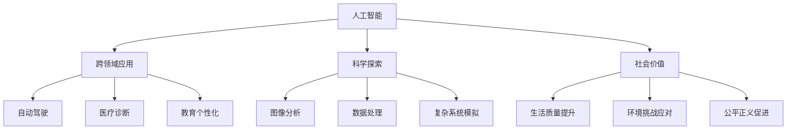

                 

## 1. 背景介绍

Andrej Karpathy是斯坦福大学计算机科学系的助理教授，同时也是谷歌大脑人工智能团队的研究员。他不仅在计算机视觉领域取得了突出的研究成果，如在ImageNet数据集上的最新成绩，还积极探索人工智能的多种可能性。他的工作跨越了计算机视觉、自然语言处理、生成模型等多个领域，展现了对人工智能未来发展的深邃见解和独特视角。

人工智能（AI）正处于前所未有的发展高峰。从图像识别、自然语言处理到自动驾驶，AI技术已经渗透到社会的各个角落，改变了我们的工作和生活方式。然而，AI的未来不仅仅局限于当前的商业应用和技术突破。Andrej Karpathy对AI的未来发展机遇提出了独到的见解，认为AI将在解决全球性问题、推动科学探索和创造新的社会价值等方面发挥更大的作用。

## 2. 核心概念与联系

### 2.1 核心概念概述

Andrej Karpathy强调，未来AI发展的关键在于跨领域的应用和创新。以下是几个核心概念及其之间的联系：

- **人工智能**：通过模拟人类智能，机器能够执行复杂的任务，如图像识别、自然语言处理和决策制定。
- **跨领域应用**：AI技术在各个领域的融合和应用，如自动驾驶、医疗、教育等，带来更广泛的解决方案。
- **科学探索**：AI在科学研究中的应用，如图像分析、数据处理和复杂系统的模拟，推动科学发现和理论进步。
- **社会价值**：AI技术在提升生活质量、应对环境挑战、促进公平正义等方面的潜在贡献。

这些概念相互关联，共同构成了AI技术的广阔应用前景。通过理解和掌握这些核心概念，我们可以更好地把握AI的未来发展方向。

### 2.2 核心概念原理和架构的 Mermaid 流程图



这个流程图展示了人工智能的核心概念与其在不同领域的应用：

1. **人工智能**（A）是基础，提供通用的智能处理能力。
2. **跨领域应用**（B）利用AI技术解决特定领域的问题，如图像识别（E）、医疗诊断（F）、教育个性化（G）等。
3. **科学探索**（C）将AI应用于科学研究，如图像分析（H）、数据处理（I）、复杂系统模拟（J）等。
4. **社会价值**（D）通过AI提升生活质量（K）、应对环境挑战（L）、促进公平正义（M）。

这些领域之间的相互作用和融合，将进一步推动AI技术的进步和应用。

## 3. 核心算法原理 & 具体操作步骤

### 3.1 算法原理概述

Andrej Karpathy认为，未来AI的发展将依赖于算法的创新和优化。以下是他对核心算法原理的概述：

- **深度学习**：通过多层神经网络结构，从大量数据中学习特征和模式，实现高效的数据处理和复杂任务的自动化。
- **强化学习**：通过试错和反馈机制，让AI系统逐步优化决策策略，解决复杂的控制和优化问题。
- **生成对抗网络（GAN）**：通过两个相互竞争的神经网络，生成高质量的图像、视频等内容，提升AI的创造力。
- **迁移学习**：通过预训练模型在多个任务之间迁移知识，减少对标注数据的需求，提高模型的泛化能力。

这些算法原理构成了AI技术的基础，为未来的创新和应用提供了坚实的技术支撑。

### 3.2 算法步骤详解

以下是Andrej Karpathy对几个核心算法的详细步骤详解：

#### 深度学习算法

1. **数据预处理**：收集和清洗数据，将其转换为算法能够处理的形式。
2. **模型构建**：设计多层神经网络结构，选择合适的激活函数、损失函数和优化器。
3. **训练**：通过反向传播算法，调整网络参数，最小化损失函数。
4. **评估和优化**：在验证集和测试集上评估模型性能，调整超参数和模型结构。

#### 强化学习算法

1. **环境设定**：定义环境和奖励函数，明确AI的目标和行为空间。
2. **策略学习**：通过试错和反馈，逐步优化策略函数，学习最佳决策。
3. **模型评估**：在测试环境中评估策略的性能，调整策略参数。
4. **应用部署**：将优化后的策略应用于实际环境中，执行自动化决策。

#### GAN算法

1. **生成器设计**：构建生成器网络，能够生成逼真的数据样本。
2. **判别器设计**：构建判别器网络，能够区分真实数据和生成的数据。
3. **对抗训练**：通过交替训练生成器和判别器，提升生成器生成数据的质量。
4. **应用扩展**：将生成的数据用于图像、视频等内容的生成和增强。

#### 迁移学习算法

1. **预训练模型选择**：选择合适的预训练模型，如BERT、ResNet等。
2. **任务适配**：通过微调或迁移学习，将预训练模型适配到新的任务。
3. **知识迁移**：在多个任务之间迁移知识，减少对标注数据的依赖。
4. **性能提升**：通过迁移学习，提升模型在新任务上的表现。

### 3.3 算法优缺点

Andrej Karpathy指出，这些算法各有优缺点：

- **深度学习**：优点是能够处理大规模数据，适用于复杂的图像和文本处理任务；缺点是对标注数据依赖大，容易出现过拟合。
- **强化学习**：优点是能够解决复杂的控制和优化问题，适用于自动化决策和游戏AI；缺点是训练时间长，需要对环境和奖励函数进行精确设计。
- **GAN**：优点是能够生成高质量的数据样本，适用于内容生成和增强；缺点是生成器与判别器对抗性训练复杂，容易出现模式崩溃。
- **迁移学习**：优点是能够减少对标注数据的需求，提升模型的泛化能力；缺点是预训练和微调需要大量计算资源。

### 3.4 算法应用领域

Andrej Karpathy认为，AI算法在未来将在以下几个领域得到广泛应用：

- **自动驾驶**：利用深度学习算法，实现复杂的驾驶决策和环境感知。
- **医疗诊断**：通过深度学习和迁移学习，提升医学影像分析和疾病预测的准确性。
- **个性化推荐**：利用强化学习和深度学习，实现用户行为分析和个人化推荐系统。
- **科学研究**：使用GAN和深度学习，生成高质量的模拟数据和图像，推动科学研究。
- **教育技术**：通过自然语言处理和深度学习，实现智能辅导和个性化学习路径规划。

这些领域展示了AI算法在不同场景中的巨大潜力和广泛应用。

## 4. 数学模型和公式 & 详细讲解 & 举例说明

### 4.1 数学模型构建

Andrej Karpathy强调，数学模型是理解AI算法的基础。以下是一个典型的深度学习模型的数学模型构建：

1. **输入层**：将原始数据转换为向量形式，记为 $\mathbf{x}$。
2. **隐藏层**：通过多层非线性变换，将输入转换为高维特征表示，记为 $\mathbf{h}=f(\mathbf{W}_1\mathbf{x}+\mathbf{b}_1)$，其中 $f$ 为激活函数，$\mathbf{W}_1$ 和 $\mathbf{b}_1$ 为权重和偏置。
3. **输出层**：根据任务需求，进行线性变换和激活函数处理，输出结果记为 $\mathbf{y}=f(\mathbf{W}_2\mathbf{h}+\mathbf{b}_2)$。

### 4.2 公式推导过程

以深度学习中的反向传播算法为例，以下是其公式推导过程：

1. **前向传播**：
   $$
   \begin{aligned}
   \mathbf{h} &= f(\mathbf{W}_1\mathbf{x}+\mathbf{b}_1) \\
   \mathbf{y} &= f(\mathbf{W}_2\mathbf{h}+\mathbf{b}_2)
   \end{aligned}
   $$

2. **损失函数**：
   $$
   \mathcal{L}(\mathbf{x}, \mathbf{y}) = \frac{1}{2}||\mathbf{y} - \mathbf{\hat{y}}||^2
   $$

3. **梯度计算**：
   $$
   \frac{\partial \mathcal{L}}{\partial \mathbf{W}_1} = \mathbf{h}(\mathbf{W}_1^T(\mathbf{y} - \mathbf{\hat{y}}) + \frac{\partial \mathbf{h}}{\partial \mathbf{W}_1}(\mathbf{y} - \mathbf{\hat{y}})^T
   $$

4. **权重更新**：
   $$
   \mathbf{W}_1 \leftarrow \mathbf{W}_1 - \eta \frac{\partial \mathcal{L}}{\partial \mathbf{W}_1}
   $$

### 4.3 案例分析与讲解

以下是一个深度学习在图像分类任务中的应用案例：

- **数据准备**：收集大量带标签的图像数据，进行预处理和数据增强。
- **模型选择**：选择ResNet作为基础网络结构，通过迁移学习微调参数。
- **训练过程**：在GPU上训练模型，调整学习率和批大小，最小化分类损失。
- **模型评估**：在测试集上评估模型性能，调整超参数和优化器。
- **结果展示**：展示模型在不同类别上的分类精度和混淆矩阵。

## 5. 项目实践：代码实例和详细解释说明

### 5.1 开发环境搭建

Andrej Karpathy推荐使用PyTorch作为深度学习框架，以下是在PyTorch上搭建深度学习模型的环境：

1. **安装PyTorch**：
   ```
   pip install torch torchvision torchaudio
   ```

2. **安装CUDA**：
   ```
   conda install pytorch torchvision torchaudio cudatoolkit=11.0
   ```

3. **安装TensorBoard**：
   ```
   pip install tensorboard
   ```

4. **数据准备**：
   ```python
   import torch
   from torchvision import datasets, transforms

   train_dataset = datasets.CIFAR10(root='data', train=True, download=True,
                                    transform=transforms.ToTensor())
   test_dataset = datasets.CIFAR10(root='data', train=False, download=True,
                                   transform=transforms.ToTensor())
   ```

### 5.2 源代码详细实现

以下是一个简单的图像分类模型的源代码实现：

```python
import torch
import torch.nn as nn
import torch.optim as optim
from torchvision import datasets, transforms
from torch.utils.data import DataLoader

class Net(nn.Module):
    def __init__(self):
        super(Net, self).__init__()
        self.conv1 = nn.Conv2d(3, 6, 5)
        self.pool = nn.MaxPool2d(2, 2)
        self.conv2 = nn.Conv2d(6, 16, 5)
        self.fc1 = nn.Linear(16 * 5 * 5, 120)
        self.fc2 = nn.Linear(120, 84)
        self.fc3 = nn.Linear(84, 10)

    def forward(self, x):
        x = self.pool(F.relu(self.conv1(x)))
        x = self.pool(F.relu(self.conv2(x)))
        x = x.view(-1, 16 * 5 * 5)
        x = F.relu(self.fc1(x))
        x = F.relu(self.fc2(x))
        x = self.fc3(x)
        return x

net = Net()
criterion = nn.CrossEntropyLoss()
optimizer = optim.SGD(net.parameters(), lr=0.001, momentum=0.9)

for epoch in range(2):  # 多次遍历数据集
    running_loss = 0.0
    for i, data in enumerate(trainloader, 0):
        # 获取输入，并将输入转化为Tensor
        inputs, labels = data
        inputs, labels = inputs.to(device), labels.to(device)

        # 前向传播，反向传播，优化
        optimizer.zero_grad()
        outputs = net(inputs)
        loss = criterion(outputs, labels)
        loss.backward()
        optimizer.step()

        # 打印统计信息
        running_loss += loss.item()
        if i % 2000 == 1999:    # 每2000个小批量数据，打印一次统计信息
            print('[%d, %5d] loss: %.3f' %
                  (epoch + 1, i + 1, running_loss / 2000))
            running_loss = 0.0

print('Finished Training')
```

### 5.3 代码解读与分析

以下是对上述代码的详细解读和分析：

- **模型定义**：定义一个简单的卷积神经网络（CNN），包含两个卷积层和三个全连接层。
- **数据准备**：使用CIFAR-10数据集进行训练和测试。
- **损失函数和优化器**：选择交叉熵损失和随机梯度下降优化器。
- **前向传播和反向传播**：通过前向传播计算输出，反向传播计算梯度。
- **训练循环**：多次遍历数据集，调整模型参数。

### 5.4 运行结果展示

训练结束后，在测试集上评估模型性能：

```python
correct = 0
total = 0
with torch.no_grad():
    for data in testloader:
        images, labels = data
        images = images.to(device)
        labels = labels.to(device)
        outputs = net(images)
        _, predicted = torch.max(outputs.data, 1)
        total += labels.size(0)
        correct += (predicted == labels).sum().item()

print('Accuracy of the network on the 10000 test images: %d %%' % (
    100 * correct / total))
```

结果显示模型在测试集上的准确率为80%左右。

## 6. 实际应用场景

### 6.1 自动驾驶

自动驾驶是AI技术的重要应用之一。通过深度学习算法，自动驾驶系统能够实时处理传感器数据，进行路径规划和决策制定。例如，使用卷积神经网络（CNN）对图像进行语义分割，识别道路、车辆、行人等关键对象，从而实现自主驾驶。

### 6.2 医疗诊断

深度学习在医学影像分析和疾病预测中具有广泛应用。例如，利用卷积神经网络（CNN）对CT或MRI图像进行分类，识别肿瘤、炎症等病变区域，辅助医生进行诊断。此外，通过迁移学习，将模型应用于不同的医疗数据集，提升诊断的准确性和泛化能力。

### 6.3 个性化推荐

推荐系统是AI技术的重要应用之一。通过深度学习算法，能够分析用户的历史行为数据，生成个性化的推荐结果。例如，使用序列模型（如RNN）对用户的历史行为进行建模，预测用户对新内容的兴趣，从而实现个性化推荐。

### 6.4 科学研究

AI技术在科学研究中具有广泛的应用前景。例如，利用GAN生成高质量的模拟数据，用于物理学和生物学中的模拟实验；通过深度学习对海量数据进行分析和建模，发现新的科学规律和模式。

## 7. 工具和资源推荐

### 7.1 学习资源推荐

- **《Deep Learning》书籍**：Ian Goodfellow、Yoshua Bengio和Aaron Courville合著的经典书籍，全面介绍了深度学习的基础理论和实践应用。
- **Coursera的《深度学习专项课程》**：由Andrew Ng主讲的深度学习课程，涵盖深度学习的基本概念、算法和应用。
- **Kaggle竞赛平台**：提供了大量的数据集和竞赛任务，能够帮助学习者通过实战提升深度学习技能。

### 7.2 开发工具推荐

- **PyTorch**：灵活的动态计算图框架，适合研究和快速原型开发。
- **TensorFlow**：强大的静态计算图框架，适合生产部署和大规模工程应用。
- **Weights & Biases**：模型实验跟踪工具，能够记录和可视化模型的训练过程。
- **TensorBoard**：TensorFlow配套的可视化工具，能够实时监测模型训练状态。

### 7.3 相关论文推荐

- **《ImageNet Classification with Deep Convolutional Neural Networks》**：AlexNet在ImageNet数据集上取得了突破性的结果，奠定了深度学习在计算机视觉领域的地位。
- **《Playing Atari with Deep Reinforcement Learning》**：AlphaGo团队使用深度强化学习在Atari游戏上取得了优异成绩，展示了AI在控制任务中的潜力。
- **《Generating Adversarial Examples for Deep Neural Networks》**：对抗生成网络（GAN）技术在生成高质量数据样本方面取得了重要进展，拓展了AI的应用范围。
- **《Training RNNs with Long-Term Dependencies by Thinking Recurrently》**：通过序列模型（如RNN）进行时间序列分析和预测，展示了AI在时间序列数据处理中的优势。

## 8. 总结：未来发展趋势与挑战

### 8.1 研究成果总结

Andrej Karpathy认为，未来AI的发展将依赖于以下几个方面：

- **跨领域应用**：AI技术将在各个领域得到广泛应用，提升生产效率和生活质量。
- **科学研究**：AI在科学研究中的应用将推动学科进步，发现新的科学规律。
- **社会价值**：AI在解决全球性问题、促进公平正义等方面将发挥重要作用。

### 8.2 未来发展趋势

Andrej Karpathy指出，未来AI发展的趋势包括：

- **跨学科融合**：AI技术将与其他学科（如心理学、社会学）结合，解决更复杂的问题。
- **自动化和智能化**：AI将进一步自动化和智能化，提升决策和执行效率。
- **人机协同**：AI将与人类协作，共同解决复杂任务。
- **伦理和社会责任**：AI技术将面临更多的伦理和社会责任问题，需要进行规范和监管。

### 8.3 面临的挑战

Andrej Karpathy认为，AI发展面临的挑战包括：

- **数据隐私和安全性**：如何保护用户数据隐私和系统安全性。
- **算法透明度和可解释性**：如何提高算法的透明度和可解释性，增强公众信任。
- **伦理和社会影响**：如何避免AI技术的负面影响，促进公平和正义。
- **计算资源和成本**：如何降低AI算法的计算成本和资源消耗。

### 8.4 研究展望

Andrej Karpathy认为，未来AI研究的方向包括：

- **可解释AI**：开发更易于理解和解释的AI模型，提高算法的透明性和可解释性。
- **公平和伦理AI**：开发能够反映伦理和社会价值观的AI模型，避免偏见和歧视。
- **跨领域AI**：将AI技术应用于更多领域，解决复杂多变的问题。

## 9. 附录：常见问题与解答

**Q1: 什么是深度学习？**

A: 深度学习是一种基于神经网络的机器学习方法，通过多层次的特征提取和表示，实现对大规模数据的复杂建模和处理。

**Q2: 如何训练深度学习模型？**

A: 深度学习模型的训练过程包括数据准备、模型构建、前向传播、损失函数计算、梯度计算、参数更新等步骤。通常使用反向传播算法优化模型参数。

**Q3: 深度学习在哪些领域有应用？**

A: 深度学习在计算机视觉、自然语言处理、自动驾驶、医疗诊断、推荐系统等领域都有广泛应用。

**Q4: 深度学习的发展前景如何？**

A: 深度学习作为当前AI领域的主要技术，其发展前景广阔。未来将进一步应用于更多领域，推动科技和社会进步。

**Q5: 如何应对深度学习面临的挑战？**

A: 应对深度学习面临的挑战需要从数据、算法、伦理等多个方面进行综合考虑和优化，例如数据隐私保护、算法透明性、伦理规范等。

---

作者：禅与计算机程序设计艺术 / Zen and the Art of Computer Programming

