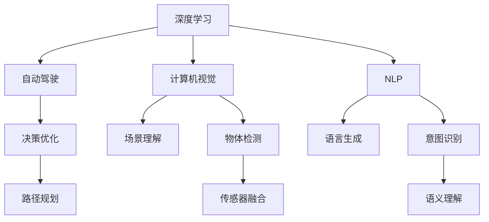

                 

## 1. 背景介绍

Andrej Karpathy，作为OpenAI的研究科学家，人工智能领域的先驱和领军人物，一直在机器学习、深度学习、计算机视觉等领域进行开创性研究。他的工作推动了自动驾驶、自然语言处理（NLP）和强化学习等多个领域的发展。本文旨在探讨Andrej Karpathy对人工智能未来发展机遇的见解，以及他的研究成果如何塑造人工智能的未来。

## 2. 核心概念与联系

### 2.1 核心概念概述

在讨论未来人工智能的发展机遇之前，我们需要先理解以下几个核心概念：

- **深度学习**：一种通过多层神经网络模型从数据中学习复杂模式的技术。
- **自动驾驶**：使用人工智能技术让车辆自主导航的系统。
- **计算机视觉**：使计算机能够“看”的领域，涉及图像处理、模式识别、场景理解等。
- **自然语言处理（NLP）**：使计算机能够理解和生成人类语言的技术。
- **强化学习**：一种通过试错来优化决策的技术，常用于自动驾驶、游戏AI等。

### 2.2 核心概念原理和架构的 Mermaid 流程图



这个流程图展示了深度学习、计算机视觉、NLP和自动驾驶等核心概念之间的联系。深度学习提供了基础学习框架，而计算机视觉和NLP在此基础上分别针对视觉和语言进行理解和生成。自动驾驶则整合了这些技术，通过决策优化和路径规划实现自主导航。

## 3. 核心算法原理 & 具体操作步骤

### 3.1 算法原理概述

Andrej Karpathy的研究涵盖了多个领域，以下是他对核心算法原理的概述：

- **深度学习**：通过多层神经网络结构从数据中提取高级特征，广泛应用于图像分类、语音识别、自然语言处理等领域。
- **自动驾驶**：结合计算机视觉和强化学习技术，实现车辆自主导航。
- **计算机视觉**：利用卷积神经网络（CNN）处理图像和视频数据，识别物体、场景和动作。
- **NLP**：通过循环神经网络（RNN）、Transformer等模型处理语言数据，进行语言理解和生成。
- **强化学习**：通过奖励机制训练模型，优化决策策略，应用于自动驾驶、游戏AI等领域。

### 3.2 算法步骤详解

Andrej Karpathy的研究涵盖多个步骤，以下是他对关键步骤的详细解释：

1. **数据准备**：收集并标注大量数据，用于训练深度学习模型。
2. **模型构建**：设计多层神经网络结构，选择合适的激活函数、优化器和损失函数。
3. **模型训练**：在准备好的数据集上训练模型，通过反向传播算法更新参数。
4. **模型评估**：在测试集上评估模型性能，使用指标如准确率、召回率、F1分数等。
5. **模型应用**：将训练好的模型应用于实际场景，如自动驾驶、计算机视觉等。

### 3.3 算法优缺点

#### 3.3.1 优点

- **高效性**：深度学习模型能够自动从数据中提取高级特征，处理复杂任务。
- **准确性**：通过大量数据训练，深度学习模型在特定领域能够取得较高的准确率。
- **泛化能力**：训练好的模型能够在新数据上表现良好。

#### 3.3.2 缺点

- **数据依赖**：深度学习模型对数据质量和数量要求高，需要大量标注数据。
- **计算资源需求高**：训练深度学习模型需要强大的计算资源，如GPU和TPU。
- **黑盒性质**：深度学习模型通常被视为黑盒，难以解释其内部工作机制。

### 3.4 算法应用领域

Andrej Karpathy的研究在多个领域得到应用，包括：

- **自动驾驶**：通过计算机视觉和强化学习技术，实现车辆自主导航。
- **自然语言处理**：利用NLP技术处理语言数据，进行文本分类、机器翻译等任务。
- **计算机视觉**：利用CNN技术处理图像和视频数据，进行物体检测、图像分割等任务。
- **强化学习**：应用于自动驾驶、游戏AI等领域，通过试错优化决策策略。

## 4. 数学模型和公式 & 详细讲解 & 举例说明

### 4.1 数学模型构建

Andrej Karpathy的研究基于多个数学模型，以下是他对核心数学模型的构建：

- **卷积神经网络（CNN）**：用于图像和视频处理，构建卷积层、池化层、全连接层等。
- **循环神经网络（RNN）**：用于处理序列数据，如文本和语音。
- **Transformer**：用于自然语言处理，通过注意力机制处理长文本序列。
- **强化学习模型**：如Q-learning、Policy Gradient等，通过奖励机制优化决策策略。

### 4.2 公式推导过程

以下是一个简单的深度学习模型公式推导过程：

$$
\theta = \arg\min_{\theta} \frac{1}{N}\sum_{i=1}^N \ell(\hat{y}_i, y_i)
$$

其中，$\theta$为模型参数，$\ell$为损失函数，$\hat{y}_i$为模型预测输出，$y_i$为真实标签。

### 4.3 案例分析与讲解

#### 案例1：自动驾驶

在自动驾驶中，Karpathy使用卷积神经网络（CNN）处理摄像头和雷达数据，提取道路、车辆等关键信息。然后，通过强化学习模型优化决策策略，进行路径规划和行为控制。

#### 案例2：NLP

在NLP中，Karpathy使用Transformer模型处理长文本序列，通过注意力机制捕捉上下文信息。然后，通过RNN或Transformer进行文本分类、语言生成等任务。

## 5. 项目实践：代码实例和详细解释说明

### 5.1 开发环境搭建

以下是使用Python和PyTorch进行自动驾驶研究的开发环境搭建步骤：

1. 安装Python 3.x和Anaconda。
2. 安装PyTorch和相关依赖包。
3. 使用CUDA和cuDNN安装GPU驱动和加速库。
4. 安装Google Colab或本地环境进行实验。

### 5.2 源代码详细实现

以下是一个简单的自动驾驶代码实现，包括数据准备、模型训练和测试：

```python
import torch
import torchvision.transforms as transforms
from torchvision.datasets import CIFAR10
from torchvision.models import VGG

# 准备数据集
train_dataset = CIFAR10(root='data', train=True, download=True, transform=transforms.ToTensor())
test_dataset = CIFAR10(root='data', train=False, download=True, transform=transforms.ToTensor())

# 构建模型
model = VGG()

# 定义损失函数和优化器
criterion = torch.nn.CrossEntropyLoss()
optimizer = torch.optim.SGD(model.parameters(), lr=0.01, momentum=0.9)

# 训练模型
for epoch in range(10):
    for i, (images, labels) in enumerate(train_loader):
        # 前向传播
        outputs = model(images)
        loss = criterion(outputs, labels)
        # 反向传播和参数更新
        optimizer.zero_grad()
        loss.backward()
        optimizer.step()
        # 打印训练进度
        print(f'Epoch {epoch+1}, Batch {i+1}, Loss: {loss.item()}')

# 测试模型
correct = 0
total = 0
with torch.no_grad():
    for images, labels in test_loader:
        outputs = model(images)
        _, predicted = torch.max(outputs.data, 1)
        total += labels.size(0)
        correct += (predicted == labels).sum().item()
print(f'Accuracy: {correct/total * 100}%')
```

### 5.3 代码解读与分析

上述代码展示了如何使用PyTorch进行图像分类任务的训练和测试。具体步骤如下：

1. 准备数据集，使用CIFAR-10数据集。
2. 构建VGG模型，使用预训练的权重。
3. 定义损失函数和优化器，使用交叉熵损失和随机梯度下降优化器。
4. 训练模型，通过循环迭代更新模型参数。
5. 测试模型，计算分类准确率。

## 6. 实际应用场景

Andrej Karpathy的研究在多个实际应用场景中得到应用：

### 6.1 自动驾驶

自动驾驶技术通过计算机视觉和强化学习技术，实现车辆自主导航。通过摄像头、雷达等传感器获取环境信息，然后使用CNN处理图像数据，提取道路、车辆等关键信息。最后，通过强化学习模型优化决策策略，进行路径规划和行为控制。

### 6.2 自然语言处理

NLP技术通过Transformer模型处理长文本序列，捕捉上下文信息。通过RNN或Transformer进行文本分类、机器翻译等任务。Transformer模型在自然语言处理领域取得了显著的进展，广泛应用于机器翻译、文本摘要等任务。

### 6.3 计算机视觉

计算机视觉技术通过CNN处理图像和视频数据，进行物体检测、图像分割等任务。CNN模型通过卷积层、池化层等结构，提取图像的高级特征。然后，通过全连接层进行分类或回归任务。

### 6.4 未来应用展望

未来，Andrej Karpathy的研究将进一步拓展到更多领域，如智能医疗、智慧城市等。通过深度学习、计算机视觉和NLP等技术，实现更广泛的应用场景。

## 7. 工具和资源推荐

### 7.1 学习资源推荐

1. **深度学习与计算机视觉**：Andrej Karpathy的课程，讲解深度学习、计算机视觉和自动驾驶。
2. **自然语言处理**：Andrej Karpathy的NLP系列文章，讲解NLP中的Transformer模型。
3. **强化学习**：Andrej Karpathy的强化学习文章，讲解强化学习在自动驾驶中的应用。
4. **OpenAI**：Andrej Karpathy的研究论文，涵盖了深度学习、自动驾驶等多个领域。

### 7.2 开发工具推荐

1. **PyTorch**：深度学习框架，支持GPU和TPU加速。
2. **TensorFlow**：深度学习框架，支持分布式计算和模型部署。
3. **Google Colab**：免费的Jupyter Notebook环境，支持GPU和TPU计算。
4. **Weights & Biases**：实验跟踪工具，记录模型训练过程和性能。
5. **TensorBoard**：可视化工具，展示模型训练状态和性能指标。

### 7.3 相关论文推荐

1. **深度学习**："Deep Learning"，Goodfellow et al.，2016。
2. **计算机视觉**："Convolutional Neural Networks for Visual Recognition"，LeNet et al.，2012。
3. **自然语言处理**："Attention is All You Need"，Vaswani et al.，2017。
4. **强化学习**："Reinforcement Learning: An Introduction"，Sutton & Barto，2018。

## 8. 总结：未来发展趋势与挑战

### 8.1 研究成果总结

Andrej Karpathy的研究涵盖了深度学习、计算机视觉、自然语言处理和强化学习等多个领域，推动了自动驾驶、NLP和计算机视觉等技术的发展。他的研究成果在实际应用中得到了广泛应用，取得了显著的成果。

### 8.2 未来发展趋势

未来，人工智能将在更多领域得到应用，Andrej Karpathy的研究将进一步拓展到更多领域，如智能医疗、智慧城市等。

### 8.3 面临的挑战

尽管人工智能在多个领域取得了显著进展，但仍面临一些挑战：

1. **计算资源需求高**：训练深度学习模型需要强大的计算资源，如GPU和TPU。
2. **数据依赖**：深度学习模型对数据质量和数量要求高，需要大量标注数据。
3. **模型可解释性**：深度学习模型通常被视为黑盒，难以解释其内部工作机制。

### 8.4 研究展望

未来，研究需要重点解决以下几个问题：

1. **高效模型设计**：设计更高效的模型结构，降低计算资源需求。
2. **自监督学习**：通过自监督学习，降低对标注数据的依赖。
3. **模型可解释性**：开发可解释性更强的模型，增强模型的可信度。

## 9. 附录：常见问题与解答

**Q1: 深度学习模型如何处理高维数据？**

A: 深度学习模型通过卷积神经网络（CNN）和循环神经网络（RNN）等结构，能够处理高维数据。CNN通过卷积层和池化层提取特征，RNN通过时间序列处理序列数据。

**Q2: 强化学习在自动驾驶中的应用是什么？**

A: 强化学习在自动驾驶中的应用是通过试错优化决策策略，进行路径规划和行为控制。通过奖励机制训练模型，优化车辆在复杂环境中的导航策略。

**Q3: 计算机视觉在哪些领域得到应用？**

A: 计算机视觉在图像处理、物体检测、图像分割、人脸识别等领域得到广泛应用。通过CNN等模型，计算机能够处理图像数据，提取关键信息。

**Q4: 自然语言处理中的Transformer模型是什么？**

A: Transformer模型是一种基于自注意力机制的模型，能够处理长文本序列。通过多头自注意力机制，Transformer能够捕捉上下文信息，广泛应用于机器翻译、文本摘要等任务。

---

作者：禅与计算机程序设计艺术 / Zen and the Art of Computer Programming

