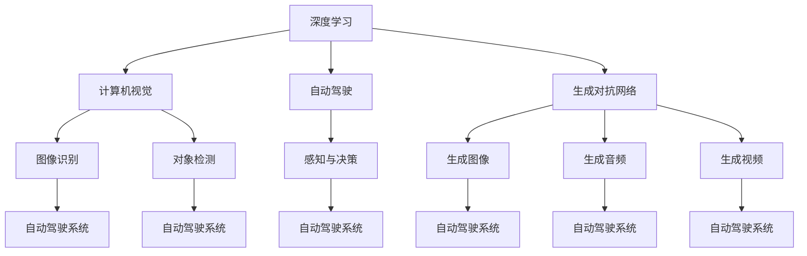

                 

## 1. 背景介绍

在人工智能(AI)领域，Andrej Karpathy是一位备受尊敬的技术专家，以其在深度学习、计算机视觉和自动驾驶等方向的创新工作而闻名。作为一名斯坦福大学的计算机科学教授，Karpathy的研究成果不仅推动了学术界的进步，也深刻影响了工业界的实践。他的工作涵盖了从基础理论到实际应用，从底层算法到上层系统架构的各个层面。本文将从Karpathy的视角，探讨人工智能未来的发展机遇。

## 2. 核心概念与联系

在探讨未来发展机遇之前，我们需要先理解一些核心概念及其相互联系。

### 2.1 核心概念概述

- **深度学习(Deep Learning)**：一种机器学习技术，通过多层神经网络从数据中学习表示，用于图像识别、自然语言处理、语音识别等任务。
- **计算机视觉(Computer Vision)**：涉及将计算机用于图像和视频分析的技术，旨在使机器“看”和“理解”图像内容。
- **自动驾驶(Autonomous Driving)**：利用计算机视觉和深度学习实现车辆自主驾驶的技术。
- **生成对抗网络(GANs)**：一种用于生成具有逼真特性的图像、音频、视频等内容的技术。
- **强化学习(Reinforcement Learning)**：一种机器学习技术，通过智能体在环境中与环境交互，通过奖励信号学习最佳策略。

### 2.2 核心概念原理和架构的 Mermaid 流程图



此图展示了深度学习在计算机视觉、自动驾驶、生成对抗网络等方向的应用。不同概念间通过技术架构的连线表示，显示它们之间的相互依赖和交互。

## 3. 核心算法原理 & 具体操作步骤

### 3.1 算法原理概述

Karpathy的工作跨越了多个领域，涵盖了从基础算法到系统架构的广泛内容。以下将详细探讨他的一些关键算法和原理。

### 3.2 算法步骤详解

#### 深度学习算法步骤

1. **数据准备**：收集并预处理训练数据，包括数据增强、数据标准化等。
2. **模型设计**：选择合适的神经网络结构，如卷积神经网络(CNN)、循环神经网络(RNN)、Transformer等。
3. **训练模型**：使用优化算法(如Adam、SGD)和损失函数(如交叉熵、均方误差)，在训练集上优化模型参数。
4. **模型评估**：在验证集上评估模型性能，如准确率、召回率、F1分数等。
5. **模型应用**：将训练好的模型应用到实际问题中，进行推理或预测。

#### 计算机视觉算法步骤

1. **图像预处理**：对图像进行归一化、裁剪、缩放等处理。
2. **特征提取**：使用卷积层或Transformer层提取图像特征。
3. **分类或检测**：使用全连接层或ROI池化层对特征进行分类或检测。
4. **模型融合**：结合多个模型的输出结果，提升模型性能。

#### 自动驾驶算法步骤

1. **传感器数据采集**：通过摄像头、雷达等传感器收集环境数据。
2. **数据处理**：对传感器数据进行滤波、校正、融合等处理。
3. **环境理解**：利用计算机视觉和深度学习技术，理解车辆周围环境。
4. **决策规划**：通过强化学习或规则引擎，制定驾驶策略。
5. **控制执行**：将驾驶策略转化为车辆控制命令，实现自动驾驶。

### 3.3 算法优缺点

#### 深度学习算法

**优点**：
- **泛化能力强**：深度学习模型能够处理复杂的数据结构，如图像、文本等。
- **端到端学习**：能够自动提取特征和训练模型，减少手工设计特征的麻烦。
- **计算性能提升**：通过GPU、TPU等硬件加速，加快训练和推理速度。

**缺点**：
- **资源消耗大**：需要大量数据和计算资源进行训练。
- **模型复杂度高**：设计复杂的神经网络结构，可能导致过度拟合。
- **可解释性差**：深度学习模型难以解释其内部决策过程，缺乏透明性。

#### 计算机视觉算法

**优点**：
- **高精度**：通过深度学习，计算机视觉算法在图像识别、目标检测等任务上取得了高精度。
- **多模态融合**：能够将图像、雷达、激光雷达等数据进行多模态融合，提升环境理解能力。
- **实时性**：通过硬件加速和模型优化，实现实时处理。

**缺点**：
- **数据依赖**：依赖高质量标注数据，数据采集和标注成本高。
- **鲁棒性不足**：对光照、角度、遮挡等变化敏感，鲁棒性不足。
- **计算密集**：高分辨率图像和复杂网络结构导致计算密集，推理速度慢。

#### 自动驾驶算法

**优点**：
- **安全性提升**：自动驾驶技术能够减少人为失误，提高交通安全。
- **效率提升**：自动驾驶车辆可以24小时不间断运行，提高物流效率。
- **用户体验改善**：自动驾驶技术可以缓解驾驶员疲劳，提升驾驶体验。

**缺点**：
- **技术复杂**：涉及传感器、计算机视觉、深度学习、强化学习等多个领域的综合应用。
- **法规和伦理问题**：自动驾驶技术面临法律法规和伦理道德的挑战，尚未全面普及。
- **成本高**：自动驾驶车辆初始成本高，后期维护和更新成本大。

### 3.4 算法应用领域

Karpathy的研究涵盖了多个应用领域，以下是其中几个主要的领域：

- **深度学习在图像处理中的应用**：如医学影像分析、工业检测等。
- **计算机视觉在无人驾驶中的应用**：如环境感知、目标检测、路径规划等。
- **生成对抗网络在图像生成中的应用**：如人脸生成、艺术创作等。
- **强化学习在智能控制中的应用**：如机器人导航、智能游戏等。

## 4. 数学模型和公式 & 详细讲解 & 举例说明

### 4.1 数学模型构建

以计算机视觉中的目标检测任务为例，构建基于深度学习的目标检测模型。

- **输入数据**：图像$x$和标注框$y$。
- **网络结构**：包含卷积层、池化层、全连接层等。
- **输出结果**：检测框的位置和大小。

### 4.2 公式推导过程

以目标检测中的YOLO(You Only Look Once)模型为例，推导检测框的位置和大小：

$$
\text{位置} = \text{conv}(x, \theta) \cdot \text{anchor}
$$

$$
\text{大小} = \text{exp}(\text{conv}(x, \theta))
$$

其中，$\text{conv}(x, \theta)$表示通过卷积层提取特征，$\text{anchor}$表示锚点框的大小，$\text{exp}(\cdot)$表示指数函数。

### 4.3 案例分析与讲解

以Karpathy在计算机视觉领域的工作为例，分析其如何利用深度学习提高目标检测的准确性和鲁棒性：

- **数据增强**：通过随机裁剪、翻转、旋转等数据增强技术，提升模型的泛化能力。
- **多尺度训练**：使用不同尺度的图像进行训练，提升模型在不同场景下的适应性。
- **目标检测器融合**：结合多个检测器的输出，提升检测准确性。

## 5. 项目实践：代码实例和详细解释说明

### 5.1 开发环境搭建

以计算机视觉项目为例，搭建深度学习开发环境：

1. **安装Python**：使用Anaconda安装最新版本的Python。
2. **安装深度学习库**：安装TensorFlow、PyTorch、OpenCV等深度学习库。
3. **安装数据处理库**：安装Pillow、NumPy、Pandas等数据处理库。

### 5.2 源代码详细实现

以下是一个简单的目标检测项目代码实现：

```python
import tensorflow as tf
import numpy as np
import cv2

# 加载模型
model = tf.keras.models.load_model('yolo_model.h5')

# 加载标签
classes = ['person', 'car', 'bus', 'bicycle', 'traffic light']

# 加载图像
image = cv2.imread('image.jpg')

# 图像预处理
image = cv2.resize(image, (416, 416))
image = image / 255.0

# 模型预测
boxes, scores, classes = model.predict(np.expand_dims(image, axis=0))

# 后处理
boxes = boxes[0]
scores = scores[0]
classes = classes[0]

# 可视化
for i in range(len(boxes)):
    x1, y1, x2, y2 = boxes[i]
    cv2.rectangle(image, (int(x1), int(y1)), (int(x2), int(y2)), (0, 255, 0), 2)
    cv2.putText(image, classes[i], (int(x1), int(y1)-10), cv2.FONT_HERSHEY_SIMPLEX, 0.5, (0, 255, 0), 2)

cv2.imshow('image', image)
cv2.waitKey(0)
cv2.destroyAllWindows()
```

### 5.3 代码解读与分析

**代码功能**：
- **加载模型**：从磁盘加载预训练的目标检测模型。
- **加载标签**：从磁盘加载模型预测的标签类别。
- **加载图像**：从磁盘加载待检测的图像。
- **图像预处理**：将图像缩放至网络输入大小，并进行归一化处理。
- **模型预测**：将预处理后的图像输入模型，获取检测框、置信度和类别。
- **后处理**：对模型输出的检测框进行非极大值抑制，筛选出置信度最高的检测框。
- **可视化**：在图像上绘制检测框和类别标签，并进行展示。

**代码关键点**：
- **模型加载**：使用`tf.keras.models.load_model`加载模型，支持多种文件格式，如HDF5、TensorFlow、Keras等。
- **图像预处理**：通过`cv2.resize`和`np.expand_dims`实现图像的缩放和添加维度操作。
- **模型预测**：使用`model.predict`对图像进行预测，返回检测框、置信度和类别。
- **后处理**：通过`np.where`筛选置信度最高的检测框。
- **可视化**：使用`cv2.rectangle`和`cv2.putText`在图像上绘制检测框和标签。

## 6. 实际应用场景

### 6.1 智能交通系统

Karpathy在自动驾驶领域的研究对智能交通系统的发展产生了深远影响。通过计算机视觉和深度学习技术，自动驾驶车辆能够实现环境感知、路径规划和智能决策，提升交通安全和效率。

#### 实际应用

- **环境感知**：通过摄像头和雷达传感器采集周围环境数据，利用深度学习模型提取特征。
- **路径规划**：通过强化学习或规则引擎，制定最优驾驶路径。
- **智能决策**：在复杂交通环境中做出实时决策，避免交通事故。

### 6.2 医学影像分析

Karpathy在医学影像分析领域的研究，通过深度学习技术实现了高精度的图像分类、病变检测和图像分割，为医疗诊断和治疗提供了强大的技术支持。

#### 实际应用

- **图像分类**：通过卷积神经网络对医学影像进行分类，判断病情。
- **病变检测**：通过语义分割技术，检测医学影像中的病变区域。
- **图像分割**：将医学影像分割为不同的器官和组织，便于手术和治疗。

### 6.3 游戏AI

Karpathy在智能游戏领域的研究，通过强化学习技术训练游戏AI，使其具备高水平的游戏策略和决策能力。

#### 实际应用

- **环境建模**：构建游戏环境模型，提取游戏状态特征。
- **策略学习**：通过Q-learning等强化学习算法，训练游戏AI。
- **行为决策**：在复杂游戏场景中做出实时决策，实现游戏胜利。

## 7. 工具和资源推荐

### 7.1 学习资源推荐

以下是Karpathy推荐的几个学习资源：

1. **《Deep Learning》**：Ian Goodfellow等著，全面介绍深度学习理论和实践，涵盖神经网络、优化算法、卷积神经网络、循环神经网络等多个方面。
2. **《计算机视觉：模型、学习和推理》**：David Foster等著，介绍计算机视觉的基本概念和经典算法，如边缘检测、特征提取、目标检测等。
3. **《强化学习》**：Richard S. Sutton和Andrew G. Barto著，介绍强化学习的基本概念和算法，如Q-learning、策略梯度、蒙特卡洛树搜索等。
4. **《深度学习框架教程》**：由Karpathy本人撰写，介绍TensorFlow、PyTorch等深度学习框架的使用和优化技巧。

### 7.2 开发工具推荐

以下是Karpathy推荐的几个开发工具：

1. **TensorFlow**：由Google开发，用于深度学习模型的构建和训练。
2. **PyTorch**：由Facebook开发，用于深度学习模型的构建和训练，支持动态图和静态图两种模式。
3. **OpenCV**：用于图像处理和计算机视觉任务的开发。
4. **Jupyter Notebook**：用于数据科学和机器学习任务的开源平台，支持Python、R等多种语言。
5. **Github**：用于版本控制和代码协作的平台，支持公开和私有仓库。

### 7.3 相关论文推荐

以下是Karpathy发表的几篇具有影响力的论文：

1. **《Visualizing and Understanding Convolutional Networks》**：介绍深度卷积神经网络的可视化方法和理解技术。
2. **《Learning to Drive with Visual Prediction》**：介绍计算机视觉技术在自动驾驶中的应用，包括环境感知、路径规划和智能决策。
3. **《Training Recurrent Neural Networks to Play Atari》**：介绍强化学习在智能游戏中的应用，通过Q-learning算法训练游戏AI。

## 8. 总结：未来发展趋势与挑战

### 8.1 研究成果总结

Karpathy在深度学习、计算机视觉和自动驾驶等领域的研究，推动了人工智能技术的进步和应用。以下是他的一些关键研究成果：

- **深度学习算法**：提出基于卷积神经网络的目标检测算法，如YOLO、R-CNN等，推动了计算机视觉技术的发展。
- **计算机视觉技术**：开发用于自动驾驶的环境感知和目标检测算法，实现高精度的环境理解和决策。
- **强化学习算法**：训练高水平的游戏AI，实现复杂游戏中的智能决策和胜利。

### 8.2 未来发展趋势

未来，人工智能技术将持续发展和突破，主要趋势包括：

- **深度学习算法**：深度学习将继续深化，引入更多先进技术和理论，如自适应优化、模型压缩等。
- **计算机视觉技术**：计算机视觉技术将更广泛地应用于自动驾驶、医疗、安防等领域，实现高精度的环境理解和智能决策。
- **自动驾驶技术**：自动驾驶技术将进一步成熟，实现高安全性、高可靠性和高效率的自动驾驶车辆。

### 8.3 面临的挑战

尽管人工智能技术取得了显著进展，但仍面临一些挑战：

- **数据隐私和安全**：大规模数据采集和处理带来隐私和安全问题，需要加强数据保护和隐私保护。
- **模型鲁棒性和泛化能力**：深度学习模型面临过拟合和泛化能力不足的问题，需要更多的正则化和数据增强技术。
- **计算资源需求**：深度学习模型需要大量的计算资源进行训练和推理，如何高效利用资源是未来的一个重要研究方向。

### 8.4 研究展望

未来，人工智能技术将在更多领域发挥重要作用，主要研究方向包括：

- **跨模态学习**：将不同模态的数据进行融合，实现更加全面和准确的信息理解。
- **元学习**：开发可以学习如何学习的算法，提升模型的适应性和泛化能力。
- **对抗性学习**：研究对抗样本和对抗攻击，提高模型的鲁棒性和安全性。

## 9. 附录：常见问题与解答

**Q1：深度学习算法有哪些优点和缺点？**

A：深度学习算法的优点包括：
- **泛化能力强**：能够处理复杂的数据结构，如图像、文本等。
- **端到端学习**：能够自动提取特征和训练模型，减少手工设计特征的麻烦。
- **计算性能提升**：通过GPU、TPU等硬件加速，加快训练和推理速度。

深度学习算法的缺点包括：
- **资源消耗大**：需要大量数据和计算资源进行训练。
- **模型复杂度高**：设计复杂的神经网络结构，可能导致过度拟合。
- **可解释性差**：深度学习模型难以解释其内部决策过程，缺乏透明性。

**Q2：计算机视觉技术在自动驾驶中的应用有哪些？**

A：计算机视觉技术在自动驾驶中的应用包括：
- **环境感知**：通过摄像头和雷达传感器采集周围环境数据，利用深度学习模型提取特征。
- **路径规划**：通过强化学习或规则引擎，制定最优驾驶路径。
- **智能决策**：在复杂交通环境中做出实时决策，避免交通事故。

**Q3：如何提高深度学习模型的鲁棒性？**

A：提高深度学习模型的鲁棒性可以从以下几个方面入手：
- **数据增强**：通过随机裁剪、翻转、旋转等数据增强技术，提升模型的泛化能力。
- **多尺度训练**：使用不同尺度的图像进行训练，提升模型在不同场景下的适应性。
- **模型正则化**：使用L2正则、Dropout等正则化技术，防止模型过拟合。
- **对抗训练**：引入对抗样本，提高模型鲁棒性。

**Q4：如何优化深度学习模型的推理速度？**

A：优化深度学习模型的推理速度可以从以下几个方面入手：
- **模型裁剪**：去除不必要的层和参数，减小模型尺寸，加快推理速度。
- **量化加速**：将浮点模型转为定点模型，压缩存储空间，提高计算效率。
- **模型并行**：使用多GPU、多节点等并行计算，提升推理速度。

**Q5：未来人工智能技术的发展方向有哪些？**

A：未来人工智能技术的发展方向包括：
- **跨模态学习**：将不同模态的数据进行融合，实现更加全面和准确的信息理解。
- **元学习**：开发可以学习如何学习的算法，提升模型的适应性和泛化能力。
- **对抗性学习**：研究对抗样本和对抗攻击，提高模型的鲁棒性和安全性。
- **自适应优化**：开发适应不同数据和任务的优化算法，提升模型训练效率。
- **模型压缩**：使用模型剪枝、知识蒸馏等技术，提升模型的推理速度和资源利用效率。

以上是对Andrej Karpathy在人工智能领域的研究工作及其未来发展机遇的详细探讨。希望本文能为你提供一些有价值的参考和启发，推动你在人工智能领域的深入学习和研究。

