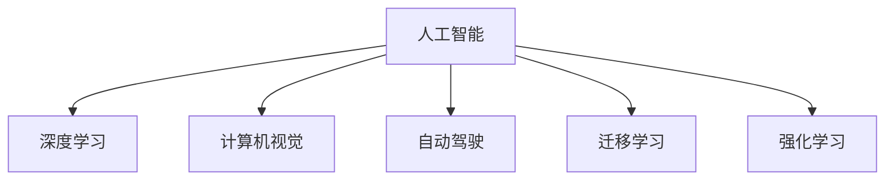

                 

## 1. 背景介绍

安德烈·卡帕西（Andrej Karpathy）是当今人工智能领域中最具影响力的人物之一，他在计算机视觉、深度学习和自动驾驶等领域均有卓越贡献。本文将深入探讨他关于人工智能未来发展策略的思考，期望为读者提供有价值的见解和指导。

### 1.1 背景概述

安德烈·卡帕西（Andrej Karpathy）教授出生于克罗地亚，后在加拿大多伦多大学和斯坦福大学深造，最终在美国斯坦福大学获得博士学位。他在计算机视觉、深度学习和自动驾驶等领域取得了开创性的成果。卡帕西是NVIDIA首席AI科学家，同时也是深度学习研究团队Tesla AI的负责人。

他的研究领域广泛，涉及图像识别、自动驾驶、机器人控制和自然语言处理等。卡帕西在ICCV、CVPR等顶级会议上多次发表了获奖论文，并获得了多个奖项，如Google Research Award、NVIDIA Award for Creativity and Impact。

## 2. 核心概念与联系

### 2.1 核心概念概述

为理解卡帕西关于人工智能未来发展策略的思考，本节将介绍几个核心概念：

- **人工智能(AI)**：一种使机器能够模拟人类智能过程的技术，包括学习、推理、感知、规划等能力。
- **深度学习(Deep Learning)**：一种基于人工神经网络的机器学习技术，能够处理非线性和大规模数据。
- **计算机视觉(Computer Vision)**：利用计算机模拟人类视觉系统，实现图像识别、目标检测和图像生成等任务。
- **自动驾驶(Autonomous Driving)**：通过计算机视觉和深度学习技术，使车辆能够自主导航和决策。
- **迁移学习(Transfer Learning)**：一种通过已有知识帮助新任务学习的方法，提升模型在小样本情况下的性能。
- **强化学习(Reinforcement Learning)**：一种通过奖励和惩罚机制学习最优决策策略的方法，特别适用于需要实时反馈的任务。

这些核心概念之间的逻辑关系可以通过以下Mermaid流程图来展示：



这个流程图展示了一个典型的人工智能系统构建框架，其中深度学习是实现人工智能的核心技术，计算机视觉、自动驾驶和强化学习是具体应用场景，迁移学习则是将知识从已有任务迁移到新任务的过程。

## 3. 核心算法原理 & 具体操作步骤

### 3.1 算法原理概述

安德烈·卡帕西对人工智能的发展有着深入的思考，他认为人工智能的未来发展策略需要关注以下几个关键点：

- **数据的重要性**：人工智能系统需要大量高质量的数据进行训练，数据的丰富性和多样性将直接影响模型的性能。
- **算法的创新**：深度学习算法不断演进，新的算法和架构能够提升模型的泛化能力和效率。
- **模型解释性**：理解模型如何做出决策，对于构建可解释的人工智能系统至关重要。
- **模型的可扩展性**：模型的可扩展性决定了其能否应用到更多领域和更大规模的数据上。
- **跨学科融合**：人工智能与自然语言处理、计算机视觉、机器人学等学科的融合将推动技术的创新和应用。

### 3.2 算法步骤详解

卡帕西认为，实现人工智能未来的发展策略需要遵循以下步骤：

1. **数据收集和标注**：从多个来源收集数据，并根据具体任务需求进行标注。确保数据的质量和多样性。
2. **算法设计**：根据任务需求设计合适的深度学习算法和模型架构，如卷积神经网络（CNN）、循环神经网络（RNN）、变压器（Transformer）等。
3. **模型训练**：利用大量数据对模型进行训练，调整超参数，确保模型泛化能力强。
4. **模型评估和优化**：在测试集上评估模型性能，通过交叉验证、正则化等技术优化模型。
5. **模型部署**：将训练好的模型部署到实际应用中，确保模型的稳定性和性能。
6. **模型维护和更新**：持续收集新数据，定期更新模型，提升模型效果。

### 3.3 算法优缺点

安德烈·卡帕西对深度学习和人工智能的策略思考，也有其优缺点：

**优点**：
- 深度学习算法能够处理复杂、非线性的问题，广泛应用于图像识别、语音识别、自然语言处理等领域。
- 大数据和算力的支持使得深度学习模型能够迅速提升性能，逐步逼近人类智能。

**缺点**：
- 数据标注成本高，需要大量人力物力，限制了数据收集和处理的效率。
- 深度学习模型存在"黑盒"问题，难以解释其决策过程。
- 需要大量计算资源，硬件成本高昂，限制了模型的可扩展性。

### 3.4 算法应用领域

卡帕西认为，人工智能技术将会在以下领域得到广泛应用：

1. **自动驾驶**：通过计算机视觉和深度学习技术，实现车辆自主导航和决策。
2. **机器人控制**：利用强化学习技术，训练机器人执行复杂任务，如物流配送、家庭服务。
3. **医疗诊断**：利用计算机视觉技术，辅助医生进行疾病诊断和图像分析。
4. **自然语言处理**：通过深度学习模型，实现语言理解、生成和翻译。
5. **金融分析**：利用深度学习模型，进行风险评估、股票预测和欺诈检测。

## 4. 数学模型和公式 & 详细讲解 & 举例说明

### 4.1 数学模型构建

在深度学习中，常见的数学模型包括多层感知器（MLP）、卷积神经网络（CNN）、循环神经网络（RNN）和变压器（Transformer）等。以下以卷积神经网络（CNN）为例，展示其基本模型构建和数学推导过程。

**卷积神经网络(CNN)**：

卷积神经网络是一种广泛用于图像识别和处理的深度学习模型。其核心思想是通过卷积和池化操作提取图像的局部特征，并通过全连接层进行分类。

- **输入**：输入数据为$x \in \mathbb{R}^{m \times n \times c}$，表示$m \times n$像素、$c$个通道的图像数据。
- **卷积层**：通过卷积核$W \in \mathbb{R}^{k \times k \times c}$，对输入数据进行卷积操作，得到特征图$y \in \mathbb{R}^{n' \times n' \times h}$，其中$k$为卷积核大小，$h$为卷积后的特征通道数。
- **激活函数**：对卷积层的输出进行非线性变换，常用的激活函数有ReLU、Sigmoid等。
- **池化层**：通过最大池化或平均池化操作，减小特征图的大小，降低计算复杂度。
- **全连接层**：将池化层的输出进行全连接操作，通过softmax函数得到最终的分类结果$z \in \mathbb{R}^{K}$，其中$K$为类别数。

### 4.2 公式推导过程

卷积神经网络（CNN）的卷积操作可以用公式表示为：

$$
y_{i,j} = \sum_{o=1}^{c} \sum_{p=1}^{k} \sum_{q=1}^{k} x_{i+p-1,j+q-1} * W_{o,p,q}
$$

其中，$x_{i,j}$表示输入图像中的像素值，$W_{o,p,q}$表示卷积核的权重参数，$y_{i,j}$表示卷积层输出的特征图。

### 4.3 案例分析与讲解

以图像分类为例，展示卷积神经网络的训练和测试过程：

**训练过程**：

1. **数据准备**：收集图像数据集，并进行预处理，如归一化、数据增强等。
2. **模型初始化**：随机初始化卷积核和全连接层权重。
3. **前向传播**：输入图像数据，通过卷积和激活函数操作得到特征图，再通过池化层和全连接层计算最终分类结果。
4. **计算损失**：通过softmax交叉熵损失函数计算模型输出与真实标签之间的差距。
5. **反向传播**：计算损失函数对模型参数的梯度，更新权重参数。
6. **重复**：多次迭代训练，直至损失函数收敛。

**测试过程**：

1. **数据准备**：收集测试图像数据集，并进行预处理。
2. **模型推理**：输入测试图像数据，通过前向传播操作得到分类结果。
3. **评估模型**：计算模型在测试集上的分类准确率，评估模型性能。

## 5. 项目实践：代码实例和详细解释说明

### 5.1 开发环境搭建

在进行深度学习项目实践前，我们需要准备好开发环境。以下是使用Python进行TensorFlow开发的环境配置流程：

1. 安装Anaconda：从官网下载并安装Anaconda，用于创建独立的Python环境。

2. 创建并激活虚拟环境：
```bash
conda create -n tf-env python=3.7 
conda activate tf-env
```

3. 安装TensorFlow：根据CUDA版本，从官网获取对应的安装命令。例如：
```bash
conda install tensorflow -c conda-forge
```

4. 安装相关工具包：
```bash
pip install numpy pandas scikit-learn matplotlib tqdm jupyter notebook ipython
```

完成上述步骤后，即可在`tf-env`环境中开始深度学习项目实践。

### 5.2 源代码详细实现

这里以图像分类为例，展示使用TensorFlow实现卷积神经网络模型的过程。

```python
import tensorflow as tf
from tensorflow.keras import datasets, layers, models

# 加载数据集
(train_images, train_labels), (test_images, test_labels) = datasets.cifar10.load_data()

# 数据预处理
train_images = train_images / 255.0
test_images = test_images / 255.0

# 定义模型架构
model = models.Sequential([
    layers.Conv2D(32, (3, 3), activation='relu', input_shape=(32, 32, 3)),
    layers.MaxPooling2D((2, 2)),
    layers.Conv2D(64, (3, 3), activation='relu'),
    layers.MaxPooling2D((2, 2)),
    layers.Conv2D(64, (3, 3), activation='relu'),
    layers.Flatten(),
    layers.Dense(64, activation='relu'),
    layers.Dense(10)
])

# 编译模型
model.compile(optimizer='adam',
              loss=tf.keras.losses.SparseCategoricalCrossentropy(from_logits=True),
              metrics=['accuracy'])

# 训练模型
model.fit(train_images, train_labels, epochs=10, 
          validation_data=(test_images, test_labels))

# 测试模型
test_loss, test_acc = model.evaluate(test_images, test_labels, verbose=2)
print('Test accuracy:', test_acc)
```

### 5.3 代码解读与分析

让我们再详细解读一下关键代码的实现细节：

**数据加载和预处理**：
- 使用TensorFlow内置的数据集加载函数，加载CIFAR-10图像分类数据集。
- 将图像数据归一化到0-1之间，以便模型训练。

**模型架构**：
- 定义了三层卷积神经网络模型，包括卷积层、池化层和全连接层。
- 通过Softmax交叉熵损失函数和Adam优化器编译模型。
- 使用训练集数据训练模型，并在验证集上评估模型性能。
- 使用测试集数据测试模型，输出最终测试准确率。

## 6. 实际应用场景

### 6.1 自动驾驶

安德烈·卡帕西在自动驾驶领域有着卓越的研究成果。他领导的Tesla AI团队，利用深度学习和计算机视觉技术，开发了自动驾驶系统Autopilot。该系统能够实现自动导航、车道保持、自适应巡航控制等功能，极大提升了驾驶的便利性和安全性。

**技术实现**：
- 利用摄像头和雷达传感器收集环境信息。
- 通过卷积神经网络（CNN）和循环神经网络（RNN）模型，实现目标检测、路径规划和决策控制。
- 使用强化学习算法，优化自动驾驶策略，提升系统的稳定性和可靠性。

**应用场景**：
- 自动驾驶出租车：提升城市交通效率，减少交通事故。
- 无人配送：实现货物自动化配送，降低物流成本。

### 6.2 医疗诊断

在医疗领域，卡帕西团队开发了计算机视觉系统，用于辅助医生进行疾病诊断和图像分析。该系统通过深度学习模型，能够自动分析医学影像，识别异常区域和病变特征。

**技术实现**：
- 收集大量的医学影像数据，并进行标注。
- 利用卷积神经网络（CNN）模型，对医学影像进行特征提取和分类。
- 通过迁移学习技术，将已有的知识迁移到新的医学影像分类任务中。

**应用场景**：
- 乳腺癌诊断：自动分析乳腺X光片，检测早期乳腺癌。
- 皮肤癌诊断：识别皮肤病变区域，辅助医生进行诊断和治疗。

### 6.3 自然语言处理

在自然语言处理领域，卡帕西团队开发了Transformer模型，该模型在机器翻译、语言生成和文本分类等任务上取得了突破性成果。

**技术实现**：
- 使用Transformer模型，实现多模态数据的联合建模。
- 通过自监督学习任务，预训练大语言模型，提升模型的泛化能力。
- 利用迁移学习技术，将预训练模型应用于具体的自然语言处理任务。

**应用场景**：
- 机器翻译：实现高质量的文本翻译，支持多种语言之间的互译。
- 语言生成：生成自然流畅的对话和文本，支持虚拟助手和聊天机器人。

## 7. 工具和资源推荐

### 7.1 学习资源推荐

为帮助开发者系统掌握深度学习技术，以下推荐一些优质的学习资源：

1. 《深度学习》（Ian Goodfellow等著）：深入浅出地介绍了深度学习的原理和应用，是学习深度学习的必读书籍。
2. 《动手学深度学习》（李沐等著）：基于TensorFlow实现，适合动手实践。
3. 《计算机视觉：算法与应用》（Simard等著）：详细介绍计算机视觉技术，涵盖图像处理、目标检测和图像分割等任务。
4. Coursera深度学习课程：斯坦福大学李飞飞教授开设的深度学习课程，系统讲解深度学习的理论和实践。
5. arXiv论文：阅读前沿的深度学习和计算机视觉论文，掌握最新研究动态。

### 7.2 开发工具推荐

高效的深度学习开发离不开优秀的工具支持。以下是几款常用的工具：

1. TensorFlow：基于Python的深度学习框架，具有灵活的计算图和强大的分布式训练能力。
2. PyTorch：基于Python的深度学习框架，易于使用，具有动态计算图的特点。
3. Keras：基于TensorFlow和Theano的高级神经网络API，适合快速原型设计和模型训练。
4. Jupyter Notebook：交互式的开发环境，支持代码编辑和数据可视化。
5. TensorBoard：TensorFlow配套的可视化工具，用于实时监测模型训练状态。

### 7.3 相关论文推荐

深度学习和计算机视觉领域的研究成果丰富，以下推荐一些经典和前沿的论文：

1. AlexNet：ImageNet大规模视觉识别挑战赛的获胜者，标志着深度学习在计算机视觉领域的应用。
2. ResNet：提出残差网络结构，解决了深度网络训练中的梯度消失问题。
3. InceptionNet：提出多尺度卷积结构，提升了模型在图像分类任务上的性能。
4. Transformer：提出自注意力机制，改变了自然语言处理任务的范式。
5. EfficientNet：提出网络结构自适应方法，提升了模型在多个任务上的性能。

## 8. 总结：未来发展趋势与挑战

### 8.1 研究成果总结

安德烈·卡帕西在深度学习和计算机视觉领域的研究成果丰硕，涵盖了图像识别、自动驾驶、自然语言处理等多个方向。他的研究不仅推动了相关技术的进步，还为人工智能技术在实际应用中的落地提供了有力的支持。

### 8.2 未来发展趋势

安德烈·卡帕西认为，人工智能技术将呈现以下几个发展趋势：

1. **深度学习的进步**：深度学习算法和模型架构不断演进，模型的泛化能力和效率将进一步提升。
2. **计算机视觉的突破**：计算机视觉技术将在医疗、安防、智能交通等领域得到广泛应用。
3. **自然语言处理的发展**：自然语言处理技术将逐步实现语音识别、文本理解和生成等能力。
4. **跨学科融合**：人工智能与机器人学、金融工程等领域的融合将带来新的创新。
5. **数据驱动的决策**：通过数据驱动的方式，提升决策的科学性和准确性。

### 8.3 面临的挑战

尽管深度学习和人工智能技术取得了显著进展，但在实际应用中也面临诸多挑战：

1. **数据依赖**：深度学习模型需要大量高质量的数据进行训练，数据收集和标注成本高昂。
2. **模型解释性**：深度学习模型存在"黑盒"问题，难以解释其决策过程。
3. **计算资源**：深度学习模型需要大量的计算资源进行训练和推理，硬件成本高昂。
4. **安全性和隐私**：深度学习模型在实际应用中可能面临数据泄露和攻击风险。
5. **伦理和法律**：人工智能技术的广泛应用需要考虑伦理和法律问题，避免误导性输出。

### 8.4 研究展望

面向未来，安德烈·卡帕西认为，人工智能技术需要在以下几个方面进行深入研究：

1. **数据高效利用**：研究如何在少量数据下训练高效模型，提升模型的泛化能力。
2. **模型可解释性**：开发可解释的深度学习模型，增强模型的透明性和可靠性。
3. **跨领域应用**：将人工智能技术应用于更多领域，提升跨领域应用的能力。
4. **伦理和法律**：研究人工智能技术的伦理和法律问题，确保技术应用的安全性和可控性。

## 9. 附录：常见问题与解答

**Q1：深度学习与传统机器学习有什么区别？**

A: 深度学习与传统机器学习的区别在于模型的复杂度和学习方式。深度学习模型通常具有多层的神经网络结构，能够自动提取和组合特征，适合处理复杂、非线性的问题。而传统机器学习模型则依赖手动设计的特征提取器，适用于简单的数据处理任务。

**Q2：如何理解深度学习中的“深度”？**

A: 深度学习中的“深度”指模型的层数，即网络中传递信息的深度。随着层数的增加，模型能够学习更加复杂和抽象的特征，提升模型的泛化能力。但深度模型的复杂性也带来了计算和训练的挑战，需要更多的数据和计算资源。

**Q3：如何选择合适的深度学习模型？**

A: 选择深度学习模型需要考虑任务类型、数据量和计算资源等因素。对于图像识别任务，卷积神经网络（CNN）是常用选择；对于自然语言处理任务，循环神经网络（RNN）和变压器（Transformer）是常用选择。同时，可以考虑模型的大小和复杂度，选择适合的模型进行训练。

**Q4：深度学习模型的训练和调参需要注意哪些问题？**

A: 深度学习模型的训练和调参需要注意以下几个问题：
1. 数据预处理：包括归一化、数据增强等操作，提升数据的质量和多样性。
2. 超参数调优：选择合适的学习率、批大小、迭代轮数等超参数，避免过拟合和欠拟合。
3. 正则化技术：使用L2正则、Dropout等技术，避免过拟合。
4. 模型验证：在验证集上评估模型性能，选择最优模型进行测试。

**Q5：深度学习模型在实际应用中面临哪些挑战？**

A: 深度学习模型在实际应用中面临以下挑战：
1. 数据依赖：需要大量高质量的数据进行训练，数据收集和标注成本高昂。
2. 模型复杂性：模型结构复杂，训练和推理速度慢，计算资源消耗大。
3. 模型解释性：存在"黑盒"问题，难以解释其决策过程。
4. 安全性和隐私：在实际应用中可能面临数据泄露和攻击风险。
5. 伦理和法律：需要考虑伦理和法律问题，避免误导性输出。

本文深入探讨了安德烈·卡帕西关于人工智能未来发展策略的思考，展示了深度学习技术在多个领域的应用，并展望了未来的发展趋势和面临的挑战。希望这些见解和分析能够为读者提供有价值的参考，共同推动人工智能技术的进步。

---

作者：禅与计算机程序设计艺术 / Zen and the Art of Computer Programming

