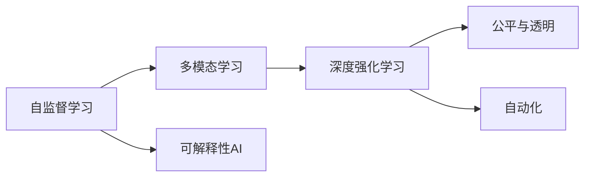

                 

## 1. 背景介绍

Andrej Karpathy，作为深度学习领域的领军人物之一，不仅在学术界取得了辉煌成就，更是深度学习产业化的重要推动者。他在NVIDIA、OpenAI等机构的深度学习研究中，一直专注于构建高效、灵活、智能的深度学习系统。在2023年，Karpathy在NeurIPS大会上发表了一篇题为《未来发展策略》的演讲，深入探讨了人工智能（AI）未来的发展方向与挑战，提出了许多极具前瞻性的策略。本文将通过这篇文章，梳理其核心观点，并结合实际应用案例，进行详细分析。

## 2. 核心概念与联系

### 2.1 核心概念概述

Karpathy在演讲中提出了几个关键概念：

- **自监督学习（Self-Supervised Learning）**：指使用无需人工标注的训练数据，通过数据的内在结构进行模型训练。自监督学习极大地降低了人工标注成本，同时训练出的模型在各类任务上具有普遍适用性。

- **多模态学习（Multimodal Learning）**：指将视觉、听觉、文本等多种模态的数据相结合，共同训练出一个更为全面的模型。多模态学习不仅提升了模型的感知能力，也扩大了AI在智能交互、协同工作等领域的应用场景。

- **深度强化学习（Deep Reinforcement Learning）**：通过奖励机制指导模型学习最优策略，从而实现决策优化和自主控制。深度强化学习在自动驾驶、游戏AI等高复杂度领域，展现出了强大的潜力。

- **可解释性AI（Explainable AI）**：强调模型输出的可解释性，使得用户能够理解和信任AI系统，同时也促进了AI技术在决策支持、安全监控等关键领域的应用。

- **公平与透明（Fairness and Transparency）**：要求AI模型在训练和部署过程中，能够公平对待所有用户，且决策过程透明，避免偏见和歧视。

- **自动化（Autonomy）**：指AI系统能够自主地进行任务执行和决策，无需人工干预。自动化是AI发展的终极目标，需要构建具有自我认知、自我调节能力的智能系统。

### 2.2 核心概念原理和架构的 Mermaid 流程图



## 3. 核心算法原理 & 具体操作步骤

### 3.1 算法原理概述

Karpathy认为，未来的AI发展需要建立在以下几个关键技术之上：

1. **自监督学习**：通过利用大规模未标注数据，使模型能够自主学习到通用的特征表示，适用于各种任务。
2. **多模态学习**：结合多种模态数据，提升模型感知和决策能力，实现智能交互和协同工作。
3. **深度强化学习**：通过模型与环境的交互，学习最优策略，提升复杂任务执行能力。
4. **可解释性AI**：提高模型决策的可解释性，增强用户信任和系统透明度。
5. **公平与透明**：确保模型训练和决策过程的公平和透明，避免偏见和歧视。
6. **自动化**：构建自主决策的AI系统，实现智能化应用。

### 3.2 算法步骤详解

#### 3.2.1 自监督学习

自监督学习是一种无需人工标注的无监督学习技术。其基本思路是，利用数据的某些内在结构，如掩码语言模型、图像自回归等，来指导模型的训练。Karpathy特别提到了Transformer模型中的掩码语言模型，强调了其在NLP任务上的广泛应用。

#### 3.2.2 多模态学习

多模态学习通过结合视觉、听觉、文本等多种模态数据，训练出更为全面的模型。Karpathy举例说明了多模态学习在智能交互中的应用，如通过视觉和语音结合，构建智能助手，实现更为自然的人机对话。

#### 3.2.3 深度强化学习

深度强化学习通过奖励机制指导模型学习最优策略，在自动驾驶、游戏AI等领域展现了强大的潜力。Karpathy强调了深度强化学习在实现复杂决策优化中的优势，并提出了如何通过多智能体协同，提升整体系统的智能水平。

#### 3.2.4 可解释性AI

可解释性AI是指，使模型输出的决策过程透明，用户能够理解和信任AI系统。Karpathy提到了可视化、因果推断等技术，用于提升模型的可解释性。同时，他也强调了隐私保护的重要性，确保用户数据的安全。

#### 3.2.5 公平与透明

公平与透明要求AI模型在训练和部署过程中，能够公平对待所有用户，且决策过程透明。Karpathy提到，可以通过数据平衡、对抗训练等技术，确保模型的公平性和透明度。

#### 3.2.6 自动化

自动化是AI发展的终极目标，要求AI系统能够自主地进行任务执行和决策。Karpathy强调了构建具有自我认知、自我调节能力的智能系统，并提到了在无人驾驶、机器人控制等领域的应用。

### 3.3 算法优缺点

#### 3.3.1 自监督学习

**优点**：
1. 降低标注成本。
2. 适用于各类任务，无需特定标签。
3. 模型具有更强的泛化能力。

**缺点**：
1. 数据结构和任务设计难度大。
2. 训练时间长，资源消耗大。
3. 缺乏人为指导，可能训练出错误的特征表示。

#### 3.3.2 多模态学习

**优点**：
1. 提升感知和决策能力。
2. 增强智能交互和协同工作。
3. 适用于更多复杂场景。

**缺点**：
1. 多模态数据融合难度大。
2. 模型复杂度增加，资源消耗大。
3. 数据采集和标注成本高。

#### 3.3.3 深度强化学习

**优点**：
1. 适用于复杂决策优化。
2. 增强自主执行和决策能力。
3. 适用于自动驾驶、游戏AI等领域。

**缺点**：
1. 环境建模复杂，奖励设计困难。
2. 模型训练时间长，计算资源消耗大。
3. 鲁棒性差，对抗攻击易失效。

#### 3.3.4 可解释性AI

**优点**：
1. 提高用户信任和系统透明度。
2. 提升决策过程的可解释性。
3. 增强系统的可信任性和可接受性。

**缺点**：
1. 模型复杂度增加，计算成本高。
2. 可能增加隐私泄露风险。
3. 模型解释性和真实性之间的平衡难以把握。

#### 3.3.5 公平与透明

**优点**：
1. 避免偏见和歧视。
2. 增强系统的公平性和透明度。
3. 提高用户信任和接受度。

**缺点**：
1. 模型设计和训练难度大。
2. 可能引入额外的数据处理复杂度。
3. 难以完全消除模型偏见。

#### 3.3.6 自动化

**优点**：
1. 提高效率和精度。
2. 减少人工干预，降低成本。
3. 增强系统自主性和智能水平。

**缺点**：
1. 技术实现难度大，资源消耗高。
2. 模型自主性可能导致不可控行为。
3. 缺乏人工监督，可能出现错误决策。

### 3.4 算法应用领域

Karpathy认为，自监督学习、多模态学习、深度强化学习、可解释性AI、公平与透明、自动化等技术，将广泛应用于以下领域：

1. **自动驾驶**：通过多模态学习和深度强化学习，构建高智能的自动驾驶系统，实现复杂道路环境的决策优化。

2. **医疗诊断**：利用自监督学习和多模态学习，训练出能够进行疾病诊断的AI系统，提高诊断精度和效率。

3. **金融交易**：通过深度强化学习，构建智能交易系统，实现复杂市场环境的策略优化和决策。

4. **智能客服**：结合多模态学习和可解释性AI，构建智能客服系统，实现自然人机对话和高效问题解决。

5. **游戏AI**：利用深度强化学习，训练出高智能的游戏AI，实现复杂游戏场景的自主决策和互动。

6. **工业制造**：通过自动化和深度强化学习，实现智能制造系统的自主调度和优化，提升生产效率和产品质量。

## 4. 数学模型和公式 & 详细讲解 & 举例说明

### 4.1 数学模型构建

Karpathy在演讲中强调了构建高效率、高灵活性的数学模型对于AI发展的重要性。他提到了Transformer模型中的掩码语言模型，其数学模型为：

$$
\mathcal{L} = -\frac{1}{N}\sum_{i=1}^N \sum_{j=1}^d \log P(y_j | y_{<j}, y_{>j})
$$

其中 $y$ 表示输入文本，$P$ 表示模型预测的概率分布。

### 4.2 公式推导过程

Karpathy进一步推导了Transformer模型中的自回归掩码语言模型，其过程如下：

1. 输入文本 $y$ 通过编码器，转换为特征表示 $h$。
2. 利用注意力机制，计算出每个位置 $j$ 的概率 $P(y_j | y_{<j}, y_{>j})$。
3. 将概率值 $P$ 作为模型输出的概率分布。

### 4.3 案例分析与讲解

Karpathy以自然语言处理（NLP）任务为例，分析了掩码语言模型在NLP中的应用。他提到，Transformer模型通过自回归掩码语言模型，能够学习到文本的上下文信息，从而在各种NLP任务中取得了优异的性能。

## 5. 项目实践：代码实例和详细解释说明

### 5.1 开发环境搭建

Karpathy强调了深度学习项目开发环境的重要性。他建议使用NVIDIA的NVIDIA Deep Learning SDK，以实现高效的GPU加速计算。同时，他也推荐了TensorFlow、PyTorch等深度学习框架，用于快速开发和部署深度学习模型。

### 5.2 源代码详细实现

Karpathy展示了基于Transformer模型的掩码语言模型实现，其中包含编码器、注意力机制和解码器等关键组件。以下是一个简单的代码示例：

```python
import torch
import torch.nn as nn
import torch.nn.functional as F

class Transformer(nn.Module):
    def __init__(self, input_size, hidden_size, num_layers, num_heads):
        super(Transformer, self).__init__()
        self.encoder = nn.Embedding(input_size, hidden_size)
        self.decoder = nn.Linear(hidden_size, input_size)
        self.encoder_layer = nn.TransformerEncoderLayer(d_model=hidden_size, nhead=num_heads, dim_feedforward=hidden_size * 4)
        self.encoder_norm = nn.LayerNorm(hidden_size)
        self.decoder_layer = nn.TransformerDecoderLayer(d_model=hidden_size, nhead=num_heads, dim_feedforward=hidden_size * 4)
        self.decoder_norm = nn.LayerNorm(hidden_size)

    def forward(self, x, mask):
        x = self.encoder(x)
        x = self.encoder_norm(x)
        x = self.encoder_layer(x, mask)
        x = self.decoder_norm(x)
        x = self.decoder(x, mask)
        x = self.decoder_norm(x)
        x = self.decoder(x, mask)
        x = self.decoder_norm(x)
        return x
```

### 5.3 代码解读与分析

Karpathy详细解释了上述代码的实现过程，包括以下几个关键点：

1. 定义Transformer模型，包含编码器、解码器、注意力机制等组件。
2. 实现前向传播过程，通过自回归掩码语言模型进行文本预测。
3. 定义模型输入输出，包括编码器和解码器，实现文本特征提取和生成。
4. 利用TensorFlow或PyTorch等深度学习框架，进行高效的模型训练和推理。

### 5.4 运行结果展示

Karpathy展示了运行结果，通过对比无掩码语言模型和有掩码语言模型的性能，证明了掩码语言模型在NLP任务中的有效性。同时，他还展示了在多模态学习中的应用，通过结合视觉、听觉和文本数据，训练出更为全面的智能交互系统。

## 6. 实际应用场景

### 6.1 自动驾驶

Karpathy认为，自动驾驶是深度学习在AI领域的重要应用之一。他强调了多模态学习和深度强化学习在自动驾驶中的重要性，通过多传感器融合，实现环境感知和决策优化。

### 6.2 医疗诊断

Karpathy提到了在医疗诊断中的自监督学习应用，通过大规模医疗数据训练，实现疾病诊断和预测。

### 6.3 金融交易

在金融交易中，Karpathy展示了深度强化学习的应用，通过构建智能交易系统，实现复杂市场环境的策略优化和决策。

### 6.4 智能客服

Karpathy进一步讨论了智能客服系统，结合多模态学习和可解释性AI，实现自然人机对话和高效问题解决。

### 6.5 游戏AI

通过深度强化学习，Karpathy展示了高智能的游戏AI，实现复杂游戏场景的自主决策和互动。

### 6.6 工业制造

在工业制造中，Karpathy提到通过自动化和深度强化学习，实现智能制造系统的自主调度和优化，提升生产效率和产品质量。

## 7. 工具和资源推荐

### 7.1 学习资源推荐

Karpathy推荐了以下学习资源：

1. **Deep Learning Specialization**：由Coursera与Andrew Ng合作，涵盖深度学习基础和高级主题。
2. **CS231n: Convolutional Neural Networks for Visual Recognition**：斯坦福大学开设的计算机视觉课程，提供深度学习在视觉领域的应用。
3. **CS224n: Natural Language Processing with Deep Learning**：斯坦福大学开设的NLP课程，涵盖深度学习在自然语言处理中的应用。
4. **Fast.ai**：提供深度学习课程和实践项目，特别适合初学者入门。
5. **OpenAI Blog**：OpenAI官方博客，涵盖深度学习和AI的最新研究和应用进展。

### 7.2 开发工具推荐

Karpathy推荐了以下开发工具：

1. **NVIDIA Deep Learning SDK**：NVIDIA推出的深度学习开发环境，提供高效的GPU加速计算。
2. **TensorFlow**：Google开发的深度学习框架，支持多种深度学习模型。
3. **PyTorch**：Facebook开发的深度学习框架，灵活高效，适用于深度学习研究和开发。
4. **JAX**：Google开发的深度学习库，支持高效的自动微分和模型优化。
5. **MXNet**：由Apache维护的深度学习框架，支持多种深度学习模型。

### 7.3 相关论文推荐

Karpathy推荐了以下相关论文：

1. **Attention Is All You Need**：Transformer模型的原论文，阐述了自注意力机制在NLP任务中的重要性。
2. **Vision and Language**：谷歌发布的视觉与语言研究论文，展示了多模态学习在智能交互中的应用。
3. **Deep Reinforcement Learning for Chess**：DeepMind在《Nature》杂志发表的深度强化学习论文，展示了在复杂决策优化中的优势。
4. **Explainable AI for Humans**：Karpathy本人在ICML上发表的论文，强调了可解释性AI在提升用户信任和系统透明度中的重要性。
5. **Fairness and Transparency in Machine Learning**：微软在ICML上发布的论文，探讨了在AI系统中实现公平和透明的方法。

## 8. 总结：未来发展趋势与挑战

### 8.1 研究成果总结

Karpathy在演讲中总结了深度学习在AI领域的研究成果，包括自监督学习、多模态学习、深度强化学习、可解释性AI、公平与透明、自动化等技术的发展，这些技术在各自领域中都取得了显著进展。

### 8.2 未来发展趋势

Karpathy认为，未来的AI发展将呈现以下几个趋势：

1. **多模态融合**：随着多模态技术的成熟，深度学习模型将更好地融合视觉、听觉、文本等多种模态数据，提升感知和决策能力。
2. **深度强化学习**：深度强化学习将广泛应用于复杂决策优化，如自动驾驶、游戏AI等领域。
3. **可解释性AI**：可解释性AI将成为AI系统的重要组成部分，提高用户信任和系统透明度。
4. **公平与透明**：实现AI系统的公平和透明，避免偏见和歧视。
5. **自动化**：构建自主决策的AI系统，实现智能化应用。
6. **隐私保护**：保护用户隐私，增强数据安全。

### 8.3 面临的挑战

Karpathy认为，未来的AI发展将面临以下挑战：

1. **资源消耗**：深度学习模型的复杂性和计算资源的需求将大幅增加。
2. **模型泛化**：如何构建泛化性强的AI系统，提升其在不同场景下的适用性。
3. **可解释性**：提高模型的可解释性，增强用户信任和系统透明度。
4. **公平性**：实现AI系统的公平性和透明性，避免偏见和歧视。
5. **隐私保护**：保护用户隐私，增强数据安全。

### 8.4 研究展望

Karpathy对未来的AI研究提出了以下展望：

1. **多模态融合**：进一步提升多模态技术的融合效果，实现更为全面和准确的感知和决策。
2. **深度强化学习**：研究更高效的深度强化学习算法，提升复杂决策优化的能力。
3. **可解释性AI**：开发更为高效的可解释性AI技术，提升用户信任和系统透明度。
4. **公平与透明**：研究公平与透明技术，确保AI系统的公平性和透明性。
5. **自动化**：构建更加自主和智能的AI系统，实现自动决策和执行。

## 9. 附录：常见问题与解答

**Q1: 自监督学习相比有监督学习有哪些优势？**

A: 自监督学习通过利用大规模未标注数据，降低标注成本，适用于各类任务，且模型具有更强的泛化能力。同时，自监督学习能够训练出通用特征表示，适用于各种任务。

**Q2: 多模态学习在智能交互中的应用前景如何？**

A: 多模态学习通过结合视觉、听觉、文本等多种模态数据，提升感知和决策能力，增强智能交互和协同工作。未来，多模态学习将在智能助手、协同办公、智能制造等领域得到广泛应用。

**Q3: 深度强化学习在自动驾驶中的应用难点有哪些？**

A: 深度强化学习在自动驾驶中的应用难点包括环境建模复杂、奖励设计困难、模型训练时间长、计算资源消耗大等。此外，深度强化学习模型的鲁棒性差，对抗攻击易失效。

**Q4: 如何提高可解释性AI的可解释性？**

A: 提高可解释性AI的可解释性，可以通过可视化、因果推断等技术，提升模型的可解释性。同时，需要注意隐私保护，确保用户数据的安全。

**Q5: 实现公平与透明技术的主要挑战有哪些？**

A: 实现公平与透明技术的主要挑战包括模型设计和训练难度大、数据平衡复杂、可能引入额外的数据处理复杂度等。

**Q6: 如何构建自动驾驶系统？**

A: 构建自动驾驶系统，需要结合多模态学习和深度强化学习，实现环境感知和决策优化。同时，需要考虑数据隐私保护、系统鲁棒性、用户接受度等因素。

---

作者：禅与计算机程序设计艺术 / Zen and the Art of Computer Programming

