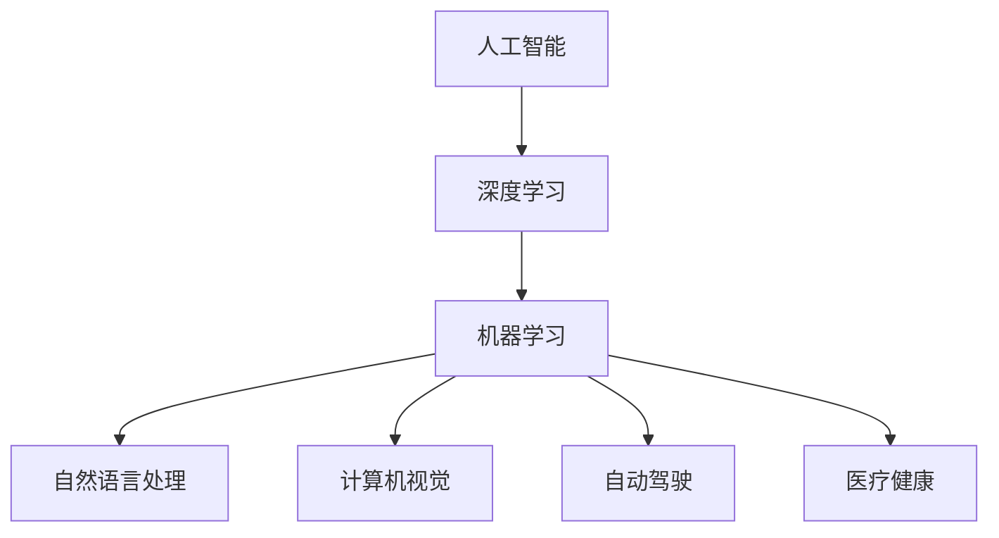
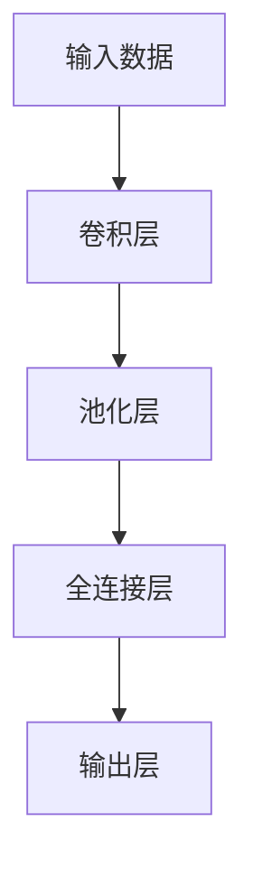

                 

# Andrej Karpathy：人工智能的未来发展规划

> 关键词：人工智能,未来规划,深度学习,机器学习,自然语言处理,计算机视觉,自动驾驶,医疗健康

## 1. 背景介绍

### 1.1 问题由来

随着人工智能技术的不断进步，AI领域正处于一个飞速发展的阶段。各大科技公司和研究机构纷纷投入巨资，推进AI技术的研究与应用。在这个过程中，如何规划AI技术的未来发展方向，成为了一个重要的问题。

## 2. 核心概念与联系

### 2.1 核心概念概述

- **人工智能（Artificial Intelligence, AI）**：指的是计算机系统模拟人类智能过程的技术，包括感知、推理、学习、决策等。

- **深度学习（Deep Learning, DL）**：是机器学习的一个分支，通过多层次的神经网络模型学习数据特征。

- **机器学习（Machine Learning, ML）**：指通过算法和数据，让机器根据已有数据进行预测、分类等任务。

- **自然语言处理（Natural Language Processing, NLP）**：是计算机科学、人工智能领域的一个分支，研究如何使计算机能够理解、解释、处理自然语言。

- **计算机视觉（Computer Vision, CV）**：研究如何让计算机系统“看”和“理解”图像和视频。

- **自动驾驶（Autonomous Driving, AD）**：指车辆通过传感器、计算机视觉、深度学习等技术自主行驶。

- **医疗健康（Healthcare）**：利用AI技术改进医疗诊断、药物研发等。

### 2.2 核心概念原理和架构的 Mermaid 流程图



## 3. 核心算法原理 & 具体操作步骤

### 3.1 算法原理概述

AI技术的核心在于算法，深度学习是其中最重要的一种。深度学习通过构建多层次神经网络模型，学习数据的分布特征，实现对数据的预测、分类等任务。在AI技术发展过程中，深度学习逐渐成为主流，并与其他技术（如计算机视觉、自然语言处理等）相结合，推动AI技术的广泛应用。

### 3.2 算法步骤详解

深度学习模型通常包括数据预处理、模型训练、模型评估和模型应用等步骤。下面以图像分类为例，介绍深度学习模型的构建过程。

1. **数据预处理**：将原始数据转化为模型可接受的形式，如图像数据需要缩放、归一化等。

2. **模型训练**：通过反向传播算法，不断调整模型参数，使得模型在训练数据上的表现最优。

3. **模型评估**：使用验证集评估模型在未见过的数据上的表现。

4. **模型应用**：将训练好的模型应用于实际任务中，如图像分类、目标检测等。

### 3.3 算法优缺点

深度学习算法具有以下优点：
- 可自动提取数据特征，无需手动设计特征提取器。
- 在特定任务上取得了卓越的表现，如图像分类、语音识别等。

然而，深度学习算法也存在以下缺点：
- 训练数据量大、计算资源消耗高。
- 模型过于复杂，容易过拟合。
- 模型缺乏可解释性，难以理解其内部工作机制。

### 3.4 算法应用领域

深度学习技术在计算机视觉、自然语言处理、自动驾驶、医疗健康等多个领域得到了广泛应用。

- **计算机视觉**：如人脸识别、图像分类、目标检测等。
- **自然语言处理**：如机器翻译、语音识别、情感分析等。
- **自动驾驶**：如无人驾驶汽车、智能交通系统等。
- **医疗健康**：如医学影像分析、疾病预测等。

## 4. 数学模型和公式 & 详细讲解 & 举例说明

### 4.1 数学模型构建

深度学习模型通常由多个神经网络层组成，其中最常用的是卷积神经网络（Convolutional Neural Networks, CNN）和循环神经网络（Recurrent Neural Networks, RNN）。

- **卷积神经网络**：常用于图像处理任务，通过卷积操作提取特征。
- **循环神经网络**：常用于序列数据处理任务，通过循环结构记忆历史信息。

### 4.2 公式推导过程

以卷积神经网络为例，其基本结构如下图所示：



卷积神经网络中，卷积层的公式为：

$$
h(x) = \sigma(w*x+b)
$$

其中，$w$ 为卷积核，$x$ 为输入数据，$b$ 为偏置项，$\sigma$ 为激活函数。

池化层的公式为：

$$
h(x) = max(x_1, x_2, ..., x_n)
$$

其中，$x_1, x_2, ..., x_n$ 为池化区域内的像素值。

全连接层的公式为：

$$
h(x) = \sigma(w*x+b)
$$

其中，$w$ 为权重矩阵，$x$ 为输入向量，$b$ 为偏置向量，$\sigma$ 为激活函数。

### 4.3 案例分析与讲解

以图像分类为例，介绍如何使用卷积神经网络进行图像分类任务。

1. **数据预处理**：将图像数据缩放至固定尺寸，并进行归一化处理。

2. **卷积层**：使用多个卷积核对图像进行特征提取。

3. **池化层**：对提取的特征进行下采样，减少计算量。

4. **全连接层**：将池化后的特征映射到不同类别的概率分布。

5. **输出层**：使用softmax函数对概率分布进行归一化，得到最终分类结果。

## 5. 项目实践：代码实例和详细解释说明

### 5.1 开发环境搭建

使用Python和TensorFlow进行深度学习模型的开发。

1. 安装TensorFlow：
```bash
pip install tensorflow
```

2. 安装NumPy、Matplotlib等库：
```bash
pip install numpy matplotlib
```

### 5.2 源代码详细实现

以下是一个简单的卷积神经网络模型，用于图像分类任务：

```python
import tensorflow as tf
import numpy as np

class CNNModel(tf.keras.Model):
    def __init__(self):
        super(CNNModel, self).__init__()
        self.conv1 = tf.keras.layers.Conv2D(32, 3, activation='relu')
        self.pool1 = tf.keras.layers.MaxPooling2D()
        self.conv2 = tf.keras.layers.Conv2D(64, 3, activation='relu')
        self.pool2 = tf.keras.layers.MaxPooling2D()
        self.flatten = tf.keras.layers.Flatten()
        self.dense1 = tf.keras.layers.Dense(64, activation='relu')
        self.dense2 = tf.keras.layers.Dense(10, activation='softmax')

    def call(self, x):
        x = self.conv1(x)
        x = self.pool1(x)
        x = self.conv2(x)
        x = self.pool2(x)
        x = self.flatten(x)
        x = self.dense1(x)
        x = self.dense2(x)
        return x

# 加载数据集
(x_train, y_train), (x_test, y_test) = tf.keras.datasets.mnist.load_data()
x_train = x_train.reshape(x_train.shape[0], 28, 28, 1).astype('float32') / 255
x_test = x_test.reshape(x_test.shape[0], 28, 28, 1).astype('float32') / 255
y_train = tf.keras.utils.to_categorical(y_train, 10)
y_test = tf.keras.utils.to_categorical(y_test, 10)

# 创建模型
model = CNNModel()

# 编译模型
model.compile(optimizer='adam', loss='categorical_crossentropy', metrics=['accuracy'])

# 训练模型
model.fit(x_train, y_train, epochs=10, batch_size=32, validation_data=(x_test, y_test))

# 评估模型
model.evaluate(x_test, y_test)
```

### 5.3 代码解读与分析

- `Conv2D` 层用于卷积操作，`MaxPooling2D` 层用于池化操作。
- `Flatten` 层用于将二维特征图展开为向量，`Dense` 层用于全连接操作。
- `Model` 类定义了整个卷积神经网络模型。
- `compile` 方法用于编译模型，指定优化器、损失函数和评估指标。
- `fit` 方法用于训练模型，指定训练数据、验证数据、迭代次数和批大小。
- `evaluate` 方法用于评估模型，返回模型在测试集上的精度和损失值。

## 6. 实际应用场景

### 6.1 自动驾驶

自动驾驶是深度学习的重要应用场景之一，其中计算机视觉和自然语言处理技术发挥了重要作用。

1. **计算机视觉**：通过摄像头、雷达等传感器获取实时环境信息，进行目标检测、车道线识别等任务。

2. **自然语言处理**：通过语音识别、文本处理技术，实现与乘客的对话交互。

3. **决策系统**：将计算机视觉和自然语言处理的结果输入到决策系统中，进行路径规划、避障等操作。

### 6.2 医疗健康

深度学习在医疗健康领域也有广泛应用，如医学影像分析、疾病预测等。

1. **医学影像分析**：通过卷积神经网络对医学影像进行分析，进行病变检测、器官分割等任务。

2. **疾病预测**：通过循环神经网络对电子病历进行分析，进行疾病预测、风险评估等任务。

3. **智能辅助诊疗**：通过自然语言处理技术，自动整理病历、生成诊断报告等。

### 6.3 智能客服

智能客服是深度学习在自然语言处理领域的重要应用之一。

1. **语音识别**：通过深度学习模型进行语音识别，将语音转化为文本。

2. **意图识别**：通过自然语言处理技术，分析用户意图，进行智能回复。

3. **对话管理**：通过循环神经网络进行对话管理，实现多轮对话的智能交互。

## 7. 工具和资源推荐

### 7.1 学习资源推荐

1. **《深度学习》（周志华著）**：全面介绍深度学习的基本概念、算法和应用。
2. **《Python深度学习》（Francois Chollet著）**：详细介绍使用TensorFlow和Keras进行深度学习开发的实践方法。
3. **Coursera深度学习课程**：由深度学习领域的专家教授，系统讲解深度学习的基本原理和应用。
4. **GitHub深度学习项目**：包含大量深度学习项目的代码和文档，方便学习参考。

### 7.2 开发工具推荐

1. **TensorFlow**：由Google主导开发的深度学习框架，支持GPU、TPU等硬件加速。
2. **Keras**：高层深度学习API，易于使用，可以快速构建深度学习模型。
3. **PyTorch**：由Facebook开发的深度学习框架，支持动态计算图。
4. **Jupyter Notebook**：开源的交互式笔记本工具，支持Python等语言，方便调试和分享代码。

### 7.3 相关论文推荐

1. **《ImageNet Classification with Deep Convolutional Neural Networks》**：介绍深度卷积神经网络在图像分类任务上的应用。
2. **《Attention is All You Need》**：介绍注意力机制在自然语言处理中的应用。
3. **《AlphaGo Zero》**：介绍使用深度强化学习实现自动驾驶的AlphaGo Zero算法。
4. **《AlphaStar: Playing StarCraft at the Grandmaster Level》**：介绍使用深度强化学习实现自动驾驶的AlphaStar算法。

## 8. 总结：未来发展趋势与挑战

### 8.1 研究成果总结

近年来，深度学习技术在AI领域取得了长足进展，但在实际应用中仍存在诸多挑战，如计算资源消耗高、模型复杂度高等。

### 8.2 未来发展趋势

未来深度学习技术将呈现以下几个发展趋势：
- 深度学习模型将更加复杂，可解决更复杂的问题。
- 模型迁移学习能力将更强，可在多个任务间进行迁移。
- 数据规模将不断增大，可提供更多的训练样本。
- 计算资源将更加高效，可支持更大规模的深度学习训练。

### 8.3 面临的挑战

深度学习技术面临以下挑战：
- 计算资源消耗高，训练成本大。
- 模型过于复杂，难以理解其内部工作机制。
- 模型缺乏可解释性，难以理解其决策过程。

### 8.4 研究展望

未来深度学习研究需关注以下方面：
- 开发更加高效、轻量级的深度学习模型。
- 提高模型的可解释性，增加对决策过程的理解。
- 开发更加智能的迁移学习能力，提升模型在不同任务间的迁移能力。
- 关注模型的伦理和道德问题，确保模型的决策过程符合人类价值观。

## 9. 附录：常见问题与解答

**Q1: 如何选择合适的深度学习模型？**

A: 选择合适的深度学习模型需要考虑以下几个因素：
- 数据类型：如图像、语音、文本等。
- 任务类型：如分类、检测、生成等。
- 计算资源：如GPU、TPU等。
- 可解释性：如是否需要理解模型内部工作机制。

**Q2: 如何提高深度学习模型的可解释性？**

A: 提高深度学习模型的可解释性可以采用以下方法：
- 使用可视化工具，如TensorBoard，展示模型的内部工作机制。
- 使用可解释的深度学习模型，如LIME、SHAP等。
- 使用解释性算法，如决策树、线性回归等。

**Q3: 如何优化深度学习模型的训练过程？**

A: 优化深度学习模型的训练过程可以采用以下方法：
- 使用正则化技术，如L2正则、Dropout等。
- 使用优化算法，如Adam、Adagrad等。
- 使用学习率调整策略，如学习率衰减、动态学习率等。
- 使用批量训练，减少计算资源消耗。

**Q4: 如何应用深度学习模型进行图像分类？**

A: 应用深度学习模型进行图像分类可以采用以下方法：
- 使用卷积神经网络（CNN）进行特征提取。
- 使用池化层对提取的特征进行下采样。
- 使用全连接层对特征进行分类。
- 使用softmax函数对分类结果进行归一化。

**Q5: 如何应用深度学习模型进行语音识别？**

A: 应用深度学习模型进行语音识别可以采用以下方法：
- 使用循环神经网络（RNN）进行特征提取。
- 使用卷积层对提取的特征进行下采样。
- 使用全连接层对特征进行分类。
- 使用softmax函数对分类结果进行归一化。

---

作者：禅与计算机程序设计艺术 / Zen and the Art of Computer Programming

