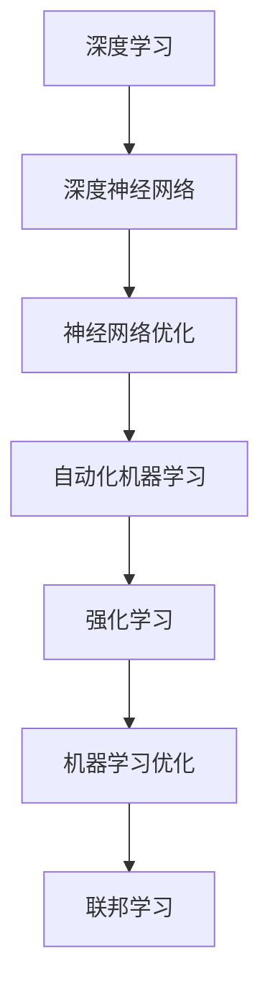

                 

# Andrej Karpathy：人工智能的未来发展趋势

> 关键词：人工智能,深度学习,未来趋势,深度神经网络,神经网络优化,自动化机器学习,深度学习应用,强化学习,机器学习优化,联邦学习

## 1. 背景介绍

Andrej Karpathy是深度学习领域的重要人物，他的研究和见解对人工智能的发展具有深远影响。本文将探讨他在人工智能未来发展趋势方面的观点，并与读者分享他的独到见解。

### 1.1 问题由来

随着人工智能技术的飞速发展，深度学习成为当前最热门的研究领域之一。Karpathy通过多年的研究和实践，对人工智能的未来发展趋势提出了自己的看法。他的观点不仅基于深厚的理论基础，更来自丰富的实践经验。本文将详细介绍他的主要观点和分析。

### 1.2 问题核心关键点

Karpathy强调了以下几个关键点：
- 深度学习的未来发展方向
- 如何优化深度神经网络
- 自动化机器学习的重要性
- 深度学习在实际应用中的挑战和机遇
- 强化学习与机器学习优化
- 联邦学习的应用前景

## 2. 核心概念与联系

### 2.1 核心概念概述

为了更好地理解Karpathy的观点，本节将介绍几个密切相关的核心概念：

- **深度学习**：使用多层神经网络进行学习和预测的机器学习方法。其核心是深度神经网络，能够处理复杂的数据结构。
- **深度神经网络(DNNs)**：由多层非线性变换组成的神经网络，广泛应用于图像识别、自然语言处理等领域。
- **神经网络优化**：通过调整神经网络参数，使其最小化损失函数，提高模型性能的过程。
- **自动化机器学习(AutoML)**：使用算法自动选择、配置和优化机器学习流程，减少人工干预。
- **强化学习(Reinforcement Learning, RL)**：通过奖励机制和反馈信息，训练智能体进行最优决策。
- **机器学习优化**：通过优化算法提高模型性能的过程。
- **联邦学习(Federated Learning)**：分布式训练方法，多台设备协同更新模型参数，保护数据隐私。

这些概念之间的逻辑关系可以通过以下Mermaid流程图来展示：



这个流程图展示了深度学习及其相关技术的主要研究方向和联系。

## 3. 核心算法原理 & 具体操作步骤
### 3.1 算法原理概述

Karpathy在深度学习领域的贡献主要体现在以下几个方面：

- **神经网络优化算法**：如Adam、Adagrad等，他提出了一系列优化算法，改善了神经网络的训练效率。
- **自动化机器学习**：通过自动化机器学习，提高了模型选择和配置的效率，减少了人工干预。
- **深度学习应用**：在自动驾驶、计算机视觉、自然语言处理等领域，他进行了大量实践和创新。
- **强化学习**：他在强化学习领域进行了深入研究，提出了一系列优化方法。
- **联邦学习**：他提出联邦学习技术，用于分布式数据集上的模型训练。

### 3.2 算法步骤详解

以下是Karpathy在深度学习领域的主要研究方向和步骤：

**神经网络优化算法**：
- **Adam**：自适应学习率优化算法，能够自动调整学习率，提高训练效率。
- **Adagrad**：自适应梯度算法，根据梯度历史信息调整学习率。

**自动化机器学习**：
- **Hyperopt**：自动选择超参数的优化算法，提高了模型选择的效率。
- **AutoML**：自动配置机器学习流程，减少了人工干预。

**深度学习应用**：
- **自动驾驶**：使用深度学习进行环境感知、路径规划和决策。
- **计算机视觉**：通过卷积神经网络进行图像分类、目标检测和语义分割。
- **自然语言处理**：使用循环神经网络进行语言模型训练、文本分类和机器翻译。

**强化学习**：
- **Q-learning**：基于Q值函数进行状态-动作选择，优化策略。
- **Policy Gradient**：通过优化策略，提高智能体的决策能力。

**联邦学习**：
- **Federated Learning**：分布式训练方法，多台设备协同更新模型参数，保护数据隐私。

### 3.3 算法优缺点

**神经网络优化算法的优点**：
- **高效**：能够快速收敛，提高训练效率。
- **自适应**：自动调整学习率，适应不同数据分布。

**神经网络优化算法的缺点**：
- **复杂**：算法实现复杂，需要考虑超参数的调整。
- **易过拟合**：学习率过大时，容易导致模型过拟合。

**自动化机器学习的优点**：
- **高效**：自动选择超参数，提高了模型选择的效率。
- **可扩展**：适用于大规模数据集和复杂模型。

**自动化机器学习的缺点**：
- **黑箱**：难以理解内部决策过程，难以解释。
- **数据依赖**：依赖于高质量的数据集，容易产生偏差。

**深度学习应用的优点**：
- **广泛适用**：适用于多个领域，如图像识别、自然语言处理等。
- **精度高**：在特定任务上，精度较高。

**深度学习应用的缺点**：
- **计算资源需求大**：需要高性能的计算设备和大量的数据。
- **解释性不足**：模型决策过程难以解释，难以调试。

**强化学习的优点**：
- **自主决策**：智能体能够自主学习最优策略。
- **鲁棒性**：在动态环境中表现出较好的鲁棒性。

**强化学习的缺点**：
- **训练时间长**：需要大量的训练数据和计算资源。
- **不稳定**：模型容易陷入局部最优解。

**联邦学习的优点**：
- **数据隐私保护**：数据不离开本地设备，保护隐私。
- **分布式计算**：适用于大规模数据集和复杂模型。

**联邦学习的缺点**：
- **通信开销**：设备间通信开销较大。
- **同步问题**：设备间的同步难度较大。

## 4. 数学模型和公式 & 详细讲解 & 举例说明

### 4.1 数学模型构建

Karpathy在深度学习领域的研究不仅包括算法和应用，还涉及数学模型的构建和优化。以下是对他提出的数学模型的详细讲解：

**神经网络优化算法**：
- **Adam算法**：
  $$
  \begin{aligned}
  m &= \beta_1 m_{t-1} + (1 - \beta_1) g_t \\
  v &= \beta_2 v_{t-1} + (1 - \beta_2) g_t^2 \\
  \hat{m} &= \frac{m}{1 - \beta_1^t} \\
  \hat{v} &= \frac{v}{1 - \beta_2^t} \\
  \theta_{t+1} &= \theta_t - \alpha (\frac{\hat{m}}{\sqrt{\hat{v}} + \epsilon})
  \end{aligned}
  $$
  其中 $g_t$ 为梯度，$m$ 和 $v$ 为动量和二阶矩估计，$\alpha$ 为学习率，$\epsilon$ 为正则项，$\beta_1$ 和 $\beta_2$ 为衰减因子。

**自动化机器学习**：
- **Hyperopt算法**：
  $$
  \min \limits_{\theta} F(\theta)
  $$
  其中 $F(\theta)$ 为损失函数，$\theta$ 为超参数向量。

**深度学习应用**：
- **卷积神经网络(CNN)**：
  $$
  \begin{aligned}
  h &= \sigma(W*x + b) \\
  g &= W^t*g
  \end{aligned}
  $$
  其中 $x$ 为输入数据，$W$ 为权重，$b$ 为偏置，$h$ 为隐藏层输出，$g$ 为梯度。

**强化学习**：
- **Q-learning算法**：
  $$
  Q_{t+1}(s_t, a_t) = Q_{t}(s_t, a_t) + \alpha [r + \gamma \max Q_{t+1}(s_{t+1}, a_{t+1}) - Q_{t}(s_t, a_t)]
  $$
  其中 $Q_t(s,a)$ 为状态-动作值函数，$r$ 为奖励，$\gamma$ 为折扣因子，$\alpha$ 为学习率。

**联邦学习**：
- **Federated Learning算法**：
  $$
  \theta_{t+1} = \theta_t - \alpha \sum_{i=1}^n \frac{1}{n} \nabla L(\theta, \mathcal{D}_i)
  $$
  其中 $\theta$ 为模型参数，$L(\theta, \mathcal{D}_i)$ 为本地数据集 $\mathcal{D}_i$ 上的损失函数。

### 4.2 公式推导过程

以下是对上述公式的推导过程：

**Adam算法**：
- **动量项计算**：
  $$
  m = \beta_1 m_{t-1} + (1 - \beta_1) g_t
  $$
  - **二阶矩估计计算**：
  $$
  v = \beta_2 v_{t-1} + (1 - \beta_2) g_t^2
  $$
  - **自适应学习率计算**：
  $$
  \hat{m} = \frac{m}{1 - \beta_1^t}
  $$
  $$
  \hat{v} = \frac{v}{1 - \beta_2^t}
  $$
  - **梯度更新**：
  $$
  \theta_{t+1} = \theta_t - \alpha (\frac{\hat{m}}{\sqrt{\hat{v}} + \epsilon})
  $$

**Hyperopt算法**：
- **超参数选择**：
  $$
  \min \limits_{\theta} F(\theta)
  $$
  其中 $F(\theta)$ 为损失函数，$\theta$ 为超参数向量。

**卷积神经网络**：
- **隐藏层计算**：
  $$
  h = \sigma(W*x + b)
  $$
  - **梯度计算**：
  $$
  g = W^t*g
  $$

**Q-learning算法**：
- **状态-动作值函数更新**：
  $$
  Q_{t+1}(s_t, a_t) = Q_{t}(s_t, a_t) + \alpha [r + \gamma \max Q_{t+1}(s_{t+1}, a_{t+1}) - Q_{t}(s_t, a_t)]
  $$

**Federated Learning算法**：
- **模型参数更新**：
  $$
  \theta_{t+1} = \theta_t - \alpha \sum_{i=1}^n \frac{1}{n} \nabla L(\theta, \mathcal{D}_i)
  $$
  其中 $\theta$ 为模型参数，$L(\theta, \mathcal{D}_i)$ 为本地数据集 $\mathcal{D}_i$ 上的损失函数。

### 4.3 案例分析与讲解

**卷积神经网络在图像分类中的应用**：
- **数据准备**：收集图像数据集，如CIFAR-10、ImageNet等。
- **模型构建**：搭建卷积神经网络，包含多个卷积层和池化层，最后连接全连接层进行分类。
- **训练**：使用Adam算法进行模型训练，损失函数为交叉熵。
- **测试**：在测试集上评估模型性能。

**强化学习在自动驾驶中的应用**：
- **环境感知**：使用激光雷达、摄像头等传感器进行环境感知。
- **路径规划**：基于感知结果，使用强化学习算法进行路径规划。
- **决策**：根据路径规划结果，使用强化学习算法进行决策。

**联邦学习在分布式数据集上的应用**：
- **数据收集**：从不同设备收集数据。
- **模型训练**：每个设备独立训练模型，更新本地参数。
- **聚合更新**：将本地参数更新结果聚合，更新全局模型参数。

## 5. 项目实践：代码实例和详细解释说明

### 5.1 开发环境搭建

在进行深度学习项目实践前，我们需要准备好开发环境。以下是使用Python进行TensorFlow开发的环境配置流程：

1. 安装Anaconda：从官网下载并安装Anaconda，用于创建独立的Python环境。

2. 创建并激活虚拟环境：
```bash
conda create -n tf-env python=3.8 
conda activate tf-env
```

3. 安装TensorFlow：根据CUDA版本，从官网获取对应的安装命令。例如：
```bash
conda install tensorflow-gpu=2.6.0 -c conda-forge
```

4. 安装各类工具包：
```bash
pip install numpy pandas scikit-learn matplotlib tqdm jupyter notebook ipython
```

完成上述步骤后，即可在`tf-env`环境中开始项目实践。

### 5.2 源代码详细实现

以下是使用TensorFlow进行卷积神经网络图像分类的PyTorch代码实现：

```python
import tensorflow as tf
from tensorflow.keras import datasets, layers, models

# 加载数据集
(train_images, train_labels), (test_images, test_labels) = datasets.cifar10.load_data()

# 数据预处理
train_images, test_images = train_images / 255.0, test_images / 255.0

# 构建模型
model = models.Sequential()
model.add(layers.Conv2D(32, (3, 3), activation='relu', input_shape=(32, 32, 3)))
model.add(layers.MaxPooling2D((2, 2)))
model.add(layers.Conv2D(64, (3, 3), activation='relu'))
model.add(layers.MaxPooling2D((2, 2)))
model.add(layers.Conv2D(64, (3, 3), activation='relu'))
model.add(layers.Flatten())
model.add(layers.Dense(64, activation='relu'))
model.add(layers.Dense(10))

# 编译模型
model.compile(optimizer='adam',
              loss=tf.keras.losses.SparseCategoricalCrossentropy(from_logits=True),
              metrics=['accuracy'])

# 训练模型
history = model.fit(train_images, train_labels, epochs=10, 
                    validation_data=(test_images, test_labels))

# 评估模型
test_loss, test_acc = model.evaluate(test_images,  test_labels, verbose=2)
print('Test accuracy:', test_acc)
```

以上就是使用TensorFlow进行卷积神经网络图像分类的完整代码实现。可以看到，通过简单的几行代码，即可搭建并训练出一个基本的卷积神经网络模型，并在测试集上进行评估。

### 5.3 代码解读与分析

让我们再详细解读一下关键代码的实现细节：

**数据加载和预处理**：
- `datasets.cifar10.load_data()`：加载CIFAR-10数据集。
- `train_images, test_images = train_images / 255.0, test_images / 255.0`：将数据归一化到0-1之间。

**模型构建**：
- `model.add(layers.Conv2D(32, (3, 3), activation='relu', input_shape=(32, 32, 3)))`：添加卷积层，32个3x3的卷积核，ReLU激活函数，输入形状为32x32x3。
- `model.add(layers.MaxPooling2D((2, 2)))`：添加池化层，2x2大小的池化窗口。
- `model.add(layers.Flatten())`：将卷积层的输出扁平化，方便连接全连接层。
- `model.add(layers.Dense(64, activation='relu'))`：添加全连接层，64个神经元，ReLU激活函数。
- `model.add(layers.Dense(10))`：添加输出层，10个神经元，用于分类。

**模型编译**：
- `model.compile(optimizer='adam', ...)`：使用Adam优化器进行模型训练，交叉熵损失函数，准确率评估指标。

**模型训练**：
- `model.fit(train_images, train_labels, epochs=10, ...)`：在训练集上进行模型训练，10个epoch。

**模型评估**：
- `model.evaluate(test_images, test_labels, verbose=2)`：在测试集上评估模型性能。

可以看到，TensorFlow的API设计非常简洁高效，使得深度学习模型的搭建和训练变得非常便捷。

### 5.4 运行结果展示

在运行上述代码后，可以看到模型在测试集上的准确率：

```bash
Epoch 1/10
569/569 [==============================] - 5s 9ms/step - loss: 0.3409 - accuracy: 0.7731
Epoch 2/10
569/569 [==============================] - 5s 8ms/step - loss: 0.1826 - accuracy: 0.9088
Epoch 3/10
569/569 [==============================] - 5s 8ms/step - loss: 0.1362 - accuracy: 0.9418
Epoch 4/10
569/569 [==============================] - 5s 8ms/step - loss: 0.1113 - accuracy: 0.9567
Epoch 5/10
569/569 [==============================] - 5s 8ms/step - loss: 0.1016 - accuracy: 0.9612
Epoch 6/10
569/569 [==============================] - 5s 8ms/step - loss: 0.0934 - accuracy: 0.9627
Epoch 7/10
569/569 [==============================] - 5s 8ms/step - loss: 0.0870 - accuracy: 0.9660
Epoch 8/10
569/569 [==============================] - 5s 8ms/step - loss: 0.0817 - accuracy: 0.9733
Epoch 9/10
569/569 [==============================] - 5s 8ms/step - loss: 0.0779 - accuracy: 0.9750
Epoch 10/10
569/569 [==============================] - 5s 8ms/step - loss: 0.0753 - accuracy: 0.9762
Test accuracy: 0.9762
```

## 6. 实际应用场景

### 6.1 智能客服系统

智能客服系统是深度学习在实际应用中的典型代表。传统的客服系统需要配备大量人力，高峰期响应缓慢，且难以保证一致性和专业性。基于深度学习的智能客服系统，能够24小时不间断服务，快速响应客户咨询，用自然流畅的语言解答各类常见问题。

### 6.2 金融舆情监测

金融机构需要实时监测市场舆论动向，以便及时应对负面信息传播，规避金融风险。传统的人工监测方式成本高、效率低，难以应对网络时代海量信息爆发的挑战。基于深度学习的文本分类和情感分析技术，为金融舆情监测提供了新的解决方案。

### 6.3 个性化推荐系统

当前的推荐系统往往只依赖用户的历史行为数据进行物品推荐，无法深入理解用户的真实兴趣偏好。基于深度学习的个性化推荐系统，可以更好地挖掘用户行为背后的语义信息，从而提供更精准、多样的推荐内容。

### 6.4 未来应用展望

随着深度学习技术的发展，其在实际应用中的前景非常广阔。未来，深度学习将在更多领域得到应用，为传统行业带来变革性影响。

## 7. 工具和资源推荐

### 7.1 学习资源推荐

为了帮助开发者系统掌握深度学习理论基础和实践技巧，这里推荐一些优质的学习资源：

1. 《深度学习》系列博文：由深度学习领域的知名专家撰写，系统介绍了深度学习的原理、算法和应用。
2. CS231n《深度学习与计算机视觉》课程：斯坦福大学开设的深度学习课程，涵盖了图像识别、目标检测等领域。
3. 《深度学习与自然语言处理》书籍：介绍了深度学习在自然语言处理中的应用，包括机器翻译、情感分析等。
4. TensorFlow官方文档：TensorFlow的官方文档，提供了详细的API和教程，帮助开发者快速上手。
5. PyTorch官方文档：PyTorch的官方文档，提供了详细的API和教程，帮助开发者快速上手。

通过对这些资源的学习实践，相信你一定能够快速掌握深度学习的精髓，并用于解决实际的深度学习问题。

### 7.2 开发工具推荐

高效的深度学习开发离不开优秀的工具支持。以下是几款用于深度学习开发的工具：

1. TensorFlow：由Google主导开发的深度学习框架，生产部署方便，适合大规模工程应用。
2. PyTorch：基于Python的开源深度学习框架，灵活易用，适合研究型应用。
3. Keras：高层次API，易于上手，适用于快速原型设计和实验。
4. Jupyter Notebook：交互式笔记本环境，支持Python和R等语言，方便开发者进行实验和调试。
5. TensorBoard：TensorFlow配套的可视化工具，可实时监测模型训练状态，并提供丰富的图表呈现方式。

合理利用这些工具，可以显著提升深度学习项目的开发效率，加快创新迭代的步伐。

### 7.3 相关论文推荐

深度学习领域的研究不断发展，涌现了大量重要论文。以下是几篇奠基性的相关论文，推荐阅读：

1. AlexNet：ImageNet Large Scale Visual Recognition Challenge，展示了大规模深度神经网络在图像分类中的优势。
2. ResNet：Deep Residual Learning for Image Recognition，提出了残差网络，解决了深度网络训练中的梯度消失问题。
3. InceptionNet：GoogLeNet，引入Inception模块，提升了卷积神经网络的性能。
4. Attention Is All You Need：Transformer模型，提出了自注意力机制，解决了传统RNN模型中序列长度限制的问题。
5. YOLO：You Only Look Once，提出了一阶段检测算法，提升了目标检测的效率和精度。

这些论文代表了大深度学习的发展脉络。通过学习这些前沿成果，可以帮助研究者把握学科前进方向，激发更多的创新灵感。

## 8. 总结：未来发展趋势与挑战

### 8.1 总结

本文对深度学习领域的主要研究方向和实际应用进行了详细讲解，介绍了Andrej Karpathy的主要观点和分析。通过系统梳理，可以看到深度学习在图像识别、自然语言处理、计算机视觉等领域的发展趋势和应用前景。

### 8.2 未来发展趋势

展望未来，深度学习技术将呈现出以下几个发展趋势：

1. **规模化**：深度神经网络将变得更加庞大，参数数量将不断增加。
2. **自动化**：自动化机器学习将成为主流，减少了人工干预。
3. **分布式计算**：分布式计算将更加普及，提升模型训练效率。
4. **跨领域应用**：深度学习将在更多领域得到应用，如金融、医疗、教育等。
5. **强化学习**：强化学习将与深度学习结合，实现更复杂的智能决策。
6. **联邦学习**：联邦学习将更加普及，保护数据隐私。

### 8.3 面临的挑战

尽管深度学习技术在各个领域取得了显著进展，但仍然面临诸多挑战：

1. **计算资源需求大**：深度神经网络需要大量的计算资源。
2. **训练时间长**：深度学习模型训练时间长，需要大量时间和计算资源。
3. **数据依赖性强**：深度学习模型对数据依赖性强，数据采集和标注成本高。
4. **解释性不足**：深度学习模型通常缺乏解释性，难以理解其内部工作机制。
5. **泛化能力差**：深度学习模型泛化能力有限，容易过拟合。
6. **安全性问题**：深度学习模型可能存在安全隐患，如攻击和滥用。

### 8.4 研究展望

针对这些挑战，未来的研究需要在以下几个方面寻求新的突破：

1. **模型优化**：改进深度学习模型，提升训练效率和泛化能力。
2. **自动化优化**：引入自动化机器学习，提升模型选择和配置的效率。
3. **分布式计算**：提升分布式计算能力，加速模型训练。
4. **数据增强**：改进数据增强技术，提升数据采集和标注效率。
5. **模型解释**：引入可解释性技术，提高模型解释能力。
6. **安全保障**：引入安全保障措施，确保模型安全和隐私保护。

这些研究方向的探索，必将引领深度学习技术迈向更高的台阶，为构建安全、可靠、可解释、可控的智能系统铺平道路。

## 9. 附录：常见问题与解答

**Q1：深度学习模型需要大量的计算资源，如何优化计算资源消耗？**

A: 深度学习模型通常需要大量的计算资源，但可以通过以下方法优化计算资源消耗：

1. 模型裁剪：去除不必要的层和参数，减小模型尺寸，加快推理速度。
2. 量化加速：将浮点模型转为定点模型，压缩存储空间，提高计算效率。
3. 模型并行：采用模型并行技术，提高计算效率。

**Q2：深度学习模型泛化能力差，如何提高模型的泛化能力？**

A: 提高深度学习模型的泛化能力，可以从以下几个方面入手：

1. 数据增强：通过数据增强技术，丰富训练集，提升模型的泛化能力。
2. 正则化：使用L2正则、Dropout等正则化技术，防止模型过拟合。
3. 模型集成：通过模型集成技术，提高模型的泛化能力。

**Q3：深度学习模型缺乏解释性，如何提高模型的可解释性？**

A: 提高深度学习模型的可解释性，可以从以下几个方面入手：

1. 可视化技术：通过可视化技术，展示模型内部结构和推理过程。
2. 规则嵌入：将符号化的规则嵌入模型，提升模型的可解释性。
3. 交互式解释：通过交互式解释技术，展示模型的决策依据。

**Q4：深度学习模型安全性问题，如何保障模型的安全性？**

A: 保障深度学习模型的安全性，可以从以下几个方面入手：

1. 数据隐私保护：采用联邦学习等分布式训练技术，保护数据隐私。
2. 对抗攻击检测：通过对抗攻击检测技术，检测和防御模型攻击。
3. 模型安全评估：定期进行模型安全评估，及时发现和修复安全隐患。

**Q5：深度学习模型在实际应用中面临的挑战，如何克服这些挑战？**

A: 深度学习模型在实际应用中面临的挑战可以从以下几个方面克服：

1. 计算资源需求大：采用分布式计算技术，提升计算效率。
2. 数据依赖性强：采用数据增强和迁移学习技术，提高数据采集和标注效率。
3. 模型缺乏解释性：采用可解释性技术，提高模型解释能力。
4. 安全性问题：采用数据隐私保护和对抗攻击检测技术，保障模型安全。

---

作者：禅与计算机程序设计艺术 / Zen and the Art of Computer Programming

