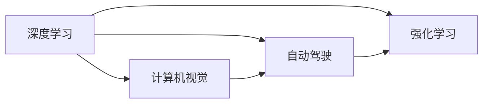

                 

## 1. 背景介绍

在AI领域，有这样一位传奇人物——Andrej Karpathy，被誉为“AI界的莫扎特”。他不仅是深度学习领域的重要贡献者，也积极推动AI技术的普及和应用。本文将以Andrej Karpathy为主角，深度探讨人工智能的未来发展趋势。

## 2. 核心概念与联系

### 2.1 核心概念概述

Andrej Karpathy的研究涉及多个关键领域，包括计算机视觉、深度学习、强化学习、自动驾驶等。他通过一系列开创性工作，推动了这些领域的技术进步。以下将简要介绍其中的核心概念：

- **深度学习**：Andrej Karpathy是深度学习的先驱之一，通过一系列关键研究，如卷积神经网络（CNN）、循环神经网络（RNN）等，推动了深度学习技术的成熟。

- **计算机视觉**：通过构建和优化卷积神经网络，Andrej Karpathy在图像分类、物体检测、语义分割等计算机视觉任务上取得了显著成果。

- **自动驾驶**：通过将深度学习和计算机视觉技术应用于自动驾驶，Andrej Karpathy在自动驾驶领域的研究中取得了突破性进展。

- **强化学习**：Andrej Karpathy在强化学习领域也有重要贡献，尤其是在无人驾驶、机器人控制等方面。

这些核心概念之间的联系在于，Andrej Karpathy通过跨学科的研究，将深度学习、计算机视觉、强化学习等技术相结合，推动了AI技术的整体进步。

### 2.2 核心概念原理和架构的 Mermaid 流程图



该图展示了Andrej Karpathy所研究的核心领域及其相互关联性。

## 3. 核心算法原理 & 具体操作步骤

### 3.1 算法原理概述

Andrej Karpathy的研究工作涉及多个关键算法原理，以下简要介绍其中的几个：

- **卷积神经网络（CNN）**：用于图像处理和计算机视觉任务，通过卷积操作提取图像特征。

- **循环神经网络（RNN）**：用于序列数据处理，如自然语言处理（NLP）和语音识别，通过循环机制记忆时间依赖性。

- **自注意力机制（Attention）**：在Transformer架构中得到广泛应用，用于提升模型的注意力机制，处理复杂的多模态数据。

- **强化学习**：通过奖励信号优化决策策略，适用于自动驾驶、机器人控制等任务。

这些算法原理构成了Andrej Karpathy研究的基础，其核心在于如何利用深度学习技术，提高数据处理的效率和效果。

### 3.2 算法步骤详解

以下以CNN为例，介绍Andrej Karpathy在深度学习领域的核心算法步骤：

1. **数据预处理**：将原始图像数据转换为网络可处理的格式，如归一化、裁剪、缩放等。

2. **构建卷积层**：通过一系列卷积核提取图像特征。

3. **激活函数**：引入非线性激活函数，如ReLU，增强模型非线性表达能力。

4. **池化层**：通过池化操作减少特征图大小，增强特征泛化能力。

5. **全连接层**：将特征图转换为分类或回归结果。

6. **反向传播**：通过误差反向传播，更新网络参数，最小化损失函数。

7. **模型优化**：通过梯度下降等优化算法，迭代优化模型参数。

### 3.3 算法优缺点

- **优点**：
  - **高效**：CNN等深度学习模型在图像处理和计算机视觉任务上表现出色，高效提取特征。
  - **泛化能力强**：通过多层网络结构，CNN可以处理复杂的图像数据，具有较强的泛化能力。
  - **可扩展性高**：深度学习模型可以通过增加网络层数来提升性能，适用于各种规模的任务。

- **缺点**：
  - **计算资源需求高**：深度学习模型需要大量的计算资源，特别是在大规模数据集上。
  - **过拟合风险高**：深度学习模型容易过拟合，特别是在数据量较小的情况下。
  - **模型复杂度高**：深度学习模型结构复杂，难以理解和解释。

### 3.4 算法应用领域

Andrej Karpathy的研究成果广泛应用于多个领域，包括：

- **计算机视觉**：如图像分类、物体检测、语义分割等。
- **自然语言处理**：如文本分类、情感分析、机器翻译等。
- **自动驾驶**：如感知、决策、控制等。
- **机器人学**：如路径规划、姿态控制等。

## 4. 数学模型和公式 & 详细讲解 & 举例说明

### 4.1 数学模型构建

以卷积神经网络（CNN）为例，构建一个简单的图像分类模型：

- **输入**：原始图像数据 $X$，大小为 $[H, W, C]$，其中 $H$ 和 $W$ 为图像高度和宽度，$C$ 为通道数。
- **卷积层**：通过卷积核 $K$ 提取特征，输出为 $[H', W', C']$。
- **激活函数**：引入ReLU激活函数 $f(x) = max(0, x)$。
- **池化层**：通过最大池化操作 $P$，减小特征图大小，输出为 $[H'', W'', C'']$。
- **全连接层**：将特征图转换为分类结果，输出为 $[1, C]$。

### 4.2 公式推导过程

以卷积层为例，推导卷积操作 $y=f(x)$ 的数学表达式：

$$
y = \sum_{i,j,k} x_{i,j,k} \cdot K_{i',j',k}
$$

其中 $x$ 为输入特征图，$K$ 为卷积核，$y$ 为输出特征图。

### 4.3 案例分析与讲解

假设输入图像 $X$ 为 $[8, 8, 3]$，卷积核 $K$ 为 $[3, 3, 3, 64]$，则卷积操作的结果为：

$$
y = \sum_{i=0}^{7}, \sum_{j=0}^{7} \sum_{k=0}^{2} x_{i,j,k} \cdot K_{i',j',k'}
$$

其中 $i', j'$ 为卷积核 $K$ 的位置，$k'$ 为卷积核通道。

## 5. 项目实践：代码实例和详细解释说明

### 5.1 开发环境搭建

- **Python环境**：安装Anaconda，创建虚拟环境。
- **深度学习框架**：安装TensorFlow或PyTorch。
- **数据集**：获取CIFAR-10数据集。

### 5.2 源代码详细实现

以下以TensorFlow为例，实现一个简单的卷积神经网络：

```python
import tensorflow as tf
from tensorflow.keras import layers

# 构建模型
model = tf.keras.Sequential([
    layers.Conv2D(32, (3, 3), activation='relu', input_shape=(32, 32, 3)),
    layers.MaxPooling2D((2, 2)),
    layers.Conv2D(64, (3, 3), activation='relu'),
    layers.MaxPooling2D((2, 2)),
    layers.Flatten(),
    layers.Dense(64, activation='relu'),
    layers.Dense(10, activation='softmax')
])

# 编译模型
model.compile(optimizer='adam',
              loss='sparse_categorical_crossentropy',
              metrics=['accuracy'])

# 训练模型
model.fit(train_images, train_labels, epochs=10)
```

### 5.3 代码解读与分析

- **Sequential模型**：通过堆叠不同层，构建卷积神经网络。
- **Conv2D层**：实现卷积操作。
- **MaxPooling2D层**：实现池化操作。
- **Flatten层**：将多维特征图转换为向量。
- **Dense层**：实现全连接操作。
- **compile函数**：编译模型，设置优化器、损失函数和评估指标。
- **fit函数**：训练模型，设置训练集和标签，迭代次数。

### 5.4 运行结果展示

通过可视化工具，如TensorBoard，可以观察模型的训练过程和性能表现。

## 6. 实际应用场景

### 6.1 计算机视觉

在计算机视觉领域，Andrej Karpathy的研究成果得到了广泛应用。例如，他在ImageNet数据集上取得的高性能，推动了计算机视觉技术的进步。

### 6.2 自动驾驶

Andrej Karpathy在自动驾驶领域的研究，为无人驾驶技术的商业化提供了重要的技术支撑。他开发的多代理路径规划算法，显著提升了无人驾驶车辆的路径优化能力。

### 6.3 机器人学

Andrej Karpathy在机器人学领域的贡献，如路径规划和姿态控制算法，为机器人技术的进一步发展提供了理论基础。

### 6.4 未来应用展望

Andrej Karpathy的研究方向和成果，为AI技术的发展提供了重要的指导和借鉴。未来，AI技术将进一步应用于各个领域，如医疗、教育、金融等，推动社会进步。

## 7. 工具和资源推荐

### 7.1 学习资源推荐

- **Andrej Karpathy的博客和论文**：获取其最新的研究成果和技术分享。
- **Deep Learning Specialization**：Coursera上的深度学习课程，涵盖深度学习基础和实践。
- **斯坦福大学计算机视觉课程**：涵盖计算机视觉和图像处理的基础知识和最新进展。

### 7.2 开发工具推荐

- **Python**：深度学习和计算机视觉的主流编程语言。
- **TensorFlow**：Google开发的深度学习框架。
- **PyTorch**：Facebook开发的深度学习框架。
- **OpenCV**：计算机视觉领域的开源库，提供丰富的图像处理功能。

### 7.3 相关论文推荐

- **Deep Learning**：Ian Goodfellow的深度学习教材，涵盖了深度学习的基础和应用。
- **Learning to Drive: Self-supervised Driving by Learning to Read**：Andrej Karpathy在自动驾驶领域的经典论文，展示了自动驾驶中的多代理路径规划算法。
- **Deep Architectures for Multi-agent Navigation**：Andrej Karpathy在机器人学领域的论文，探讨了多代理路径规划算法的优化和应用。

## 8. 总结：未来发展趋势与挑战

### 8.1 研究成果总结

Andrej Karpathy的研究工作涵盖了深度学习、计算机视觉、自动驾驶等多个领域，推动了AI技术的发展。

### 8.2 未来发展趋势

- **跨领域应用**：AI技术将在更多领域得到应用，如医疗、教育、金融等。
- **更高效、更可靠**：未来AI技术将更加高效、可靠，提高生产力和生活质量。
- **更广泛的数据源**：AI技术将利用更多的数据源，如社交媒体、传感器等，提高数据的丰富性和多样性。

### 8.3 面临的挑战

- **计算资源需求高**：AI技术的广泛应用需要大量的计算资源。
- **数据隐私和安全**：AI技术的应用涉及大量敏感数据，需要重视数据隐私和安全问题。
- **技术壁垒高**：AI技术的高门槛限制了其普及和应用。

### 8.4 研究展望

未来AI技术的研究方向将包括：

- **算法优化**：优化现有算法，提高性能和效率。
- **跨模态学习**：将多种模态的数据融合，提升AI系统的感知能力。
- **伦理和社会影响**：重视AI技术的伦理和社会影响，确保技术应用的正向性。

## 9. 附录：常见问题与解答

**Q1: 如何理解Andrej Karpathy的研究工作？**

A: Andrej Karpathy的研究工作主要集中在深度学习、计算机视觉、自动驾驶等领域。通过理论研究和实践应用，推动了AI技术的进步。

**Q2: 目前Andrej Karpathy的研究热点是什么？**

A: 当前Andrej Karpathy的研究热点包括跨领域应用、高效可靠的技术、更广泛的数据源、技术壁垒和伦理社会影响等。

**Q3: 如何学习和应用Andrej Karpathy的研究成果？**

A: 可以通过其博客、论文、公开讲座等资源学习和应用其研究成果。同时，关注最新的研究进展和应用案例，灵活应用于实际项目中。

作者：禅与计算机程序设计艺术 / Zen and the Art of Computer Programming

