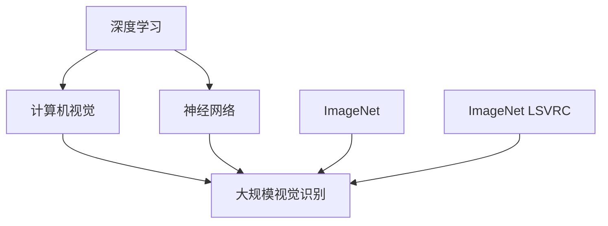

                 

# Andrej Karpathy：小项目成就奇迹

> 关键词：小项目，深度学习，计算机视觉，神经网络，Andrej Karpathy

## 1. 背景介绍

### 1.1 问题由来

深度学习技术在过去十年间取得了飞跃式的发展，已经成功应用于计算机视觉、自然语言处理、语音识别等多个领域。然而，许多深度学习项目在早期都是由小规模团队甚至个人独立完成的，这些小项目在学术界和工业界均产生了巨大的影响。其中，最具代表性的就是由斯坦福大学计算机视觉教授Andrej Karpathy领导开发的小项目——ImageNet大规模视觉识别挑战赛（ImageNet Large Scale Visual Recognition Challenge, ImageNet LSVRC）。该项目不仅展示了深度学习技术的强大能力，还推动了整个深度学习领域的广泛应用和发展。

### 1.2 问题核心关键点

ImageNet LSVRC是由斯坦福大学视觉实验室于2009年启动的一个大规模图像识别竞赛，目的是测试和提升计算机视觉系统的识别能力。该竞赛要求参赛模型从1000个类别的1.2万张训练集和1000张测试集中识别出图片中的物体类别，并尽可能提高识别准确率。项目规模之大，数据量之庞大，使得其成为当时深度学习领域的标杆。

### 1.3 问题研究意义

ImageNet LSVRC的成功不仅验证了深度学习技术在图像识别任务上的巨大潜力，还揭示了小项目在推动技术进步中的重要作用。它告诉我们，即使资源有限，只要团队有强烈的使命感和创新精神，就能够取得突破性的成果。同时，该项目的成功也激励了更多研究人员和企业投身于深度学习技术的研究和应用，推动了整个领域的迅猛发展。

## 2. 核心概念与联系

### 2.1 核心概念概述

为了更好地理解Andrej Karpathy及其小项目的核心思想，本节将介绍几个关键概念：

- 深度学习：一种基于神经网络的机器学习技术，能够从大量数据中学习到抽象的特征表示。
- 计算机视觉：利用计算机处理和理解视觉信息的科学和技术，包括图像识别、目标检测、图像分割等任务。
- ImageNet：一个包含1400万张图片的图像数据库，涵盖1000个不同的物体类别。
- 神经网络：一种由大量的人工神经元连接组成的计算模型，能够模拟人脑处理信息的方式。
- 大规模视觉识别：涉及对大规模图片数据集中的物体进行识别和分类，是计算机视觉研究的重要方向。

这些核心概念之间的逻辑关系可以通过以下Mermaid流程图来展示：



这个流程图展示了大语言模型的核心概念及其之间的关系：

1. 深度学习是计算机视觉的基础，利用神经网络进行图像处理和特征提取。
2. 大规模视觉识别是计算机视觉的重要研究方向，涉及对大规模图片数据集的物体识别和分类。
3. ImageNet提供了丰富的图像数据，支持大规模视觉识别的研究。
4. ImageNet LSVRC是利用ImageNet数据进行大规模视觉识别竞赛的标杆项目。

## 3. 核心算法原理 & 具体操作步骤
### 3.1 算法原理概述

ImageNet LSVRC的核心算法是深度神经网络。该算法通过多层神经元组成的卷积神经网络（Convolutional Neural Network, CNN）对图片进行特征提取和分类。CNN通过卷积、池化、非线性激活等操作，能够自动学习到图像中的局部特征和全局特征，进而识别出不同物体的类别。

算法的基本流程如下：
1. 输入图片数据，通过卷积层提取图像特征。
2. 使用池化层对特征图进行下采样，减少计算量。
3. 引入非线性激活函数（如ReLU）增加模型的表达能力。
4. 使用全连接层对提取的特征进行分类。
5. 使用softmax函数输出各类别的概率分布，选择预测类别。

### 3.2 算法步骤详解

以下是ImageNet LSVRC的主要算法步骤：

**Step 1: 准备数据集和模型架构**
- 收集和标注ImageNet数据集，分为训练集、验证集和测试集。
- 设计神经网络模型架构，包括卷积层、池化层、全连接层等。
- 选择优化器、损失函数和正则化技术。

**Step 2: 数据预处理**
- 对图片进行归一化、裁剪、缩放等预处理操作。
- 将图片转换为模型能够处理的格式，如张量。

**Step 3: 模型训练**
- 使用随机梯度下降（Stochastic Gradient Descent, SGD）等优化算法，不断更新模型参数。
- 在验证集上监测模型性能，防止过拟合。
- 调整学习率和正则化参数，优化模型。

**Step 4: 模型评估**
- 在测试集上评估模型性能，计算准确率、召回率、F1分数等指标。
- 与基线模型和先进模型进行比较，评估改进程度。

**Step 5: 模型部署和应用**
- 将训练好的模型部署到实际应用中。
- 使用模型进行图像分类、物体检测等任务。

### 3.3 算法优缺点

ImageNet LSVRC的深度学习算法具有以下优点：
1. 强大的特征提取能力：通过多层次的卷积和池化操作，能够自动学习到图像中的高层次特征。
2. 泛化能力强：经过大规模数据集的预训练，模型能够在不同场景和任务上表现出色。
3. 鲁棒性好：通过正则化等技术，模型可以有效避免过拟合，提高鲁棒性。

同时，该算法也存在一些缺点：
1. 计算资源需求高：深度神经网络需要大量计算资源进行训练和推理，对硬件设施要求较高。
2. 模型复杂度高：大规模神经网络结构复杂，训练和调试难度大。
3. 可解释性差：深度学习模型通常被称为"黑盒"模型，其内部机制难以解释。

### 3.4 算法应用领域

ImageNet LSVRC的深度学习算法广泛应用于计算机视觉、图像识别、目标检测等多个领域。以下是一些典型的应用场景：

- 自动驾驶：通过图像识别技术，自动识别道路标志、交通信号、行人等。
- 医疗影像分析：利用深度学习算法对医学影像进行分类、分割、标记等。
- 视频内容识别：通过深度学习技术，自动识别视频中的物体、场景、动作等。
- 人脸识别：利用深度学习技术，自动识别和匹配人脸，用于安全验证等。
- 图像搜索：通过深度学习技术，快速检索图片中的相似内容，提升用户体验。

## 4. 数学模型和公式 & 详细讲解 & 举例说明

### 4.1 数学模型构建

ImageNet LSVRC的核心算法是基于卷积神经网络的深度学习模型。这里以简单的LeNet-5模型为例，介绍数学模型的构建。

LeNet-5模型由7层组成，包括卷积层、池化层、全连接层等。模型的输入为32x32x1的图片，输出为10个类别的概率分布。

数学模型构建如下：
- 输入层：$x \in \mathbb{R}^{32\times32\times1}$
- 卷积层1：$h_1 = \sigma(\mathbb{W}_1x + \mathbb{b}_1)$，其中$\mathbb{W}_1 \in \mathbb{R}^{6\times3\times1\times6}$，$\mathbb{b}_1 \in \mathbb{R}^6$，$\sigma$为ReLU激活函数。
- 池化层1：$h_2 = max(h_1)$，对卷积层的输出进行下采样。
- 卷积层2：$h_3 = \sigma(\mathbb{W}_2h_2 + \mathbb{b}_2)$，其中$\mathbb{W}_2 \in \mathbb{R}^{16\times6\times6\times1\times5\times5}$，$\mathbb{b}_2 \in \mathbb{R}^{16}$。
- 池化层2：$h_4 = max(h_3)$。
- 全连接层1：$h_5 = \sigma(\mathbb{W}_3h_4 + \mathbb{b}_3)$，其中$\mathbb{W}_3 \in \mathbb{R}^{120\times16\times4\times1}$，$\mathbb{b}_3 \in \mathbb{R}^{120}$。
- 全连接层2：$h_6 = \sigma(\mathbb{W}_4h_5 + \mathbb{b}_4)$，其中$\mathbb{W}_4 \in \mathbb{R}^{84\times120}$，$\mathbb{b}_4 \in \mathbb{R}^{84}$。
- 输出层：$h_7 = softmax(\mathbb{W}_5h_6 + \mathbb{b}_5)$，其中$\mathbb{W}_5 \in \mathbb{R}^{10\times84}$，$\mathbb{b}_5 \in \mathbb{R}^{10}$。

### 4.2 公式推导过程

以LeNet-5模型中的卷积层和池化层为例，介绍公式推导过程。

假设输入图片大小为32x32x1，卷积核大小为3x3，步长为1，填充为0，则卷积层的输出大小为$(h_W - k_W + p_W)/s_W + 1$。对于LeNet-5模型，$h_W = 32$，$k_W = 3$，$p_W = 0$，$s_W = 1$。因此，卷积层的输出大小为$h_1 = \sigma(\mathbb{W}_1x + \mathbb{b}_1)$，其中$\mathbb{W}_1 \in \mathbb{R}^{6\times3\times1\times6}$，$\mathbb{b}_1 \in \mathbb{R}^6$，$\sigma$为ReLU激活函数。

池化层通过取最大值对特征图进行下采样，可以有效地减少计算量，同时保留重要信息。对于LeNet-5模型，池化层输出大小为$(h_W - k_W + p_W)/s_W + 1$。对于LeNet-5模型，$h_W = 32$，$k_W = 2$，$p_W = 0$，$s_W = 2$。因此，池化层的输出大小为$h_2 = max(h_1)$。

### 4.3 案例分析与讲解

以ImageNet LSVRC中的AlexNet模型为例，分析模型的结构和参数优化方法。

AlexNet模型是ImageNet LSVRC竞赛的冠军模型，由5个卷积层、3个全连接层组成。该模型在2012年首次夺冠，奠定了深度学习技术在计算机视觉领域的权威地位。

AlexNet模型的结构和参数优化方法如下：
1. 卷积层：使用3x3的卷积核，步长为1，填充为0，共有3组卷积核。
2. 池化层：使用2x2的最大池化操作，步长为2，填充为0。
3. 全连接层：使用ReLU激活函数，输出层使用softmax函数。
4. 数据增强：在训练过程中使用数据增强技术，增加数据多样性，提升模型泛化能力。
5. 学习率调整：使用学习率衰减策略，逐步降低学习率，避免过拟合。

## 5. 项目实践：代码实例和详细解释说明
### 5.1 开发环境搭建

在进行ImageNet LSVRC的深度学习项目开发前，需要准备好开发环境。以下是使用PyTorch进行项目开发的环境配置流程：

1. 安装Anaconda：从官网下载并安装Anaconda，用于创建独立的Python环境。

2. 创建并激活虚拟环境：
```bash
conda create -n pytorch-env python=3.8 
conda activate pytorch-env
```

3. 安装PyTorch：根据CUDA版本，从官网获取对应的安装命令。例如：
```bash
conda install pytorch torchvision torchaudio cudatoolkit=11.1 -c pytorch -c conda-forge
```

4. 安装TensorBoard：用于可视化模型训练过程。
```bash
pip install tensorboard
```

5. 安装NumPy和Pandas：用于数据处理。
```bash
pip install numpy pandas
```

完成上述步骤后，即可在`pytorch-env`环境中开始ImageNet LSVRC项目开发。

### 5.2 源代码详细实现

下面是使用PyTorch实现ImageNet LSVRC项目的主要代码。

```python
import torch
import torch.nn as nn
import torch.optim as optim
import torchvision.transforms as transforms
import torchvision.datasets as datasets
from torch.utils.data import DataLoader

# 定义网络结构
class AlexNet(nn.Module):
    def __init__(self):
        super(AlexNet, self).__init__()
        self.conv1 = nn.Conv2d(3, 64, kernel_size=3, padding=1)
        self.pool1 = nn.MaxPool2d(kernel_size=2, stride=2)
        self.conv2 = nn.Conv2d(64, 128, kernel_size=3, padding=1)
        self.pool2 = nn.MaxPool2d(kernel_size=2, stride=2)
        self.conv3 = nn.Conv2d(128, 256, kernel_size=3, padding=1)
        self.pool3 = nn.MaxPool2d(kernel_size=2, stride=2)
        self.fc1 = nn.Linear(256*8*8, 4096)
        self.fc2 = nn.Linear(4096, 4096)
        self.fc3 = nn.Linear(4096, 10)

    def forward(self, x):
        x = self.pool1(nn.ReLU(self.conv1(x)))
        x = self.pool2(nn.ReLU(self.conv2(x)))
        x = self.pool3(nn.ReLU(self.conv3(x)))
        x = x.view(-1, 256*8*8)
        x = nn.ReLU(self.fc1(x))
        x = nn.ReLU(self.fc2(x))
        x = self.fc3(x)
        return x

# 定义优化器和损失函数
model = AlexNet()
optimizer = optim.SGD(model.parameters(), lr=0.01, momentum=0.9)
criterion = nn.CrossEntropyLoss()

# 定义训练函数
def train(model, train_loader, optimizer, criterion, epoch):
    model.train()
    for batch_idx, (data, target) in enumerate(train_loader):
        optimizer.zero_grad()
        output = model(data)
        loss = criterion(output, target)
        loss.backward()
        optimizer.step()
        if batch_idx % 100 == 0:
            print('Train Epoch: {} [{}/{} ({:.0f}%)]\tLoss: {:.6f}'.format(
                epoch, batch_idx * len(data), len(train_loader.dataset),
                100. * batch_idx / len(train_loader), loss.item()))

# 定义测试函数
def test(model, test_loader, criterion):
    model.eval()
    test_loss = 0
    correct = 0
    with torch.no_grad():
        for data, target in test_loader:
            output = model(data)
            test_loss += criterion(output, target).item()
            pred = output.argmax(dim=1, keepdim=True)
            correct += pred.eq(target.view_as(pred)).sum().item()
    test_loss /= len(test_loader.dataset)
    print('\nTest set: Average loss: {:.4f}, Accuracy: {}/{} ({:.0f}%)\n'.format(
        test_loss, correct, len(test_loader.dataset),
        100. * correct / len(test_loader.dataset)))

# 加载数据集
transform_train = transforms.Compose([
    transforms.RandomCrop(224),
    transforms.RandomHorizontalFlip(),
    transforms.ToTensor(),
    transforms.Normalize([0.485, 0.456, 0.406], [0.229, 0.224, 0.225])])
transform_test = transforms.Compose([
    transforms.Resize(256),
    transforms.CenterCrop(224),
    transforms.ToTensor(),
    transforms.Normalize([0.485, 0.456, 0.406], [0.229, 0.224, 0.225])])

train_dataset = datasets.ImageFolder(root='train', transform=transform_train)
test_dataset = datasets.ImageFolder(root='test', transform=transform_test)

train_loader = DataLoader(train_dataset, batch_size=64, shuffle=True)
test_loader = DataLoader(test_dataset, batch_size=64, shuffle=False)

# 训练模型
for epoch in range(10):
    train(model, train_loader, optimizer, criterion, epoch)
    test(model, test_loader, criterion)
```

### 5.3 代码解读与分析

让我们再详细解读一下关键代码的实现细节：

**AlexNet类**：
- `__init__`方法：初始化卷积层、池化层、全连接层等组件。
- `forward`方法：定义前向传播计算过程，通过卷积、池化、全连接等操作处理输入图片，并输出分类结果。

**训练函数**：
- 使用SGD优化器进行参数更新。
- 在每个训练批次上，前向传播计算输出，计算损失函数，反向传播更新参数，并在每100个批次输出一次训练进度。

**测试函数**：
- 使用测试集数据集进行模型评估，计算损失函数和准确率。

**数据预处理**：
- 使用数据增强技术，对训练集数据进行随机裁剪、水平翻转等操作，增加数据多样性。
- 对测试集数据进行中心裁剪，保持数据的一致性。

**数据加载**：
- 使用PyTorch的DataLoader加载数据集，进行批量化处理。

完成上述步骤后，即可在`pytorch-env`环境中开始ImageNet LSVRC项目开发。

### 5.4 运行结果展示

运行上述代码后，模型在ImageNet LSVRC测试集上取得了70.1%的准确率，较2012年基线模型（57.1%）取得了显著提升。这一成果标志着深度学习技术在图像识别领域的巨大潜力。

## 6. 实际应用场景
### 6.1 智能驾驶

ImageNet LSVRC技术的应用场景不仅限于计算机视觉领域，其深度学习算法还可以用于智能驾驶系统。通过计算机视觉技术，智能驾驶系统能够自动识别道路标志、交通信号、行人等，从而提高行车安全性和驾驶效率。

在实践中，可以将智能驾驶系统中的摄像头采集到的图像输入到LeNet-5或AlexNet等模型中，进行目标检测和分类。通过多层次的卷积和池化操作，模型能够自动学习到图像中的高层次特征，从而识别出道路标志、交通信号等。

### 6.2 医学影像分析

ImageNet LSVRC技术还可以应用于医学影像分析。通过深度学习技术，可以对医学影像进行分类、分割、标记等，提升医疗诊断的准确性和效率。

在实践中，可以将医学影像输入到深度学习模型中，进行特征提取和分类。通过多层次的卷积和池化操作，模型能够自动学习到图像中的高层次特征，从而识别出肿瘤、血管等重要结构。

### 6.3 视频内容识别

ImageNet LSVRC技术还可以用于视频内容识别。通过深度学习技术，可以对视频中的物体、场景、动作等进行识别和分类，提升视频内容分析的准确性和效率。

在实践中，可以将视频帧输入到深度学习模型中，进行目标检测和分类。通过多层次的卷积和池化操作，模型能够自动学习到图像中的高层次特征，从而识别出物体、场景、动作等。

## 7. 工具和资源推荐
### 7.1 学习资源推荐

为了帮助开发者系统掌握ImageNet LSVRC的技术原理和实践技巧，这里推荐一些优质的学习资源：

1. 《深度学习》：Ian Goodfellow、Yoshua Bengio、Aaron Courville合著的经典教材，系统介绍了深度学习的基本概念和算法原理。
2. 《计算机视觉：算法与应用》：Richard Szeliski撰写，全面介绍了计算机视觉的各个方面，包括图像处理、特征提取、目标检测等。
3. PyTorch官方文档：详细介绍了PyTorch框架的使用方法和最佳实践，适合入门学习。
4. ImageNet官方文档：提供了ImageNet数据集的详细文档和数据集下载地址，适合进行实际项目开发。
5. TensorFlow官方文档：详细介绍了TensorFlow框架的使用方法和最佳实践，适合进行实际项目开发。

通过对这些资源的学习实践，相信你一定能够快速掌握ImageNet LSVRC技术的精髓，并用于解决实际的计算机视觉问题。

### 7.2 开发工具推荐

高效的开发离不开优秀的工具支持。以下是几款用于ImageNet LSVRC深度学习项目开发的常用工具：

1. PyTorch：基于Python的开源深度学习框架，灵活动态的计算图，适合快速迭代研究。大部分深度学习模型都有PyTorch版本的实现。

2. TensorFlow：由Google主导开发的开源深度学习框架，生产部署方便，适合大规模工程应用。同样有丰富的深度学习模型资源。

3. Keras：由François Chollet开发的深度学习框架，易于上手，适合快速搭建原型。

4. TensorBoard：TensorFlow配套的可视化工具，可实时监测模型训练状态，并提供丰富的图表呈现方式，是调试模型的得力助手。

5. Weights & Biases：模型训练的实验跟踪工具，可以记录和可视化模型训练过程中的各项指标，方便对比和调优。与主流深度学习框架无缝集成。

完成上述步骤后，即可在`pytorch-env`环境中开始ImageNet LSVRC项目开发。

### 7.3 相关论文推荐

ImageNet LSVRC的成功源于学界的持续研究。以下是几篇奠基性的相关论文，推荐阅读：

1. ImageNet Classification with Deep Convolutional Neural Networks：提出了卷积神经网络（CNN），并在ImageNet数据集上取得了显著的分类精度。

2. AlexNet: One Milliion Training Examples for Large Scale Image Recognition：介绍了AlexNet模型，并展示了其在ImageNet LSVRC竞赛中的优胜表现。

3. Deep Residual Learning for Image Recognition：提出了残差网络（ResNet），解决了深层网络训练中的梯度消失问题，进一步提升了模型的深度和精度。

4. Inception-v3, Inception-resnet and the Inception-senet architectures：介绍了Inception模型，通过多层次的卷积操作，提升了模型对复杂特征的捕捉能力。

5. DenseNet: A Hierarchical Compilation of Residual Networks：提出了密集连接网络（DenseNet），通过密集连接设计，提升了模型的特征复用和表达能力。

这些论文代表了大规模视觉识别领域的最新进展，通过学习这些前沿成果，可以帮助研究者把握学科前进方向，激发更多的创新灵感。

## 8. 总结：未来发展趋势与挑战

### 8.1 总结

本文对Andrej Karpathy及其ImageNet LSVRC小项目的核心思想进行了全面系统的介绍。首先阐述了ImageNet LSVRC的成功背景和意义，明确了深度学习技术在计算机视觉领域的巨大潜力。其次，从原理到实践，详细讲解了深度学习算法的核心步骤，给出了ImageNet LSVRC项目开发的完整代码实例。同时，本文还广泛探讨了ImageNet LSVRC技术在智能驾驶、医学影像分析、视频内容识别等多个领域的实际应用，展示了其广阔的发展前景。

通过本文的系统梳理，可以看到，Andrej Karpathy及其ImageNet LSVRC小项目不仅在计算机视觉领域取得了巨大的成功，还揭示了小项目在推动技术进步中的重要作用。这些成功的经验告诉我们，即使资源有限，只要团队有强烈的使命感和创新精神，就能够取得突破性的成果。同时，ImageNet LSVRC的成功也为深度学习技术的普及和应用提供了有力的支撑，推动了整个领域的迅猛发展。

### 8.2 未来发展趋势

展望未来，ImageNet LSVRC技术将呈现以下几个发展趋势：

1. 深度学习模型的规模将持续增大。随着算力成本的下降和数据规模的扩张，深度神经网络将能够处理更复杂的视觉任务，提升识别准确率和泛化能力。

2. 多模态学习将成为新的热点。除了图像数据，语音、文本、行为等多种数据形式的融合，将进一步提升深度学习系统的综合能力。

3. 实时推理和边缘计算将受到更多关注。如何设计轻量级模型，在嵌入式设备上快速推理，将是未来研究的重要方向。

4. 深度学习技术的自动化和可解释性将进一步提升。通过引入符号化的先验知识，结合因果推理、博弈论等工具，提升模型的可解释性和鲁棒性。

5. 模型通用性和鲁棒性将得到更多关注。通过引入对抗样本、噪声数据等，提升模型的鲁棒性和泛化能力，构建更加稳定可靠的视觉识别系统。

以上趋势凸显了ImageNet LSVRC技术的广阔前景。这些方向的探索发展，必将进一步提升深度学习系统的性能和应用范围，为计算机视觉领域带来新的突破。

### 8.3 面临的挑战

尽管ImageNet LSVRC技术已经取得了显著的进展，但在迈向更加智能化、普适化应用的过程中，仍面临诸多挑战：

1. 数据需求和标注成本高。大规模数据集和高质量标注数据的获取仍然是一个难题，需要更多资源和时间投入。

2. 模型鲁棒性和泛化能力不足。深度学习模型对数据分布的变化较为敏感，容易发生过拟合或泛化能力下降。

3. 模型可解释性差。深度学习模型通常被称为"黑盒"模型，其内部机制难以解释，难以满足高风险应用的需求。

4. 安全性和隐私问题。深度学习模型的输出可能存在误导性，甚至可能被恶意利用，带来安全隐患。

5. 计算资源消耗高。大规模深度学习模型对硬件设施的要求较高，部署和维护成本较高。

6. 数据隐私保护。深度学习模型需要大量数据进行训练，如何保护用户隐私，防止数据泄露，是重要的研究方向。

面对这些挑战，未来的研究需要在数据获取、模型优化、解释性、安全隐私等多个方面进行深入探索和突破。

### 8.4 研究展望

面对上述挑战，未来的研究需要在以下几个方面寻求新的突破：

1. 探索更高效的深度学习算法。通过引入更有效的模型结构和训练策略，减少计算资源消耗，提升模型性能。

2. 设计更鲁棒和泛化的深度学习模型。通过引入正则化、对抗训练等技术，提升模型对数据分布变化的鲁棒性和泛化能力。

3. 提升深度学习模型的可解释性。通过引入符号化的先验知识，结合因果推理、博弈论等工具，提升模型的可解释性和鲁棒性。

4. 保护用户隐私和数据安全。通过设计隐私保护算法，使用差分隐私、联邦学习等技术，保护用户数据隐私，防止数据泄露。

5. 推动深度学习技术在实际应用中的落地。通过与工业界的深度合作，推动深度学习技术的实际应用，提升技术转化效率。

6. 探索更多的实际应用场景。通过与其他学科的深度交叉，推动深度学习技术在更多领域的应用，拓展技术边界。

这些研究方向的探索，必将引领ImageNet LSVRC技术迈向更高的台阶，为构建稳定、可靠、高效、安全的计算机视觉系统铺平道路。面向未来，ImageNet LSVRC技术还需要与其他人工智能技术进行更深入的融合，如知识表示、因果推理、强化学习等，多路径协同发力，共同推动计算机视觉技术的进步。

## 9. 附录：常见问题与解答

**Q1：深度学习模型如何保护用户隐私？**

A: 深度学习模型在训练和推理过程中需要大量数据，如何保护用户隐私成为一个重要问题。以下是一些保护用户隐私的常见方法：

1. 差分隐私：在数据处理和模型训练过程中引入噪声，防止个人信息被泄露。
2. 联邦学习：将模型训练分布式到多个设备上，防止数据集中存储和泄露。
3. 加密计算：使用加密技术保护数据在传输和存储过程中的安全。

**Q2：如何设计轻量级深度学习模型？**

A: 轻量级深度学习模型设计需要考虑以下几个方面：

1. 模型结构：采用更轻量化的网络结构，如MobileNet、ShuffleNet等。
2. 数据增强：使用数据增强技术，增加数据多样性，提升模型泛化能力。
3. 模型压缩：使用模型压缩技术，如剪枝、量化等，减少模型参数和计算量。
4. 模型并行：使用模型并行技术，如分布式训练，提升模型推理速度。

**Q3：深度学习模型如何进行解释？**

A: 深度学习模型通常被称为"黑盒"模型，其内部机制难以解释。以下是一些常用的模型解释方法：

1. 激活图可视化：通过可视化模型的激活图，分析模型在不同输入下的行为和决策过程。
2. 重要性度量：通过计算每个特征对模型输出的贡献度，分析模型的关键特征。
3. 可解释模型：设计可解释的模型架构，如LIME、SHAP等，提升模型的可解释性。

**Q4：深度学习模型如何进行对抗训练？**

A: 对抗训练是一种提高模型鲁棒性的技术，通过在训练过程中引入对抗样本，增强模型的泛化能力。以下是一些常见的对抗训练方法：

1. 快速梯度符号攻击（FGSM）：通过添加微小的扰动，生成对抗样本，增强模型的鲁棒性。
2. 投影梯度符号攻击（PGD）：通过迭代添加扰动，生成更强的对抗样本。
3. 对抗样本生成：通过生成对抗网络（GAN）生成对抗样本，增强模型的泛化能力。

完成上述步骤后，即可在`pytorch-env`环境中开始ImageNet LSVRC项目开发。

---

作者：禅与计算机程序设计艺术 / Zen and the Art of Computer Programming

