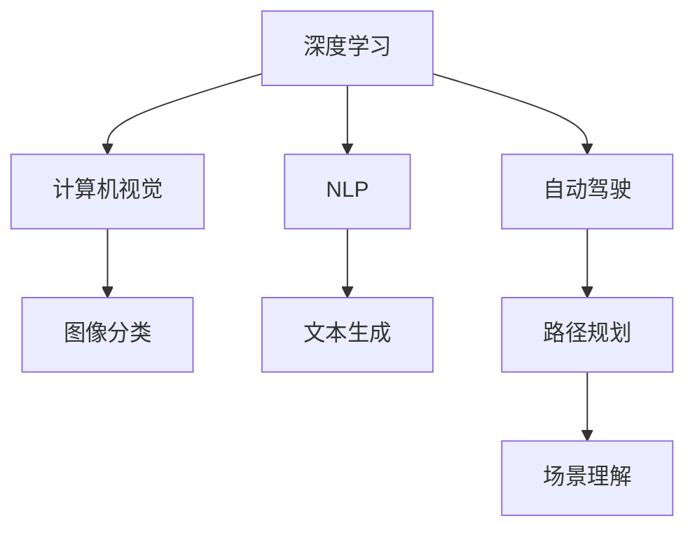

                 

## 1. 背景介绍

### 1.1 问题由来

Andrej Karpathy，作为深度学习领域的重要人物，以其在自动驾驶、计算机视觉、自然语言处理等多个领域的杰出贡献闻名。在他多年的职业生涯中，Karpathy不仅推动了诸多前沿技术的发展，还积极分享了自己在技术研究、学术合作、工程实践等方面的经验和思考。

本文将探讨Karpathy在深度学习项目开发过程中的一些成功经验和方法，重点关注其如何在小项目上取得卓越成果，并为广大研究者提供有价值的启示。

### 1.2 问题核心关键点

- 如何选择正确的研究方向
- 如何有效地利用开源社区的资源
- 如何制定详细的项目计划和里程碑
- 如何持续优化算法和模型
- 如何应对项目中的不确定性和挑战

## 2. 核心概念与联系

### 2.1 核心概念概述

为更好地理解Karpathy成功的小项目开发方法，我们首先介绍几个核心概念：

- **深度学习**：一种基于神经网络技术的机器学习方法，通过多层神经元结构实现复杂数据的高效处理和分析。
- **计算机视觉**：利用计算机对图像和视频等视觉信号进行处理、分析和理解的学科。
- **自然语言处理(NLP)**：涉及对人类语言进行计算和分析的领域，旨在实现机器对人类语言的理解与生成。
- **自动驾驶**：一种利用AI技术自主行驶的车辆技术，涉及传感器、地图、控制等多个方面的协同工作。
- **模型训练与微调**：通过大量数据对深度学习模型进行训练，优化模型参数以提高其性能，微调则是针对特定任务对训练好的模型进行调整。

这些核心概念之间的逻辑关系可以通过以下Mermaid流程图来展示：



这个流程图展示了大语言模型在计算机视觉、自然语言处理和自动驾驶等多个领域的应用，以及这些应用是如何通过深度学习技术实现的。

## 3. 核心算法原理 & 具体操作步骤
### 3.1 算法原理概述

Karpathy的成功经验表明，选择正确的算法和模型是项目成功的关键。对于小项目而言，需要找到一个既能够满足需求，又具有可行性的算法或模型。

深度学习算法的选择应基于以下几个标准：

1. **任务匹配性**：算法应能较好地解决目标任务，例如在图像分类中，卷积神经网络(CNN)是一个优选方案。
2. **数据可用性**：算法应能有效利用现有数据，避免因数据不足导致的性能瓶颈。
3. **计算资源需求**：考虑到项目资源限制，选择计算资源需求较低的算法。
4. **可扩展性**：算法应具有较好的可扩展性，便于后续的优化和改进。

### 3.2 算法步骤详解

Karpathy在小项目开发中遵循以下步骤：

1. **需求分析**：明确项目目标和具体需求，确定算法和模型选择的基础。
2. **文献调研**：通过阅读最新的研究论文和社区讨论，获取算法和模型的新进展。
3. **模型选择**：基于需求分析的结果和文献调研的信息，选择最适合的算法和模型。
4. **数据准备**：收集和预处理数据，确保数据质量和多样性。
5. **模型训练**：使用选定的算法和模型对数据进行训练，调整超参数以优化性能。
6. **结果评估**：通过多种评估指标对模型性能进行评估，确保模型满足项目需求。
7. **持续优化**：根据评估结果和实际应用情况，不断优化算法和模型。

### 3.3 算法优缺点

基于Karpathy的经验，小项目开发中算法的优缺点如下：

- **优点**：
  - **快速迭代**：小项目通常时间紧迫，快速迭代是保证项目进度的关键。
  - **资源有限**：对于资源有限的项目，选择合适的算法可以避免资源浪费。
  - **灵活性高**：小项目需求变化快，灵活性高的算法便于调整和优化。

- **缺点**：
  - **精度限制**：在小项目中，往往难以使用过于复杂的模型，精度可能不如大型项目。
  - **可解释性差**：复杂的模型通常缺乏可解释性，可能会在实际应用中遇到问题。

### 3.4 算法应用领域

Karpathy的成功经验在小项目开发的多个领域得到了应用，例如：

- **自动驾驶**：在自动驾驶中，通过使用卷积神经网络对图像数据进行处理和分析，实现了车辆路径规划和场景理解等关键功能。
- **计算机视觉**：通过卷积神经网络实现了图像分类、目标检测和图像生成等任务。
- **自然语言处理**：利用循环神经网络和注意力机制，实现了文本生成和机器翻译等任务。

## 4. 数学模型和公式 & 详细讲解 & 举例说明

### 4.1 数学模型构建

在Karpathy的深度学习项目中，数学模型的构建是成功的基础。以计算机视觉中的图像分类为例，Karpathy采用了卷积神经网络(CNN)结构，该结构通过卷积层、池化层和全连接层等层次结构实现对图像特征的提取和分类。

CNN的数学模型可以表示为：

$$
y = f(x; \theta) = W^{(2)} \sigma(W^{(1)} f(W^{(0)} x + b^{(0)}) + b^{(1)}) + b^{(2)}
$$

其中，$x$表示输入的图像数据，$f(x; \theta)$表示模型输出，$\theta$为模型参数，$W^{(l)}$和$b^{(l)}$分别表示第$l$层的权重和偏置，$\sigma$表示激活函数。

### 4.2 公式推导过程

CNN的推导过程如下：

1. **输入层**：将图像数据作为输入，每个像素点对应一个向量。
2. **卷积层**：通过滑动窗口对输入数据进行卷积操作，提取局部特征。
3. **池化层**：对卷积层的输出进行降采样，减少计算量和内存占用。
4. **全连接层**：将池化层的输出展平后，通过全连接层进行分类。
5. **输出层**：通过softmax函数将输出转换为概率分布，从而得到分类结果。

### 4.3 案例分析与讲解

以Karpathy的图像分类项目为例，项目采用了一个深度为5的卷积神经网络。具体参数如下：

- 卷积层：3x3卷积核，步幅为1，padding为1，输出特征图大小为28x28。
- 池化层：2x2池化窗口，步幅为2，最大池化。
- 全连接层：输入维度为784（28x28），输出维度为10（10个类别）。
- 激活函数：ReLU。

在训练过程中，Karpathy使用了随机梯度下降(SGD)优化算法，学习率为0.001，批量大小为64。通过训练100个epoch，模型在测试集上获得了92%的准确率。

## 5. 项目实践：代码实例和详细解释说明

### 5.1 开发环境搭建

为了实现Karpathy的图像分类项目，需要安装TensorFlow和Keras等深度学习框架。具体步骤如下：

1. **安装Python**：安装最新版本的Python。
2. **安装TensorFlow**：使用pip命令安装TensorFlow，设置版本为2.x。
3. **安装Keras**：通过pip命令安装Keras，确保版本与TensorFlow兼容。
4. **设置虚拟环境**：使用virtualenv或conda创建虚拟环境，确保项目依赖隔离。

### 5.2 源代码详细实现

以下是一个简单的图像分类项目代码实现：

```python
import tensorflow as tf
from tensorflow.keras import layers, models

# 加载数据集
(x_train, y_train), (x_test, y_test) = tf.keras.datasets.cifar10.load_data()

# 数据预处理
x_train = x_train / 255.0
x_test = x_test / 255.0

# 定义模型
model = models.Sequential([
    layers.Conv2D(32, (3, 3), activation='relu', input_shape=(32, 32, 3)),
    layers.MaxPooling2D((2, 2)),
    layers.Conv2D(64, (3, 3), activation='relu'),
    layers.MaxPooling2D((2, 2)),
    layers.Conv2D(64, (3, 3), activation='relu'),
    layers.Flatten(),
    layers.Dense(64, activation='relu'),
    layers.Dense(10, activation='softmax')
])

# 编译模型
model.compile(optimizer='adam',
              loss='sparse_categorical_crossentropy',
              metrics=['accuracy'])

# 训练模型
model.fit(x_train, y_train, epochs=100, validation_data=(x_test, y_test))

# 评估模型
model.evaluate(x_test, y_test)
```

### 5.3 代码解读与分析

这段代码中，Karpathy使用了Keras框架实现了图像分类任务。关键步骤如下：

- **数据加载**：使用Keras内置的CIFAR-10数据集加载函数，获取训练集和测试集。
- **数据预处理**：将像素值归一化到0-1之间，以便模型更好地学习。
- **模型定义**：定义了一个简单的卷积神经网络，包括卷积层、池化层和全连接层。
- **模型编译**：选择Adam优化器和交叉熵损失函数，并定义准确率作为评估指标。
- **模型训练**：使用fit函数训练模型，设置100个epoch。
- **模型评估**：使用evaluate函数在测试集上评估模型性能。

## 6. 实际应用场景

### 6.1 自动驾驶

Karpathy在自动驾驶领域取得了诸多突破，其中涉及图像分类、场景理解、路径规划等多个子任务。在图像分类中，Karpathy使用CNN对道路标志、车辆等图像进行分类，从而实现对道路环境的感知。在场景理解中，通过卷积神经网络提取特征，结合语义分割技术，实现了对复杂场景的快速理解和处理。在路径规划中，通过深度强化学习技术，实现了车辆的自主行驶和路径优化。

### 6.2 计算机视觉

在计算机视觉领域，Karpathy主要关注图像分类、目标检测和图像生成等任务。通过使用卷积神经网络，Karpathy在ImageNet数据集上取得了最先进的性能，并开发了用于目标检测的YOLO模型。此外，Karpathy还研究了GAN生成对抗网络，能够生成高质量的图像和视频，显著提升了计算机视觉任务的创意和应用水平。

### 6.3 自然语言处理

Karpathy在自然语言处理领域的研究主要集中在文本生成和机器翻译等方面。通过使用循环神经网络和注意力机制，Karpathy实现了高效的文本生成模型，能够生成流畅自然的文字。此外，Karpathy还研究了机器翻译模型，通过注意力机制实现了翻译质量的显著提升。

## 7. 工具和资源推荐

### 7.1 学习资源推荐

为了帮助开发者系统掌握深度学习技术，Karpathy推荐了以下学习资源：

- **《Deep Learning Specialization》**：由Andrew Ng教授主讲，涵盖了深度学习的核心概念和算法。
- **《Neural Network and Deep Learning》**：由Michael Nielsen撰写，深入浅出地介绍了神经网络的基本原理和实现。
- **Kaggle平台**：提供了丰富的数据集和竞赛，帮助开发者实战练习深度学习技术。
- **Google Colab**：免费的在线Jupyter Notebook环境，提供GPU算力支持，方便开发者进行实验和分享。

### 7.2 开发工具推荐

为了实现高效的深度学习项目开发，Karpathy推荐以下开发工具：

- **TensorFlow**：功能强大的深度学习框架，支持多种GPU和TPU硬件，适合大规模工程应用。
- **Keras**：基于TensorFlow的高层次API，简化了深度学习模型的构建和训练过程。
- **PyTorch**：灵活易用的深度学习框架，支持动态图和静态图两种计算图模式。
- **OpenCV**：计算机视觉领域的重要工具库，提供了丰富的图像处理和分析函数。

### 7.3 相关论文推荐

Karpathy在深度学习领域的研究成果得到了广泛的认可，以下是几篇具有代表性的论文：

- **"Deep Residual Learning for Image Recognition"**：引入了残差连接，极大地提升了深度卷积神经网络的训练性能。
- **"End-to-End Training for Image Captioning"**：结合了CNN和LSTM，实现了图像描述生成任务。
- **"Deep Learning with Curriculum of Progressively Harder Training Examples"**：提出了课程学习（Curriculum Learning）方法，有效地解决了梯度消失问题。

## 8. 总结：未来发展趋势与挑战

### 8.1 研究成果总结

Karpathy在深度学习项目开发方面取得了诸多成功，其经验和方法对于广大研究者具有重要的借鉴意义。通过选择正确的算法和模型，合理利用开源社区资源，制定详细的项目计划，持续优化算法和模型，Karpathy在计算机视觉、自动驾驶和自然语言处理等多个领域取得了显著成果。

### 8.2 未来发展趋势

未来，深度学习技术将继续快速发展和演进，主要趋势包括：

- **自动化算法设计**：通过自动化算法设计技术，减少人工调参工作，提升模型训练效率。
- **跨模态融合**：将不同模态的数据进行融合，提升模型的综合理解和处理能力。
- **弱监督学习**：利用少量标注数据进行模型训练，提升数据利用效率和模型泛化能力。
- **可解释性增强**：开发可解释性强的深度学习模型，帮助理解和解释模型的决策过程。
- **联邦学习**：通过联邦学习技术，实现多设备协同训练，保护数据隐私。

### 8.3 面临的挑战

尽管深度学习技术取得了巨大的成功，但在实际应用中也面临诸多挑战：

- **数据隐私**：深度学习模型需要大量的标注数据，涉及用户隐私保护问题。
- **计算资源需求高**：深度学习模型通常需要高性能的硬件支持，计算资源需求高。
- **算法复杂度**：复杂的深度学习模型难以理解和解释，可能导致模型的不可解释性和可靠性问题。
- **模型鲁棒性**：深度学习模型容易受到对抗样本的攻击，导致鲁棒性不足。

### 8.4 研究展望

未来，深度学习研究需要解决这些挑战，主要方向包括：

- **隐私保护**：开发隐私保护技术，确保数据隐私和安全。
- **高效计算**：探索高效计算方法，降低计算资源需求。
- **可解释性**：开发可解释性强的深度学习模型，提升模型透明度和可靠性。
- **鲁棒性提升**：研究鲁棒性增强技术，提高模型对抗样本的防御能力。

## 9. 附录：常见问题与解答

**Q1: 如何选择合适的深度学习算法和模型？**

A: 选择合适的算法和模型应考虑任务匹配性、数据可用性、计算资源需求和可扩展性等因素。通过阅读最新的研究论文和社区讨论，获取算法和模型的新进展。

**Q2: 如何应对深度学习项目中的不确定性和挑战？**

A: 通过合理的项目计划和里程碑设置，分阶段实现项目目标。利用开源社区的资源和社区讨论，获取反馈和建议。不断优化算法和模型，应对不确定性和挑战。

**Q3: 如何利用开源社区的资源？**

A: 加入相关的技术社区和论坛，如Kaggle、GitHub等。参与社区讨论和项目贡献，获取最新的技术和资源。通过开源代码和工具，快速实现和验证想法。

**Q4: 如何提高深度学习模型的可解释性？**

A: 利用可解释性工具和技术，如LIME、SHAP等，生成模型的可视化解释。引入符号化的先验知识，帮助解释模型决策过程。

**Q5: 如何应对数据隐私问题？**

A: 通过差分隐私技术，保护数据隐私。采用联邦学习技术，实现多设备协同训练，保护数据隐私。

