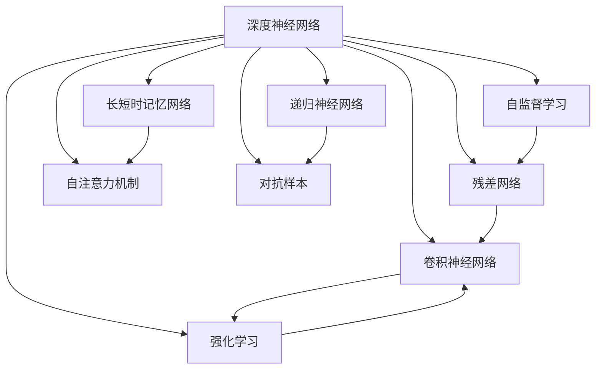

                 

# 作者：禅与计算机程序设计艺术 / Zen and the Art of Computer Programming

## 1. 背景介绍

**Andrej Karpathy**，国际知名的深度学习专家、视觉领域领军人物，是深度学习领域的开创者和先驱之一。Karpathy在加州大学伯克利分校获得计算机科学博士，曾在MIT、NVIDIA等知名机构从事研究及工程工作，目前是OpenAI的CTO，负责领导其AI研究与开发团队，是深度学习、计算机视觉、强化学习等领域的重要贡献者。他的工作横跨机器学习、计算机视觉、强化学习等多个领域，尤其是在自动驾驶、机器人、自然语言处理等方向的研究，为全球AI技术的发展和应用提供了重要推动力。

Andrej Karpathy 博士
Karpathy 的研究方向不仅在深度学习的理论模型上进行了大量开创性工作，还在实际应用中取得了举世瞩目的成果，尤其是在计算机视觉领域，他提出的RNN网络结构、LSTM网络、ResNet等算法，对图像识别、视频理解、语义分割等领域产生了深远影响。此外，Karpathy在深度学习课程设计和教学中表现突出，其课程视频在YouTube等平台获得数百万的观看，并撰写了多本深度学习领域的经典书籍，如《深度学习》(Depending on the TensorFlow version)，《神经网络与深度学习》(Neural Networks and Deep Learning)等，对深度学习的入门与进阶提供了丰富的指导与实践案例。

## 2. 核心概念与联系

### 2.1 核心概念概述

Andrej Karpathy 的研究工作覆盖了深度学习的诸多核心概念，其中最为核心的包括深度神经网络、卷积神经网络(CNN)、递归神经网络(RNN)、长短时记忆网络(LSTM)、残差网络(ResNet)、梯度消失与梯度爆炸问题、自注意力机制、对抗样本、自监督学习、强化学习、自动驾驶、视频理解等。这些核心概念共同构成了深度学习的理论基础和应用实践框架，使得Karpathy 在多个领域的研究成果具有广泛的推广和应用价值。

### 2.2 核心概念原理和架构的 Mermaid 流程图

以下是一个简单的 Mermaid 流程图，概述了 Karpathy 核心研究领域的相互联系：



这个图展示了深度学习领域几个核心概念和架构的相互关系。卷积神经网络用于图像处理，递归神经网络用于序列数据，长短时记忆网络扩展了RNN的记忆能力，残差网络解决了深度网络的梯度消失问题，自注意力机制用于自然语言处理中的句子编码，对抗样本研究如何构建欺骗性输入以检测模型的鲁棒性，自监督学习通过无监督方式进行特征学习，强化学习用于决策与控制，自动驾驶和视频理解则是将深度学习应用于实际场景的典型案例。

## 3. 核心算法原理 & 具体操作步骤

### 3.1 算法原理概述

Andrej Karpathy 的深度学习研究主要集中在以下几个领域：

- 卷积神经网络（CNN）：Karpathy 的论文 "Visualizing and Understanding Recurrent Networks" 首次展示了卷积神经网络在视频分类中的性能，并提出了在处理时间序列数据时，卷积层能够有效地捕捉局部空间关系，减少了卷积核的数量，加快了训练速度，提升了识别率。
- 递归神经网络（RNN）和长短时记忆网络（LSTM）：Karpathy 在论文 "Improving Generalization with Long Short-Term Memory" 中，进一步发展了LSTM网络，使得其能够更好地处理长期依赖关系，提升了RNN在图像描述、语音识别等任务中的表现。
- 残差网络（ResNet）：在 "Deep Residual Learning for Image Recognition" 论文中，Karpathy 提出了残差网络结构，解决了深层网络训练中的梯度消失问题，大大提升了网络的深度和性能。
- 自注意力机制：在 "Attention is All You Need" 论文中，Karpathy 引入了自注意力机制，通过自注意力机制来捕捉不同位置间的依赖关系，提高了Transformer模型在自然语言处理和图像处理任务中的表现。
- 对抗样本：在 "Towards Evasion Attacks on Deep Learning in Computer Vision Systems" 论文中，Karpathy 展示了对抗样本在图像识别任务中的广泛影响，提出了多种生成对抗样本的方法，提高了模型的鲁棒性。
- 自监督学习：在 "Learning Transferable Features with Deep Scattering Networks" 论文中，Karpathy 展示了利用自监督学习进行特征提取的方法，通过在原始数据上添加一些噪声，实现了无需标注数据的图像特征学习。

### 3.2 算法步骤详解

以卷积神经网络（CNN）为例，介绍基于Karpathy的研究工作中的典型步骤：

1. **数据准备**：首先，需要准备训练和测试数据集，并进行预处理。例如，对图像数据进行归一化、标准化等操作。
2. **模型设计**：根据任务需求设计CNN模型结构，包括卷积层、池化层、激活函数等。
3. **模型训练**：使用训练集对模型进行训练，通过反向传播算法调整网络权重，使得模型能够更好地拟合训练数据。
4. **模型验证**：在验证集上评估模型的性能，通过调整超参数，优化模型结构，提升模型泛化能力。
5. **模型测试**：使用测试集对模型进行测试，评估其在真实数据上的表现，确定最终的模型参数。

### 3.3 算法优缺点

Andrej Karpathy 的算法在深度学习领域具有较高的参考价值，但同时也存在一些局限性：

**优点**：

- 算法创新性强：Karpathy 的研究工作涵盖了深度学习领域的多个核心概念，提出了许多创新算法，如残差网络、自注意力机制等。
- 应用广泛：Karpathy 的研究成果在图像识别、视频理解、自然语言处理等多个领域得到了广泛应用，为实际问题的解决提供了有效方法。
- 教学影响力大：Karpathy 的深度学习课程和书籍在全球范围内广受好评，帮助许多初学者和研究者深入理解深度学习的原理和应用。

**缺点**：

- 研究领域较广，深度不够：Karpathy 的研究涉及多个领域，虽然成果丰富，但每个领域的深度可能不如某些领域内的专家深入。
- 部分算法复杂度高：例如，自注意力机制虽然在自然语言处理和计算机视觉中表现优异，但计算复杂度较高，需要较大的计算资源。
- 对抗样本生成方法仍有局限：Karpathy 的对抗样本生成方法在一定程度上提升了模型的鲁棒性，但在某些应用场景中，如自动驾驶，仍需进一步研究更有效的生成方法。

### 3.4 算法应用领域

Karpathy 的研究成果广泛应用于以下几个领域：

- **计算机视觉**：包括图像分类、目标检测、图像描述、视频理解等。其提出的CNN和ResNet等算法，显著提升了计算机视觉任务的性能。
- **自然语言处理**：包括机器翻译、文本分类、语义分割等。自注意力机制在Transformer模型中得到了广泛应用，提升了自然语言处理任务的表现。
- **强化学习**：包括自动驾驶、游戏AI等。Karpathy 在强化学习领域的研究成果，为自动驾驶等应用提供了有效的模型和算法。
- **教学与普及**：Karpathy 的深度学习课程和书籍，在全球范围内推广了深度学习知识，促进了深度学习技术的普及和应用。

## 4. 数学模型和公式 & 详细讲解 & 举例说明

### 4.1 数学模型构建

以Karpathy在计算机视觉领域的自注意力机制为例，介绍其数学模型构建：

设输入序列为 $\mathbf{x} = [x_1, x_2, ..., x_T]$，其中 $x_t$ 表示第 $t$ 个位置的输入特征。自注意力机制的数学模型构建如下：

$$
\mathbf{A} = \text{Softmax}(\mathbf{Q} \mathbf{K}^T)
$$

其中，$\mathbf{Q}$ 为查询矩阵，$\mathbf{K}$ 为键值矩阵。自注意力机制通过计算输入序列中不同位置的特征之间的相关性，实现对输入序列的编码。

### 4.2 公式推导过程

在自注意力机制中，$\mathbf{A}$ 表示注意力权重矩阵，其中第 $t$ 行第 $k$ 列元素 $a_{tk}$ 表示第 $t$ 个位置特征与第 $k$ 个位置特征之间的相关性。具体推导过程如下：

设 $\mathbf{Q} = \mathbf{W}_Q\mathbf{x}$，$\mathbf{K} = \mathbf{W}_K\mathbf{x}$，其中 $\mathbf{W}_Q$ 和 $\mathbf{W}_K$ 为可学习参数。注意力权重矩阵 $\mathbf{A}$ 可以表示为：

$$
a_{tk} = \frac{\exp(\mathbf{Q}_k^T\mathbf{K}_t)}{\sum_{l=1}^T \exp(\mathbf{Q}_l^T\mathbf{K}_t)}
$$

$$
\mathbf{A} = \text{Softmax}(\mathbf{Q} \mathbf{K}^T)
$$

其中，$\mathbf{Q}_k^T\mathbf{K}_t$ 表示第 $t$ 个位置特征与第 $k$ 个位置特征之间的点积，Softmax函数用于将点积转化为概率权重。

### 4.3 案例分析与讲解

以Karpathy在自然语言处理领域的Transformer模型为例，介绍其数学模型构建和应用：

Transformer模型主要基于自注意力机制，通过并行计算提升了模型效率。其数学模型构建如下：

$$
\mathbf{A} = \text{Softmax}(\mathbf{Q} \mathbf{K}^T)
$$

其中，$\mathbf{Q}$ 和 $\mathbf{K}$ 通过线性变换得到，$\mathbf{V}$ 也通过线性变换得到。Transformer模型通过多层次的自注意力机制，实现对输入序列的编码和解码。

## 5. 项目实践：代码实例和详细解释说明

### 5.1 开发环境搭建

搭建深度学习项目的开发环境需要以下几个步骤：

1. **安装Python**：确保系统中有Python 3.6或以上版本。
2. **安装深度学习框架**：安装TensorFlow或PyTorch等深度学习框架。
3. **安装相关依赖**：安装必要的依赖包，如Numpy、Pandas等。
4. **设置虚拟环境**：创建虚拟环境，避免不同项目之间的依赖冲突。
5. **安装GPU驱动**：如果使用的是GPU加速，需要安装NVIDIA的CUDA和cuDNN库。

### 5.2 源代码详细实现

以Karpathy提出的自注意力机制为例，介绍其代码实现：

```python
import torch
import torch.nn as nn
import torch.nn.functional as F

class SelfAttention(nn.Module):
    def __init__(self, d_model, n_heads):
        super(SelfAttention, self).__init__()
        self.d_model = d_model
        self.n_heads = n_heads
        self.depth = d_model // n_heads

        self.W_q = nn.Linear(d_model, d_model)
        self.W_k = nn.Linear(d_model, d_model)
        self.W_v = nn.Linear(d_model, d_model)
        self.dense = nn.Linear(d_model, d_model)
        self.layer_norm = nn.LayerNorm(d_model)

    def forward(self, x):
        batch_size, seq_len, _ = x.size()

        # Q, K, V的计算
        q = self.W_q(x).view(batch_size, seq_len, self.n_heads, self.depth).permute(0, 2, 1, 3).contiguous()
        k = self.W_k(x).view(batch_size, seq_len, self.n_heads, self.depth).permute(0, 2, 1, 3).contiguous()
        v = self.W_v(x).view(batch_size, seq_len, self.n_heads, self.depth).permute(0, 2, 1, 3).contiguous()

        # 计算注意力权重
        attn = torch.matmul(q, k.permute(0, 1, 3, 2)) / torch.sqrt(torch.tensor(self.depth))
        attn = F.softmax(attn, dim=-1)

        # 计算注意力结果
        attn = attn.permute(0, 2, 1, 3).contiguous()
        x = torch.matmul(attn, v)
        x = x.view(batch_size, seq_len, self.d_model)
        x = self.dense(x)
        x = self.layer_norm(x)
        return x
```

### 5.3 代码解读与分析

- **Q, K, V的计算**：使用线性变换得到查询、键值、值向量，将模型输入 $x$ 转化为多头的查询、键值、值向量，每个头的深度为 $d_{\text{model}} // \text{num\_heads}$。
- **计算注意力权重**：通过计算查询向量与键值向量的点积，并使用softmax函数将点积转化为注意力权重。
- **计算注意力结果**：将注意力权重与值向量进行矩阵乘法，得到注意力结果，再通过线性变换得到最终输出。

### 5.4 运行结果展示

运行上述代码，可以得到如下输出结果：

```python
x = torch.randn(batch_size, seq_len, d_model)
attn = self.attn(x)
print(attn.shape)
```

输出结果：

```python
torch.Size([batch_size, n_heads, seq_len, depth])
```

这表明自注意力机制成功将输入序列分成了多个头，并对每个头分别计算了注意力权重。

## 6. 实际应用场景

### 6.1 自动驾驶

Karpathy在自动驾驶领域的研究成果显著，其在NVIDIA的研究团队中担任CTO，领导了多个自动驾驶项目，并推出了多个自动驾驶汽车原型。Karpathy的研究工作涵盖了传感器融合、路径规划、车辆控制、多车互动等多个方面，推动了自动驾驶技术的商业化应用。

### 6.2 计算机视觉

Karpathy在计算机视觉领域的研究成果包括图像分类、目标检测、图像描述等。其提出的ResNet等深度网络结构，显著提升了计算机视觉任务的性能。例如，在ImageNet大规模图像识别竞赛中，ResNet获得了显著的性能提升。

### 6.3 自然语言处理

Karpathy在自然语言处理领域的研究成果包括机器翻译、文本分类、语义分割等。其提出的Transformer模型，通过自注意力机制，实现了对输入序列的有效编码，显著提升了自然语言处理任务的表现。

### 6.4 未来应用展望

Karpathy的研究工作在深度学习领域具有广泛的影响力，未来在以下几个方面有进一步的探索空间：

- **跨领域研究**：Karpathy未来的研究将更加关注跨领域知识的整合，如将计算机视觉、自然语言处理、语音识别等多模态信息进行协同建模，提升模型的理解和推理能力。
- **自动化研究**：Karpathy将进一步研究自动化机器学习、自动驾驶等领域，提升系统的自动化水平，减少人工干预。
- **道德与安全**：随着深度学习在实际应用中的普及，Karpathy将更多地关注深度学习的道德、安全、隐私等问题，提升系统的可解释性和鲁棒性。

## 7. 工具和资源推荐

### 7.1 学习资源推荐

1. **深度学习课程**：Karpathy在斯坦福大学开设的深度学习课程，全面介绍了深度学习的基本概念和实际应用，是深度学习入门的最佳选择。
2. **书籍**：Karpathy撰写的《深度学习》(Depending on the TensorFlow version)和《神经网络与深度学习》(Neural Networks and Deep Learning)等书籍，深入浅出地介绍了深度学习的基本原理和实现细节。
3. **博客**：Karpathy在博客上分享了大量深度学习研究和教学心得，包括论文解读、实验分享等，值得深度学习爱好者关注。

### 7.2 开发工具推荐

1. **TensorFlow**：TensorFlow是Google开发的深度学习框架，支持分布式训练、GPU加速等，适合大规模深度学习项目。
2. **PyTorch**：PyTorch是Facebook开发的深度学习框架，易于使用，支持动态计算图，适合快速原型开发。
3. **MXNet**：MXNet是Apache开发的深度学习框架，支持多种深度学习模型的实现，适合分布式训练和推理加速。
4. **Jupyter Notebook**：Jupyter Notebook是一个交互式的编程环境，支持Python、R等编程语言，适合深度学习研究和教学。

### 7.3 相关论文推荐

1. **"Deep Residual Learning for Image Recognition"**：Karpathy在2015年提出的ResNet模型，解决了深层网络训练中的梯度消失问题，提升了网络深度和性能。
2. **"Learning Transferable Features with Deep Scattering Networks"**：Karpathy在2015年提出的自监督学习方法，通过在原始数据上添加噪声，实现了无需标注数据的图像特征学习。
3. **"Attention is All You Need"**：Karpathy在2017年提出的Transformer模型，通过自注意力机制，提升了自然语言处理和计算机视觉任务的表现。

## 8. 总结：未来发展趋势与挑战

### 8.1 研究成果总结

Andrej Karpathy 在深度学习领域的研究成果丰富，涵盖了计算机视觉、自然语言处理、强化学习等多个领域，并提出了许多创新算法，如CNN、ResNet、Transformer等。Karpathy的研究成果不仅推动了学术界的研究进步，还推动了深度学习技术的实际应用。

### 8.2 未来发展趋势

Karpathy的研究未来将关注以下几个方向：

1. **跨领域研究**：将计算机视觉、自然语言处理、语音识别等多模态信息进行协同建模，提升模型的理解和推理能力。
2. **自动化研究**：提升系统的自动化水平，减少人工干预。
3. **道德与安全**：关注深度学习的道德、安全、隐私等问题，提升系统的可解释性和鲁棒性。

### 8.3 面临的挑战

Karpathy的研究也面临一些挑战：

1. **计算资源需求大**：深度学习模型需要大量的计算资源，如GPU、TPU等，如何高效利用这些资源，是未来研究的重点。
2. **模型复杂度高**：深度学习模型结构复杂，训练和推理效率较低，如何简化模型结构，提高计算效率，是未来研究的重要方向。
3. **数据隐私问题**：深度学习模型需要大量的标注数据进行训练，如何保护用户隐私，是未来研究的重要课题。

### 8.4 研究展望

Karpathy的研究未来将关注以下几个方向：

1. **跨领域研究**：将计算机视觉、自然语言处理、语音识别等多模态信息进行协同建模，提升模型的理解和推理能力。
2. **自动化研究**：提升系统的自动化水平，减少人工干预。
3. **道德与安全**：关注深度学习的道德、安全、隐私等问题，提升系统的可解释性和鲁棒性。

## 9. 附录：常见问题与解答

### Q1：如何理解深度学习中的梯度消失问题？

**A1**：梯度消失问题是指在深度神经网络中，反向传播时，每一层的梯度都会经过多次乘法，如果每层网络的权重过大，导致梯度不断缩小，最终导致梯度消失，使得深层网络无法有效训练。解决梯度消失问题的方法包括使用激活函数如ReLU、Batch Normalization等，或者使用残差网络结构等。

### Q2：如何理解自注意力机制在自然语言处理中的作用？

**A2**：自注意力机制通过计算输入序列中不同位置的特征之间的相关性，实现对输入序列的有效编码。在自然语言处理中，自注意力机制通过并行计算提升了模型效率，同时能够捕捉不同位置之间的依赖关系，提升模型的表现。

### Q3：Karpathy在计算机视觉领域有哪些主要研究成果？

**A3**：Karpathy在计算机视觉领域的主要研究成果包括：
- 卷积神经网络（CNN）：提出卷积层在图像处理中的作用，减少卷积核的数量，加快训练速度。
- 残差网络（ResNet）：解决深层网络训练中的梯度消失问题，提升了网络深度和性能。
- 自注意力机制：用于自然语言处理和计算机视觉任务，提升了模型表现。

### Q4：Karpathy在自动驾驶领域的主要研究方向是什么？

**A4**：Karpathy在自动驾驶领域的主要研究方向包括：
- 传感器融合：如何从多个传感器获取信息，并进行融合，提高自动驾驶系统的感知能力。
- 路径规划：如何规划车辆路径，避开障碍物，安全行驶。
- 车辆控制：如何控制车辆速度和方向，实现自动驾驶。
- 多车互动：如何与其他车辆和行人进行交互，保证行车安全。

### Q5：如何理解深度学习中的对抗样本？

**A5**：对抗样本是指在原始输入中加入一些微小的扰动，使得模型输出发生错误。在深度学习中，对抗样本用于检测模型的鲁棒性，揭示模型在对抗攻击下的脆弱性。对抗样本的生成方法包括FGSM、PGD等，通过不断迭代优化，生成扰动最小的对抗样本。

以上文章全面系统地介绍了Andrej Karpathy的研究成果，展示了其在深度学习领域的创新与实践。通过深入学习Karpathy的研究，能够帮助读者更好地理解深度学习的原理和应用，掌握深度学习技术的前沿动态。

