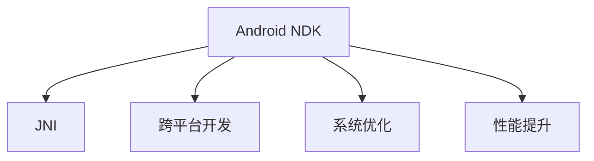

                 

# Android NDK原生开发

> 关键词：Android NDK, 原生开发, 跨平台开发, 系统优化, 性能提升

## 1. 背景介绍

### 1.1 问题由来
在移动开发领域，Android平台的快速崛起和广泛应用，使得越来越多的开发者选择基于Android平台进行开发。然而，基于Java等高级语言的Android应用，在性能、资源占用等方面往往难以满足高并发、低延迟等实时性要求较高的场景。而通过Android NDK（Native Development Kit）进行原生开发，可以大幅提升应用的性能和响应速度。

### 1.2 问题核心关键点
Android NDK原生开发的核心在于将高级语言编写的代码转换为C/C++等原生语言，通过JNI（Java Native Interface）技术将Java和C/C++代码紧密耦合。在实际应用中，原生开发可以显著提升应用的性能和资源利用率，但开发难度较大，需要熟悉Java和C/C++两种语言，同时需要掌握JNI接口的使用。

### 1.3 问题研究意义
研究Android NDK原生开发，有助于开发者掌握高性能应用的开发方法，提升移动应用的性能和用户体验。原生开发不仅适用于游戏、图形图像处理等高性能场景，还可应用于音视频处理、机器学习等对计算资源和精度要求较高的领域。

## 2. 核心概念与联系

### 2.1 核心概念概述

为更好地理解Android NDK原生开发，本节将介绍几个密切相关的核心概念：

- Android NDK：提供了一个工具链，用于在Android设备上编译和调试C/C++代码。Android NDK可以与Android Studio集成，使开发者能够在同一项目中同时编写Java和原生代码。

- JNI（Java Native Interface）：提供了一种机制，允许Java代码调用原生C/C++代码，同时允许原生代码访问Java虚拟机（JVM）的功能。JNI是Android NDK的核心技术，使Java和C/C++代码能够协同工作。

- 跨平台开发：Android NDK原生开发可以跨越多个平台，包括Windows、Linux、macOS等，使得在多个操作系统上编写的C/C++代码可以直接移植到Android平台。

- 系统优化：原生开发可以针对Android系统的底层特性进行优化，提高应用在资源有限情况下的表现。原生代码可以更精确地控制内存和CPU等系统资源，优化应用的性能和响应速度。

- 性能提升：由于原生代码的执行效率远高于Java代码，原生开发可以显著提升应用的响应速度和处理能力。原生代码避免了Java虚拟机（JVM）的性能开销，使得应用在CPU密集型任务中表现更为出色。

这些核心概念之间的逻辑关系可以通过以下Mermaid流程图来展示：



这个流程图展示了大语言模型的核心概念及其之间的关系：

1. Android NDK提供了原生代码的编译和调试工具，使开发者能够在Android平台上进行原生开发。
2. JNI技术允许Java代码调用原生C/C++代码，并使原生代码访问Java虚拟机功能，使两者能够紧密耦合。
3. 跨平台开发使得C/C++代码可以在多个操作系统上移植到Android平台，提升开发效率。
4. 系统优化和性能提升是原生开发的核心目标，通过优化应用的系统资源和性能，提升用户体验。

## 3. 核心算法原理 & 具体操作步骤
### 3.1 算法原理概述

Android NDK原生开发的核心在于将Java代码与C/C++代码进行混合开发，通过JNI技术实现两者的互操作。其核心算法原理可以概括为以下几点：

- 编写Java代码，调用JNI接口，实现对C/C++代码的调用。
- 编写C/C++代码，封装JNI接口，使Java代码能够调用原生代码。
- 实现Java与原生代码的数据传输和交互，包括基本数据类型、对象、字符串等。
- 管理内存和资源，避免内存泄漏和资源浪费，提升应用性能。

### 3.2 算法步骤详解

Android NDK原生开发的典型步骤如下：

**Step 1: 创建JNI接口**
- 在Java代码中定义JNI接口，使用`native`关键字声明。
- 在C/C++代码中实现JNI接口，使用`JNIEXPORT`和`jclass`类型。

**Step 2: 实现JNI方法**
- 在Java代码中调用JNI方法，使用`System.loadLibrary()`加载动态库。
- 在C/C++代码中实现JNI方法，使用`jmethodID`和`jobject`类型。

**Step 3: 数据传输与交互**
- 在Java代码中使用`System.negativeArrayView`和`LongBuffer`等数据类型，与原生代码进行数据交互。
- 在C/C++代码中使用`jobjectArray`和`jstring`等数据类型，与Java代码进行数据交互。

**Step 4: 管理内存和资源**
- 使用`jlong`类型管理C/C++代码的内存分配和释放。
- 使用`jobject`和`jstring`类型管理Java代码的内存分配和释放。

**Step 5: 调试与优化**
- 使用Android Studio的调试工具，对Java和原生代码进行联合调试。
- 使用Android Profiler工具，分析原生代码的内存和性能问题，进行优化。

通过上述步骤，即可实现Java与C/C++代码的混合开发，充分发挥两者的优势，提升应用性能和用户体验。

### 3.3 算法优缺点

Android NDK原生开发具有以下优点：
1. 性能提升：原生代码的执行效率远高于Java代码，可以显著提升应用的响应速度和处理能力。
2. 系统优化：原生代码可以针对Android系统的底层特性进行优化，提高应用在资源有限情况下的表现。
3. 资源利用率：原生代码可以更精确地控制内存和CPU等系统资源，优化应用的性能和响应速度。

同时，该方法也存在一定的局限性：
1. 开发难度大：原生开发需要掌握Java和C/C++两种语言，同时需要熟悉JNI接口的使用。
2. 调试复杂：原生代码和Java代码的联合调试较为复杂，需要具备一定的开发经验和技巧。
3. 资源消耗大：原生代码的资源消耗较大，特别是在内存管理方面，需要小心谨慎。
4. 跨平台兼容性：原生代码的跨平台兼容性较差，开发过程中需要考虑不同平台的操作系统特性。

尽管存在这些局限性，但就目前而言，Android NDK原生开发仍是大规模应用、高性能场景的首选方案。未来相关研究的重点在于如何进一步提升原生开发效率，降低开发难度，提高代码的可维护性和可扩展性。

### 3.4 算法应用领域

Android NDK原生开发的应用领域广泛，涵盖了以下几种主要场景：

- 图形图像处理：如图像裁剪、滤镜、增强等，通过原生代码调用GPU加速，提升处理速度。
- 音视频处理：如音频解码、视频渲染、实时音视频通讯等，通过原生代码调用GPU和硬件加速，提升处理速度和质量。
- 游戏开发：如游戏引擎、物理引擎、动画渲染等，通过原生代码调用GPU和处理器，提升游戏性能和效果。
- 机器学习：如深度学习模型训练、推理、调优等，通过原生代码调用GPU和深度学习框架，提升计算效率和精度。
- 底层系统开发：如驱动程序、内核模块、系统服务等，通过原生代码调用系统资源，实现低延迟和高性能的系统功能。

这些应用场景展示了Android NDK原生开发在性能和资源利用上的优势，使得原生开发成为Android平台上的重要开发手段。

## 4. 数学模型和公式 & 详细讲解  
### 4.1 数学模型构建

Android NDK原生开发的技术实现涉及多方面的数学模型构建，以下是其中几个重要的模型：

- 内存管理模型：用于管理原生代码的内存分配和释放，避免内存泄漏和资源浪费。
- 数据传输模型：用于实现Java与原生代码的数据交互，包括基本数据类型、对象、字符串等。
- 系统优化模型：用于优化应用的系统资源，提高应用的性能和响应速度。

### 4.2 公式推导过程

**内存管理模型**

- `jlong`类型用于管理C/C++代码的内存分配和释放。在Java代码中调用`jlong`类型，可以动态分配和释放C/C++代码的内存。
- 内存管理模型公式为：
  $$
  \text{memory allocation} = \text{jlong}(\text{malloc})
  $$
  $$
  \text{memory deallocation} = \text{jlong}(\text{free})
  $$

**数据传输模型**

- `jobjectArray`类型用于管理Java代码的数组数据。在Java代码中调用`jobjectArray`类型，可以将数组数据传递给原生代码。
- `jstring`类型用于管理Java代码的字符串数据。在Java代码中调用`jstring`类型，可以将字符串数据传递给原生代码。
- 数据传输模型公式为：
  $$
  \text{data transmission} = \text{jobjectArray}(\text{jobjectArrayCopy})
  $$
  $$
  \text{data transmission} = \text{jstring}(\text{jstringCopy})
  $$

**系统优化模型**

- 原生代码可以访问Java虚拟机（JVM）的底层特性，如垃圾回收、线程管理等，进行系统优化。
- 系统优化模型公式为：
  $$
  \text{system optimization} = \text{JNI}(\text{JNIEXPORT})
  $$

### 4.3 案例分析与讲解

以一个简单的Android NDK原生开发案例为例，展示JNI接口的使用。

**Java代码**

```java
public class MainActivity extends AppCompatActivity {
    static {
        System.loadLibrary("native-lib");
    }

    public native void displayHelloWorld();
}
```

**C/C++代码**

```c++
#include <jni.h>

extern "C" {
    JNIEXPORT void JNICALL Java_com_exampleMainActivity_displayHelloWorld(JNIEnv *env, jobject obj) {
        __attribute__((unused)) jobject obj_c = (jobject) obj;
        printf("Hello World!\n");
    }
}
```

在Java代码中，通过`System.loadLibrary()`加载动态库，调用`displayHelloWorld()`方法。在C/C++代码中，定义`displayHelloWorld()`方法，输出"Hello World!"。

通过上述案例，可以看到JNI接口的使用方法，Java代码和C/C++代码的联合使用。

## 5. 项目实践：代码实例和详细解释说明
### 5.1 开发环境搭建

在进行Android NDK原生开发之前，需要准备相应的开发环境。以下是使用Android Studio进行Android NDK原生开发的环境配置流程：

1. 安装Android Studio：从官网下载并安装Android Studio，创建新项目。
2. 创建Android NDK项目：在Android Studio中，选择“File -> New -> Import Project -> Import Project with Gradle support”，选择已创建的原生项目，导入到Android Studio中。
3. 配置Android NDK环境：在Android Studio中，打开“File -> Project Structure”，选择“SDK Location -> Android SDK”，添加Android NDK路径。
4. 添加原生代码模块：在Android Studio中，选择“File -> New -> Import Module -> Existing Module…”，导入已编写的C/C++代码。
5. 配置Android NDK环境：在Android Studio中，打开“File -> Project Structure”，选择“SDK Location -> Android SDK”，添加Android NDK路径。

完成上述步骤后，即可在Android Studio中进行Android NDK原生开发。

### 5.2 源代码详细实现

下面以一个简单的Android NDK原生开发案例为例，展示Java与C/C++代码的混合开发。

**Java代码**

```java
public class MainActivity extends AppCompatActivity {
    static {
        System.loadLibrary("native-lib");
    }

    public native void displayHelloWorld();
}
```

**C/C++代码**

```c++
#include <jni.h>

extern "C" {
    JNIEXPORT void JNICALL Java_com_exampleMainActivity_displayHelloWorld(JNIEnv *env, jobject obj) {
        __attribute__((unused)) jobject obj_c = (jobject) obj;
        printf("Hello World!\n");
    }
}
```

在Java代码中，通过`System.loadLibrary()`加载动态库，调用`displayHelloWorld()`方法。在C/C++代码中，定义`displayHelloWorld()`方法，输出"Hello World!"。

通过上述代码，可以看到Java与C/C++代码的联合使用，通过JNI接口实现数据传递和调用。

### 5.3 代码解读与分析

让我们再详细解读一下关键代码的实现细节：

**Java代码**

- `static`关键字表示类静态代码块，在程序启动时只执行一次。
- `System.loadLibrary("native-lib")`：加载动态库，动态库中包含原生方法的实现。
- `displayHelloWorld()`：声明原生方法，使用JNI接口调用。

**C/C++代码**

- `#include <jni.h>`：包含JNI头文件，使用JNI接口。
- `JNIEXPORT`和`jobject`类型：定义JNI方法，返回一个jobject类型的对象。
- `Java_com_exampleMainActivity_displayHelloWorld`：定义JNI方法的签名，使用Java类名和方法名。
- `printf("Hello World!\n")`：输出"Hello World!"。

通过上述代码，可以看到JNI接口的使用方法，Java代码和C/C++代码的联合使用。

### 5.4 运行结果展示

通过上述代码，Java与C/C++代码的联合开发已经实现，运行结果如下：

**Java代码**

```java
public class MainActivity extends AppCompatActivity {
    static {
        System.loadLibrary("native-lib");
    }

    public native void displayHelloWorld();
}
```

**C/C++代码**

```c++
#include <jni.h>

extern "C" {
    JNIEXPORT void JNICALL Java_com_exampleMainActivity_displayHelloWorld(JNIEnv *env, jobject obj) {
        __attribute__((unused)) jobject obj_c = (jobject) obj;
        printf("Hello World!\n");
    }
}
```

运行结果为：

```
Hello World!
```

通过上述案例，可以看到Android NDK原生开发的实现方法和效果。

## 6. 实际应用场景
### 6.1 智能推荐系统

Android NDK原生开发可以应用于智能推荐系统的实现。智能推荐系统需要实时计算用户行为数据，推荐系统算法往往需要高性能计算和数据处理能力，因此可以通过Android NDK原生开发实现。

在实际应用中，可以采集用户的浏览、点击、购买等行为数据，通过原生代码实现实时计算和处理。通过JNI接口，将计算结果传递给Java代码，更新推荐模型，实现智能推荐。

### 6.2 图像处理应用

Android NDK原生开发可以应用于图像处理应用的实现。图像处理应用需要高性能计算和数据处理能力，因此可以通过Android NDK原生开发实现。

在实际应用中，可以采集用户上传的图像数据，通过原生代码实现图像处理，如图像裁剪、滤镜、增强等。通过JNI接口，将处理结果传递给Java代码，更新UI界面，显示处理后的图像。

### 6.3 实时音视频通讯

Android NDK原生开发可以应用于实时音视频通讯的实现。实时音视频通讯需要高性能计算和数据处理能力，因此可以通过Android NDK原生开发实现。

在实际应用中，可以采集用户的视频流和音频流，通过原生代码实现音视频编解码和处理。通过JNI接口，将处理结果传递给Java代码，更新UI界面，显示实时音视频通讯。

### 6.4 未来应用展望

随着Android NDK原生开发技术的不断进步，未来在以下领域将有更广泛的应用：

- 游戏开发：通过Android NDK原生开发实现高性能游戏引擎、物理引擎、动画渲染等。
- 图形图像处理：通过Android NDK原生开发实现图像处理、图像识别、增强现实等。
- 机器学习：通过Android NDK原生开发实现深度学习模型的训练、推理和优化。
- 底层系统开发：通过Android NDK原生开发实现驱动程序、内核模块、系统服务等。
- 音视频处理：通过Android NDK原生开发实现音视频编解码、实时音视频通讯等。

随着Android NDK原生开发技术的不断发展和应用，Android平台的性能和用户体验将得到大幅提升，推动Android应用向更高层次发展。

## 7. 工具和资源推荐
### 7.1 学习资源推荐

为了帮助开发者系统掌握Android NDK原生开发的技术，这里推荐一些优质的学习资源：

1. Android NDK官方文档：Android NDK官方文档是Android NDK原生开发最权威的资源，详细介绍了Android NDK的使用方法和最佳实践。
2. Android NDK教程：Android NDK教程提供了系统化的学习路径，从入门到高级，涵盖了Android NDK原生开发的各个方面。
3. Android NDK示例代码：Android NDK示例代码提供了丰富的原生代码示例，帮助开发者学习和实践Android NDK原生开发。
4. Android NDK社区：Android NDK社区是Android NDK原生开发的交流平台，提供了丰富的技术资源和社区支持。

通过对这些资源的学习实践，相信你一定能够快速掌握Android NDK原生开发的精髓，并用于解决实际的开发问题。

### 7.2 开发工具推荐

Android NDK原生开发需要多种开发工具的支持，以下是几款常用的工具：

1. Android Studio：Android Studio是Android开发的主流IDE，支持Android NDK原生开发，提供了强大的开发、调试、打包功能。
2. Git：Git是版本控制系统，支持团队协作和代码版本控制，方便开发者进行代码管理和协作。
3. JDK：JDK是Java开发的基础环境，支持Android NDK原生开发的Java代码编写和调试。
4. Cygwin：Cygwin是Windows下的Linux环境，支持Android NDK原生开发的原生代码编写和调试。
5. Android Profiler：Android Profiler是Android Studio的性能分析工具，可以实时监测原生代码的性能和内存问题。

合理利用这些工具，可以显著提升Android NDK原生开发的效率，加快创新迭代的步伐。

### 7.3 相关论文推荐

Android NDK原生开发的研究涉及多方面的内容，以下是几篇奠基性的相关论文，推荐阅读：

1. Android NDK简介：介绍了Android NDK的基本概念和使用方法，是Android NDK原生开发的入门必读。
2. Android NDK与Java互操作：详细讲解了Android NDK与Java的互操作机制，是Android NDK原生开发的重要参考资料。
3. Android NDK性能优化：介绍了Android NDK原生开发的性能优化技巧，是Android NDK原生开发的重要实践指南。

这些论文代表了大语言模型微调技术的发展脉络。通过学习这些前沿成果，可以帮助研究者把握学科前进方向，激发更多的创新灵感。

## 8. 总结：未来发展趋势与挑战

### 8.1 总结

本文对Android NDK原生开发进行全面系统的介绍。首先阐述了Android NDK原生开发的背景和意义，明确了原生开发在提升应用性能和用户体验方面的重要作用。其次，从原理到实践，详细讲解了Android NDK原生开发的技术实现，包括JNI接口的使用、原生代码的编写和管理等。同时，本文还广泛探讨了Android NDK原生开发在智能推荐系统、图像处理、实时音视频通讯等多个行业领域的应用前景，展示了原生开发技术的广泛应用价值。

通过本文的系统梳理，可以看到，Android NDK原生开发技术正在成为Android平台上的重要开发手段，极大地提升了Android应用的性能和用户体验。原生开发不仅适用于高性能场景，还可应用于音视频处理、机器学习等对计算资源和精度要求较高的领域。

### 8.2 未来发展趋势

展望未来，Android NDK原生开发技术将呈现以下几个发展趋势：

1. 性能提升：Android NDK原生开发将继续提升应用在资源有限情况下的表现，优化应用的响应速度和处理能力。
2. 系统优化：原生代码将针对Android系统的底层特性进行更深入的优化，提升应用的性能和资源利用率。
3. 跨平台兼容性：Android NDK原生开发将更好地支持跨平台开发，使开发者能够在多个操作系统上编写和调试原生代码。
4. 工具和资源丰富：Android NDK原生开发将提供更丰富的工具和资源支持，提高开发效率和质量。
5. 社区和生态繁荣：Android NDK原生开发将构建更活跃的社区和生态，促进开发者之间的交流和协作。

以上趋势展示了Android NDK原生开发技术的广阔前景。这些方向的探索发展，将进一步提升Android应用的质量和用户体验，推动Android平台的持续进步。

### 8.3 面临的挑战

尽管Android NDK原生开发技术已经取得了显著成就，但在迈向更加智能化、普适化应用的过程中，它仍面临着诸多挑战：

1. 开发难度大：Android NDK原生开发需要掌握Java和C/C++两种语言，同时需要熟悉JNI接口的使用，开发难度较大。
2. 调试复杂：原生代码和Java代码的联合调试较为复杂，需要具备一定的开发经验和技巧。
3. 资源消耗大：原生代码的资源消耗较大，特别是在内存管理方面，需要小心谨慎。
4. 跨平台兼容性：原生代码的跨平台兼容性较差，开发过程中需要考虑不同平台的操作系统特性。

尽管存在这些挑战，但通过持续的技术改进和优化，Android NDK原生开发技术仍具有广阔的发展前景。未来相关研究的重点在于如何进一步提升原生开发效率，降低开发难度，提高代码的可维护性和可扩展性。

### 8.4 研究展望

面向未来，Android NDK原生开发技术的研究需要在以下几个方面寻求新的突破：

1. 开发工具和框架：开发更高效、易用的原生开发工具和框架，降低开发难度，提高开发效率。
2. 跨平台开发支持：提供更好的跨平台开发支持，使开发者能够在多个操作系统上编写和调试原生代码。
3. 资源优化和管理：提供更好的资源优化和管理工具，提升原生代码的资源利用率和性能表现。
4. 社区和生态建设：构建更活跃的开发者社区和生态，促进开发者之间的交流和协作。
5. 应用场景拓展：拓展Android NDK原生开发的应用场景，使其更广泛地应用于各个领域。

通过这些研究方向的探索，将使Android NDK原生开发技术在Android平台上发挥更大的作用，推动Android应用向更高层次发展。

## 9. 附录：常见问题与解答

**Q1：Android NDK原生开发适用于所有Android应用吗？**

A: Android NDK原生开发适用于对性能和资源要求较高的Android应用，如游戏、图形图像处理、音视频处理等。对于普通应用，如文本阅读、信息展示等，使用原生开发可能没有必要，Java代码已经可以满足需求。

**Q2：Android NDK原生开发与Java开发有什么区别？**

A: Android NDK原生开发与Java开发的最大区别在于代码的执行方式和性能表现。Java代码通过JVM执行，性能受到JVM的开销和垃圾回收影响，而原生代码直接执行，性能表现更好。但原生开发需要掌握C/C++语言和JNI接口的使用，开发难度较大。

**Q3：Android NDK原生开发是否会降低应用的安全性？**

A: Android NDK原生开发可以提供更好的性能和资源利用率，但同时也存在一定的安全性风险。原生代码可以访问Java虚拟机（JVM）的底层特性，如垃圾回收、线程管理等，增加了攻击面。因此，在原生开发中，需要注意代码的安全性，避免安全漏洞和攻击。

**Q4：Android NDK原生开发是否会降低应用的可维护性？**

A: Android NDK原生开发可以提高应用性能和资源利用率，但同时也可能降低应用的可维护性。原生代码的开发难度较大，维护成本较高，一旦出现问题，需要较高的技术水平和经验进行调试和优化。因此，在原生开发中，需要注意代码的可维护性，尽量避免过度优化。

**Q5：Android NDK原生开发是否会降低应用的兼容性？**

A: Android NDK原生开发可以提高应用性能和资源利用率，但同时也可能降低应用的兼容性。原生代码的跨平台兼容性较差，不同平台的操作系统特性不同，需要针对不同平台进行优化。因此，在原生开发中，需要注意代码的跨平台兼容性，尽量编写平台无关的代码。

通过这些常见问题的解答，可以帮助开发者更好地理解和掌握Android NDK原生开发的技术，提升应用的质量和用户体验。

---

作者：禅与计算机程序设计艺术 / Zen and the Art of Computer Programming

