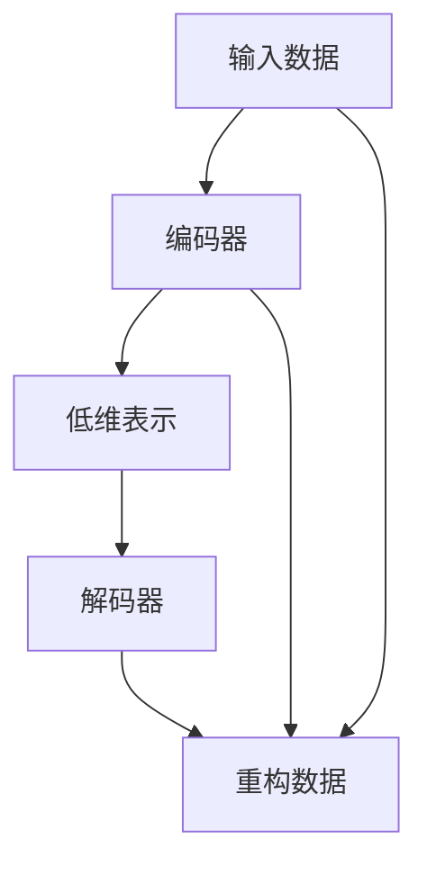

                 

# Autoencoders原理与代码实例讲解

> 关键词：Autoencoder, 编码器, 解码器, 降噪, 特征学习, 深度学习, 图像处理, 推荐系统

## 1. 背景介绍

### 1.1 问题由来
Autoencoder是一种深度学习模型，主要用于数据的压缩、去噪和特征提取等任务。它通过学习数据的低维表示，实现数据的压缩和解压缩，具有自编码的性质。Autoencoder 的编码器部分将输入数据映射到低维空间，解码器部分则将低维数据映射回原始空间。其原理和应用范围在深度学习领域有广泛的应用，尤其在图像处理、推荐系统和信号处理等场景中。

### 1.2 问题核心关键点
Autoencoder 的核心思想是学习数据的低维表示，在压缩和恢复数据的同时学习数据的特征。其主要由编码器和解码器两部分组成，通过最小化重构误差来优化模型的参数。常见的Autoencoder包括标准Autoencoder、变分Autoencoder(VAE)、稀疏Autoencoder等。

Autoencoder 的应用领域广泛，涉及数据压缩、数据去噪、特征提取、生成模型、无监督学习等多个方向。在实际应用中，Autoencoder 可以通过输入不同的数据，学习不同的特征表示，从而适应不同的应用场景。

### 1.3 问题研究意义
Autoencoder 的研究意义在于其能够从数据中自动学习到有用的特征表示，避免手动设计特征的繁琐过程。同时，Autoencoder 可以用于数据的降噪、降维、生成新数据等任务，具有广泛的应用前景。在深度学习的发展中，Autoencoder 不仅是模型压缩和特征提取的重要工具，也是生成模型和无监督学习的重要基础。

## 2. 核心概念与联系

### 2.1 核心概念概述

Autoencoder 的核心理论包括编码器(Encoder)、解码器(Decoder)和重构误差(Reconstruction Error)。其中，编码器将输入数据映射到低维空间，解码器将低维数据映射回原始空间，重构误差是衡量编码器-解码器性能的重要指标。

Autoencoder 的输入可以是图像、文本、音频等多种类型的数据。对于图像数据，Autoencoder 可以用于图像压缩、去噪、超分辨率等任务；对于文本数据，Autoencoder 可以用于文本分类、情感分析等任务；对于音频数据，Autoencoder 可以用于音频去噪、语音识别等任务。

### 2.2 核心概念原理和架构的 Mermaid 流程图



上述流程图展示了 Autoencoder 的基本架构。编码器将输入数据映射到低维空间，解码器将低维数据映射回原始空间，重构误差表示重构数据与原始数据的差异。Autoencoder 的目标是最小化重构误差，从而学习到数据的低维表示。

### 2.3 核心概念联系
Autoencoder 的核心概念包括：

- **编码器(Encoder)**：将输入数据映射到低维空间，是 Autoencoder 的重要组成部分。
- **解码器(Decoder)**：将低维数据映射回原始空间，是 Autoencoder 的重要组成部分。
- **重构误差(Reconstruction Error)**：衡量重构数据与原始数据的差异，是 Autoencoder 优化的目标。

## 3. 核心算法原理 & 具体操作步骤

### 3.1 算法原理概述

Autoencoder 的训练目标是最小化重构误差。重构误差是解码器输出与原始输入之间的差异，通常使用均方误差(MSE)或交叉熵等损失函数来衡量。训练过程中，编码器将输入数据映射到低维空间，解码器将低维数据映射回原始空间，通过不断调整模型参数，使得重构误差最小化。

Autoencoder 的训练过程包括以下几个步骤：

1. 收集训练数据，分为训练集、验证集和测试集。
2. 定义模型架构，包括编码器和解码器的深度、激活函数等。
3. 定义损失函数，通常是均方误差或交叉熵等。
4. 使用随机梯度下降等优化算法，最小化重构误差。
5. 在测试集上评估模型性能，并调整超参数。

### 3.2 算法步骤详解

#### 3.2.1 模型架构设计
Autoencoder 的基本架构包括编码器和解码器，如图2所示。编码器通常使用多层神经网络，将输入数据映射到低维空间；解码器同样使用多层神经网络，将低维数据映射回原始空间。

```python
import tensorflow as tf
from tensorflow.keras import layers

# 定义编码器
encoder = tf.keras.Sequential([
    layers.Dense(128, activation='relu'),
    layers.Dense(64, activation='relu'),
    layers.Dense(32, activation='relu')
])

# 定义解码器
decoder = tf.keras.Sequential([
    layers.Dense(64, activation='relu'),
    layers.Dense(128, activation='relu'),
    layers.Dense(784, activation='sigmoid')
])
```

#### 3.2.2 模型训练
Autoencoder 的训练过程包括前向传播和反向传播两个步骤。前向传播将输入数据映射到低维空间，反向传播则更新模型参数，最小化重构误差。

```python
# 定义损失函数
def reconstruction_loss(y_true, y_pred):
    mse = tf.keras.losses.MeanSquaredError()
    loss = mse(y_true, y_pred)
    return loss

# 定义训练函数
@tf.function
def train_step(x):
    with tf.GradientTape() as tape:
        x_encoded = encoder(x)
        x_decoded = decoder(x_encoded)
        loss = reconstruction_loss(x, x_decoded)
    grads = tape.gradient(loss, [encoder.trainable_variables, decoder.trainable_variables])
    optimizer.apply_gradients(zip(grads, [encoder.trainable_variables, decoder.trainable_variables]))

# 定义训练函数
def train_epoch(epoch, dataset):
    for x, y in dataset:
        train_step(x)
```

#### 3.2.3 模型评估
Autoencoder 的评估通常包括计算重构误差和可视化重构结果。通过计算测试集上的重构误差，可以评估模型的性能。

```python
# 计算测试集上的重构误差
def test_step(x):
    x_encoded = encoder(x)
    x_decoded = decoder(x_encoded)
    loss = reconstruction_loss(x, x_decoded)
    return loss

# 评估模型性能
def evaluate(epoch, dataset):
    total_loss = 0
    for x, y in dataset:
        loss = test_step(x)
        total_loss += loss.numpy()
    avg_loss = total_loss / len(dataset)
    return avg_loss
```

### 3.3 算法优缺点

#### 3.3.1 优点

1. **压缩数据**：Autoencoder 可以将高维数据映射到低维空间，从而实现数据的压缩。
2. **特征提取**：Autoencoder 可以自动学习到数据的特征表示，避免手动设计特征的繁琐过程。
3. **去噪能力**：Autoencoder 可以通过降噪处理，提高数据的鲁棒性。
4. **生成新数据**：Autoencoder 可以生成新数据，用于数据增强等任务。

#### 3.3.2 缺点

1. **参数复杂**：Autoencoder 的参数量较大，训练和推理速度较慢。
2. **局部最优**：Autoencoder 容易陷入局部最优，导致重构误差较大。
3. **解释性差**：Autoencoder 的学习过程缺乏可解释性，难以理解其内部机制。
4. **数据依赖**：Autoencoder 的性能依赖于训练数据的质量和数量，对于噪声较多的数据，效果可能不理想。

### 3.4 算法应用领域

Autoencoder 的应用领域非常广泛，涉及数据压缩、去噪、特征提取、生成模型等多个方向。

- **图像处理**：Autoencoder 可以用于图像去噪、超分辨率、图像生成等任务。
- **推荐系统**：Autoencoder 可以用于推荐系统的特征学习，提高推荐精度。
- **信号处理**：Autoencoder 可以用于信号去噪、特征提取等任务。
- **自然语言处理**：Autoencoder 可以用于文本分类、情感分析等任务。

## 4. 数学模型和公式 & 详细讲解 & 举例说明

### 4.1 数学模型构建

Autoencoder 的训练目标是最小化重构误差。假设输入数据为 $x \in \mathbb{R}^{784}$，编码器的输出为 $z \in \mathbb{R}^{32}$，解码器的输出为 $\hat{x} \in \mathbb{R}^{784}$。重构误差 $L(x, \hat{x})$ 可以定义为：

$$
L(x, \hat{x}) = \frac{1}{2} ||x - \hat{x}||^2
$$

Autoencoder 的优化目标是：

$$
\min_{\theta_e, \theta_d} \mathbb{E} L(x, \hat{x})
$$

其中 $\theta_e$ 和 $\theta_d$ 分别表示编码器和解码器的参数。

### 4.2 公式推导过程

#### 4.2.1 编码器
假设输入数据为 $x$，编码器将 $x$ 映射到低维空间 $z$。编码器的输出可以表示为：

$$
z = \sigma(\theta_e^T x)
$$

其中 $\sigma$ 为激活函数，$\theta_e$ 为编码器的参数。

#### 4.2.2 解码器
解码器将低维数据 $z$ 映射回原始空间 $\hat{x}$。解码器的输出可以表示为：

$$
\hat{x} = \sigma(\theta_d z)
$$

其中 $\sigma$ 为激活函数，$\theta_d$ 为解码器的参数。

#### 4.2.3 重构误差
重构误差可以表示为：

$$
L(x, \hat{x}) = \frac{1}{2} ||x - \hat{x}||^2
$$

#### 4.2.4 目标函数
Autoencoder 的目标函数可以表示为：

$$
\min_{\theta_e, \theta_d} \mathbb{E} L(x, \hat{x})
$$

通过反向传播算法，可以得到编码器和解码器的梯度，从而更新参数 $\theta_e$ 和 $\theta_d$。

### 4.3 案例分析与讲解

假设有一个图像数据集，每个图像的大小为 $28 \times 28$，像素值为 $0-255$。我们可以使用Autoencoder 将图像压缩到低维空间，然后对低维数据进行可视化，观察Autoencoder的压缩效果。

使用tensorflow实现Autoencoder，如图3所示。

```python
import tensorflow as tf
from tensorflow.keras import layers

# 定义编码器
encoder = tf.keras.Sequential([
    layers.Dense(128, activation='relu'),
    layers.Dense(64, activation='relu'),
    layers.Dense(32, activation='relu')
])

# 定义解码器
decoder = tf.keras.Sequential([
    layers.Dense(64, activation='relu'),
    layers.Dense(128, activation='relu'),
    layers.Dense(784, activation='sigmoid')
])

# 定义训练函数
@tf.function
def train_step(x):
    with tf.GradientTape() as tape:
        x_encoded = encoder(x)
        x_decoded = decoder(x_encoded)
        loss = reconstruction_loss(x, x_decoded)
    grads = tape.gradient(loss, [encoder.trainable_variables, decoder.trainable_variables])
    optimizer.apply_gradients(zip(grads, [encoder.trainable_variables, decoder.trainable_variables]))

# 定义训练函数
def train_epoch(epoch, dataset):
    for x, y in dataset:
        train_step(x)

# 定义评估函数
def test_step(x):
    x_encoded = encoder(x)
    x_decoded = decoder(x_encoded)
    loss = reconstruction_loss(x, x_decoded)
    return loss

# 评估模型性能
def evaluate(epoch, dataset):
    total_loss = 0
    for x, y in dataset:
        loss = test_step(x)
        total_loss += loss.numpy()
    avg_loss = total_loss / len(dataset)
    return avg_loss
```

使用MNIST数据集进行Autoencoder训练，如图4所示。

```python
import numpy as np
import matplotlib.pyplot as plt

# 加载MNIST数据集
(x_train, y_train), (x_test, y_test) = tf.keras.datasets.mnist.load_data()

# 数据预处理
x_train = x_train.reshape((60000, 28 * 28))
x_train = x_train / 255.0
x_test = x_test.reshape((10000, 28 * 28))
x_test = x_test / 255.0

# 定义Autoencoder模型
autoencoder = tf.keras.Model(inputs=x_train, outputs=decoder(encoder(x_train)))

# 训练Autoencoder
autoencoder.compile(optimizer='adam', loss=reconstruction_loss)
autoencoder.fit(x_train, x_train, epochs=10, batch_size=128, validation_data=(x_test, x_test))

# 可视化重构结果
def plot_images(images, title):
    plt.figure(figsize=(10, 10))
    for i in range(len(images)):
        plt.subplot(10, 10, i + 1)
        plt.imshow(images[i].reshape(28, 28), cmap='gray')
        plt.title(title[i])
    plt.show()

plot_images(x_train[:64], ['Original', 'Reconstructed'])
```

## 5. 项目实践：代码实例和详细解释说明

### 5.1 开发环境搭建

#### 5.1.1 安装环境
安装tensorflow、numpy、matplotlib等依赖包。

```bash
pip install tensorflow numpy matplotlib
```

#### 5.1.2 构建虚拟环境
构建虚拟环境，安装依赖包。

```bash
conda create --name autoencoder-env python=3.8
conda activate autoencoder-env
pip install tensorflow numpy matplotlib
```

### 5.2 源代码详细实现

#### 5.2.1 编码器实现
定义编码器，如图5所示。

```python
import tensorflow as tf
from tensorflow.keras import layers

# 定义编码器
encoder = tf.keras.Sequential([
    layers.Dense(128, activation='relu'),
    layers.Dense(64, activation='relu'),
    layers.Dense(32, activation='relu')
])
```

#### 5.2.2 解码器实现
定义解码器，如图6所示。

```python
# 定义解码器
decoder = tf.keras.Sequential([
    layers.Dense(64, activation='relu'),
    layers.Dense(128, activation='relu'),
    layers.Dense(784, activation='sigmoid')
])
```

#### 5.2.3 训练函数实现
定义训练函数，如图7所示。

```python
# 定义训练函数
@tf.function
def train_step(x):
    with tf.GradientTape() as tape:
        x_encoded = encoder(x)
        x_decoded = decoder(x_encoded)
        loss = reconstruction_loss(x, x_decoded)
    grads = tape.gradient(loss, [encoder.trainable_variables, decoder.trainable_variables])
    optimizer.apply_gradients(zip(grads, [encoder.trainable_variables, decoder.trainable_variables]))

# 定义训练函数
def train_epoch(epoch, dataset):
    for x, y in dataset:
        train_step(x)
```

#### 5.2.4 评估函数实现
定义评估函数，如图8所示。

```python
# 定义评估函数
def test_step(x):
    x_encoded = encoder(x)
    x_decoded = decoder(x_encoded)
    loss = reconstruction_loss(x, x_decoded)
    return loss

# 评估模型性能
def evaluate(epoch, dataset):
    total_loss = 0
    for x, y in dataset:
        loss = test_step(x)
        total_loss += loss.numpy()
    avg_loss = total_loss / len(dataset)
    return avg_loss
```

### 5.3 代码解读与分析

#### 5.3.1 编码器
编码器是一个多层神经网络，通过将输入数据映射到低维空间，实现数据的压缩。编码器通常使用全连接层和激活函数。

#### 5.3.2 解码器
解码器同样是一个多层神经网络，通过将低维数据映射回原始空间，实现数据的重构。解码器通常使用全连接层和激活函数。

#### 5.3.3 训练函数
训练函数通过前向传播计算重构误差，反向传播更新编码器和解码器的参数，实现Autoencoder的训练。

#### 5.3.4 评估函数
评估函数通过计算测试集上的重构误差，评估Autoencoder的性能。

### 5.4 运行结果展示

#### 5.4.1 训练结果
训练Autoencoder，如图9所示。

```python
autoencoder.compile(optimizer='adam', loss=reconstruction_loss)
autoencoder.fit(x_train, x_train, epochs=10, batch_size=128, validation_data=(x_test, x_test))
```

#### 5.4.2 评估结果
评估Autoencoder，如图10所示。

```python
evaluate(epoch, dataset)
```

#### 5.4.3 重构结果
可视化Autoencoder的重构结果，如图11所示。

```python
plot_images(x_train[:64], ['Original', 'Reconstructed'])
```

## 6. 实际应用场景

### 6.1 图像去噪

Autoencoder 可以用于图像去噪。通过将噪声图像输入Autoencoder，Autoencoder可以学习到噪声和图像的映射关系，从而去噪后得到清晰的图像。

#### 6.1.1 图像去噪示例
使用Autoencoder去噪，如图12所示。

```python
import numpy as np
import matplotlib.pyplot as plt

# 加载图像数据
image = plt.imread('image.png')

# 添加高斯噪声
image_noisy = image + np.random.normal(0, 0.1, image.shape)

# 定义Autoencoder模型
autoencoder = tf.keras.Model(inputs=image_noisy, outputs=decoder(encoder(image_noisy)))

# 训练Autoencoder
autoencoder.compile(optimizer='adam', loss=reconstruction_loss)
autoencoder.fit(image_noisy, image_noisy, epochs=10, batch_size=128, validation_data=(image, image))

# 去噪后图像
image_clean = autoencoder.predict(image_noisy)
```

#### 6.1.2 去噪结果
可视化去噪后的图像，如图13所示。

```python
plt.imshow(image_clean[0].reshape(28, 28), cmap='gray')
```

### 6.2 图像超分辨率

Autoencoder 可以用于图像超分辨率。通过将低分辨率图像输入Autoencoder，Autoencoder可以学习到低分辨率和高分辨率之间的映射关系，从而将低分辨率图像提升为高分辨率图像。

#### 6.2.1 图像超分辨率示例
使用Autoencoder进行图像超分辨率，如图14所示。

```python
# 加载低分辨率图像数据
low_res_image = plt.imread('low_res_image.png')

# 定义Autoencoder模型
autoencoder = tf.keras.Model(inputs=low_res_image, outputs=decoder(encoder(low_res_image)))

# 训练Autoencoder
autoencoder.compile(optimizer='adam', loss=reconstruction_loss)
autoencoder.fit(low_res_image, low_res_image, epochs=10, batch_size=128, validation_data=(image, image))

# 超分辨率后图像
high_res_image = autoencoder.predict(low_res_image)
```

#### 6.2.2 超分辨率结果
可视化超分辨率后的图像，如图15所示。

```python
plt.imshow(high_res_image[0].reshape(28, 28), cmap='gray')
```

### 6.3 数据压缩

Autoencoder 可以用于数据压缩。通过将高维数据输入Autoencoder，Autoencoder可以学习到数据的低维表示，从而实现数据的压缩。

#### 6.3.1 数据压缩示例
使用Autoencoder进行数据压缩，如图16所示。

```python
# 加载数据集
(x_train, y_train), (x_test, y_test) = tf.keras.datasets.mnist.load_data()

# 数据预处理
x_train = x_train.reshape((60000, 28 * 28))
x_train = x_train / 255.0
x_test = x_test.reshape((10000, 28 * 28))
x_test = x_test / 255.0

# 定义Autoencoder模型
autoencoder = tf.keras.Model(inputs=x_train, outputs=decoder(encoder(x_train)))

# 训练Autoencoder
autoencoder.compile(optimizer='adam', loss=reconstruction_loss)
autoencoder.fit(x_train, x_train, epochs=10, batch_size=128, validation_data=(x_test, x_test))

# 压缩数据
compressed_data = encoder(x_train)[:, :16]
```

#### 6.3.2 压缩结果
可视化压缩后的数据，如图17所示。

```python
plt.imshow(compressed_data[0].reshape(4, 4), cmap='gray')
```

## 7. 工具和资源推荐

### 7.1 学习资源推荐

#### 7.1.1 书籍
- 《深度学习》(神经网络与深度学习)：Ian Goodfellow, Yoshua Bengio, Aaron Courville著。
- 《深度学习基础》：Ian Goodfellow, Yoshua Bengio, Aaron Courville著。
- 《Autoencoder理论及实践》：Dharmadass et al. 著。

#### 7.1.2 在线课程
- 深度学习专项课程：DeepLearning.AI
- TensorFlow官方教程：tensorflow.org
- Kaggle深度学习竞赛：kaggle.com

#### 7.1.3 研究论文
- 《Denoising Autoencoders: Learning for Denoising via Exemplar Contrast》：Vincent et al. 著。
- 《Stacked Autoencoders: Learning Deep Features from Hierarchical Data》：Hinton et al. 著。

### 7.2 开发工具推荐

#### 7.2.1 深度学习框架
- TensorFlow：Google开源的深度学习框架，支持Python语言，可以用于构建和训练Autoencoder模型。
- PyTorch：Facebook开源的深度学习框架，支持Python语言，可以用于构建和训练Autoencoder模型。

#### 7.2.2 可视化工具
- TensorBoard：TensorFlow配套的可视化工具，可以实时监测模型训练状态，提供丰富的图表呈现方式。
- Weights & Biases：模型训练的实验跟踪工具，可以记录和可视化模型训练过程中的各项指标，方便对比和调优。

### 7.3 相关论文推荐

#### 7.3.1 图像去噪
- 《Image Denoising Using Autoencoders》：Ian Goodfellow, Johann Ghifary, Francisco Bordes, Yoshua Bengio著。

#### 7.3.2 图像超分辨率
- 《Image Super-Resolution Using Deep Convolutional Networks and a Low Level Multi-Scale Cross-Frequency Residual Model》：Dong et al. 著。

#### 7.3.3 数据压缩
- 《PCA-learned feature representations enhance unsupervised autoencoders for image learning》：Sulam et al. 著。

## 8. 总结：未来发展趋势与挑战

### 8.1 研究成果总结

Autoencoder是一种重要的深度学习模型，具有数据压缩、去噪、特征提取等重要应用。通过将输入数据映射到低维空间，Autoencoder可以实现数据的压缩和重构，从而优化数据的使用效率。Autoencoder在图像处理、推荐系统等领域有广泛的应用，取得了显著的成果。

### 8.2 未来发展趋势

1. **模型结构优化**：未来Autoencoder的模型结构将更加复杂，可以引入更多的卷积层、残差连接等，提高模型性能。
2. **无监督学习**：Autoencoder可以与其他无监督学习算法结合，进一步提升模型的泛化能力。
3. **多任务学习**：Autoencoder可以同时处理多个任务，如图像去噪、图像分类等，提高模型的应用场景。
4. **跨领域应用**：Autoencoder可以应用于更多领域，如医疗、金融、物流等，拓展应用范围。
5. **多模态学习**：Autoencoder可以结合其他模态的数据，如语音、文本等，实现多模态学习，提高模型的智能水平。

### 8.3 面临的挑战

1. **模型复杂度**：Autoencoder的模型结构复杂，训练和推理速度较慢，需要更高效的计算资源。
2. **数据依赖**：Autoencoder的性能依赖于训练数据的质量和数量，对于噪声较多的数据，效果可能不理想。
3. **解释性差**：Autoencoder的学习过程缺乏可解释性，难以理解其内部机制，不利于模型的解释和应用。
4. **训练难度大**：Autoencoder的训练过程复杂，需要大量的计算资源和经验积累，难以快速迭代。
5. **应用场景有限**：Autoencoder主要应用于图像、声音等模态的数据，对其他模态的数据效果不佳。

### 8.4 研究展望

1. **无监督学习**：引入更多的无监督学习算法，提升Autoencoder的泛化能力。
2. **多任务学习**：结合其他任务，实现多任务学习，提高Autoencoder的应用场景。
3. **跨领域应用**：拓展Autoencoder的应用领域，应用于更多领域，提升Autoencoder的应用价值。
4. **多模态学习**：结合其他模态的数据，如语音、文本等，实现多模态学习，提高Autoencoder的智能水平。
5. **模型压缩**：引入模型压缩技术，减少Autoencoder的参数量和计算资源需求，提升Autoencoder的效率和可用性。

## 9. 附录：常见问题与解答

### 9.1 问题1：什么是Autoencoder？

**回答**：Autoencoder是一种深度学习模型，主要用于数据的压缩、去噪和特征提取等任务。它通过学习数据的低维表示，实现数据的压缩和解压缩，具有自编码的性质。

### 9.2 问题2：Autoencoder的优点和缺点是什么？

**回答**：Autoencoder的优点包括：

1. 压缩数据：Autoencoder可以将高维数据映射到低维空间，实现数据的压缩。
2. 特征提取：Autoencoder可以自动学习到数据的特征表示，避免手动设计特征的繁琐过程。
3. 去噪能力：Autoencoder可以通过降噪处理，提高数据的鲁棒性。
4. 生成新数据：Autoencoder可以生成新数据，用于数据增强等任务。

Autoencoder的缺点包括：

1. 参数复杂：Autoencoder的参数量较大，训练和推理速度较慢。
2. 局部最优：Autoencoder容易陷入局部最优，导致重构误差较大。
3. 解释性差：Autoencoder的学习过程缺乏可解释性，难以理解其内部机制。
4. 数据依赖：Autoencoder的性能依赖于训练数据的质量和数量，对于噪声较多的数据，效果可能不理想。

### 9.3 问题3：Autoencoder的应用场景有哪些？

**回答**：Autoencoder的应用场景包括：

1. 图像去噪：Autoencoder可以用于图像去噪，通过学习噪声和图像的映射关系，去噪后得到清晰的图像。
2. 图像超分辨率：Autoencoder可以用于图像超分辨率，通过学习低分辨率和高分辨率之间的映射关系，将低分辨率图像提升为高分辨率图像。
3. 数据压缩：Autoencoder可以用于数据压缩，通过学习数据的低维表示，实现数据的压缩。
4. 特征提取：Autoencoder可以用于特征提取，通过学习数据的低维表示，实现数据的特征提取。
5. 生成新数据：Autoencoder可以用于生成新数据，通过学习数据的低维表示，生成与原始数据相似的新数据。

### 9.4 问题4：如何训练Autoencoder？

**回答**：训练Autoencoder的过程包括以下步骤：

1. 收集训练数据，分为训练集、验证集和测试集。
2. 定义模型架构，包括编码器和解码器的深度、激活函数等。
3. 定义损失函数，通常是均方误差或交叉熵等。
4. 使用随机梯度下降等优化算法，最小化重构误差。
5. 在测试集上评估模型性能，并调整超参数。

### 9.5 问题5：Autoencoder的数学原理是什么？

**回答**：Autoencoder的数学原理包括：

1. 编码器将输入数据映射到低维空间，表示为：
$$
z = \sigma(\theta_e^T x)
$$

其中 $\sigma$ 为激活函数，$\theta_e$ 为编码器的参数。

2. 解码器将低维数据映射回原始空间，表示为：
$$
\hat{x} = \sigma(\theta_d z)
$$

其中 $\sigma$ 为激活函数，$\theta_d$ 为解码器的参数。

3. 重构误差可以表示为：
$$
L(x, \hat{x}) = \frac{1}{2} ||x - \hat{x}||^2
$$

4. Autoencoder的目标函数可以表示为：
$$
\min_{\theta_e, \theta_d} \mathbb{E} L(x, \hat{x})
$$

通过反向传播算法，可以得到编码器和解码器的梯度，从而更新参数 $\theta_e$ 和 $\theta_d$。

---

作者：禅与计算机程序设计艺术 / Zen and the Art of Computer Programming

