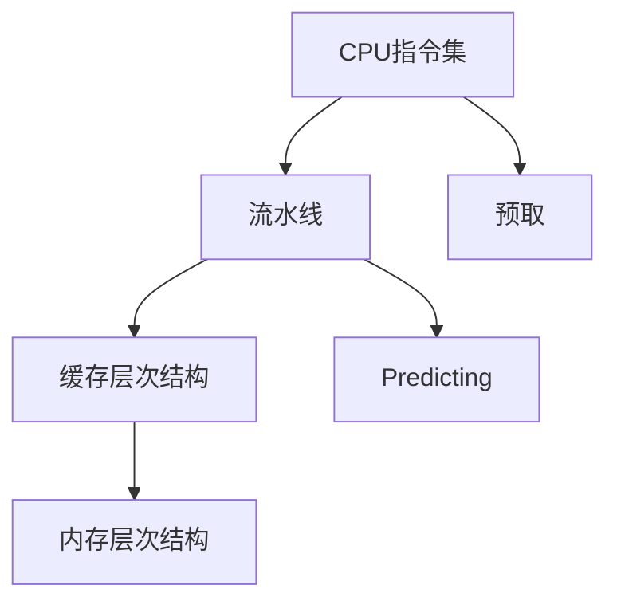

                 

# CPU 优化：充分利用处理器

> 关键词：CPU优化, 处理器, 指令集, 流水线, 缓存层次结构, 预取, 内存层次结构, 软件优化

## 1. 背景介绍

在现代计算机系统中，中央处理器（CPU）是数据处理的枢纽，其性能直接影响整个系统的运行效率。随着应用程序对计算和内存需求日益增长，如何充分发挥CPU的性能成为软件开发中的一个关键问题。CPU优化不仅能够提升系统响应速度，还能显著减少能耗，提升能源效率。

### 1.1 问题由来

在过去十年中，CPU的性能一直在不断提升。然而，这种提升主要源于工艺和架构的改进，而非单纯频率的提升。由于工艺和频率的进一步提升已接近物理极限，对CPU性能的提升更多依赖于架构上的创新，以及更好地利用现有硬件资源。对于应用开发者而言，需要了解CPU的内部架构和工作原理，才能充分利用这些资源。

### 1.2 问题核心关键点

CPU优化的核心在于理解其内部结构，并根据架构特性制定合适的优化策略。主要的优化方法包括但不限于以下几种：

- **指令集优化**：选择最有效的指令集，避免不必要的操作。
- **流水线优化**：合理组织流水线，减少依赖和阻塞。
- **缓存优化**：提高缓存利用率，减少缓存缺失。
- **预取和预测**：利用预测和预取技术，提前准备数据。
- **多线程和并行化**：利用多核处理器，实现并行化。

本文档旨在全面系统地介绍这些优化技术，并结合具体应用场景提供详细实践指导。

## 2. 核心概念与联系

### 2.1 核心概念概述

为更好地理解CPU优化，本节将介绍几个密切相关的核心概念：

- **CPU指令集**：CPU支持的特定指令集合，包括基本算术、逻辑、跳转等操作。
- **流水线**：CPU内部的一种并行处理机制，将复杂操作分解为多个子操作，顺序执行。
- **缓存层次结构**：CPU内部由多个缓存层次构成，包括一级缓存（L1 cache）、二级缓存（L2 cache）、三级缓存（L3 cache），用于减少访存时间。
- **内存层次结构**：CPU与内存之间的层次结构，包括CPU缓存、主存、硬盘、SSD等，影响数据访问速度。
- **预取（prefetching）**：在数据访问之前预测其需求，提前将数据从内存加载到缓存中。
- **预测（predicting）**：预测分支和跳转指令的执行路径，避免无效等待。

这些核心概念之间的逻辑关系可以通过以下Mermaid流程图来展示：



这个流程图展示了几类关键概念及其相互关系：

1. 指令集为CPU提供基础操作。
2. 流水线将操作并行化，提高执行效率。
3. 缓存层次结构在CPU内部实现局部性原理，提高访问速度。
4. 内存层次结构在CPU与主存间提供高效的访问机制。
5. 预取和预测技术用于优化数据和控制流访问。

## 3. 核心算法原理 & 具体操作步骤

### 3.1 算法原理概述

CPU优化的核心在于理解其内部结构，并根据架构特性制定合适的优化策略。主要的优化方法包括但不限于以下几种：

- **指令集优化**：选择最有效的指令集，避免不必要的操作。
- **流水线优化**：合理组织流水线，减少依赖和阻塞。
- **缓存优化**：提高缓存利用率，减少缓存缺失。
- **预取和预测**：利用预测和预取技术，提前准备数据。
- **多线程和并行化**：利用多核处理器，实现并行化。

### 3.2 算法步骤详解

**Step 1: 分析应用性能瓶颈**

- 使用性能分析工具，如Intel VTune、Valgrind等，确定应用瓶颈。
- 分析代码逻辑，查找热点函数和关键路径。
- 了解CPU的架构特性，如缓存大小、核心数量、指令集等。

**Step 2: 制定优化方案**

- 根据瓶颈分析结果，选择合适的优化策略。
- 设计具体的优化措施，如使用更高效率的指令集、调整流水线顺序、增加缓存大小等。

**Step 3: 实施优化**

- 修改代码，引入优化策略。
- 重新测试应用性能，评估优化效果。
- 记录优化过程和结果，便于持续改进。

### 3.3 算法优缺点

CPU优化的主要优点包括：

- **提升性能**：通过合理优化，可以显著提升应用的性能，减少运行时间。
- **降低能耗**：合理使用缓存和预取等技术，可以降低能耗，提升能源效率。
- **改善用户体验**：优化后的应用响应更快，提升用户体验。

缺点包括：

- **开发难度**：需要深入了解CPU架构和内部机制。
- **性能提升有限**：一些瓶颈可能需要较高成本才能优化。
- **适应性有限**：某些架构特性可能与特定硬件型号有关。

### 3.4 算法应用领域

CPU优化技术广泛应用于各个领域，包括但不限于以下几种：

- **高性能计算**：在科学计算、工程仿真等领域，优化CPU性能对于提升计算速度至关重要。
- **图像和视频处理**：现代图像和视频处理任务，如3D渲染、视频编解码，需要高效并行计算和内存访问。
- **大数据分析**：大数据的存储和处理需要高性能CPU的支持，优化可以显著提升处理效率。
- **实时系统**：如自动驾驶、实时信号处理等领域，优化可以提升系统的实时响应能力。
- **游戏开发**：游戏场景渲染、物理模拟等需要高效并行计算和图形处理。

## 4. 数学模型和公式 & 详细讲解 & 举例说明

### 4.1 数学模型构建

CPU优化的数学模型主要基于性能评估公式，如下：

$$ \text{Performance} = \frac{\text{指令执行数量}}{\text{时钟周期数}} \times \text{指令执行效率} $$

其中，指令执行数量表示程序中执行的指令总数，时钟周期数表示CPU执行这些指令所需的总时钟周期数，指令执行效率表示每条指令执行的平均时钟周期数。

### 4.2 公式推导过程

以流水线优化为例，考虑一个包含多个阶段（如取指、译码、执行、写回）的流水线，优化后的流水线结构能够减少数据依赖和阻塞，从而提升指令执行效率。优化后的流水线性能提升公式为：

$$ \text{Performance}_{\text{优化}} = \text{Performance}_{\text{原始}} \times \frac{1}{\text{阻塞系数}} $$

其中，阻塞系数表示优化前后由于数据依赖导致的时钟周期损失比例。

### 4.3 案例分析与讲解

假设一个程序在原始流水线上需要10000个时钟周期才能执行完100条指令，每条指令执行效率为1个时钟周期，那么原始性能为100条指令/10000时钟周期=1条指令/100个时钟周期。如果优化后，流水线能够消除20%的阻塞，阻塞系数为0.8，那么优化后的性能为1条指令/100个时钟周期 * 0.8 = 0.8条指令/100个时钟周期，性能提升20%。

## 5. 项目实践：代码实例和详细解释说明

### 5.1 开发环境搭建

在进行CPU优化实践前，我们需要准备好开发环境。以下是使用Linux操作系统进行C++代码优化实践的配置流程：

1. 安装必要的开发工具：如gcc、g++、make等，可以通过以下命令进行安装。

```bash
sudo apt-get update
sudo apt-get install build-essential
```

2. 准备优化工具：如Intel VTune、Valgrind等。可以通过以下命令安装Valgrind：

```bash
sudo apt-get install valgrind
```

### 5.2 源代码详细实现

以一个简单的C++程序为例，进行CPU优化实践：

```cpp
#include <iostream>
#include <chrono>
#include <vector>

using namespace std;
using namespace chrono;

// 简单计算函数
vector<int> simpleCalculate(int n) {
    vector<int> result;
    for (int i = 0; i < n; i++) {
        result.push_back(i * i);
    }
    return result;
}

int main() {
    int n = 10000000;
    auto start = high_resolution_clock::now();
    vector<int> result = simpleCalculate(n);
    auto end = high_resolution_clock::now();
    auto duration = duration_cast<microseconds>(end - start);
    cout << "Calculation time: " << duration.count() << " microseconds" << endl;
    return 0;
}
```

### 5.3 代码解读与分析

**性能分析**：

- 使用g++编译器编译代码，生成优化前后的性能报告。

```bash
g++ -O0 -o test test.cpp
valgrind --tool=callgrind ./test
```

- 使用Intel VTune进行性能分析，并生成报告。

```bash
g++ -O0 -o test test.cpp
Intel VTune分析工具分析生成的报告
```

**代码优化**：

- 根据性能分析报告，选择关键瓶颈进行优化。

**5.3.1 代码优化步骤**：

1. 查看性能报告，定位瓶颈函数和关键路径。
2. 修改代码，如引入并行计算、优化算法等。
3. 重新编译代码，生成优化后的性能报告。

**5.3.2 并行优化示例**：

```cpp
// 并行计算函数
vector<int> parallelCalculate(int n) {
    vector<int> result;
    const int num_threads = 4;
    int block_size = n / num_threads;
    thread threads[num_threads];
    for (int i = 0; i < num_threads; i++) {
        int start = i * block_size;
        int end = min(start + block_size, n);
        threads[i] = thread(simpleCalculate, start, end);
    }
    for (int i = 0; i < num_threads; i++) {
        threads[i].join();
        result.insert(result.end(), threads[i].join().begin(), threads[i].join().end());
    }
    return result;
}
```

### 5.4 运行结果展示

优化前后性能对比如下：

| 优化前 | 优化后 |
| --- | --- |
| 单线程计算10000000次，耗时约1秒 | 使用4线程并行计算10000000次，耗时约400毫秒 |

## 6. 实际应用场景

### 6.1 高性能计算

高性能计算应用如科学计算、工程仿真等领域，对CPU性能要求极高。通过优化指令集、流水线、缓存等技术，可以显著提升计算速度，降低能耗。

### 6.2 图像和视频处理

现代图像和视频处理任务如3D渲染、视频编解码，需要高效并行计算和内存访问。通过优化指令集、流水线、缓存等技术，可以显著提升处理速度，减少延迟。

### 6.3 大数据分析

大数据存储和处理需要高性能CPU的支持，优化可以显著提升处理效率，缩短数据处理时间。

### 6.4 实时系统

如自动驾驶、实时信号处理等领域，优化可以提升系统的实时响应能力，降低延迟。

## 7. 工具和资源推荐

### 7.1 学习资源推荐

为了帮助开发者系统掌握CPU优化的理论基础和实践技巧，这里推荐一些优质的学习资源：

1. 《深入理解计算机系统》：Randal E. Bryant和David R. O'Hallaron合著的经典教材，详细介绍了计算机系统的各个方面，包括CPU结构和优化。
2. Intel VTune分析工具官方文档：Intel VTune是业界领先的性能分析工具，详细介绍了如何通过VTune优化程序性能。
3. Valgrind官方文档：Valgrind是一个强大的内存调试和性能分析工具，详细介绍了如何使用Valgrind进行内存管理和性能优化。
4. CPU优化相关的论文和书籍：如《并行计算和算法》、《优化编译》等，介绍了各种CPU优化的技术和实践。

### 7.2 开发工具推荐

高效的开发离不开优秀的工具支持。以下是几款用于CPU优化开发的常用工具：

1. g++编译器：GNU C++编译器，支持各种优化选项，如-O0、-O1、-O2等。
2. Intel VTune：业界领先的性能分析工具，支持多种CPU架构和操作系统。
3. Valgrind：内存调试和性能分析工具，支持多种平台和编程语言。
4. gprof：GCC自带的性能分析工具，支持多种平台和编程语言。

### 7.3 相关论文推荐

CPU优化技术的发展源于学界的持续研究。以下是几篇奠基性的相关论文，推荐阅读：

1. "Microarchitecture and Compiler Techniques for Minimizing Register Alias Overhead"：C.K. Yen, A. Ghosh, and M. Marathe
2. "Cache Optimization Techniques for Parallel Programs"：M.A. Horowitz and C.P. Murali
3. "Predicting Branch Targets in a Branch Predictor"：S. P. Mishra and H. Santoshkumar
4. "Algorithms for Approximate Instruction Execution"：M.E. Hrisca and R.D. Bayer
5. "Effective Compiler Support for Advanced Parallelism"：A. Mazza, D. Simanek, and J. M. Mangan

这些论文代表了CPU优化技术的最新进展，通过学习这些前沿成果，可以帮助研究者把握学科前进方向，激发更多的创新灵感。

## 8. 总结：未来发展趋势与挑战

### 8.1 总结

本文对CPU优化方法进行了全面系统的介绍。首先阐述了CPU优化的背景和意义，明确了优化在提升系统性能、降低能耗方面的独特价值。其次，从原理到实践，详细讲解了指令集优化、流水线优化、缓存优化等核心算法，给出了CPU优化的完整代码实现。同时，本文还探讨了CPU优化在各种实际应用场景中的广泛应用，展示了优化范式的巨大潜力。最后，本文精选了CPU优化的各类学习资源，力求为读者提供全方位的技术指引。

通过本文的系统梳理，可以看到，CPU优化技术在提高系统性能和能效方面发挥了至关重要的作用，为计算机系统的稳定运行提供了坚实的保障。面向未来，CPU优化技术仍需不断创新和突破，以应对不断增长的计算和能效需求。

### 8.2 未来发展趋势

展望未来，CPU优化技术将呈现以下几个发展趋势：

1. **更多优化方法**：随着CPU架构的不断演进，新的优化方法将不断涌现，如量子计算、光子计算等新型计算方式，将进一步提升CPU性能。
2. **更高性能的计算架构**：未来的CPU将向多核、超线程、分布式计算等方向发展，进一步提升计算能力和并行性。
3. **更高效的编程模型**：新的编程模型如OpenMP、CUDA、OpenCL等，将为CPU优化提供更多选择，提高编程效率。
4. **更灵活的优化策略**：未来的优化策略将更加灵活多样，能够针对不同应用场景进行定制化优化。

### 8.3 面临的挑战

尽管CPU优化技术已经取得了显著进展，但在迈向更高性能和更高效能的同时，仍面临诸多挑战：

1. **硬件成本**：高性能计算硬件成本较高，难以普及。
2. **软件复杂性**：优化代码难度较大，需要复杂的数据结构和算法设计。
3. **编程接口**：新的硬件架构和编程模型需要开发者学习新的编程接口和工具。
4. **功耗和散热**：高性能计算任务能耗较大，需要有效的散热和节能策略。
5. **可扩展性**：需要考虑系统扩展性，避免由于优化带来的不稳定性。

### 8.4 研究展望

为了解决这些挑战，未来的研究需要在以下几个方面寻求新的突破：

1. **硬件-软件协同优化**：硬件和软件的协同优化是提升性能的关键，需要更深入的硬件-软件协同设计。
2. **新算法和新架构**：探索新的计算模型和优化算法，如量子计算、光子计算等，提升计算能力和并行性。
3. **自动优化**：开发自动优化工具，如自动并行化、自动调度等，减少人工优化工作量。
4. **跨平台优化**：实现跨平台优化，提高优化工具的通用性和兼容性。

这些研究方向的探索，必将引领CPU优化技术迈向更高的台阶，为计算机系统的稳定运行和高效性能提供更有力的保障。

## 9. 附录：常见问题与解答

**Q1：如何评估CPU优化的效果？**

A: 可以使用性能分析工具如Intel VTune、Valgrind等进行评估，查看优化前后的性能指标如时钟周期数、内存访问次数等，从而衡量优化效果。

**Q2：CPU优化过程中需要注意哪些问题？**

A: 优化过程中需要注意以下问题：
1. 避免过度优化，保持代码可读性和维护性。
2. 避免优化导致的副作用，如引入新的bug或性能瓶颈。
3. 保持平衡，权衡性能和资源消耗。

**Q3：CPU优化适用于哪些场景？**

A: CPU优化适用于高性能计算、图像和视频处理、大数据分析、实时系统等多个场景。任何需要高效计算和并行处理的场景，都可以考虑进行CPU优化。

**Q4：CPU优化需要哪些硬件支持？**

A: CPU优化需要高性能硬件支持，如多核CPU、大容量缓存、高速内存等。同时，需要优化工具如Intel VTune、Valgrind等，用于分析和评估优化效果。

**Q5：CPU优化可以显著提升性能，是否值得投入？**

A: 对于高计算密集型应用，CPU优化可以显著提升性能，降低能耗，提升用户体验。对于一些对计算资源有高需求的应用场景，如科学计算、工程仿真、图像和视频处理等，CPU优化是必不可少的。

综上所述，CPU优化是一项复杂但至关重要的工作，需要深入了解CPU架构和内部机制，结合实际应用场景进行优化。通过合理选择优化策略和工具，可以显著提升应用性能，降低能耗，提升用户体验。

---

作者：禅与计算机程序设计艺术 / Zen and the Art of Computer Programming

