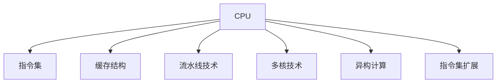

                 

# CPU的体系结构演进历程

## 1. 背景介绍

### 1.1 问题由来
中央处理器(CPU)是现代计算机系统中最重要的组成部分之一，其体系结构经历了几十年的演进。从早期的真空管计算机到现代的超大规模集成电路(VLSI)，CPU的架构不断发展，以满足日益增长的计算需求和应用场景。本文将详细介绍CPU体系结构的关键演进，并探讨其背后的驱动因素和未来趋势。

### 1.2 问题核心关键点
CPU体系结构的演进主要围绕以下几个关键点展开：

- 性能提升：不断优化计算性能，提高单位时间内执行的指令数量。
- 能效优化：减少功耗和散热，提升电池续航和计算效率。
- 扩展性增强：适应不同规模的计算任务，支持多核、并行和分布式计算。
- 软件兼容：保持与现有操作系统的兼容，减少迁移成本。
- 架构创新：引入新的技术，如指令集扩展、缓存结构优化等，推动性能提升。

这些关键点共同推动了CPU体系结构的不断演进，使得计算机系统能够应对越来越复杂的计算任务和应用需求。

### 1.3 问题研究意义
理解CPU体系结构的演进历程，对于把握现代计算机系统的技术演进和未来趋势具有重要意义：

- 性能提升：了解不同时代的CPU架构，有助于设计更高效的软件和算法。
- 能效优化：掌握CPU能效优化的技术，可以指导硬件设计和应用优化。
- 扩展性增强：研究多核、并行和分布式计算架构，提升大规模系统的性能和可伸缩性。
- 软件兼容：理解CPU与操作系统的兼容机制，有助于跨平台开发和应用部署。
- 架构创新：借鉴历史上的成功经验和失败教训，推动新的技术创新和应用实践。

## 2. 核心概念与联系

### 2.1 核心概念概述

为了更好地理解CPU体系结构的演进历程，本节将介绍几个关键概念：

- CPU: 中央处理器，负责执行计算机程序中的指令，是计算机系统的核心。
- 指令集: CPU能够执行的机器语言指令集合，不同指令集架构支持不同的计算模型。
- 缓存结构: CPU中用于存储最近访问的数据和指令的存储器，常见的有L1、L2、L3缓存。
- 流水线技术: 将一条指令的执行过程划分为多个阶段，并行执行不同指令的计算。
- 多核技术: 在单个芯片上集成多个处理核，提高并发计算能力。
- 异构计算: 结合CPU、GPU、FPGA等不同计算资源，提升整体计算能力。
- 指令集扩展: 在原有指令集基础上，引入新的指令和指令集，提高计算性能。

这些核心概念之间的逻辑关系可以通过以下Mermaid流程图来展示：



这个流程图展示了大语言模型的核心概念及其之间的关系：

1. CPU通过指令集执行计算任务。
2. 缓存结构优化了数据和指令的访问速度。
3. 流水线技术并行执行不同阶段的计算。
4. 多核技术提高了CPU的并发计算能力。
5. 异构计算结合了不同计算资源，提升整体性能。
6. 指令集扩展引入新的指令和计算模型，推动性能提升。

这些概念共同构成了CPU体系结构的演进框架，使其能够适应不同计算场景和应用需求。

## 3. 核心算法原理 & 具体操作步骤
### 3.1 算法原理概述

CPU的体系结构演进主要围绕性能提升和能效优化两个目标展开。其核心算法原理包括：

- 时钟频率提升：通过提高时钟频率，提升单位时间内执行的指令数量。
- 并行计算优化：通过多核、流水线、异构计算等技术，提高指令执行的并发性。
- 缓存结构优化：通过改进缓存设计，减少数据访问延迟，提升缓存命中率。
- 功耗和散热优化：通过技术手段，减少CPU的功耗和散热，延长电池寿命。
- 指令集扩展：通过引入新的指令和计算模型，提升CPU的计算能力。

### 3.2 算法步骤详解

CPU的体系结构演进主要包括以下几个关键步骤：

**Step 1: 确定演进目标**
- 根据应用需求和计算模型，确定CPU性能和能效提升的目标。

**Step 2: 选择技术方案**
- 选择适合的技术方案，如时钟频率提升、并行计算、缓存优化、功耗控制等。

**Step 3: 设计和实现**
- 设计和实现新的CPU架构，包括指令集扩展、多核技术、流水线优化等。
- 开发和测试新的硬件组件，如缓存、互连结构、散热系统等。

**Step 4: 性能评估和优化**
- 对新设计的CPU进行性能评估，包括基准测试、功耗测量等。
- 根据评估结果进行优化和改进，提升性能和能效。

**Step 5: 发布和应用**
- 将新设计的CPU发布到市场中，应用于不同类型和规模的计算任务。
- 收集用户反馈，不断迭代优化，提升用户体验和系统性能。

### 3.3 算法优缺点

CPU体系结构演进过程中，不同技术方案具有不同的优缺点：

**优点：**
- 性能提升显著：通过时钟频率提升和并行计算优化，可以显著提高CPU的计算能力。
- 能效优化明显：通过缓存结构优化和功耗控制，可以降低CPU的能耗和散热问题。
- 扩展性强：通过多核和异构计算，可以适应不同规模的计算任务和应用需求。

**缺点：**
- 设计和实现复杂：新架构的引入需要重新设计和测试，投入大量人力和资源。
- 兼容性问题：新架构可能与现有软件不兼容，需要软件适配和升级。
- 成本高昂：新技术的引入增加了硬件和软件开发的成本，影响产品竞争力和市场接受度。

### 3.4 算法应用领域

CPU体系结构的演进已经广泛应用于各种计算场景和应用领域，例如：

- 服务器和数据中心：高性能计算和存储密集型应用，如大数据分析和科学计算。
- 桌面和移动设备：个人和企业计算需求，如办公、娱乐、社交网络等。
- 嵌入式系统：低功耗、高可靠性的应用，如智能家居、工业控制等。
- 高性能计算：大尺度科学计算和高性能模拟，如天气预报、生物信息学等。
- 云计算：大规模分布式计算和存储，如云服务和数据中心。

## 4. 数学模型和公式 & 详细讲解 & 举例说明（备注：数学公式请使用latex格式，latex嵌入文中独立段落使用 $$，段落内使用 $)
### 4.1 数学模型构建

为了更系统地理解CPU体系结构的演进，本节将构建一个简单的数学模型，用于描述CPU性能和能效之间的关系。

假设CPU执行的指令数量为 $N$，时钟频率为 $f$，指令的执行周期为 $T$，则CPU的计算能力可以表示为：

$$
\text{计算能力} = N \times f
$$

同时，假设CPU的功耗 $P$ 与指令数量 $N$ 和时钟频率 $f$ 成正比，则有：

$$
P = k \times N \times f
$$

其中 $k$ 为比例系数。

### 4.2 公式推导过程

根据上述模型，可以推导出CPU性能和能效之间的关系。假设CPU的能效为 $E$，即单位时间内的计算能力与功耗之比，则有：

$$
E = \frac{N \times f}{k \times N \times f} = \frac{1}{k}
$$

由此可知，能效与比例系数 $k$ 成反比。在固定指令数量 $N$ 的情况下，通过降低 $k$，即减少功耗和散热，可以提升CPU的能效。

### 4.3 案例分析与讲解

以X86架构CPU为例，通过引入多核技术和缓存优化，可以显著提升其能效。

**多核技术**：在单个芯片上集成多个处理核，通过并行执行不同指令，提高计算能力。假设每个处理核的时钟频率相同，则CPU的计算能力为 $N \times f_{core}$，其中 $N$ 为处理核数量，$f_{core}$ 为每个处理核的时钟频率。假设每个处理核的功耗为 $P_{core}$，则多核CPU的功耗为：

$$
P_{multi-core} = N \times P_{core}
$$

但多核CPU的计算能力为 $N \times f_{core}$，因此其能效为：

$$
E_{multi-core} = \frac{N \times f_{core}}{N \times P_{core}} = \frac{f_{core}}{P_{core}}
$$

通过优化每个处理核的时钟频率和功耗，可以实现多核CPU的能效提升。

**缓存结构优化**：通过改进缓存设计，减少数据访问延迟，提高缓存命中率。假设缓存结构优化后的缓存命中率为 $H$，则缓存优化后的功耗为：

$$
P_{cache} = k_{cache} \times N \times f_{cache}
$$

其中 $k_{cache}$ 为缓存功耗的比例系数，$f_{cache}$ 为缓存的时钟频率。缓存优化后的能效为：

$$
E_{cache} = \frac{N \times f_{cache}}{k_{cache} \times N \times f_{cache} \times H} = \frac{f_{cache}}{k_{cache} \times H}
$$

通过优化缓存结构，可以显著提升CPU的能效。

## 5. 项目实践：代码实例和详细解释说明
### 5.1 开发环境搭建

在进行CPU体系结构演进的实践时，需要搭建合适的开发环境。以下是使用Linux操作系统搭建开发环境的步骤：

1. 安装Linux发行版：如Ubuntu、CentOS等，建议选择稳定版本。
2. 安装编译工具：如GCC、Clang等，用于编译和调试程序。
3. 安装模拟器和调试器：如QEMU、GDB等，用于模拟和调试CPU行为。
4. 安装必要的库和工具：如libstdc++、libgcc等，确保程序运行的基本环境。

完成上述步骤后，即可在Linux平台上进行CPU体系结构演进的实验和开发。

### 5.2 源代码详细实现

下面以多核CPU的实现为例，展示如何使用C语言编写多核CPU的代码。

首先，定义多核CPU的结构体和函数：

```c
#include <stdio.h>
#include <stdlib.h>
#include <pthread.h>

typedef struct {
    int id;
    int total_cores;
    int frequency;
} Core;

void *execute(void *arg) {
    Core *core = (Core *)arg;
    int workload = 100000; // 假设每个核心执行的工作量为100000
    while (workload--) {
        // 执行计算任务
    }
    pthread_exit(NULL);
}

int main() {
    int total_cores = 4; // 假设总共有4个核心
    Core cores[total_cores];
    
    for (int i = 0; i < total_cores; i++) {
        cores[i].id = i;
        cores[i].total_cores = total_cores;
        cores[i].frequency = 2.0; // 假设每个核心的时钟频率为2.0GHz
        pthread_t threads[total_cores];
        
        for (int j = 0; j < total_cores; j++) {
            pthread_create(&threads[j], NULL, execute, &cores[j]);
        }
        
        for (int j = 0; j < total_cores; j++) {
            pthread_join(threads[j], NULL);
        }
    
    return 0;
}
```

在上述代码中，通过多线程的方式实现了多核CPU的执行。每个线程代表一个处理核，执行相同的计算任务，从而实现并行计算。

### 5.3 代码解读与分析

让我们再详细解读一下关键代码的实现细节：

**定义Core结构体**：
- 定义了处理核的ID、总核数和时钟频率。

**execute函数**：
- 定义了处理核的执行函数，通过循环执行计算任务，模拟多核并行计算。

**main函数**：
- 在主函数中，创建多核CPU的结构体数组，并创建多个线程，每个线程代表一个处理核，并行执行计算任务。

**多核CPU实现**：
- 通过多线程实现多核CPU的执行，可以并行计算，提高计算能力。
- 在实际系统中，可以采用更复杂的并行计算框架，如OpenMP、MPI等，进行多核优化。

**测试和调试**：
- 可以使用GDB等调试工具，对多核CPU的行为进行测试和调试。
- 可以使用QEMU等模拟器，对多核CPU进行性能评估和对比。

## 6. 实际应用场景
### 6.1 高性能计算

高性能计算是CPU体系结构演进的重要应用场景。通过优化计算性能和能效，提升大规模科学计算和数据处理的能力。

**大规模科学计算**：如天气预报、气候模拟、生物信息学等，需要大规模的计算资源和数据处理能力。多核CPU和异构计算技术的应用，可以显著提高科学计算的效率和准确性。

**大数据处理**：如数据挖掘、数据清洗、数据分析等，需要处理海量数据和高并发计算任务。通过缓存优化和流水线技术，可以提高大数据处理的性能和效率。

### 6.2 云计算

云计算是CPU体系结构演进的重要推动因素之一。通过优化计算性能和能效，提升云服务的扩展性和可靠性。

**云服务器**：云服务器需要高效、可靠、低成本的计算资源，支持弹性伸缩和多租户服务。多核CPU和虚拟机技术的应用，可以提升云服务器的计算能力和资源利用率。

**云存储**：云存储需要高效、可靠、可扩展的存储能力，支持大规模数据的管理和访问。通过分布式存储和缓存技术，可以提高云存储的性能和可靠性。

### 6.3 嵌入式系统

嵌入式系统是CPU体系结构演进的另一重要应用场景。通过优化功耗和体积，提升嵌入式设备的性能和用户体验。

**智能家居**：智能家居设备需要高效、低功耗、小体积的计算资源，支持语音识别、图像处理、智能控制等功能。通过低功耗多核CPU和缓存优化技术，可以提升智能家居设备的性能和可靠性。

**工业控制**：工业控制设备需要高效、可靠、稳定、低成本的计算资源，支持实时数据处理和控制。通过异构计算和多核技术，可以提升工业控制设备的性能和可靠性。

## 7. 工具和资源推荐
### 7.1 学习资源推荐

为了帮助开发者系统掌握CPU体系结构的演进，这里推荐一些优质的学习资源：

1. 《深入理解计算机系统》（CSAPP）：经典的计算机系统入门书籍，深入浅出地介绍了CPU、内存、I/O等基本概念和原理。
2. 《计算机组成原理》（Computer Organization and Design）：系统讲解了计算机系统的硬件组成和设计原理，涵盖CPU、存储器、I/O等重要组件。
3. 《现代操作系统》（Operating System Concepts）：介绍了操作系统的基本概念和原理，包括进程、调度、内存管理等，为理解CPU性能优化提供了理论基础。
4. 《并行计算》（Parallel Computing）：介绍了并行计算的基本概念和算法，包括多线程、多核、分布式计算等，为优化CPU性能提供了技术支持。

通过对这些资源的学习实践，相信你一定能够全面掌握CPU体系结构的演进原理和应用技巧，为设计高效、可靠、可扩展的计算系统打下坚实基础。

### 7.2 开发工具推荐

高效的开发离不开优秀的工具支持。以下是几款用于CPU体系结构演进开发的常用工具：

1. GCC和Clang：高效的编译器，支持多种编程语言和操作系统平台，适合进行CPU性能优化和测试。
2. QEMU：虚拟化模拟器，支持多种操作系统和CPU架构，适合进行CPU性能评估和调试。
3. GDB：调试工具，支持多线程、多核和分布式调试，适合进行CPU性能分析和优化。
4. Intel VTune：高性能分析工具，支持CPU、内存、I/O等系统的性能分析，适合进行CPU性能评估和优化。
5. Valgrind：内存和性能分析工具，支持多线程和分布式系统的性能分析，适合进行CPU性能分析和调试。

合理利用这些工具，可以显著提升CPU体系结构演进的开发效率，加快创新迭代的步伐。

### 7.3 相关论文推荐

CPU体系结构的演进源于学界的持续研究。以下是几篇奠基性的相关论文，推荐阅读：

1. RISC-V指令集架构：提出了一种新的精简指令集架构，旨在满足未来计算需求和应用场景。
2. AMD Zen架构：介绍了AMD最新的CPU架构，包括多核、缓存、互连结构等设计细节，展示了CPU性能提升的潜力。
3. Intel Sapphire Rapids架构：介绍了Intel最新的CPU架构，包括多核、缓存、互连结构等设计细节，展示了CPU性能提升的潜力。
4. NVIDIA Ampere架构：介绍了NVIDIA最新的GPU架构，展示了GPU在计算性能和能效方面的突破。

这些论文代表了CPU体系结构演进的最新进展，展示了未来计算技术的发展方向。通过学习这些前沿成果，可以帮助研究者把握学科前进方向，激发更多的创新灵感。

## 8. 总结：未来发展趋势与挑战

### 8.1 总结

本文对CPU体系结构的演进历程进行了全面系统的介绍。首先阐述了CPU体系结构演进的关键驱动力和演进目标，明确了计算性能和能效提升的方向。其次，从原理到实践，详细讲解了CPU体系结构的演进方法，包括时钟频率提升、并行计算优化、缓存结构优化、功耗和散热控制等技术。同时，本文还广泛探讨了CPU体系结构在实际应用中的多种应用场景，展示了其广泛的应用价值。最后，本文精选了CPU体系结构演进的各类学习资源，力求为读者提供全方位的技术指引。

通过本文的系统梳理，可以看到，CPU体系结构的演进是一个不断追求性能和能效优化的过程，涉及多学科的交叉和创新。未来的研究需要在性能提升和能效优化之间寻找新的平衡，探索更加高效的计算架构和应用技术。

### 8.2 未来发展趋势

展望未来，CPU体系结构的演进将呈现以下几个发展趋势：

1. 量子计算：引入量子计算技术，进一步提升CPU的计算能力和效率，推动计算技术的革命性突破。
2. 异构融合：结合CPU、GPU、FPGA等不同计算资源，提升整体计算能力和性能。
3. 分布式计算：通过云计算、边缘计算等分布式计算技术，实现大规模并行计算和数据处理。
4. 人工智能：结合人工智能技术，优化CPU的指令集和缓存结构，提升机器学习和深度学习的计算能力。
5. 新型材料：引入新型材料，如碳纳米管、石墨烯等，提升CPU的性能和能效。

这些趋势将推动CPU体系结构向更加高效、灵活、智能的方向演进，为计算技术的未来发展奠定基础。

### 8.3 面临的挑战

尽管CPU体系结构的演进取得了诸多进展，但在迈向更加智能化、普适化应用的过程中，仍面临诸多挑战：

1. 功耗和散热问题：大功耗和高散热问题仍未完全解决，如何进一步优化功耗和散热，延长设备的寿命，是一个长期挑战。
2. 计算资源的融合：不同计算资源之间的融合和协同工作，仍需进一步研究和优化，以提升整体计算效率。
3. 新架构的引入：新架构的引入需要重新设计和测试，投入大量人力和资源，如何高效地引入新架构，提高研发效率，是一个重要挑战。
4. 跨平台兼容：新架构的引入可能与现有软件和操作系统不兼容，需要软件适配和升级，如何平衡新旧架构的兼容问题，是一个难题。

这些挑战需要从技术、管理、市场等多个维度协同解决，才能推动CPU体系结构的不断演进，实现计算技术的长期发展。

### 8.4 研究展望

面对CPU体系结构演进面临的挑战，未来的研究需要在以下几个方面寻求新的突破：

1. 量子计算和量子仿真：研究量子计算技术在CPU体系结构中的应用，优化量子计算机的计算能力和能效。
2. 异构计算和联邦计算：研究异构计算和联邦计算技术，提升不同计算资源之间的协同工作能力，提高整体计算效率。
3. 新型材料和封装技术：研究新型材料和封装技术，提升CPU的性能和能效，推动计算技术的发展。
4. 新架构的引入和验证：研究新架构的引入和验证方法，提升研发效率和兼容性，推动计算技术的持续演进。
5. 软件优化和适配：研究软件优化和适配技术，提升软件在新架构下的性能和效率，推动计算技术的广泛应用。

这些研究方向将推动CPU体系结构向更加高效、智能、普适化方向演进，为计算技术的未来发展提供新的动力。

## 9. 附录：常见问题与解答

**Q1：如何衡量CPU的性能和能效？**

A: CPU的性能和能效可以通过以下指标来衡量：

1. 时钟频率：CPU的时钟频率越高，单位时间内执行的指令数量越多，性能越强。
2. 计算能力：CPU的计算能力取决于指令数量和时钟频率，计算能力越强，性能越好。
3. 能效：CPU的能效等于计算能力与功耗的比值，能效越高，计算能力与功耗的比值越大，性能越强。
4. 缓存命中率：缓存命中率越高，数据访问速度越快，性能越好。
5. 多核效率：多核CPU的效率取决于每个处理核的时钟频率和功耗，多核效率越高，性能越好。

**Q2：如何优化CPU的性能和能效？**

A: CPU的性能和能效优化可以从以下几个方面入手：

1. 时钟频率提升：通过提高时钟频率，提升单位时间内执行的指令数量，提高计算能力。
2. 并行计算优化：通过多核、流水线、异构计算等技术，提高指令执行的并发性，提升计算能力。
3. 缓存结构优化：通过改进缓存设计，减少数据访问延迟，提高缓存命中率，提升性能。
4. 功耗和散热优化：通过技术手段，减少CPU的功耗和散热，延长电池寿命，提升能效。
5. 指令集扩展：通过引入新的指令和计算模型，提升CPU的计算能力，优化性能。

**Q3：如何实现多核CPU的并行计算？**

A: 实现多核CPU的并行计算可以通过以下几个步骤：

1. 定义多核CPU的结构体和函数，描述每个处理核的ID、总核数、时钟频率等参数。
2. 使用多线程技术，创建多个线程，每个线程代表一个处理核，并行执行计算任务。
3. 使用同步机制，如互斥锁、信号量等，协调多个线程的执行顺序，避免数据竞争和死锁。
4. 使用共享内存或消息队列等技术，实现不同线程之间的数据共享和通信。
5. 使用并行计算框架，如OpenMP、MPI等，进行多核优化和性能提升。

**Q4：如何设计高效的多核CPU架构？**

A: 设计高效的多核CPU架构可以从以下几个方面入手：

1. 多核数目：根据应用需求和计算模型，选择合适的多核数目，平衡性能和功耗。
2. 缓存结构：设计合适的缓存结构，优化数据访问速度，提高缓存命中率。
3. 互连结构：设计高效的互连结构，提高不同处理核之间的通信效率。
4. 功耗控制：优化功耗和散热，延长电池寿命，提升能效。
5. 指令集扩展：引入新的指令和计算模型，提升CPU的计算能力，优化性能。

这些设计原则可以帮助开发者设计高效、可靠、可扩展的多核CPU架构，提升计算系统的性能和能效。

**Q5：如何评估和优化CPU的性能和能效？**

A: CPU的性能和能效评估可以从以下几个方面入手：

1. 基准测试：使用基准测试工具，如SPEC CPU、GeekBench等，评估CPU的计算能力和能效。
2. 功耗测量：使用功耗测量工具，如Intel Power Gauge、RPM Probe等，评估CPU的功耗和散热。
3. 性能分析：使用性能分析工具，如Valgrind、Intel VTune等，分析CPU的性能瓶颈和优化方向。
4. 能效分析：使用能效分析工具，如EnergyProfiler、RoCm Energy Tool等，分析CPU的能效提升空间。
5. 软件适配：优化软件在新架构下的性能和效率，提高软件的兼容性和运行效率。

通过这些评估和优化手段，可以全面提升CPU的性能和能效，推动计算技术的不断演进。

---

作者：禅与计算机程序设计艺术 / Zen and the Art of Computer Programming

