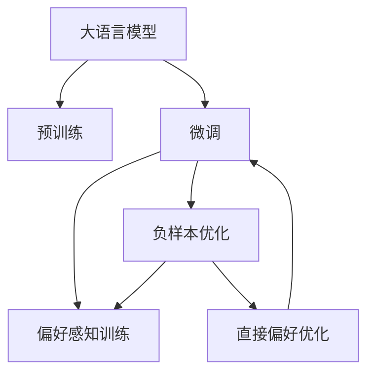

                 

# DPO：直接偏好优化在LLM微调中的应用

> 关键词：大语言模型,直接偏好优化,LLM微调,模型参数,偏好感知训练,负样本优化

## 1. 背景介绍

### 1.1 问题由来
近年来，深度学习技术在自然语言处理（NLP）领域取得了突破性进展，尤其是大语言模型（LLM）的涌现，极大地提升了NLP任务的性能。然而，LLM虽然在大型语料上表现出强大的泛化能力，但在特定任务或领域中的微调效果仍然有限。这主要是因为，LLM通过大规模无标签数据预训练得到的表示，包含了过多的通用信息，难以直接适应任务特定的需求。

为了解决这个问题，研究者们提出了多种改进方法，如微调、迁移学习、提示学习等。其中，微调方法通过在少量标注数据上训练模型，使其适应特定任务，是一种直接且高效的方式。然而，微调过程中往往会遇到模型过拟合、泛化能力差等问题。为了缓解这些问题，研究者们进一步探索了更高级的微调方法，如DPO（Direct Preference Optimization）。

### 1.2 问题核心关键点
DPO是一种基于直接偏好优化的微调方法，旨在通过优化模型参数，使其更好地适应任务特定的偏好。其核心思想是将任务的偏好信息直接引入到模型训练过程中，引导模型在训练过程中学习并遵循这些偏好，从而提高模型的泛化能力和性能。具体来说，DPO方法通过引入负样本（Negative Samples），调整模型的预测输出，使其更加符合任务特定的偏好，最终实现更优的微调效果。

## 2. 核心概念与联系

### 2.1 核心概念概述

为了更好地理解DPO方法，本节将介绍几个核心概念：

- 大语言模型（LLM）：以自回归（如GPT）或自编码（如BERT）模型为代表的大规模预训练语言模型。通过在大规模无标签文本语料上进行预训练，学习通用的语言知识，具备强大的语言理解和生成能力。

- 微调（Fine-Tuning）：指在预训练模型的基础上，使用下游任务的少量标注数据，通过有监督地训练优化模型在特定任务上的性能。通常只需要调整顶层分类器或解码器，并以较小的学习率更新全部或部分的模型参数。

- 直接偏好优化（DPO）：一种基于负样本优化的微调方法，通过调整模型的预测输出，使其更好地适应任务特定的偏好。

- 负样本（Negative Samples）：在微调过程中引入的与任务标签不匹配的样本，用于调整模型的预测输出，使其更加符合任务的偏好。

- 偏好感知训练（Preference-Aware Training）：在模型训练过程中，引入偏好信息，引导模型学习并遵循这些偏好，从而提高模型的泛化能力和性能。

- 模型参数（Model Parameters）：构成模型的权重和偏置，直接影响模型的预测输出。

这些核心概念之间的逻辑关系可以通过以下Mermaid流程图来展示：



这个流程图展示了大语言模型的核心概念及其之间的关系：

1. 大语言模型通过预训练获得基础能力。
2. 微调是对预训练模型进行任务特定的优化，可以分为负样本优化和偏好感知训练。
3. 直接偏好优化是负样本优化的具体实现，通过引入负样本，调整模型输出。
4. 偏好感知训练是引入偏好信息的泛化方法，提高模型泛化能力和性能。
5. 模型参数是构成模型的关键组件，通过优化这些参数，可以使模型更好地适应任务偏好。

这些概念共同构成了DPO方法的原理和框架，使得模型能够更好地适应任务特定的需求。

## 3. 核心算法原理 & 具体操作步骤
### 3.1 算法原理概述

DPO方法的核心在于通过引入负样本，调整模型的预测输出，使其更好地适应任务特定的偏好。其基本原理如下：

假设任务 $T$ 的标注数据集为 $D=\{(x_i, y_i)\}_{i=1}^N$，其中 $x_i$ 表示输入，$y_i$ 表示标签。模型的预测输出为 $\hat{y}=f(x;\theta)$，其中 $f$ 为模型函数，$\theta$ 为模型参数。DPO方法的目标是最大化模型在标注数据上的准确率，同时最大化模型在负样本上的误差率。

在微调过程中，DPO方法将负样本引入到模型训练中，通过调整模型的预测输出，使其对负样本的预测错误率最大化，从而迫使模型学习并遵循任务的偏好。具体而言，DPO方法在训练过程中，使用一个负样本集 $D_{neg}$，其中每个样本的标签 $y_{neg,i}$ 与标注数据集 $D$ 中的标签 $y_i$ 不匹配。DPO方法的目标是最大化模型对负样本的预测错误率，即最大化 $\sum_{i=1}^N\mathbb{I}(\hat{y}_i \neq y_{neg,i})$，其中 $\mathbb{I}$ 为示性函数。

### 3.2 算法步骤详解

DPO方法的具体实现步骤如下：

**Step 1: 准备数据集**

- 收集下游任务 $T$ 的标注数据集 $D=\{(x_i, y_i)\}_{i=1}^N$，其中 $x_i$ 为输入，$y_i$ 为标签。
- 使用负样本生成方法，生成一个负样本集 $D_{neg}$，其中每个样本的标签 $y_{neg,i}$ 与 $D$ 中的标签 $y_i$ 不匹配。

**Step 2: 定义模型和损失函数**

- 选择一个预训练的LLM模型 $M_{\theta}$，如BERT、GPT等。
- 在模型顶层添加一个任务特定的输出层和损失函数，如线性分类器或交叉熵损失函数。

**Step 3: 设置微调超参数**

- 选择合适的优化算法及其参数，如AdamW、SGD等，设置学习率、批大小、迭代轮数等。
- 设置正则化技术及强度，包括权重衰减、Dropout、Early Stopping等。
- 确定冻结预训练参数的策略，如仅微调顶层，或全部参数都参与微调。

**Step 4: 训练模型**

- 将训练集数据分批次输入模型，前向传播计算损失函数。
- 反向传播计算参数梯度，根据设定的优化算法和学习率更新模型参数。
- 在每个批次中加入负样本，调整模型的预测输出，使其对负样本的预测错误率最大化。
- 周期性在验证集上评估模型性能，根据性能指标决定是否触发 Early Stopping。
- 重复上述步骤直到满足预设的迭代轮数或 Early Stopping 条件。

**Step 5: 测试和部署**

- 在测试集上评估微调后模型 $M_{\hat{\theta}}$ 的性能，对比微调前后的精度提升。
- 使用微调后的模型对新样本进行推理预测，集成到实际的应用系统中。
- 持续收集新的数据，定期重新微调模型，以适应数据分布的变化。

以上是DPO方法的一般流程。在实际应用中，还需要针对具体任务的特点，对微调过程的各个环节进行优化设计，如改进训练目标函数，引入更多的负样本生成方法，搜索最优的超参数组合等，以进一步提升模型性能。

### 3.3 算法优缺点

DPO方法具有以下优点：
1. 简单易实现。引入负样本的方式简单，不需要额外训练数据集。
2. 效果显著。通过调整模型的预测输出，使得模型更加遵循任务偏好，性能提升明显。
3. 泛化能力强。负样本的引入使得模型能够更好地学习任务特定的知识，提高泛化能力。

同时，DPO方法也存在一些局限性：
1. 对负样本质量要求高。负样本的质量直接影响了模型的效果，需要精心设计和筛选。
2. 模型过拟合风险。过度关注负样本可能导致模型对训练集的过拟合。
3. 计算资源消耗大。引入负样本使得模型的计算量增加，对计算资源有较高要求。

尽管存在这些局限性，但DPO方法作为一种简单有效的微调手段，已在多个任务上取得了不错的效果，是一种值得进一步探索的微调方法。

### 3.4 算法应用领域

DPO方法已经在多个NLP任务中得到了应用，例如：

- 文本分类：如情感分析、主题分类、意图识别等。通过微调使模型学习文本-标签映射。
- 命名实体识别：识别文本中的人名、地名、机构名等特定实体。通过微调使模型掌握实体边界和类型。
- 关系抽取：从文本中抽取实体之间的语义关系。通过微调使模型学习实体-关系三元组。
- 问答系统：对自然语言问题给出答案。将问题-答案对作为微调数据，训练模型学习匹配答案。
- 机器翻译：将源语言文本翻译成目标语言。通过微调使模型学习语言-语言映射。
- 文本摘要：将长文本压缩成简短摘要。将文章-摘要对作为微调数据，使模型学习抓取要点。

除了上述这些经典任务外，DPO方法还被创新性地应用到更多场景中，如可控文本生成、常识推理、代码生成、数据增强等，为NLP技术带来了全新的突破。随着预训练模型和微调方法的不断进步，相信DPO方法也将被更多的应用场景所采纳，成为大语言模型微调的重要手段。

## 4. 数学模型和公式 & 详细讲解  
### 4.1 数学模型构建

本节将使用数学语言对DPO方法进行更加严格的刻画。

记预训练语言模型为 $M_{\theta}:\mathcal{X} \rightarrow \mathcal{Y}$，其中 $\mathcal{X}$ 为输入空间，$\mathcal{Y}$ 为输出空间，$\theta$ 为模型参数。假设微调任务的训练集为 $D=\{(x_i,y_i)\}_{i=1}^N, x_i \in \mathcal{X}, y_i \in \mathcal{Y}$。

定义模型 $M_{\theta}$ 在输入 $x$ 上的预测输出为 $\hat{y}=M_{\theta}(x)$，训练集 $D$ 上的经验风险为：

$$
\mathcal{L}(\theta) = \frac{1}{N}\sum_{i=1}^N\ell(\hat{y}_i,y_i)
$$

其中 $\ell$ 为损失函数，可以是交叉熵损失、均方误差损失等。

在微调过程中，DPO方法的目标是最大化模型在标注数据上的准确率，同时最大化模型在负样本上的误差率。假设负样本集为 $D_{neg}=\{(x_{neg,i},y_{neg,i})\}_{i=1}^M$，其中 $y_{neg,i} \neq y_i$，$M$ 为负样本数量。则DPO方法的优化目标为：

$$
\hat{\theta}=\mathop{\arg\min}_{\theta} \mathcal{L}_{pos}(\theta) + \mathcal{L}_{neg}(\theta)
$$

其中 $\mathcal{L}_{pos}$ 为模型在标注数据上的损失，$\mathcal{L}_{neg}$ 为模型在负样本上的损失。具体计算方式如下：

$$
\mathcal{L}_{pos}(\theta) = \frac{1}{N}\sum_{i=1}^N\ell(\hat{y}_i,y_i)
$$

$$
\mathcal{L}_{neg}(\theta) = \frac{1}{M}\sum_{i=1}^M\ell(\hat{y}_{neg,i},y_{neg,i})
$$

在训练过程中，DPO方法通过调整模型的预测输出，使得 $\mathcal{L}_{pos}$ 最小化，同时最大化 $\mathcal{L}_{neg}$。通过引入负样本，DPO方法能够更好地学习任务特定的偏好，从而提高模型的泛化能力和性能。

### 4.2 公式推导过程

以下我们以二分类任务为例，推导DPO方法的损失函数及其梯度的计算公式。

假设模型 $M_{\theta}$ 在输入 $x$ 上的预测输出为 $\hat{y}=M_{\theta}(x)$，真实标签 $y \in \{0,1\}$。则二分类交叉熵损失函数定义为：

$$
\ell(M_{\theta}(x),y) = -[y\log \hat{y} + (1-y)\log (1-\hat{y})]
$$

将其代入经验风险公式，得：

$$
\mathcal{L}(\theta) = -\frac{1}{N}\sum_{i=1}^N [y_i\log \hat{y}_i+(1-y_i)\log(1-\hat{y}_i)]
$$

在微调过程中，DPO方法引入负样本 $(x_{neg,i},y_{neg,i})$，其中 $y_{neg,i} \neq y_i$。则DPO方法的负样本损失函数为：

$$
\mathcal{L}_{neg}(\theta) = -\frac{1}{M}\sum_{i=1}^M [y_{neg,i}\log \hat{y}_{neg,i}+(1-y_{neg,i})\log(1-\hat{y}_{neg,i})]
$$

将 $\mathcal{L}_{pos}$ 和 $\mathcal{L}_{neg}$ 合并，得：

$$
\mathcal{L}(\theta) = -\frac{1}{N}\sum_{i=1}^N [y_i\log \hat{y}_i+(1-y_i)\log(1-\hat{y}_i)] - \frac{1}{M}\sum_{i=1}^M [y_{neg,i}\log \hat{y}_{neg,i}+(1-y_{neg,i})\log(1-\hat{y}_{neg,i})]
$$

根据链式法则，损失函数对参数 $\theta_k$ 的梯度为：

$$
\frac{\partial \mathcal{L}(\theta)}{\partial \theta_k} = -\frac{1}{N}\sum_{i=1}^N (\frac{y_i}{\hat{y}_i}-\frac{1-y_i}{1-\hat{y}_i}) \frac{\partial \hat{y}_i}{\partial \theta_k} - \frac{1}{M}\sum_{i=1}^M (\frac{y_{neg,i}}{\hat{y}_{neg,i}}-\frac{1-y_{neg,i}}{1-\hat{y}_{neg,i}}) \frac{\partial \hat{y}_{neg,i}}{\partial \theta_k}
$$

其中 $\frac{\partial \hat{y}_i}{\partial \theta_k}$ 和 $\frac{\partial \hat{y}_{neg,i}}{\partial \theta_k}$ 可以进一步递归展开，利用自动微分技术完成计算。

在得到损失函数的梯度后，即可带入参数更新公式，完成模型的迭代优化。重复上述过程直至收敛，最终得到适应下游任务的最优模型参数 $\theta^*$。

## 5. 项目实践：代码实例和详细解释说明
### 5.1 开发环境搭建

在进行DPO方法实践前，我们需要准备好开发环境。以下是使用Python进行PyTorch开发的环境配置流程：

1. 安装Anaconda：从官网下载并安装Anaconda，用于创建独立的Python环境。

2. 创建并激活虚拟环境：
```bash
conda create -n pytorch-env python=3.8 
conda activate pytorch-env
```

3. 安装PyTorch：根据CUDA版本，从官网获取对应的安装命令。例如：
```bash
conda install pytorch torchvision torchaudio cudatoolkit=11.1 -c pytorch -c conda-forge
```

4. 安装Transformers库：
```bash
pip install transformers
```

5. 安装各类工具包：
```bash
pip install numpy pandas scikit-learn matplotlib tqdm jupyter notebook ipython
```

完成上述步骤后，即可在`pytorch-env`环境中开始DPO方法实践。

### 5.2 源代码详细实现

这里我们以命名实体识别（NER）任务为例，给出使用Transformers库对BERT模型进行DPO微调的PyTorch代码实现。

首先，定义NER任务的数据处理函数：

```python
from transformers import BertTokenizer
from torch.utils.data import Dataset
import torch

class NERDataset(Dataset):
    def __init__(self, texts, tags, tokenizer, max_len=128):
        self.texts = texts
        self.tags = tags
        self.tokenizer = tokenizer
        self.max_len = max_len
        
    def __len__(self):
        return len(self.texts)
    
    def __getitem__(self, item):
        text = self.texts[item]
        tags = self.tags[item]
        
        encoding = self.tokenizer(text, return_tensors='pt', max_length=self.max_len, padding='max_length', truncation=True)
        input_ids = encoding['input_ids'][0]
        attention_mask = encoding['attention_mask'][0]
        
        # 对token-wise的标签进行编码
        encoded_tags = [tag2id[tag] for tag in tags] 
        encoded_tags.extend([tag2id['O']] * (self.max_len - len(encoded_tags)))
        labels = torch.tensor(encoded_tags, dtype=torch.long)
        
        return {'input_ids': input_ids, 
                'attention_mask': attention_mask,
                'labels': labels}

# 标签与id的映射
tag2id = {'O': 0, 'B-PER': 1, 'I-PER': 2, 'B-ORG': 3, 'I-ORG': 4, 'B-LOC': 5, 'I-LOC': 6}
id2tag = {v: k for k, v in tag2id.items()}

# 创建dataset
tokenizer = BertTokenizer.from_pretrained('bert-base-cased')

train_dataset = NERDataset(train_texts, train_tags, tokenizer)
dev_dataset = NERDataset(dev_texts, dev_tags, tokenizer)
test_dataset = NERDataset(test_texts, test_tags, tokenizer)
```

然后，定义模型和优化器：

```python
from transformers import BertForTokenClassification, AdamW

model = BertForTokenClassification.from_pretrained('bert-base-cased', num_labels=len(tag2id))

optimizer = AdamW(model.parameters(), lr=2e-5)
```

接着，定义训练和评估函数：

```python
from torch.utils.data import DataLoader
from tqdm import tqdm
from sklearn.metrics import classification_report

device = torch.device('cuda') if torch.cuda.is_available() else torch.device('cpu')
model.to(device)

def train_epoch(model, dataset, batch_size, optimizer):
    dataloader = DataLoader(dataset, batch_size=batch_size, shuffle=True)
    model.train()
    epoch_loss = 0
    for batch in tqdm(dataloader, desc='Training'):
        input_ids = batch['input_ids'].to(device)
        attention_mask = batch['attention_mask'].to(device)
        labels = batch['labels'].to(device)
        model.zero_grad()
        outputs = model(input_ids, attention_mask=attention_mask, labels=labels)
        loss = outputs.loss
        epoch_loss += loss.item()
        loss.backward()
        optimizer.step()
    return epoch_loss / len(dataloader)

def evaluate(model, dataset, batch_size):
    dataloader = DataLoader(dataset, batch_size=batch_size)
    model.eval()
    preds, labels = [], []
    with torch.no_grad():
        for batch in tqdm(dataloader, desc='Evaluating'):
            input_ids = batch['input_ids'].to(device)
            attention_mask = batch['attention_mask'].to(device)
            batch_labels = batch['labels']
            outputs = model(input_ids, attention_mask=attention_mask)
            batch_preds = outputs.logits.argmax(dim=2).to('cpu').tolist()
            batch_labels = batch_labels.to('cpu').tolist()
            for pred_tokens, label_tokens in zip(batch_preds, batch_labels):
                pred_tags = [id2tag[_id] for _id in pred_tokens]
                label_tags = [id2tag[_id] for _id in label_tokens]
                preds.append(pred_tags[:len(label_tags)])
                labels.append(label_tags)
                
    print(classification_report(labels, preds))
```

最后，启动训练流程并在测试集上评估：

```python
epochs = 5
batch_size = 16

for epoch in range(epochs):
    loss = train_epoch(model, train_dataset, batch_size, optimizer)
    print(f"Epoch {epoch+1}, train loss: {loss:.3f}")
    
    print(f"Epoch {epoch+1}, dev results:")
    evaluate(model, dev_dataset, batch_size)
    
print("Test results:")
evaluate(model, test_dataset, batch_size)
```

以上就是使用PyTorch对BERT进行DPO微调的完整代码实现。可以看到，得益于Transformers库的强大封装，我们可以用相对简洁的代码完成BERT模型的加载和微调。

### 5.3 代码解读与分析

让我们再详细解读一下关键代码的实现细节：

**NERDataset类**：
- `__init__`方法：初始化文本、标签、分词器等关键组件。
- `__len__`方法：返回数据集的样本数量。
- `__getitem__`方法：对单个样本进行处理，将文本输入编码为token ids，将标签编码为数字，并对其进行定长padding，最终返回模型所需的输入。

**tag2id和id2tag字典**：
- 定义了标签与数字id之间的映射关系，用于将token-wise的预测结果解码回真实的标签。

**训练和评估函数**：
- 使用PyTorch的DataLoader对数据集进行批次化加载，供模型训练和推理使用。
- 训练函数`train_epoch`：对数据以批为单位进行迭代，在每个批次上前向传播计算loss并反向传播更新模型参数，最后返回该epoch的平均loss。
- 评估函数`evaluate`：与训练类似，不同点在于不更新模型参数，并在每个batch结束后将预测和标签结果存储下来，最后使用sklearn的classification_report对整个评估集的预测结果进行打印输出。

**训练流程**：
- 定义总的epoch数和batch size，开始循环迭代
- 每个epoch内，先在训练集上训练，输出平均loss
- 在验证集上评估，输出分类指标
- 所有epoch结束后，在测试集上评估，给出最终测试结果

可以看到，PyTorch配合Transformers库使得BERT微调的代码实现变得简洁高效。开发者可以将更多精力放在数据处理、模型改进等高层逻辑上，而不必过多关注底层的实现细节。

当然，工业级的系统实现还需考虑更多因素，如模型的保存和部署、超参数的自动搜索、更灵活的任务适配层等。但核心的DPO方法基本与此类似。

## 6. 实际应用场景
### 6.1 智能客服系统

基于DPO方法的对话技术，可以广泛应用于智能客服系统的构建。传统客服往往需要配备大量人力，高峰期响应缓慢，且一致性和专业性难以保证。而使用DPO微调后的对话模型，可以7x24小时不间断服务，快速响应客户咨询，用自然流畅的语言解答各类常见问题。

在技术实现上，可以收集企业内部的历史客服对话记录，将问题和最佳答复构建成监督数据，在此基础上对预训练对话模型进行DPO微调。微调后的对话模型能够自动理解用户意图，匹配最合适的答案模板进行回复。对于客户提出的新问题，还可以接入检索系统实时搜索相关内容，动态组织生成回答。如此构建的智能客服系统，能大幅提升客户咨询体验和问题解决效率。

### 6.2 金融舆情监测

金融机构需要实时监测市场舆论动向，以便及时应对负面信息传播，规避金融风险。传统的人工监测方式成本高、效率低，难以应对网络时代海量信息爆发的挑战。基于DPO方法的文本分类和情感分析技术，为金融舆情监测提供了新的解决方案。

具体而言，可以收集金融领域相关的新闻、报道、评论等文本数据，并对其进行主题标注和情感标注。在此基础上对预训练语言模型进行DPO微调，使其能够自动判断文本属于何种主题，情感倾向是正面、中性还是负面。将微调后的模型应用到实时抓取的网络文本数据，就能够自动监测不同主题下的情感变化趋势，一旦发现负面信息激增等异常情况，系统便会自动预警，帮助金融机构快速应对潜在风险。

### 6.3 个性化推荐系统

当前的推荐系统往往只依赖用户的历史行为数据进行物品推荐，无法深入理解用户的真实兴趣偏好。基于DPO方法的个性化推荐系统可以更好地挖掘用户行为背后的语义信息，从而提供更精准、多样的推荐内容。

在实践中，可以收集用户浏览、点击、评论、分享等行为数据，提取和用户交互的物品标题、描述、标签等文本内容。将文本内容作为模型输入，用户的后续行为（如是否点击、购买等）作为监督信号，在此基础上对预训练语言模型进行DPO微调。微调后的模型能够从文本内容中准确把握用户的兴趣点。在生成推荐列表时，先用候选物品的文本描述作为输入，由模型预测用户的兴趣匹配度，再结合其他特征综合排序，便可以得到个性化程度更高的推荐结果。

### 6.4 未来应用展望

随着DPO方法的不断发展，其在更多领域中的应用前景将不断拓展。未来，DPO方法将更加广泛地应用于智能客服、金融舆情、个性化推荐、医疗、教育、智慧城市等众多领域，为各行各业带来变革性影响。相信随着预训练模型和微调方法的持续演进，DPO方法必将在构建人机协同的智能系统中扮演越来越重要的角色。

## 7. 工具和资源推荐
### 7.1 学习资源推荐

为了帮助开发者系统掌握DPO方法的理论基础和实践技巧，这里推荐一些优质的学习资源：

1. 《Transformer from Basics to Advanced》系列博文：由大模型技术专家撰写，深入浅出地介绍了Transformer原理、BERT模型、DPO方法等前沿话题。

2. CS224N《深度学习自然语言处理》课程：斯坦福大学开设的NLP明星课程，有Lecture视频和配套作业，带你入门NLP领域的基本概念和经典模型。

3. 《Natural Language Processing with Transformers》书籍：Transformers库的作者所著，全面介绍了如何使用Transformers库进行NLP任务开发，包括DPO方法在内的多种微调范式。

4. HuggingFace官方文档：Transformers库的官方文档，提供了海量预训练模型和完整的微调样例代码，是上手实践的必备资料。

5. CLUE开源项目：中文语言理解测评基准，涵盖大量不同类型的中文NLP数据集，并提供了基于DPO方法的baseline模型，助力中文NLP技术发展。

通过对这些资源的学习实践，相信你一定能够快速掌握DPO方法的精髓，并用于解决实际的NLP问题。
###  7.2 开发工具推荐

高效的开发离不开优秀的工具支持。以下是几款用于DPO方法开发的常用工具：

1. PyTorch：基于Python的开源深度学习框架，灵活动态的计算图，适合快速迭代研究。大部分预训练语言模型都有PyTorch版本的实现。

2. TensorFlow：由Google主导开发的开源深度学习框架，生产部署方便，适合大规模工程应用。同样有丰富的预训练语言模型资源。

3. Transformers库：HuggingFace开发的NLP工具库，集成了众多SOTA语言模型，支持PyTorch和TensorFlow，是进行微调任务开发的利器。

4. Weights & Biases：模型训练的实验跟踪工具，可以记录和可视化模型训练过程中的各项指标，方便对比和调优。与主流深度学习框架无缝集成。

5. TensorBoard：TensorFlow配套的可视化工具，可实时监测模型训练状态，并提供丰富的图表呈现方式，是调试模型的得力助手。

6. Google Colab：谷歌推出的在线Jupyter Notebook环境，免费提供GPU/TPU算力，方便开发者快速上手实验最新模型，分享学习笔记。

合理利用这些工具，可以显著提升DPO方法的开发效率，加快创新迭代的步伐。

### 7.3 相关论文推荐

DPO方法的研究源于学界的持续研究。以下是几篇奠基性的相关论文，推荐阅读：

1. Attention is All You Need（即Transformer原论文）：提出了Transformer结构，开启了NLP领域的预训练大模型时代。

2. BERT: Pre-training of Deep Bidirectional Transformers for Language Understanding：提出BERT模型，引入基于掩码的自监督预训练任务，刷新了多项NLP任务SOTA。

3. Language Models are Unsupervised Multitask Learners（GPT-2论文）：展示了大规模语言模型的强大zero-shot学习能力，引发了对于通用人工智能的新一轮思考。

4. Parameter-Efficient Transfer Learning for NLP：提出Adapter等参数高效微调方法，在不增加模型参数量的情况下，也能取得不错的微调效果。

5. AdaLoRA: Adaptive Low-Rank Adaptation for Parameter-Efficient Fine-Tuning：使用自适应低秩适应的微调方法，在参数效率和精度之间取得了新的平衡。

6. Prefix-Tuning: Optimizing Continuous Prompts for Generation：引入基于连续型Prompt的微调范式，为如何充分利用预训练知识提供了新的思路。

这些论文代表了大语言模型微调技术的发展脉络。通过学习这些前沿成果，可以帮助研究者把握学科前进方向，激发更多的创新灵感。

## 8. 总结：未来发展趋势与挑战

### 8.1 总结

本文对DPO方法进行了全面系统的介绍。首先阐述了DPO方法的研究背景和意义，明确了其在微调任务中的独特价值。其次，从原理到实践，详细讲解了DPO方法的数学原理和关键步骤，给出了DPO方法任务开发的完整代码实例。同时，本文还广泛探讨了DPO方法在智能客服、金融舆情、个性化推荐等多个行业领域的应用前景，展示了DPO方法的巨大潜力。此外，本文精选了DPO方法的各类学习资源，力求为读者提供全方位的技术指引。

通过本文的系统梳理，可以看到，DPO方法作为一种基于负样本优化的微调手段，在提升模型泛化能力和性能方面具有显著优势。得益于负样本的引入，DPO方法能够在特定任务上更好地学习到任务特定的知识，从而提升模型的泛化能力。未来，随着负样本生成技术的进一步发展，DPO方法的应用将更加广泛，成为大语言模型微调的重要手段。

### 8.2 未来发展趋势

展望未来，DPO方法将呈现以下几个发展趋势：

1. 模型规模持续增大。随着算力成本的下降和数据规模的扩张，预训练语言模型的参数量还将持续增长。超大规模语言模型蕴含的丰富语言知识，有望支撑更加复杂多变的下游任务微调。

2. 负样本生成方法多样。负样本的质量直接影响DPO方法的性能，未来的研究将集中在更高效的负样本生成方法上，如基于对抗样本生成、知识图谱负样本生成等。

3. 多模态负样本生成。传统的DPO方法主要聚焦于文本数据，未来的研究将探索将多模态数据引入负样本生成中，如图像、视频、语音等，提高模型的跨模态泛化能力。

4. 参数高效微调。开发更加参数高效的微调方法，在固定大部分预训练参数的同时，只更新极少量的任务相关参数。

5. 持续学习成为常态。随着数据分布的不断变化，DPO模型也需要持续学习新知识以保持性能。如何在不遗忘原有知识的同时，高效吸收新样本信息，将成为重要的研究课题。

6. 标注样本需求降低。受启发于提示学习(Prompt-based Learning)的思路，未来的DPO方法将更好地利用大模型的语言理解能力，通过更加巧妙的任务描述，在更少的标注样本上也能实现理想的微调效果。

7. 模型通用性增强。经过海量数据的预训练和多领域任务的微调，未来的DPO模型将具备更强大的常识推理和跨领域迁移能力，逐步迈向通用人工智能(AGI)的目标。

以上趋势凸显了DPO方法的广阔前景。这些方向的探索发展，必将进一步提升DPO方法的效果，使其成为大语言模型微调的重要手段。

### 8.3 面临的挑战

尽管DPO方法已经取得了显著效果，但在迈向更加智能化、普适化应用的过程中，它仍面临诸多挑战：

1. 负样本质量瓶颈。负样本的质量直接影响DPO方法的性能，需要精心设计和筛选。

2. 模型过拟合风险。过度关注负样本可能导致模型对训练集的过拟合。

3. 计算资源消耗大。引入负样本使得模型的计算量增加，对计算资源有较高要求。

尽管存在这些挑战，但DPO方法作为一种简单有效的微调手段，已在多个任务上取得了不错的效果，是一种值得进一步探索的微调方法。

### 8.4 研究展望

面对DPO方法所面临的种种挑战，未来的研究需要在以下几个方面寻求新的突破：

1. 探索无监督和半监督DPO方法。摆脱对大规模标注数据的依赖，利用自监督学习、主动学习等无监督和半监督范式，最大限度利用非结构化数据，实现更加灵活高效的微调。

2. 研究参数高效和计算高效的DPO范式。开发更加参数高效的微调方法，在固定大部分预训练参数的同时，只更新极少量的任务相关参数。同时优化DPO模型的计算图，减少前向传播和反向传播的资源消耗，实现更加轻量级、实时性的部署。

3. 融合因果和对比学习范式。通过引入因果推断和对比学习思想，增强DPO模型建立稳定因果关系的能力，学习更加普适、鲁棒的语言表征，从而提升模型泛化性和抗干扰能力。

4. 引入更多先验知识。将符号化的先验知识，如知识图谱、逻辑规则等，与神经网络模型进行巧妙融合，引导DPO过程学习更准确、合理的语言模型。同时加强不同模态数据的整合，实现视觉、语音等多模态信息与文本信息的协同建模。

5. 结合因果分析和博弈论工具。将因果分析方法引入DPO模型，识别出模型决策的关键特征，增强输出解释的因果性和逻辑性。借助博弈论工具刻画人机交互过程，主动探索并规避模型的脆弱点，提高系统稳定性。

6. 纳入伦理道德约束。在模型训练目标中引入伦理导向的评估指标，过滤和惩罚有偏见、有害的输出倾向。同时加强人工干预和审核，建立模型行为的监管机制，确保输出符合人类价值观和伦理道德。

这些研究方向的探索，必将引领DPO方法迈向更高的台阶，为构建安全、可靠、可解释、可控的智能系统铺平道路。面向未来，DPO方法还需要与其他人工智能技术进行更深入的融合，如知识表示、因果推理、强化学习等，多路径协同发力，共同推动自然语言理解和智能交互系统的进步。只有勇于创新、敢于突破，才能不断拓展语言模型的边界，让智能技术更好地造福人类社会。

## 9. 附录：常见问题与解答

**Q1：DPO方法是否适用于所有NLP任务？**

A: DPO方法在大多数NLP任务上都能取得不错的效果，特别是对于数据量较小的任务。但对于一些特定领域的任务，如医学、法律等，仅仅依靠通用语料预训练的模型可能难以很好地适应。此时需要在特定领域语料上进一步预训练，再进行DPO微调，才能获得理想效果。此外，对于一些需要时效性、个性化很强的任务，如对话、推荐等，DPO方法也需要针对性的改进优化。

**Q2：DPO方法在微调过程中如何处理负样本？**

A: 在微调过程中，DPO方法引入负样本 $(x_{neg,i},y_{neg,i})$，其中 $y_{neg,i} \neq y_i$。这些负样本的标签与标注数据集 $D$ 中的标签 $y_i$ 不匹配。在训练过程中，DPO方法通过调整模型的预测输出，使得对负样本的预测错误率最大化，从而迫使模型学习并遵循任务的偏好。具体而言，DPO方法在每个批次中加入负样本，调整模型的预测输出，使得 $\mathcal{L}_{neg}(\theta)$ 最大化，从而引导模型更好地适应任务偏好。

**Q3：DPO方法在微调过程中如何避免过拟合？**

A: 在微调过程中，DPO方法通过引入负样本，调整模型的预测输出，使得模型对负样本的预测错误率最大化。这种负样本的引入有助于缓解过拟合问题。然而，过度关注负样本也可能导致模型对训练集的过拟合。为了避免过拟合，DPO方法通常会结合其他正则化技术，如L2正则、Dropout等，同时设置合理的正则化系数和Dropout概率。此外，DPO方法还可以引入对抗训练，生成对抗样本，提高模型的鲁棒性，进一步缓解过拟合风险。

**Q4：DPO方法在微调过程中如何选择负样本？**

A: 在微调过程中，DPO方法需要精心选择负样本 $(x_{neg,i},y_{neg,i})$，其中 $y_{neg,i} \neq y_i$。负样本的选择应该与任务的偏好密切相关，通常可以通过以下方式生成：

1. 随机采样：从标注数据集中随机抽取样本，将其标签反转作为负样本。

2. 对抗采样：生成对抗样本，使得对抗样本与原样本在语义上相似，但在标签上不同，从而引导模型学习到更加泛化的知识。

3. 知识图谱：从知识图谱中抽取与原样本相关的负样本，通过概念扩展、关系转换等方式生成负样本。

4. 领域知识：根据领域专家的知识，手动筛选负样本，确保负样本的质量和相关性。

负样本的选择应该遵循以下几点原则：

1. 负样本与原样本的标签不匹配。

2. 负样本与原样本在语义上相似，但标签不同。

3. 负样本与原样本的分布相似，但标签不同。

4. 负样本的数量应该足够多，以保证模型的泛化能力。

**Q5：DPO方法在微调过程中如何控制学习率？**

A: DPO方法在微调过程中需要控制学习率，以保证模型能够较好地适应任务的偏好。通常情况下，DPO方法会设置较小的学习率，避免对预训练权重的过度调整，从而保持模型的泛化能力。学习率的选择通常依赖于任务的复杂度和负样本的数量。可以通过以下方式控制学习率：

1. 固定学习率：设置固定的学习率，如 $1e-5$ 或 $2e-5$，通过手动调整或搜索最优学习率。

2. 动态学习率：通过自适应学习率调度策略，如学习率衰减、AdamW等，动态调整学习率。

3. 梯度累积：通过梯度累积技术，将多个小批次合并为一个大批次，减少计算资源消耗，同时保持学习率不变。

4. 混合精度训练：通过混合精度训练技术，将浮点模型转为定点模型，减少计算资源消耗，同时保持学习率不变。

在实践中，DPO方法通常会采用自适应学习率调度策略，如AdamW等，以便在微调过程中动态调整学习率，保持模型的泛化能力。

综上所述，DPO方法作为一种基于负样本优化的微调手段，在提升模型泛化能力和性能方面具有显著优势。得益于负样本的引入，DPO方法能够在特定任务上更好地学习到任务特定的知识，从而提升模型的泛化能力。随着负样本生成技术的进一步发展，DPO方法的应用将更加广泛，成为大语言模型微调的重要手段。未来，随着预训练模型和微调方法的持续演进，DPO方法必将在构建人机协同的智能系统中扮演越来越重要的角色。

