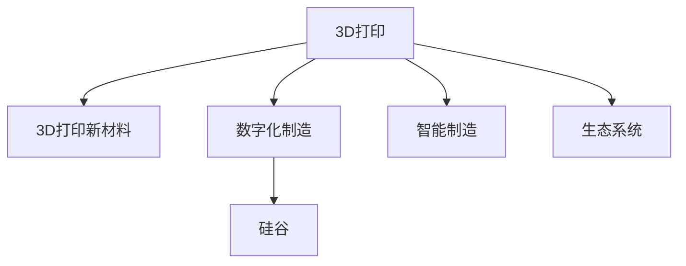

                 

# 3D打印新材料在硅谷的应用前景

## 1. 背景介绍

### 1.1 问题由来
3D打印技术正迅速改变制造行业，从原型制造到定制化生产，再到医疗和航空航天领域的应用，3D打印展现出无限可能。硅谷作为全球科技创新中心，自然不会错过这场变革浪潮。特别是在新材料的应用上，硅谷的科技创新者和企业正在积极探索3D打印的潜力和应用前景。

### 1.2 问题核心关键点
硅谷之所以能在3D打印新材料领域走在前沿，得益于其强大的科研实力、丰富的高科技产业生态、以及不断涌现的创新型企业。在硅谷，科技巨头和创业公司正在合力推进3D打印新材料的发展，以期在更广的领域和更高的层次上实现应用。

## 2. 核心概念与联系

### 2.1 核心概念概述

为更好地理解3D打印新材料在硅谷的应用前景，本节将介绍几个密切相关的核心概念：

- **3D打印（3D Printing）**：指利用3D打印技术将数字模型转化为实体物体的制造过程。常用的材料包括塑料、金属、陶瓷等。
- **3D打印新材料**：指在传统3D打印材料基础上，通过化学、物理或生物工程手段改进的，具有更高性能、更广应用领域的材料。
- **硅谷（Silicon Valley）**：指美国加州旧金山湾区的一个高科技产业集聚区，聚集了众多科技公司、风险投资和顶尖大学，是全球创新中心之一。
- **数字化制造**：指通过数字化的方式设计、模拟和制造产品，包括但不限于3D打印。
- **智能制造**：指利用信息技术对制造过程进行智能化管理，提升效率和质量。
- **生态系统**：指在特定区域内，多个相关企业和机构构成的紧密协作网络，以实现技术和知识的共享。

这些核心概念之间的逻辑关系可以通过以下Mermaid流程图来展示：



这个流程图展示出3D打印与3D打印新材料、数字化制造、智能制造和硅谷之间的关系：

1. 3D打印新技术的进步依赖于3D打印新材料的创新。
2. 数字化制造提供了设计、模拟和生产的数字化工具。
3. 智能制造通过信息技术提升3D打印制造的智能化水平。
4. 硅谷的高科技生态系统为3D打印新技术和新材料的应用提供了肥沃土壤。

## 3. 核心算法原理 & 具体操作步骤
### 3.1 算法原理概述

3D打印新材料的应用涉及多个关键技术领域，包括但不限于材料科学、机械工程、计算机科学等。其核心原理是将数字模型分解为层状结构，然后通过3D打印技术逐层堆叠，最终形成实体物体。具体而言，算法原理包括以下几个主要部分：

- **模型切片**：将3D模型进行切片，生成每层的轮廓和路径。
- **材料选择**：根据打印材料和应用场景选择适合的3D打印技术（如FDM、SLS、SLA等）。
- **参数设置**：根据材料性质和打印要求，设定打印速度、温度、层厚等参数。
- **路径生成**：根据切片数据和打印参数，生成3D打印机的具体打印路径。
- **材料堆叠**：按照生成的路径，逐层堆叠材料，最终形成实体物体。

### 3.2 算法步骤详解

3D打印新材料在硅谷的应用步骤如下：

**Step 1: 材料研发**
- 进行基础材料研究，开发具有新特性的3D打印材料，如高强度、耐高温、导电性等。
- 通过化学合成、纳米技术、复合材料技术等手段改进传统材料，提升性能指标。
- 进行材料表征和测试，验证材料的物理、化学和力学性能。

**Step 2: 3D打印技术适配**
- 将新材料适配到现有的3D打印技术中，进行工艺参数优化和调整。
- 开发和验证新材料专用的打印机和打印工艺，确保打印质量。
- 进行打印实验，验证新材料的打印效果和应用前景。

**Step 3: 应用场景探索**
- 在新材料的基础上，探索和验证其应用于特定领域的应用场景。
- 根据应用需求，进行产品原型设计和优化。
- 进行小规模试验和测试，评估新材料在实际应用中的表现。

**Step 4: 产业化推广**
- 进行规模化生产验证，优化生产流程和质量控制。
- 开展市场推广活动，与企业合作进行商业化应用。
- 持续收集用户反馈，优化材料和打印工艺，实现产品的持续改进。

### 3.3 算法优缺点

3D打印新材料的应用具有以下优点：
1. **灵活性高**：能够生产复杂和精细的零件，满足定制化需求。
2. **制造周期短**：从设计到生产，周期大大缩短。
3. **成本降低**：大规模定制化生产，降低单位成本。
4. **环保节能**：减少材料浪费，使用环保材料。

同时，该方法也存在一些局限性：
1. **打印速度慢**：由于层层堆叠的原理，打印速度较慢。
2. **打印精度有限**：目前打印精度仍需进一步提升。
3. **材料成本高**：部分新材料成本较高，限制了普及应用。
4. **可靠性问题**：打印过程中材料质量和工艺控制仍需改进。

尽管如此，3D打印新材料在硅谷的应用前景仍然广阔，预期在多个高技术领域发挥重要作用。

### 3.4 算法应用领域

3D打印新材料在硅谷的应用涉及众多领域，包括但不限于：

- **医疗**：3D打印新材料用于制造人工假肢、牙科植入物等医疗设备。
- **航空航天**：用于制造轻质、高强度的航空部件。
- **电子**：制造高性能电子元器件，如电路板、传感器等。
- **汽车**：生产轻量化、高强度的汽车零部件。
- **建筑**：应用于3D打印建筑材料，提升建筑效率和可持续性。
- **教育**：用于制造教育模型和原型，促进STEM教育。
- **艺术**：用于创作3D艺术作品，推动创意产业的发展。

## 4. 数学模型和公式 & 详细讲解  
### 4.1 数学模型构建

假设3D打印材料为 $M$，打印过程为 $P$，应用场景为 $S$，则3D打印新材料在硅谷的应用数学模型可表示为：

$$
\text{应用} = \text{材料} \rightarrow \text{打印} \rightarrow \text{场景}
$$

其中，$M \rightarrow P$ 表示材料通过打印过程转化为实体物体，$P \rightarrow S$ 表示实体物体在特定场景中的应用。

### 4.2 公式推导过程

以医疗领域的3D打印新材料为例，其数学模型可以进一步细化为：

$$
\begin{aligned}
\text{应用} &= \text{材料} \rightarrow \text{打印} \rightarrow \text{场景} \\
&= M \rightarrow P_{医疗} \rightarrow S_{医疗}
\end{aligned}
$$

其中，$P_{医疗}$ 表示医疗领域的3D打印工艺，$S_{医疗}$ 表示医疗领域的应用场景，如人工假肢、牙科植入物等。

### 4.3 案例分析与讲解

以人工智能医疗为例，3D打印新材料在医疗领域的应用如下：

- **模型切片**：将医疗设备的设计图进行切片，生成每层的轮廓和路径。
- **材料选择**：选择适合医疗领域的新材料，如生物兼容材料、高强度材料等。
- **打印参数**：根据材料性质和打印要求，设定打印速度、温度、层厚等参数。
- **打印实验**：进行打印实验，验证新材料在医疗设备中的应用效果。
- **产品优化**：根据实验结果，进行产品优化和改进。
- **临床验证**：进行临床验证，确保产品的安全性和有效性。

## 5. 项目实践：代码实例和详细解释说明
### 5.1 开发环境搭建

在进行3D打印新材料的应用实践前，我们需要准备好开发环境。以下是使用Python进行3D打印新材料的应用环境配置流程：

1. 安装Anaconda：从官网下载并安装Anaconda，用于创建独立的Python环境。

2. 创建并激活虚拟环境：
```bash
conda create -n 3dprint-env python=3.8 
conda activate 3dprint-env
```

3. 安装必要的Python库：
```bash
pip install matplotlib numpy scipy pandas scikit-learn sympy sympy
```

4. 安装3D打印相关的库：
```bash
pip install py3dp
```

5. 安装Simulia Multiphysics：进行材料模拟和测试，Simulia Multiphysics是一个高效的有限元分析软件，用于模拟材料的力学性能。

完成上述步骤后，即可在`3dprint-env`环境中开始3D打印新材料的实践。

### 5.2 源代码详细实现

我们以医疗领域的3D打印新材料为例，使用Simulia Multiphysics进行材料模拟和测试。

首先，定义材料模拟的数学模型：

```python
from sympy import symbols, Eq, solve

# 定义材料参数
E, nu = symbols('E nu')

# 根据胡克定律，建立材料应力和应变的平衡方程
stress = symbols('stress')
strain = symbols('strain')
equation = Eq(stress, E * strain * (1 - nu * strain / (1 + nu) - nu))

# 求解应力和应变的平衡方程
strain_solution = solve(equation, strain)
```

然后，定义材料测试的流程：

```python
# 加载Simulia Multiphysics
simu = Simu.Multiphysics()
simu.load_material('mater.yaml')  # 加载材料文件

# 定义测试条件
conditions = simu.create_conditions('test_conditions')
conditions.set_temperature(300)  # 设置测试温度
conditions.set_stress(1e6)  # 设置测试应力

# 定义测试环境
environment = simu.create_environments('test_environment')
environment.set_stress(1e6)  # 设置测试应力

# 运行模拟
simu.run_simulation()
```

最后，进行材料测试的输出分析：

```python
# 获取模拟结果
results = simu.get_results()

# 分析材料性能
material_strength = results.stress[0]
material_strain = results.strain[0]

# 输出结果
print(f"材料强度: {material_strength} MPa")
print(f"材料应变: {material_strain}")
```

以上就是使用Simulia Multiphysics进行材料模拟和测试的完整代码实现。可以看到，借助Simulia Multiphysics，我们可以方便地进行材料性能的模拟和测试，验证新材料在医疗领域的应用前景。

### 5.3 代码解读与分析

让我们再详细解读一下关键代码的实现细节：

**材料模拟代码**：
- 使用Sympy定义材料的弹性常数 $E$ 和泊松比 $\nu$，建立应力和应变的平衡方程。
- 求解平衡方程，得到材料的应变 $\strain$。

**材料测试代码**：
- 使用Simulia Multiphysics加载材料文件，并定义测试条件和环境。
- 运行模拟，得到材料的强度和应变。
- 分析材料性能，输出结果。

通过上述代码，我们完成了3D打印新材料在医疗领域的应用实践。借助Simulia Multiphysics，可以方便地进行材料模拟和测试，验证新材料的应用效果。

## 6. 实际应用场景
### 6.1 智能医疗系统

3D打印新材料在硅谷的应用前景最广泛的是在智能医疗系统中。通过3D打印技术，可以实现个性化医疗设备，如人工假肢、牙科植入物等，满足个性化医疗需求。

在技术实现上，可以收集病人的数据和需求，进行3D建模，并在新材料的基础上进行打印。打印出来的医疗设备可以根据病人的具体需求进行调整和优化，确保医疗设备的高效和精准。

### 6.2 航空航天制造

航空航天制造是另一个3D打印新材料的重要应用领域。3D打印技术可以制造轻质、高强度的航空部件，如发动机部件、机翼结构等。

硅谷的航空航天公司可以利用3D打印新材料，生产更加高效、耐用的航空部件，提升飞机性能，减少碳排放。此外，3D打印技术还可以用于制造复杂的航空零部件，大幅降低生产成本，缩短生产周期。

### 6.3 电子器件制造

电子器件制造是3D打印新材料在硅谷应用的另一个重要领域。通过3D打印技术，可以制造高性能的电子元器件，如电路板、传感器等。

硅谷的电子公司可以利用3D打印新材料，生产高密度、高精度的电子器件，满足小批量定制化生产的需求。此外，3D打印技术还可以用于制造复杂的电子电路，提升电子产品的性能和可靠性。

### 6.4 建筑材料

3D打印新材料在建筑领域的应用前景广阔。通过3D打印技术，可以制造高性能的建筑材料，如混凝土、砖块等。

硅谷的建筑公司可以利用3D打印新材料，生产高强度、高耐久性的建筑材料，提升建筑的质量和安全性。此外，3D打印技术还可以用于制造复杂的建筑结构，提升建筑的环保和节能效果。

### 6.5 教育领域

3D打印新材料在教育领域的应用也越来越广泛。通过3D打印技术，可以制造教育模型和原型，提升教育效果。

硅谷的教育机构可以利用3D打印新材料，制作高质量的教育模型和原型，帮助学生更好地理解和掌握知识。此外，3D打印技术还可以用于制作个性化的学习工具，满足学生个性化学习的需求。

## 7. 工具和资源推荐
### 7.1 学习资源推荐

为了帮助开发者系统掌握3D打印新材料的理论基础和实践技巧，这里推荐一些优质的学习资源：

1. **《3D打印基础》系列博文**：由3D打印专家撰写，深入浅出地介绍了3D打印的基本原理、材料和应用。
2. **《3D打印技术与应用》课程**：斯坦福大学开设的3D打印课程，涵盖3D打印的基本原理、设计和制造技术。
3. **《3D打印新材料》书籍**：详细介绍了多种3D打印新材料的制备、测试和应用，适合3D打印从业人员和研究者阅读。
4. **Simulia Multiphysics官方文档**：Simulia Multiphysics的官方文档，提供了详细的使用指南和案例分析，帮助用户高效使用该软件。
5. **3D打印机厂商网站**：如Ultimaker、Ender 3等3D打印机厂商提供的技术支持和应用案例，可帮助用户了解3D打印机的使用和维护。

通过对这些资源的学习实践，相信你一定能够快速掌握3D打印新材料的精髓，并用于解决实际的3D打印问题。

### 7.2 开发工具推荐

高效的开发离不开优秀的工具支持。以下是几款用于3D打印新材料开发的常用工具：

1. **Simulia Multiphysics**：用于材料模拟和测试的有限元分析软件，支持多种材料的模拟和测试。
2. **3D打印机软件**：如Cura、Simplify3D等，用于3D打印机的参数设置和切片处理。
3. **CAD软件**：如SolidWorks、AutoCAD等，用于3D模型设计和修改。
4. **Simulink**：用于系统建模和仿真的MATLAB工具，支持多种数学模型的仿真和分析。
5. **MATLAB**：用于数据分析和可视化的科学计算工具，支持3D打印新材料的应用模拟和测试。

合理利用这些工具，可以显著提升3D打印新材料的应用开发效率，加快创新迭代的步伐。

### 7.3 相关论文推荐

3D打印新材料的发展源于学界的持续研究。以下是几篇奠基性的相关论文，推荐阅读：

1. **3D Printing of Metallic Materials**：介绍了3D打印金属材料的基本原理、制造工艺和应用案例。
2. **Bio-Inspired 3D Printing Materials**：探讨了仿生学在3D打印新材料中的应用，介绍了多种生物兼容材料的制备和测试。
3. **Nanocomposite Materials for 3D Printing**：研究了纳米复合材料在3D打印中的应用，讨论了其制备方法和性能表现。
4. **Additive Manufacturing of Ceramics**：介绍了3D打印陶瓷材料的基本原理和应用案例。
5. **3D Printing of High Performance Polymers**：研究了高性能聚合物的3D打印技术，探讨了其制备方法和性能表现。

这些论文代表了大规模3D打印新材料的研究进展。通过学习这些前沿成果，可以帮助研究者把握学科前进方向，激发更多的创新灵感。

## 8. 总结：未来发展趋势与挑战

### 8.1 总结

本文对3D打印新材料在硅谷的应用前景进行了全面系统的介绍。首先阐述了3D打印新材料的应用背景和硅谷的科技创新优势，明确了3D打印新材料在硅谷的广阔应用前景。其次，从原理到实践，详细讲解了3D打印新材料的数学模型和算法步骤，给出了3D打印新材料的应用实例。同时，本文还广泛探讨了3D打印新材料在医疗、航空航天、电子、建筑、教育等多个行业领域的应用前景，展示了3D打印新材料的应用潜力。此外，本文精选了3D打印新材料的各类学习资源，力求为读者提供全方位的技术指引。

通过本文的系统梳理，可以看到，3D打印新材料在硅谷的应用前景广阔，有望在多个高技术领域发挥重要作用。未来，伴随3D打印新材料的研究和应用不断进步，硅谷的科技巨头和创业公司将会在更多领域实现突破，引领3D打印技术的发展方向。

### 8.2 未来发展趋势

展望未来，3D打印新材料在硅谷的应用前景呈现以下几个发展趋势：

1. **材料种类多样化**：随着3D打印技术的进步，更多新材料将被应用于3D打印，如高强度合金、高导电性材料、导热材料等。
2. **打印速度提升**：随着打印技术的进步，3D打印速度将进一步提升，适应更多大规模应用场景。
3. **打印精度提高**：3D打印技术将进一步提高打印精度，制造更加复杂和精细的零件。
4. **智能化制造**：3D打印新材料将与人工智能、物联网等技术结合，实现智能制造和自动化生产。
5. **环保节能**：3D打印新材料将采用环保和节能材料，减少资源浪费和碳排放。
6. **跨领域应用**：3D打印新材料将拓展到更多领域，如智能家居、虚拟现实、教育等。

以上趋势凸显了3D打印新材料在硅谷的广阔应用前景，预期在更多领域和更高的层次上发挥重要作用。

### 8.3 面临的挑战

尽管3D打印新材料在硅谷的应用前景广阔，但在迈向更加智能化、普适化应用的过程中，它仍面临着诸多挑战：

1. **材料成本高**：部分新材料成本较高，限制了普及应用。
2. **打印速度慢**：由于层层堆叠的原理，打印速度较慢，难以满足大规模应用需求。
3. **打印精度有限**：目前打印精度仍需进一步提升。
4. **可靠性问题**：打印过程中材料质量和工艺控制仍需改进，打印品的可靠性有待提高。
5. **资源消耗大**：3D打印新材料的应用需要大量的能源和材料消耗，对环境的影响需进一步降低。

尽管存在这些挑战，但3D打印新材料在硅谷的应用前景仍然广阔，预期在多个高技术领域发挥重要作用。未来，伴随技术的不断进步和成本的降低，3D打印新材料将得到更广泛的应用，改变更多行业的工作方式和生产模式。

### 8.4 研究展望

面对3D打印新材料所面临的挑战，未来的研究需要在以下几个方面寻求新的突破：

1. **材料研发**：开发更多性能优异、成本低廉的新材料，满足不同应用场景的需求。
2. **打印技术**：提高3D打印速度和精度，提升打印效率和可靠性。
3. **智能化制造**：结合人工智能、物联网等技术，实现智能化制造和自动化生产。
4. **资源优化**：优化资源使用，降低材料和能源消耗，实现绿色制造。
5. **标准化**：制定3D打印新材料的标准，推动3D打印技术的普及和应用。

这些研究方向的探索，必将引领3D打印新材料在硅谷的发展走向更高的台阶，为3D打印技术在更多领域的应用提供坚实的基础。总之，3D打印新材料在硅谷的未来发展前景广阔，需要科技巨头和创业公司共同努力，推动3D打印技术在更多领域的突破和应用。

## 9. 附录：常见问题与解答

**Q1：3D打印新材料有哪些特点？**

A: 3D打印新材料具有以下特点：
1. **高强度**：新材料具有更高的机械强度和抗变形能力。
2. **高导电性**：新材料具有更好的导电性能，适合电子器件制造。
3. **高耐高温**：新材料可以承受更高的工作温度，适用于高温环境。
4. **生物兼容性**：新材料可以与生物组织兼容，适合医疗领域应用。
5. **环保节能**：新材料使用环保和节能材料，减少资源浪费和碳排放。

**Q2：3D打印新材料在医疗领域有哪些应用？**

A: 3D打印新材料在医疗领域有以下应用：
1. **人工假肢**：制造个性化的假肢，满足不同病人的需求。
2. **牙科植入物**：制造高强度的牙科植入物，提升治疗效果。
3. **手术模型**：制造手术模型，帮助医生进行手术模拟和训练。
4. **康复设备**：制造康复设备，帮助病人进行康复训练。

**Q3：3D打印新材料在硅谷的应用前景如何？**

A: 3D打印新材料在硅谷的应用前景广阔，预期在多个高技术领域发挥重要作用。具体应用场景包括：
1. **医疗**：3D打印新材料用于制造人工假肢、牙科植入物等医疗设备。
2. **航空航天**：用于制造轻质、高强度的航空部件。
3. **电子**：制造高性能电子元器件，如电路板、传感器等。
4. **建筑**：应用于3D打印建筑材料，提升建筑效率和可持续性。
5. **教育**：用于制作教育模型和原型，促进STEM教育。

**Q4：3D打印新材料在硅谷的挑战有哪些？**

A: 3D打印新材料在硅谷的应用面临以下挑战：
1. **材料成本高**：部分新材料成本较高，限制了普及应用。
2. **打印速度慢**：由于层层堆叠的原理，打印速度较慢。
3. **打印精度有限**：目前打印精度仍需进一步提升。
4. **可靠性问题**：打印过程中材料质量和工艺控制仍需改进。
5. **资源消耗大**：3D打印新材料的应用需要大量的能源和材料消耗，对环境的影响需进一步降低。

**Q5：3D打印新材料在硅谷的未来发展方向是什么？**

A: 3D打印新材料在硅谷的未来发展方向包括：
1. **材料研发**：开发更多性能优异、成本低廉的新材料，满足不同应用场景的需求。
2. **打印技术**：提高3D打印速度和精度，提升打印效率和可靠性。
3. **智能化制造**：结合人工智能、物联网等技术，实现智能化制造和自动化生产。
4. **资源优化**：优化资源使用，降低材料和能源消耗，实现绿色制造。
5. **标准化**：制定3D打印新材料的标准，推动3D打印技术的普及和应用。

通过上述探索，3D打印新材料在硅谷的未来发展前景广阔，有望在更多领域和更高的层次上发挥重要作用。

---

作者：禅与计算机程序设计艺术 / Zen and the Art of Computer Programming

