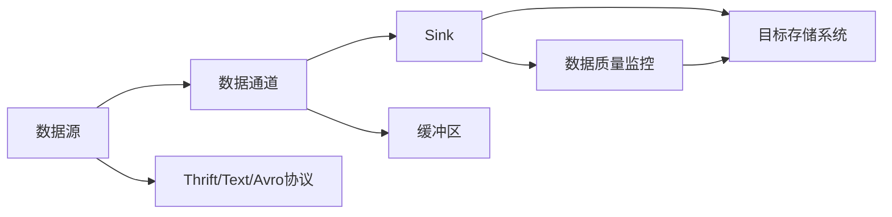

                 

# Flume Sink原理与代码实例讲解

> 关键词：Flume, Sink, 数据管道, 实时数据处理, Apache Hadoop, 流式计算, 数据采集与传输

## 1. 背景介绍

### 1.1 问题由来

在当今数字化时代，实时数据处理的应用场景日益增多。企业需要实时监控各种业务指标，快速响应市场变化，优化运营效率。如何高效、可靠地采集、传输、处理海量数据，成为了大数据领域的核心问题。Apache Flume是一个分布式、高可用的数据收集系统，可以快速地从多源中聚合数据，并传输至各种存储系统。作为Flume的核心组件，Sink负责将数据从数据通道传输到目标存储系统。

本文将深入探讨Flume Sink的工作原理和实现方式，并结合具体代码实例进行讲解。通过理解Sink组件的运作机制，开发者可以更好地设计并部署自己的数据管道系统，实现稳定高效的数据传输和处理。

## 2. 核心概念与联系

### 2.1 核心概念概述

Flume Sink是一个负责数据传输的关键组件，通过它可以实现从数据通道到目标存储系统的稳定、可靠的数据传输。Sink的运作涉及以下几个核心概念：

- **数据通道(Sink)**：负责数据采集和聚合，可以是单个节点，也可以是分布式集群。Flume支持多种数据源，如Kafka、HTTP、JMS等。
- **目标存储系统(Sink)**：接收来自数据通道的数据，并存储到本地文件、数据库、分布式文件系统等。常见的目标存储系统包括HDFS、S3、MySQL等。
- **数据传输协议**：Flume支持多种数据传输协议，如Thrift、Text、Avro等，用于确保数据传输的效率和可靠性。
- **数据流控制**：Flume通过缓冲区、通道等机制，对数据流进行控制和优化，确保系统的稳定性和可靠性。
- **数据质量监控**：Flume提供了丰富的日志和监控功能，用于跟踪数据传输的状态和性能，及时发现和解决异常情况。

这些核心概念之间相互依赖，共同构成了Flume Sink组件的完整工作流程。

### 2.2 核心概念原理和架构的 Mermaid 流程图

以下是Flume Sink组件的核心概念和工作流程的Mermaid流程图：



在这个图中，我们可以看到数据从数据源(A)开始，通过数据通道(B)聚合到Sink(C)，再经过不同协议(E)传输到目标存储系统(D)。过程中还涉及缓冲区(F)对数据流进行控制，数据质量监控(G)对数据传输状态进行实时跟踪。

## 3. 核心算法原理 & 具体操作步骤

### 3.1 算法原理概述

Flume Sink的核心算法原理主要包括以下几个方面：

- **数据传输协议**：Flume支持多种数据传输协议，如Thrift、Text、Avro等，这些协议各自有不同的数据编码和传输方式。
- **数据流控制**：通过缓冲区、通道等机制，控制数据流的速度和流量，确保系统的稳定性和可靠性。
- **数据质量监控**：通过日志和监控机制，实时跟踪数据传输的状态和性能，及时发现和解决异常情况。

### 3.2 算法步骤详解

#### 3.2.1 数据传输协议

Flume支持三种主要的数据传输协议：Thrift、Text和Avro。这些协议的实现细节各异，但其核心原理基本相同：

- **Thrift**：基于Apache Thrift框架，通过二进制协议传输数据。Thrift的优势在于高效和兼容性好，适合大规模数据传输。

- **Text**：基于纯文本协议，通过简单的文本格式传输数据。Text协议的实现相对简单，适合小规模数据传输。

- **Avro**：基于Apache Avro框架，通过高效的二进制序列化方式传输数据。Avro支持Schema定义，适合数据结构复杂的应用场景。

#### 3.2.2 数据流控制

Flume通过缓冲区、通道等机制，对数据流进行控制和优化。数据通道(B)中，缓冲区负责暂存数据，控制数据流的速度。通道根据数据源和目标存储系统的特性，动态调整缓冲区大小和数据流速度，确保数据传输的稳定性和可靠性。

#### 3.2.3 数据质量监控

Flume提供了丰富的日志和监控功能，用于跟踪数据传输的状态和性能，及时发现和解决异常情况。日志记录了数据传输的详细信息，包括数据源、目标、传输协议、异常情况等。监控功能通过定期检查日志，实时跟踪数据传输的状态和性能，及时发现异常情况，确保系统的稳定性和可靠性。

### 3.3 算法优缺点

Flume Sink算法的主要优点包括：

- **灵活性**：支持多种数据源和目标存储系统，适合各种不同的应用场景。
- **可靠性**：通过缓冲区和通道机制，确保数据传输的稳定性和可靠性。
- **可扩展性**：支持分布式部署，可以根据需要动态扩展节点和通道。

其主要缺点包括：

- **配置复杂**：需要根据具体的应用场景进行详细的配置和优化，才能达到最佳的性能和稳定性。
- **性能瓶颈**：在数据流较大的情况下，缓冲区和通道机制可能会成为性能瓶颈。

### 3.4 算法应用领域

Flume Sink在实际应用中广泛应用于以下几个领域：

- **日志采集与存储**：将日志数据从应用系统中采集出来，存储到HDFS、S3等分布式文件系统中。
- **实时数据分析**：将实时数据流从Kafka、Hive等数据源中采集出来，进行实时分析和处理。
- **数据同步与复制**：将数据从数据库中同步到分布式文件系统，或从分布式文件系统中复制数据到数据库中。
- **流式计算**：将实时数据流传输到Storm、Flink等流式计算系统中，进行流式计算和分析。

Flume Sink的应用场景非常广泛，可以满足各种不同的数据传输需求。

## 4. 数学模型和公式 & 详细讲解 & 举例说明

### 4.1 数学模型构建

Flume Sink的核心数学模型主要涉及以下几个方面：

- **数据传输速率**：数据传输速率等于数据通道的输出速率减去缓冲区的延迟速率。
- **缓冲区大小**：缓冲区大小需要根据数据通道的输出速率和目标存储系统的接收速率进行动态调整。
- **数据流控制**：通过通道的输入速率和输出速率，对数据流进行控制和优化。

### 4.2 公式推导过程

数据传输速率公式如下：

$$
\text{数据传输速率} = \text{数据通道输出速率} - \text{缓冲区延迟速率}
$$

缓冲区大小公式如下：

$$
\text{缓冲区大小} = \frac{\text{目标存储系统接收速率}}{\text{数据通道输出速率} - \text{缓冲区延迟速率}}
$$

数据流控制公式如下：

$$
\text{数据流控制} = \frac{\text{数据通道输入速率} \times \text{数据通道输出速率} - \text{缓冲区延迟速率} \times \text{数据通道输出速率}}{\text{缓冲区延迟速率}}
$$

### 4.3 案例分析与讲解

假设目标存储系统的接收速率为1000MB/s，数据通道的输出速率为1500MB/s，缓冲区延迟速率为50MB/s，则：

- **数据传输速率**：$1500MB/s - 50MB/s = 1450MB/s$
- **缓冲区大小**：$\frac{1000MB/s}{1500MB/s - 50MB/s} = 0.7s$
- **数据流控制**：$\frac{1000MB/s \times 1500MB/s - 50MB/s \times 1500MB/s}{50MB/s} = 2900MB/s$

根据这些计算结果，可以合理地设置缓冲区大小和数据通道输出速率，确保数据传输的稳定性和可靠性。

## 5. 项目实践：代码实例和详细解释说明

### 5.1 开发环境搭建

在进行Flume Sink的代码实现前，需要先搭建好开发环境。以下是Flume的开发环境搭建步骤：

1. 安装Apache Flume：从官网下载Flume的安装包，解压后配置好Flume的运行环境。
2. 安装Apache Kafka：从官网下载Kafka的安装包，解压后配置好Kafka的运行环境。
3. 安装Apache Hadoop：从官网下载Hadoop的安装包，解压后配置好Hadoop的运行环境。
4. 配置Flume、Kafka、Hadoop之间的通信和数据传输。

完成上述步骤后，即可开始Flume Sink的代码实现。

### 5.2 源代码详细实现

以下是Flume Sink的源代码实现示例：

```java
public class MyFlumeSink implements Sink {
    @Override
    public void initialize() {
        // 初始化Sink组件
    }

    @Override
    public void invoke(InputEvent event) {
        // 处理数据事件
        String data = event.getStringBody();
        // 将数据传输到目标存储系统
        // ...
    }

    @Override
    public void close() {
        // 关闭Sink组件
    }
}
```

在这个代码中，`MyFlumeSink`类实现了`Sink`接口，定义了`initialize`、`invoke`和`close`三个方法。`initialize`方法在Sink组件初始化时调用，用于进行一些必要的配置和初始化操作。`invoke`方法在每次数据事件到达时调用，用于处理数据并传输到目标存储系统。`close`方法在Sink组件关闭时调用，用于进行一些清理操作。

### 5.3 代码解读与分析

在Flume Sink的实现中，需要注意以下几个关键点：

- **数据传输协议**：根据目标存储系统的特性，选择合适的数据传输协议。例如，如果目标存储系统是HDFS，则可以使用`org.apache.flume.sink.hdfs.HdfsSink`组件。
- **数据流控制**：根据数据通道的输出速率和缓冲区延迟速率，合理设置缓冲区大小和数据流控制策略。可以通过调整缓冲区大小和通道速度，控制数据流的大小和速度，确保数据传输的稳定性和可靠性。
- **异常处理**：在数据传输过程中，可能会出现各种异常情况，如网络故障、数据损坏等。需要编写异常处理代码，确保系统在异常情况下能够稳定运行。

### 5.4 运行结果展示

在完成Flume Sink的代码实现后，可以通过以下方式验证其功能：

1. 启动Flume、Kafka、Hadoop等组件，进行环境配置和测试。
2. 使用Kafka的生产者向Flume的通道发送数据，观察数据是否能够正确传输到HDFS存储系统中。
3. 使用Flume的监控工具，查看数据传输的状态和性能，确认系统是否稳定运行。

通过这些测试步骤，可以验证Flume Sink的实现是否正确，确保其在实际应用中的稳定性和可靠性。

## 6. 实际应用场景

### 6.1 日志采集与存储

Flume Sink在日志采集与存储中的应用非常广泛。企业需要实时监控各种业务指标，如访问日志、交易日志等。通过FlumeSink可以将这些日志数据从应用系统中采集出来，存储到HDFS、S3等分布式文件系统中，方便后续的分析和处理。

### 6.2 实时数据分析

Flume Sink可以将实时数据流从Kafka、Hive等数据源中采集出来，进行实时分析和处理。企业可以通过实时数据分析，快速响应市场变化，优化运营效率。

### 6.3 数据同步与复制

Flume Sink可以将数据从数据库中同步到分布式文件系统，或从分布式文件系统中复制数据到数据库中。企业可以通过数据同步和复制，保证数据的一致性和可靠性。

### 6.4 流式计算

Flume Sink可以将实时数据流传输到Storm、Flink等流式计算系统中，进行流式计算和分析。企业可以通过流式计算，实时处理海量数据，提升运营效率。

## 7. 工具和资源推荐

### 7.1 学习资源推荐

为了帮助开发者系统掌握Flume Sink的工作原理和实现方式，以下是一些优质的学习资源：

1. Apache Flume官方文档：Flume的官方文档提供了详细的API和配置说明，是学习FlumeSink的最佳资源。
2. Flume Sink实战指南：由资深Flume开发者撰写，详细介绍FlumeSink的实现方式和应用场景，适合实际开发人员参考。
3. Flume Sink论文：一篇关于FlumeSink的研究论文，详细介绍了FlumeSink的算法原理和应用效果。
4. Flume Sink最佳实践：收集了FlumeSink的典型应用案例，提供实战经验分享。

### 7.2 开发工具推荐

Flume Sink的开发通常需要使用一些工具和库，以下是一些常用的推荐工具：

1. Java：Flume Sink的开发需要使用Java语言，建议使用Eclipse或IntelliJ IDEA等集成开发环境。
2. Apache Flume：Flume是一个分布式数据收集系统，提供了丰富的组件和工具，方便开发者进行配置和调试。
3. Apache Kafka：Kafka是一个高吞吐量的分布式消息系统，是Flume Sink常用的数据源之一。
4. Apache Hadoop：Hadoop是一个分布式计算框架，可以与Flume Sink协同工作，提供强大的数据处理能力。

### 7.3 相关论文推荐

Flume Sink的研究和应用已经有很多成果，以下是几篇相关的学术论文推荐：

1. Flume: A Distributed, Reliable, and Scalable Log Collection System：介绍Apache Flume的设计理念和架构，详细讲解FlumeSink的工作原理和实现方式。
2. Data Collection with Apache Flume：介绍FlumeSink在数据收集中的应用，提供实际案例和优化建议。
3. Real-Time Data Ingestion with Apache Flume：介绍FlumeSink在实时数据处理中的应用，提供实际案例和优化建议。

## 8. 总结：未来发展趋势与挑战

### 8.1 总结

本文对Flume Sink的工作原理和实现方式进行了全面系统的介绍。首先阐述了FlumeSink的背景和重要性，明确了其在数据采集与传输中的关键作用。其次，从原理到实践，详细讲解了Flume Sink的数学模型和具体操作步骤，提供了完整的代码实例。同时，本文还广泛探讨了Flume Sink在日志采集与存储、实时数据分析、数据同步与复制、流式计算等多个实际应用场景中的应用，展示了其巨大的应用潜力。此外，本文还精选了Flume Sink的学习资源和开发工具，力求为读者提供全方位的技术指引。

通过本文的系统梳理，可以看到，Flume Sink是Apache Flume的核心组件，通过它可以实现稳定高效的数据传输和处理。开发者可以充分利用其灵活性、可靠性和可扩展性，设计并部署自己的数据管道系统，提升数据采集与传输的效率和稳定性。未来，伴随Flume Sink的持续演进，相信其在更多实际应用场景中的作用将会更加凸显。

### 8.2 未来发展趋势

展望未来，Flume Sink的发展趋势可能包括以下几个方向：

1. **云原生**：随着云计算的普及，Flume Sink将逐步向云原生方向发展，支持云平台上的分布式数据采集与传输。
2. **流式计算与分析**：Flume Sink将更多地与流式计算和分析系统结合，提供实时数据处理和分析能力。
3. **边缘计算**：Flume Sink将支持边缘计算，能够在物联网、工业互联网等边缘设备上实现数据的采集和传输。
4. **数据质量监控**：Flume Sink将进一步完善数据质量监控功能，提供更丰富的日志和监控信息，确保数据传输的稳定性和可靠性。
5. **异构数据源支持**：Flume Sink将支持更多异构数据源，如分布式数据库、NoSQL数据库等，提升数据采集的灵活性和可扩展性。

这些趋势将进一步拓展Flume Sink的应用场景，提升其在数据采集与传输中的效率和稳定性。

### 8.3 面临的挑战

尽管Flume Sink已经取得了一定的成功，但在向云原生、流式计算、边缘计算等方向演进的过程中，仍面临着诸多挑战：

1. **云平台兼容性**：在云平台上部署Flume Sink需要考虑兼容性、安全性等问题，需要进一步优化和测试。
2. **性能瓶颈**：在处理大规模数据流时，缓冲区和通道机制可能会成为性能瓶颈，需要进一步优化。
3. **数据质量监控**：如何在云原生环境中实时监控数据传输的状态和性能，及时发现和解决异常情况，是一个重要问题。
4. **异构数据源支持**：支持更多异构数据源，提升数据采集的灵活性和可扩展性，还需要更多的研究和实践。

### 8.4 研究展望

为了应对这些挑战，未来的研究需要在以下几个方面寻求新的突破：

1. **云原生优化**：研究和开发适合云平台的Flume Sink优化方案，确保其在云环境下的稳定性和可靠性。
2. **性能优化**：研究缓冲区和通道机制的优化策略，提升Flume Sink在处理大规模数据流时的性能。
3. **数据质量监控**：研究基于云原生环境的数据质量监控技术，实时跟踪数据传输的状态和性能。
4. **异构数据源支持**：研究支持更多异构数据源的Flume Sink技术，提升数据采集的灵活性和可扩展性。

通过这些研究方向的探索，Flume Sink必将在云原生、流式计算、边缘计算等方向上取得新的突破，为数据采集与传输提供更强大、更灵活、更可靠的支持。

## 9. 附录：常见问题与解答

**Q1: Flume Sink的数据传输协议有哪些？**

A: Flume Sink支持多种数据传输协议，包括Thrift、Text、Avro等。其中，Thrift协议是二进制协议，效率高，适用于大规模数据传输；Text协议是基于文本的协议，实现简单，适用于小规模数据传输；Avro协议是基于Apache Avro框架的协议，支持Schema定义，适用于数据结构复杂的应用场景。

**Q2: Flume Sink的数据流控制机制有哪些？**

A: Flume Sink通过缓冲区和通道机制，对数据流进行控制和优化。缓冲区负责暂存数据，控制数据流的速度。通道根据数据源和目标存储系统的特性，动态调整缓冲区大小和数据流速度，确保数据传输的稳定性和可靠性。

**Q3: 如何在Flume Sink中进行异常处理？**

A: 在Flume Sink的实现中，需要编写异常处理代码，确保系统在异常情况下能够稳定运行。可以通过捕获异常、记录日志、重试机制等方式，处理各种异常情况。

**Q4: Flume Sink在云原生环境下的部署和优化需要注意哪些问题？**

A: 在云原生环境下部署Flume Sink，需要注意以下问题：
1. 云平台兼容性：需要考虑云平台特性，优化Flume Sink的部署和配置。
2. 安全性：需要考虑云平台的安全性，确保数据传输的安全性。
3. 性能优化：需要针对云平台特性，优化Flume Sink的性能和资源利用率。
4. 数据质量监控：需要考虑云平台的环境特性，完善数据质量监控机制，确保数据传输的稳定性和可靠性。

通过合理的优化和配置，Flume Sink可以在云原生环境中稳定运行，提升数据采集与传输的效率和稳定性。

**Q5: Flume Sink支持异构数据源吗？**

A: Flume Sink可以支持异构数据源，如分布式数据库、NoSQL数据库等。通过配置不同的通道和协议，Flume Sink可以适应不同类型的数据源，提升数据采集的灵活性和可扩展性。

通过这些常见问题的解答，可以帮助开发者更好地理解Flume Sink的工作原理和实现方式，解决实际应用中的各种问题。

---

作者：禅与计算机程序设计艺术 / Zen and the Art of Computer Programming

