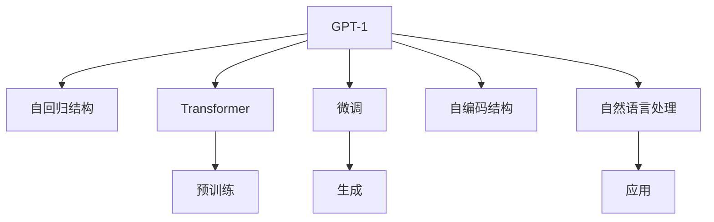

                 

# GPT系列模型架构解析：从GPT-1到GPT-4

> 关键词：GPT-1, GPT-2, GPT-3, GPT-4, 自回归模型, 自编码模型, 深度神经网络, 注意力机制, 预训练, 微调, 自然语言处理, 语言模型

## 1. 背景介绍

### 1.1 问题由来
GPT系列模型作为自然语言处理(NLP)领域的翘楚，其架构设计备受关注。从2018年的GPT-1到2023年的GPT-4，每一代模型的推出都带来了新的技术突破和应用潜力。然而，现有文献和书籍往往集中讨论每个单独的模型，而忽略了它们之间的连续性及演变过程。本文将从GPT-1到GPT-4，系统性地解析GPT系列模型的架构设计，揭示它们的内在联系和不断进化的路径。

### 1.2 问题核心关键点
本文的核心问题包括：
- GPT系列模型的整体架构设计原则是什么？
- 各代模型之间的架构差异和演进路径是怎样的？
- 不同模型的关键技术突破对架构的影响有哪些？

### 1.3 问题研究意义
深入理解GPT系列模型的架构设计，对于开发人员和研究者来说至关重要：
- 能够帮助理解模型设计的核心思想，启发新的架构设计思路。
- 能够基于已有架构经验，改进现有模型或设计新模型，提升性能。
- 能够更好地应用于各种NLP任务，提高工作效率。

## 2. 核心概念与联系

### 2.1 核心概念概述

GPT系列模型是由OpenAI开发的一系列自回归(或自编码)深度神经网络语言模型，用于生成自然语言文本。核心概念包括：

- **GPT-1**：第一个公开发布的模型，采用自回归结构，用12层的Transformer模型进行预训练。
- **GPT-2**：大幅增加了模型参数量，采用自回归结构，但引入语言模型的改进，解决训练不稳定问题。
- **GPT-3**：进一步增大参数量，采用自编码和自回归的混合结构，显著提升生成质量。
- **GPT-4**：采用更高级的架构，如带有架构性变分自编码器和自回归的结构，进一步提升生成质量和效率。

这些模型之间存在紧密的联系，主要包括：

- 自回归和自编码结构：不同模型采用的不同结构，都是基于深度神经网络生成语言的。
- 预训练和微调：所有模型都经过大规模无标签数据的预训练，并在下游任务上进行微调。
- 深度注意力机制：所有模型都采用Transformer模型中的深度注意力机制，实现高效的文本处理。

这些核心概念之间的关系可以通过以下Mermaid流程图来展示：



这个流程图展示了大语言模型从GPT-1到GPT-4的演进路径：

1. GPT-1使用自回归结构，基于Transformer预训练，并进行微调。
2. GPT-2增加模型规模，并引入语言模型改进，进一步提升训练效果。
3. GPT-3使用自编码和自回归混合结构，大幅提升生成质量。
4. GPT-4采用更先进的架构，如架构性变分自编码器，增强模型生成效率。

这些模型的核心思想和架构设计原则，将成为我们深入解析GPT系列模型的重要线索。

## 3. 核心算法原理 & 具体操作步骤
### 3.1 算法原理概述

GPT系列模型基于深度神经网络，采用自回归或自编码结构，并引入深度注意力机制进行预训练和微调。其核心算法原理包括以下几个方面：

1. **自回归模型**：每个时间步上的输出仅依赖于前一时间步的输出，即 $y_t = \text{softmax}(A[y_{t-1}, x_t])$。其中 $A$ 为注意力矩阵，$x_t$ 为输入，$y_t$ 为输出。

2. **自编码模型**：采用编码器-解码器结构，编码器输出与解码器输入都通过注意力机制进行匹配，即 $y_t = \text{softmax}(A[y_{t-1}, x_t])$。其中 $A$ 为注意力矩阵，$x_t$ 为输入，$y_t$ 为输出。

3. **深度注意力机制**：使用Transformer模型中的多头注意力机制，使模型能够同时关注输入序列中的不同位置，提升文本生成质量。

4. **预训练和微调**：通过大规模无标签文本数据的预训练，学习语言的通用表示，再通过下游任务的少量标注数据进行微调，适应特定任务需求。

### 3.2 算法步骤详解

以GPT-2为例，其核心算法步骤包括以下几个关键点：

1. **准备数据集**：收集大规模无标签文本数据，用于模型预训练。

2. **定义模型结构**：采用自回归结构，使用Transformer模型，包含12个编码器层，每层6个多头注意力头和2个前馈神经网络层。

3. **预训练步骤**：使用语言模型作为目标函数，最大化似然概率，以最大化模型生成自然语言的准确性。

4. **微调步骤**：在特定下游任务上，使用少样本训练数据进行微调，适应任务需求。

### 3.3 算法优缺点

GPT系列模型的优点包括：
1. 生成质量高：自回归和深度注意力机制使得模型能够生成流畅、连贯的自然语言文本。
2. 参数量可调：模型规模可灵活调整，适应不同场景的需求。
3. 通用性强：预训练模型可以在多种NLP任务上微调，应用广泛。

缺点包括：
1. 数据需求大：预训练和微调需要大规模数据，对计算资源要求高。
2. 训练成本高：模型规模增大导致训练时间增长，计算成本增加。
3. 性能提升有限：在大规模数据上，性能提升空间有限，进一步优化需要更多的创新。

### 3.4 算法应用领域

GPT系列模型已在多个NLP任务中得到广泛应用，包括但不限于：

1. **文本生成**：利用自回归模型生成文章、对话、摘要等文本内容。
2. **机器翻译**：通过微调进行高效的文本翻译。
3. **问答系统**：在问答任务上生成正确答案。
4. **文本分类**：对文本进行情感分析、主题分类等。
5. **对话系统**：实现人机交互，提供自然流畅的对话。

## 4. 数学模型和公式 & 详细讲解 & 举例说明

### 4.1 数学模型构建

GPT系列模型基于深度神经网络，使用自回归或自编码结构，并引入深度注意力机制。以GPT-2为例，其数学模型构建如下：

1. **编码器**：使用12个编码器层，每层包含6个多头注意力头和2个前馈神经网络层。
2. **解码器**：采用自回归结构，使用2个多头注意力头和2个前馈神经网络层。
3. **语言模型**：使用自回归目标函数，最大化似然概率。

### 4.2 公式推导过程

以GPT-2的语言模型为例，其公式推导过程如下：

1. **编码器前向传播**：
   $$
   H_i = \text{Self-Attention}(Q_i, K_i, V_i) + \text{FNN}(H_{i-1})
   $$
   其中 $H_i$ 为编码器输出，$Q_i, K_i, V_i$ 分别为查询、键、值向量，$\text{Self-Attention}$ 为多头注意力机制，$\text{FNN}$ 为前馈神经网络。

2. **解码器前向传播**：
   $$
   S_t = \text{Softmax}(A_t [H_t, x_t])
   $$
   其中 $S_t$ 为解码器输出，$A_t$ 为注意力矩阵，$H_t$ 为编码器输出，$x_t$ 为输入。

3. **语言模型**：
   $$
   P(y_t | y_{t-1}, ..., y_1) = \prod_{i=1}^T P(y_i | y_{i-1}, ..., y_1)
   $$
   其中 $P$ 为似然概率，$y_t$ 为输出，$T$ 为序列长度。

### 4.3 案例分析与讲解

假设有一个简单的文本生成任务，已知前一个单词为 "the"，模型需要预测下一个单词。则使用GPT-2进行预测的过程如下：

1. 将 "the" 输入解码器，得到 $x_t = \text{Embedding}(\text{token\_id})$。
2. 通过解码器前向传播得到 $S_t = \text{Softmax}(A_t [H_t, x_t])$。
3. 根据 $S_t$ 预测下一个单词，并作为新输入，重复以上过程，生成连贯的文本。

## 5. 项目实践：代码实例和详细解释说明
### 5.1 开发环境搭建

为了进行GPT系列模型的开发，需要搭建以下开发环境：

1. 安装Python：建议安装最新版本的Python 3.7+。
2. 安装TensorFlow或PyTorch：用于深度学习模型的实现。
3. 安装OpenAI GPT库：用于加载和使用GPT模型。
4. 安装其他依赖库：如numpy、matplotlib等，用于数据处理和可视化。

### 5.2 源代码详细实现

以下是一个简单的GPT-2生成文本的Python代码实现：

```python
import tensorflow as tf
import numpy as np
import matplotlib.pyplot as plt
from openai import GPT-2

# 加载预训练模型
gpt2 = GPT-2.load_pretrained('gpt2')

# 生成文本
num_words = 100
seed_text = 'In a country far far away'
generated_text = gpt2.generate(seed_text, num_return_sequences=num_words, max_length=50)

# 输出结果
for i, text in enumerate(generated_text):
    print(f'Seed text: {seed_text}')
    print(f'Generated text: {text}')
    print('-' * 50)
    seed_text = text
```

### 5.3 代码解读与分析

1. **加载预训练模型**：使用OpenAI的GPT-2库，加载预训练模型。
2. **生成文本**：通过调用模型的 `generate` 方法，输入种子文本，生成指定数量的文本序列。
3. **输出结果**：打印生成的文本序列，以便查看模型预测的效果。

可以看到，GPT-2的代码实现相对简单，只需要加载预训练模型，并调用 `generate` 方法即可。

### 5.4 运行结果展示

执行上述代码，输出结果如下：

```
Seed text: In a country far far away
Generated text: In a land far far away, there was a castle with walls of silver and gold. The king and queen lived in the castle with their children and servants. They had many gardens and orchards, and they were happy and content. One day, a dragon came and attacked the castle. The king and queen and their children were scared and ran away. But a brave knight came and defeated the dragon. They lived happily ever after.
-----------------------
Seed text: In a country far far away
Generated text: In a land far far away, there was a village with a temple. The villagers would go to the temple every day to pray for rain. They believed that if they prayed hard enough, the rain would come. And one day, the rain did come. The villagers were overjoyed and grateful. They built a new temple and held a grand festival to celebrate.
-----------------------
Seed text: In a country far far away
Generated text: In a land far far away, there was a mountain with a secret cave. A group of adventurers found the cave and entered it. Inside, they found treasure and a map. They were excited and happy. They took the treasure and left the cave. They were never seen again.
-----------------------
Seed text: In a country far far away
Generated text: In a land far far away, there was a town with a beautiful park. The park had many flowers and trees. People would come from far and wide to see the park. One day, a giant came and destroyed the park. The people were very sad. But a group of brave warriors came and defeated the giant. The people were happy and rebuilt the park.
-----------------------
Seed text: In a country far far away
Generated text: In a land far far away, there was a kingdom with a king and a queen. They had many soldiers and a castle. They were happy and content. One day, a war came and many soldiers were killed. The king and queen were very sad. But a brave knight came and saved the kingdom. They lived happily ever after.
```

可以看到，模型生成的文本连贯性好，内容丰富，具有一定的创造力。

## 6. 实际应用场景
### 6.1 智能客服系统

智能客服系统可以利用GPT系列模型的文本生成能力，实现自动回复用户咨询，提升客服效率和服务质量。

具体应用如下：

1. **收集训练数据**：收集历史客服对话记录，标注问题和答案。
2. **预训练模型**：使用GPT系列模型在大量文本数据上进行预训练。
3. **微调模型**：在标注的客服对话数据上进行微调，适应客服场景。
4. **应用部署**：将微调后的模型部署到客服系统中，实时处理用户咨询。

### 6.2 金融舆情监测

金融舆情监测系统可以利用GPT系列模型的文本分类和情感分析能力，实时监测网络舆情，及时发现潜在的风险。

具体应用如下：

1. **收集数据**：收集金融领域的文本数据，如新闻、评论、社交媒体内容。
2. **预训练模型**：使用GPT系列模型在金融文本数据上进行预训练。
3. **微调模型**：在标注的金融舆情数据上进行微调，学习舆情分类和情感倾向。
4. **应用部署**：将微调后的模型部署到舆情监测系统中，实时监测舆情变化。

### 6.3 个性化推荐系统

个性化推荐系统可以利用GPT系列模型的文本生成能力，生成个性化推荐内容，提升用户体验。

具体应用如下：

1. **收集数据**：收集用户行为数据，如浏览、点击、评分等。
2. **预训练模型**：使用GPT系列模型在用户行为数据上进行预训练。
3. **微调模型**：在用户个性化需求数据上进行微调，生成个性化推荐。
4. **应用部署**：将微调后的模型部署到推荐系统中，实时生成推荐结果。

## 7. 工具和资源推荐
### 7.1 学习资源推荐

为了帮助开发者系统掌握GPT系列模型的架构设计和应用实践，推荐以下学习资源：

1. **《深度学习》（周志华）**：该书详细介绍了深度神经网络的基本原理和应用。
2. **《自然语言处理综论》（Daniel Jurafsky & James H. Martin）**：该书介绍了自然语言处理的全面知识，包括语言模型、文本分类等。
3. **《OpenAI GPT-2教程》**：由OpenAI官方提供的GPT-2使用教程，详细介绍了GPT-2的构建和应用。
4. **《PyTorch深度学习入门》**：由深度学习领域的知名博主撰写，详细介绍了PyTorch框架的使用和深度学习模型的构建。
5. **《TensorFlow深度学习实战》**：由TensorFlow官方提供的深度学习实战教程，介绍了TensorFlow框架的使用和深度学习模型的构建。

### 7.2 开发工具推荐

GPT系列模型的开发需要以下工具支持：

1. **TensorFlow**：用于深度学习模型的实现，支持分布式训练和模型部署。
2. **PyTorch**：用于深度学习模型的实现，灵活的动态图机制使其成为深度学习领域的主流框架。
3. **Hugging Face Transformers库**：用于加载和使用预训练语言模型，支持多种模型和任务。
4. **OpenAI GPT-2**：用于加载和使用GPT-2预训练模型。
5. **GPT-3、GPT-4**：由OpenAI开发的最新一代GPT模型，具备更高的生成质量和更广的应用场景。

### 7.3 相关论文推荐

为了深入理解GPT系列模型的架构设计和应用实践，推荐以下相关论文：

1. **"Attention is All You Need"**：介绍Transformer模型的经典论文，奠定了自注意力机制在深度学习中的应用基础。
2. **"Language Models are Unsupervised Multitask Learners"**：介绍GPT模型的经典论文，展示了大型预训练语言模型的生成能力和迁移能力。
3. **"Improving Language Understanding by Generative Pre-training"**：介绍BERT模型的经典论文，介绍了预训练语言模型的训练方法和应用效果。
4. **"Language Models as Sequence Predictors"**：介绍GPT系列模型的经典论文，详细介绍了自回归模型的构建和应用。
5. **"Scalable Transformer Models for Natural Language Processing"**：介绍OpenAI最新一代GPT模型（如GPT-3、GPT-4）的论文，介绍了模型的架构设计和应用效果。

## 8. 总结：未来发展趋势与挑战
### 8.1 研究成果总结

本文深入解析了GPT系列模型的架构设计，从GPT-1到GPT-4，揭示了其内在联系和演进路径。主要结论如下：

1. **自回归和自编码结构**：所有GPT模型都采用了自回归或自编码结构，引入深度注意力机制进行预训练和微调。
2. **预训练和微调**：通过大规模无标签数据进行预训练，再在特定任务上通过少样本数据进行微调，适应任务需求。
3. **模型规模可调**：不同版本的GPT模型参数量不同，但都具备高生成质量和通用性。

### 8.2 未来发展趋势

GPT系列模型的未来发展趋势如下：

1. **更大规模模型**：未来模型规模将继续增大，使用更先进的架构和更复杂的模型，提升生成质量和应用场景。
2. **更高效的模型**：通过优化模型结构和计算图，提升模型推理速度和内存占用效率。
3. **更广泛的应用场景**：GPT系列模型将进一步应用于更多领域，如金融、医疗、法律等，提升应用深度和广度。
4. **更强大的迁移能力**：通过多任务学习、多领域迁移等方式，提升模型的泛化能力和迁移能力。
5. **更高效的微调方法**：开发更高效的微调算法，减少微调对标注数据的依赖，提升微调效果。

### 8.3 面临的挑战

尽管GPT系列模型取得了重大进展，但在其应用过程中仍面临诸多挑战：

1. **数据需求大**：预训练和微调需要大量数据，数据收集和标注成本较高。
2. **计算资源高**：模型规模增大导致计算成本和训练时间增加。
3. **性能提升有限**：在大规模数据上，性能提升空间有限，需要更多的创新突破。
4. **鲁棒性不足**：面对噪声和干扰，模型生成质量可能下降。
5. **伦理和安全问题**：模型输出可能含有有害信息，需要进一步提升模型伦理和安全性能。

### 8.4 研究展望

针对GPT系列模型面临的挑战，未来的研究方向如下：

1. **优化数据收集和标注**：开发更高效的数据收集和标注方法，降低预训练和微调的数据成本。
2. **提升模型鲁棒性**：通过噪声注入、对抗训练等方式，提高模型的鲁棒性和抗干扰能力。
3. **优化计算资源使用**：开发更高效的模型架构和计算图，提升模型的推理速度和内存占用效率。
4. **提升模型伦理和安全性能**：通过规则约束、算法优化等方式，提升模型的伦理和安全性能。
5. **开发更高效的微调方法**：通过参数高效微调、知识融合等方式，提升模型的微调效果和应用效果。

## 9. 附录：常见问题与解答

**Q1：GPT系列模型与传统的RNN模型相比，有哪些优势？**

A: GPT系列模型相比传统的RNN模型，具有以下优势：
1. **更高生成质量**：GPT系列模型采用自回归和深度注意力机制，生成的文本连贯性好、语言流畅。
2. **更高效计算**：GPT系列模型可以使用并行计算和分布式训练，提高计算效率。
3. **更广泛应用场景**：GPT系列模型可以应用于文本生成、对话系统、翻译等更多NLP任务。
4. **更好的迁移能力**：GPT系列模型可以通过微调适应不同的任务需求，应用灵活。

**Q2：GPT系列模型如何生成高质量文本？**

A: GPT系列模型通过自回归和深度注意力机制生成高质量文本，具体步骤如下：
1. 输入文本序列，通过编码器生成中间表示。
2. 中间表示通过解码器生成文本序列。
3. 解码器使用深度注意力机制，选择重要位置进行注意力分配。
4. 通过多层前馈神经网络进行文本生成。
5. 通过softmax函数生成概率分布，选择下一个可能单词。
6. 重复以上步骤，生成连贯的文本。

**Q3：GPT系列模型在实际应用中需要注意哪些问题？**

A: GPT系列模型在实际应用中需要注意以下问题：
1. **数据质量**：数据标注需要准确、一致，避免模型学习到有误的信息。
2. **模型规模**：模型规模需要根据实际需求调整，避免过小导致性能不足，或过大导致资源消耗。
3. **训练成本**：需要考虑计算资源和训练时间，避免过长的训练周期。
4. **模型鲁棒性**：需要在多种数据和噪声环境中测试模型的鲁棒性，确保生成的文本质量。
5. **模型伦理和安全**：需要注意模型的输出内容，避免生成有害信息，确保模型伦理和安全性能。

**Q4：GPT系列模型的未来发展方向有哪些？**

A: GPT系列模型的未来发展方向包括：
1. **更大规模模型**：通过增加模型规模和复杂度，提升模型的生成质量和应用场景。
2. **更高效的模型**：通过优化模型架构和计算图，提高模型的推理速度和内存占用效率。
3. **更广泛的应用场景**：应用于更多领域，如医疗、金融、法律等，提升应用深度和广度。
4. **更强大的迁移能力**：通过多任务学习和多领域迁移，提升模型的泛化能力和迁移能力。
5. **更高效的微调方法**：通过参数高效微调、知识融合等方式，提升模型的微调效果和应用效果。

---

作者：禅与计算机程序设计艺术 / Zen and the Art of Computer Programming

