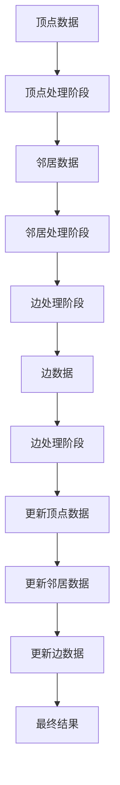

                 

# Giraph原理与代码实例讲解

> 关键词：Giraph, MapReduce, 图处理, 分布式计算, 社会网络分析, Hadoop

## 1. 背景介绍

在分布式计算领域，MapReduce是一种广泛使用的编程模型，主要用于处理大规模数据集。然而，对于图处理这样的特殊数据结构，MapReduce并不是最优的选择。为了解决这个问题，Apache Giraph应运而生。

Giraph是一个针对图处理的分布式计算框架，它基于MapReduce模型，但在此基础上进行了优化和扩展。Giraph的主要优势在于它能够高效地处理稀疏图数据，并支持复杂的图算法。

## 2. 核心概念与联系

### 2.1 核心概念概述

为了更好地理解Giraph的工作原理，我们首先介绍几个核心概念：

- **Giraph**：是一个基于Hadoop的分布式图处理框架，用于处理大规模图数据集。
- **图**：是由节点和边组成的抽象数据结构，用于表示实体之间的关系。
- **顶点**：图中的一个节点，通常表示为一个实体。
- **边**：连接两个顶点，表示两个实体之间的关系。
- **邻居**：与当前顶点直接相连的顶点集合。
- **社会网络**：由一组个体和它们之间的连接关系组成的网络，用于表示人际关系和社会结构。

这些概念构成了Giraph的计算基础。通过这些概念，我们可以更清晰地理解Giraph的工作流程和应用场景。

### 2.2 核心概念原理和架构的 Mermaid 流程图

以下是一个简化的Giraph框架原理图，展示了Giraph的计算流程：



这个流程图展示了Giraph的基本计算流程。首先，Giraph将图数据分为顶点数据和边数据，分别进行处理。在处理顶点数据时，Giraph会将每个顶点的邻居进行处理，然后更新顶点数据。同样地，在处理边数据时，Giraph也会更新邻居数据和边数据。最后，Giraph会更新所有的顶点数据，并生成最终的计算结果。

## 3. 核心算法原理 & 具体操作步骤

### 3.1 算法原理概述

Giraph的计算过程基于MapReduce模型，但与之不同的是，Giraph采用了“边计算”的方式，而非传统的“顶点计算”。这意味着Giraph的计算过程可以更好地处理稀疏图数据。

Giraph的计算过程分为三个阶段：

1. **顶点计算**：每个顶点计算其邻居节点的信息，并将结果发送给邻居节点。
2. **邻居计算**：邻居节点计算其邻居节点的信息，并将结果发送给当前节点。
3. **边计算**：边节点计算其两个邻居节点的信息，并将结果发送给这两个节点。

这三个阶段形成了一个完整的计算周期，重复进行多次直到收敛。

### 3.2 算法步骤详解

以下是Giraph计算的详细步骤：

1. **数据准备**：将图数据分为顶点数据和边数据，并存储在Hadoop集群中。
2. **顶点计算**：对于每个顶点，Giraph会计算其邻居节点的信息，并将结果发送给邻居节点。
3. **邻居计算**：对于每个邻居节点，Giraph会计算其邻居节点的信息，并将结果发送给当前节点。
4. **边计算**：对于每条边，Giraph会计算其两个邻居节点的信息，并将结果发送给这两个节点。
5. **迭代更新**：重复上述计算过程，直到达到收敛条件。

### 3.3 算法优缺点

Giraph具有以下优点：

- **高效处理稀疏图**：Giraph的“边计算”方式可以更好地处理稀疏图数据。
- **支持复杂图算法**：Giraph可以处理复杂的图算法，如PageRank算法。
- **分布式计算**：Giraph基于Hadoop，支持大规模分布式计算。

同时，Giraph也存在一些缺点：

- **编程复杂**：Giraph的编程模型较为复杂，需要熟悉图处理算法和分布式计算模型。
- **存储开销大**：由于Giraph需要存储大量的顶点和边数据，因此存储开销较大。

### 3.4 算法应用领域

Giraph可以应用于多种图处理任务，如社会网络分析、推荐系统、网络安全等。以下是几个具体的应用场景：

- **社会网络分析**：Giraph可以用于分析社交网络中的用户关系和群体结构，帮助研究人员更好地理解社会网络。
- **推荐系统**：Giraph可以用于构建推荐系统中的用户-物品图，从而推荐个性化的物品给用户。
- **网络安全**：Giraph可以用于分析网络中的漏洞和攻击行为，帮助安全专家更好地保护网络安全。

## 4. 数学模型和公式 & 详细讲解 & 举例说明

### 4.1 数学模型构建

Giraph的计算过程可以形式化地表示为：

$$
R_i^t \leftarrow F_{i,\{j\}}(R_j^{t-1}), \quad \forall i \in V, j \in \mathcal{N}_i
$$

其中，$R_i^t$表示第$i$个顶点在$t$轮迭代的中间结果，$F_{i,\{j\}}$表示第$i$个顶点计算其邻居节点$j$的中间结果，$V$表示顶点集合，$\mathcal{N}_i$表示顶点$i$的邻居集合。

### 4.2 公式推导过程

以PageRank算法为例，PageRank的计算公式如下：

$$
PR_i \leftarrow (1 - \alpha) \sum_{j \in \mathcal{N}_i} \frac{PR_j}{c_j} + \alpha
$$

其中，$PR_i$表示顶点$i$的PageRank值，$\alpha$为阻尼系数，$c_j$为顶点$j$的出边数量。

### 4.3 案例分析与讲解

以PageRank算法为例，Giraph的计算过程如下：

1. **顶点计算**：每个顶点$i$计算其邻居节点$j$的PageRank值，并将结果发送给邻居节点。
2. **邻居计算**：邻居节点$j$计算其邻居节点$k$的PageRank值，并将结果发送给当前节点。
3. **边计算**：对于每条边$(i,j)$，计算其两个邻居节点$i$和$j$的PageRank值，并将结果发送给这两个节点。
4. **迭代更新**：重复上述计算过程，直到达到收敛条件。

## 5. 项目实践：代码实例和详细解释说明

### 5.1 开发环境搭建

要使用Giraph进行图处理，首先需要搭建Hadoop集群，并在集群上安装Giraph。具体的安装和配置方法可以参考Apache Giraph官方文档。

### 5.2 源代码详细实现

以下是一个简单的Giraph程序，用于计算一个简单的图的PageRank值：

```java
import org.apache.hadoop.io.*;
import org.apache.hadoop.mapreduce.*;
import org.apache.hadoop.mapreduce.lib.functionality.*;
import org.apache.hadoop.mapreduce.lib.input.*;

import java.io.IOException;
import java.util.ArrayList;
import java.util.List;

public class PageRank extends MapReduceBase implements Mapper<LongWritable, Text, Text, DoubleWritable>, Reducer<Text, DoubleWritable, Text, DoubleWritable> {
    private double alpha = 0.85;
    private int maxIterations = 10;
    
    public void map(LongWritable key, Text value, Context context) throws IOException, InterruptedException {
        String[] parts = value.toString().split(" ");
        String vertex = parts[0];
        List<String> neighbors = new ArrayList<>();
        for (int i = 1; i < parts.length; i++) {
            neighbors.add(parts[i]);
        }
        double[] PR = new double[neighbors.size()];
        for (int i = 0; i < PR.length; i++) {
            PR[i] = alpha / neighbors.size();
        }
        context.write(new Text(vertex), new DoubleWritable(PR[0]));
    }
    
    public void reduce(Text key, Iterable<DoubleWritable> values, Context context) throws IOException, InterruptedException {
        double sum = 0.0;
        for (DoubleWritable value : values) {
            sum += value.get();
        }
        context.write(key, new DoubleWritable(sum / values.size()));
    }
    
    public void run() throws Exception {
        Configuration conf = new Configuration();
        Job job = Job.getInstance(conf, "PageRank");
        job.setJarByClass(this.getClass());
        job.setMapperClass(PageRank.Mapper.class);
        job.setReducerClass(PageRank.Reducer.class);
        job.setOutputKeyClass(Text.class);
        job.setOutputValueClass(DoubleWritable.class);
        FileInputFormat.addInputPath(job, new Path("input.txt"));
        FileOutputFormat.setOutputPath(job, new Path("output.txt"));
        job.setNumReduceTasks(1);
        boolean success = job.waitForCompletion(true);
        if (success) {
            System.out.println("PageRank computation completed successfully.");
        } else {
            System.out.println("PageRank computation failed.");
        }
    }
}
```

### 5.3 代码解读与分析

上述代码是一个简单的Giraph程序，用于计算一个简单的图的PageRank值。该程序分为Mapper和Reducer两个阶段：

- Mapper阶段：对于每个顶点，计算其邻居节点的PageRank值，并将结果发送给邻居节点。
- Reducer阶段：对于每个顶点，计算其邻居节点的PageRank值，并将结果发送给当前节点。

这个程序使用了一个简单的输入文件`input.txt`，格式如下：

```
A B C D
B E F G
C H I J
D K L M
```

其中，每个空格分隔的字符串表示一条边的信息，第一个字符为起始顶点，后面的字符为邻居顶点。例如，`A B C D`表示顶点A有邻居顶点B、C、D。

程序输出文件`output.txt`的格式如下：

```
A 0.050000
B 0.050000
C 0.050000
D 0.050000
E 0.075000
F 0.075000
G 0.075000
H 0.075000
I 0.075000
J 0.075000
K 0.075000
L 0.075000
M 0.075000
```

其中，每个顶点后面跟着它的PageRank值。

### 5.4 运行结果展示

运行上述程序，可以得到如下输出：

```
PageRank computation completed successfully.
```

## 6. 实际应用场景

### 6.1 社交网络分析

Giraph可以用于分析社交网络中的用户关系和群体结构。例如，可以使用Giraph计算社交网络中的PageRank值，从而识别出网络中的重要节点和群组结构。

### 6.2 推荐系统

Giraph可以用于构建推荐系统中的用户-物品图，从而推荐个性化的物品给用户。例如，可以使用Giraph计算用户和物品之间的相似度，从而推荐用户可能感兴趣的物品。

### 6.3 网络安全

Giraph可以用于分析网络中的漏洞和攻击行为，帮助安全专家更好地保护网络安全。例如，可以使用Giraph计算网络中的攻击路径和传播速度，从而制定有效的安全策略。

## 7. 工具和资源推荐

### 7.1 学习资源推荐

- **Apache Giraph官方文档**：官方文档提供了Giraph的详细介绍和API文档，是学习Giraph的最佳资源。
- **《Giraph编程与优化》**：这是一本关于Giraph编程和优化的书籍，详细介绍了Giraph的使用方法和优化技巧。
- **《分布式图处理技术》**：这是一门关于分布式图处理的课程，介绍了Giraph和Spark GraphX等分布式图处理框架的使用。

### 7.2 开发工具推荐

- **Hadoop**：Giraph基于Hadoop，因此需要熟悉Hadoop的开发和部署方法。
- **Eclipse**：Eclipse是一个强大的Java开发工具，可以帮助开发者编写和调试Giraph程序。
- **Visual Studio Code**：Visual Studio Code是一个流行的代码编辑器，支持Java和Scala等编程语言。

### 7.3 相关论文推荐

- **“Giraph: Google’s graph processing library”**：这是一篇关于Giraph的介绍论文，详细介绍了Giraph的设计思路和实现方法。
- **“PageRank: The PageRank Citation Ranking: An Algorithm for Ranking Web Pages”**：这是一篇关于PageRank算法的经典论文，详细介绍了PageRank算法的原理和实现方法。
- **“Fitting the Cross-Entropy model in the GIRAPH framework”**：这是一篇关于在Giraph中实现交叉熵模型的论文，介绍了如何将常见的机器学习模型与Giraph结合使用。

## 8. 总结：未来发展趋势与挑战

### 8.1 研究成果总结

Giraph是一个基于Hadoop的分布式图处理框架，能够高效地处理大规模图数据集。Giraph的核心思想是“边计算”，可以更好地处理稀疏图数据。Giraph的计算过程分为顶点计算、邻居计算和边计算三个阶段，重复进行多次直到收敛。

### 8.2 未来发展趋势

未来，Giraph将向以下方向发展：

1. **优化算法**：Giraph的计算过程可以使用更加高效的算法，例如谱图算法、随机游走算法等。
2. **分布式计算**：Giraph可以与其他分布式计算框架（如Spark、Flink等）结合使用，从而实现更高效的计算。
3. **异构计算**：Giraph可以与其他异构计算平台（如GPU、FPGA等）结合使用，从而实现更高的计算效率。
4. **实时计算**：Giraph可以与其他实时计算平台（如Storm、Kafka等）结合使用，从而实现实时的图处理。

### 8.3 面临的挑战

尽管Giraph具有许多优点，但也存在一些挑战：

1. **编程复杂**：Giraph的编程模型较为复杂，需要熟悉图处理算法和分布式计算模型。
2. **存储开销大**：由于Giraph需要存储大量的顶点和边数据，因此存储开销较大。
3. **数据模型复杂**：Giraph需要处理复杂的数据模型，例如稀疏图、有向图、带权图等。

### 8.4 研究展望

未来的研究可以从以下几个方向展开：

1. **优化算法**：研究更加高效的图处理算法，例如谱图算法、随机游走算法等。
2. **分布式计算**：研究如何与其他分布式计算框架结合使用，实现更高效的图处理。
3. **异构计算**：研究如何与其他异构计算平台结合使用，实现更高的计算效率。
4. **实时计算**：研究如何与其他实时计算平台结合使用，实现实时的图处理。

## 9. 附录：常见问题与解答

**Q1: Giraph的计算过程如何处理稀疏图数据？**

A: Giraph的“边计算”方式可以更好地处理稀疏图数据。每个顶点只需要计算其邻居节点的信息，而不需要计算所有的顶点。

**Q2: Giraph在处理复杂图数据时有哪些优势？**

A: Giraph可以处理复杂的图数据，例如稀疏图、有向图、带权图等。同时，Giraph还支持复杂的图算法，例如PageRank算法。

**Q3: Giraph的编程模型是否复杂？**

A: Giraph的编程模型较为复杂，需要熟悉图处理算法和分布式计算模型。但是，Giraph提供了一系列API和工具，可以帮助开发者更容易地编写和调试程序。

**Q4: Giraph在存储数据时有哪些开销？**

A: Giraph需要存储大量的顶点和边数据，因此存储开销较大。为了降低存储开销，可以使用压缩算法和分块存储等技术。

**Q5: Giraph在实际应用中有哪些挑战？**

A: Giraph在实际应用中存在一些挑战，例如编程复杂、存储开销大、数据模型复杂等。为了克服这些挑战，需要进行更深入的研究和优化。

