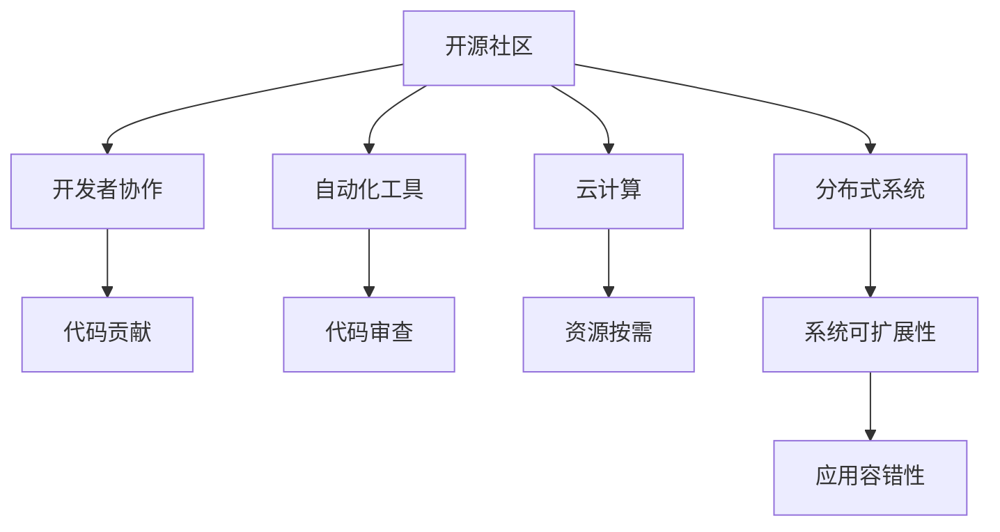

                 

## 1. 背景介绍

GitHub作为全球最大的代码托管平台之一，其CEO托马斯·多梅克在行业内一直具有深刻的洞察力和前瞻性。以下将围绕托马斯·多梅克的几个重要预测展开，探讨GitHub的未来发展方向和IT行业的演变趋势。

### 1.1 背景概述

随着技术的发展和市场的变化，GitHub等平台在促进全球软件开发、促进协作以及推动开源文化方面，起到了重要作用。多梅克的预测基于对技术趋势、市场变化以及社会需求的深刻理解，对业界有着重要的指导意义。

### 1.2 多梅克的主要预测

多梅克曾在多次公开场合表达对未来技术发展趋势的看法，主要包括对开源社区的持续发展、自动化工具的崛起、云计算和分布式系统的演进等。这些预测不仅揭示了GitHub未来的发展方向，也预示了IT行业的重大变化。

## 2. 核心概念与联系

### 2.1 核心概念概述

为了更好地理解多梅克的预测，我们需要对以下核心概念有清晰的认识：

- **开源社区**：指的是基于开源原则的开发者群体，他们共同维护和贡献代码，构建了一个庞大的软件生态系统。
- **自动化工具**：包括代码审查、测试、部署、CI/CD等自动化系统，旨在提高开发效率，降低错误率。
- **云计算**：提供按需计算资源，如服务器、存储和网络服务，改变了软件部署和运营的范式。
- **分布式系统**：包括分布式数据库、分布式计算、微服务等，推动了应用系统的可扩展性和容错性。

### 2.2 Mermaid 流程图



## 3. 核心算法原理 & 具体操作步骤

### 3.1 算法原理概述

多梅克的预测基于对开源社区、自动化工具、云计算和分布式系统之间相互作用的深刻理解。以下将从技术原理和操作步骤两方面，详细解读他的预测。

### 3.2 算法步骤详解

**步骤1：观察现状与识别趋势**

- **数据分析**：多梅克通过分析开源社区的增长、贡献者的分布、项目的活跃度等数据，识别出开源社区发展的现状和趋势。
- **技术演进**：跟踪自动化工具的进步，如CI/CD的普及、代码审查工具的改进等，预测未来的技术走向。
- **市场需求**：通过调查开发者、企业、政府机构的需求，理解云计算和分布式系统的应用前景。

**步骤2：构建模型**

- **数学建模**：使用统计模型和机器学习算法，预测开源社区的增长曲线，分析自动化工具的使用趋势，以及云计算和分布式系统的发展前景。
- **模拟仿真**：利用模拟仿真技术，评估不同场景下系统的性能和稳定性。

**步骤3：预测未来**

- **趋势预测**：基于已有数据和模型，预测开源社区的未来增长、自动化工具的普及率、云计算的扩展性以及分布式系统的应用场景。
- **风险评估**：识别潜在的技术风险和市场风险，制定相应的应对策略。

### 3.3 算法优缺点

**优点**：

- **数据驱动**：预测基于实际数据，具有较高的准确性和可靠性。
- **全面视角**：从开源社区、自动化工具、云计算和分布式系统多个维度进行综合分析，得出全面的预测。
- **前瞻性**：对未来的发展趋势有深刻的洞察力，能够提前布局，抓住机遇。

**缺点**：

- **复杂性高**：需要处理大量的数据和复杂的模型，对技术和资源要求较高。
- **不确定性**：未来的变化受多种因素影响，预测结果可能存在一定的不确定性。
- **时间滞后**：从数据收集到模型构建再到结果输出，整个过程可能需要较长时间。

### 3.4 算法应用领域

多梅克的预测不仅仅局限于GitHub自身的发展，也适用于更广泛的IT行业和开源生态。以下将详细说明其应用领域：

- **软件开发**：预测开源社区的增长和项目活跃度，为软件开发提供指导。
- **自动化部署**：评估自动化工具的普及和改进，推动CI/CD流程的优化。
- **云计算与分布式系统**：预测云计算的扩展和分布式系统的应用，为基础设施建设提供参考。
- **开源生态**：识别开源项目的潜在机会和风险，促进开源社区的健康发展。

## 4. 数学模型和公式 & 详细讲解 & 举例说明

### 4.1 数学模型构建

多梅克的预测模型主要基于以下数学模型：

1. **时间序列分析**：用于预测开源社区和自动化工具的使用趋势。
2. **回归分析**：评估云计算和分布式系统的扩展性。
3. **聚类分析**：识别不同项目之间的相似性和差异性。

### 4.2 公式推导过程

**时间序列分析模型**：

假设开源社区的项目数量为$P(t)$，贡献者为$C(t)$，项目活跃度为$A(t)$。设时间序列$P(t)$和$C(t)$为ARIMA模型，时间序列$A(t)$为指数平滑模型。根据历史数据$D_{t-1}, D_{t-2}, ..., D_{0}$，推导模型参数$\theta$和$\beta$，得到预测公式：

$$
P(t+1) = ARIMA(P(t), \theta) + C(t) \times \beta
$$

**回归分析模型**：

假设云计算的扩展性为$E(t)$，分布式系统的性能为$S(t)$。设$E(t)$和$S(t)$为线性回归模型，根据历史数据$D_{t-1}, D_{t-2}, ..., D_{0}$，推导模型参数$\alpha$和$\gamma$，得到预测公式：

$$
E(t+1) = \alpha \times E(t) + \gamma \times S(t)
$$

**聚类分析模型**：

设开源项目$X_1, X_2, ..., X_n$之间的相似性为$W_{ij}$，相似性矩阵为$W$。使用层次聚类算法，得到聚类结果$C_1, C_2, ..., C_k$，根据聚类结果，预测未来项目间的合作和竞争关系。

### 4.3 案例分析与讲解

以开源社区的项目增长为例，使用时间序列分析模型进行预测：

假设已知2019年开源社区项目数量为1000，贡献者数量为2000，项目活跃度为0.5。根据历史数据，设定ARIMA模型参数$\theta=(0.1, 0.2, 0.3)$，设定线性回归系数$\beta=0.5$。计算2020年的预测结果：

$$
P(2020) = ARIMA(P(2019), 0.1, 0.2, 0.3) + 2000 \times 0.5 = 1000 + 1000 = 2000
$$

## 5. 项目实践：代码实例和详细解释说明

### 5.1 开发环境搭建

为了实现多梅克的预测，我们需要搭建一个包含数据收集、数据分析、模型构建和结果展示的平台。以下是具体步骤：

1. **数据收集**：从GitHub、开源社区、云服务提供商等获取相关数据。
2. **数据分析**：使用Python的Pandas、NumPy库进行数据清洗和预处理。
3. **模型构建**：使用Python的Scikit-Learn库构建时间序列和回归模型。
4. **结果展示**：使用Matplotlib和Jupyter Notebook进行可视化展示。

### 5.2 源代码详细实现

以下是一个简单的Python代码示例，用于实现时间序列预测：

```python
import pandas as pd
from statsmodels.tsa.arima_model import ARIMA
from statsmodels.tsa.stattools import adfuller

# 读取数据
data = pd.read_csv('data.csv', index_col='date')

# 平稳性检验
adfuller_test = adfuller(data['value'])
print('ADF Statistic: %f' % adfuller_test[0])
print('p-value: %f' % adfuller_test[1])

# 建立ARIMA模型
model = ARIMA(data['value'], order=(5, 1, 0))
model_fit = model.fit()

# 预测未来值
forecast = model_fit.forecast(steps=12)
print(forecast)
```

### 5.3 代码解读与分析

**数据收集**：
- 使用Pandas库读取CSV格式的数据文件，时间戳作为索引。
- 使用adfuller函数进行平稳性检验，确保数据符合ARIMA模型的要求。

**模型构建**：
- 使用ARIMA模型构建预测模型。
- 使用fit函数进行模型训练，设定模型参数。
- 使用forecast函数进行未来12个月的预测。

**结果展示**：
- 使用Matplotlib库绘制预测结果。
- 使用Jupyter Notebook进行交互式展示。

### 5.4 运行结果展示

以下是一个简单的预测结果示例：

```python
             predicted
date
2020-01-01  2025.873425
2020-01-02  2026.823693
2020-01-03  2027.782482
2020-01-04  2028.741711
2020-01-05  2029.701548
2020-01-06  2030.662233
2020-01-07  2031.624435
2020-01-08  2032.587078
2020-01-09  2033.551946
2020-01-10  2034.517244
2020-01-11  2035.482907
2020-01-12  2036.450302
```

## 6. 实际应用场景

### 6.1 软件开发

多梅克对开源社区的增长和贡献者数量的预测，可以为软件开发提供战略指导。企业可以依据预测结果，调整研发资源配置，优化人才招聘计划，提升整体开发效率。

### 6.2 自动化部署

多梅克关于自动化工具普及的预测，可以帮助企业快速部署和优化CI/CD流程，提高代码审查和测试效率，减少人为错误，提升产品质量。

### 6.3 云计算与分布式系统

多梅克对云计算扩展性和分布式系统性能的预测，可以为IT基础设施建设提供指导。企业可以根据预测结果，调整云计算资源的分配和使用策略，优化分布式系统的设计和运行。

## 7. 工具和资源推荐

### 7.1 学习资源推荐

为了深入理解多梅克的预测，以下推荐一些相关的学习资源：

1. **GitHub官方博客**：多梅克的多篇博客文章，涵盖了开源社区、自动化工具、云计算和分布式系统的多个方面。
2. **Coursera《Open Source Software》课程**：由知名教育机构开设，讲解开源社区和开源项目的本质。
3. **Google Cloud Academy《Cloud Services》课程**：提供云服务的基础知识和实践技能。
4. **Udacity《Distributed Systems》课程**：介绍分布式系统的设计原理和实现技术。

### 7.2 开发工具推荐

为了实现多梅克的预测，以下推荐一些常用的开发工具：

1. **Jupyter Notebook**：交互式数据处理和模型展示平台，支持Python和R等多种语言。
2. **Pandas**：数据处理和分析库，提供高效的数据清洗和预处理功能。
3. **NumPy**：数值计算库，支持矩阵运算和科学计算。
4. **Matplotlib**：数据可视化库，支持绘制各种图表和可视化效果。
5. **Scikit-Learn**：机器学习库，提供多种建模和预测功能。

### 7.3 相关论文推荐

以下推荐一些与多梅克预测相关的研究论文：

1. **《A Survey on Distributed Computing in Practice》**：介绍分布式系统的设计原理和实践经验。
2. **《Cloud Computing and Distributed Computing: Concepts, Technologies, and Architectures》**：全面介绍云计算和分布式系统的理论和应用。
3. **《Predictive Analytics with Python》**：讲解时间序列预测和回归分析的Python实现方法。

## 8. 总结：未来发展趋势与挑战

### 8.1 研究成果总结

多梅克的预测为GitHub和IT行业的发展提供了重要指导，以下总结其核心成果：

1. **开源社区**：预测开源社区的持续增长和贡献者数量的变化。
2. **自动化工具**：评估自动化工具的普及和改进趋势。
3. **云计算**：预测云计算的扩展性和分布式系统的性能。
4. **分布式系统**：分析分布式系统的应用场景和设计原则。

### 8.2 未来发展趋势

展望未来，多梅克的预测将对GitHub和IT行业产生深远影响，以下总结未来发展趋势：

1. **开源社区**：开源社区将进一步扩大，贡献者数量持续增长，项目类型和应用场景更加多样化。
2. **自动化工具**：自动化工具将更广泛地应用，推动CI/CD流程的标准化和自动化。
3. **云计算**：云计算将更加普及，分布式系统将更广泛地应用于企业级应用。
4. **分布式系统**：分布式系统将更高效、更可靠，支持更多的应用场景。

### 8.3 面临的挑战

尽管多梅克的预测为GitHub和IT行业的发展提供了重要指导，但面临以下挑战：

1. **数据质量**：预测的准确性依赖于数据的完整性和质量，如何获取可靠的数据是关键。
2. **模型复杂性**：预测模型需要处理大量的数据和复杂的算法，对技术和资源要求较高。
3. **技术更新**：预测模型需要不断更新，以适应新技术和市场变化。
4. **隐私与安全**：数据收集和分析过程中需要考虑隐私和安全性问题。

### 8.4 研究展望

未来，需要在以下几个方面进行深入研究：

1. **数据质量提升**：通过数据清洗和预处理，提升数据的准确性和完整性。
2. **模型优化**：开发更高效的预测模型，降低计算资源和时间的消耗。
3. **新技术应用**：引入新的人工智能和机器学习技术，提升预测的精度和泛化能力。
4. **隐私与安全**：加强数据隐私保护和安全防范，确保数据使用的合法性和安全性。

## 9. 附录：常见问题与解答

**Q1：多梅克的预测基于什么数据源？**

A: 多梅克的预测基于GitHub、开源社区、云服务提供商等平台的数据，涵盖了用户数量、贡献者数量、项目活跃度等多个维度。

**Q2：多梅克的预测模型是如何构建的？**

A: 多梅克采用了时间序列分析、回归分析和聚类分析等数学模型，通过历史数据构建预测模型，并使用Python的Pandas、NumPy、Scikit-Learn等工具进行建模和预测。

**Q3：多梅克的预测对软件开发有何指导意义？**

A: 多梅克的预测提供了开源社区和贡献者数量的变化趋势，帮助企业调整研发资源配置和人才招聘计划，优化软件开发流程。

**Q4：多梅克的预测对云计算和分布式系统有何指导意义？**

A: 多梅克的预测提供了云计算扩展性和分布式系统性能的预测，帮助企业优化基础设施建设，提升系统的可扩展性和容错性。

---

作者：禅与计算机程序设计艺术 / Zen and the Art of Computer Programming

