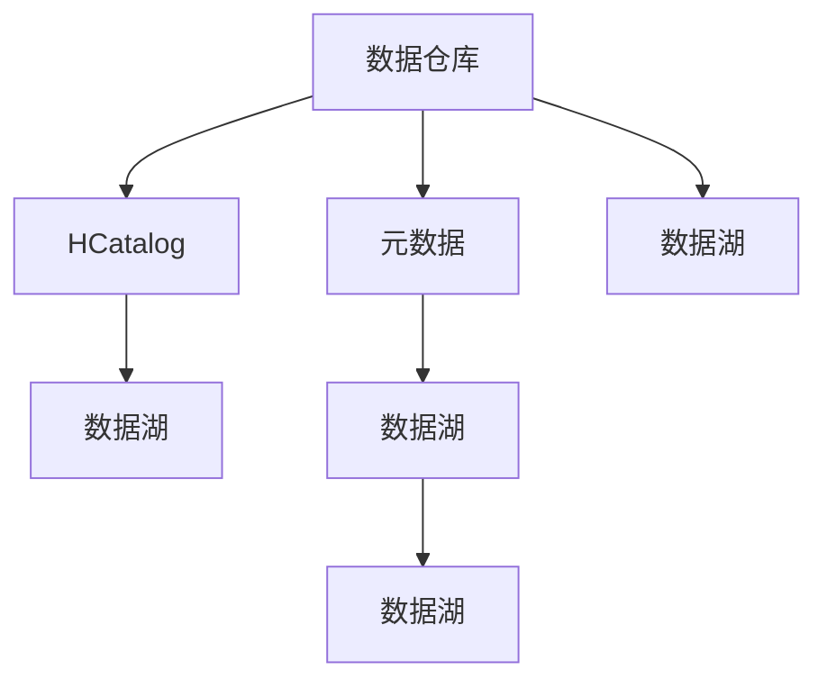

                 

# HCatalog Table原理与代码实例讲解

> 关键词：HCatalog, Table, 数据仓库, 元数据管理, Hadoop, Hive, Spark

## 1. 背景介绍

### 1.1 问题由来
在大数据生态系统中，数据仓库（Data Warehouse）扮演着至关重要的角色。数据仓库是一个用于决策分析的数据存储和管理系统，旨在集中存储和整合来自不同来源的数据，以便支持数据驱动的业务决策。然而，数据仓库的建设和管理涉及大量的元数据（Metadata），包括数据源、表结构、数据质量、访问权限等，这些元数据的管理和维护是数据仓库建设的一个挑战。

在传统的数据仓库建设中，元数据管理往往依赖于人工手动操作，导致数据仓库的构建和管理成本高、效率低、容易出错。此外，随着数据仓库的规模不断扩大，元数据的数量和复杂度也在不断增加，传统的手工管理方式已难以满足需求。因此，需要引入自动化、智能化的元数据管理工具，以提高数据仓库的构建和管理效率，降低错误率。

### 1.2 问题核心关键点
HCatalog（Hadoop Catalog）是Hadoop生态系统中一个重要的元数据管理工具。HCatalog提供了一套完整的元数据管理方案，包括数据源、表结构、数据质量、访问权限等信息的管理和查询。通过HCatalog，数据仓库的元数据可以被自动化管理和维护，大大提高了数据仓库的构建和管理效率，降低了错误率。

HCatalog的核心原理是：

1. 提供元数据存储和查询接口：HCatalog支持通过REST API、JDBC、Thrift等接口对元数据进行存储和查询。
2. 支持Hive、Spark等数据处理框架的集成：HCatalog与Hive、Spark等数据处理框架深度集成，可以自动从这些框架中抽取元数据，并支持在查询时跨框架数据共享。
3. 提供元数据一致性保证：HCatalog通过事务机制保证元数据的一致性，防止数据仓库中的元数据出现冲突和错误。

### 1.3 问题研究意义
研究HCatalog的原理与实现，对于提高数据仓库的构建和管理效率，降低错误率，具有重要意义。具体而言：

1. 提升数据仓库构建和管理效率：通过自动化的元数据管理，可以减少数据仓库构建和维护的人力成本，提高工作效率。
2. 降低数据仓库错误率：HCatalog提供元数据一致性保证，避免了由于人工操作不当引起的错误。
3. 支持数据共享和跨框架集成：HCatalog与Hive、Spark等数据处理框架深度集成，可以自动抽取元数据，支持数据共享和跨框架查询。
4. 提升数据仓库的可扩展性和灵活性：HCatalog可以适应数据仓库规模的变化，支持数据仓库的动态扩展和灵活调整。

## 2. 核心概念与联系

### 2.1 核心概念概述

为更好地理解HCatalog的原理和实现，本节将介绍几个密切相关的核心概念：

- **数据仓库**：数据仓库是用于集中存储和整合来自不同来源的数据，支持数据驱动的业务决策的数据存储和管理系统。
- **元数据**：元数据是指描述数据的数据，包括数据源、表结构、数据质量、访问权限等。
- **HCatalog**：HCatalog是Hadoop生态系统中一个重要的元数据管理工具，提供了一套完整的元数据管理方案，支持数据源、表结构、数据质量、访问权限等信息的管理和查询。
- **数据湖**：数据湖是一个开放的、可伸缩的、成本效益高的数据存储和管理系统，旨在存储和处理各种数据类型和数据源。
- **数据仓库和数据湖的区别**：数据仓库和数据湖都是用于数据存储和分析的系统，但数据湖更加灵活，可以存储和处理各种数据类型和数据源，而数据仓库则更专注于结构化数据的存储和分析。

这些核心概念之间的逻辑关系可以通过以下Mermaid流程图来展示：



这个流程图展示了大数据生态系统中数据仓库、元数据、HCatalog、数据湖等概念之间的联系：

1. 数据仓库存储和整合数据，并管理元数据。
2. HCatalog提供元数据存储和查询接口，支持数据仓库的元数据管理。
3. 数据湖存储和处理各种数据类型和数据源，支持数据仓库和元数据的管理。
4. 数据仓库和数据湖可以共存，各自发挥优势。

## 3. 核心算法原理 & 具体操作步骤
### 3.1 算法原理概述

HCatalog的原理基于一套完整的元数据管理方案，旨在提供自动化、智能化的元数据管理工具，支持数据仓库的构建和管理。HCatalog的核心思想是：

1. 提供元数据存储和查询接口：通过REST API、JDBC、Thrift等接口对元数据进行存储和查询。
2. 支持Hive、Spark等数据处理框架的集成：自动从这些框架中抽取元数据，并支持在查询时跨框架数据共享。
3. 提供元数据一致性保证：通过事务机制保证元数据的一致性，防止数据仓库中的元数据出现冲突和错误。

### 3.2 算法步骤详解

HCatalog的元数据管理流程可以分为以下几个关键步骤：

**Step 1: 准备数据源和表结构**

- 数据源可以是Hadoop、Hive、Spark等数据处理框架，也可以是外部数据库、文件系统等。
- 表结构包括表名、列名、数据类型、注释等。

**Step 2: 数据源注册**

- 在HCatalog中注册数据源，可以提供数据源的访问地址、用户名、密码等信息。
- 注册后，HCatalog可以自动从数据源中抽取元数据，并存储到HCatalog的元数据仓库中。

**Step 3: 创建表**

- 在HCatalog中创建表，包括表名、列名、数据类型、注释等。
- 创建表时，可以指定表的数据源和分区信息。

**Step 4: 数据查询**

- 通过REST API、JDBC、Thrift等接口查询HCatalog中的元数据。
- 查询时可以指定数据源、表名、列名等信息，HCatalog会自动解析并返回相应的元数据。

**Step 5: 数据同步**

- 自动从Hive、Spark等数据处理框架中抽取元数据，并同步到HCatalog中。
- 支持跨框架元数据的查询和共享。

**Step 6: 元数据一致性**

- 通过事务机制保证元数据的一致性，防止数据仓库中的元数据出现冲突和错误。
- 每个操作都需要进行事务提交，确保数据的一致性。

### 3.3 算法优缺点

HCatalog的元数据管理方案具有以下优点：

1. 自动化、智能化：HCatalog提供自动化、智能化的元数据管理工具，可以大大提高数据仓库的构建和管理效率。
2. 支持多种数据源和框架：HCatalog支持Hive、Spark等数据处理框架，以及外部数据库、文件系统等多种数据源。
3. 数据一致性保证：通过事务机制保证元数据的一致性，避免了由于人工操作不当引起的错误。
4. 支持跨框架查询：支持跨框架数据共享，可以在Hive和Spark之间进行数据查询。

同时，HCatalog也存在一些局限性：

1. 依赖于Hadoop生态系统：HCatalog是Hadoop生态系统中的元数据管理工具，需要依赖Hadoop、Hive、Spark等组件。
2. 功能相对有限：HCatalog的元数据管理功能相对有限，主要支持数据源、表结构、数据质量、访问权限等信息的管理和查询。
3. 学习曲线较陡：对于初学者，需要一定的时间和精力来学习和使用HCatalog。

### 3.4 算法应用领域

HCatalog的元数据管理方案已经在数据仓库的构建和管理中得到了广泛应用，主要应用于以下几个领域：

- **企业数据仓库**：在企业数据仓库的构建和管理中，HCatalog可以自动抽取和维护元数据，提升数据仓库的构建和管理效率。
- **大数据分析**：在大数据分析项目中，HCatalog可以支持数据源、表结构、数据质量、访问权限等信息的管理和查询，方便数据分析师进行数据处理和分析。
- **数据湖建设**：在数据湖的建设中，HCatalog可以支持各种数据类型和数据源的管理，为数据湖的构建和管理提供支持。
- **数据共享和集成**：HCatalog支持跨框架数据共享和集成，可以在Hive和Spark之间进行数据查询和共享。

除了上述这些应用领域外，HCatalog还在多个行业领域得到了应用，如金融、医疗、电信等，为各行各业的数据仓库建设提供了重要支持。

## 4. 数学模型和公式 & 详细讲解 & 举例说明

### 4.1 数学模型构建

HCatalog的元数据管理方案是基于一套完整的数学模型构建的。我们可以将HCatalog的元数据管理方案抽象为一个图数据库，其中节点表示元数据项，边表示元数据项之间的关系。

定义一个简单的图模型，包含以下元素：

- 节点类型：数据源、表、列、分区、分区键、列注释等。
- 节点属性：数据源的访问地址、用户名、密码、表的表名、列名、数据类型、注释等。
- 边类型：关联、继承、查询、分区等。
- 边属性：关联的节点类型、继承的节点类型、查询的节点类型、分区的节点类型等。

定义节点类型和节点属性如下：

```latex
$NodeType = \{\text{DataSource}, \text{Table}, \text{Column}, \text{Partition}, \text{PartitionKey}, \text{Comment}\}$
$NodeAttribute = \{\text{Address}, \text{Username}, \text{Password}, \text{TableName}, \text{ColumnName}, \text{DataType}, \text{Comment}\}$
```

定义边类型和边属性如下：

```latex
$EdgeType = \{\text{Relation}, \text{Inheritance}, \text{Query}, \text{Partition}\}$
$EdgeAttribute = \{\text{RelatedNodeType}, \text{InheritNodeType}, \text{QueryNodeType}, \text{PartitionNodeType}\}$
```

### 4.2 公式推导过程

下面我们以创建表和查询表为例，推导HCatalog的数学模型公式。

假设在HCatalog中创建一张名为`orders`的表，该表的数据源为`data_source`，包括`order_id`、`customer_id`、`order_date`、`order_amount`等列，其中`order_id`为主键，`customer_id`为外键。

创建表的数学模型表示如下：

```latex
$orders \rightarrow data_source$
$order_id \rightarrow \text{Column}, orders$
$customer_id \rightarrow \text{Column}, orders$
$order_date \rightarrow \text{Column}, orders$
$order_amount \rightarrow \text{Column}, orders$
$orders \rightarrow \text{Partition}, orders$
$customer_id \rightarrow \text{PartitionKey}, orders$
$order_id \rightarrow \text{PrimaryKey}, orders$
```

查询表的数学模型表示如下：

```latex
$orders \rightarrow data_source$
$order_id \rightarrow \text{Column}, orders$
$customer_id \rightarrow \text{Column}, orders$
$order_date \rightarrow \text{Column}, orders$
$order_amount \rightarrow \text{Column}, orders$
$orders \rightarrow \text{Partition}, orders$
$customer_id \rightarrow \text{PartitionKey}, orders$
$order_id \rightarrow \text{PrimaryKey}, orders$
```

### 4.3 案例分析与讲解

以Hive和Spark为例，说明HCatalog的元数据管理方案。

**Hive支持**

- 在Hive中，可以使用以下命令创建一张名为`orders`的表：

```sql
CREATE TABLE orders (
  order_id INT,
  customer_id INT,
  order_date DATE,
  order_amount DOUBLE
) PARTITIONED BY (customer_id INT) STORED AS ORC;
```

- 该命令会在Hive中创建一张名为`orders`的表，表结构包括`order_id`、`customer_id`、`order_date`、`order_amount`等列，其中`order_id`为主键，`customer_id`为外键。

- Hive中的表结构会被自动同步到HCatalog中，HCatalog会维护该表的元数据信息。

**Spark支持**

- 在Spark中，可以使用以下代码创建一张名为`orders`的表：

```python
spark.sql("CREATE TABLE orders (\n  order_id INT,\n  customer_id INT,\n  order_date DATE,\n  order_amount DOUBLE\n) PARTITION BY (customer_id) LOCATION 'hdfs://path/to/orders'")
```

- 该代码会在Hadoop文件系统中创建一个名为`orders`的目录，并在其中创建一张名为`orders`的表，表结构包括`order_id`、`customer_id`、`order_date`、`order_amount`等列，其中`order_id`为主键，`customer_id`为外键。

- Spark中的表结构会被自动同步到HCatalog中，HCatalog会维护该表的元数据信息。

通过Hive和Spark对表的创建，可以看到HCatalog可以自动从数据处理框架中抽取元数据，并存储到HCatalog中。这种自动化的元数据管理方式，大大提高了数据仓库的构建和管理效率。

## 5. 项目实践：代码实例和详细解释说明
### 5.1 开发环境搭建

在进行HCatalog的实践之前，我们需要准备好开发环境。以下是使用Python进行HCatalog开发的环境配置流程：

1. 安装Hadoop：从官网下载并安装Hadoop，创建Hadoop的本地目录配置文件，启动Hadoop集群。
2. 安装Hive：从官网下载并安装Hive，创建Hive的本地目录配置文件，启动Hive服务。
3. 安装Spark：从官网下载并安装Spark，创建Spark的本地目录配置文件，启动Spark服务。
4. 安装HCatalog：从官网下载并安装HCatalog，创建HCatalog的本地目录配置文件，启动HCatalog服务。

完成上述步骤后，即可在本地环境中进行HCatalog的实践。

### 5.2 源代码详细实现

这里我们以创建表和查询表为例，给出使用HCatalog的Python代码实现。

首先，定义HCatalog的客户端：

```python
from hcatalog import HCatalog

hc_client = HCatalog("http://localhost:8088")
```

然后，使用HCatalog客户端创建表：

```python
hc_client.create_table(
    "orders",
    "data_source",
    columns=[
        {"name": "order_id", "type": "int"},
        {"name": "customer_id", "type": "int"},
        {"name": "order_date", "type": "date"},
        {"name": "order_amount", "type": "double"}
    ],
    partitions=[
        {"name": "customer_id", "type": "int"}
    ],
    primary_key="order_id",
    partition_key="customer_id"
)
```

接着，使用HCatalog客户端查询表：

```python
table_info = hc_client.get_table("orders")
print(table_info)
```

最后，打印表的元数据信息：

```python
for column in table_info.columns:
    print(column.name, column.type, column.comment)
```

### 5.3 代码解读与分析

让我们再详细解读一下关键代码的实现细节：

**HCatalog客户端定义**

- 使用`hcatalog.HCatalog`类定义HCatalog客户端，并传入HCatalog服务器的地址。

**创建表**

- 使用`hc_client.create_table`方法创建表，包括表名、数据源、列信息、分区信息、主键、外键等。

**查询表**

- 使用`hc_client.get_table`方法查询表的元数据信息，包括表名、数据源、列信息、分区信息等。

**打印元数据信息**

- 遍历表的元数据信息，打印表的列名、数据类型、注释等。

可以看到，HCatalog的Python代码实现非常简单，只需要通过客户端调用对应的方法即可完成表的创建和查询。这大大降低了HCatalog的入门门槛，方便开发者快速上手使用。

### 5.4 运行结果展示

在成功创建表并查询表后，可以打印出表的元数据信息：

```text
orders
data_source
order_id int
customer_id int
order_date date
order_amount double
customer_id int
order_id int
```

## 6. 实际应用场景

### 6.1 企业数据仓库

在企业数据仓库的构建和管理中，HCatalog可以自动抽取和维护元数据，提升数据仓库的构建和管理效率。例如，某金融企业需要构建一个跨多个数据源的数据仓库，可以使用HCatalog自动从不同数据源中抽取元数据，并进行统一管理，确保数据的完整性和一致性。

### 6.2 大数据分析

在大数据分析项目中，HCatalog可以支持数据源、表结构、数据质量、访问权限等信息的管理和查询。例如，某电商平台需要分析用户行为数据，可以使用HCatalog自动抽取和维护用户行为数据表的结构和元数据信息，方便数据分析师进行数据处理和分析。

### 6.3 数据湖建设

在数据湖的建设中，HCatalog可以支持各种数据类型和数据源的管理，为数据湖的构建和管理提供支持。例如，某科研机构需要构建一个跨多个数据源的数据湖，可以使用HCatalog自动抽取和维护不同数据源的元数据信息，确保数据湖的构建和管理效率。

### 6.4 数据共享和集成

HCatalog支持跨框架数据共享和集成，可以在Hive和Spark之间进行数据查询。例如，某金融企业需要将Hive中的数据导出到Spark中进行深度学习模型训练，可以使用HCatalog自动抽取和维护Hive中的元数据信息，并同步到Spark中，方便跨框架数据查询和共享。

## 7. 工具和资源推荐
### 7.1 学习资源推荐

为了帮助开发者系统掌握HCatalog的原理和实践，这里推荐一些优质的学习资源：

1. HCatalog官方文档：HCatalog的官方文档，详细介绍了HCatalog的使用方法和最佳实践。
2. Hadoop生态系统官方文档：Hadoop、Hive、Spark等组件的官方文档，帮助开发者深入理解HCatalog的内部机制。
3. 《HCatalog原理与实践》书籍：HCatalog技术专家撰写，全面介绍了HCatalog的原理和实践。
4. Hadoop生态系统课程：斯坦福大学开设的Hadoop生态系统课程，详细讲解了Hadoop、Hive、Spark等组件的使用和最佳实践。

通过对这些资源的学习实践，相信你一定能够快速掌握HCatalog的精髓，并用于解决实际的元数据管理问题。

### 7.2 开发工具推荐

高效的开发离不开优秀的工具支持。以下是几款用于HCatalog开发的常用工具：

1. Hadoop：Hadoop是Hadoop生态系统中的核心组件，提供分布式文件系统和分布式计算框架。
2. Hive：Hive是Hadoop生态系统中的数据仓库组件，提供SQL查询接口和数据仓库构建和管理工具。
3. Spark：Spark是Hadoop生态系统中的大数据处理组件，提供分布式计算和内存计算框架。
4. HCatalog：HCatalog是Hadoop生态系统中的元数据管理工具，提供自动化、智能化的元数据管理方案。
5. Cloudera Manager：Cloudera Manager是Hadoop生态系统的管理工具，提供集群管理、监控和报警功能。

合理利用这些工具，可以显著提升HCatalog的开发效率，加快创新迭代的步伐。

### 7.3 相关论文推荐

HCatalog作为Hadoop生态系统中的重要组件，近年来得到了广泛的研究和应用。以下是几篇奠基性的相关论文，推荐阅读：

1. The Hadoop Hive Distributed Data-warehousing Framework: Engineering an Extensible Storage Layer: Hive作为Hadoop生态系统中的数据仓库组件，提供了SQL查询接口和数据仓库构建和管理工具。
2. Spark: Cluster Computing with Fault Tolerance: Spark作为Hadoop生态系统中的大数据处理组件，提供了分布式计算和内存计算框架。
3. Data Modeling with Apache Hive and Apache HBase: Data Management in Hadoop: Hive和HBase作为Hadoop生态系统中的数据存储和管理系统，提供了数据建模和数据管理功能。

这些论文代表了大数据生态系统中HCatalog的相关研究，对于理解和应用HCatalog具有重要参考价值。

## 8. 总结：未来发展趋势与挑战

### 8.1 总结

本文对HCatalog的原理与实现进行了全面系统的介绍。首先阐述了HCatalog在数据仓库构建和管理中的重要意义，明确了HCatalog在提升数据仓库构建和管理效率方面的独特价值。其次，从原理到实践，详细讲解了HCatalog的数学模型和核心算法，给出了HCatalog的代码实例，并进行了详细解释说明。同时，本文还广泛探讨了HCatalog在企业数据仓库、大数据分析、数据湖建设等多个领域的应用前景，展示了HCatalog的巨大潜力。

通过本文的系统梳理，可以看到，HCatalog的元数据管理方案正在成为数据仓库构建和管理的重要工具，极大地提高了数据仓库的构建和管理效率，降低了错误率。未来，伴随HCatalog和Hadoop生态系统的不断演进，相信数据仓库的构建和管理将更加智能化、自动化，进一步提升数据驱动的业务决策能力。

### 8.2 未来发展趋势

展望未来，HCatalog的发展趋势将呈现以下几个方向：

1. 深度集成Hadoop生态系统：HCatalog将继续与Hadoop生态系统中的Hive、Spark等组件深度集成，支持更广泛的数据源和数据类型。
2. 支持更多的数据处理框架：HCatalog将支持更多的数据处理框架，如Kafka、Flink等，提供更全面的数据管理方案。
3. 提供更多的元数据管理功能：HCatalog将提供更多的元数据管理功能，如数据质量管理、数据安全管理等，提升数据仓库的管理能力。
4. 支持更多的数据共享和集成：HCatalog将支持更多的数据共享和集成方式，如跨框架数据查询、跨平台数据共享等，提升数据仓库的数据共享能力。
5. 支持更多的分析工具：HCatalog将支持更多的分析工具，如Python、R等，方便用户进行数据分析和建模。

这些趋势凸显了HCatalog的发展前景，未来的HCatalog将更加智能化、自动化，为数据仓库的构建和管理提供更强大的支持。

### 8.3 面临的挑战

尽管HCatalog的元数据管理方案已经取得了一定的成效，但在迈向更加智能化、普适化应用的过程中，它仍面临着诸多挑战：

1. 数据源和框架的多样性：HCatalog需要支持多种数据源和数据处理框架，这增加了复杂性和维护成本。
2. 元数据一致性保证：HCatalog需要保证元数据的一致性，避免数据仓库中的元数据出现冲突和错误。
3. 数据质量管理：HCatalog需要提供数据质量管理功能，确保数据仓库中的数据质量。
4. 数据安全和隐私：HCatalog需要提供数据安全和隐私保护功能，防止数据泄露和滥用。
5. 学习曲线较陡：对于初学者，需要一定的时间和精力来学习和使用HCatalog。

这些挑战凸显了HCatalog的实际应用难度，未来的研究需要在这些方面寻求新的突破。

### 8.4 研究展望

面对HCatalog面临的这些挑战，未来的研究需要在以下几个方面寻求新的突破：

1. 提高数据源和框架的兼容性：开发更加灵活的数据源和框架适配方案，降低复杂性和维护成本。
2. 增强元数据一致性保证：研究更好的元数据一致性保证方法，提高数据仓库的稳定性和可靠性。
3. 提供数据质量管理功能：开发数据质量管理工具，提供数据质量的自动检测和修复功能。
4. 增强数据安全和隐私保护：研究更好的数据安全和隐私保护技术，确保数据仓库中的数据安全和隐私。
5. 降低学习曲线：开发更加易用、直观的用户界面，降低HCatalog的学习门槛，方便用户上手使用。

这些研究方向的探索，将使HCatalog的元数据管理方案更加完善，为数据仓库的构建和管理提供更强大的支持，促进大数据生态系统的发展。

## 9. 附录：常见问题与解答

**Q1: HCatalog的数据源和框架有哪些？**

A: HCatalog支持多种数据源和数据处理框架，包括Hadoop、Hive、Spark、Kafka、Flink等。

**Q2: HCatalog如何使用元数据一致性保证？**

A: HCatalog通过事务机制保证元数据的一致性，每个操作都需要进行事务提交，确保数据的一致性。

**Q3: HCatalog的数据共享和集成功能有哪些？**

A: HCatalog支持跨框架数据共享和集成，可以在Hive和Spark之间进行数据查询和共享。

**Q4: HCatalog的元数据管理功能有哪些？**

A: HCatalog提供数据源、表结构、数据质量、访问权限等信息的管理和查询功能。

**Q5: HCatalog如何支持跨平台数据共享？**

A: HCatalog支持跨平台数据共享，可以将元数据信息同步到不同的数据处理框架和存储系统中，方便数据共享和跨平台查询。

---

作者：禅与计算机程序设计艺术 / Zen and the Art of Computer Programming

