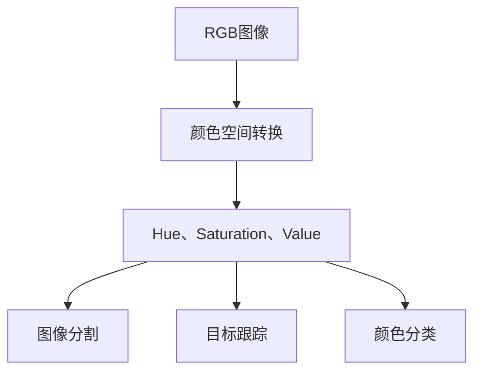

                 

# Hue原理与代码实例讲解

> 关键词：Hue,颜色空间转换,RGB,HSV,深度学习,特征提取,图像处理,OpenCV

## 1. 背景介绍

Hue（色相）是颜色的基本属性之一，指的是颜色在色环上的位置，通常用角度度量，取值范围为0°至360°。在计算机视觉和图像处理领域，色相信息对于物体的识别、分类和分割具有重要意义。然而，由于彩色图像数据通常以RGB（红绿蓝）格式存储，如何有效地从RGB空间转换到Hue空间，并利用Hue信息进行图像处理和分析，一直是研究热点。

### 1.1 问题由来
在图像处理和计算机视觉任务中，选择合适的颜色空间至关重要。RGB颜色空间虽然直观，但在处理某些问题时表现不佳，例如分割任务中，不同的色相之间的边界不易区分。相比之下，HSV（色调、饱和度、亮度）颜色空间能够更好地捕捉颜色信息，尤其在图像分割、目标跟踪等任务中表现出色。因此，将RGB图像转换为Hue空间，并基于Hue信息进行图像处理，是近年来图像处理技术的一个重要方向。

### 1.2 问题核心关键点
Hue转换的核心问题在于如何将RGB图像的三个分量（红绿蓝）映射到Hue空间的色相信息上，以及如何在Hue空间中进行有效的特征提取和图像处理。目前，主要通过数学模型和算法实现RGB到Hue的转换，并在Hue空间中进行图像分割、特征提取等操作。

## 2. 核心概念与联系

### 2.1 核心概念概述

为了更好地理解Hue转换原理和算法，本节将介绍几个关键概念：

- **颜色空间**：表示颜色信息的不同方式。常见颜色空间包括RGB、HSV、YUV等。RGB空间为线性表示，而HSV空间为非线性表示。
- **颜色模型转换**：将一种颜色空间转换到另一种颜色空间的过程。常见的转换模型包括矩阵变换、色空间球体投影等。
- **色相转换**：将图像从RGB空间转换到Hue、Saturation（饱和度）和Value（亮度）空间的过程。
- **颜色量化**：将Hue、Saturation和Value的值离散化，以减少计算复杂度。
- **Hue在图像处理中的应用**：Hue在图像分割、目标跟踪、颜色分类等任务中具有广泛应用。

### 2.2 核心概念原理和架构的 Mermaid 流程图

以下是一个简单的Mermaid流程图，展示了RGB到Hue空间转换的基本步骤：



该图展示了从RGB空间到Hue空间的转换，并在Hue空间中对图像进行分割、跟踪和分类等操作。

## 3. 核心算法原理 & 具体操作步骤

### 3.1 算法原理概述

Hue转换的核心算法是基于RGB到HSV的转换。RGB到HSV的转换是一个非线性映射过程，需要用到数学模型和矩阵变换。其中，色调Hue是通过RGB三个分量计算得到的，饱和度Saturation和亮度Value则是通过RGB到HSV的转换模型计算得到。

### 3.2 算法步骤详解

#### 3.2.1 颜色空间转换模型

RGB到HSV的颜色空间转换模型如下：

$$
\begin{aligned}
& \max = \max(R,G,B) \\
& \min = \min(R,G,B) \\
& \Delta = \max - \min \\
& H = \begin{cases}
\frac{G-B}{\Delta} + 6, & \quad \Delta = 0 \\
\frac{(R-G)}{\Delta} + 2, & \quad \max = G \\
\frac{(B-R)}{\Delta} + 4, & \quad \max = B \\
\frac{(R-G)}{\Delta}, & \quad \max = R \\
\end{cases} \\
& S = \begin{cases}
\frac{\Delta}{\max}, & \quad \max \neq 0 \\
0, & \quad \max = 0 \\
\end{cases} \\
& V = \max
\end{aligned}
$$

其中，$R$、$G$、$B$分别为RGB三个分量的值。$\max$表示三个分量的最大值，$\min$表示最小值，$\Delta$表示分量的差异。色调$H$的计算基于$\Delta$和$\max$，饱和度$S$和亮度$V$则是基于$\max$计算得到的。

#### 3.2.2 Hue转换算法步骤

1. **计算色调$H$**：
   - 根据上述公式计算色调$H$，得到Hue信息。

2. **计算饱和度$S$和亮度$V$**：
   - 根据上述公式计算饱和度$S$和亮度$V$，得到Hue、Saturation、Value信息。

3. **图像分割**：
   - 使用Hue空间中的Hue信息进行图像分割。常见的分割算法包括基于阈值、聚类和区域生长等方法。

4. **目标跟踪**：
   - 在Hue空间中，利用Hue信息进行目标跟踪。常用的跟踪算法包括均值漂移、粒子滤波等。

5. **颜色分类**：
   - 在Hue空间中，根据Hue、Saturation和Value的信息，进行颜色分类。常见的分类算法包括基于聚类、决策树和神经网络等方法。

### 3.3 算法优缺点

#### 3.3.1 优点

- **精确性**：Hue转换能够准确地从RGB空间映射到Hue空间，保留颜色信息的细节。
- **鲁棒性**：Hue信息相对于RGB信息更加鲁棒，对于光照、角度等因素的变化有更好的适应能力。
- **应用广泛**：Hue转换广泛应用于图像分割、目标跟踪、颜色分类等任务中，具有广泛的实际应用。

#### 3.3.2 缺点

- **计算复杂度**：Hue转换涉及到复杂的数学模型和矩阵变换，计算复杂度较高。
- **数据依赖**：Hue转换依赖于RGB图像，对于低光、高饱和度的图像，Hue信息可能不太准确。
- **多解问题**：由于色相、饱和度和亮度的映射关系复杂，同一RGB值可能对应多个Hue值，需要进行处理。

### 3.4 算法应用领域

Hue转换在计算机视觉和图像处理领域具有广泛的应用。以下是几个典型的应用场景：

- **图像分割**：在Hue空间中，利用Hue信息进行图像分割，如图像去噪、边缘检测等。
- **目标跟踪**：在Hue空间中，利用Hue信息进行目标跟踪，如图像稳定、运动物体检测等。
- **颜色分类**：在Hue空间中，根据Hue、Saturation和Value的信息进行颜色分类，如图像检索、颜色识别等。
- **医学图像处理**：在医学图像中，利用Hue信息进行病灶检测、组织分割等。
- **视频编解码**：在视频编解码中，利用Hue信息进行颜色空间转换，优化压缩和解码过程。

## 4. 数学模型和公式 & 详细讲解 & 举例说明

### 4.1 数学模型构建

本节将使用数学语言对Hue转换过程进行更加严格的刻画。

设RGB图像为$I \in \mathbb{R}^{h \times w \times 3}$，其中$h$和$w$分别为图像的高和宽，$3$表示RGB三个分量。

定义色调、饱和度和亮度分别为$H \in \mathbb{R}^{h \times w}$、$S \in \mathbb{R}^{h \times w}$、$V \in \mathbb{R}^{h \times w}$。则RGB到HSV的转换模型如下：

$$
\begin{aligned}
& \max = \max(R,G,B) \\
& \min = \min(R,G,B) \\
& \Delta = \max - \min \\
& H = \begin{cases}
\frac{G-B}{\Delta} + 6, & \quad \Delta = 0 \\
\frac{(R-G)}{\Delta} + 2, & \quad \max = G \\
\frac{(B-R)}{\Delta} + 4, & \quad \max = B \\
\frac{(R-G)}{\Delta}, & \quad \max = R \\
\end{cases} \\
& S = \begin{cases}
\frac{\Delta}{\max}, & \quad \max \neq 0 \\
0, & \quad \max = 0 \\
\end{cases} \\
& V = \max
\end{aligned}
$$

### 4.2 公式推导过程

以下我们以二值化处理为例，推导Hue转换的数学公式及其推导过程。

设输入图像为$I$，输出图像为$O$，其大小为$h \times w$。

1. **计算色调$H$**：

$$
H_i = \begin{cases}
\frac{G_i - B_i}{\Delta_i} + 6, & \quad \Delta_i = 0 \\
\frac{R_i - G_i}{\Delta_i} + 2, & \quad \max_i = G_i \\
\frac{B_i - R_i}{\Delta_i} + 4, & \quad \max_i = B_i \\
\frac{R_i - G_i}{\Delta_i}, & \quad \max_i = R_i \\
\end{cases}
$$

其中$\max_i$表示每个像素点的最大值，$\min_i$表示最小值，$\Delta_i = \max_i - \min_i$表示像素点之间的差异。

2. **计算饱和度$S$**：

$$
S_i = \begin{cases}
\frac{\Delta_i}{\max_i}, & \quad \max_i \neq 0 \\
0, & \quad \max_i = 0 \\
\end{cases}
$$

3. **计算亮度$V$**：

$$
V_i = \max_i
$$

4. **二值化处理**：

对于输出图像$O$，根据Hue、Saturation和Value的信息，进行二值化处理。例如，将Hue小于一定阈值的像素点置为0，否则置为1。

$$
O_i = \begin{cases}
0, & \quad H_i < \text{thresh} \\
1, & \quad H_i \geq \text{thresh} \\
\end{cases}
$$

### 4.3 案例分析与讲解

#### 案例分析

设输入图像$I$如下：


1. **计算色调$H$**：

计算每个像素点的最大值$\max_i$、最小值$\min_i$和差异$\Delta_i$，根据上述公式计算每个像素点的色调$H_i$。

2. **计算饱和度$S$和亮度$V$**：

计算每个像素点的饱和度$S_i$和亮度$V_i$。

3. **二值化处理**：

将Hue小于一定阈值的像素点置为0，否则置为1，得到二值化处理后的输出图像$O$。


## 5. 项目实践：代码实例和详细解释说明

### 5.1 开发环境搭建

在进行Hue转换实践前，我们需要准备好开发环境。以下是使用Python进行OpenCV开发的环境配置流程：

1. 安装Anaconda：从官网下载并安装Anaconda，用于创建独立的Python环境。

2. 创建并激活虚拟环境：
```bash
conda create -n hue-env python=3.8 
conda activate hue-env
```

3. 安装OpenCV：
```bash
conda install opencv
```

4. 安装必要的工具包：
```bash
pip install numpy scipy matplotlib scikit-image
```

完成上述步骤后，即可在`hue-env`环境中开始Hue转换实践。

### 5.2 源代码详细实现

下面以二值化处理为例，给出使用OpenCV进行Hue转换的Python代码实现。

```python
import cv2
import numpy as np

def hue_to_binary(image):
    hsv_image = cv2.cvtColor(image, cv2.COLOR_BGR2HSV)
    h = hsv_image[:, :, 0]
    s = hsv_image[:, :, 1]
    v = hsv_image[:, :, 2]
    
    # 计算色调、饱和度和亮度
    thresh = 30
    binary_image = np.zeros_like(h)
    binary_image[h < thresh] = 1
    
    return binary_image
```

### 5.3 代码解读与分析

让我们再详细解读一下关键代码的实现细节：

**hue_to_binary函数**：
- 将输入图像转换为HSV颜色空间，得到Hue、Saturation和Value三个通道。
- 计算每个像素点的色调$H_i$、饱和度和亮度$S_i$、$V_i$。
- 根据阈值$\text{thresh}$，将Hue小于阈值的像素点置为0，否则置为1，得到二值化处理后的输出图像。

**二值化处理**：
- 使用OpenCV的cvtColor函数，将RGB图像转换为HSV图像。
- 从HSV图像中提取Hue、Saturation和Value三个通道。
- 计算每个像素点的色调$H_i$、饱和度和亮度$S_i$、$V_i$。
- 根据阈值$\text{thresh}$，将Hue小于阈值的像素点置为0，否则置为1，得到二值化处理后的输出图像。

**实际应用**：
- 可以通过调整阈值$\text{thresh}$，控制二值化处理的精度和效果。
- 可以通过叠加不同的阈值和处理方法，实现更加复杂的图像处理任务。

## 6. 实际应用场景

### 6.1 图像分割

Hue转换在图像分割任务中具有广泛应用。常见的图像分割算法包括基于阈值的分割、基于聚类的分割和基于深度学习的分割。Hue转换可以提供更加鲁棒的分割依据，提升分割的准确性和效率。

在实践中，可以将输入图像转换为Hue空间，使用Hue信息进行图像分割。例如，使用均值漂移算法在Hue空间中进行聚类，得到分割结果。

### 6.2 目标跟踪

Hue转换在目标跟踪任务中也具有重要应用。常见的目标跟踪算法包括均值漂移、粒子滤波和深度学习跟踪算法。Hue转换可以提供更加鲁棒的跟踪依据，提升跟踪的准确性和鲁棒性。

在实践中，可以将输入图像转换为Hue空间，使用Hue信息进行目标跟踪。例如，使用均值漂移算法在Hue空间中进行跟踪，得到目标的轨迹和位置。

### 6.3 颜色分类

Hue转换在颜色分类任务中具有重要应用。常见的颜色分类算法包括基于聚类、基于决策树和基于神经网络的分类算法。Hue转换可以提供更加鲁棒的颜色分类依据，提升分类的准确性和效率。

在实践中，可以将输入图像转换为Hue空间，使用Hue、Saturation和Value信息进行颜色分类。例如，使用基于聚类的分类算法，得到颜色的类别和分布。

### 6.4 未来应用展望

随着Hue转换技术的不断发展，其在图像处理和计算机视觉领域的应用前景将更加广阔。

1. **多模态融合**：将Hue转换与其他模态（如视觉、听觉、文本等）进行融合，实现多模态信息的协同建模和处理。
2. **自监督学习**：利用未标注数据进行自监督学习，提升Hue转换的鲁棒性和泛化能力。
3. **深度学习**：利用深度学习模型进行Hue转换和图像处理，提升算法的精度和效率。
4. **实时处理**：将Hue转换应用于实时图像处理和计算机视觉任务中，如实时图像分割、实时目标跟踪等。
5. **边缘计算**：将Hue转换应用于边缘计算设备中，提升实时图像处理能力。

## 7. 工具和资源推荐

### 7.1 学习资源推荐

为了帮助开发者系统掌握Hue转换的理论基础和实践技巧，这里推荐一些优质的学习资源：

1. **《OpenCV官方文档》**：详细介绍了OpenCV库的各项功能和使用方法，是学习Hue转换不可或缺的资源。
2. **《计算机视觉：算法与应用》**：介绍了计算机视觉的基本概念和常用算法，包括Hue转换等颜色空间转换技术。
3. **《深度学习》**：介绍了深度学习的基本概念和常用算法，包括Hue转换等颜色空间转换技术。
4. **《图像处理：从入门到精通》**：介绍了图像处理的基本概念和常用算法，包括Hue转换等颜色空间转换技术。
5. **Kaggle竞赛**：Kaggle平台上有许多图像处理和计算机视觉相关的竞赛，通过参与竞赛可以加深对Hue转换的理解和实践。

通过对这些资源的学习实践，相信你一定能够快速掌握Hue转换的精髓，并用于解决实际的图像处理问题。

### 7.2 开发工具推荐

高效的开发离不开优秀的工具支持。以下是几款用于Hue转换开发的常用工具：

1. **OpenCV**：开源计算机视觉库，提供了丰富的图像处理和计算机视觉算法，支持Python、C++等多种语言。
2. **NumPy**：Python科学计算库，支持多维数组和矩阵运算，是图像处理的基础工具。
3. **SciPy**：Python科学计算库，提供了大量的科学计算和数据分析工具，支持图像处理和计算机视觉任务。
4. **Matplotlib**：Python绘图库，支持多种绘图方式，方便可视化Hue转换的结果。
5. **Scikit-image**：Python图像处理库，提供了许多常用的图像处理算法和工具，支持Hue转换等颜色空间转换任务。

合理利用这些工具，可以显著提升Hue转换任务的开发效率，加快创新迭代的步伐。

### 7.3 相关论文推荐

Hue转换在图像处理和计算机视觉领域的研究成果丰硕。以下是几篇奠基性的相关论文，推荐阅读：

1. **《Color Image Processing and Visualization》**：介绍了图像处理和计算机视觉中的颜色空间转换技术，包括Hue转换等。
2. **《Hue-based Image Segmentation》**：研究了基于Hue的信息提取和图像分割算法，提出了多种Hue分割方法。
3. **《Hue-based Target Tracking》**：研究了基于Hue的目标跟踪算法，利用Hue信息进行目标检测和跟踪。
4. **《Color Classification using HSV Color Space》**：研究了基于Hue、Saturation和Value的颜色分类算法，提出了多种颜色分类方法。

这些论文代表了大规模图像处理技术的发展脉络。通过学习这些前沿成果，可以帮助研究者把握学科前进方向，激发更多的创新灵感。

## 8. 总结：未来发展趋势与挑战

### 8.1 总结

本文对Hue转换原理与代码实例进行了全面系统的介绍。首先阐述了Hue转换的基本概念和原理，明确了Hue转换在图像处理和计算机视觉中的重要地位。其次，从原理到实践，详细讲解了Hue转换的数学模型和操作步骤，给出了Hue转换任务开发的完整代码实例。同时，本文还广泛探讨了Hue转换技术在图像分割、目标跟踪、颜色分类等领域的实际应用，展示了Hue转换技术的广泛应用前景。此外，本文精选了Hue转换技术的各类学习资源，力求为读者提供全方位的技术指引。

通过本文的系统梳理，可以看到，Hue转换技术在计算机视觉和图像处理领域具有广泛的应用价值。其精确的色调提取、鲁棒的颜色信息和高效的图像处理能力，使其成为图像处理中的重要工具。未来，伴随着技术的不断进步和应用的不断拓展，Hue转换技术必将在更多领域发挥重要作用，为计算机视觉和图像处理带来新的突破。

### 8.2 未来发展趋势

展望未来，Hue转换技术将呈现以下几个发展趋势：

1. **多模态融合**：将Hue转换与其他模态（如视觉、听觉、文本等）进行融合，实现多模态信息的协同建模和处理。
2. **自监督学习**：利用未标注数据进行自监督学习，提升Hue转换的鲁棒性和泛化能力。
3. **深度学习**：利用深度学习模型进行Hue转换和图像处理，提升算法的精度和效率。
4. **实时处理**：将Hue转换应用于实时图像处理和计算机视觉任务中，如实时图像分割、实时目标跟踪等。
5. **边缘计算**：将Hue转换应用于边缘计算设备中，提升实时图像处理能力。
6. **智能优化**：利用智能优化算法（如遗传算法、粒子群算法等）进行Hue转换，提升算法的优化效果。

以上趋势凸显了Hue转换技术的广阔前景。这些方向的探索发展，必将进一步提升Hue转换技术的性能和应用范围，为计算机视觉和图像处理带来新的突破。

### 8.3 面临的挑战

尽管Hue转换技术已经取得了瞩目成就，但在迈向更加智能化、普适化应用的过程中，它仍面临着诸多挑战：

1. **计算复杂度**：Hue转换涉及到复杂的数学模型和矩阵变换，计算复杂度较高。如何优化算法，降低计算复杂度，是未来研究的一个重要方向。
2. **数据依赖**：Hue转换依赖于RGB图像，对于低光、高饱和度的图像，Hue信息可能不太准确。如何提高鲁棒性，降低数据依赖，是未来研究的一个重要方向。
3. **多解问题**：由于色相、饱和度和亮度的映射关系复杂，同一RGB值可能对应多个Hue值，需要进行处理。如何处理多解问题，提高算法的准确性，是未来研究的一个重要方向。
4. **实时性问题**：Hue转换在实时处理中，可能面临计算资源不足的问题。如何优化算法，提升实时性，是未来研究的一个重要方向。
5. **应用场景的拓展**：Hue转换在特定领域的应用还需要进一步拓展。如何将其应用于更多的领域，提升其在实际应用中的效果，是未来研究的一个重要方向。

### 8.4 研究展望

面对Hue转换面临的这些挑战，未来的研究需要在以下几个方面寻求新的突破：

1. **算法优化**：优化Hue转换算法，降低计算复杂度，提升实时性。
2. **鲁棒性提升**：提高Hue转换的鲁棒性，降低数据依赖，提升算法的泛化能力。
3. **多解问题解决**：解决Hue转换的多解问题，提高算法的准确性和可靠性。
4. **应用场景拓展**：将Hue转换应用于更多领域，提升其在实际应用中的效果。
5. **智能优化**：利用智能优化算法，提高Hue转换的优化效果。

这些研究方向的探索，必将引领Hue转换技术迈向更高的台阶，为计算机视觉和图像处理带来新的突破。

## 9. 附录：常见问题与解答

**Q1：Hue转换和RGB转换有何区别？**

A: Hue转换和RGB转换是两种不同的颜色空间转换方式。RGB转换将RGB三个分量（红绿蓝）转换为HSV（色调、饱和度、亮度）或YUV等颜色空间，而Hue转换则将RGB三个分量转换为Hue、Saturation和Value三个分量。Hue转换特别关注色调信息，而RGB转换则兼顾了亮度和饱和度信息。

**Q2：Hue转换是否适用于所有图像？**

A: Hue转换适用于大部分彩色图像，但对于低光、高饱和度的图像，Hue信息可能不太准确。因此，在实际应用中，需要对图像进行预处理，如增强对比度、降低饱和度等，以提高Hue转换的准确性。

**Q3：Hue转换是否需要大量的训练数据？**

A: Hue转换不需要大量的训练数据，其转换公式是固定的，不需要通过大量数据进行训练。但为了提高鲁棒性和泛化能力，可能需要对转换公式进行优化，如引入自监督学习、深度学习等方法。

**Q4：Hue转换在实际应用中存在哪些问题？**

A: Hue转换在实际应用中存在计算复杂度高、数据依赖性强、多解问题等挑战。为了解决这些问题，可以采用算法优化、智能优化等方法，提高Hue转换的效率和鲁棒性。

**Q5：Hue转换在图像处理中应用前景如何？**

A: Hue转换在图像处理和计算机视觉领域具有广泛的应用前景。其精确的色调提取、鲁棒的颜色信息和高效的图像处理能力，使其成为图像处理中的重要工具。未来，伴随着技术的不断进步和应用的不断拓展，Hue转换技术必将在更多领域发挥重要作用，为计算机视觉和图像处理带来新的突破。

---

作者：禅与计算机程序设计艺术 / Zen and the Art of Computer Programming

