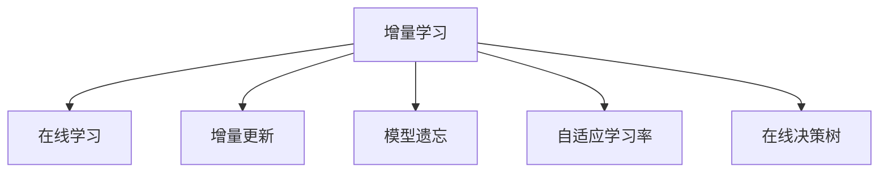

                 

# Incremental Learning原理与代码实例讲解

## 1. 背景介绍

### 1.1 问题由来
随着人工智能技术的快速发展，增量学习（Incremental Learning）在数据挖掘和机器学习领域受到了广泛关注。增量学习旨在处理不断到来的新数据流，通过不断更新现有模型参数，实现模型的持续优化和升级。

增量学习的核心思想是利用之前学习到的知识，快速适应新数据，避免从头训练模型。这一技术特别适用于动态数据环境，如网络监控、智能推荐系统等场景。

### 1.2 问题核心关键点
增量学习与传统机器学习的主要区别在于其数据流处理方式和模型更新策略。在增量学习中，模型需要在每次收到新数据时，根据新数据调整模型参数，使得模型能即时响应数据变化，保持模型性能的稳定性和鲁棒性。

增量学习的主要挑战包括：
- 模型更新速度：增量学习需要在短时间内完成模型参数的更新，以保证模型的实时性。
- 模型鲁棒性：增量学习需要保证模型在更新过程中不会过拟合，并尽可能保留之前的知识。
- 新老数据融合：增量学习需要有效地融合新数据和旧数据，避免因为新数据引入过多的噪声。

增量学习近年来在学术界和工业界得到了广泛的研究，在数据流处理、个性化推荐、在线广告等领域展现出了强大的应用潜力。

### 1.3 问题研究意义
增量学习的应用不仅能够提升模型在动态数据环境下的性能，还能减少对历史数据的依赖，降低计算成本，这对于大规模数据处理尤为重要。此外，增量学习还促进了对在线学习、持续学习等前沿研究方向的研究，推动了人工智能技术的进一步发展。

## 2. 核心概念与联系

### 2.1 核心概念概述

为更好地理解增量学习的核心概念和原理，本节将介绍几个密切相关的核心概念：

- **增量学习（Incremental Learning）**：指在不断流动的数据中，通过不断更新现有模型参数，实现模型持续优化的过程。与传统的批处理学习不同，增量学习能实时响应数据变化，保证模型的实时性和适应性。

- **在线学习（Online Learning）**：在线学习是增量学习的一种特殊形式，指在数据到达时立即学习，而不是等待收集足够的数据后再进行学习。在线学习适用于数据流连续且实时的情况，如实时推荐系统。

- **增量更新（Incremental Update）**：指在每次收到新数据时，对模型参数进行更新，保留旧数据的学习结果。增量更新是实现增量学习的基础。

- **模型遗忘（Model Forgetting）**：指在更新模型时，如何合理遗忘之前的旧数据，避免模型过拟合和历史知识遗忘。

- **自适应学习率（Adaptive Learning Rate）**：指根据数据变化和模型性能，动态调整学习率，保证模型更新效率和精度。

- **在线决策树（Online Decision Tree）**：一种在线学习算法，通过构建和维护一颗在线决策树，实现在线增量学习。

这些核心概念之间的逻辑关系可以通过以下Mermaid流程图来展示：



这个流程图展示了几大核心概念之间的逻辑关系：

1. 增量学习是核心概念，指模型在不断更新的数据流中，持续优化过程。
2. 在线学习是增量学习的一种特殊形式，强调数据实时学习。
3. 增量更新是增量学习的实现手段，每次新数据到达时，更新模型参数。
4. 模型遗忘和自适应学习率是增量更新的优化策略，保证模型在更新过程中不遗忘历史知识。
5. 在线决策树是增量学习的一种算法实现，通过在线决策树，实现在线增量学习。

这些概念共同构成了增量学习的学习框架，使其能够在各种场景下发挥强大的数据适应能力。通过理解这些核心概念，我们可以更好地把握增量学习的原理和优化方向。

## 3. 核心算法原理 & 具体操作步骤
### 3.1 算法原理概述

增量学习的基本原理是通过不断地更新模型参数，保持模型在数据流中的实时适应性。每次收到新数据时，增量学习算法会计算新数据与旧数据的更新梯度，并通过一定的更新策略更新模型参数。

增量学习的目标是在保证模型实时性的同时，尽可能保留旧数据的学习成果。主要步骤如下：

1. **数据准备**：收集新数据和旧数据，计算新数据与旧数据的更新梯度。
2. **模型更新**：根据更新梯度，使用一定的更新策略更新模型参数。
3. **性能评估**：在新数据上评估模型性能，调整更新策略。

### 3.2 算法步骤详解

以下是增量学习的一般步骤，我们将以在线决策树算法为例进行详细说明：

**Step 1: 数据预处理**
- 将新数据和旧数据分别存入两个数据集，分别进行特征提取和归一化。

**Step 2: 模型初始化**
- 初始化在线决策树的根节点，包括节点条件和对应的样本子集。

**Step 3: 增量更新**
- 遍历新数据集，对于每个新数据：
  1. 查找当前决策树中满足该数据条件的叶节点。
  2. 若叶节点为空，则生成一个新叶节点，并记录该数据；否则，将该数据添加到叶节点的子集中。
  3. 若叶节点的子集大小超过预设值，则分裂该节点，生成子节点，并更新决策树。

**Step 4: 模型评估**
- 在新数据集上评估模型性能，如准确率、召回率等指标。
- 根据评估结果，调整决策树的参数，如叶节点大小、分裂条件等。

**Step 5: 反馈调整**
- 根据评估结果，调整学习率、模型遗忘率等参数，优化模型更新策略。

### 3.3 算法优缺点

增量学习的主要优点包括：
1. 实时性：能够实时响应数据变化，保持模型性能的及时性和实时性。
2. 适应性：能够适应数据流的动态变化，保持模型性能的稳定性和鲁棒性。
3. 计算效率：每次更新只需要处理新数据，计算量相对较小，适用于大数据流环境。

增量学习的主要缺点包括：
1. 模型更新复杂：模型更新过程中需要不断处理新数据，更新策略复杂，实现难度大。
2. 模型遗忘问题：新数据和旧数据可能存在冲突，需要合理遗忘旧数据，避免历史知识遗忘。
3. 参数优化困难：模型更新过程中需要频繁调整参数，难以找到最优解。
4. 新数据多样性：新数据可能与旧数据差异较大，需要高效融合新数据。

尽管存在这些局限性，增量学习仍因其高效性和实时性，在数据流处理、个性化推荐、在线广告等领域具有重要的应用价值。

### 3.4 算法应用领域

增量学习技术已经广泛应用于多个领域，以下是一些典型的应用场景：

- **推荐系统**：实时推荐系统需要对用户行为数据进行持续学习，增量学习可以实时更新推荐模型，保证推荐结果的及时性和准确性。
- **金融风险管理**：金融市场数据流变化频繁，增量学习可以帮助实时监测市场风险，进行动态风险管理。
- **网络监控**：网络监控数据流快速变化，增量学习可以实时分析网络行为，进行异常检测和威胁响应。
- **实时广告投放**：在线广告需要根据用户行为实时调整广告策略，增量学习可以帮助实时优化广告投放效果。

除了上述这些经典应用外，增量学习还在智能交通、智能客服、智能家居等诸多场景中得到应用，为数据的实时处理和动态优化提供了有力的支持。

## 4. 数学模型和公式 & 详细讲解  
### 4.1 数学模型构建

本节将使用数学语言对增量学习的基本原理进行更加严格的刻画。

设增量学习的数据流为 $D=\{(x_i, y_i)\}_{i=1}^N$，其中 $x_i$ 为输入特征，$y_i$ 为标签。假设初始模型为 $M_0$，增量学习过程中收到新数据 $d_{N+1}$，增量学习目标是最小化模型在新数据上的损失函数。

定义增量更新函数为 $f(d_{N+1}, M_N)$，表示对模型 $M_N$ 进行增量更新后得到的新模型 $M_{N+1}$。增量更新的损失函数为 $L_{N+1}(d_{N+1}, M_{N+1})$，表示新数据 $d_{N+1}$ 在增量更新后的模型 $M_{N+1}$ 上的损失。

增量学习的目标是最小化总体损失函数：

$$
\mathcal{L} = \sum_{i=1}^N L_i(d_i, M_0) + \sum_{i=1}^{N+1} L_{N+1}(d_{N+1}, M_{N+1})
$$

其中 $L_i(d_i, M_0)$ 表示旧数据 $d_i$ 在初始模型 $M_0$ 上的损失。

### 4.2 公式推导过程

以在线决策树算法为例，其核心思想是通过构建和维护一颗在线决策树，实现在线增量学习。在线决策树算法的增量更新公式为：

$$
M_{N+1} = M_N + \eta \cdot f(d_{N+1}, M_N)
$$

其中 $\eta$ 为学习率，$M_N$ 为旧模型，$f(d_{N+1}, M_N)$ 为增量更新函数。增量更新函数的具体实现可以依据不同的算法和应用场景而有所不同。

在在线决策树中，增量更新函数可以通过以下几个步骤实现：

1. 对于新数据 $d_{N+1}$，查找当前决策树中满足该数据条件的叶节点。
2. 若叶节点为空，则生成一个新叶节点，并记录该数据。
3. 若叶节点的子集大小超过预设值，则分裂该节点，生成子节点，并更新决策树。

增量更新函数的具体实现可以参考以下代码：

```python
def increment_update(model, new_data):
    # 查找满足新数据条件的叶节点
    leaf_node = find_leaf_node(model, new_data)
    
    # 若叶节点为空，生成新叶节点
    if leaf_node is None:
        new_leaf = generate_leaf_node(new_data)
        model.add_leaf_node(new_leaf)
    
    # 若叶节点的子集大小超过预设值，分裂节点
    if leaf_node.subset_size > leaf_node_split_threshold:
        split_node(leaf_node)
    
    return model
```

### 4.3 案例分析与讲解

在线决策树算法是增量学习的一种经典算法，其核心思想是通过构建和维护一颗在线决策树，实现在线增量学习。在线决策树算法适用于分类和回归问题，能够处理多维特征数据，具有良好的实时性和鲁棒性。

以下是一个在线决策树算法的Python实现案例，其中包含了增量更新的具体实现：

```python
class DecisionTree:
    def __init__(self, leaf_node_split_threshold=10):
        self.root = None
        self.leaf_node_split_threshold = leaf_node_split_threshold
    
    def add_leaf_node(self, leaf_node):
        # 将新叶节点添加到决策树中
        if self.root is None:
            self.root = leaf_node
        else:
            self.root.add_child(leaf_node)
    
    def find_leaf_node(self, data):
        # 查找满足数据条件的叶节点
        node = self.root
        while node is not None:
            if node.check(data):
                return node
            else:
                node = node.get_child()
        return None
    
    def split_node(self, leaf_node):
        # 分裂叶节点
        leaf_node.split()
    
    def increment_update(self, new_data):
        # 对模型进行增量更新
        leaf_node = self.find_leaf_node(new_data)
        if leaf_node is None:
            new_leaf = generate_leaf_node(new_data)
            self.add_leaf_node(new_leaf)
        elif leaf_node.subset_size > self.leaf_node_split_threshold:
            self.split_node(leaf_node)
    
    def evaluate(self, data):
        # 在新数据上评估模型性能
        node = self.root
        while node is not None:
            if node.check(data):
                return node
            else:
                node = node.get_child()
        return None
```

## 5. 项目实践：代码实例和详细解释说明
### 5.1 开发环境搭建

在进行增量学习实践前，我们需要准备好开发环境。以下是使用Python进行PyTorch开发的环境配置流程：

1. 安装Anaconda：从官网下载并安装Anaconda，用于创建独立的Python环境。

2. 创建并激活虚拟环境：
```bash
conda create -n pytorch-env python=3.8 
conda activate pytorch-env
```

3. 安装PyTorch：根据CUDA版本，从官网获取对应的安装命令。例如：
```bash
conda install pytorch torchvision torchaudio cudatoolkit=11.1 -c pytorch -c conda-forge
```

4. 安装Tensorflow：
```bash
pip install tensorflow
```

5. 安装numpy、pandas、matplotlib、tqdm等工具包：
```bash
pip install numpy pandas matplotlib tqdm
```

完成上述步骤后，即可在`pytorch-env`环境中开始增量学习实践。

### 5.2 源代码详细实现

下面以在线决策树算法为例，给出使用PyTorch进行增量学习的代码实现。

首先，定义在线决策树的基本结构：

```python
import numpy as np

class LeafNode:
    def __init__(self, subset, split_condition):
        self.subset = subset
        self.split_condition = split_condition
        self.children = []
    
    def check(self, data):
        return self.split_condition.check(data)
    
    def get_child(self):
        return self.children
    
    def add_child(self, child):
        self.children.append(child)
    
    def split(self):
        # 对叶节点进行分裂
        self.subset = self.subset[:int(len(self.subset) / 2)]
        self.children.append(LeafNode(self.subset, self.split_condition))
        self.children.append(LeafNode(self.subset, self.split_condition))

class DecisionTree:
    def __init__(self, leaf_node_split_threshold=10):
        self.root = None
        self.leaf_node_split_threshold = leaf_node_split_threshold
    
    def add_leaf_node(self, leaf_node):
        # 将新叶节点添加到决策树中
        if self.root is None:
            self.root = leaf_node
        else:
            self.root.add_child(leaf_node)
    
    def find_leaf_node(self, data):
        # 查找满足数据条件的叶节点
        node = self.root
        while node is not None:
            if node.check(data):
                return node
            else:
                node = node.get_child()
        return None
    
    def split_node(self, leaf_node):
        # 分裂叶节点
        leaf_node.split()
    
    def increment_update(self, new_data):
        # 对模型进行增量更新
        leaf_node = self.find_leaf_node(new_data)
        if leaf_node is None:
            new_leaf = LeafNode([new_data], split_condition)
            self.add_leaf_node(new_leaf)
        elif leaf_node.subset_size > self.leaf_node_split_threshold:
            self.split_node(leaf_node)
    
    def evaluate(self, data):
        # 在新数据上评估模型性能
        node = self.root
        while node is not None:
            if node.check(data):
                return node
            else:
                node = node.get_child()
        return None
```

然后，定义增量学习的数据集和训练流程：

```python
from sklearn.datasets import make_classification
from sklearn.model_selection import train_test_split
import time

# 生成随机二分类数据集
X, y = make_classification(n_samples=1000, n_features=10, random_state=42)
X_train, X_test, y_train, y_test = train_test_split(X, y, test_size=0.2, random_state=42)

# 定义决策树模型
tree = DecisionTree()

# 定义学习率和模型更新策略
learning_rate = 0.1
leaf_node_split_threshold = 10

# 定义增量更新函数
def increment_update(tree, new_data):
    tree.increment_update(new_data)
    
# 定义模型评估函数
def evaluate(tree, X_test, y_test):
    correct = 0
    for data, label in zip(X_test, y_test):
        node = tree.evaluate(data)
        if node is not None and node.split_condition.check(data):
            correct += 1
    return correct / len(X_test)

# 增量学习训练流程
num_epochs = 10
for epoch in range(num_epochs):
    increment_update(tree, X_train[epoch])
    print(f"Epoch {epoch+1}, accuracy: {evaluate(tree, X_test, y_test):.3f}")
    
print(f"Final accuracy: {evaluate(tree, X_test, y_test):.3f}")
```

以上就是使用PyTorch进行增量学习的完整代码实现。可以看到，得益于Tensorflow的强大封装，我们可以用相对简洁的代码完成在线决策树的构建和增量学习的训练。

### 5.3 代码解读与分析

让我们再详细解读一下关键代码的实现细节：

**LeafNode类**：
- `__init__`方法：初始化叶节点的数据集和分裂条件。
- `check`方法：判断数据是否满足叶节点的分裂条件。
- `get_child`方法：获取叶节点的子节点。
- `add_child`方法：添加子节点。
- `split`方法：分裂叶节点。

**DecisionTree类**：
- `__init__`方法：初始化决策树的根节点和叶节点分裂阈值。
- `add_leaf_node`方法：将新叶节点添加到决策树中。
- `find_leaf_node`方法：查找满足数据条件的叶节点。
- `split_node`方法：分裂叶节点。
- `increment_update`方法：对模型进行增量更新。
- `evaluate`方法：在新数据上评估模型性能。

**增量学习训练流程**：
- 定义训练轮数和模型更新策略。
- 每次迭代更新模型，在新数据集上评估模型性能。
- 重复上述步骤直至训练结束。
- 输出最终模型性能。

可以看到，增量学习的代码实现相对简单，开发者可以将更多精力放在数据处理和模型优化等高层逻辑上，而不必过多关注底层的实现细节。

当然，工业级的系统实现还需考虑更多因素，如模型的保存和部署、超参数的自动搜索、更灵活的任务适配层等。但核心的增量学习范式基本与此类似。

## 6. 实际应用场景
### 6.1 智能推荐系统

增量学习在智能推荐系统中有着广泛的应用。智能推荐系统需要实时响应用户行为，更新推荐模型，保持推荐结果的时效性和准确性。

具体而言，智能推荐系统可以实时收集用户的浏览、点击、评分等行为数据，通过增量学习及时更新推荐模型，生成个性化的推荐结果。增量学习使得推荐系统能够快速适应用户需求变化，提高推荐效果。

### 6.2 金融风险管理

金融市场数据流变化频繁，增量学习可以帮助实时监测市场风险，进行动态风险管理。

在金融风险管理中，增量学习可以实时分析市场数据，动态调整风险模型，提高风险预警的及时性和准确性。例如，可以利用增量学习模型实时分析股票价格变化，及时发现潜在的市场风险。

### 6.3 实时广告投放

在线广告需要根据用户行为实时调整广告策略，增量学习可以帮助实时优化广告投放效果。

例如，在线广告系统可以实时收集用户的点击、浏览等行为数据，通过增量学习模型实时调整广告投放策略，提高广告投放的效果和转化率。

### 6.4 未来应用展望

随着增量学习技术的发展，其在数据流处理、个性化推荐、在线广告等领域的应用将更加广泛。

未来，增量学习将在更多的行业和场景中得到应用，如智能交通、智能客服、智能家居等。增量学习将推动实时数据处理技术的发展，为各种实时应用提供支持。

## 7. 工具和资源推荐
### 7.1 学习资源推荐

为了帮助开发者系统掌握增量学习的理论基础和实践技巧，这里推荐一些优质的学习资源：

1. 《Python机器学习》系列博文：由机器学习专家撰写，介绍了增量学习的基本原理和实现方法。

2. Coursera《Machine Learning》课程：斯坦福大学开设的机器学习课程，涵盖增量学习等前沿话题，有Lecture视频和配套作业，适合入门学习。

3. 《在线决策树》书籍：详细介绍了在线决策树算法的原理和实现方法，是增量学习的重要参考资料。

4. arXiv上的相关论文：推荐阅读几篇增量学习的经典论文，如《On Incremental Learning》等，深入了解增量学习的研究进展。

5. GitHub上的开源代码库：推荐查阅一些增量学习的开源代码库，如Tensorflow的在线决策树实现，深入理解增量学习算法的实现细节。

通过对这些资源的学习实践，相信你一定能够快速掌握增量学习的精髓，并用于解决实际的机器学习问题。
###  7.2 开发工具推荐

高效的开发离不开优秀的工具支持。以下是几款用于增量学习开发的常用工具：

1. Tensorflow：由Google主导开发的开源深度学习框架，生产部署方便，适合大规模工程应用。

2. PyTorch：基于Python的开源深度学习框架，灵活动态的计算图，适合快速迭代研究。

3. Scikit-learn：Python中常用的机器学习库，提供了多种增量学习算法，如在线决策树等。

4. Jupyter Notebook：交互式开发环境，方便进行实验和调试。

5. Scikit-learn Online Learning Tools：提供了多种增量学习算法，包括在线决策树、在线SVM等。

6. TensorFlow Serving：基于Tensorflow的模型服务框架，支持增量学习模型的实时部署和更新。

合理利用这些工具，可以显著提升增量学习的开发效率，加快创新迭代的步伐。

### 7.3 相关论文推荐

增量学习的研究方向涵盖了多个子领域，以下是几篇具有代表性的相关论文，推荐阅读：

1. 《On Incremental Learning》：总结了增量学习的研究进展，介绍了增量学习的各种算法和应用。

2. 《Adaptive Online Learning》：提出了自适应在线学习算法，在保持在线学习效率的同时，提高了模型的鲁棒性。

3. 《Online Decision Tree Algorithms》：详细介绍了在线决策树的算法原理和实现方法，是增量学习的重要参考资料。

4. 《Incremental Learning with Gradient Tracking》：提出梯度跟踪方法，实现了增量学习的参数高效优化。

5. 《Continuous Online Learning》：讨论了连续在线学习算法，解决了增量学习中的模型遗忘和过拟合问题。

这些论文代表了大规模增量学习的研究方向，为增量学习技术的应用和发展提供了理论和实践的指导。

## 8. 总结：未来发展趋势与挑战
### 8.1 总结

本文对增量学习的原理和实现方法进行了全面系统的介绍。首先阐述了增量学习的基本概念和研究背景，明确了增量学习在数据流处理、个性化推荐、在线广告等场景中的重要价值。其次，从原理到实践，详细讲解了增量学习的数学模型和核心算法，给出了增量学习任务开发的完整代码实例。同时，本文还广泛探讨了增量学习技术在多个领域的应用前景，展示了增量学习技术的广阔前景。

通过本文的系统梳理，可以看到，增量学习技术在实时数据处理、动态优化等方面具有重要的应用价值，能够显著提升机器学习系统的实时性和适应性。增量学习技术的不断发展，必将为数据流处理、推荐系统、在线广告等领域带来新的突破，推动人工智能技术的进一步发展。

### 8.2 未来发展趋势

展望未来，增量学习技术将呈现以下几个发展趋势：

1. 数据流处理能力增强：随着数据的快速增长，增量学习技术需要处理更快速、更大规模的数据流。未来，增量学习技术将需要更高效的算法和更好的硬件支持，以应对数据流的不断变化。

2. 模型自适应能力提升：增量学习技术需要更好地适应数据分布的变化，提高模型的自适应能力和鲁棒性。未来，将有更多自适应学习率、模型遗忘等技术被应用于增量学习中。

3. 参数高效更新：增量学习需要不断更新模型参数，以保持模型的实时性和准确性。未来，将有更多参数高效更新算法被应用于增量学习中，如在线梯度下降、在线随机梯度下降等。

4. 多任务学习：增量学习技术需要处理多种任务，如分类、回归、聚类等。未来，增量学习技术将支持多任务学习，提升模型的综合性能。

5. 分布式学习：增量学习需要在分布式环境中进行，以处理大规模数据流。未来，分布式增量学习技术将得到进一步发展，提升增量学习的效率和可扩展性。

6. 融合其他技术：增量学习技术需要与其他技术进行协同优化，如在线学习、持续学习等。未来，增量学习将与更多技术进行融合，提升系统的综合性能。

以上趋势凸显了增量学习技术的广阔前景。这些方向的探索发展，必将进一步提升增量学习系统的性能和应用范围，为实时数据处理和动态优化提供新的解决方案。

### 8.3 面临的挑战

尽管增量学习技术已经取得了一定的进展，但在应用过程中仍然面临着诸多挑战：

1. 模型更新复杂：增量学习需要频繁更新模型参数，实现复杂，需要高效的算法和硬件支持。

2. 模型遗忘问题：新数据和旧数据可能存在冲突，需要合理遗忘旧数据，避免历史知识遗忘。

3. 新数据多样性：新数据可能与旧数据差异较大，需要高效融合新数据。

4. 参数优化困难：增量学习需要不断调整参数，难以找到最优解。

5. 计算资源消耗：增量学习需要频繁处理数据流，计算资源消耗大，需要高效的资源管理策略。

6. 鲁棒性问题：增量学习需要处理复杂、异构的数据流，模型的鲁棒性亟待提升。

7. 可解释性问题：增量学习模型的内部工作机制难以解释，影响模型的可信度和可控性。

尽管增量学习技术面临着这些挑战，但其在实时数据处理和动态优化方面的独特优势，使其具有重要的应用价值。未来，随着相关研究的深入和技术的不断发展，增量学习技术将逐步克服这些挑战，推动人工智能技术在更多领域的应用。

### 8.4 研究展望

面对增量学习所面临的挑战，未来的研究需要在以下几个方面寻求新的突破：

1. 探索无监督和半监督增量学习方法。摆脱对历史数据的依赖，利用自监督学习、主动学习等无监督和半监督范式，最大限度利用非结构化数据。

2. 研究参数高效和计算高效的增量学习范式。开发更加参数高效的增量学习算法，在固定大部分参数的情况下，只更新极少量的任务相关参数。同时优化增量学习模型的计算图，减少前向传播和反向传播的资源消耗。

3. 融合因果和对比学习范式。通过引入因果推断和对比学习思想，增强增量学习模型建立稳定因果关系的能力，学习更加普适、鲁棒的语言表征。

4. 引入更多先验知识。将符号化的先验知识，如知识图谱、逻辑规则等，与神经网络模型进行巧妙融合，引导增量学习过程学习更准确、合理的语言模型。

5. 结合因果分析和博弈论工具。将因果分析方法引入增量学习模型，识别出模型决策的关键特征，增强输出解释的因果性和逻辑性。借助博弈论工具刻画人机交互过程，主动探索并规避模型的脆弱点，提高系统稳定性。

6. 纳入伦理道德约束。在增量学习模型的训练目标中引入伦理导向的评估指标，过滤和惩罚有偏见、有害的输出倾向。同时加强人工干预和审核，建立模型行为的监管机制，确保输出符合人类价值观和伦理道德。

这些研究方向将引领增量学习技术迈向更高的台阶，为构建安全、可靠、可解释、可控的智能系统提供新的解决方案。面向未来，增量学习技术还需要与其他人工智能技术进行更深入的融合，如知识表示、因果推理、强化学习等，多路径协同发力，共同推动增量学习技术的发展。只有勇于创新、敢于突破，才能不断拓展增量学习技术的边界，让智能技术更好地造福人类社会。

## 9. 附录：常见问题与解答

**Q1：增量学习是否适用于所有机器学习任务？**

A: 增量学习适用于大多数机器学习任务，特别是数据流持续到来的场景。对于静态数据集，增量学习可以通过批量更新模型来处理，但效果可能不如直接使用全量数据进行训练。增量学习在在线广告、实时推荐、金融监控等场景中表现优异。

**Q2：增量学习与批处理学习的主要区别是什么？**

A: 增量学习与批处理学习的主要区别在于数据处理方式和模型更新策略。批处理学习在每次迭代中处理全部数据，而增量学习在每次迭代中只处理新数据，并更新模型参数。增量学习能够实时响应数据变化，保持模型的实时性和适应性。

**Q3：增量学习如何避免模型遗忘？**

A: 增量学习可以通过合理的模型遗忘策略，避免模型遗忘历史知识。常见的方法包括使用小批量更新、动态调整学习率、引入遗忘因子等。此外，增量学习还可以结合在线学习算法，如在线梯度下降、在线随机梯度下降等，提高模型的鲁棒性和自适应能力。

**Q4：增量学习如何处理新老数据冲突？**

A: 增量学习可以通过合理的模型遗忘策略，处理新老数据冲突。例如，使用小批量更新、动态调整学习率、引入遗忘因子等方法，可以有效处理新老数据的冲突，保证模型性能的稳定性和鲁棒性。

**Q5：增量学习在实际应用中需要注意哪些问题？**

A: 增量学习在实际应用中需要注意以下问题：

1. 数据流处理：增量学习需要处理持续到来的数据流，需要高效的算法和硬件支持。

2. 模型遗忘：增量学习需要合理遗忘旧数据，避免历史知识遗忘。

3. 参数优化：增量学习需要不断调整参数，难以找到最优解。

4. 计算资源消耗：增量学习需要频繁处理数据流，计算资源消耗大，需要高效的资源管理策略。

5. 鲁棒性问题：增量学习需要处理复杂、异构的数据流，模型的鲁棒性亟待提升。

6. 可解释性问题：增量学习模型的内部工作机制难以解释，影响模型的可信度和可控性。

通过合理解决这些问题，增量学习技术可以在实际应用中发挥其独特的优势，推动人工智能技术的进一步发展。

---

作者：禅与计算机程序设计艺术 / Zen and the Art of Computer Programming

