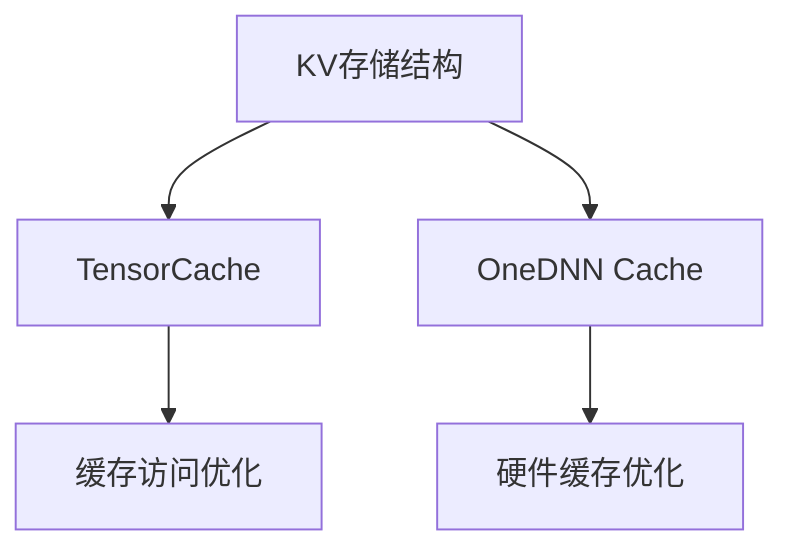

                 

## 1. 背景介绍

### 1.1 问题由来
在NLP领域，语言模型是最为核心的组件之一。它通过对大规模语料进行训练，学习到了语言的统计规律，可以用于自动生成文本、语义分析、机器翻译等多个任务。然而，预训练语言模型往往具有巨大的参数量，推理速度较慢，难以满足实际应用的高实时性要求。因此，如何提升语言模型的推理速度，是一个亟待解决的重要问题。

### 1.2 问题核心关键点
提升语言模型推理速度的方法主要有两种：一种是参数量较小的轻量级模型，另一种是利用缓存技术提升推理效率。轻量级模型虽然速度较快，但在精度上往往逊于大模型。因此，我们重点关注利用缓存技术提升大语言模型的推理速度。

缓存技术利用内存中的Key-Value（KV）存储结构，可以显著减少模型计算量和内存访问次数，从而提升推理效率。常用的缓存技术包括TensorCache、OneDNN Cache等。本文将重点介绍KV-Cache的原理和应用，以期为开发者提供系统的缓存技术指导。

## 2. 核心概念与联系

### 2.1 核心概念概述

为了更好地理解KV-Cache技术，我们需要先了解几个核心概念：

- **KV存储结构**：一种基于键值对的存储结构，通过键值索引可以快速定位到对应的值，广泛应用于分布式系统中。

- **TensorCache**：一种利用CPU缓存池提升Tensor访问效率的技术，可以显著减少内存访问次数。

- **OneDNN Cache**：Intel设计的一种高效缓存技术，利用CPU的last-level cache作为KV Cache，可以进一步提升Tensor访问速度。

这些核心概念之间的逻辑关系可以通过以下Mermaid流程图来展示：



这个流程图展示了大语言模型推理速度优化的关键流程：

1. KV存储结构提供了基于键值对的快速访问机制，是缓存技术的底层基础。
2. TensorCache和OneDNN Cache是利用CPU缓存池提升Tensor访问效率的高级缓存技术。
3. 这两种缓存技术通过优化内存访问，显著提升了推理速度。

## 3. 核心算法原理 & 具体操作步骤

### 3.1 算法原理概述

KV-Cache技术的基本原理是基于KV存储结构，将大语言模型的推理过程缓存起来，从而减少重复计算。具体的实现流程如下：

1. **Key生成**：将输入的查询作为Key，构建一个唯一的标识符。
2. **Value计算**：根据Key计算对应的Value，即模型推理结果。
3. **KV存储**：将Key和Value存储到KV存储结构中。
4. **Value检索**：当再次输入相同的查询时，从缓存中直接检索对应的Value，跳过重新计算过程。

这种缓存机制可以大大提升语言模型的推理速度，特别是在需要多次重复计算的场景下。

### 3.2 算法步骤详解

以下是KV-Cache技术的具体操作步骤：

**Step 1: 准备输入和输出键值对**
- 定义输入和输出键值对的Key，例如可以是输入的句子ID、查询词汇等。
- 定义模型推理结果的Value，例如可以是预测的下一个词汇ID、词性标签等。

**Step 2: 计算模型输出**
- 根据Key，调用预训练语言模型计算对应的Value。
- 将计算结果存储到KV缓存中，Key与Value的映射关系需要预先确定。

**Step 3: 缓存检索与更新**
- 在后续的推理过程中，当再次遇到相同的Key时，直接从缓存中检索对应的Value，并输出。
- 若缓存中不存在该Key，则正常调用模型计算，并将新的Key-Value对存储到缓存中。
- 缓存空间不足时，采用一定的淘汰策略，如LRU(Least Recently Used)、FIFO(First In First Out)等。

**Step 4: 优化缓存机制**
- 根据模型应用场景，选择合适的缓存大小、淘汰策略、读写锁等机制。
- 对于大规模训练或推理任务，可以采用分布式KV缓存，提高并行处理能力。

### 3.3 算法优缺点

KV-Cache技术的优点包括：

- 显著提升推理速度。缓存机制可以避免重复计算，减少内存访问次数，提升推理效率。
- 提高内存利用率。缓存机制可以减少内存分配和释放，提高内存复用率，降低内存占用。
- 可扩展性好。分布式缓存可以扩展到多机集群，支持大规模分布式推理。

缺点包括：

- 缓存一致性问题。当多个查询同时请求相同Key时，缓存数据可能不一致，需要采用一致性算法来解决。
- 缓存空间限制。缓存大小有限，当缓存空间不足时，需要淘汰旧数据，可能会影响缓存效率。
- 缓存更新延迟。缓存中的Value可能会变旧，需要定期更新缓存，确保数据的时效性。

### 3.4 算法应用领域

KV-Cache技术在大规模语言模型推理中有着广泛的应用。以下是几个典型的应用场景：

- 文本生成：在自然语言文本生成任务中，如机器翻译、文本摘要等，缓存机制可以显著提升生成速度。
- 语言理解：在问答系统、对话系统中，缓存机制可以加速模型推理，提升系统的响应速度。
- 知识图谱：在知识图谱构建和推理中，缓存机制可以提升图谱查询和推理的效率。
- 推荐系统：在个性化推荐系统中，缓存机制可以加速模型计算，提升推荐效率。

## 4. 数学模型和公式 & 详细讲解 & 举例说明

### 4.1 数学模型构建

假设预训练语言模型为 $M_{\theta}$，输入序列为 $x=(x_1, x_2, ..., x_n)$，输出序列为 $y=(y_1, y_2, ..., y_n)$。设 $k$ 为缓存大小，$C$ 为缓存映射关系，其中 $C=\{(k_i, v_i)\}_{i=1}^k$。

定义推理函数 $f: x \rightarrow v$，其中 $v$ 为模型的推理结果。设 $V=\{v_1, v_2, ..., v_n\}$，表示所有可能的输出序列。

### 4.2 公式推导过程

设 $D=(x_i, y_i)$ 为训练数据集，$T=(x_{i_1}, x_{i_2}, ..., x_{i_t})$ 为推理数据集。缓存机制的推理过程可以表示为：

$$
V' = \{v_{i_1}, v_{i_2}, ..., v_{i_t}\}
$$

其中 $v_i = f(x_i)$。设 $S$ 为缓存访问集合，即所有被访问的Key集合。

缓存访问过程可以表示为：

$$
S = \{x_{i_1}, x_{i_2}, ..., x_{i_t}\}
$$

其中 $x_i \in T$，即推理数据集中的输入序列。

缓存更新过程可以表示为：

$$
C = C \cup \{(x_i, f(x_i))\}_{i=1}^t
$$

其中 $x_i$ 为缓存中不存在的Key，$f(x_i)$ 为对应的Value。

### 4.3 案例分析与讲解

以机器翻译为例，设源语言序列为 $s$，目标语言序列为 $t$。设 $f$ 为机器翻译模型，将 $s$ 映射到 $t$。

设 $C$ 为缓存映射关系，其中 $C=\{(s_i, t_i)\}_{i=1}^k$。当翻译模型推理过程中，再次遇到相同的源语言序列 $s_j$ 时，可以跳过重新计算过程，直接从缓存中检索对应的目标语言序列 $t_j$。

假设机器翻译模型输出 $t_j'$，且 $s_j$ 在缓存中不存在，则更新缓存 $C = C \cup \{(s_j, t_j')\}$。

## 5. 项目实践：代码实例和详细解释说明

### 5.1 开发环境搭建

在进行缓存技术实践前，我们需要准备好开发环境。以下是使用Python和PyTorch搭建开发环境的步骤：

1. 安装Anaconda：从官网下载并安装Anaconda，用于创建独立的Python环境。

2. 创建并激活虚拟环境：
```bash
conda create -n caching-env python=3.8 
conda activate caching-env
```

3. 安装PyTorch：根据CUDA版本，从官网获取对应的安装命令。例如：
```bash
conda install pytorch torchvision torchaudio cudatoolkit=11.1 -c pytorch -c conda-forge
```

4. 安装TensorCache和OneDNN Cache库：
```bash
pip install tensorcache onednn-cache
```

5. 安装各类工具包：
```bash
pip install numpy pandas scikit-learn matplotlib tqdm jupyter notebook ipython
```

完成上述步骤后，即可在`caching-env`环境中开始缓存技术的实践。

### 5.2 源代码详细实现

下面我们以机器翻译为例，给出使用TensorCache进行缓存的PyTorch代码实现。

首先，定义缓存管理类CacheManager，包含缓存的初始化、添加、检索和删除等功能：

```python
import torch
from tensorcache.python.tensorcache import TensorCache

class CacheManager:
    def __init__(self, cache_size):
        self.cache = TensorCache(cache_size=cache_size)
        
    def add(self, key, value):
        self.cache.add(key, value)
        
    def get(self, key):
        return self.cache.get(key)
        
    def remove(self, key):
        self.cache.remove(key)
        
    def clear(self):
        self.cache.clear()
```

然后，定义机器翻译模型，并结合TensorCache进行缓存优化：

```python
from transformers import BertTokenizer, BertForSequenceClassification
from tensorcache.python.tensorcache import TensorCache

class TranslationModel:
    def __init__(self, model, tokenizer, cache_manager):
        self.model = model
        self.tokenizer = tokenizer
        self.cache_manager = cache_manager
        
    def translate(self, text):
        # 分词和编码
        input_ids = self.tokenizer.encode(text)
        
        # 查询缓存
        key = tuple(input_ids)
        value = self.cache_manager.get(key)
        
        if value is not None:
            return value
        
        # 推理过程
        outputs = self.model(input_ids)
        value = outputs.logits.argmax(dim=-1)
        
        # 缓存更新
        self.cache_manager.add(key, value)
        return value
```

最后，启动翻译过程并在缓存中存储结果：

```python
# 加载模型和分词器
model = BertForSequenceClassification.from_pretrained('bert-base-uncased')
tokenizer = BertTokenizer.from_pretrained('bert-base-uncased')

# 初始化缓存管理类
cache_manager = CacheManager(cache_size=1024)

# 实例化翻译模型
translator = TranslationModel(model, tokenizer, cache_manager)

# 翻译过程
text = "Hello, World!"
translation = translator.translate(text)
print(translation)
```

以上就是使用TensorCache对机器翻译模型进行缓存优化的完整代码实现。可以看到，TensorCache可以方便地与PyTorch模型集成，通过简单的Key查询和Value添加，即可实现推理过程中的缓存机制。

### 5.3 代码解读与分析

让我们再详细解读一下关键代码的实现细节：

**CacheManager类**：
- `__init__`方法：初始化缓存，设置缓存大小。
- `add`方法：将Key-Value对添加到缓存中。
- `get`方法：根据Key从缓存中检索对应的Value。
- `remove`方法：根据Key从缓存中删除对应的Value。
- `clear`方法：清空缓存。

**TranslationModel类**：
- `__init__`方法：初始化机器翻译模型和分词器。
- `translate`方法：根据输入文本进行翻译，并结合TensorCache进行缓存优化。

**翻译过程**：
- 首先，使用分词器对输入文本进行编码，构建唯一的Key。
- 然后，查询缓存，判断是否存在相同的Key。
- 若缓存中存在，直接返回对应的Value，即翻译结果。
- 若缓存中不存在，进行模型推理，计算新的Value，并更新缓存。
- 最终输出翻译结果。

可以看出，TensorCache的集成非常简单，只需要在模型的推理过程中加上一行查询和更新的代码，即可实现缓存机制。

## 6. 实际应用场景

### 6.1 智能客服系统

智能客服系统需要实时处理大量用户咨询，响应速度和处理效率直接影响用户体验。使用KV-Cache技术，可以将用户查询缓存起来，当再次查询时，直接返回缓存结果，显著提升响应速度。

例如，在智能客服系统中，可以将用户的历史问题和最佳答复作为Key，将答复文本作为Value，存储在缓存中。当用户再次输入相同问题时，直接从缓存中检索回复，减少了重新计算和推理的开销。

### 6.2 金融舆情监测

金融机构需要实时监测网络舆情，识别舆情变化趋势。使用KV-Cache技术，可以将最新的舆情数据缓存起来，快速处理新增数据，及时发现舆情波动。

例如，在金融舆情监测系统中，可以将最新的新闻、评论、社交媒体数据作为Key，将舆情分析结果作为Value，存储在缓存中。当有新的数据输入时，直接从缓存中检索结果，判断舆情变化，及时预警。

### 6.3 个性化推荐系统

推荐系统需要处理大量用户行为数据，生成个性化推荐结果。使用KV-Cache技术，可以加速推荐模型的推理过程，提升推荐效率。

例如，在个性化推荐系统中，可以将用户的历史行为数据作为Key，将推荐结果作为Value，存储在缓存中。当有新的用户行为数据输入时，直接从缓存中检索推荐结果，避免重新计算，提升推荐效率。

### 6.4 未来应用展望

随着KV-Cache技术的不断完善，它在NLP领域的应用前景将更加广阔。以下是几个未来的应用趋势：

- 分布式缓存：在多机集群中，使用分布式缓存技术，支持大规模分布式推理，提高系统扩展性和容错性。
- 动态缓存：根据数据更新频率，动态调整缓存大小和淘汰策略，提高缓存效率。
- 缓存融合：将缓存机制与其他优化技术（如剪枝、量化等）结合，进一步提升推理速度。
- 缓存一致性：使用分布式一致性协议（如Paxos、Raft），保证缓存数据的一致性和可靠性。

## 7. 工具和资源推荐

### 7.1 学习资源推荐

为了帮助开发者系统掌握KV-Cache技术，这里推荐一些优质的学习资源：

1. TensorCache官方文档：详细介绍了TensorCache的使用方法、API接口和常见问题。

2. Onednn Cache官方文档：介绍了Onednn Cache的实现原理、使用方法和性能评测。

3. 《TensorCache和OneDNN Cache原理与实践》书籍：全面介绍了KV-Cache技术的原理和实践经验，适合深度学习和NLP开发者的学习。

4. 《深度学习缓存技术》课程：由知名数据科学家和深度学习专家开设的在线课程，讲解了KV-Cache技术的核心原理和应用场景。

5. GitHub上的KV-Cache项目：提供了丰富的开源代码和案例，供开发者学习和实践。

通过学习这些资源，相信你一定能够快速掌握KV-Cache技术的精髓，并用于解决实际的推理效率问题。

### 7.2 开发工具推荐

高效的开发离不开优秀的工具支持。以下是几款用于KV-Cache开发的常用工具：

1. TensorCache：由TensorFlow团队开发的KV-Cache库，支持CPU和GPU缓存，适用于大规模数据处理和推理。

2. Onednn Cache：Intel设计的高效缓存库，利用CPU硬件缓存作为KV-Cache，适用于高性能计算环境。

3. TensorFlow：基于CPU和GPU的深度学习框架，支持多种缓存技术，适用于大规模分布式推理。

4. PyTorch：基于CPU和GPU的深度学习框架，支持多种缓存技术，适用于快速迭代研究和原型开发。

5. Redis：开源的内存数据存储系统，支持KV缓存，适用于高性能数据存储和访问。

合理利用这些工具，可以显著提升KV-Cache技术的开发效率，加快创新迭代的步伐。

### 7.3 相关论文推荐

KV-Cache技术的发展源于学界的持续研究。以下是几篇奠基性的相关论文，推荐阅读：

1. TensorCache：《TensorCache: A Tensor-Flow Tensor Lifetime Interface》论文，介绍了TensorCache的原理和使用方法。

2. Onednn Cache：《OneDNN Cache: Efficient Software Cache for Deep Learning Frameworks》论文，介绍了Onednn Cache的实现原理和性能评测。

3. KV-Cache技术综述：《A Survey on Key-Value Cache Techniques for Deep Learning》论文，综述了KV-Cache技术的现状和未来趋势。

这些论文代表了大语言模型缓存技术的发展脉络。通过学习这些前沿成果，可以帮助研究者把握学科前进方向，激发更多的创新灵感。

## 8. 总结：未来发展趋势与挑战

### 8.1 总结

本文对KV-Cache技术的原理和应用进行了全面系统的介绍。首先阐述了KV-Cache技术在提升语言模型推理速度方面的核心优势，明确了缓存技术在提高系统性能方面的独特价值。其次，从原理到实践，详细讲解了KV-Cache技术的数学模型和实现步骤，给出了完整的代码实例。同时，本文还广泛探讨了KV-Cache技术在多个行业领域的应用前景，展示了缓存范式的巨大潜力。此外，本文精选了缓存技术的各类学习资源，力求为开发者提供全方位的技术指引。

通过本文的系统梳理，可以看到，KV-Cache技术在提升大语言模型推理速度方面具有显著的效果，特别适用于需要多次重复计算的NLP任务。未来，伴随缓存技术的不断发展，大语言模型的推理效率将有望进一步提升，更好地满足实际应用的高实时性需求。

### 8.2 未来发展趋势

展望未来，KV-Cache技术将呈现以下几个发展趋势：

1. 分布式缓存：在多机集群中，使用分布式缓存技术，支持大规模分布式推理，提高系统扩展性和容错性。

2. 动态缓存：根据数据更新频率，动态调整缓存大小和淘汰策略，提高缓存效率。

3. 缓存融合：将缓存机制与其他优化技术（如剪枝、量化等）结合，进一步提升推理速度。

4. 缓存一致性：使用分布式一致性协议（如Paxos、Raft），保证缓存数据的一致性和可靠性。

5. 多模态缓存：将缓存机制扩展到图像、视频、语音等多模态数据，实现多模态信息的协同建模和推理。

6. 硬件加速：结合GPU、TPU等硬件加速器，利用硬件缓存机制，进一步提升缓存效率和推理速度。

以上趋势凸显了KV-Cache技术的广阔前景。这些方向的探索发展，必将进一步提升NLP系统的性能和应用范围，为人类认知智能的进化带来深远影响。

### 8.3 面临的挑战

尽管KV-Cache技术已经取得了显著成果，但在迈向更加智能化、普适化应用的过程中，它仍面临着诸多挑战：

1. 缓存一致性问题：当多个查询同时请求相同Key时，缓存数据可能不一致，需要采用一致性算法来解决。

2. 缓存空间限制：缓存大小有限，当缓存空间不足时，需要淘汰旧数据，可能会影响缓存效率。

3. 缓存更新延迟：缓存中的Value可能会变旧，需要定期更新缓存，确保数据的时效性。

4. 硬件加速器适配：结合GPU、TPU等硬件加速器，需要适配不同的硬件平台和驱动，可能面临兼容性问题。

5. 数据分布不均：缓存机制需要保证数据分布均匀，避免热点数据导致缓存效率下降。

6. 缓存机制设计：需要根据具体应用场景，设计合适的缓存大小、淘汰策略等，以达到最优的缓存效果。

正视缓存技术面临的这些挑战，积极应对并寻求突破，将是KV-Cache技术迈向成熟的必由之路。相信随着学界和产业界的共同努力，这些挑战终将一一被克服，KV-Cache技术必将在构建智能交互系统的过程中发挥越来越重要的作用。

### 8.4 研究展望

面对KV-Cache技术所面临的种种挑战，未来的研究需要在以下几个方面寻求新的突破：

1. 探索更高效的缓存淘汰策略：设计更加公平、高效的缓存淘汰算法，确保缓存数据的时效性和高效性。

2. 引入分布式一致性协议：在多机集群中，使用分布式一致性协议，保证缓存数据的一致性和可靠性。

3. 结合硬件加速技术：利用GPU、TPU等硬件加速器，提升缓存机制的性能和效率。

4. 多模态数据融合：将缓存机制扩展到图像、视频、语音等多模态数据，实现多模态信息的协同建模和推理。

5. 动态缓存管理：根据数据更新频率，动态调整缓存大小和淘汰策略，提高缓存效率。

6. 缓存机制优化：结合剪枝、量化等优化技术，进一步提升缓存机制的性能和推理速度。

这些研究方向的探索，必将引领KV-Cache技术迈向更高的台阶，为构建安全、可靠、可解释、可控的智能系统铺平道路。面向未来，KV-Cache技术还需要与其他人工智能技术进行更深入的融合，如知识表示、因果推理、强化学习等，多路径协同发力，共同推动自然语言理解和智能交互系统的进步。只有勇于创新、敢于突破，才能不断拓展语言模型的边界，让智能技术更好地造福人类社会。

## 9. 附录：常见问题与解答

**Q1：KV-Cache技术如何保证缓存一致性？**

A: KV-Cache技术可以通过分布式一致性协议（如Paxos、Raft）来保证缓存一致性。在分布式系统中，当一个节点更新了缓存数据时，会同步到其他节点，保证所有节点的缓存数据一致。此外，可以使用版本控制机制（如乐观锁、悲观锁）来保证缓存数据的操作顺序和一致性。

**Q2：KV-Cache技术在实际应用中如何优化缓存淘汰策略？**

A: 缓存淘汰策略是KV-Cache技术的关键点之一。常用的淘汰策略包括LRU(Least Recently Used)、FIFO(First In First Out)等。在实际应用中，可以通过以下方式优化缓存淘汰策略：

1. 动态调整缓存大小：根据数据访问频率，动态调整缓存大小，避免缓存溢出和空间浪费。
2. 自适应淘汰算法：根据数据访问频率和时效性，自适应调整淘汰策略，避免热点数据导致缓存效率下降。
3. 多级缓存：利用多级缓存机制，将热点数据缓存在高容量、高访问速度的缓存中，非热点数据缓存在低容量、低访问速度的缓存中，提高缓存效率。

**Q3：KV-Cache技术在实际应用中如何优化缓存机制？**

A: 缓存机制的优化可以从以下几个方面入手：

1. 缓存大小：根据数据访问频率和系统资源，合理设置缓存大小，避免缓存溢出和空间浪费。
2. 缓存淘汰策略：选择合适的缓存淘汰策略，保证缓存数据的时效性和高效性。
3. 缓存一致性：使用分布式一致性协议，保证缓存数据的一致性和可靠性。
4. 硬件加速：结合GPU、TPU等硬件加速器，提升缓存机制的性能和效率。
5. 缓存机制设计：根据具体应用场景，设计合适的缓存大小、淘汰策略等，以达到最优的缓存效果。

通过合理优化缓存机制，可以显著提升KV-Cache技术的性能和可靠性，更好地满足实际应用的需求。

---

作者：禅与计算机程序设计艺术 / Zen and the Art of Computer Programming

