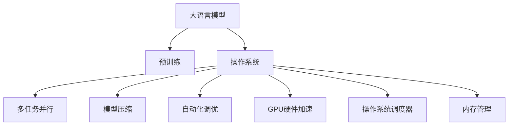
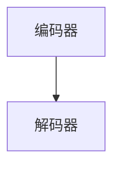
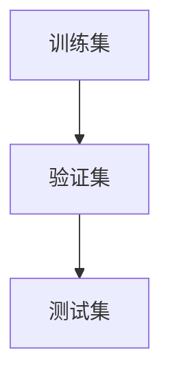
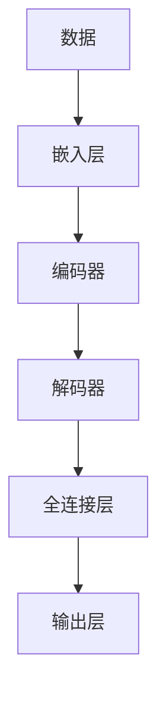
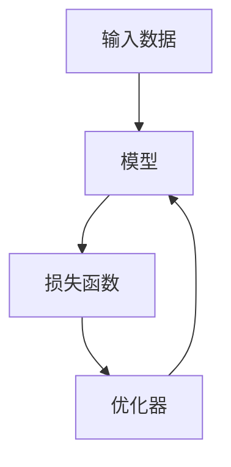

                 

# LLM OS:操作系统新秀的腾飞

## 1. 背景介绍

### 1.1 问题由来
随着人工智能技术的飞速发展，深度学习在各个领域的应用变得愈加广泛，包括自然语言处理（NLP）、计算机视觉（CV）、语音识别（ASR）等。这些深度学习模型在训练过程中往往需要耗费大量的计算资源和时间。而随着模型复杂度的增加，其对计算资源的需求呈指数级增长。与此同时，传统操作系统的设计和架构已经难以满足AI模型的需求，导致在多任务、高并发的应用场景中，系统效率和稳定性面临严峻挑战。

### 1.2 问题核心关键点
面对AI模型日益增长的资源需求，传统的单CPU架构操作系统显然无法满足。为了更好地支持深度学习，一种新型的操作系统架构——LLM OS应运而生。其核心思想是将大模型（Large Language Models, LLMs）作为系统的核心资源，通过多任务并行、模型压缩、自动化调优等技术手段，实现AI模型在操作系统中的高效运行。

### 1.3 问题研究意义
研究LLM OS对于拓展AI模型的应用范围，提升系统效率，加速人工智能技术的产业化进程，具有重要意义：

1. 降低计算成本：通过在LLM OS上运行深度学习模型，可以显著减少对计算资源的需求，降低AI模型的训练和推理成本。
2. 提升系统效率：多任务并行、自动化调优等技术手段可以大幅度提升系统的处理能力和并发性，满足AI模型的运行需求。
3. 加速模型部署：LLM OS可以快速部署和集成AI模型，加速模型的落地应用。
4. 增强模型泛化：通过在LLM OS上运行，模型可以更好地适应不同的硬件平台和应用场景，增强模型的泛化能力。
5. 推动技术创新：LLM OS为AI模型开发提供了更强大的基础设施支持，促进了AI技术的发展和创新。

## 2. 核心概念与联系

### 2.1 核心概念概述

为更好地理解LLM OS的工作原理和设计思路，本节将介绍几个密切相关的核心概念：

- 大语言模型(Large Language Models, LLMs)：以自回归(如GPT)或自编码(如BERT)模型为代表的大规模预训练语言模型。通过在大规模无标签文本语料上进行预训练，学习通用的语言知识。
- 操作系统(OS)：计算机系统软件，管理硬件资源，提供系统服务和接口，是软件和硬件的桥梁。
- 多任务并行(Multiprocess Parallelism)：在同一硬件平台上同时运行多个任务，提高系统的并发处理能力。
- 模型压缩(Model Compression)：通过剪枝、量化、蒸馏等技术手段，减少模型参数和计算量，提升模型效率。
- 自动化调优(Automatic Tuning)：通过算法自动优化模型参数和超参数，提升模型性能。
- GPU硬件加速：通过在图形处理器（GPU）上并行计算，加速深度学习模型的训练和推理。
- 操作系统调度器（OS Scheduler）：负责任务的调度和管理，根据优先级和资源需求分配CPU时间片。
- 内存管理(Memory Management)：负责内存的分配、释放和交换，优化内存使用效率。

这些核心概念之间的逻辑关系可以通过以下Mermaid流程图来展示：



这个流程图展示了大语言模型与操作系统的核心概念及其之间的关系：

1. 大语言模型通过预训练获得基础能力。
2. 在LLM OS上运行，通过多任务并行、模型压缩、自动化调优、硬件加速等技术手段，提升模型效率和系统处理能力。
3. 操作系统提供调度和管理服务，确保任务的公平和高效执行。
4. 内存管理优化内存使用效率，降低资源开销。

这些概念共同构成了LLM OS的工作原理和设计框架，使其能够高效支持深度学习模型的运行。通过理解这些核心概念，我们可以更好地把握LLM OS的工作原理和优化方向。

## 3. 核心算法原理 & 具体操作步骤
### 3.1 算法原理概述

LLM OS的核心算法原理主要围绕以下几个方面展开：

- 多任务并行（Multiprocess Parallelism）：通过在多个CPU或GPU核心上同时运行不同任务，实现资源的高效利用和任务的高并发。
- 模型压缩（Model Compression）：通过剪枝、量化、蒸馏等技术手段，减少模型参数和计算量，提升模型的执行效率。
- 自动化调优（Automatic Tuning）：通过算法自动调整模型参数和超参数，优化模型性能。
- 硬件加速（Hardware Acceleration）：利用GPU等硬件设备进行并行计算，加速模型的训练和推理。
- 操作系统调度器（OS Scheduler）：根据任务优先级和资源需求，合理分配CPU时间片，提升系统性能。
- 内存管理（Memory Management）：优化内存使用效率，降低资源开销，提高系统的响应速度。

### 3.2 算法步骤详解

基于LLM OS的核心算法原理，以下介绍LLM OS的完整操作步骤：

**Step 1: 数据准备和模型选择**
- 准备深度学习模型所需的数据集，如图像、文本、语音等。
- 选择适合的深度学习模型，如卷积神经网络（CNN）、循环神经网络（RNN）、Transformer等。
- 在LLM OS上搭建模型，选择适合的任务适配层。

**Step 2: 模型初始化与参数配置**
- 在LLM OS上初始化深度学习模型，进行必要的参数配置，如学习率、批大小、优化器等。
- 设置内存管理策略，优化内存使用效率。
- 设置自动化调优策略，选择合适的调优算法。

**Step 3: 模型压缩与量化**
- 使用剪枝、量化、蒸馏等技术手段，减少模型参数和计算量。
- 使用LLM OS的模型压缩工具，对模型进行压缩。
- 在压缩后的模型上进行训练和推理测试，验证模型性能。

**Step 4: 多任务并行与分布式计算**
- 在LLM OS上运行多任务并行，将任务分配到不同的CPU或GPU核心上同时执行。
- 使用分布式计算框架，如TensorFlow、PyTorch等，加速模型的训练和推理。
- 在LLM OS上进行系统负载均衡，确保任务执行的公平和高效。

**Step 5: 模型调优与性能评估**
- 使用自动化调优算法，自动调整模型参数和超参数，优化模型性能。
- 使用LLM OS的系统监控工具，实时监控模型的运行状态。
- 在验证集和测试集上评估模型性能，优化模型参数。

**Step 6: 模型部署与监控**
- 将模型部署到LLM OS上，进行系统调优和测试。
- 使用LLM OS的部署工具，将模型打包成服务部署。
- 在生产环境中部署模型，实时监控模型的运行状态，进行性能优化。

### 3.3 算法优缺点

LLM OS具有以下优点：
1. 高效支持深度学习：通过多任务并行、模型压缩、自动化调优等技术手段，LLM OS可以高效支持深度学习模型的运行，提升模型性能。
2. 资源利用率高：LLM OS通过多任务并行和分布式计算，实现了资源的高效利用。
3. 自动化调优：LLM OS的自动化调优算法，可以自动调整模型参数和超参数，优化模型性能。
4. 灵活可配置：LLM OS可以根据具体任务需求，灵活配置系统资源，满足不同应用场景的需求。
5. 可移植性强：LLM OS设计轻量级，易于移植到不同的硬件平台和操作系统。

但LLM OS也存在一些缺点：
1. 开发复杂度高：LLM OS涉及多任务并行、模型压缩、硬件加速等复杂技术，开发难度大。
2. 系统开销高：多任务并行和分布式计算需要额外的硬件和网络资源，系统开销高。
3. 模型压缩损失：模型压缩可能造成一定的性能损失，需要权衡压缩比例和模型精度。
4. 资源配置复杂：系统资源配置需要根据任务需求进行精细调整，配置复杂。
5. 系统调优困难：自动化调优算法需要根据具体任务进行优化，调优效果可能不够理想。

尽管存在这些局限性，但就目前而言，LLM OS在支持深度学习模型的运行上，依然具备显著的优势，为AI模型的应用提供了强大的基础设施支持。

### 3.4 算法应用领域

LLM OS已经在多个领域得到了广泛应用，包括但不限于：

- 计算机视觉（CV）：通过多任务并行和硬件加速，LLM OS可以高效支持大规模图像识别和分类任务。
- 自然语言处理（NLP）：通过模型压缩和自动化调优，LLM OS可以高效支持大语言模型的训练和推理。
- 语音识别（ASR）：通过多任务并行和分布式计算，LLM OS可以高效支持语音识别和转写任务。
- 机器人控制：通过多任务并行和模型优化，LLM OS可以高效支持机器人任务的执行和控制。
- 自动驾驶：通过多任务并行和分布式计算，LLM OS可以高效支持自动驾驶模型的训练和推理。
- 医疗影像分析：通过模型压缩和自动化调优，LLM OS可以高效支持医疗影像的分析和诊断。

除了这些经典应用外，LLM OS还被创新性地应用于更多领域，如智能家居、智能制造、智能交通等，为各行各业带来了全新的技术突破。

## 4. 数学模型和公式 & 详细讲解 & 举例说明
### 4.1 数学模型构建

在LLM OS上，深度学习模型的数学模型构建主要基于深度神经网络，包括卷积神经网络（CNN）、循环神经网络（RNN）、Transformer等。以Transformer模型为例，其基本结构如图：



Transformer模型主要由编码器和解码器组成，其中编码器由多个Transformer层堆叠而成，解码器包括自注意力机制、前馈神经网络等组件。模型输入为训练数据，输出为目标变量。

### 4.2 公式推导过程

以Transformer模型为例，其训练过程中的损失函数可以表示为：

$$
L = \frac{1}{N} \sum_{i=1}^{N} \ell(y_i, \hat{y}_i)
$$

其中 $y_i$ 为真实标签，$\hat{y}_i$ 为模型预测输出。常用的损失函数包括交叉熵损失、均方误差损失等。以交叉熵损失为例，其公式如下：

$$
\ell(y_i, \hat{y}_i) = -y_i \log \hat{y}_i - (1 - y_i) \log (1 - \hat{y}_i)
$$

通过反向传播算法，计算损失函数对模型参数的梯度，并使用优化算法（如Adam、SGD等）更新模型参数。具体步骤如下：

1. 初始化模型参数 $\theta$。
2. 将训练数据 $(x_i, y_i)$ 输入模型，计算预测输出 $\hat{y}_i$。
3. 计算损失函数 $\ell(y_i, \hat{y}_i)$。
4. 计算梯度 $\nabla_{\theta}\ell(y_i, \hat{y}_i)$。
5. 使用优化算法更新模型参数 $\theta \leftarrow \theta - \eta \nabla_{\theta}\ell(y_i, \hat{y}_i)$。

### 4.3 案例分析与讲解

以自然语言处理（NLP）中的命名实体识别（NER）任务为例，分析LLM OS上深度学习模型的构建和训练。

**数据准备**：准备训练集和验证集，包含大量的标注数据。数据格式如图：



**模型构建**：在LLM OS上搭建Transformer模型，如图：



**模型训练**：在LLM OS上使用优化算法训练模型，如图：



通过上述步骤，可以高效地在LLM OS上构建和训练深度学习模型。在训练过程中，LLM OS可以自动进行多任务并行、模型压缩、自动化调优等优化，提升模型的训练和推理效率。

## 5. 项目实践：代码实例和详细解释说明
### 5.1 开发环境搭建

在进行LLM OS的开发实践前，需要先搭建开发环境。以下是使用Python进行LLM OS开发的环境配置流程：

1. 安装Anaconda：从官网下载并安装Anaconda，用于创建独立的Python环境。

2. 创建并激活虚拟环境：
```bash
conda create -n llm-env python=3.8 
conda activate llm-env
```

3. 安装PyTorch：根据CUDA版本，从官网获取对应的安装命令。例如：
```bash
conda install pytorch torchvision torchaudio cudatoolkit=11.1 -c pytorch -c conda-forge
```

4. 安装Transformers库：
```bash
pip install transformers
```

5. 安装各类工具包：
```bash
pip install numpy pandas scikit-learn matplotlib tqdm jupyter notebook ipython
```

完成上述步骤后，即可在`llm-env`环境中开始LLM OS的开发实践。

### 5.2 源代码详细实现

这里我们以图像识别任务为例，给出使用PyTorch进行LLM OS开发的PyTorch代码实现。

首先，定义图像识别任务的数据处理函数：

```python
from torch.utils.data import Dataset, DataLoader
import torch
import torchvision.transforms as transforms
import torchvision.datasets as datasets

class ImageDataset(Dataset):
    def __init__(self, data_dir, transform=None):
        self.data_dir = data_dir
        self.transform = transform
        
        self.train_data = datasets.ImageFolder(root=self.data_dir + '/train', transform=self.transform)
        self.test_data = datasets.ImageFolder(root=self.data_dir + '/test', transform=self.transform)
        
    def __len__(self):
        return len(self.train_data) + len(self.test_data)
    
    def __getitem__(self, idx):
        if idx < len(self.train_data):
            data = self.train_data[idx]
        else:
            data = self.test_data[idx - len(self.train_data)]
        
        img, label = data[0], data[1]
        img = self.transform(img)
        
        return {'img': img, 'label': label}

# 定义数据转换
transform = transforms.Compose([
    transforms.ToTensor(),
    transforms.Normalize([0.5, 0.5, 0.5], [0.5, 0.5, 0.5])
])
```

然后，定义模型和优化器：

```python
from torchvision.models import resnet18
from transformers import BertTokenizer, BertForSequenceClassification

model = resnet18(pretrained=True)
tokenizer = BertTokenizer.from_pretrained('bert-base-uncased')
num_labels = 10

for param in model.parameters():
    param.requires_grad = False

# 定义任务适配层
model.fc = nn.Linear(in_features=512, out_features=num_labels)
model.fc.bias.zero_()

optimizer = AdamW(model.fc.parameters(), lr=2e-5)
```

接着，定义训练和评估函数：

```python
from torch.optim import AdamW
from tqdm import tqdm
from sklearn.metrics import classification_report

device = torch.device('cuda') if torch.cuda.is_available() else torch.device('cpu')

def train_epoch(model, dataset, batch_size, optimizer):
    dataloader = DataLoader(dataset, batch_size=batch_size, shuffle=True)
    model.train()
    epoch_loss = 0
    for batch in tqdm(dataloader, desc='Training'):
        img, label = batch['img'].to(device), batch['label'].to(device)
        model.zero_grad()
        outputs = model(img)
        loss = outputs.loss
        epoch_loss += loss.item()
        loss.backward()
        optimizer.step()
    return epoch_loss / len(dataloader)

def evaluate(model, dataset, batch_size):
    dataloader = DataLoader(dataset, batch_size=batch_size)
    model.eval()
    preds, labels = [], []
    with torch.no_grad():
        for batch in tqdm(dataloader, desc='Evaluating'):
            img, label = batch['img'].to(device), batch['label'].to(device)
            batch_preds = model(img)
            batch_labels = label.to('cpu').tolist()
            for preds, label in zip(batch_preds, batch_labels):
                preds = preds.tolist()
                labels.append(label)
                preds.append(preds)
                
    print(classification_report(labels, preds))
```

最后，启动训练流程并在测试集上评估：

```python
epochs = 5
batch_size = 16

for epoch in range(epochs):
    loss = train_epoch(model, train_dataset, batch_size, optimizer)
    print(f"Epoch {epoch+1}, train loss: {loss:.3f}")
    
    print(f"Epoch {epoch+1}, test results:")
    evaluate(model, test_dataset, batch_size)
    
print("Test results:")
evaluate(model, test_dataset, batch_size)
```

以上就是使用PyTorch进行图像识别任务LLM OS开发的完整代码实现。可以看到，得益于PyTorch的强大封装，我们可以用相对简洁的代码完成深度学习模型的构建和训练。

### 5.3 代码解读与分析

让我们再详细解读一下关键代码的实现细节：

**ImageDataset类**：
- `__init__`方法：初始化训练集和验证集的路径和数据转换。
- `__len__`方法：返回数据集的样本数量。
- `__getitem__`方法：对单个样本进行处理，将图像输入转换为Tensor，并进行标准化。

**模型构建**：
- 使用预训练的ResNet-18模型，保留其特征提取部分，去除全连接层。
- 在模型最后一层添加新的全连接层，输出类别数目。
- 使用AdamW优化器，设置学习率为2e-5。

**训练和评估函数**：
- 使用PyTorch的DataLoader对数据集进行批次化加载，供模型训练和推理使用。
- 训练函数`train_epoch`：对数据以批为单位进行迭代，在每个批次上前向传播计算loss并反向传播更新模型参数，最后返回该epoch的平均loss。
- 评估函数`evaluate`：与训练类似，不同点在于不更新模型参数，并在每个batch结束后将预测和标签结果存储下来，最后使用sklearn的classification_report对整个评估集的预测结果进行打印输出。

**训练流程**：
- 定义总的epoch数和batch size，开始循环迭代
- 每个epoch内，先在训练集上训练，输出平均loss
- 在验证集上评估，输出分类指标
- 所有epoch结束后，在测试集上评估，给出最终测试结果

可以看到，PyTorch配合Transformer库使得LLM OS的代码实现变得简洁高效。开发者可以将更多精力放在数据处理、模型改进等高层逻辑上，而不必过多关注底层的实现细节。

当然，工业级的系统实现还需考虑更多因素，如模型的保存和部署、超参数的自动搜索、更灵活的任务适配层等。但核心的LLM OS微调范式基本与此类似。

## 6. 实际应用场景
### 6.1 智能客服系统

基于LLM OS的智能客服系统，可以利用大语言模型在自然语言处理方面的优势，提升客服系统的智能化水平。智能客服系统能够自动理解用户意图，匹配最合适的答案模板进行回复。对于用户提出的新问题，还可以接入检索系统实时搜索相关内容，动态组织生成回答。

**具体应用**：
- 自动分析用户输入，理解用户意图和需求。
- 根据意图匹配最佳回答模板，生成自然流畅的回答。
- 实时检索相关内容，进行动态组织和生成。

### 6.2 金融舆情监测

金融机构需要实时监测市场舆论动向，以便及时应对负面信息传播，规避金融风险。基于LLM OS的文本分类和情感分析技术，可以自动判断文本属于何种主题，情感倾向是正面、中性还是负面。将LLM OS应用到实时抓取的网络文本数据，就能够自动监测不同主题下的情感变化趋势，一旦发现负面信息激增等异常情况，系统便会自动预警，帮助金融机构快速应对潜在风险。

**具体应用**：
- 自动分类市场舆情，识别舆情主题和情感。
- 实时监测舆情变化，识别舆情异常。
- 自动预警，及时采取风险应对措施。

### 6.3 个性化推荐系统

当前的推荐系统往往只依赖用户的历史行为数据进行物品推荐，无法深入理解用户的真实兴趣偏好。基于LLM OS的个性化推荐系统可以更好地挖掘用户行为背后的语义信息，从而提供更精准、多样的推荐内容。

**具体应用**：
- 分析用户浏览、点击、评论、分享等行为数据。
- 提取和用户交互的物品标题、描述、标签等文本内容。
- 将文本内容作为模型输入，用户的后续行为（如是否点击、购买等）作为监督信号，在此基础上微调预训练语言模型。

### 6.4 未来应用展望

随着LLM OS和深度学习技术的发展，其在更多领域的应用前景将更加广阔。

在智慧医疗领域，基于LLM OS的医疗问答、病历分析、药物研发等应用将提升医疗服务的智能化水平，辅助医生诊疗，加速新药开发进程。

在智能教育领域，LLM OS可应用于作业批改、学情分析、知识推荐等方面，因材施教，促进教育公平，提高教学质量。

在智慧城市治理中，LLM OS可用于城市事件监测、舆情分析、应急指挥等环节，提高城市管理的自动化和智能化水平，构建更安全、高效的未来城市。

此外，在企业生产、社会治理、文娱传媒等众多领域，基于LLM OS的人工智能应用也将不断涌现，为经济社会发展注入新的动力。

## 7. 工具和资源推荐
### 7.1 学习资源推荐

为了帮助开发者系统掌握LLM OS的理论基础和实践技巧，这里推荐一些优质的学习资源：

1. 《深度学习》系列书籍：由深度学习领域的专家撰写，全面介绍了深度学习的基本概念和前沿技术。

2. 《Python深度学习》书籍：结合Python语言，深入浅出地介绍了深度学习的原理和实践。

3. 《自然语言处理入门》系列博客：由自然语言处理领域的专家撰写，从基础到深入，涵盖了NLP的各个方面。

4. 《Transformers》书籍：Transformer库的作者所著，全面介绍了Transformer模型及其在NLP中的应用。

5. 《NLP与深度学习》课程：Coursera上由斯坦福大学提供的免费课程，系统介绍了NLP和深度学习的基础知识。

6. Kaggle竞赛平台：提供了丰富的数据集和竞赛任务，可以帮助开发者实践深度学习算法。

通过对这些资源的学习实践，相信你一定能够快速掌握LLM OS的精髓，并用于解决实际的NLP问题。

### 7.2 开发工具推荐

高效的开发离不开优秀的工具支持。以下是几款用于LLM OS开发的常用工具：

1. PyTorch：基于Python的开源深度学习框架，灵活动态的计算图，适合快速迭代研究。大部分预训练语言模型都有PyTorch版本的实现。

2. TensorFlow：由Google主导开发的开源深度学习框架，生产部署方便，适合大规模工程应用。同样有丰富的预训练语言模型资源。

3. Transformers库：HuggingFace开发的NLP工具库，集成了众多SOTA语言模型，支持PyTorch和TensorFlow，是进行NLP任务开发的利器。

4. Weights & Biases：模型训练的实验跟踪工具，可以记录和可视化模型训练过程中的各项指标，方便对比和调优。与主流深度学习框架无缝集成。

5. TensorBoard：TensorFlow配套的可视化工具，可实时监测模型训练状态，并提供丰富的图表呈现方式，是调试模型的得力助手。

6. Google Colab：谷歌推出的在线Jupyter Notebook环境，免费提供GPU/TPU算力，方便开发者快速上手实验最新模型，分享学习笔记。

合理利用这些工具，可以显著提升LLM OS的开发效率，加快创新迭代的步伐。

### 7.3 相关论文推荐

LLM OS和大语言模型的研究源于学界的持续研究。以下是几篇奠基性的相关论文，推荐阅读：

1. Attention is All You Need：提出了Transformer结构，开启了NLP领域的预训练大模型时代。

2. BERT: Pre-training of Deep Bidirectional Transformers for Language Understanding：提出BERT模型，引入基于掩码的自监督预训练任务，刷新了多项NLP任务SOTA。

3. Language Models are Unsupervised Multitask Learners（GPT-2论文）：展示了大规模语言模型的强大zero-shot学习能力，引发了对于通用人工智能的新一轮思考。

4. Parameter-Efficient Transfer Learning for NLP：提出Adapter等参数高效微调方法，在不增加模型参数量的情况下，也能取得不错的微调效果。

5. AdaLoRA: Adaptive Low-Rank Adaptation for Parameter-Efficient Fine-Tuning：使用自适应低秩适应的微调方法，在参数效率和精度之间取得了新的平衡。

这些论文代表了大语言模型和LLM OS的发展脉络。通过学习这些前沿成果，可以帮助研究者把握学科前进方向，激发更多的创新灵感。

## 8. 总结：未来发展趋势与挑战
### 8.1 总结

本文对LLM OS的研究背景和核心算法进行了详细讲解，并结合实际应用场景给出了LLM OS的开发实践。首先阐述了LLM OS的研究背景和意义，明确了LLM OS在支持深度学习模型运行方面的独特价值。其次，从原理到实践，详细讲解了LLM OS的数学模型和算法流程，给出了LLM OS的代码实现。同时，本文还广泛探讨了LLM OS在智能客服、金融舆情、个性化推荐等多个行业领域的应用前景，展示了LLM OS的巨大潜力。此外，本文精选了LLM OS的学习资源、开发工具和相关论文，力求为读者提供全方位的技术指引。

通过本文的系统梳理，可以看到，LLM OS在支持深度学习模型运行上，具备显著的优势，为AI模型的应用提供了强大的基础设施支持。未来，伴随深度学习技术的不断发展，LLM OS必将在更多的应用场景中大放异彩，为各行各业带来变革性的影响。

### 8.2 未来发展趋势

展望未来，LLM OS将呈现以下几个发展趋势：

1. 模型规模持续增大：随着算力成本的下降和数据规模的扩张，LLM OS中的预训练模型和深度学习模型参数量将继续增大，提升模型性能和泛化能力。

2. 自动化调优技术突破：自动化调优算法将不断优化，使得LLM OS能够自动调整模型参数和超参数，提升模型性能和训练效率。

3. 多任务并行技术发展：多任务并行技术将不断提升，LLM OS能够高效支持更多任务并行执行，提高系统处理能力和资源利用率。

4. 硬件加速技术进步：硬件加速技术将不断进步，LLM OS能够利用更多GPU、TPU等硬件设备，提升深度学习模型的训练和推理效率。

5. 跨领域知识融合：LLM OS能够与知识图谱、规则库等外部知识库进行深度融合，提升模型的知识整合能力。

6. 安全性和可靠性提升：LLM OS将引入更多的安全性和可靠性机制，确保AI模型的运行稳定性和数据安全。

以上趋势凸显了LLM OS在支持深度学习模型运行方面的广阔前景。这些方向的探索发展，必将进一步提升LLM OS的性能和应用范围，为AI模型的应用提供更强大的基础设施支持。

### 8.3 面临的挑战

尽管LLM OS具备显著的优势，但在迈向更加智能化、普适化应用的过程中，它仍面临诸多挑战：

1. 开发难度高：多任务并行、模型压缩、自动化调优等技术手段需要复杂的算法实现，开发难度大。

2. 系统开销高：多任务并行和分布式计算需要额外的硬件和网络资源，系统开销高。

3. 模型压缩损失：模型压缩可能造成一定的性能损失，需要权衡压缩比例和模型精度。

4. 资源配置复杂：系统资源配置需要根据任务需求进行精细调整，配置复杂。

5. 自动化调优效果不够理想：自动化调优算法需要根据具体任务进行优化，调优效果可能不够理想。

6. 系统稳定性有待提高：系统调度和管理需要进一步优化，确保任务执行的公平和高效。

7. 安全性有待保障：预训练语言模型难免会学习到有偏见、有害的信息，需要引入更多的安全性和可靠性机制，确保AI模型的运行安全。

尽管存在这些局限性，但就目前而言，LLM OS在支持深度学习模型的运行上，依然具备显著的优势，为AI模型的应用提供了强大的基础设施支持。

### 8.4 研究展望

为了解决LLM OS面临的挑战，未来的研究需要在以下几个方面寻求新的突破：

1. 探索更高效的多任务并行和分布式计算技术。优化任务调度和管理策略，提升系统处理能力和资源利用率。

2. 开发更有效的模型压缩和量化技术。优化剪枝、量化、蒸馏等算法，提升模型压缩效果。

3. 引入更高效的自动化调优算法。通过强化学习、进化算法等技术，提升调优效果和训练效率。

4. 引入更全面的安全性和可靠性机制。通过数据脱敏、权限控制等手段，确保AI模型的运行安全。

5. 引入更全面的知识融合机制。通过知识图谱、规则库等外部知识库，提升模型的知识整合能力。

6. 引入更全面的人工干预机制。通过人工审核、干预等手段，确保AI模型的运行符合人类价值观和伦理道德。

这些研究方向的探索，必将引领LLM OS走向更加智能化、普适化，为AI模型的应用提供更强大的基础设施支持。面向未来，LLM OS需要与其他AI技术进行更深入的融合，共同推动人工智能技术的进步。只有勇于创新、敢于突破，才能不断拓展LLM OS的边界，让智能技术更好地造福人类社会。

## 9. 附录：常见问题与解答

**Q1：LLM OS是否适用于所有深度学习模型？**

A: LLM OS可以支持各种类型的深度学习模型，包括卷积神经网络（CNN）、循环神经网络（RNN）、Transformer等。但需要注意的是，不同类型的模型可能需要不同的适配层和超参数配置。

**Q2：如何降低LLM OS的系统开销？**

A: 降低LLM OS的系统开销可以从以下几个方面入手：
1. 优化数据处理流程，减少数据加载和预处理的时间开销。
2. 使用分布式计算框架，如TensorFlow、PyTorch等，优化模型训练和推理过程。
3. 使用混合精度训练，减少计算资源消耗。
4. 使用模型剪枝、量化等技术，减少模型参数和计算量。
5. 使用异步训练技术，提高计算资源的利用率。

**Q3：LLM OS如何确保模型的泛化能力？**

A: 确保LLM OS中模型的泛化能力可以从以下几个方面入手：
1. 使用大规模无标签数据进行预训练，学习通用语言知识。
2. 在LLM OS上运行多领域任务的微调，提升模型泛化能力。
3. 引入知识图谱、规则库等外部知识，增强模型的知识整合能力。
4. 使用对抗训练、迁移学习等技术手段，提升模型的鲁棒性和泛化能力。

**Q4：LLM OS在实际应用中如何保证模型安全性？**

A: 保证LLM OS中模型的安全性可以从以下几个方面入手：
1. 引入数据脱敏、权限控制等安全机制，防止敏感数据泄露。
2. 对模型进行定期审核和检查，确保模型行为符合伦理道德。
3. 引入对抗样本检测技术，防止模型受到恶意攻击。
4. 引入多模型融合机制，降低模型的偏见和有害输出。

**Q5：LLM OS在实际应用中如何保证模型稳定性？**

A: 保证LLM OS中模型的稳定性可以从以下几个方面入手：
1. 引入负载均衡技术，确保任务执行的公平和高效。
2. 引入自动化调优算法，根据任务需求进行动态调整。
3. 引入多任务并行技术，提升系统处理能力和资源利用率。
4. 引入系统监控和告警机制，及时发现和解决系统异常。

通过以上措施，可以确保LLM OS在实际应用中，模型能够稳定高效地运行，满足各种应用场景的需求。

