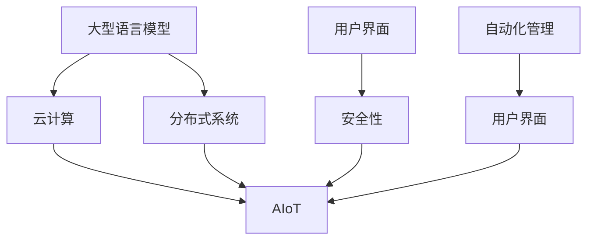

                 

# LLM OS:操作系统新贵的崛起

> 关键词：操作系统,LLM,云计算,分布式系统,AIoT,安全,自动化,用户友好性

## 1. 背景介绍

### 1.1 问题由来

在21世纪的科技浪潮中，操作系统（OS）是构建数字世界的基石，不仅负责管理和优化硬件资源，还负责提供高效、稳定的应用运行环境。然而，随着技术日新月异，传统操作系统的功能和服务逐渐被各种新型计算平台所超越，特别是云计算、分布式系统、物联网（AIoT）等领域的迅猛发展，传统操作系统的服务模式和运行机制面临着前所未有的挑战。

在数据驱动和人工智能的浪潮中，一种全新的操作系统概念正在崛起——LLM OS。LLM OS（Large Language Model OS）是基于大型语言模型（Large Language Model, LLM）的下一代操作系统，旨在融合最新的AI技术和先进的计算资源，提供全新的计算服务，不仅将改变操作系统的设计思路，还将在未来的计算世界占有重要地位。

### 1.2 问题核心关键点

LLM OS的核心在于如何利用LLM的强大语言处理能力，结合分布式计算和云计算的技术优势，为用户提供全新的计算体验和应用场景。

具体来说，LLM OS的关键点包括：
1. **语言理解和生成**：利用LLM的高级自然语言处理能力，实现对用户指令的自然理解，并提供语义丰富的反馈。
2. **分布式计算能力**：通过云计算平台实现资源的弹性分配和高效调度，支持大规模并发请求。
3. **用户界面友好性**：提供直观、易用的用户界面，支持多种设备和场景下的无缝体验。
4. **安全性与隐私保护**：确保系统运行的安全性和用户数据的安全性，防止恶意攻击和数据泄露。
5. **自动化管理与维护**：通过智能化的管理系统，实现系统的自动化配置、故障诊断和修复。

## 2. 核心概念与联系

### 2.1 核心概念概述

为更好地理解LLM OS的核心概念，本节将介绍几个密切相关的核心概念：

- **大型语言模型（LLM）**：指基于深度学习技术，能够处理大规模语言数据并生成高质量文本的模型，如GPT、BERT等。
- **云计算平台**：指通过互联网提供计算资源和服务的模式，用户按需使用，无需管理和维护物理硬件。
- **分布式系统**：指将计算资源分散部署在不同节点上，通过网络协同工作，实现高效的资源利用和任务调度。
- **物联网（AIoT）**：指将传感器、设备与互联网连接，实现数据收集、传输和分析，提升物理世界与数字世界的互联互通。
- **用户界面（UI）**：指用户与计算机交互的接口，包括图形用户界面（GUI）和命令行界面（CLI）等。
- **安全性与隐私保护**：指系统设计和实现中，如何保障用户数据和操作的安全性，防止未经授权的访问和攻击。
- **自动化管理与维护**：指系统通过自动化技术，实现自我配置、故障检测和修复，提升运维效率和稳定性。

这些核心概念之间的逻辑关系可以通过以下Mermaid流程图来展示：



这个流程图展示了大语言模型的核心概念及其之间的关系：

1. LLM通过处理大规模语言数据，学习通用语言表示。
2. 云计算平台提供弹性和高效的计算资源，支撑大规模并行计算。
3. 分布式系统实现资源跨节点的协作，提供高可用性服务。
4. AIoT将传感器和设备接入互联网，实时收集和分析数据。
5. 用户界面通过图形和命令等方式，提供直观易用的交互体验。
6. 安全性与隐私保护确保系统运行和数据的安全。
7. 自动化管理与维护实现系统的自我配置和故障处理。

这些概念共同构成了LLM OS的设计框架，使得其能够充分发挥大语言模型的语言处理能力，结合云计算和分布式计算的技术优势，为用户提供更高效、更安全的计算服务。

## 3. 核心算法原理 & 具体操作步骤

### 3.1 算法原理概述

LLM OS的核心算法原理主要包括三个方面：

- **语言理解与生成算法**：利用预训练的LLM模型，实现对用户指令的自然理解，并生成语义丰富的响应。
- **分布式资源调度算法**：通过智能化的资源调度算法，实现任务的动态分配和优化，确保系统的高效运行。
- **用户界面设计与优化算法**：结合人机交互的心理学和行为学原理，设计直观易用的用户界面，提供无缝的用户体验。

### 3.2 算法步骤详解

基于上述核心算法原理，LLM OS的开发和部署通常包括以下关键步骤：

**Step 1: 准备预训练模型和计算资源**
- 选择合适的预训练语言模型 $M_{\theta}$ 作为初始化参数，如 GPT、BERT等。
- 确定云计算平台和分布式系统架构，准备好所需的计算资源。

**Step 2: 设计任务适配层**
- 根据特定任务需求，设计适配层以连接LLM模型和应用层，处理输入和输出。
- 添加数据增强和正则化技术，优化模型的泛化能力。

**Step 3: 实现分布式计算模块**
- 利用云计算平台的API和分布式计算框架（如Kubernetes、Apache Mesos等）实现任务调度和资源管理。
- 设计状态机和任务流管理算法，优化资源使用效率。

**Step 4: 开发用户界面模块**
- 基于图形化或命令行用户界面设计，实现直观易用的用户交互。
- 提供多终端支持，确保在多种设备上都能无缝使用。

**Step 5: 实现安全性与隐私保护**
- 采用数据加密、访问控制等技术，确保数据传输和存储的安全性。
- 实施身份认证和权限管理，防止未经授权的访问。

**Step 6: 集成自动化管理模块**
- 设计自动化配置和监控系统，实现系统自我管理和修复。
- 引入机器学习算法，实现故障预测和自我学习优化。

**Step 7: 系统测试与部署**
- 进行全面的功能测试和性能测试，确保系统的稳定性和可靠性。
- 将系统部署到实际环境中，监控运行状态，持续优化。

### 3.3 算法优缺点

LLM OS具有以下优点：
1. **高效处理复杂任务**：利用LLM的语言处理能力，能够高效处理自然语言输入，实现复杂任务的自动化。
2. **弹性计算资源**：通过云计算平台实现资源弹性分配，支持大规模并发请求。
3. **无缝用户界面**：提供直观易用的用户界面，支持多种设备和场景下的无缝体验。
4. **高安全性与隐私保护**：通过数据加密、访问控制等技术，保障系统运行和用户数据的安全。
5. **自动化管理与维护**：通过自动化技术，实现系统的自我配置和故障处理，提升运维效率和稳定性。

同时，LLM OS也存在以下局限性：
1. **数据依赖性高**：系统运行依赖于预训练模型和高质量数据，数据获取和处理成本较高。
2. **计算资源消耗大**：超大模型的推理计算和分布式调度需要大量计算资源，成本较高。
3. **复杂性高**：系统设计和实现复杂，需要跨学科的知识和技术。
4. **可解释性不足**：LLM模型的决策过程缺乏可解释性，难以进行系统调试和优化。

尽管存在这些局限性，但就目前而言，LLM OS仍是最具潜力的下一代操作系统范式之一，其强大的语言处理能力和先进的技术架构，将在未来的计算世界中扮演重要角色。

### 3.4 算法应用领域

LLM OS在多个领域具有广泛的应用前景：

- **智能客服与咨询**：通过自然语言理解，提供智能客服和在线咨询服务。
- **智慧城市管理**：结合传感器数据和地理信息系统，实现城市管理的智能化。
- **自动驾驶与车联网**：通过自然语言交互和高级驾驶决策，提升自动驾驶和车联网的智能化水平。
- **医疗诊断与健康管理**：通过自然语言处理和健康数据分析，提供智能诊断和健康管理服务。
- **工业自动化**：通过自然语言指令和实时数据分析，实现工业生产的智能化和自动化。
- **智能家居与物联网**：通过自然语言交互和设备互联，提升智能家居和物联网系统的用户体验。

这些应用场景展示了LLM OS的广阔前景，未来随着技术的发展和应用的推广，LLM OS将会在更多领域发挥其独特的优势。

## 4. 数学模型和公式 & 详细讲解 & 举例说明

### 4.1 数学模型构建

LLM OS的核心算法原理涉及多个数学模型，以下将逐一介绍：

**语言理解与生成算法**：
- **输入表示**：将用户输入的自然语言文本转换为向量表示，可以使用词嵌入或字符嵌入。
- **模型推理**：使用预训练的LLM模型进行语言推理，输出语义丰富的响应。

**分布式资源调度算法**：
- **资源池**：将计算资源划分为多个资源池，支持任务的动态分配。
- **任务调度**：设计任务调度算法，优化任务的执行顺序和资源使用效率。

**用户界面设计与优化算法**：
- **用户行为分析**：通过用户行为数据，分析用户的偏好和习惯。
- **界面设计**：基于用户行为分析结果，设计直观易用的用户界面。

### 4.2 公式推导过程

以下将以语言理解与生成算法为例，推导其中的数学模型。

假设用户输入的自然语言文本为 $x$，预训练的LLM模型为 $M_{\theta}$。将文本 $x$ 转换为向量表示 $v_x$，然后通过LLM模型进行推理，输出响应向量 $v_y$。

**输入表示**：
- 使用词嵌入将文本 $x$ 转换为向量 $v_x$。
- 向量 $v_x$ 的长度为文本的长度，维度为词嵌入的维度。

**模型推理**：
- 使用预训练的LLM模型 $M_{\theta}$ 对向量 $v_x$ 进行推理，输出响应向量 $v_y$。
- 向量 $v_y$ 的长度为LLM模型的输出维度，通常与词嵌入的维度相同。

**输出表示**：
- 将响应向量 $v_y$ 转换为自然语言文本，生成语义丰富的响应 $y$。

### 4.3 案例分析与讲解

以智能客服系统为例，展示LLM OS的应用场景和具体实现：

**系统架构**：
- **前端**：用户界面，接收用户输入的自然语言文本。
- **后端**：LLM模型推理和分布式计算模块，根据用户输入生成响应并调用分布式资源。
- **数据库**：存储历史对话数据，用于模型训练和知识库更新。

**实现流程**：
1. 用户通过前端界面输入自然语言文本。
2. 前端将输入文本发送至后端。
3. 后端调用LLM模型进行语言推理，生成响应文本。
4. 后端根据响应文本调用分布式计算模块，实现任务执行和资源调度。
5. 后端将响应文本返回至前端，用户接收响应。

## 5. 项目实践：代码实例和详细解释说明

### 5.1 开发环境搭建

在进行LLM OS的开发实践前，我们需要准备好开发环境。以下是使用Python进行PyTorch开发的环境配置流程：

1. 安装Anaconda：从官网下载并安装Anaconda，用于创建独立的Python环境。

2. 创建并激活虚拟环境：
```bash
conda create -n llm-env python=3.8 
conda activate llm-env
```

3. 安装PyTorch：根据CUDA版本，从官网获取对应的安装命令。例如：
```bash
conda install pytorch torchvision torchaudio cudatoolkit=11.1 -c pytorch -c conda-forge
```

4. 安装TensorFlow：由Google主导开发的开源深度学习框架，生产部署方便，适合大规模工程应用。同样有丰富的预训练语言模型资源。

5. 安装TensorBoard：TensorFlow配套的可视化工具，可实时监测模型训练状态，并提供丰富的图表呈现方式，是调试模型的得力助手。

6. 安装Weights & Biases：模型训练的实验跟踪工具，可以记录和可视化模型训练过程中的各项指标，方便对比和调优。与主流深度学习框架无缝集成。

完成上述步骤后，即可在`llm-env`环境中开始LLM OS的开发。

### 5.2 源代码详细实现

下面我们以智能客服系统为例，给出使用Transformers库对BERT模型进行微调的PyTorch代码实现。

首先，定义智能客服系统的数据处理函数：

```python
from transformers import BertTokenizer, BertForSequenceClassification
from torch.utils.data import Dataset
import torch

class CustomerSupportDataset(Dataset):
    def __init__(self, texts, labels, tokenizer, max_len=128):
        self.texts = texts
        self.labels = labels
        self.tokenizer = tokenizer
        self.max_len = max_len
        
    def __len__(self):
        return len(self.texts)
    
    def __getitem__(self, item):
        text = self.texts[item]
        label = self.labels[item]
        
        encoding = self.tokenizer(text, return_tensors='pt', max_length=self.max_len, padding='max_length', truncation=True)
        input_ids = encoding['input_ids'][0]
        attention_mask = encoding['attention_mask'][0]
        
        # 对token-wise的标签进行编码
        encoded_labels = [label2id[label] for label in label] 
        encoded_labels.extend([label2id['O']] * (self.max_len - len(encoded_labels)))
        labels = torch.tensor(encoded_labels, dtype=torch.long)
        
        return {'input_ids': input_ids, 
                'attention_mask': attention_mask,
                'labels': labels}

# 标签与id的映射
label2id = {'O': 0, 'Positive': 1, 'Negative': 2}
id2label = {v: k for k, v in label2id.items()}

# 创建dataset
tokenizer = BertTokenizer.from_pretrained('bert-base-cased')

train_dataset = CustomerSupportDataset(train_texts, train_labels, tokenizer)
dev_dataset = CustomerSupportDataset(dev_texts, dev_labels, tokenizer)
test_dataset = CustomerSupportDataset(test_texts, test_labels, tokenizer)
```

然后，定义模型和优化器：

```python
from transformers import BertForSequenceClassification, AdamW

model = BertForSequenceClassification.from_pretrained('bert-base-cased', num_labels=len(label2id))

optimizer = AdamW(model.parameters(), lr=2e-5)
```

接着，定义训练和评估函数：

```python
from torch.utils.data import DataLoader
from tqdm import tqdm
from sklearn.metrics import classification_report

device = torch.device('cuda') if torch.cuda.is_available() else torch.device('cpu')
model.to(device)

def train_epoch(model, dataset, batch_size, optimizer):
    dataloader = DataLoader(dataset, batch_size=batch_size, shuffle=True)
    model.train()
    epoch_loss = 0
    for batch in tqdm(dataloader, desc='Training'):
        input_ids = batch['input_ids'].to(device)
        attention_mask = batch['attention_mask'].to(device)
        labels = batch['labels'].to(device)
        model.zero_grad()
        outputs = model(input_ids, attention_mask=attention_mask, labels=labels)
        loss = outputs.loss
        epoch_loss += loss.item()
        loss.backward()
        optimizer.step()
    return epoch_loss / len(dataloader)

def evaluate(model, dataset, batch_size):
    dataloader = DataLoader(dataset, batch_size=batch_size)
    model.eval()
    preds, labels = [], []
    with torch.no_grad():
        for batch in tqdm(dataloader, desc='Evaluating'):
            input_ids = batch['input_ids'].to(device)
            attention_mask = batch['attention_mask'].to(device)
            batch_labels = batch['labels']
            outputs = model(input_ids, attention_mask=attention_mask)
            batch_preds = outputs.logits.argmax(dim=2).to('cpu').tolist()
            batch_labels = batch_labels.to('cpu').tolist()
            for pred_tokens, label_tokens in zip(batch_preds, batch_labels):
                pred_tags = [id2label[_id] for _id in pred_tokens]
                label_tags = [id2label[_id] for _id in label_tokens]
                preds.append(pred_tags[:len(label_tags)])
                labels.append(label_tags)
                
    print(classification_report(labels, preds))
```

最后，启动训练流程并在测试集上评估：

```python
epochs = 5
batch_size = 16

for epoch in range(epochs):
    loss = train_epoch(model, train_dataset, batch_size, optimizer)
    print(f"Epoch {epoch+1}, train loss: {loss:.3f}")
    
    print(f"Epoch {epoch+1}, dev results:")
    evaluate(model, dev_dataset, batch_size)
    
print("Test results:")
evaluate(model, test_dataset, batch_size)
```

以上就是使用PyTorch对BERT进行智能客服系统微调的完整代码实现。可以看到，得益于Transformers库的强大封装，我们可以用相对简洁的代码完成BERT模型的加载和微调。

### 5.3 代码解读与分析

让我们再详细解读一下关键代码的实现细节：

**CustomerSupportDataset类**：
- `__init__`方法：初始化文本、标签、分词器等关键组件。
- `__len__`方法：返回数据集的样本数量。
- `__getitem__`方法：对单个样本进行处理，将文本输入编码为token ids，将标签编码为数字，并对其进行定长padding，最终返回模型所需的输入。

**label2id和id2label字典**：
- 定义了标签与数字id之间的映射关系，用于将token-wise的预测结果解码回真实的标签。

**训练和评估函数**：
- 使用PyTorch的DataLoader对数据集进行批次化加载，供模型训练和推理使用。
- 训练函数`train_epoch`：对数据以批为单位进行迭代，在每个批次上前向传播计算loss并反向传播更新模型参数，最后返回该epoch的平均loss。
- 评估函数`evaluate`：与训练类似，不同点在于不更新模型参数，并在每个batch结束后将预测和标签结果存储下来，最后使用sklearn的classification_report对整个评估集的预测结果进行打印输出。

**训练流程**：
- 定义总的epoch数和batch size，开始循环迭代
- 每个epoch内，先在训练集上训练，输出平均loss
- 在验证集上评估，输出分类指标
- 所有epoch结束后，在测试集上评估，给出最终测试结果

可以看到，PyTorch配合Transformers库使得BERT微调的代码实现变得简洁高效。开发者可以将更多精力放在数据处理、模型改进等高层逻辑上，而不必过多关注底层的实现细节。

当然，工业级的系统实现还需考虑更多因素，如模型的保存和部署、超参数的自动搜索、更灵活的任务适配层等。但核心的微调范式基本与此类似。

## 6. 实际应用场景

### 6.1 智能客服系统

基于LLM OS的智能客服系统能够通过自然语言理解，提供高效、自动化的客服服务。系统能够自动理解用户的问题，并提供最佳解决方案，支持多语言、多渠道接入，提升用户体验。

在技术实现上，可以收集企业内部的历史客服对话记录，将问题和最佳答复构建成监督数据，在此基础上对预训练语言模型进行微调。微调后的模型能够自动理解用户意图，匹配最合适的答案模板进行回复。对于客户提出的新问题，还可以接入检索系统实时搜索相关内容，动态组织生成回答。如此构建的智能客服系统，能大幅提升客户咨询体验和问题解决效率。

### 6.2 智慧城市管理

智慧城市管理平台可以利用LLM OS的分布式计算能力，实时收集和分析城市各类数据，如交通流量、环境监测等，实现智能化的城市治理。系统能够自动调度资源，优化交通流量，预警环境污染，提升城市运行效率和居民生活质量。

在实现上，可以构建多层次的分布式计算架构，利用云计算平台实现任务分配和资源调度，结合传感器和物联网设备收集的实时数据，进行综合分析和预测。系统通过智能化的决策算法，实时调整交通信号灯、优化公共资源配置，提升城市的智能化水平。

### 6.3 自动驾驶与车联网

自动驾驶系统利用LLM OS的自然语言处理能力，实现与用户自然的语音和文本交互。系统能够理解用户的驾驶意图，提供路径规划、导航建议等，提升驾驶体验和安全性。

在技术实现上，可以构建自动驾驶AIoT系统，将车载传感器和设备与互联网连接，实时收集和分析驾驶环境数据。系统通过自然语言处理技术，与用户进行实时交互，根据用户输入生成驾驶指令，结合计算机视觉和传感器数据，进行智能决策和路径规划。系统能够动态调整驾驶策略，确保行车安全。

### 6.4 医疗诊断与健康管理

医疗诊断系统利用LLM OS的语言处理能力，提供智能化的诊断和健康管理服务。系统能够自动理解医生的诊断报告，提供病历检索、疾病预测等辅助诊断功能。

在实现上，可以构建医疗AIoT系统，结合电子健康记录（EHR）和医疗传感器，实时收集和分析患者的健康数据。系统通过自然语言处理技术，理解医生的诊断和建议，提供精准的健康管理方案，如疾病预测、治疗建议等，提升医疗服务的智能化水平。

### 6.5 工业自动化

工业自动化系统利用LLM OS的自然语言处理能力，实现与工人自然的交互。系统能够理解工人的操作指令，提供智能化的任务分配和资源调度，提升生产效率和质量。

在实现上，可以构建工业AIoT系统，将生产线设备和传感器与互联网连接，实时收集和分析生产数据。系统通过自然语言处理技术，与工人进行实时交互，理解工人的操作指令，提供智能化的任务分配和资源调度，提升生产效率和质量。系统能够动态调整生产策略，优化生产流程，提升生产线的智能化水平。

## 7. 工具和资源推荐

### 7.1 学习资源推荐

为了帮助开发者系统掌握LLM OS的理论基础和实践技巧，这里推荐一些优质的学习资源：

1. **《Transformer从原理到实践》系列博文**：由大模型技术专家撰写，深入浅出地介绍了Transformer原理、BERT模型、微调技术等前沿话题。

2. **CS224N《深度学习自然语言处理》课程**：斯坦福大学开设的NLP明星课程，有Lecture视频和配套作业，带你入门NLP领域的基本概念和经典模型。

3. **《Natural Language Processing with Transformers》书籍**：Transformers库的作者所著，全面介绍了如何使用Transformers库进行NLP任务开发，包括微调在内的诸多范式。

4. **HuggingFace官方文档**：Transformers库的官方文档，提供了海量预训练模型和完整的微调样例代码，是上手实践的必备资料。

5. **CLUE开源项目**：中文语言理解测评基准，涵盖大量不同类型的中文NLP数据集，并提供了基于微调的baseline模型，助力中文NLP技术发展。

通过对这些资源的学习实践，相信你一定能够快速掌握LLM OS的精髓，并用于解决实际的NLP问题。

### 7.2 开发工具推荐

高效的开发离不开优秀的工具支持。以下是几款用于LLM OS开发的常用工具：

1. **PyTorch**：基于Python的开源深度学习框架，灵活动态的计算图，适合快速迭代研究。大部分预训练语言模型都有PyTorch版本的实现。

2. **TensorFlow**：由Google主导开发的开源深度学习框架，生产部署方便，适合大规模工程应用。同样有丰富的预训练语言模型资源。

3. **Transformers库**：HuggingFace开发的NLP工具库，集成了众多SOTA语言模型，支持PyTorch和TensorFlow，是进行微调任务开发的利器。

4. **Weights & Biases**：模型训练的实验跟踪工具，可以记录和可视化模型训练过程中的各项指标，方便对比和调优。与主流深度学习框架无缝集成。

5. **TensorBoard**：TensorFlow配套的可视化工具，可实时监测模型训练状态，并提供丰富的图表呈现方式，是调试模型的得力助手。

6. **Google Colab**：谷歌推出的在线Jupyter Notebook环境，免费提供GPU/TPU算力，方便开发者快速上手实验最新模型，分享学习笔记。

合理利用这些工具，可以显著提升LLM OS的开发效率，加快创新迭代的步伐。

### 7.3 相关论文推荐

LLM OS的发展源于学界的持续研究。以下是几篇奠基性的相关论文，推荐阅读：

1. **Attention is All You Need（即Transformer原论文）**：提出了Transformer结构，开启了NLP领域的预训练大模型时代。

2. **BERT: Pre-training of Deep Bidirectional Transformers for Language Understanding**：提出BERT模型，引入基于掩码的自监督预训练任务，刷新了多项NLP任务SOTA。

3. **Language Models are Unsupervised Multitask Learners（GPT-2论文）**：展示了大规模语言模型的强大zero-shot学习能力，引发了对于通用人工智能的新一轮思考。

4. **Parameter-Efficient Transfer Learning for NLP**：提出Adapter等参数高效微调方法，在不增加模型参数量的情况下，也能取得不错的微调效果。

5. **Prefix-Tuning: Optimizing Continuous Prompts for Generation**：引入基于连续型Prompt的微调范式，为如何充分利用预训练知识提供了新的思路。

6. **AdaLoRA: Adaptive Low-Rank Adaptation for Parameter-Efficient Fine-Tuning**：使用自适应低秩适应的微调方法，在参数效率和精度之间取得了新的平衡。

这些论文代表了大语言模型微调技术的发展脉络。通过学习这些前沿成果，可以帮助研究者把握学科前进方向，激发更多的创新灵感。

## 8. 总结：未来发展趋势与挑战

### 8.1 总结

本文对基于大型语言模型（LLM）的下一代操作系统（LLM OS）进行了全面系统的介绍。首先阐述了LLM OS的研究背景和意义，明确了其在融合最新AI技术和先进计算资源方面的独特价值。其次，从原理到实践，详细讲解了LLM OS的数学模型和关键步骤，给出了系统开发的完整代码实例。同时，本文还广泛探讨了LLM OS在智能客服、智慧城市、自动驾驶等领域的实际应用，展示了其广阔的应用前景。此外，本文精选了LLM OS的技术学习资源，力求为开发者提供全方位的技术指引。

通过本文的系统梳理，可以看到，LLM OS是操作系统的未来趋势，其强大的语言处理能力和先进的技术架构，将在未来的计算世界中扮演重要角色。LLM OS不仅能够处理自然语言输入，还能够融合分布式计算和云计算的技术优势，提供全新的计算服务，具备高效处理复杂任务、弹性计算资源、无缝用户界面、高安全性与隐私保护、自动化管理与维护等核心优势。

### 8.2 未来发展趋势

展望未来，LLM OS将呈现以下几个发展趋势：

1. **语言处理能力增强**：随着LLM模型的不断训练和优化，其语言处理能力将进一步提升，能够更好地理解自然语言输入，提供更精准、更自然的响应。

2. **分布式计算能力优化**：云计算平台的资源调度算法将更加智能化，实现更高效的资源分配和任务调度。

3. **用户界面设计优化**：结合人机交互的心理学和行为学原理，设计更加直观易用的用户界面，提升用户体验。

4. **安全性与隐私保护加强**：通过数据加密、访问控制等技术，保障系统运行和用户数据的安全。

5. **自动化管理与维护自动化**：引入机器学习算法，实现故障预测和自我学习优化，提升运维效率和系统稳定性。

6. **跨模态数据融合**：将视觉、语音等多模态数据与文本数据进行融合，提升系统的智能化水平。

以上趋势凸显了LLM OS的广阔前景，随着技术的不断进步，LLM OS将在更多领域发挥其独特的优势，为构建智能、高效、安全的操作系统提供新的范式。

### 8.3 面临的挑战

尽管LLM OS具有广阔的应用前景，但在迈向更加智能化、普适化应用的过程中，它仍面临以下挑战：

1. **数据依赖性高**：系统运行依赖于高质量数据和预训练模型，数据获取和处理成本较高。

2. **计算资源消耗大**：超大模型的推理计算和分布式调度需要大量计算资源，成本较高。

3. **复杂性高**：系统设计和实现复杂，需要跨学科的知识和技术。

4. **可解释性不足**：LLM模型的决策过程缺乏可解释性，难以进行系统调试和优化。

5. **安全性与隐私保护**：如何保障系统运行和用户数据的安全，防止恶意攻击和数据泄露。

6. **自动化管理与维护**：系统的自动化配置和故障处理需要更高级的算法和机制。

7. **跨模态数据融合**：将视觉、语音等多模态数据与文本数据进行融合，需要更高效、更智能的算法。

尽管存在这些挑战，但LLM OS的未来发展前景依然广阔。随着技术的不断进步和研究的深入，相信LLM OS将能够在更广泛的领域发挥其独特的优势，为构建智能、高效、安全的操作系统提供新的范式。

### 8.4 研究展望

面向未来，LLM OS的研究可以从以下几个方向展开：

1. **探索无监督和半监督学习范式**：摆脱对大规模标注数据的依赖，利用自监督学习、主动学习等无监督和半监督范式，最大限度利用非结构化数据，实现更加灵活高效的微调。

2. **研究参数高效和计算高效的微调范式**：开发更加参数高效的微调方法，在固定大部分预训练参数的情况下，只更新极少量的任务相关参数。同时优化微调模型的计算图，减少前向传播和反向传播的资源消耗，实现更加轻量级、实时性的部署。

3. **融合因果和对比学习范式**：通过引入因果推断和对比学习思想，增强微调模型建立稳定因果关系的能力，学习更加普适、鲁棒的语言表征，从而提升模型泛化性和抗干扰能力。

4. **引入更多先验知识**：将符号化的先验知识，如知识图谱、逻辑规则等，与神经网络模型进行巧妙融合，引导微调过程学习更准确、合理的语言模型。同时加强不同模态数据的整合，实现视觉、语音等多模态信息与文本信息的协同建模。

5. **结合因果分析和博弈论工具**：将因果分析方法引入微调模型，识别出模型决策的关键特征，增强输出解释的因果性和逻辑性。借助博弈论工具刻画人机交互过程，主动探索并规避模型的脆弱点，提高系统稳定性。

6. **纳入伦理道德约束**：在模型训练目标中引入伦理导向的评估指标，过滤和惩罚有偏见、有害的输出倾向。同时加强人工干预和审核，建立模型行为的监管机制，确保输出符合人类价值观和伦理道德。

这些研究方向的探索，必将引领LLM OS技术迈向更高的台阶，为构建安全、可靠、可解释、可控的智能系统铺平道路。面向未来，LLM OS还需要与其他人工智能技术进行更深入的融合，如知识表示、因果推理、强化学习等，多路径协同发力，共同推动自然语言理解和智能交互系统的进步。只有勇于创新、敢于突破，才能不断拓展语言模型的边界，让智能技术更好地造福人类社会。

## 9. 附录：常见问题与解答

**Q1：LLM OS是否适用于所有NLP任务？**

A: LLM OS在大多数NLP任务上都能取得不错的效果，特别是对于数据量较小的任务。但对于一些特定领域的任务，如医学、法律等，仅仅依靠通用语料预训练的模型可能难以很好地适应。此时需要在特定领域语料上进一步预训练，再进行微调，才能获得理想效果。此外，对于一些需要时效性、个性化很强的任务，如对话、推荐等，LLM OS也需要针对性的改进优化。

**Q2：LLM OS的开发过程中，如何选择合适的学习率？**

A: LLM OS的开发过程中，选择合适的学习率至关重要。通常情况下，学习率应比预训练模型的小1-2个数量级。如果学习率过大，容易破坏预训练权重，导致过拟合。一般建议从1e-5开始调参，逐步减小学习率，直至收敛。也可以使用warmup策略，在开始阶段使用较小的学习率，再逐渐过渡到预设值。需要注意的是，不同的优化器(如AdamW、Adafactor等)以及不同的学习率调度策略，可能需要设置不同的学习率阈值。

**Q3：LLM OS在开发过程中需要注意哪些资源瓶颈？**

A: 在开发LLM OS的过程中，资源瓶颈主要包括以下几个方面：

1. 数据依赖性高：系统运行依赖于高质量数据和预训练模型，数据获取和处理成本较高。

2. 计算资源消耗大：超大模型的推理计算和分布式调度需要大量计算资源，成本较高。

3. 复杂性高：系统设计和实现复杂，需要跨学科的知识和技术。

4. 可解释性不足：LLM模型的决策过程缺乏可解释性，难以进行系统调试和优化。

5. 安全性与隐私保护：如何保障系统运行和用户数据的安全，防止恶意攻击和数据泄露。

6. 自动化管理与维护：系统的自动化配置和故障处理需要更高级的算法和机制。

7. 跨模态数据融合：将视觉、语音等多模态数据与文本数据进行融合，需要更高效、更智能的算法。

合理利用这些工具，可以显著提升LLM OS的开发效率，加快创新迭代的步伐。

**Q4：LLM OS在实际部署时需要注意哪些问题？**

A: 将LLM OS转化为实际应用，还需要考虑以下因素：

1. 模型裁剪：去除不必要的层和参数，减小模型尺寸，加快推理速度。

2. 量化加速：将浮点模型转为定点模型，压缩存储空间，提高计算效率。

3. 服务化封装：将模型封装为标准化服务接口，便于集成调用。

4. 弹性伸缩：根据请求流量动态调整资源配置，平衡服务质量和成本。

5. 监控告警：实时采集系统指标，设置异常告警阈值，确保服务稳定性。

6. 安全防护：采用访问鉴权、数据脱敏等措施，保障数据和模型安全。

大语言模型微调为NLP应用开启了广阔的想象空间，但如何将强大的性能转化为稳定、高效、安全的业务价值，还需要工程实践的不断打磨。唯有从数据、算法、工程、业务等多个维度协同发力，才能真正实现人工智能技术在垂直行业的规模化落地。总之，LLM OS需要开发者根据具体任务，不断迭代和优化模型、数据和算法，方能得到理想的效果。

---

作者：禅与计算机程序设计艺术 / Zen and the Art of Computer Programming

