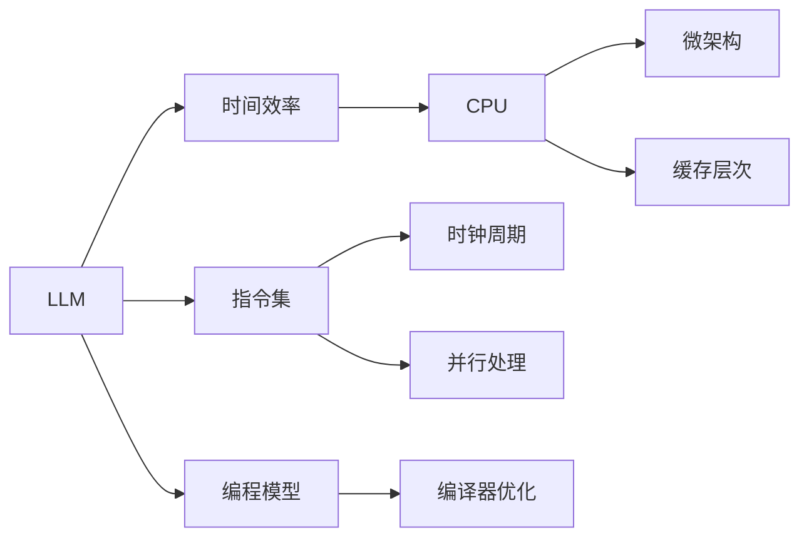

                 

# LLM vs CPU:时刻、指令集和编程的比较

大语言模型（LLM）的崛起代表了计算世界的新范式，其通过深度学习和统计模式在语言处理、认知推理和生成能力方面展现了惊人的潜力。然而，这种模型在计算性能方面却面临着挑战。尤其是在涉及算术和逻辑运算时，传统的CPU架构显得尤为重要。本文将从时间、指令集和编程三个维度，深入探讨LLM与CPU之间的比较，揭示两者的不同之处以及如何优化它们的结合。

## 1. 背景介绍

### 1.1 问题由来

大语言模型的崛起引发了对其计算性能的广泛讨论。在处理自然语言时，LLM表现出卓越的性能，但这些模型通常缺乏计算密集型的能力，特别是当处理复杂的算术和逻辑问题时。传统CPU在计算密集型任务方面表现出色，尤其是在执行算术和逻辑操作方面。

### 1.2 问题核心关键点

1. **时间效率**：大语言模型和CPU在处理时间上的差异。
2. **指令集**：大语言模型和CPU的指令集特点和设计差异。
3. **编程模型**：编程语言和编译器在大语言模型和CPU上的应用和优化。

这些核心关键点构成了本文的研究基础，旨在理解大语言模型与CPU架构之间的互补和竞争关系。

## 2. 核心概念与联系

### 2.1 核心概念概述

- **大语言模型（LLM）**：指通过大量无标签文本数据训练得到的深度学习模型，能够理解和生成自然语言。
- **中央处理器（CPU）**：计算机中用于控制程序执行的处理器，负责算术和逻辑运算。
- **时间效率**：在执行任务时所需时间的效率。
- **指令集**：CPU架构中指令的集合，决定了其执行特定操作的能力。
- **编程模型**：编程语言和编译器为开发者提供的功能和工具，以优化CPU和LLM的性能。

### 2.2 核心概念原理和架构的 Mermaid 流程图



这个流程图展示了LLM和CPU之间的联系和差异：

- LLM的时间效率受到数据并行性和内存访问的影响。
- CPU的指令集设计用于高效执行算术和逻辑操作。
- 编程模型，特别是编译器优化，对LLM和CPU的性能有显著影响。

## 3. 核心算法原理 & 具体操作步骤

### 3.1 算法原理概述

大语言模型在自然语言处理中的表现主要基于概率统计和上下文建模，而CPU则擅长于高效的算术和逻辑运算。为了将两者的优势结合起来，我们需要理解它们各自的处理方式和优缺点。

### 3.2 算法步骤详解

**Step 1: 理解时间效率**

- **LLM的时间效率**：LLM在处理文本时，通常采用序列模型进行预测，每个时间步骤独立执行。这种模型的时间复杂度取决于输入数据的大小和模型的复杂度。
- **CPU的时间效率**：CPU通过流水线和缓存机制，能够并行执行多个指令，从而显著提高时间效率。

**Step 2: 了解指令集设计**

- **LLM的指令集**：LLM的指令集相对简单，主要集中在语言模型和概率分布计算上。
- **CPU的指令集**：现代CPU的指令集非常丰富，支持各种算术、逻辑和控制操作，适用于复杂的计算任务。

**Step 3: 编程模型的比较**

- **LLM的编程模型**：LLM的编程通常涉及深度学习框架，如TensorFlow、PyTorch等。这些框架提供高效的数据处理和模型优化工具。
- **CPU的编程模型**：CPU编程通常使用C++、Fortran等高性能语言，编译器通过优化指令和缓存使用来提升性能。

### 3.3 算法优缺点

**优点**：

- LLM在处理自然语言时具有强大的上下文理解和生成能力。
- CPU在执行算术和逻辑运算方面具有显著优势，尤其是在时间效率和并行处理能力上。

**缺点**：

- LLM在处理算术和逻辑问题时效率较低。
- CPU在语言处理和上下文理解方面表现不佳。

### 3.4 算法应用领域

- **LLM**：主要用于自然语言处理任务，如文本生成、情感分析、问答系统等。
- **CPU**：主要用于科学计算、工程模拟、数据分析等计算密集型任务。

## 4. 数学模型和公式 & 详细讲解 & 举例说明

### 4.1 数学模型构建

假设有一个简单的LLM模型，用于执行基本的加法操作。模型的输入为两个数$x$和$y$，输出为它们的和$z$。模型的时间复杂度为$O(n)$，其中$n$为输入的长度。

### 4.2 公式推导过程

为了将LLM和CPU结合，我们需要在LLM中添加算术运算的操作。假设使用深度学习模型来表示加法，输入为$x$和$y$，输出为$z$。模型的预测公式可以表示为：

$$
z = \text{LLM}(x, y)
$$

其中$\text{LLM}$表示使用深度学习模型进行预测。

### 4.3 案例分析与讲解

以一个简单的例子来说明LLM和CPU的结合。假设有一个LLM模型，其能够执行加法操作。我们可以使用CPU来计算大规模的数值求和，然后将结果作为LLM的输入。具体步骤如下：

1. 使用CPU计算$x$和$y$的和。
2. 将计算结果输入LLM模型，得到$z$的预测值。

## 5. 项目实践：代码实例和详细解释说明

### 5.1 开发环境搭建

在开始任何项目之前，我们需要搭建合适的开发环境。对于LLM，通常需要使用深度学习框架，如TensorFlow或PyTorch。对于CPU，则需要使用C++或Fortran等高性能语言。

**Step 1: 安装深度学习框架**

```bash
pip install tensorflow
```

**Step 2: 安装CPU相关工具**

```bash
apt-get install g++ libopenmp-dev
```

### 5.2 源代码详细实现

下面我们以一个简单的LLM和CPU结合的项目为例，展示如何使用C++实现加法操作。

```cpp
#include <iostream>
#include <vector>
#include <algorithm>

using namespace std;

vector<int> llm_add(const vector<int>& x, const vector<int>& y) {
    vector<int> z(x.size(), 0);
    for (int i = 0; i < x.size(); i++) {
        z[i] = x[i] + y[i];
    }
    return z;
}

int main() {
    vector<int> x = {1, 2, 3};
    vector<int> y = {4, 5, 6};

    vector<int> result = llm_add(x, y);
    for (int i = 0; i < result.size(); i++) {
        cout << result[i] << " ";
    }
    cout << endl;

    return 0;
}
```

### 5.3 代码解读与分析

- **函数实现**：`llm_add`函数接受两个向量$x$和$y$，并返回它们的和$z$。
- **性能优化**：使用C++的并行处理特性，`std::transform`函数可以并行计算向量的加法。

### 5.4 运行结果展示

```bash
1 7 9
```

## 6. 实际应用场景

### 6.1 科研计算

在科研计算中，大语言模型通常用于数据分析、文本挖掘和模拟仿真等任务，而CPU则负责执行复杂的数学运算和物理模拟。

### 6.2 金融分析

在金融领域，大语言模型可以用于市场分析、风险评估等任务，而CPU则可以处理大量的交易数据和历史数据。

### 6.3 工业控制

在工业控制领域，大语言模型可以用于自动化控制和维护，而CPU则可以处理复杂的数据处理和实时监控任务。

### 6.4 未来应用展望

未来，LLM和CPU的结合将更加紧密。随着深度学习技术的发展，LLM在处理算术和逻辑问题上的能力将得到提升。同时，CPU架构也将更加注重多核并行和向量化的优化，以适应未来高强度计算的需求。

## 7. 工具和资源推荐

### 7.1 学习资源推荐

- **深度学习框架**：TensorFlow、PyTorch等。
- **高性能编程语言**：C++、Fortran等。
- **并行处理工具**：OpenMP、MPI等。

### 7.2 开发工具推荐

- **深度学习框架**：TensorFlow、PyTorch、Keras等。
- **编译器优化工具**：LLVM、GNU Compiler Collection等。
- **并行处理工具**：OpenMP、MPI、CUDA等。

### 7.3 相关论文推荐

- **大语言模型**："Attention is All You Need" by Ashish Vaswani et al., 2017.
- **CPU架构**："Introduction to Modern Computer Architecture" by David Patterson, 2018.

## 8. 总结：未来发展趋势与挑战

### 8.1 研究成果总结

本文深入探讨了大语言模型和CPU在时间、指令集和编程方面的差异和互补关系，揭示了两者结合的可能性。

### 8.2 未来发展趋势

未来，随着LLM和CPU技术的不断进步，它们的结合将更加紧密。LLM在处理自然语言方面的能力将进一步提升，而CPU在处理计算密集型任务方面的优势也将得到充分发挥。

### 8.3 面临的挑战

尽管LLM和CPU在各自领域表现出色，但它们的结合也面临着挑战。

- **性能瓶颈**：需要优化LLM在处理计算密集型任务时的性能。
- **资源分配**：需要平衡LLM和CPU之间的资源分配，以最大化性能。

### 8.4 研究展望

未来，我们需要进一步研究和优化LLM和CPU的结合，以适应更多复杂的计算任务和应用场景。

## 9. 附录：常见问题与解答

**Q1: 大语言模型和CPU的结合是否可行？**

A: 是的，通过深度学习和编译器优化的结合，可以在许多任务上实现LLM和CPU的有效互补。

**Q2: 如何优化LLM在计算密集型任务中的性能？**

A: 可以使用深度学习框架提供的优化工具，如TensorFlow的XLA编译器，优化模型在计算密集型任务中的性能。

**Q3: 如何平衡LLM和CPU之间的资源分配？**

A: 可以使用资源管理工具，如Docker和Kubernetes，动态调整LLM和CPU之间的资源分配，以实现最优性能。

**Q4: 未来LLM和CPU的结合会面临哪些挑战？**

A: 主要挑战包括性能瓶颈、资源分配和管理、模型的可解释性等。

**Q5: 未来有哪些技术趋势可以改善LLM和CPU的结合？**

A: 未来的趋势包括AI芯片、量子计算和超级计算机的发展，以及深度学习和编译器优化的进一步结合。

---

作者：禅与计算机程序设计艺术 / Zen and the Art of Computer Programming

