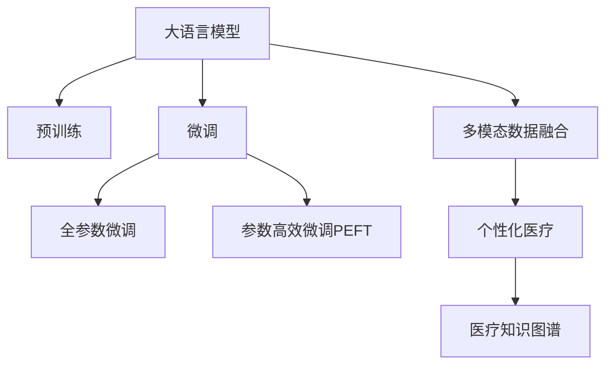

                 

# LLM 在医疗保健中的应用：变革性实践

## 1. 背景介绍

随着人工智能（AI）技术的飞速发展，大语言模型（LLM）在医疗保健领域的应用正逐渐从理论走向实践。LLM 通过在大规模无标签文本数据上进行预训练，学习到了丰富的语言知识和常识，能够处理复杂的自然语言处理（NLP）任务。在医疗保健领域，LLM 可以帮助医生进行疾病诊断、患者咨询、药物研发等，其应用前景广阔。

### 1.1 问题由来

在医疗保健领域，传统的医生诊断和治疗方案往往依赖医生的经验和专业知识。然而，随着患者数量的增加和医疗信息的爆炸式增长，医生的工作负担越来越重，难以在短时间内处理大量复杂的医疗数据。此外，患者的病情描述可能不够准确或完整，医生的理解也存在一定的偏差。这些问题都需要通过技术手段加以解决，而 LLM 提供了一种全新的可能性。

### 1.2 问题核心关键点

LLM 在医疗保健领域的应用主要包括以下几个关键点：

- **预训练与微调**：首先，通过在大规模无标签文本数据上进行预训练，LLM 学习到通用的语言表示。然后，在医疗保健相关的少量标注数据上进行微调，使其能够适应特定的医疗任务。
- **多模态数据融合**：医疗数据不仅包括文本，还包括图像、声音等多模态数据。LLM 可以处理这些多模态数据，综合不同模态的信息，提高诊断和治疗的准确性。
- **个性化医疗**：通过分析患者的历史数据和病历，LLM 能够提供个性化的医疗建议和治疗方案。
- **医疗知识图谱**：构建基于 LLM 的医疗知识图谱，可以为医生提供权威的医学知识和研究成果，辅助诊断和治疗。

这些关键点共同构成了 LLM 在医疗保健领域的变革性实践。通过 LLM 的应用，医疗保健系统可以变得更加智能化、高效化和个性化。

## 2. 核心概念与联系

### 2.1 核心概念概述

在 LLM 应用于医疗保健领域的过程中，涉及以下核心概念：

- **大语言模型（LLM）**：基于自回归或自编码的深度学习模型，通过在大规模无标签文本数据上进行预训练，学习通用的语言表示。
- **预训练**：在大规模无标签文本数据上训练 LLM，使其学习到丰富的语言知识和常识。
- **微调（Fine-tuning）**：在预训练模型的基础上，使用医疗保健相关的少量标注数据进行有监督的训练，优化模型在特定医疗任务上的性能。
- **多模态数据融合**：将文本、图像、声音等多模态数据进行融合，提高诊断和治疗的准确性。
- **个性化医疗**：根据患者的历史数据和病历，提供个性化的医疗建议和治疗方案。
- **医疗知识图谱**：基于 LLM 构建的医疗知识图谱，提供权威的医学知识和研究成果。

这些概念之间的逻辑关系可以通过以下 Mermaid 流程图来展示：



这个流程图展示了 LLM 在医疗保健领域的应用流程：

1. LLM 通过预训练获得通用语言表示。
2. 在医疗保健相关的少量标注数据上进行微调，提升特定任务的性能。
3. 融合多模态数据，提高诊断和治疗的准确性。
4. 提供个性化医疗建议和治疗方案。
5. 构建医疗知识图谱，辅助医生诊断和治疗。

### 2.2 核心概念原理和架构

#### 2.2.1 大语言模型（LLM）

LLM 通常基于自回归（如 GPT）或自编码（如 BERT）的深度学习模型。通过在大规模无标签文本数据上进行预训练，LLM 学习到丰富的语言知识和常识。

#### 2.2.2 预训练

预训练是指在大规模无标签文本数据上训练 LLM，使其学习到通用的语言表示。预训练过程通常包括自监督学习任务，如掩码语言建模、下一句预测等。

#### 2.2.3 微调（Fine-tuning）

微调是指在预训练模型的基础上，使用医疗保健相关的少量标注数据进行有监督的训练，优化模型在特定医疗任务上的性能。微调过程通常包括任务适配层的添加、损失函数的定义、优化器选择等。

#### 2.2.4 多模态数据融合

医疗数据不仅包括文本，还包括图像、声音等多模态数据。通过融合这些多模态数据，可以提供更全面的医疗信息，提高诊断和治疗的准确性。

#### 2.2.5 个性化医疗

根据患者的历史数据和病历，LLM 能够提供个性化的医疗建议和治疗方案。个性化医疗可以显著提高治疗效果，减少医疗资源的浪费。

#### 2.2.6 医疗知识图谱

基于 LLM 构建的医疗知识图谱，可以提供权威的医学知识和研究成果，辅助医生诊断和治疗。

## 3. 核心算法原理 & 具体操作步骤

### 3.1 算法原理概述

LLM 在医疗保健领域的应用，本质上是基于监督学习的微调方法。其核心思想是：将 LLM 作为初始化参数，通过有监督地训练来优化模型在特定医疗任务上的性能。

### 3.2 算法步骤详解

#### 3.2.1 数据准备

1. **收集标注数据**：收集医疗保健相关的标注数据，包括患者的病历、诊断结果、治疗方案等。标注数据可以是结构化的，如电子病历（EHR），也可以是非结构化的，如医生的诊断报告。
2. **数据预处理**：将原始数据进行清洗、标准化和格式转换，以便模型能够处理。例如，将病历中的自然语言描述转换为标准化的医学语言。
3. **数据分割**：将数据集划分为训练集、验证集和测试集，以便进行模型训练、调参和评估。

#### 3.2.2 模型选择与适配

1. **选择预训练模型**：选择适合的预训练模型，如 BERT、GPT-2 等。这些模型已经在大规模无标签文本数据上进行预训练，学习到丰富的语言知识和常识。
2. **适配任务层**：根据任务类型，在预训练模型的顶层添加合适的任务适配层。例如，对于疾病诊断任务，可以添加一个分类层，用于预测疾病的种类。

#### 3.2.3 超参数设置

1. **学习率设置**：选择合适的学习率，一般比从头训练时小，以免破坏预训练权重。例如，可以设置初始学习率为 1e-5。
2. **正则化技术**：应用正则化技术，如 L2 正则、Dropout、Early Stopping 等，防止模型过度适应小规模训练集。
3. **参数冻结**：根据任务需求，决定是否冻结预训练模型的部分或全部参数。例如，通常只微调顶层分类器。

#### 3.2.4 模型训练与评估

1. **训练过程**：在训练集上，以批次为单位进行模型训练。每个批次包括输入数据和标注数据，模型根据输入数据计算损失函数，并更新模型参数。
2. **验证集评估**：在验证集上，周期性评估模型的性能。如果验证集上的性能不再提升，则触发 Early Stopping，停止训练。
3. **测试集评估**：在测试集上评估微调后的模型性能，对比微调前后的精度提升。

### 3.3 算法优缺点

#### 3.3.1 优点

1. **效率高**：通过微调，可以显著提升模型在特定医疗任务上的性能，且需要的标注数据较少。
2. **泛化能力强**：LLM 通过预训练学习到通用的语言表示，在微调后可以适应多种医疗任务。
3. **可扩展性强**：可以根据具体的医疗任务需求，灵活调整微调策略，适应不同的应用场景。

#### 3.3.2 缺点

1. **依赖标注数据**：微调的效果很大程度上取决于标注数据的质量和数量，获取高质量标注数据的成本较高。
2. **模型复杂度高**：预训练模型参数量大，在微调过程中需要较大的计算资源和存储空间。
3. **知识传递有限**：预训练模型的固有偏见和有害信息可能通过微调传递到下游任务，造成负面影响。
4. **可解释性不足**：微调模型的决策过程通常缺乏可解释性，难以对其推理逻辑进行分析和调试。

### 3.4 算法应用领域

LLM 在医疗保健领域的应用主要包括以下几个方面：

1. **疾病诊断**：通过分析患者的病历和症状描述，LLM 可以辅助医生进行疾病诊断，提供初步的诊断建议。
2. **患者咨询**：LLM 可以回答患者的健康咨询，提供个性化的健康建议和预防措施。
3. **药物研发**：LLM 可以分析药物分子结构，预测其生物活性和副作用，辅助药物研发。
4. **医学文献分析**：LLM 可以自动抽取医学文献中的关键信息，辅助医生进行文献综述和临床决策。

## 4. 数学模型和公式 & 详细讲解 & 举例说明

### 4.1 数学模型构建

假设预训练模型为 $M_{\theta}$，其中 $\theta$ 为预训练得到的模型参数。假设微调任务的训练集为 $D=\{(x_i,y_i)\}_{i=1}^N, x_i \in \mathcal{X}, y_i \in \mathcal{Y}$。

定义模型 $M_{\theta}$ 在数据样本 $(x,y)$ 上的损失函数为 $\ell(M_{\theta}(x),y)$，则在数据集 $D$ 上的经验风险为：

$$
\mathcal{L}(\theta) = \frac{1}{N} \sum_{i=1}^N \ell(M_{\theta}(x_i),y_i)
$$

微调的优化目标是最小化经验风险，即找到最优参数：

$$
\theta^* = \mathop{\arg\min}_{\theta} \mathcal{L}(\theta)
$$

在实践中，我们通常使用基于梯度的优化算法（如 SGD、AdamW 等）来近似求解上述最优化问题。设 $\eta$ 为学习率，$\lambda$ 为正则化系数，则参数的更新公式为：

$$
\theta \leftarrow \theta - \eta \nabla_{\theta}\mathcal{L}(\theta) - \eta\lambda\theta
$$

其中 $\nabla_{\theta}\mathcal{L}(\theta)$ 为损失函数对参数 $\theta$ 的梯度，可通过反向传播算法高效计算。

### 4.2 公式推导过程

以疾病诊断为例，假设模型 $M_{\theta}$ 在输入 $x$ 上的输出为 $\hat{y}=M_{\theta}(x) \in [0,1]$，表示样本属于某种疾病的概率。真实标签 $y \in \{0,1\}$。则二分类交叉熵损失函数定义为：

$$
\ell(M_{\theta}(x),y) = -[y\log \hat{y} + (1-y)\log (1-\hat{y})]
$$

将其代入经验风险公式，得：

$$
\mathcal{L}(\theta) = -\frac{1}{N}\sum_{i=1}^N [y_i\log M_{\theta}(x_i)+(1-y_i)\log(1-M_{\theta}(x_i))]
$$

根据链式法则，损失函数对参数 $\theta_k$ 的梯度为：

$$
\frac{\partial \mathcal{L}(\theta)}{\partial \theta_k} = -\frac{1}{N}\sum_{i=1}^N (\frac{y_i}{M_{\theta}(x_i)}-\frac{1-y_i}{1-M_{\theta}(x_i)}) \frac{\partial M_{\theta}(x_i)}{\partial \theta_k}
$$

其中 $\frac{\partial M_{\theta}(x_i)}{\partial \theta_k}$ 可进一步递归展开，利用自动微分技术完成计算。

### 4.3 案例分析与讲解

以患者咨询为例，假设医疗咨询数据集包含多个患者的问题和回答，可以将其作为微调数据。模型输入为患者的问题，输出为医生提供的回答。通过微调，模型可以学习到问题的语义和回答的规则，生成个性化的回答。

具体而言，可以构建以下模型：

- **输入层**：将患者问题转换为标准化的医学语言，并嵌入到向量空间中。
- **编码器**：使用 Transformer 或 CNN 等模型，对输入向量进行编码。
- **输出层**：添加一个全连接层，将编码器的输出映射到回答的词汇表。
- **损失函数**：定义交叉熵损失函数，衡量模型预测回答与实际答案的差异。

在训练过程中，通过反向传播计算损失函数的梯度，并更新模型的参数。最终，微调后的模型可以用于生成患者咨询的个性化回答。

## 5. 项目实践：代码实例和详细解释说明

### 5.1 开发环境搭建

在进行 LLM 应用于医疗保健领域的微调实践前，需要准备好开发环境。以下是使用 Python 进行 PyTorch 开发的环境配置流程：

1. **安装 Anaconda**：从官网下载并安装 Anaconda，用于创建独立的 Python 环境。
2. **创建并激活虚拟环境**：
```bash
conda create -n pytorch-env python=3.8 
conda activate pytorch-env
```

3. **安装 PyTorch**：根据 CUDA 版本，从官网获取对应的安装命令。例如：
```bash
conda install pytorch torchvision torchaudio cudatoolkit=11.1 -c pytorch -c conda-forge
```

4. **安装 Transformers 库**：
```bash
pip install transformers
```

5. **安装各类工具包**：
```bash
pip install numpy pandas scikit-learn matplotlib tqdm jupyter notebook ipython
```

完成上述步骤后，即可在 `pytorch-env` 环境中开始微调实践。

### 5.2 源代码详细实现

这里以 BERT 模型为例，进行患者咨询任务微调的 PyTorch 代码实现。

首先，定义模型和数据处理函数：

```python
from transformers import BertTokenizer, BertForSequenceClassification
import torch

class PatientConsultationDataset(Dataset):
    def __init__(self, texts, labels, tokenizer):
        self.texts = texts
        self.labels = labels
        self.tokenizer = tokenizer
        
    def __len__(self):
        return len(self.texts)
    
    def __getitem__(self, item):
        text = self.texts[item]
        label = self.labels[item]
        
        encoding = self.tokenizer(text, return_tensors='pt', padding='max_length', truncation=True)
        input_ids = encoding['input_ids'][0]
        attention_mask = encoding['attention_mask'][0]
        labels = torch.tensor(label, dtype=torch.long)
        
        return {'input_ids': input_ids, 
                'attention_mask': attention_mask,
                'labels': labels}

tokenizer = BertTokenizer.from_pretrained('bert-base-cased')
train_dataset = PatientConsultationDataset(train_texts, train_labels, tokenizer)
dev_dataset = PatientConsultationDataset(dev_texts, dev_labels, tokenizer)
test_dataset = PatientConsultationDataset(test_texts, test_labels, tokenizer)
```

然后，定义模型和优化器：

```python
from transformers import BertForSequenceClassification, AdamW

model = BertForSequenceClassification.from_pretrained('bert-base-cased', num_labels=2)

optimizer = AdamW(model.parameters(), lr=2e-5)
```

接着，定义训练和评估函数：

```python
from torch.utils.data import DataLoader
from tqdm import tqdm

device = torch.device('cuda') if torch.cuda.is_available() else torch.device('cpu')
model.to(device)

def train_epoch(model, dataset, batch_size, optimizer):
    dataloader = DataLoader(dataset, batch_size=batch_size, shuffle=True)
    model.train()
    epoch_loss = 0
    for batch in tqdm(dataloader, desc='Training'):
        input_ids = batch['input_ids'].to(device)
        attention_mask = batch['attention_mask'].to(device)
        labels = batch['labels'].to(device)
        model.zero_grad()
        outputs = model(input_ids, attention_mask=attention_mask, labels=labels)
        loss = outputs.loss
        epoch_loss += loss.item()
        loss.backward()
        optimizer.step()
    return epoch_loss / len(dataloader)

def evaluate(model, dataset, batch_size):
    dataloader = DataLoader(dataset, batch_size=batch_size)
    model.eval()
    preds, labels = [], []
    with torch.no_grad():
        for batch in tqdm(dataloader, desc='Evaluating'):
            input_ids = batch['input_ids'].to(device)
            attention_mask = batch['attention_mask'].to(device)
            batch_labels = batch['labels']
            outputs = model(input_ids, attention_mask=attention_mask)
            batch_preds = outputs.logits.argmax(dim=2).to('cpu').tolist()
            batch_labels = batch_labels.to('cpu').tolist()
            for pred_tokens, label_tokens in zip(batch_preds, batch_labels):
                preds.append(pred_tokens[:len(label_tokens)])
                labels.append(label_tokens)
                
    print(classification_report(labels, preds))
```

最后，启动训练流程并在测试集上评估：

```python
epochs = 5
batch_size = 16

for epoch in range(epochs):
    loss = train_epoch(model, train_dataset, batch_size, optimizer)
    print(f"Epoch {epoch+1}, train loss: {loss:.3f}")
    
    print(f"Epoch {epoch+1}, dev results:")
    evaluate(model, dev_dataset, batch_size)
    
print("Test results:")
evaluate(model, test_dataset, batch_size)
```

以上就是使用 PyTorch 对 BERT 模型进行患者咨询任务微调的完整代码实现。可以看到，得益于 Transformers 库的强大封装，我们可以用相对简洁的代码完成 BERT 模型的加载和微调。

### 5.3 代码解读与分析

让我们再详细解读一下关键代码的实现细节：

**PatientConsultationDataset 类**：
- `__init__` 方法：初始化文本、标签、分词器等关键组件。
- `__len__` 方法：返回数据集的样本数量。
- `__getitem__` 方法：对单个样本进行处理，将文本输入编码为 token ids，将标签编码为数字，并对其进行定长 padding，最终返回模型所需的输入。

**模型定义**：
- `BertForSequenceClassification`：从预训练模型加载模型，设置任务的分类数目。
- `AdamW`：定义优化器及其参数，设置学习率。

**训练函数**：
- 使用 PyTorch 的 DataLoader 对数据集进行批次化加载，供模型训练和推理使用。
- 在每个 epoch 内，对训练集数据以批为单位进行迭代，在每个批次上前向传播计算 loss 并反向传播更新模型参数。
- 周期性在验证集上评估模型性能，根据性能指标决定是否触发 Early Stopping。
- 重复上述步骤直至满足预设的迭代轮数或 Early Stopping 条件。

**评估函数**：
- 与训练类似，不同点在于不更新模型参数，并在每个 batch 结束后将预测和标签结果存储下来。
- 使用 sklearn 的 classification_report 对整个评估集的预测结果进行打印输出。

**训练流程**：
- 定义总的 epoch 数和 batch size，开始循环迭代。
- 每个 epoch 内，先在训练集上训练，输出平均 loss。
- 在验证集上评估，输出分类指标。
- 所有 epoch 结束后，在测试集上评估，给出最终测试结果。

可以看到，PyTorch 配合 Transformers 库使得 BERT 微调的代码实现变得简洁高效。开发者可以将更多精力放在数据处理、模型改进等高层逻辑上，而不必过多关注底层的实现细节。

当然，工业级的系统实现还需考虑更多因素，如模型的保存和部署、超参数的自动搜索、更灵活的任务适配层等。但核心的微调范式基本与此类似。

## 6. 实际应用场景

### 6.1 智能诊断系统

智能诊断系统是 LLM 在医疗保健领域的重要应用之一。传统诊断系统依赖医生的经验，容易受到主观因素的影响，且诊断效率低下。通过 LLM 微调，可以构建智能诊断系统，提高诊断的准确性和效率。

具体而言，可以收集大量标注的病历数据，将其作为微调数据。通过微调，LLM 可以学习到疾病与症状之间的关联，辅助医生进行诊断。此外，LLM 还可以根据患者的症状和病史，生成个性化的诊断建议。

### 6.2 健康咨询服务

在健康咨询服务中，LLM 可以回答患者的健康咨询，提供个性化的健康建议和预防措施。通过微调，LLM 可以理解患者的病情描述，给出合理的治疗建议，甚至在医生资源紧张时，代替医生进行初步诊断和咨询。

### 6.3 药物研发

在药物研发过程中，LLM 可以帮助研究人员预测药物分子的生物活性和副作用，筛选潜在的候选药物。通过微调，LLM 可以学习到药物分子结构与生物活性之间的关系，提供有价值的候选药物。

### 6.4 医疗知识图谱

构建基于 LLM 的医疗知识图谱，可以为医生提供权威的医学知识和研究成果，辅助诊断和治疗。通过微调，LLM 可以抽取医疗文献中的关键信息，构建知识图谱，帮助医生进行临床决策。

### 6.5 医疗文献分析

在医疗文献分析中，LLM 可以自动抽取医学文献中的关键信息，辅助医生进行文献综述和临床决策。通过微调，LLM 可以理解医学文献的语言，抽取关键信息，生成文献综述报告。

## 7. 工具和资源推荐

### 7.1 学习资源推荐

为了帮助开发者系统掌握 LLM 在医疗保健领域的应用理论基础和实践技巧，这里推荐一些优质的学习资源：

1. **《Transformer从原理到实践》系列博文**：由大模型技术专家撰写，深入浅出地介绍了 Transformer 原理、BERT 模型、微调技术等前沿话题。
2. **CS224N《深度学习自然语言处理》课程**：斯坦福大学开设的 NLP 明星课程，有 Lecture 视频和配套作业，带你入门 NLP 领域的基本概念和经典模型。
3. **《Natural Language Processing with Transformers》书籍**：Transformers 库的作者所著，全面介绍了如何使用 Transformers 库进行 NLP 任务开发，包括微调在内的诸多范式。
4. **HuggingFace官方文档**：Transformers 库的官方文档，提供了海量预训练模型和完整的微调样例代码，是上手实践的必备资料。
5. **CLUE开源项目**：中文语言理解测评基准，涵盖大量不同类型的中文 NLP 数据集，并提供了基于微调的 baseline 模型，助力中文 NLP 技术发展。

通过对这些资源的学习实践，相信你一定能够快速掌握 LLM 在医疗保健领域的应用精髓，并用于解决实际的医疗问题。

### 7.2 开发工具推荐

高效的开发离不开优秀的工具支持。以下是几款用于 LLM 应用于医疗保健领域微调开发的常用工具：

1. **PyTorch**：基于 Python 的开源深度学习框架，灵活动态的计算图，适合快速迭代研究。大部分预训练语言模型都有 PyTorch 版本的实现。
2. **TensorFlow**：由 Google 主导开发的开源深度学习框架，生产部署方便，适合大规模工程应用。同样有丰富的预训练语言模型资源。
3. **Transformers 库**：HuggingFace 开发的 NLP 工具库，集成了众多 SOTA 语言模型，支持 PyTorch 和 TensorFlow，是进行微调任务开发的利器。
4. **Weights & Biases**：模型训练的实验跟踪工具，可以记录和可视化模型训练过程中的各项指标，方便对比和调优。与主流深度学习框架无缝集成。
5. **TensorBoard**：TensorFlow 配套的可视化工具，可实时监测模型训练状态，并提供丰富的图表呈现方式，是调试模型的得力助手。
6. **Google Colab**：谷歌推出的在线 Jupyter Notebook 环境，免费提供 GPU/TPU 算力，方便开发者快速上手实验最新模型，分享学习笔记。

合理利用这些工具，可以显著提升 LLM 在医疗保健领域微调任务的开发效率，加快创新迭代的步伐。

### 7.3 相关论文推荐

LLM 在医疗保健领域的应用源于学界的持续研究。以下是几篇奠基性的相关论文，推荐阅读：

1. **Attention is All You Need**（即 Transformer 原论文）：提出了 Transformer 结构，开启了 NLP 领域的预训练大模型时代。
2. **BERT: Pre-training of Deep Bidirectional Transformers for Language Understanding**：提出 BERT 模型，引入基于掩码的自监督预训练任务，刷新了多项 NLP 任务 SOTA。
3. **Language Models are Unsupervised Multitask Learners（GPT-2 论文）**：展示了大规模语言模型的强大零-shot 学习能力，引发了对于通用人工智能的新一轮思考。
4. **Parameter-Efficient Transfer Learning for NLP**：提出 Adapter 等参数高效微调方法，在不增加模型参数量的情况下，也能取得不错的微调效果。
5. **Fine-tuning BERT for Practical Applications**：介绍基于 BERT 的微调技术在多个 NLP 任务中的应用，提供了丰富的案例和实践经验。
6. **A Survey on Fine-tuning Transformers for Medical Language Processing**：综述了 Transformers 在医疗语言处理中的应用，包括疾病诊断、患者咨询、药物研发等，提供了深入的分析和建议。

这些论文代表了大语言模型在医疗保健领域的应用发展脉络。通过学习这些前沿成果，可以帮助研究者把握学科前进方向，激发更多的创新灵感。

## 8. 总结：未来发展趋势与挑战

### 8.1 研究成果总结

本文对 LLM 在医疗保健领域的应用进行了全面系统的介绍。首先阐述了 LLM 和微调技术的研究背景和意义，明确了微调在拓展预训练模型应用、提升下游任务性能方面的独特价值。其次，从原理到实践，详细讲解了监督微调的数学原理和关键步骤，给出了微调任务开发的完整代码实例。同时，本文还广泛探讨了微调方法在智能诊断、健康咨询、药物研发、医疗知识图谱等多个医疗保健领域的应用前景，展示了 LLM 的巨大潜力。

### 8.2 未来发展趋势

展望未来，LLM 在医疗保健领域的应用将呈现以下几个发展趋势：

1. **模型规模持续增大**：随着算力成本的下降和数据规模的扩张，预训练语言模型的参数量还将持续增长。超大规模语言模型蕴含的丰富语言知识，有望支撑更加复杂多变的医疗任务微调。
2. **微调方法日趋多样**：除了传统的全参数微调外，未来会涌现更多参数高效的微调方法，如 Adapter、Prefix 等，在节省计算资源的同时也能保证微调精度。
3. **持续学习成为常态**：随着数据分布的不断变化，微调模型也需要持续学习新知识以保持性能。如何在不遗忘原有知识的同时，高效吸收新样本信息，将成为重要的研究课题。
4. **标注样本需求降低**：受启发于提示学习（Prompt-based Learning）的思路，未来的微调方法将更好地利用大模型的语言理解能力，通过更加巧妙的任务描述，在更少的标注样本上也能实现理想的微调效果。
5. **多模态微调崛起**：当前的微调主要聚焦于纯文本数据，未来会进一步拓展到图像、声音等多模态数据微调。多模态信息的融合，将显著提升语言模型对现实世界的理解和建模能力。
6. **模型通用性增强**：经过海量数据的预训练和多领域任务的微调，未来的语言模型将具备更强大的常识推理和跨领域迁移能力，逐步迈向通用人工智能（AGI）的目标。

以上趋势凸显了 LLM 在医疗保健领域的广阔前景。这些方向的探索发展，必将进一步提升医疗保健系统的性能和应用范围，为人类健康事业带来深远影响。

### 8.3 面临的挑战

尽管 LLM 在医疗保健领域的应用取得了显著进展，但在迈向更加智能化、普适化应用的过程中，仍面临着诸多挑战：

1. **标注成本瓶颈**：微调的效果很大程度上取决于标注数据的质量和数量，获取高质量标注数据的成本较高。如何进一步降低微调对标注样本的依赖，将是一大难题。
2. **模型鲁棒性不足**：当前微调模型面对域外数据时，泛化性能往往大打折扣。对于测试样本的微小扰动，微调模型的预测也容易发生波动。如何提高微调模型的鲁棒性，避免灾难性遗忘，还需要更多理论和实践的积累。
3. **推理效率有待提高**：大规模语言模型虽然精度高，但在实际部署时往往面临推理速度慢、内存占用大等效率问题。如何在保证性能的同时，简化模型结构，提升推理速度，优化资源占用，将是重要的优化方向。
4. **可解释性亟需加强**：当前微调模型更像是 "黑盒" 系统，难以解释其内部工作机制和决策逻辑。对于医疗、金融等高风险应用，算法的可解释性和可审计性尤为重要。如何赋予微调模型更强的可解释性，将是亟待攻克的难题。
5. **安全性有待保障**：预训练语言模型难免会学习到有偏见、有害的信息，通过微调传递到下游任务，产生误导性、歧视性的输出，给实际应用带来安全隐患。如何从数据和算法层面消除模型偏见，避免恶意用途，确保输出的安全性，也将是重要的研究课题。
6. **知识整合能力不足**：现有的微调模型往往局限于任务内数据，难以灵活吸收和运用更广泛的先验知识。如何让微调过程更好地与外部知识库、规则库等专家知识结合，形成更加全面、准确的信息整合能力，还有很大的想象空间。

正视 LLM 在医疗保健领域的应用面临的这些挑战，积极应对并寻求突破，将是大语言模型微调走向成熟的必由之路。相信随着学界和产业界的共同努力，这些挑战终将一一被克服，LLM 必将在构建智能医疗系统中扮演越来越重要的角色。

### 8.4 研究展望

面向未来，LLM 在医疗保健领域的应用需要在以下几个方面寻求新的突破：

1. **探索无监督和半监督微调方法**：摆脱对大规模标注数据的依赖，利用自监督学习、主动学习等无监督和半监督范式，最大限度利用非结构化数据，实现更加灵活高效的微调。
2. **研究参数高效和计算高效的微调范式**：开发更加参数高效的微调方法，在固定大部分预训练参数的同时，只更新极少量的任务相关参数。同时优化微调模型的计算图，减少前向传播和反向传播的资源消耗，实现更加轻量级、实时性的部署。
3. **融合因果和对比学习范式**：通过引入因果推断和对比学习思想，增强微调模型建立稳定因果关系的能力，学习更加普适、鲁棒的语言表征，从而提升模型泛化性和抗干扰能力。
4. **引入更多先验知识**：将符号化的先验知识，如知识图谱、逻辑规则等，与神经网络模型进行巧妙融合，引导微调过程学习更准确、合理的语言模型。同时加强不同模态数据的整合，实现视觉、语音等多模态信息与文本信息的协同建模。
5. **结合因果分析和博弈论工具**：将因果分析方法引入微调模型，识别出模型决策的关键特征，增强输出解释的因果性和逻辑性。借助博弈论工具刻画人机交互过程，主动探索并规避模型的脆弱点，提高系统稳定性。
6. **纳入伦理道德约束**：在模型训练目标中引入伦理导向的评估指标，过滤和惩罚有偏见、有害的输出倾向。同时加强人工干预和审核，建立模型行为的监管机制，确保输出符合人类价值观和伦理道德。

这些研究方向的探索，必将引领 LLM 在医疗保健领域的应用迈向更高的台阶，为智能医疗系统的健康发展铺平道路。面向未来，LLM 在医疗保健领域的应用还需要与其他人工智能技术进行更深入的融合，如知识表示、因果推理、强化学习等，多路径协同发力，共同推动自然语言理解和智能交互系统的进步。只有勇于创新、敢于突破，才能不断拓展语言模型的边界，让智能技术更好地造福人类健康事业。

