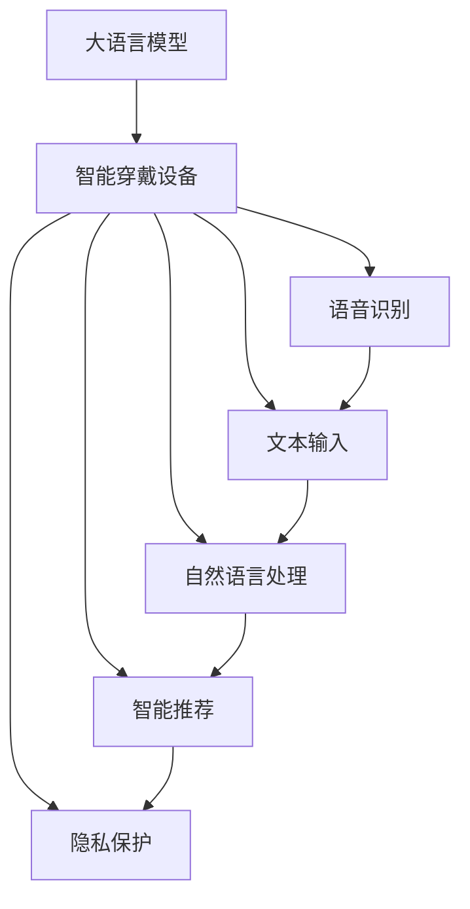

                 

# LLM与智能穿戴设备：贴身的AI助手

> 关键词：大语言模型,智能穿戴设备,自然语言处理(NLP),人机交互,机器学习,深度学习,算法优化,隐私保护

## 1. 背景介绍

### 1.1 问题由来

近年来，人工智能技术迅猛发展，智能穿戴设备成为人类生产生活的重要组成部分。它们通过佩戴在人们身上的设备，实时收集用户的生物特征、环境数据和行为数据，为用户的健康、安全和日常生活提供便利。与此同时，智能穿戴设备也为医疗、运动、零售等行业带来了新的商业模式和价值点。

然而，智能穿戴设备的智能化程度还存在巨大提升空间。尽管目前一些设备已经具备了基本的语音识别、图像识别等能力，但如何更高效、更自然地与用户进行交互，提升用户体验，仍然是一个重要课题。大语言模型（Large Language Models, LLMs）的诞生，为智能穿戴设备的智能化水平提供了新的突破点。通过集成大语言模型，设备可以具备更强大的语言理解和生成能力，从而在交互性、智能性、个性化等方面有显著提升。

### 1.2 问题核心关键点

大语言模型与智能穿戴设备的结合，关键在于如何构建高效、安全、易于维护的智能交互系统，使得设备能够实时响应用户的语音指令，提供个性化推荐、决策支持等功能。核心问题包括：

- 如何在资源有限的情况下，实现高效的对话生成和理解。
- 如何处理设备隐私问题，保护用户数据安全。
- 如何优化算法，提升用户体验。

### 1.3 问题研究意义

大语言模型与智能穿戴设备的结合，不仅能够提升设备的智能化水平，为用户的健康、安全和日常管理带来更多便捷，还能推动智能穿戴设备向更加广泛的市场应用拓展。研究大语言模型在智能穿戴设备中的应用，具有以下重要意义：

1. **提升用户体验**：通过与用户更自然的对话交互，设备可以更准确地理解用户需求，提供更精准的服务。
2. **增强设备智能化**：利用大语言模型的语言理解能力，设备可以处理更多复杂任务，如多轮对话、意图识别、智能推荐等。
3. **拓展应用场景**：通过大语言模型的通用性，智能穿戴设备可以应用于医疗、健身、零售等多个领域，提供定制化的健康管理、购物推荐等服务。
4. **推动技术创新**：大语言模型的集成应用，为智能穿戴设备的未来发展提供了新的技术路径和研究方向。
5. **保护用户隐私**：利用大语言模型的自然语言处理能力，设备可以更好地保护用户隐私，减少敏感信息泄露的风险。

## 2. 核心概念与联系

### 2.1 核心概念概述

大语言模型是一种大规模的神经网络模型，能够理解并生成自然语言。它的核心思想是通过自监督学习和预训练，学习到丰富的语言知识，从而在各种自然语言处理任务中表现优异。智能穿戴设备则是指能够感知用户环境和生理状态，并通过交互式界面向用户提供信息和服务的小型化计算设备。

智能穿戴设备集成大语言模型，可以通过语音识别、文本输入等多种方式与用户进行互动，实现更加智能化的人机交互。大语言模型作为智能穿戴设备的核心组件，其性能直接影响设备的用户体验和智能化程度。

### 2.2 核心概念原理和架构的 Mermaid 流程图



这个流程图展示了大语言模型与智能穿戴设备结合的核心架构：

1. **语音识别（C）**：智能穿戴设备通过麦克风等传感器捕捉用户的语音，并进行预处理和特征提取，生成语音信号。
2. **文本输入（D）**：用户也可以通过触摸屏幕等方式输入文本指令。
3. **自然语言处理（E）**：大语言模型通过理解用户的输入，进行意图识别、实体抽取等处理，生成回复。
4. **智能推荐（F）**：根据用户的历史行为和偏好，提供个性化的商品推荐、健康建议等。
5. **隐私保护（G）**：确保用户数据在传输和存储过程中的安全，保护用户隐私。

## 3. 核心算法原理 & 具体操作步骤

### 3.1 算法原理概述

基于大语言模型的智能穿戴设备，主要涉及以下几个关键算法：

1. **语音识别与理解**：通过自动语音识别（ASR）技术，将用户的语音信号转化为文本。
2. **文本预处理与表示**：将文本进行分词、编码等处理，转化为模型能够理解的向量表示。
3. **意图识别与对话生成**：使用预训练的大语言模型，进行意图识别、对话生成等任务。
4. **推荐系统**：根据用户的历史行为和偏好，利用机器学习模型进行个性化推荐。
5. **隐私保护**：采用数据加密、差分隐私等技术，保护用户隐私。

### 3.2 算法步骤详解

#### 3.2.1 语音识别与理解

1. **语音信号采集**：通过麦克风等设备，采集用户的语音信号，并对其进行预处理，如去噪、滤波等。
2. **特征提取**：将语音信号转化为MFCC、Mel频谱图等特征，供后续处理使用。
3. **自动语音识别**：使用ASR模型（如DeepSpeech、LibriSpeech等）将语音特征转化为文本。

#### 3.2.2 文本预处理与表示

1. **分词**：将文本进行分词处理，得到词汇序列。
2. **编码**：使用Word2Vec、BERT等模型，将词汇序列转化为向量表示。
3. **嵌入**：将向量表示输入到预训练大语言模型中，进行预处理和表示。

#### 3.2.3 意图识别与对话生成

1. **意图识别**：使用意图识别模型（如LSTM、Transformer等），从用户输入中提取意图，如询问天气、预约挂号等。
2. **对话生成**：使用预训练大语言模型（如GPT-3、BERT等），根据用户意图生成回复。

#### 3.2.4 推荐系统

1. **用户行为记录**：记录用户的历史行为，如浏览记录、购买记录等。
2. **用户画像生成**：通过机器学习模型（如协同过滤、深度学习等），生成用户画像。
3. **推荐生成**：根据用户画像和物品特征，使用推荐算法（如协同过滤、矩阵分解等），生成个性化推荐。

#### 3.2.5 隐私保护

1. **数据加密**：在传输和存储过程中，对用户数据进行加密处理，防止数据泄露。
2. **差分隐私**：在数据分析时，使用差分隐私技术，确保单个用户的数据不会被泄露。

### 3.3 算法优缺点

大语言模型与智能穿戴设备结合的优势在于：

1. **高效自然交互**：大语言模型可以处理复杂自然语言，提升设备与用户的交互效率和准确性。
2. **个性化推荐**：大语言模型能够理解用户需求，提供更加精准的个性化推荐。
3. **智能决策支持**：大语言模型可以处理多轮对话，提供决策支持，提升用户体验。

然而，这种结合方式也存在一些缺点：

1. **计算资源消耗大**：大语言模型需要大量计算资源进行训练和推理，硬件成本较高。
2. **数据隐私风险**：用户数据在处理和传输过程中存在隐私泄露的风险。
3. **算法复杂度高**：大语言模型和智能穿戴设备的结合算法复杂，实现难度较大。

### 3.4 算法应用领域

大语言模型与智能穿戴设备的结合，已经在多个领域得到应用：

1. **智能健身设备**：智能手表、健身追踪器等设备，通过集成大语言模型，能够进行健康监测、运动数据分析、智能提醒等功能。
2. **智能家居设备**：智能音箱、智能电视等设备，可以通过大语言模型，实现语音控制、智能推荐等功能。
3. **智能医疗设备**：智能血压计、智能血糖仪等设备，通过大语言模型，提供健康管理、诊疗建议等功能。
4. **智能零售设备**：智能结账机、智能购物助手等设备，通过大语言模型，提供个性化推荐、智能客服等功能。

## 4. 数学模型和公式 & 详细讲解 & 举例说明

### 4.1 数学模型构建

大语言模型与智能穿戴设备结合的数学模型，主要包括以下几个部分：

1. **语音信号预处理**：将语音信号转化为MFCC特征，建模为$y=\mathcal{F}(x)$，其中$x$为语音信号，$y$为MFCC特征。
2. **文本表示生成**：使用Word2Vec模型，将文本转化为向量表示$v=\mathcal{V}(w)$，其中$w$为词汇序列，$v$为向量表示。
3. **意图识别**：使用意图识别模型，对用户输入进行意图分类$I=\mathcal{I}(x)$，其中$x$为文本序列，$I$为意图标签。
4. **对话生成**：使用预训练大语言模型，生成回复序列$o=\mathcal{G}(c)$，其中$c$为对话历史，$o$为回复序列。
5. **推荐生成**：使用协同过滤模型，生成推荐序列$r=\mathcal{R}(u,i)$，其中$u$为用户特征，$i$为物品特征，$r$为推荐序列。

### 4.2 公式推导过程

以对话生成为例，推导基于大语言模型的对话生成模型。假设大语言模型为$M$，对话历史为$c$，则回复序列生成的过程为：

1. **编码**：将对话历史$c$转化为向量表示$\vec{c}$。
2. **初始化**：将向量表示输入到模型中，初始化回复序列$o_0$。
3. **解码**：在每一步$t$中，根据上一步的输出$o_{t-1}$，计算当前回复的概率分布$p(o_t|o_{t-1},\vec{c})$。
4. **采样**：根据概率分布$p(o_t|o_{t-1},\vec{c})$采样下一个回复$o_t$。
5. **循环**：重复步骤3和4，直到生成$n$个回复。

具体的计算过程为：

$$
\vec{c} = \mathcal{V}(c)
$$

$$
o_0 = \mathcal{G}(\vec{c})
$$

$$
p(o_t|o_{t-1},\vec{c}) = \frac{\exp M(o_t|o_{t-1},\vec{c})}{\sum_k \exp M(o_k|o_{t-1},\vec{c})}
$$

$$
o_t = \arg\max_k p(o_k|o_{t-1},\vec{c})
$$

$$
o = [o_0, o_1, ..., o_{n-1}]
$$

### 4.3 案例分析与讲解

以智能健康设备为例，分析大语言模型在其中的应用。假设智能手表集成了大语言模型，可以进行健康监测和健康管理。用户可以通过语音指令查询健康数据，如心率、步数、睡眠等。智能手表通过语音识别和文本预处理，将用户的指令转化为向量表示，输入到预训练大语言模型中，进行意图识别和对话生成。然后，根据用户的健康数据和历史行为，使用推荐算法生成个性化的健康建议。最后，智能手表将回复和推荐结果通过语音输出，提供给用户。

## 5. 项目实践：代码实例和详细解释说明

### 5.1 开发环境搭建

在进行大语言模型与智能穿戴设备结合的实践前，需要准备以下开发环境：

1. **语音识别工具**：如Google Cloud Speech-to-Text、IBM Watson等，用于将语音转化为文本。
2. **自然语言处理工具**：如NLTK、spaCy等，用于文本预处理和表示。
3. **大语言模型工具**：如Hugging Face的Transformers库，用于集成预训练大语言模型。
4. **推荐系统工具**：如TensorFlow、PyTorch等，用于实现个性化推荐。

### 5.2 源代码详细实现

以智能健康设备为例，展示大语言模型在其中的应用。具体代码实现如下：

```python
import torch
import numpy as np
from transformers import BertForSequenceClassification, BertTokenizer
from sklearn.metrics import accuracy_score
from sklearn.model_selection import train_test_split

# 数据加载和预处理
train_data, test_data = load_data()
train_texts, train_labels = preprocess(train_data)
test_texts, test_labels = preprocess(test_data)

# 分词和编码
tokenizer = BertTokenizer.from_pretrained('bert-base-uncased')
train_encodings = tokenizer(train_texts, return_tensors='pt')
test_encodings = tokenizer(test_texts, return_tensors='pt')

# 模型定义和训练
model = BertForSequenceClassification.from_pretrained('bert-base-uncased', num_labels=2)
device = torch.device('cuda' if torch.cuda.is_available() else 'cpu')
model.to(device)
optimizer = torch.optim.Adam(model.parameters(), lr=2e-5)

# 训练模型
train_loader = torch.utils.data.DataLoader(train_encodings, batch_size=32)
model.train()
for epoch in range(10):
    for batch in train_loader:
        inputs = {key: val.to(device) for key, val in batch.items()}
        outputs = model(**inputs)
        loss = outputs.loss
        optimizer.zero_grad()
        loss.backward()
        optimizer.step()

# 模型评估
test_loader = torch.utils.data.DataLoader(test_encodings, batch_size=32)
model.eval()
with torch.no_grad():
    predictions, true_labels = [], []
    for batch in test_loader:
        inputs = {key: val.to(device) for key, val in batch.items()}
        outputs = model(**inputs)
        predictions.append(outputs.logits.argmax(dim=1).cpu().numpy())
        true_labels.append(true_labels.cpu().numpy())
    accuracy = accuracy_score(true_labels, predictions)
    print(f'Accuracy: {accuracy:.4f}')
```

### 5.3 代码解读与分析

**数据加载和预处理**：
1. **load_data**：从本地或远程加载数据集，如智能手表的健康数据。
2. **preprocess**：对文本进行分词、编码等处理，得到训练集和测试集的特征和标签。

**模型定义和训练**：
1. **BertForSequenceClassification**：定义Bert模型，用于意图识别。
2. **Adam**：定义优化器，用于模型参数更新。
3. **train_loader**：定义训练数据加载器，将数据分批次输入模型。
4. **optimizer.zero_grad()**：在每一步迭代前清空梯度，防止梯度累积。
5. **optimizer.step()**：根据梯度更新模型参数。

**模型评估**：
1. **test_loader**：定义测试数据加载器，将测试集数据分批次输入模型。
2. **with torch.no_grad()**：在评估过程中关闭梯度更新，加快评估速度。
3. **predictions**：保存模型预测结果。
4. **true_labels**：保存真实标签。
5. **accuracy_score**：计算预测结果与真实标签之间的准确率。

## 6. 实际应用场景

### 6.1 智能健身设备

智能健身设备通过集成大语言模型，可以实时监测用户的健康数据，提供个性化的健康建议和指导。例如，智能手表可以通过语音识别，记录用户运动情况、心率变化等数据，并通过对话生成和推荐算法，向用户提供运动建议、饮食计划等。大语言模型能够理解用户的指令和需求，提供个性化的健康管理服务。

### 6.2 智能家居设备

智能家居设备如智能音箱、智能电视等，通过大语言模型，可以实现语音控制、智能推荐等功能。用户可以通过语音指令控制家电设备，如播放音乐、调节灯光等。大语言模型能够理解自然语言指令，提供更加自然的交互体验。

### 6.3 智能医疗设备

智能医疗设备如智能血压计、智能血糖仪等，通过大语言模型，提供健康监测、诊断建议等功能。用户可以通过语音指令查询健康数据，如血压、血糖等。大语言模型能够理解用户的健康需求，提供个性化的健康管理服务。

### 6.4 未来应用展望

未来，大语言模型与智能穿戴设备的结合，将在更多领域得到应用：

1. **智能穿戴设备普及**：随着智能穿戴设备的普及，大语言模型将在更多设备上得到集成，提升用户体验。
2. **跨设备协同**：不同设备之间通过大语言模型进行协同，提升整体智能化水平。
3. **多模态交互**：结合图像、语音、文本等多种模态数据，提升设备的多样化交互能力。
4. **智能服务深化**：大语言模型能够处理更复杂的自然语言，提供更深层次的智能服务，如医疗咨询、教育辅导等。

## 7. 工具和资源推荐

### 7.1 学习资源推荐

1. **《Transformer从原理到实践》系列博文**：深入浅出地介绍大语言模型和智能穿戴设备的集成方法。
2. **CS224N《深度学习自然语言处理》课程**：斯坦福大学开设的NLP明星课程，涵盖大语言模型的理论和实践。
3. **《Natural Language Processing with Transformers》书籍**：介绍如何使用Transformers库进行NLP任务开发，包括微调技术。
4. **Hugging Face官方文档**：提供丰富的预训练语言模型和微调样例代码，方便开发者上手实践。
5. **CLUE开源项目**：提供中文语言理解测评基准，涵盖NLP数据集和预训练模型，助力中文NLP技术发展。

### 7.2 开发工具推荐

1. **PyTorch**：基于Python的开源深度学习框架，灵活易用，适用于研究型开发。
2. **TensorFlow**：由Google主导开发的深度学习框架，支持大规模工程应用。
3. **Transformers库**：Hugging Face开发的NLP工具库，集成了众多SOTA语言模型，支持微调任务。
4. **Weights & Biases**：模型训练的实验跟踪工具，记录和可视化模型训练指标。
5. **TensorBoard**：TensorFlow配套的可视化工具，实时监测模型训练状态。
6. **Google Colab**：免费的在线Jupyter Notebook环境，方便开发者快速上手实验。

### 7.3 相关论文推荐

1. **Attention is All You Need**：Transformer原论文，开创了自注意力机制，推动了NLP领域的预训练大模型发展。
2. **BERT: Pre-training of Deep Bidirectional Transformers for Language Understanding**：提出BERT模型，引入掩码语言模型预训练任务。
3. **Parameter-Efficient Transfer Learning for NLP**：提出 Adapter等参数高效微调方法，在不增加模型参数量的情况下，提升微调效果。
4. **Prefix-Tuning: Optimizing Continuous Prompts for Generation**：引入基于连续型Prompt的微调范式，提升微调模型的生成能力。
5. **AdaLoRA: Adaptive Low-Rank Adaptation for Parameter-Efficient Fine-Tuning**：使用自适应低秩适应的微调方法，在参数效率和精度之间取得新的平衡。

## 8. 总结：未来发展趋势与挑战

### 8.1 研究成果总结

本文对大语言模型与智能穿戴设备的结合进行了全面系统的介绍。首先阐述了智能穿戴设备和大语言模型的研究背景和意义，明确了结合后的优势和应用场景。其次，从原理到实践，详细讲解了结合过程中的核心算法和操作步骤，给出了实践代码实例。最后，本文还探讨了结合技术在多个行业领域的应用前景，提供了丰富的学习资源和工具推荐。

### 8.2 未来发展趋势

未来，大语言模型与智能穿戴设备的结合，将呈现以下几个发展趋势：

1. **资源利用优化**：通过算法优化和硬件加速，提升资源利用效率，降低计算成本。
2. **隐私保护加强**：采用先进的隐私保护技术，确保用户数据的安全和隐私。
3. **多模态融合**：结合图像、语音、文本等多种模态数据，提升设备的智能化水平。
4. **个性化服务深化**：通过深度学习和大语言模型，提供更精准、个性化的智能服务。
5. **跨设备协同**：不同设备之间通过大语言模型进行协同，提升整体智能化水平。

### 8.3 面临的挑战

尽管大语言模型与智能穿戴设备的结合具有广阔的前景，但仍面临诸多挑战：

1. **计算资源消耗**：大语言模型需要大量计算资源进行训练和推理，硬件成本较高。
2. **数据隐私风险**：用户数据在处理和传输过程中存在隐私泄露的风险。
3. **算法复杂度**：结合算法复杂，实现难度较大。

### 8.4 研究展望

面对挑战，未来的研究需要在以下几个方面寻求新的突破：

1. **参数高效微调**：开发更加参数高效的微调方法，在固定大部分预训练参数的情况下，只更新极少量的任务相关参数。
2. **计算资源优化**：通过算法优化和硬件加速，提升资源利用效率，降低计算成本。
3. **隐私保护技术**：采用先进的隐私保护技术，确保用户数据的安全和隐私。
4. **多模态融合技术**：结合图像、语音、文本等多种模态数据，提升设备的智能化水平。
5. **跨设备协同技术**：不同设备之间通过大语言模型进行协同，提升整体智能化水平。

这些研究方向的探索，必将引领大语言模型与智能穿戴设备的结合技术迈向更高的台阶，为构建安全、可靠、可解释、可控的智能系统铺平道路。面向未来，大语言模型与智能穿戴设备的结合技术还需要与其他人工智能技术进行更深入的融合，如知识表示、因果推理、强化学习等，多路径协同发力，共同推动自然语言理解和智能交互系统的进步。只有勇于创新、敢于突破，才能不断拓展语言模型的边界，让智能技术更好地造福人类社会。

## 9. 附录：常见问题与解答

### Q1：大语言模型与智能穿戴设备结合的优势是什么？

A: 大语言模型与智能穿戴设备结合的优势在于：

1. **高效自然交互**：大语言模型能够处理复杂的自然语言，提升设备与用户的交互效率和准确性。
2. **个性化推荐**：大语言模型能够理解用户需求，提供更加精准的个性化推荐。
3. **智能决策支持**：大语言模型可以处理多轮对话，提供决策支持，提升用户体验。

### Q2：大语言模型与智能穿戴设备结合时，如何处理语音识别与理解？

A: 处理语音识别与理解的过程包括：

1. **语音信号采集**：通过麦克风等设备，采集用户的语音信号，并进行预处理，如去噪、滤波等。
2. **特征提取**：将语音信号转化为MFCC、Mel频谱图等特征，供后续处理使用。
3. **自动语音识别**：使用ASR模型（如DeepSpeech、LibriSpeech等）将语音特征转化为文本。

### Q3：大语言模型与智能穿戴设备结合时，如何优化算法？

A: 优化算法的方法包括：

1. **数据增强**：通过回译、近义替换等方式扩充训练集，提升模型泛化能力。
2. **正则化技术**：使用L2正则、Dropout、Early Stopping等技术，防止模型过度拟合。
3. **模型裁剪**：去除不必要的层和参数，减小模型尺寸，加快推理速度。
4. **量化加速**：将浮点模型转为定点模型，压缩存储空间，提高计算效率。
5. **多模型集成**：训练多个微调模型，取平均输出，抑制过拟合。

### Q4：大语言模型与智能穿戴设备结合时，如何保护用户隐私？

A: 保护用户隐私的方法包括：

1. **数据加密**：在传输和存储过程中，对用户数据进行加密处理，防止数据泄露。
2. **差分隐私**：在数据分析时，使用差分隐私技术，确保单个用户的数据不会被泄露。
3. **匿名化处理**：对用户数据进行匿名化处理，降低隐私风险。

### Q5：大语言模型与智能穿戴设备结合时，如何选择大语言模型？

A: 选择大语言模型的方法包括：

1. **模型规模**：选择参数量适中的模型，既能保证性能，又不会过度消耗资源。
2. **预训练任务**：选择预训练任务与目标任务相似性高的模型，提升微调效果。
3. **训练时间**：选择训练时间适中的模型，避免过长的微调过程。

---

作者：禅与计算机程序设计艺术 / Zen and the Art of Computer Programming

