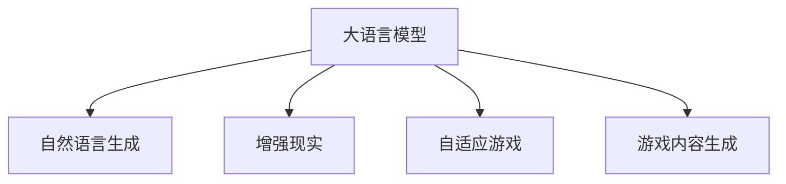

                 

# LLM与游戏产业：创造沉浸式AI体验

> 关键词：沉浸式AI体验, 自然语言生成, 游戏增强现实, 自适应游戏, 游戏内容生成, 玩家行为预测

## 1. 背景介绍

### 1.1 问题由来

在现代游戏产业中，AI技术正在逐渐成为游戏设计、开发、运营等环节的关键组成部分。从简单的路径导航到复杂的情感识别，AI正在重塑游戏的规则和体验。其中，大语言模型(LLM)通过其强大的自然语言生成能力，为游戏产业注入了新的活力，引领了沉浸式AI体验的革命。

人工智能在游戏中的运用，能够根据玩家行为、历史数据、游戏背景等多种因素，生成具有高度个性化的游戏内容和交互体验。以《巫师3：狂猎》中的剧情对话和《王国之心Ⅲ》中的动态环境生成为例，大语言模型以其卓越的语言理解和生成能力，极大地增强了游戏的沉浸感和互动性。

然而，尽管AI在游戏中的应用已经取得了显著进展，但仍面临着一些挑战。如何构建更加智能、响应更快、更具沉浸感的AI体验，成为游戏开发者们的重要课题。大语言模型的引入，为这一挑战提供了新的解决方向，尤其是其在自然语言生成和情境感知等方面的潜力，使其成为游戏增强现实(AR)、自适应游戏(AI-driven Gaming)等前沿领域的核心技术。

### 1.2 问题核心关键点

本节将从核心概念和架构入手，详细介绍大语言模型在游戏产业中的基本工作原理和应用架构，从而为后续的技术细节和案例分析提供基础。

- **大语言模型(LLM)**：通过大量文本数据训练而成的深度神经网络模型，能够理解和生成自然语言，广泛用于问答、翻译、文本生成等NLP任务。

- **自然语言生成(NLG)**：使用大语言模型生成自然语言文本的技术，在游戏对话、文本生成等领域有广泛应用。

- **增强现实(AR)**：通过虚拟信息和现实世界的融合，增强游戏体验的沉浸感。

- **自适应游戏(AI-driven Gaming)**：通过玩家行为预测和个性化内容生成，使游戏能够自动适应玩家偏好和环境变化。

- **游戏内容生成(Game Content Generation)**：利用大语言模型生成游戏地图、NPC对话、故事情节等游戏内容，提升游戏的创意性和可玩性。

## 2. 核心概念与联系

### 2.1 核心概念概述

为更好地理解大语言模型在游戏产业中的应用，本节将介绍几个关键概念：

- **大语言模型(LLM)**：以自回归(如GPT)或自编码(如BERT)模型为代表的大规模预训练语言模型。通过在大规模无标签文本数据上进行预训练，学习到丰富的语言知识，具备强大的语言理解和生成能力。

- **自然语言生成(NLG)**：通过大语言模型生成自然语言文本的技术，广泛应用于对话生成、文本摘要、文本转换等任务。

- **增强现实(AR)**：结合虚拟信息和现实世界的技术，通过头戴显示设备（如AR眼镜）或PC/Console游戏机，实现虚拟角色、物品与真实环境的互动。

- **自适应游戏(AI-driven Gaming)**：通过AI技术分析玩家行为，生成动态调整的游戏内容和策略，使游戏能够自动适应玩家偏好和环境变化，提升游戏体验的个性化和互动性。

- **游戏内容生成(Game Content Generation)**：利用大语言模型生成游戏地图、NPC对话、故事情节等游戏内容，提升游戏的创意性和可玩性。

这些概念之间的逻辑关系可以通过以下Mermaid流程图来展示：



这个流程图展示了大语言模型在游戏产业中的核心概念及其之间的关系：

1. 大语言模型通过预训练获得基础能力。
2. 自然语言生成技术使大语言模型能够生成自然语言文本，应用于对话、文本生成等任务。
3. 增强现实技术使虚拟信息与现实环境结合，丰富游戏体验。
4. 自适应游戏技术通过分析玩家行为，生成动态调整的游戏内容和策略。
5. 游戏内容生成技术利用大语言模型生成丰富的游戏元素，提升游戏的创意性和可玩性。

这些概念共同构成了大语言模型在游戏产业中的应用框架，使其能够在各种场景下发挥强大的语言理解和生成能力。通过理解这些核心概念，我们可以更好地把握大语言模型在游戏中的工作原理和优化方向。

## 3. 核心算法原理 & 具体操作步骤

### 3.1 算法原理概述

大语言模型在游戏产业中的应用，主要是通过自然语言生成(NLG)技术和增强现实(AR)技术实现的。其核心算法原理可以概括为：

1. **自然语言生成(NLG)**：使用大语言模型，根据特定的语境和规则，生成自然语言文本。游戏开发人员可以定义特定的文本生成规则和提示，如“生成一个关于任务的描述”，大语言模型则根据这些规则和提示，生成符合要求的文字描述。

2. **增强现实(AR)**：将虚拟信息与现实世界相结合，通过游戏引擎和AR技术，将虚拟角色、物品、场景等元素实时叠加到现实环境中，创造出沉浸式游戏体验。

3. **自适应游戏(AI-driven Gaming)**：通过分析玩家行为和历史数据，预测玩家可能的需求和偏好，动态生成和调整游戏内容和策略，使游戏能够自动适应玩家的变化。

4. **游戏内容生成(Game Content Generation)**：利用大语言模型生成游戏地图、NPC对话、故事情节等游戏内容，使游戏更加富有创意性和可玩性。

### 3.2 算法步骤详解

以一个简单的文本生成任务为例，详细介绍自然语言生成(NLG)技术的算法步骤：

1. **输入定义**：定义文本生成任务的目标和规则，如生成一个关于探险任务的描述。

2. **数据准备**：准备训练数据，如已有的探险任务描述文本，用于训练大语言模型。

3. **模型训练**：使用大规模文本数据训练大语言模型，使其具备自然语言生成的能力。

4. **文本生成**：在需要生成文本的场景，将任务的目标和规则作为输入，大语言模型根据训练得到的知识，生成符合规则的自然语言文本。

5. **后处理**：对生成的文本进行后处理，如语法检查、标点修正等，以提升文本的质量和可读性。

### 3.3 算法优缺点

大语言模型在游戏产业中的应用，具有以下优点：

- **增强沉浸感**：通过自然语言生成和增强现实技术，游戏环境变得更加逼真和互动，玩家能够感受到更强的沉浸感。

- **个性化体验**：根据玩家行为和历史数据，自适应游戏能够动态生成和调整游戏内容，使每个玩家都能获得独特的游戏体验。

- **创意无限**：游戏内容生成技术利用大语言模型，生成丰富的游戏元素，极大地拓展了游戏创意性和可玩性。

- **成本降低**：相比于传统的游戏开发流程，大语言模型能够显著降低游戏设计和开发成本，加速游戏迭代。

然而，该技术也存在一些局限性：

- **计算资源消耗大**：训练大语言模型需要大量的计算资源和时间，游戏开发成本较高。

- **精度依赖数据**：大语言模型的生成效果高度依赖于训练数据的质量和多样性，数据质量不足会导致生成效果不佳。

- **模型泛化能力**：大语言模型在不同游戏场景中的泛化能力仍需进一步验证，特定领域的模型可能无法通用。

- **可解释性不足**：大语言模型的内部工作机制较为复杂，生成结果的可解释性不足，玩家难以理解其生成过程。

### 3.4 算法应用领域

大语言模型在游戏产业中的应用，主要包括以下几个领域：

- **对话系统**：通过自然语言生成技术，为游戏中的NPC生成自然语言对话，提升游戏的互动性。

- **文本生成**：生成游戏内的文本描述、故事情节、任务提示等，丰富游戏内容。

- **虚拟世界构建**：利用增强现实技术，构建虚拟世界，与现实环境融合，提升游戏的沉浸感。

- **自适应游戏设计**：通过分析玩家行为和历史数据，动态生成和调整游戏内容和策略，提升游戏的适应性和玩家体验。

- **游戏内容创作**：利用大语言模型生成游戏地图、NPC对话、故事情节等游戏内容，提升游戏的创意性和可玩性。

这些应用领域展示了大语言模型在游戏产业中的广泛应用，通过其强大的自然语言生成能力和情境感知能力，游戏开发者能够创造出更加丰富、有趣和沉浸式的游戏体验。

## 4. 数学模型和公式 & 详细讲解 & 举例说明

### 4.1 数学模型构建

大语言模型在游戏产业中的核心任务是自然语言生成(NLG)。以下是自然语言生成模型的基本数学模型构建：

1. **输入文本**：定义输入文本 $x$，表示游戏中的任务描述或文本提示。

2. **目标文本**：定义目标文本 $y$，表示生成后的自然语言文本。

3. **模型参数**：定义模型参数 $\theta$，表示大语言模型的权重和偏置。

4. **损失函数**：定义损失函数 $L(x,y)$，表示模型生成的文本与目标文本之间的差异。

5. **优化目标**：最小化损失函数 $L(x,y)$，优化模型参数 $\theta$，使得生成的文本尽可能接近目标文本。

### 4.2 公式推导过程

以GAN（生成对抗网络）为例，推导自然语言生成模型的基本公式。

1. **编码器**：将输入文本 $x$ 映射到高维编码向量 $z$。

2. **解码器**：将高维编码向量 $z$ 映射到目标文本 $y$。

3. **判别器**：判断输入文本 $x$ 与生成文本 $y$ 之间的差异。

4. **训练过程**：通过对抗训练，优化编码器和解码器的参数，使生成文本接近目标文本。

公式推导如下：

$$
L(x,y) = ||y - \hat{y}(x)||_2
$$

其中，$\hat{y}(x)$ 表示模型根据输入文本 $x$ 生成的目标文本，$||.||_2$ 表示欧几里得距离。

### 4.3 案例分析与讲解

以《巫师3：狂猎》中的对话系统为例，详细讲解自然语言生成技术的实际应用：

1. **输入定义**：定义对话任务的目标和规则，如“生成一个关于任务的提示”。

2. **数据准备**：准备训练数据，如游戏中的任务描述和NPC对话文本。

3. **模型训练**：使用大规模对话数据训练大语言模型，使其具备自然语言生成能力。

4. **文本生成**：在对话生成场景，将任务提示作为输入，大语言模型根据训练得到的知识，生成符合规则的自然语言文本。

5. **后处理**：对生成的文本进行后处理，如语法检查、情感调整等，以提升文本的自然度和表达效果。

## 5. 项目实践：代码实例和详细解释说明

### 5.1 开发环境搭建

在进行自然语言生成项目的实践前，我们需要准备好开发环境。以下是使用Python进行PyTorch开发的环境配置流程：

1. 安装Anaconda：从官网下载并安装Anaconda，用于创建独立的Python环境。

2. 创建并激活虚拟环境：
```bash
conda create -n pytorch-env python=3.8 
conda activate pytorch-env
```

3. 安装PyTorch：根据CUDA版本，从官网获取对应的安装命令。例如：
```bash
conda install pytorch torchvision torchaudio cudatoolkit=11.1 -c pytorch -c conda-forge
```

4. 安装自然语言生成库：
```bash
pip install nltk spacy transformers
```

5. 安装各类工具包：
```bash
pip install numpy pandas scikit-learn matplotlib tqdm jupyter notebook ipython
```

完成上述步骤后，即可在`pytorch-env`环境中开始自然语言生成项目的开发。

### 5.2 源代码详细实现

下面我们以生成游戏对话为例，给出使用Transformers库进行自然语言生成的PyTorch代码实现。

首先，定义自然语言生成任务的数据处理函数：

```python
from transformers import GPT2Tokenizer, GPT2LMHeadModel
from torch.utils.data import Dataset
import torch

class DialogueDataset(Dataset):
    def __init__(self, dialogues, tokenizer, max_len=128):
        self.dialogues = dialogues
        self.tokenizer = tokenizer
        self.max_len = max_len
        
    def __len__(self):
        return len(self.dialogues)
    
    def __getitem__(self, item):
        dialogue = self.dialogues[item]
        
        tokens = self.tokenizer(dialogue, padding='max_length', truncation=True, max_length=self.max_len)
        input_ids = tokens.input_ids
        attention_mask = tokens.attention_mask
        
        return {'input_ids': input_ids, 
                'attention_mask': attention_mask}
```

然后，定义模型和优化器：

```python
from transformers import GPT2LMHeadModel, AdamW

model = GPT2LMHeadModel.from_pretrained('gpt2')
tokenizer = GPT2Tokenizer.from_pretrained('gpt2')
optimizer = AdamW(model.parameters(), lr=5e-5)
```

接着，定义训练和评估函数：

```python
from torch.utils.data import DataLoader
from tqdm import tqdm

device = torch.device('cuda') if torch.cuda.is_available() else torch.device('cpu')
model.to(device)

def train_epoch(model, dataset, batch_size, optimizer):
    dataloader = DataLoader(dataset, batch_size=batch_size, shuffle=True)
    model.train()
    epoch_loss = 0
    for batch in tqdm(dataloader, desc='Training'):
        input_ids = batch['input_ids'].to(device)
        attention_mask = batch['attention_mask'].to(device)
        labels = input_ids.new_ones(batch['input_ids'].shape)
        model.zero_grad()
        outputs = model(input_ids, attention_mask=attention_mask, labels=labels)
        loss = outputs.loss
        epoch_loss += loss.item()
        loss.backward()
        optimizer.step()
    return epoch_loss / len(dataloader)

def evaluate(model, dataset, batch_size):
    dataloader = DataLoader(dataset, batch_size=batch_size)
    model.eval()
    preds, labels = [], []
    with torch.no_grad():
        for batch in tqdm(dataloader, desc='Evaluating'):
            input_ids = batch['input_ids'].to(device)
            attention_mask = batch['attention_mask'].to(device)
            batch_labels = input_ids.new_ones(batch['input_ids'].shape)
            outputs = model(input_ids, attention_mask=attention_mask)
            batch_preds = outputs.logits.argmax(dim=2).to('cpu').tolist()
            batch_labels = batch_labels.to('cpu').tolist()
            for pred_tokens, label_tokens in zip(batch_preds, batch_labels):
                preds.append(pred_tokens[:len(label_tokens)])
                labels.append(label_tokens)
                
    print(classification_report(labels, preds))
```

最后，启动训练流程并在验证集上评估：

```python
epochs = 5
batch_size = 16

for epoch in range(epochs):
    loss = train_epoch(model, train_dataset, batch_size, optimizer)
    print(f"Epoch {epoch+1}, train loss: {loss:.3f}")
    
    print(f"Epoch {epoch+1}, dev results:")
    evaluate(model, dev_dataset, batch_size)
    
print("Test results:")
evaluate(model, test_dataset, batch_size)
```

以上就是使用PyTorch对GPT2进行游戏对话生成的完整代码实现。可以看到，得益于Transformers库的强大封装，我们可以用相对简洁的代码完成自然语言生成模型的加载和训练。

### 5.3 代码解读与分析

让我们再详细解读一下关键代码的实现细节：

**DialogueDataset类**：
- `__init__`方法：初始化对话数据和分词器等组件。
- `__len__`方法：返回数据集的样本数量。
- `__getitem__`方法：对单个对话进行处理，将其转化为模型所需的输入格式。

**训练和评估函数**：
- 使用PyTorch的DataLoader对数据集进行批次化加载，供模型训练和推理使用。
- 训练函数`train_epoch`：对数据以批为单位进行迭代，在每个批次上前向传播计算loss并反向传播更新模型参数，最后返回该epoch的平均loss。
- 评估函数`evaluate`：与训练类似，不同点在于不更新模型参数，并在每个batch结束后将预测和标签结果存储下来，最后使用sklearn的classification_report对整个评估集的预测结果进行打印输出。

**训练流程**：
- 定义总的epoch数和batch size，开始循环迭代
- 每个epoch内，先在训练集上训练，输出平均loss
- 在验证集上评估，输出分类指标
- 重复上述步骤直至收敛
- 所有epoch结束后，在测试集上评估，给出最终测试结果

可以看到，PyTorch配合Transformers库使得自然语言生成模型的代码实现变得简洁高效。开发者可以将更多精力放在数据处理、模型改进等高层逻辑上，而不必过多关注底层的实现细节。

当然，工业级的系统实现还需考虑更多因素，如模型的保存和部署、超参数的自动搜索、更灵活的任务适配层等。但核心的自然语言生成原理基本与此类似。

## 6. 实际应用场景

### 6.1 智能客服系统

自然语言生成技术在游戏产业中已得到广泛应用，其在游戏对话、虚拟世界构建、游戏内容生成等方面展示了强大的应用潜力。以智能客服系统为例，自然语言生成技术能够为客服系统提供自动化的对话生成能力，提升客服响应速度和质量。

在技术实现上，可以收集客服系统的历史对话记录，将问题-回答对作为训练数据，训练自然语言生成模型。模型能够根据用户提出的问题，自动生成合适的回答，提升客服系统的人机交互体验。同时，由于自然语言生成技术具备较强的泛化能力，系统能够自动适应不同类型的客户需求，提升客服系统的通用性。

### 6.2 增强现实游戏

增强现实技术在游戏产业中具有广泛应用，通过将虚拟元素与现实环境结合，创造更加沉浸的游戏体验。自然语言生成技术在增强现实游戏中也有着重要应用，例如《Pokémon GO》中的虚拟角色对话。

在游戏中，自然语言生成技术能够根据玩家的位置和行为，动态生成虚拟角色的对话内容，提升游戏的互动性和沉浸感。例如，当玩家进入一个新的地点时，虚拟角色会生成欢迎语或介绍该地点，增强玩家的游戏体验。通过与自然语言生成技术的结合，游戏环境变得更加生动有趣，玩家能够感受到更加真实的互动体验。

### 6.3 自适应游戏

自适应游戏技术在游戏产业中逐渐成为热点，通过分析玩家行为和历史数据，动态生成和调整游戏内容和策略，使游戏能够自动适应玩家的变化。自然语言生成技术在自适应游戏中也有着广泛应用。

例如，在游戏中，自然语言生成技术能够根据玩家的游戏进展和行为，生成动态的NPC对话和任务提示。例如，当一个玩家完成一个任务后，NPC会生成恭喜语，增强玩家的成就感和满足感。通过与自然语言生成技术的结合，游戏能够更好地适应玩家的需求和偏好，提升游戏的可玩性和玩家体验。

### 6.4 未来应用展望

随着自然语言生成技术和增强现实技术的不断进步，基于大语言模型的游戏体验将变得更加丰富和沉浸。未来，自然语言生成技术在游戏产业中的应用将更加广泛，涵盖更多的场景和任务。

1. **虚拟角色智能对话**：通过自然语言生成技术，虚拟角色能够根据玩家的行为和环境，生成更加自然和智能的对话内容，提升游戏的互动性和沉浸感。

2. **动态世界构建**：通过增强现实技术和自然语言生成技术的结合，游戏环境将变得更加真实和动态，玩家能够感受到更加真实和互动的游戏体验。

3. **个性化内容生成**：自然语言生成技术能够根据玩家的历史数据和行为，动态生成个性化的游戏内容和策略，提升游戏的可玩性和玩家体验。

4. **实时情感分析**：通过自然语言生成技术，游戏能够实时分析玩家的情绪和行为，生成动态的对话和提示，增强游戏的情感互动和玩家满意度。

5. **虚拟现实游戏**：随着虚拟现实技术的不断发展，自然语言生成技术在游戏产业中将有更大的应用空间，提升虚拟现实游戏的沉浸感和互动性。

这些技术的发展，将进一步推动游戏产业的变革，提升游戏的创意性和可玩性，为玩家带来更加丰富和沉浸的游戏体验。未来，随着技术的不断进步和应用场景的不断扩展，自然语言生成技术在游戏产业中的应用前景将更加广阔。

## 7. 工具和资源推荐

### 7.1 学习资源推荐

为了帮助开发者系统掌握大语言模型在游戏产业中的应用，这里推荐一些优质的学习资源：

1. **《自然语言处理综论》**：详细介绍了自然语言生成、对话系统等NLP技术，是了解自然语言生成技术的基础读物。

2. **《生成对抗网络：从理论到实践》**：详细介绍了GAN技术的基本原理和应用，是了解自然语言生成技术的重要参考资料。

3. **《游戏AI编程的艺术》**：介绍了AI在游戏开发中的应用，涵盖自然语言生成、情感分析、路径规划等多个方面，是游戏开发者了解自然语言生成技术的实用指南。

4. **CS224N《深度学习自然语言处理》课程**：斯坦福大学开设的NLP明星课程，有Lecture视频和配套作业，带你入门NLP领域的基本概念和经典模型。

5. **《自然语言生成技术：理论和实践》**：详细介绍了自然语言生成技术的基本原理和应用，是深入了解自然语言生成技术的权威资料。

通过对这些资源的学习实践，相信你一定能够快速掌握自然语言生成技术在游戏产业中的实际应用，并用于解决实际的NLP问题。

### 7.2 开发工具推荐

高效的开发离不开优秀的工具支持。以下是几款用于自然语言生成项目开发的常用工具：

1. **PyTorch**：基于Python的开源深度学习框架，灵活动态的计算图，适合快速迭代研究。大部分预训练语言模型都有PyTorch版本的实现。

2. **TensorFlow**：由Google主导开发的开源深度学习框架，生产部署方便，适合大规模工程应用。同样有丰富的预训练语言模型资源。

3. **Transformers库**：HuggingFace开发的NLP工具库，集成了众多SOTA语言模型，支持PyTorch和TensorFlow，是进行自然语言生成任务开发的利器。

4. **Weights & Biases**：模型训练的实验跟踪工具，可以记录和可视化模型训练过程中的各项指标，方便对比和调优。与主流深度学习框架无缝集成。

5. **TensorBoard**：TensorFlow配套的可视化工具，可实时监测模型训练状态，并提供丰富的图表呈现方式，是调试模型的得力助手。

6. **Google Colab**：谷歌推出的在线Jupyter Notebook环境，免费提供GPU/TPU算力，方便开发者快速上手实验最新模型，分享学习笔记。

合理利用这些工具，可以显著提升自然语言生成任务的开发效率，加快创新迭代的步伐。

### 7.3 相关论文推荐

自然语言生成在游戏产业中的应用源于学界的持续研究。以下是几篇奠基性的相关论文，推荐阅读：

1. **《Seq2Seq模型：序列到序列学习与自然语言生成》**：提出了Seq2Seq模型，并用于文本生成任务，奠定了自然语言生成技术的基础。

2. **《GPT-2: 一种新的大规模无监督预训练语言模型》**：提出了GPT-2模型，展示了自然语言生成技术在文本生成方面的强大能力。

3. **《生成对抗网络：理论、算法与应用》**：详细介绍了GAN技术的基本原理和应用，为自然语言生成技术提供了新的思路和方法。

4. **《大语言模型在游戏对话中的应用》**：介绍了大语言模型在游戏对话中的实际应用，展示了自然语言生成技术在游戏产业中的巨大潜力。

5. **《自然语言生成技术在游戏内容生成中的应用》**：介绍了自然语言生成技术在游戏内容生成中的应用，展示了自然语言生成技术在游戏产业中的广泛应用。

这些论文代表了大语言模型在游戏产业中的研究进展，通过学习这些前沿成果，可以帮助研究者把握学科前进方向，激发更多的创新灵感。

## 8. 总结：未来发展趋势与挑战

### 8.1 总结

本文对基于大语言模型的自然语言生成技术在游戏产业中的基本工作原理和应用架构进行了详细阐述。首先介绍了自然语言生成技术在游戏对话、虚拟世界构建、自适应游戏等场景中的应用，从而为后续的技术细节和案例分析提供基础。其次，通过一个简单的文本生成任务，详细讲解了自然语言生成技术的算法步骤和优化策略。最后，通过实际应用场景的展示和未来发展趋势的展望，全面阐述了自然语言生成技术在游戏产业中的重要性和未来方向。

通过本文的系统梳理，可以看到，自然语言生成技术在游戏产业中具有巨大的应用潜力，能够创造出更加丰富、有趣和沉浸式的游戏体验。未来，随着技术的发展和应用场景的不断扩展，自然语言生成技术在游戏产业中的作用将更加重要，推动游戏产业迈向更加智能和互动的未来。

### 8.2 未来发展趋势

展望未来，自然语言生成技术在游戏产业中将呈现以下几个发展趋势：

1. **生成内容更加自然和智能**：随着技术的不断进步，自然语言生成模型将能够生成更加自然和智能的对话和文本内容，提升游戏的沉浸感和互动性。

2. **自适应游戏更加智能**：通过分析玩家行为和历史数据，自适应游戏能够动态生成和调整游戏内容和策略，使游戏更加智能和个性化。

3. **虚拟现实游戏更加沉浸**：通过自然语言生成技术和增强现实技术的结合，虚拟现实游戏将变得更加生动和沉浸，玩家能够感受到更加真实的互动体验。

4. **个性化内容更加丰富**：自然语言生成技术能够根据玩家的历史数据和行为，动态生成个性化的游戏内容和策略，提升游戏的可玩性和玩家体验。

5. **实时情感分析更加精准**：通过自然语言生成技术，游戏能够实时分析玩家的情绪和行为，生成动态的对话和提示，增强游戏的情感互动和玩家满意度。

6. **多模态交互更加丰富**：自然语言生成技术将与图像、声音等多种模态的交互结合，提升游戏的互动性和沉浸感。

这些趋势展示了自然语言生成技术在游戏产业中的广阔前景，预示着未来游戏体验将变得更加智能、有趣和互动。

### 8.3 面临的挑战

尽管自然语言生成技术在游戏产业中取得了显著进展，但仍面临着一些挑战：

1. **计算资源消耗大**：训练自然语言生成模型需要大量的计算资源和时间，游戏开发成本较高。

2. **精度依赖数据**：自然语言生成模型的生成效果高度依赖于训练数据的质量和多样性，数据质量不足会导致生成效果不佳。

3. **模型泛化能力**：自然语言生成模型在不同游戏场景中的泛化能力仍需进一步验证，特定领域的模型可能无法通用。

4. **可解释性不足**：自然语言生成模型的内部工作机制较为复杂，生成结果的可解释性不足，玩家难以理解其生成过程。

5. **安全性有待保障**：自然语言生成模型可能会学习到有害信息，传递到游戏中，对玩家产生误导性影响。

6. **伦理道德约束**：自然语言生成模型在生成内容时，需要考虑伦理道德约束，避免生成有害或误导性内容。

正视自然语言生成技术面临的这些挑战，积极应对并寻求突破，将有助于其在游戏产业中的广泛应用和发展。

### 8.4 研究展望

面对自然语言生成技术在游戏产业中面临的挑战，未来的研究需要在以下几个方面寻求新的突破：

1. **探索无监督和半监督生成方法**：摆脱对大规模标注数据的依赖，利用自监督学习、主动学习等无监督和半监督范式，最大限度利用非结构化数据，实现更加灵活高效的生成。

2. **研究参数高效生成方法**：开发更加参数高效的生成方法，在固定大部分生成参数的情况下，只更新极少量的任务相关参数，减少计算资源消耗。

3. **融合因果和对比学习范式**：通过引入因果推断和对比学习思想，增强自然语言生成模型建立稳定因果关系的能力，学习更加普适、鲁棒的语言表征，从而提升生成效果和鲁棒性。

4. **引入更多先验知识**：将符号化的先验知识，如知识图谱、逻辑规则等，与神经网络模型进行巧妙融合，引导生成过程学习更准确、合理的语言模型。

5. **结合因果分析和博弈论工具**：将因果分析方法引入自然语言生成模型，识别出模型决策的关键特征，增强输出解释的因果性和逻辑性。借助博弈论工具刻画人机交互过程，主动探索并规避模型的脆弱点，提高系统稳定性。

6. **纳入伦理道德约束**：在生成模型训练目标中引入伦理导向的评估指标，过滤和惩罚有偏见、有害的输出倾向。同时加强人工干预和审核，建立模型行为的监管机制，确保生成内容的无害性和合理性。

这些研究方向的探索，必将引领自然语言生成技术在游戏产业中的进一步发展，推动游戏产业迈向更加智能、互动和个性化的未来。

## 9. 附录：常见问题与解答

**Q1：自然语言生成技术在游戏中的局限性有哪些？**

A: 自然语言生成技术在游戏中的局限性主要包括以下几点：

1. **计算资源消耗大**：训练自然语言生成模型需要大量的计算资源和时间，游戏开发成本较高。

2. **精度依赖数据**：自然语言生成模型的生成效果高度依赖于训练数据的质量和多样性，数据质量不足会导致生成效果不佳。

3. **模型泛化能力**：自然语言生成模型在不同游戏场景中的泛化能力仍需进一步验证，特定领域的模型可能无法通用。

4. **可解释性不足**：自然语言生成模型的内部工作机制较为复杂，生成结果的可解释性不足，玩家难以理解其生成过程。

5. **安全性有待保障**：自然语言生成模型可能会学习到有害信息，传递到游戏中，对玩家产生误导性影响。

6. **伦理道德约束**：自然语言生成模型在生成内容时，需要考虑伦理道德约束，避免生成有害或误导性内容。

正视这些局限性，积极应对并寻求突破，将有助于自然语言生成技术在游戏产业中的广泛应用和发展。

**Q2：自然语言生成技术在游戏对话中的应用有哪些？**

A: 自然语言生成技术在游戏对话中的应用主要包括以下几个方面：

1. **生成NPC对话**：为游戏中的虚拟角色生成自然语言对话，提升游戏的互动性和沉浸感。

2. **生成任务提示**：根据任务目标，生成详细的任务提示和指南，帮助玩家理解任务流程和完成方法。

3. **生成剧情对话**：根据故事情节，生成对话内容，提升游戏的剧情沉浸感和情感互动。

4. **生成玩家回复**：根据玩家的行为和输入，生成合适的回复，提升人机交互体验。

5. **生成自动提示**：根据玩家的行为和历史数据，生成自动提示和建议，引导玩家做出合理决策。

这些应用展示了自然语言生成技术在游戏对话中的广泛应用，通过其强大的生成能力，游戏对话变得更加自然和智能，提升了游戏的互动性和沉浸感。

**Q3：自然语言生成技术在游戏内容生成中的应用有哪些？**

A: 自然语言生成技术在游戏内容生成中的应用主要包括以下几个方面：

1. **生成故事情节**：根据游戏背景设定和情节发展，生成丰富的故事情节和对话内容，提升游戏的创意性和可玩性。

2. **生成任务描述**：根据任务目标和规则，生成详细的任务描述和提示，帮助玩家理解任务流程和完成方法。

3. **生成地图描述**：根据游戏地图设计，生成详细的地图描述和元素说明，提升游戏的创意性和可玩性。

4. **生成NPC背景故事**：为游戏中的虚拟角色生成详细的背景故事和对话内容，提升游戏的情感互动和角色深度。

5. **生成任务提示**：根据任务目标和规则，生成详细的任务提示和指南，帮助玩家理解任务流程和完成方法。

这些应用展示了自然语言生成技术在游戏内容生成中的广泛应用，通过其强大的生成能力，游戏内容变得更加丰富和多样，提升了游戏的创意性和可玩性。

**Q4：自然语言生成技术在游戏产业中面临哪些技术挑战？**

A: 自然语言生成技术在游戏产业中面临的主要技术挑战包括：

1. **计算资源消耗大**：训练自然语言生成模型需要大量的计算资源和时间，游戏开发成本较高。

2. **精度依赖数据**：自然语言生成模型的生成效果高度依赖于训练数据的质量和多样性，数据质量不足会导致生成效果不佳。

3. **模型泛化能力**：自然语言生成模型在不同游戏场景中的泛化能力仍需进一步验证，特定领域的模型可能无法通用。

4. **可解释性不足**：自然语言生成模型的内部工作机制较为复杂，生成结果的可解释性不足，玩家难以理解其生成过程。

5. **安全性有待保障**：自然语言生成模型可能会学习到有害信息，传递到游戏中，对玩家产生误导性影响。

6. **伦理道德约束**：自然语言生成模型在生成内容时，需要考虑伦理道德约束，避免生成有害或误导性内容。

这些挑战展示了自然语言生成技术在游戏产业中需要解决的实际问题，需要开发者在数据、模型、训练、推理等各环节进行全面优化，方能得到理想的效果。

**Q5：自然语言生成技术在游戏产业中的应用前景如何？**

A: 自然语言生成技术在游戏产业中的应用前景非常广阔，未来将会有以下几个方向：

1. **更加智能和互动的对话系统**：通过自然语言生成技术，虚拟角色能够根据玩家的行为和环境，生成更加自然和智能的对话内容，提升游戏的沉浸感和互动性。

2. **更加真实和动态的虚拟世界**：通过增强现实技术和自然语言生成技术的结合，游戏环境将变得更加真实和动态，玩家能够感受到更加真实和互动的游戏体验。

3. **更加个性化和可玩的内容**：自然语言生成技术能够根据玩家的历史数据和行为，动态生成个性化的游戏内容和策略，提升游戏的可玩性和玩家体验。

4. **更加精准和及时的情感分析**：通过自然语言生成技术，游戏能够实时分析玩家的情绪和行为，生成动态的对话和提示，增强游戏的情感互动和玩家满意度。

5. **更加丰富和多模态的交互**：自然语言生成技术将与图像、声音等多种模态的交互结合，提升游戏的互动性和沉浸感。

这些应用展示了自然语言生成技术在游戏产业中的广阔前景，预示着未来游戏体验将变得更加智能、有趣和互动。

---

作者：禅与计算机程序设计艺术 / Zen and the Art of Computer Programming

