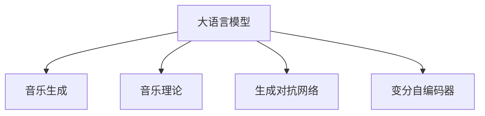

                 

# LLM与音乐创作：AI作曲家的诞生

## 1. 背景介绍

音乐，作为一种情感和艺术的表达方式，长久以来一直是人类文明的重要组成部分。而随着人工智能技术的不断发展，我们正见证着一种新型的音乐创作形式——人工智能作曲。这不仅拓宽了音乐创作的边界，也为音乐领域带来了新的可能性。

### 1.1 问题由来
在过去，音乐创作依赖于作曲家的个人灵感和技巧，需要经过长时间的构思、演奏和修改。但随着深度学习等人工智能技术的兴起，我们逐渐发现，通过算法可以自动生成旋律、和声、节奏等音乐元素，从而催生了AI作曲家的诞生。

### 1.2 问题核心关键点
AI作曲的本质是通过机器学习模型从音乐理论、历史数据中学习音乐的生成规则，并结合人类的创作意图，自动生成符合特定风格或情感的乐曲。这涉及到多个关键问题，包括但不限于：

- **音乐数据的采集与标注**：如何获取高质量的音乐数据，并将其转化为模型能够处理的格式。
- **模型的构建与训练**：设计什么样的模型架构，如何通过监督学习或生成模型训练音乐生成器。
- **生成的可控性与创新性**：如何在控制生成的音乐风格和情感表达的同时，促进音乐的创新。

### 1.3 问题研究意义
AI作曲的探索，不仅为音乐创作提供了新的工具和方法，也为计算机视觉、自然语言处理等领域提供了借鉴。它让机器能够以全新的视角理解和表达艺术，进而推动人类艺术创作的多元化和个性化。同时，AI作曲也有助于教育、娱乐等领域的创新，为音乐普及和创作效率的提升提供了可能。

## 2. 核心概念与联系

### 2.1 核心概念概述

为了更好地理解AI作曲，本节将介绍几个核心概念：

- **大语言模型(Large Language Model, LLM)**：一类基于深度学习的模型，通过海量的无标签文本数据预训练，具备了强大的语言生成能力。
- **音乐生成(Musical Generation)**：指通过算法生成符合特定音乐风格、情感或题材的乐曲。
- **音乐理论(Theory of Music)**：音乐创作的基础知识体系，包括音高、节奏、和弦、旋律等元素。
- **生成对抗网络(Generative Adversarial Networks, GANs)**：一种深度学习模型，通过两个网络相互博弈来生成高质量的数据。
- **变分自编码器(Variational Autoencoder, VAEs)**：一种生成模型，通过学习数据的分布来生成新的样本。

这些核心概念之间的逻辑关系可以通过以下Mermaid流程图来展示：



这个流程图展示了各大概念之间的联系：

1. **大语言模型**通过预训练学习语言的生成规则，可用于生成符合特定音乐语言风格的乐曲。
2. **音乐生成**与**音乐理论**紧密相连，生成过程中需遵循一定的音乐规则和理论基础。
3. **生成对抗网络**和**变分自编码器**作为生成模型，可以通过训练生成高质量的音乐数据。
4. **大语言模型**和**生成对抗网络/变分自编码器**可以联合使用，共同生成音乐作品。

## 3. 核心算法原理 & 具体操作步骤
### 3.1 算法原理概述

AI作曲的核心思想是通过深度学习模型，学习音乐数据的生成规律，并在此基础上生成新的音乐作品。这可以分为以下几个关键步骤：

1. **数据采集与预处理**：收集音乐数据，进行清洗、标注和分割，以供模型训练使用。
2. **模型构建与训练**：设计适合的深度学习模型，并使用音乐数据进行训练。
3. **生成与后处理**：根据用户需求生成音乐，并进行必要的后处理，如音量调整、曲式优化等。

### 3.2 算法步骤详解

以下详细讲解基于深度学习模型进行音乐生成的具体步骤：

**Step 1: 数据采集与预处理**
- 数据采集：收集不同风格和题材的音乐作品，包括古典、流行、爵士等。
- 数据清洗：去除噪声、静音等无用信息，确保数据质量。
- 数据标注：对音乐进行结构标注，如曲式、节奏、和声等。
- 数据分割：将音乐分割成更小的片段，以便模型训练。

**Step 2: 模型构建与训练**
- 模型设计：使用递归神经网络(RNN)、卷积神经网络(CNN)或Transformer模型，结合音乐理论知识构建音乐生成模型。
- 损失函数设计：选择合适的损失函数，如交叉熵、均方误差等，评估生成音乐与真实音乐之间的差距。
- 训练过程：使用音乐数据对模型进行训练，不断优化模型参数，减少损失函数值。
- 超参数调整：调整学习率、批次大小、迭代次数等超参数，以优化训练效果。

**Step 3: 生成与后处理**
- 音乐生成：根据用户需求或预定义的生成规则，使用模型生成音乐。
- 后处理：对生成的音乐进行音高校正、节奏优化、和声调整等，提升音乐质量。
- 输出展示：将处理后的音乐输出，可以通过MIDI格式、音频格式等展示给用户。

### 3.3 算法优缺点

基于深度学习模型的音乐生成具有以下优点：

1. **高效性**：能够快速生成大量音乐作品，大大缩短了创作时间。
2. **多样性**：能够生成多种风格的音乐，满足不同用户需求。
3. **可扩展性**：通过调整模型参数和超参数，可以生成不同复杂度和风格的乐曲。

然而，这种生成方法也存在一些缺点：

1. **缺乏情感表达**：生成音乐往往缺乏情感和深度，难以超越人类的创作能力。
2. **依赖标注数据**：高质量的标注数据难以获取，制约了模型的训练效果。
3. **过度依赖模型**：模型的创作风格和能力受限于训练数据，难以捕捉人类创作的独特性和创意。
4. **版权问题**：生成的音乐作品可能涉及版权问题，需要谨慎处理。

### 3.4 算法应用领域

音乐生成技术的应用范围非常广泛，以下是几个典型场景：

- **电影配乐**：根据电影剧情和场景自动生成配乐，提升电影观感。
- **音乐教育**：辅助音乐教学，提供丰富的练习和示范音乐资源。
- **游戏音乐**：为游戏自动生成背景音乐和音效，提升游戏体验。
- **音乐创作辅助**：提供创作灵感和工具，帮助音乐家创作新的作品。
- **广告音乐**：根据广告内容自动生成背景音乐，提高广告效果。

这些应用场景展示了音乐生成技术的强大潜力，为音乐创作、娱乐、教育等领域带来了新的机遇。

## 4. 数学模型和公式 & 详细讲解  
### 4.1 数学模型构建

音乐生成模型的数学模型构建，通常基于以下假设：

- **音乐作为序列数据**：将音乐表示为时间序列，每个音符对应一个时间步长。
- **音乐元素的独立性**：假设每个音符的生成只依赖于前一个音符，即使用递归神经网络(RNN)。

记音乐作为时间序列 $X = \{x_1, x_2, \ldots, x_T\}$，其中 $x_t \in \mathcal{M}$，$\mathcal{M}$ 表示音乐符号的集合，如音符、节奏、和弦等。

定义音乐生成模型为 $P(X|Y)$，其中 $Y$ 表示音乐元素的标注数据，如节奏、和声等。

### 4.2 公式推导过程

以递归神经网络为例，推导音乐生成模型的基本公式。

定义递归神经网络模型为 $M = (X, Y, R)$，其中 $X$ 表示输入数据，$Y$ 表示输出数据，$R$ 表示模型参数。假设模型采用长短时记忆网络(LSTM)，其基本结构如下：

$$
\begin{aligned}
    & h_t = LSTM(x_t, h_{t-1}) \\
    & o_t = softmax(W_o h_t + b_o) \\
    & p(x_{t+1}|x_t, h_t) &= o_t
\end{aligned}
$$

其中 $h_t$ 表示当前时刻的隐藏状态，$W_o, b_o$ 为输出层的权重和偏置。$o_t$ 表示当前时刻的输出概率分布，$x_{t+1}$ 表示下一个音符的预测。

### 4.3 案例分析与讲解

以一个简单的例子来说明音乐生成模型的应用：

假设有一个简单的音乐生成模型，用于生成二分音符序列。我们希望生成一个包含多个二分音符的乐曲。首先，我们需要收集和标注大量的二分音符数据，训练模型。然后，根据模型，我们可以生成新的乐曲，如下所示：

$$
\begin{aligned}
    & x_1 = \text{C} \\
    & h_1 = LSTM(\text{C}, h_0) \\
    & o_1 = softmax(W_o h_1 + b_o) \\
    & p(\text{G}|\text{C}, h_1) &= o_1 \\
    & x_2 = \text{G} \\
    & h_2 = LSTM(\text{G}, h_1) \\
    & o_2 = softmax(W_o h_2 + b_o) \\
    & p(\text{C}|\text{G}, h_2) &= o_2 \\
    & \cdots \\
\end{aligned}
$$

这个例子展示了音乐生成模型的基本思路：通过递归神经网络，生成符合特定风格的乐曲。

## 5. 项目实践：代码实例和详细解释说明
### 5.1 开发环境搭建

在进行音乐生成实践前，我们需要准备好开发环境。以下是使用Python进行PyTorch开发的环境配置流程：

1. 安装Anaconda：从官网下载并安装Anaconda，用于创建独立的Python环境。

2. 创建并激活虚拟环境：
```bash
conda create -n music-env python=3.8 
conda activate music-env
```

3. 安装PyTorch：根据CUDA版本，从官网获取对应的安装命令。例如：
```bash
conda install pytorch torchvision torchaudio cudatoolkit=11.1 -c pytorch -c conda-forge
```

4. 安装TensorBoard：
```bash
pip install tensorboard
```

5. 安装各类工具包：
```bash
pip install numpy pandas scikit-learn matplotlib tqdm jupyter notebook ipython
```

完成上述步骤后，即可在`music-env`环境中开始音乐生成实践。

### 5.2 源代码详细实现

下面我们以二分音符乐曲生成为例，给出使用PyTorch实现音乐生成的代码：

首先，定义音乐生成模型：

```python
import torch
import torch.nn as nn
import torch.optim as optim

class MusicGenerator(nn.Module):
    def __init__(self, input_dim, hidden_dim, output_dim, num_layers):
        super(MusicGenerator, self).__init__()
        self.hidden_dim = hidden_dim
        self.num_layers = num_layers
        
        self.rnn = nn.LSTM(input_dim, hidden_dim, num_layers, batch_first=True)
        self.fc = nn.Linear(hidden_dim, output_dim)
        
    def forward(self, x, hidden):
        rnn_output, hidden = self.rnn(x, hidden)
        output = self.fc(rnn_output)
        return output, hidden

    def init_hidden(self, batch_size):
        return (torch.zeros(self.num_layers, batch_size, self.hidden_dim).to(device),
                torch.zeros(self.num_layers, batch_size, self.hidden_dim).to(device))
```

然后，定义训练函数：

```python
def train(model, train_loader, optimizer, criterion, device):
    model.train()
    for batch in train_loader:
        x, y = batch
        x = x.to(device)
        y = y.to(device)
        
        hidden = model.init_hidden(x.size(0))
        preds = []
        for i in range(10):
            output, hidden = model(x[i], hidden)
            preds.append(output)
        
        loss = 0
        for i in range(len(preds)):
            loss += criterion(preds[i], y[i])
        
        optimizer.zero_grad()
        loss.backward()
        optimizer.step()
        
    return loss.item()
```

最后，启动训练流程：

```python
epochs = 100
device = torch.device('cuda' if torch.cuda.is_available() else 'cpu')
model = MusicGenerator(input_dim, hidden_dim, output_dim, num_layers).to(device)
criterion = nn.CrossEntropyLoss().to(device)
optimizer = optim.Adam(model.parameters(), lr=0.01)

for epoch in range(epochs):
    loss = train(model, train_loader, optimizer, criterion, device)
    print(f"Epoch {epoch+1}, loss: {loss:.3f}")
```

以上就是使用PyTorch实现音乐生成的完整代码实现。可以看到，通过递归神经网络模型，可以自动生成二分音符乐曲，并使用交叉熵损失函数进行训练。

### 5.3 代码解读与分析

让我们再详细解读一下关键代码的实现细节：

**MusicGenerator类**：
- `__init__`方法：初始化模型参数。
- `forward`方法：定义前向传播过程。
- `init_hidden`方法：初始化隐藏状态。

**train函数**：
- 在训练过程中，对输入数据进行循环处理，生成多个音符。
- 使用交叉熵损失函数计算预测值与真实标签之间的差异。
- 通过Adam优化器更新模型参数。

**训练流程**：
- 定义总的epoch数和device，开始循环迭代
- 每个epoch内，在训练集上训练，输出平均loss
- 所有epoch结束后，输出最终的训练结果

可以看到，使用递归神经网络进行音乐生成，代码实现相对简单，且易于理解。当然，实际的工程实现还需要考虑更多的细节，如数据增强、模型裁剪、超参数调整等。

## 6. 实际应用场景
### 6.1 音乐创作与演奏

AI作曲家的出现，极大地简化了音乐创作和演奏的过程。作曲家可以通过AI工具生成初稿，再加以修改和完善，快速产出高质量的音乐作品。同时，演奏家可以利用AI生成的音乐进行练习和即兴演奏，提高演奏水平。

在技术实现上，可以基于现有音乐作品生成新的变体，或者根据用户提供的音乐片段自动生成完整的乐曲。这些生成的音乐作品可以在音乐会、音乐教学、电影配乐等多个场景下应用。

### 6.2 音乐教育

AI作曲工具可以辅助音乐教学，提供丰富的音乐素材和练习资源。学生可以通过AI生成的乐曲进行练习，提高演奏和创作能力。同时，AI还可以通过分析学生的演奏数据，提供个性化的学习建议。

在音乐教育领域，AI作曲的应用场景包括：

- **自动化练习生成**：根据学生水平和需求，自动生成练习乐曲。
- **创作灵感辅助**：提供创作素材和灵感，帮助学生创作音乐作品。
- **反馈与优化**：通过分析演奏数据，提供实时反馈和改进建议。

### 6.3 游戏音乐

游戏音乐生成技术可以用于自动生成游戏背景音乐和音效，提高游戏的沉浸感和互动性。根据游戏情节和场景，AI可以生成符合特定氛围和情感的音乐。

在实际应用中，游戏音乐生成技术可以用于：

- **自动化音乐创作**：根据游戏情节自动生成背景音乐和音效。
- **动态音乐调整**：根据玩家行为和游戏状态，实时调整音乐内容和情感。
- **音乐风格切换**：根据游戏不同阶段，切换音乐风格和情感。

### 6.4 未来应用展望

随着音乐生成技术的不断进步，AI作曲将有更广阔的应用前景：

- **跨界融合**：音乐生成技术与虚拟现实、增强现实等新兴技术的融合，将带来更加沉浸和互动的音乐体验。
- **情感智能**：通过结合情感分析技术，AI作曲可以更好地理解和表达情感，生成更加动人的音乐作品。
- **个性化定制**：根据用户偏好和历史行为，生成个性化定制的音乐作品，提升用户体验。
- **艺术创新**：AI作曲可以作为艺术家创作过程中的辅助工具，提供灵感和创意支持。

总之，音乐生成技术的应用将带来音乐创作、教育、娱乐等领域的新变革，为音乐艺术的发展注入新的动力。

## 7. 工具和资源推荐
### 7.1 学习资源推荐

为了帮助开发者系统掌握音乐生成技术的理论基础和实践技巧，这里推荐一些优质的学习资源：

1. **DeepMusicGAN: A Multitrack Music Generation with Music and Midi Fusion**：介绍了一种基于GAN的音乐生成方法，使用音乐和MIDI数据联合训练生成器。
2. **RNN for Music Generation**：使用递归神经网络进行音乐生成的经典教程，详细讲解了RNN的架构和训练过程。
3. **Deep Music Generation with Attention-Based Neural Networks**：介绍了基于注意力机制的音乐生成模型，可以生成更加结构化和连贯的乐曲。
4. **Music Transformer**：使用Transformer模型进行音乐生成的教程，展示了Transformer在音乐生成中的应用。
5. **OpenAI Music Transformer**：OpenAI开源的音乐生成模型，提供了详细的训练和推理代码。

通过对这些资源的学习实践，相信你一定能够快速掌握音乐生成技术的精髓，并用于解决实际的NLP问题。

### 7.2 开发工具推荐

高效的开发离不开优秀的工具支持。以下是几款用于音乐生成开发的常用工具：

1. **PyTorch**：基于Python的开源深度学习框架，灵活动态的计算图，适合快速迭代研究。大部分预训练音乐生成模型都有PyTorch版本的实现。
2. **TensorFlow**：由Google主导开发的开源深度学习框架，生产部署方便，适合大规模工程应用。同样有丰富的音乐生成模型资源。
3. **MIDI格式工具**：如MIDI file、Music21等，用于音乐数据的存储和处理。
4. **音频处理工具**：如librosa、PyAudio等，用于音频数据的读取和处理。
5. **可视化工具**：如TensorBoard、Matplotlib等，用于模型训练和结果展示。

合理利用这些工具，可以显著提升音乐生成任务的开发效率，加快创新迭代的步伐。

### 7.3 相关论文推荐

音乐生成技术的发展源于学界的持续研究。以下是几篇奠基性的相关论文，推荐阅读：

1. **MusicTransformer: Text-to-Music Generation Using Transformer**：介绍了一种基于Transformer的音乐生成方法，展示了Transformer在音乐生成中的应用。
2. **MusicGAN: Music Generation using GAN**：使用GAN进行音乐生成的经典论文，展示了GAN在音乐生成中的强大能力。
3. **Attention-Based Music Model**：使用注意力机制进行音乐生成的论文，展示了注意力在音乐生成中的重要作用。
4. **MusicVAE: Music Generation with Variational Autoencoder**：介绍了一种基于变分自编码器的音乐生成方法，展示了VAE在音乐生成中的应用。
5. **MusicSynthesizer: A Recurrent Neural Network Based Music Composition System**：介绍了一种基于RNN的音乐生成系统，展示了RNN在音乐生成中的应用。

这些论文代表了大语言模型微调技术的发展脉络。通过学习这些前沿成果，可以帮助研究者把握学科前进方向，激发更多的创新灵感。

## 8. 总结：未来发展趋势与挑战
### 8.1 总结

本文对基于深度学习模型的音乐生成技术进行了全面系统的介绍。首先阐述了AI作曲的探索背景和意义，明确了音乐生成技术在音乐创作、教育、娱乐等领域的应用前景。其次，从原理到实践，详细讲解了音乐生成模型的构建和训练过程，给出了音乐生成任务开发的完整代码实例。同时，本文还广泛探讨了音乐生成技术在电影配乐、音乐教育、游戏音乐等多个行业领域的应用场景，展示了音乐生成技术的强大潜力。

通过本文的系统梳理，可以看到，音乐生成技术正在成为AI作曲的强大工具，为音乐创作、娱乐、教育等领域带来了新的机遇。未来，伴随音乐生成模型的不断进步，相信音乐创作和演出将更加便捷和高效，音乐教育将更加个性化和互动，音乐娱乐将更加沉浸和丰富。

### 8.2 未来发展趋势

展望未来，音乐生成技术将呈现以下几个发展趋势：

1. **多模态融合**：结合视觉、语音等多种模态数据，生成更加丰富和动态的音乐作品。
2. **跨界融合**：音乐生成技术与虚拟现实、增强现实等新兴技术的融合，将带来更加沉浸和互动的音乐体验。
3. **情感智能**：通过结合情感分析技术，AI作曲可以更好地理解和表达情感，生成更加动人的音乐作品。
4. **个性化定制**：根据用户偏好和历史行为，生成个性化定制的音乐作品，提升用户体验。
5. **艺术创新**：AI作曲可以作为艺术家创作过程中的辅助工具，提供灵感和创意支持。

以上趋势凸显了音乐生成技术的广阔前景。这些方向的探索发展，必将进一步提升音乐生成系统的性能和应用范围，为音乐艺术的发展注入新的动力。

### 8.3 面临的挑战

尽管音乐生成技术已经取得了瞩目成就，但在迈向更加智能化、普适化应用的过程中，它仍面临着诸多挑战：

1. **数据质量瓶颈**：高质量的音乐数据难以获取，制约了模型的训练效果。
2. **版权问题**：生成的音乐作品可能涉及版权问题，需要谨慎处理。
3. **创作风格的控制**：如何控制生成的音乐风格，避免过度自动化和机械化，是关键问题。
4. **情感表达的深度**：生成音乐往往缺乏情感和深度，难以超越人类的创作能力。
5. **模型的多样性和创新性**：如何在保持多样性的同时，促进音乐的创新，是重要研究方向。

### 8.4 研究展望

面对音乐生成面临的挑战，未来的研究需要在以下几个方面寻求新的突破：

1. **高质量数据获取**：探索新的数据获取方法和标注技术，提高音乐数据的可用性和质量。
2. **版权问题的解决**：制定合理的版权保护机制，确保生成的音乐作品的合法性。
3. **创作风格的多样性**：开发更加多样化和灵活的音乐生成模型，提升创作的自由度。
4. **情感表达的深度**：结合情感分析技术，提升音乐生成模型的情感智能。
5. **创新的促进**：开发更加创新的音乐生成方法，促进音乐的创新和发展。

这些研究方向将推动音乐生成技术的不断进步，为音乐创作、教育、娱乐等领域带来新的可能性。

## 9. 附录：常见问题与解答
### 附录1：音乐生成技术的局限性

**Q1: 音乐生成技术存在哪些局限性？**

A1: 音乐生成技术虽然具有自动化创作的优势，但也存在一些局限性：

1. **缺乏情感深度**：生成的音乐作品往往缺乏人类的情感和深度，难以超越人类的创作能力。
2. **依赖数据质量**：高质量的音乐数据难以获取，制约了模型的训练效果。
3. **版权问题**：生成的音乐作品可能涉及版权问题，需要谨慎处理。
4. **创作风格的控制**：如何控制生成的音乐风格，避免过度自动化和机械化，是关键问题。
5. **模型的多样性和创新性**：如何在保持多样性的同时，促进音乐的创新，是重要研究方向。

这些局限性需要研究者不断探索和改进，才能更好地应用于实际场景中。

**Q2: 如何提升音乐生成模型的情感智能？**

A2: 提升音乐生成模型的情感智能，可以从以下几个方面入手：

1. **数据标注**：收集和标注更多的情感音乐数据，提高模型的情感表达能力。
2. **情感分析技术**：结合情感分析技术，对生成的音乐进行情感分类和评估，优化生成过程。
3. **生成对抗网络**：使用生成对抗网络，训练更加多样化和情感丰富的音乐生成模型。
4. **多模态融合**：结合视觉、语音等多种模态数据，提升音乐生成的情感表达。

通过这些方法，可以提升音乐生成模型的情感智能，使其能够更好地表达和传达情感。

**Q3: 如何控制音乐生成模型的创作风格？**

A3: 控制音乐生成模型的创作风格，可以从以下几个方面入手：

1. **风格引导**：在生成过程中，通过向模型输入特定的风格提示，引导模型生成特定风格的音乐。
2. **多模型融合**：训练多个风格不同的音乐生成模型，通过组合和调整，生成具有多种风格的音乐作品。
3. **风格迁移**：使用风格迁移技术，将一种风格的音乐转换为另一种风格。
4. **用户定制**：允许用户自定义生成风格，提供更加个性化的音乐生成服务。

通过这些方法，可以更好地控制音乐生成模型的创作风格，使其能够满足不同用户的需求。

**Q4: 如何提高音乐生成模型的多样性和创新性？**

A4: 提高音乐生成模型的多样性和创新性，可以从以下几个方面入手：

1. **多样化的数据集**：收集和标注多样化的音乐数据，提高模型的多样性。
2. **创新性的训练方法**：使用创新性的训练方法，如生成对抗网络、变分自编码器等，提升模型的创新性。
3. **多模态融合**：结合视觉、语音等多种模态数据，提升音乐生成的多样性。
4. **跨界融合**：结合虚拟现实、增强现实等新兴技术，提升音乐生成的多样性。

通过这些方法，可以提升音乐生成模型的多样性和创新性，使其能够生成更加丰富和有趣的音乐作品。

---

作者：禅与计算机程序设计艺术 / Zen and the Art of Computer Programming

