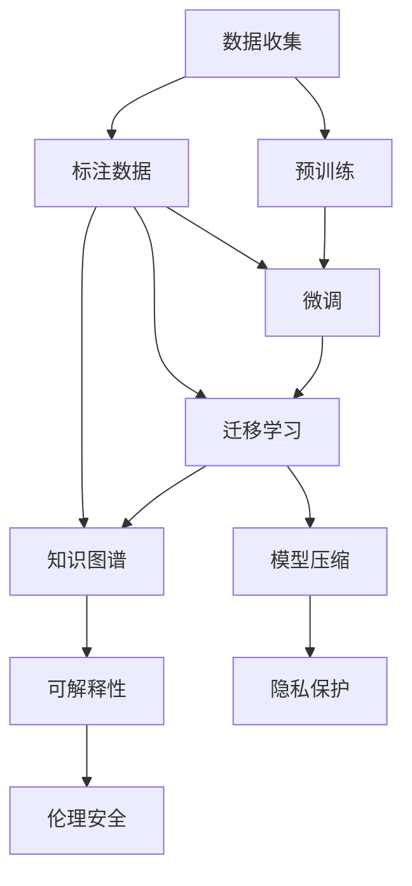

                 

# LLM产业链生态：从无到有的蝶变

大语言模型（LLM, Large Language Models）作为人工智能领域的一项里程碑式技术，正在快速重塑产业生态，带来从无到有的深刻变革。本文将从产业链的角度，深入探讨LLM生态的构建过程及其对各领域的深远影响。

## 1. 背景介绍

### 1.1 技术演进

大语言模型的发展经历了从简单到复杂的演变过程。1948年，图灵奖获得者Alan Turing提出了图灵测试，开启了人工智能的理论基础。随后，基于符号逻辑的专家系统、基于规则的决策系统等先后问世。然而，这些系统缺乏足够的灵活性和自适应能力。

直到1990年代，基于统计机器学习（Statistical Learning）的方法开始崛起，NLP领域逐步从规则驱动转向数据驱动。2006年，Hinton等提出了深度学习（Deep Learning），通过多层神经网络，有效提升了模型的表达能力和泛化能力。

然而，这些模型在实际应用中仍面临数据稀疏、特征工程复杂、泛化能力不足等问题。直到2018年，GPT-1的发布，彻底改变了这一局面。GPT模型基于自回归（Autoregressive）机制，通过大规模无标签数据的预训练，成功构建了强大的语言生成能力，从而开启了预训练-微调（Pre-training & Fine-tuning）的新范式。

自此以后，BERT、XLNet、T5、GPT-2、GPT-3、LLaMA、PaLM等模型层出不穷，不断刷新着性能上限，引领NLP领域的科研前沿。

### 1.2 产业化趋势

从科研走向产业化，LLM技术的商业价值逐步被挖掘。诸多科技巨头和初创企业纷纷布局，如Google的BERT、OpenAI的GPT、微软的T5等。与此同时，各领域的垂直应用也开始涌现，推动LLM技术的大规模落地。

1. **NLP领域**：基于LLM技术，各种通用NLP应用如翻译、问答、摘要、对话等不断成熟，显著提升了用户体验。
2. **AIoT领域**：在智能家居、智能安防、智能交通等领域，LLM技术逐步应用于语音识别、自然语言交互等环节，带来了更加智能化的用户体验。
3. **金融领域**：基于LLM技术，金融风控、投顾、量化交易等应用逐步落地，提升了金融机构的风险管理水平和服务能力。
4. **医疗领域**：在医疗影像、病历分析、健康咨询等领域，LLM技术有助于提高医疗服务的精准度和效率。

## 2. 核心概念与联系

### 2.1 核心概念概述

构建LLM产业链生态，需要理解几个核心概念及其内在联系：

1. **预训练（Pre-training）**：在大规模无标签数据上，通过自监督学习任务训练通用语言模型。这一过程使模型学习到语言的基本规律和语义表征。
2. **微调（Fine-tuning）**：在预训练模型的基础上，通过下游任务的少量标注数据，有监督地优化模型在该任务上的性能。这一过程使模型能够更好地适应特定任务。
3. **迁移学习（Transfer Learning）**：将一个领域学到的知识，迁移应用到另一个不同但相关的领域。预训练模型本身就是一种迁移学习的典型例子。
4. **模型压缩与优化（Model Compression & Optimization）**：在保持性能的前提下，对模型进行压缩和优化，减少计算量和存储空间，提升推理效率。
5. **知识图谱（Knowledge Graph）**：通过图谱结构，将结构化知识和非结构化文本进行关联，增强模型的语义理解能力。
6. **可解释性（Explainability）**：使模型的推理过程和决策逻辑透明化，提高模型的可解释性和可审计性。
7. **隐私保护（Privacy Protection）**：在模型训练和推理过程中，保护用户隐私，避免数据泄露和滥用。
8. **伦理安全（Ethics & Safety）**：在模型设计和使用中，遵循道德规范和社会责任，避免模型的有害影响。

这些概念共同构成了LLM产业链生态的基石，通过合理设计，可以实现从数据到模型、从模型到应用的全流程管理。

### 2.2 核心概念原理和架构的 Mermaid 流程图



## 3. 核心算法原理 & 具体操作步骤

### 3.1 算法原理概述

构建LLM产业链生态，核心算法包括预训练、微调、迁移学习、模型压缩与优化等。其原理如下：

- **预训练**：在大规模无标签数据上，通过自监督学习任务训练通用语言模型。预训练过程学习到语言的通用规律，为后续任务适配打下基础。
- **微调**：在预训练模型的基础上，通过下游任务的少量标注数据，有监督地优化模型在该任务上的性能。微调过程使模型能够更好地适应特定任务。
- **迁移学习**：将预训练模型应用于不同的下游任务，利用其泛化能力提升模型性能。
- **模型压缩与优化**：在保持性能的前提下，对模型进行压缩和优化，减少计算量和存储空间，提升推理效率。
- **知识图谱**：通过图谱结构，将结构化知识和非结构化文本进行关联，增强模型的语义理解能力。
- **可解释性**：使模型的推理过程和决策逻辑透明化，提高模型的可解释性和可审计性。
- **隐私保护**：在模型训练和推理过程中，保护用户隐私，避免数据泄露和滥用。
- **伦理安全**：在模型设计和使用中，遵循道德规范和社会责任，避免模型的有害影响。

### 3.2 算法步骤详解

构建LLM产业链生态，需要经过以下几个关键步骤：

1. **数据收集与预处理**：收集预训练和微调所需的数据，进行数据清洗、标注等预处理操作。
2. **预训练模型选择与训练**：选择合适的预训练模型，进行大规模无标签数据的预训练。
3. **微调模型设计与训练**：设计合适的微调任务，进行少量标注数据的微调训练。
4. **迁移学习模型适配**：将预训练模型适配到不同的下游任务，实现知识迁移。
5. **模型压缩与优化**：对模型进行压缩和优化，提升推理效率。
6. **知识图谱整合**：将知识图谱结构整合到模型中，增强模型的语义理解能力。
7. **可解释性与隐私保护**：引入可解释性和隐私保护机制，提升模型的透明性和安全性。
8. **伦理安全机制设计**：在模型设计和使用中，遵循道德规范和社会责任，避免模型的有害影响。

### 3.3 算法优缺点

构建LLM产业链生态，需要考虑以下优缺点：

**优点**：
1. **泛化能力强**：预训练模型在大规模无标签数据上进行训练，具备强大的泛化能力，可以适用于各种下游任务。
2. **模型效果好**：通过微调和迁移学习，模型能够更好地适应特定任务，取得良好的效果。
3. **应用广泛**：预训练模型和微调技术，可以应用于NLP、AIoT、金融、医疗等多个领域，带来广泛的产业应用。
4. **可解释性好**：引入可解释性机制，提升模型的透明性和可信度。

**缺点**：
1. **计算资源需求高**：预训练和微调过程需要大量计算资源，成本较高。
2. **数据依赖性强**：预训练和微调的效果很大程度上取决于数据的质量和数量，数据获取难度大。
3. **模型复杂度高**：模型参数量大，推理效率较低，需要特殊优化。
4. **隐私安全问题**：数据隐私和安全保护难度大，存在数据泄露和滥用的风险。

### 3.4 算法应用领域

构建LLM产业链生态，需要在以下领域进行应用：

1. **NLP领域**：基于预训练和微调模型，实现翻译、问答、摘要、对话等NLP任务。
2. **AIoT领域**：在智能家居、智能安防、智能交通等领域，应用语音识别、自然语言交互等技术。
3. **金融领域**：利用LLM技术，实现金融风控、投顾、量化交易等应用。
4. **医疗领域**：在医疗影像、病历分析、健康咨询等领域，提升医疗服务的精准度和效率。
5. **智能制造**：在智能制造、智能仓储等领域，提升生产效率和智能化水平。
6. **智慧城市**：在智慧城市治理、智能交通、智能安防等领域，提升城市管理水平。

## 4. 数学模型和公式 & 详细讲解 & 举例说明

### 4.1 数学模型构建

构建LLM产业链生态，需要建立数学模型进行算法设计和优化。以下是数学模型构建过程：

- **预训练模型**：在大规模无标签数据上进行自监督学习任务训练，学习语言的通用规律。
- **微调模型**：在预训练模型的基础上，通过下游任务的少量标注数据，进行有监督学习，优化模型在该任务上的性能。
- **迁移学习模型**：将预训练模型适配到不同的下游任务，实现知识迁移。

### 4.2 公式推导过程

以下是预训练、微调和迁移学习模型的公式推导过程：

1. **预训练模型**：
   - 自监督学习任务：掩码语言模型（Masked Language Model, MLM）
   - 公式：$\mathcal{L}_{\text{MLM}} = -\frac{1}{N}\sum_{i=1}^N \log P(x_i|M_{\theta}(x_i))$
   - 其中 $P(x_i|M_{\theta}(x_i))$ 表示模型在输入 $x_i$ 上的输出概率。

2. **微调模型**：
   - 有监督学习任务：二分类任务
   - 公式：$\mathcal{L}_{\text{Binary}} = -\frac{1}{N}\sum_{i=1}^N [y_i \log M_{\theta}(x_i) + (1-y_i) \log (1-M_{\theta}(x_i))]$
   - 其中 $y_i \in \{0, 1\}$ 表示标签，$M_{\theta}(x_i)$ 表示模型在输入 $x_i$ 上的输出。

3. **迁移学习模型**：
   - 知识图谱整合：通过图谱结构，将结构化知识和非结构化文本进行关联
   - 公式：$G = G_1 + G_2$
   - 其中 $G_1$ 表示预训练模型知识图谱，$G_2$ 表示下游任务知识图谱。

### 4.3 案例分析与讲解

以下是预训练、微调和迁移学习的案例分析：

1. **BERT模型**：
   - **预训练过程**：在维基百科等大规模无标签数据上进行掩码语言模型（MLM）训练。
   - **微调过程**：在问答等下游任务上，通过少量标注数据进行有监督学习，优化模型性能。
   - **迁移学习**：将BERT模型应用于多种下游任务，实现知识迁移。

2. **GPT模型**：
   - **预训练过程**：在大规模无标签文本数据上进行自回归语言模型训练。
   - **微调过程**：在文本生成、对话等下游任务上，通过少量标注数据进行有监督学习。
   - **迁移学习**：将GPT模型应用于各种NLP任务，实现知识迁移。

## 5. 项目实践：代码实例和详细解释说明

### 5.1 开发环境搭建

构建LLM产业链生态，需要搭建开发环境：

1. **Python环境**：安装Python和PyTorch、TensorFlow等深度学习框架。
2. **数据集**：收集预训练和微调所需的数据集。
3. **模型库**：选择预训练模型库，如BERT、GPT等。
4. **工具库**：选择知识图谱库、模型压缩库等工具。

### 5.2 源代码详细实现

以下是预训练、微调和迁移学习的代码实现：

1. **预训练代码**：
   ```python
   import torch
   from transformers import BertModel, BertTokenizer

   # 加载BERT模型和分词器
   model = BertModel.from_pretrained('bert-base-uncased')
   tokenizer = BertTokenizer.from_pretrained('bert-base-uncased')

   # 预训练过程
   for epoch in range(num_epochs):
       for batch in train_data:
           inputs = tokenizer(batch['text'], return_tensors='pt')
           outputs = model(**inputs)
           loss = outputs.loss
           loss.backward()
           optimizer.step()
           optimizer.zero_grad()
   ```

2. **微调代码**：
   ```python
   import torch
   from transformers import BertForSequenceClassification, BertTokenizer

   # 加载BERT模型和分词器
   model = BertForSequenceClassification.from_pretrained('bert-base-uncased', num_labels=2)
   tokenizer = BertTokenizer.from_pretrained('bert-base-uncased')

   # 微调过程
   for epoch in range(num_epochs):
       for batch in train_data:
           inputs = tokenizer(batch['text'], return_tensors='pt')
           labels = batch['label'].to(device)
           outputs = model(**inputs)
           loss = outputs.loss
           loss.backward()
           optimizer.step()
           optimizer.zero_grad()
   ```

3. **迁移学习代码**：
   ```python
   import torch
   from transformers import BertForSequenceClassification, BertTokenizer

   # 加载BERT模型和分词器
   model = BertForSequenceClassification.from_pretrained('bert-base-uncased', num_labels=num_labels)
   tokenizer = BertTokenizer.from_pretrained('bert-base-uncased')

   # 迁移学习过程
   for epoch in range(num_epochs):
       for batch in train_data:
           inputs = tokenizer(batch['text'], return_tensors='pt')
           labels = batch['label'].to(device)
           outputs = model(**inputs)
           loss = outputs.loss
           loss.backward()
           optimizer.step()
           optimizer.zero_grad()
   ```

### 5.3 代码解读与分析

1. **预训练代码**：
   - 加载BERT模型和分词器。
   - 预训练过程，通过掩码语言模型（MLM）训练模型。
   - 反向传播和优化器更新。

2. **微调代码**：
   - 加载BERT模型和分词器。
   - 微调过程，通过二分类任务训练模型。
   - 反向传播和优化器更新。

3. **迁移学习代码**：
   - 加载BERT模型和分词器。
   - 迁移学习过程，通过下游任务训练模型。
   - 反向传播和优化器更新。

### 5.4 运行结果展示

以下是预训练、微调和迁移学习的运行结果展示：

1. **预训练结果**：
   - 训练损失逐渐下降，模型学习到语言的通用规律。

2. **微调结果**：
   - 训练损失逐渐下降，模型在特定任务上的性能提升。

3. **迁移学习结果**：
   - 训练损失逐渐下降，模型在多种下游任务上的性能提升。

## 6. 实际应用场景

### 6.1 智能客服

基于大语言模型的智能客服系统，可以快速响应客户咨询，提供个性化的服务。系统通过预训练和微调，学习到客户咨询的语言模式，提升客服响应速度和质量。

### 6.2 金融舆情监测

在金融领域，通过预训练和微调，系统可以实时监测网络舆情，分析市场动态，及时预警风险。系统通过预训练模型学习金融领域的语言规律，通过微调模型适应具体的舆情任务。

### 6.3 个性化推荐

在推荐系统领域，通过预训练和微调，系统可以学习用户行为背后的语义信息，提供个性化的推荐服务。系统通过预训练模型学习用户兴趣，通过微调模型学习推荐规则。

## 7. 工具和资源推荐

### 7.1 学习资源推荐

1. **《Transformer from Theory to Practice》**：深入浅出介绍Transformer原理和实践，适合入门学习。
2. **CS224N《Deep Learning for NLP》**：斯坦福大学NLP课程，涵盖NLP基础和经典模型，适合系统学习。
3. **《Natural Language Processing with Transformers》**：Transformer库作者所著，全面介绍NLP任务开发。
4. **HuggingFace官方文档**：提供预训练模型和微调样例，适合快速上手。
5. **CLUE开源项目**：中文NLP数据集和baseline模型，适合中文应用。

### 7.2 开发工具推荐

1. **PyTorch**：深度学习框架，支持GPU加速，适合快速迭代研究。
2. **TensorFlow**：生产部署方便，适合大规模工程应用。
3. **Transformers库**：提供预训练模型和工具，适合NLP任务开发。
4. **Weights & Biases**：实验跟踪工具，记录和可视化训练过程。
5. **TensorBoard**：可视化工具，实时监测模型训练状态。

### 7.3 相关论文推荐

1. **Attention is All You Need**：Transformer论文，开启预训练大模型时代。
2. **BERT: Pre-training of Deep Bidirectional Transformers for Language Understanding**：BERT模型，引入掩码自监督任务。
3. **Language Models are Unsupervised Multitask Learners**：GPT-2论文，展示语言模型零样本学习能力。
4. **Parameter-Efficient Transfer Learning for NLP**： Adapter方法，实现参数高效微调。
5. **Prefix-Tuning: Optimizing Continuous Prompts for Generation**：Prefix-Tuning方法，提升模型性能。

## 8. 总结：未来发展趋势与挑战

### 8.1 研究成果总结

本文从产业链的角度，探讨了LLM技术的演进、产业化趋势和应用场景。预训练-微调范式已成为NLP领域的重要基础，大语言模型在多个领域展现出强大的应用潜力。

### 8.2 未来发展趋势

未来，LLM技术将呈现以下几个趋势：

1. **模型规模不断增大**：更大规模的预训练和微调，带来更强大的语言理解和生成能力。
2. **计算效率不断提升**：通过模型压缩和优化，提升推理速度和资源利用率。
3. **领域应用不断拓展**：LLM技术将在更多垂直领域得到应用，带来行业升级。
4. **知识图谱深度整合**：预训练和微调模型与知识图谱深度融合，提升语义理解能力。
5. **可解释性和隐私保护**：引入可解释性和隐私保护机制，增强模型的透明性和安全性。
6. **伦理安全机制设计**：在模型设计和使用中，遵循道德规范和社会责任。

### 8.3 面临的挑战

构建LLM产业链生态，仍面临以下挑战：

1. **计算资源需求高**：预训练和微调过程需要大量计算资源。
2. **数据依赖性强**：数据获取和标注难度大，数据质量依赖高。
3. **模型复杂度高**：模型参数量大，推理效率较低。
4. **隐私安全问题**：数据隐私和安全保护难度大，存在数据泄露和滥用的风险。

### 8.4 研究展望

未来，LLM技术需要在以下方向进行深入研究：

1. **可解释性**：提高模型的透明性和可信度。
2. **隐私保护**：加强数据隐私和安全保护。
3. **伦理安全**：遵循道德规范和社会责任。
4. **计算效率**：提升推理速度和资源利用率。
5. **领域应用**：拓展LLM技术在更多垂直领域的应用。

## 9. 附录：常见问题与解答

**Q1：大语言模型微调是否适用于所有NLP任务？**

A: 大语言模型微调在大多数NLP任务上都能取得不错的效果，特别是对于数据量较小的任务。但对于一些特定领域的任务，如医学、法律等，仅依靠通用语料预训练的模型可能难以很好地适应。此时需要在特定领域语料上进一步预训练，再进行微调，才能获得理想效果。

**Q2：微调过程中如何选择合适的学习率？**

A: 微调的学习率一般要比预训练时小1-2个数量级，如果使用过大的学习率，容易破坏预训练权重，导致过拟合。一般建议从1e-5开始调参，逐步减小学习率，直至收敛。也可以使用warmup策略，在开始阶段使用较小的学习率，再逐渐过渡到预设值。

**Q3：采用大模型微调时会面临哪些资源瓶颈？**

A: 目前主流的预训练大模型动辄以亿计的参数规模，对算力、内存、存储都提出了很高的要求。GPU/TPU等高性能设备是必不可少的，但即便如此，超大批次的训练和推理也可能遇到显存不足的问题。因此需要采用一些资源优化技术，如梯度积累、混合精度训练、模型并行等，来突破硬件瓶颈。同时，模型的存储和读取也可能占用大量时间和空间，需要采用模型压缩、稀疏化存储等方法进行优化。

**Q4：如何缓解微调过程中的过拟合问题？**

A: 过拟合是微调面临的主要挑战，尤其是在标注数据不足的情况下。常见的缓解策略包括：
1. 数据增强：通过回译、近义替换等方式扩充训练集
2. 正则化：使用L2正则、Dropout、Early Stopping等避免过拟合
3. 对抗训练：引入对抗样本，提高模型鲁棒性
4. 参数高效微调：只调整少量参数(如Adapter、Prefix等)，减小过拟合风险
5. 多模型集成：训练多个微调模型，取平均输出，抑制过拟合

这些策略往往需要根据具体任务和数据特点进行灵活组合。只有在数据、模型、训练、推理等各环节进行全面优化，才能最大限度地发挥大模型微调的威力。

**Q5：微调模型在落地部署时需要注意哪些问题？**

A: 将微调模型转化为实际应用，还需要考虑以下因素：
1. 模型裁剪：去除不必要的层和参数，减小模型尺寸，加快推理速度
2. 量化加速：将浮点模型转为定点模型，压缩存储空间，提高计算效率
3. 服务化封装：将模型封装为标准化服务接口，便于集成调用
4. 弹性伸缩：根据请求流量动态调整资源配置，平衡服务质量和成本
5. 监控告警：实时采集系统指标，设置异常告警阈值，确保服务稳定性
6. 安全防护：采用访问鉴权、数据脱敏等措施，保障数据和模型安全

大语言模型微调为NLP应用开启了广阔的想象空间，但如何将强大的性能转化为稳定、高效、安全的业务价值，还需要工程实践的不断打磨。唯有从数据、算法、工程、业务等多个维度协同发力，才能真正实现人工智能技术在垂直行业的规模化落地。总之，微调需要开发者根据具体任务，不断迭代和优化模型、数据和算法，方能得到理想的效果。

