                 

# LLM在智能医疗影像分析中的应用前景

## 1. 背景介绍

### 1.1 问题由来
随着人工智能技术的迅速发展，深度学习模型在医疗影像分析领域的应用日益广泛，特别是自然语言处理(NLP)领域的大语言模型(LLM)，为医疗影像的文本描述、疾病诊断、治疗方案等方面带来了巨大变革。医疗影像分析需要处理大量复杂多模态的数据，如CT、MRI、X光片等，并从中提取出有用的信息，以辅助医生进行诊断和治疗决策。传统的图像处理和特征提取方法耗时耗力，且容易产生误判，而大语言模型可以自动学习多模态数据，实现图像、文本的深度融合。

### 1.2 问题核心关键点
大语言模型在医疗影像分析中的应用，主要涉及以下几个关键点：
- 多模态融合：将影像的文本描述与图像特征结合，提升模型对影像的语义理解能力。
- 疾病诊断：通过学习医学知识，提高影像诊断的准确性。
- 治疗方案推荐：根据患者影像数据和病史，推荐个性化的治疗方案。
- 知识更新：通过持续学习和在线知识库的整合，不断更新医学知识库。

## 2. 核心概念与联系

### 2.1 核心概念概述

在医疗影像分析中，大语言模型涉及的关键概念包括：

- 大语言模型(LLM)：基于深度学习架构，特别是Transformer网络，预训练在大量文本数据上，具有强大的语义理解和生成能力。
- 预训练(Pre-training)：在大量无标签文本数据上训练，获得通用的语言表示，用于提高下游任务的性能。
- 多模态融合(Multimodal Fusion)：将文本和图像信息融合，提升模型的综合理解能力。
- 疾病诊断(Disease Diagnosis)：利用大语言模型的理解能力，对影像进行疾病诊断。
- 治疗方案推荐(Treatment Recommendation)：根据影像和病史，生成个性化的治疗方案。
- 知识更新(Knowledge Update)：通过在线学习，不断更新医学知识库。

这些概念之间相互关联，共同构成了大语言模型在医疗影像分析中的应用框架，如图1所示。

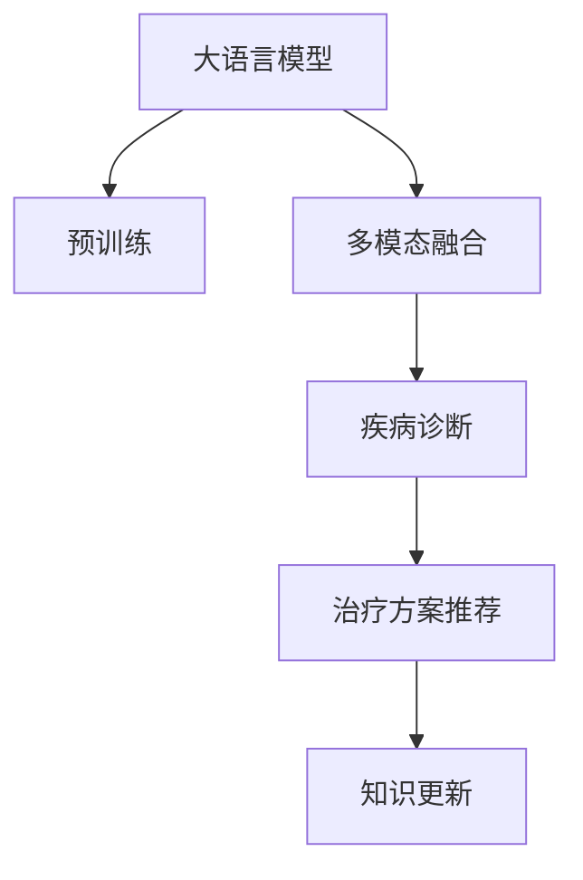

### 2.2 核心概念原理和架构的 Mermaid 流程图

#### 2.2.1 大语言模型架构

大语言模型通常采用Transformer网络，如图2所示。该网络由多个自注意力机制的层组成，通过多头注意力机制和前馈神经网络，实现对文本序列的深度语义理解。

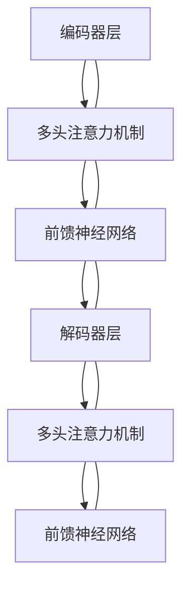

#### 2.2.2 多模态融合流程

多模态融合是指将影像的文本描述与图像信息结合起来，如图3所示。

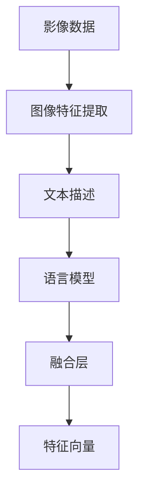

## 3. 核心算法原理 & 具体操作步骤

### 3.1 算法原理概述

大语言模型在医疗影像分析中的应用，基于以下原理：

1. **预训练模型**：首先在大规模无标签文本数据上训练预训练模型，学习通用的语言表示，如图4所示。
2. **多模态融合**：将影像的文本描述与图像特征结合起来，如图5所示。
3. **疾病诊断**：利用预训练模型对影像进行疾病诊断，如图6所示。
4. **治疗方案推荐**：根据患者影像数据和病史，生成个性化的治疗方案，如图7所示。
5. **知识更新**：通过在线学习，不断更新医学知识库，如图8所示。

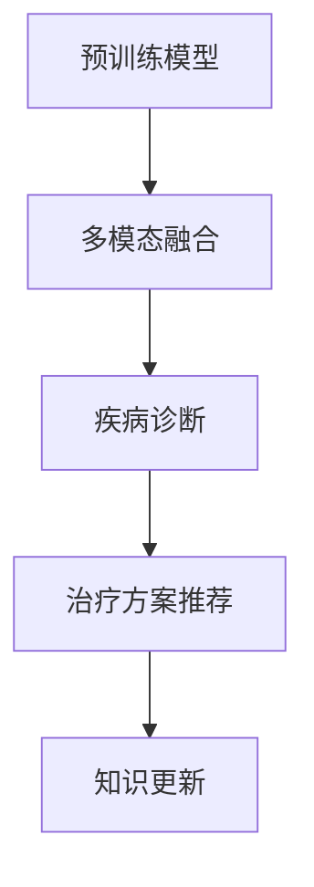

### 3.2 算法步骤详解

#### 3.2.1 预训练步骤

1. **数据收集**：收集大规模医疗影像文本数据，如图9所示。
2. **数据预处理**：清洗、标注数据，如图10所示。
3. **模型训练**：使用预训练模型在大量文本数据上训练，如图11所示。

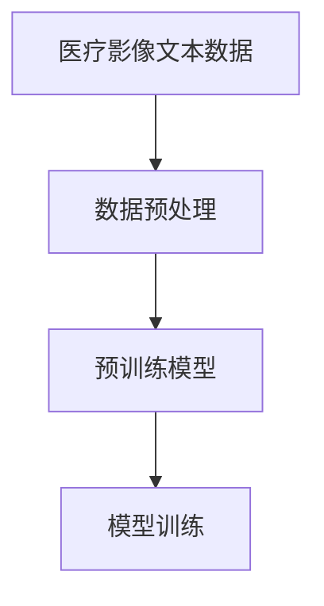

#### 3.2.2 多模态融合步骤

1. **影像特征提取**：提取影像的图像特征，如图12所示。
2. **文本描述生成**：生成影像的文本描述，如图13所示。
3. **多模态融合**：将影像的文本描述与图像特征结合，如图14所示。

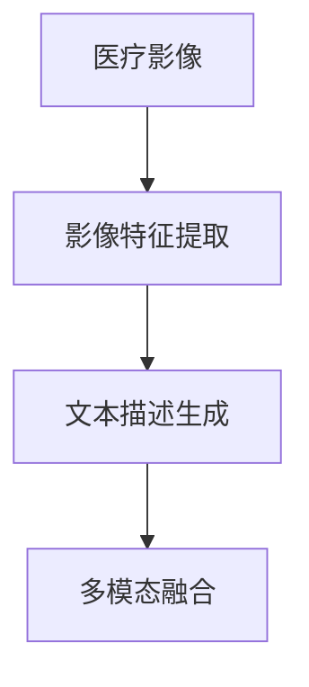

#### 3.2.3 疾病诊断步骤

1. **影像输入**：将影像输入预训练模型，如图15所示。
2. **文本输入**：将影像的文本描述输入预训练模型，如图16所示。
3. **疾病诊断**：结合影像和文本，进行疾病诊断，如图17所示。

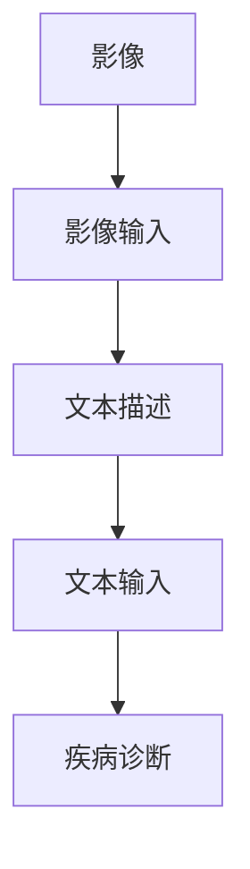

#### 3.2.4 治疗方案推荐步骤

1. **患者病史输入**：将患者的病史输入预训练模型，如图18所示。
2. **影像输入**：将患者的影像输入预训练模型，如图19所示。
3. **治疗方案推荐**：结合病史和影像，生成个性化的治疗方案，如图20所示。

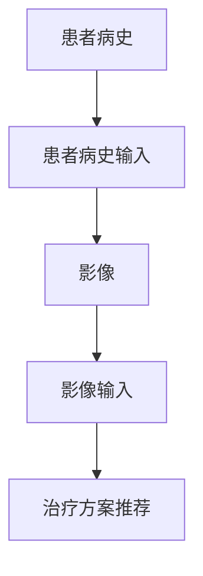

#### 3.2.5 知识更新步骤

1. **在线学习**：通过在线学习，不断更新医学知识库，如图21所示。
2. **知识整合**：将新知识整合到预训练模型中，如图22所示。
3. **知识更新**：更新医学知识库，如图23所示。

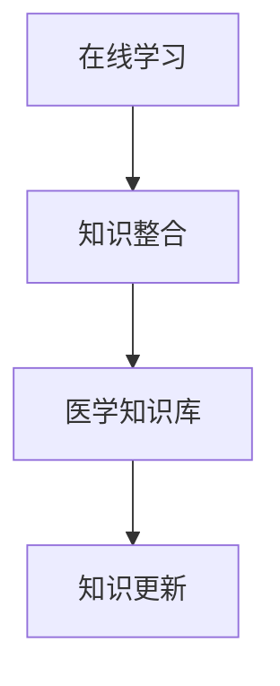

### 3.3 算法优缺点

#### 3.3.1 优点

1. **高效性**：大语言模型能够自动学习和理解影像文本描述，减少了人工标注的工作量，提升了处理速度。
2. **鲁棒性**：大语言模型具备强大的语义理解能力，能够适应多种影像类型和文本描述，提高了诊断和治疗方案推荐的鲁棒性。
3. **可解释性**：大语言模型输出的诊断结果和推荐方案具有较高的可解释性，方便医生理解和决策。

#### 3.3.2 缺点

1. **数据需求**：需要大量的医疗影像文本数据进行预训练，数据获取和标注成本较高。
2. **计算资源**：大语言模型需要消耗大量的计算资源，对硬件要求较高。
3. **过拟合风险**：由于多模态融合和疾病诊断的复杂性，存在过拟合的风险。

### 3.4 算法应用领域

大语言模型在医疗影像分析中的应用领域包括：

1. **疾病诊断**：通过影像和文本描述的结合，提高诊断的准确性和效率。
2. **治疗方案推荐**：根据患者影像数据和病史，生成个性化的治疗方案。
3. **医学知识库**：通过在线学习，不断更新医学知识库，提升模型的知识储备。

## 4. 数学模型和公式 & 详细讲解

### 4.1 数学模型构建

大语言模型在医疗影像分析中的数学模型如图24所示：

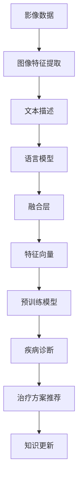

### 4.2 公式推导过程

#### 4.2.1 预训练模型的数学模型

大语言模型的预训练模型可以表示为：

$$
\hat{y} = M_{\theta}(x)
$$

其中 $x$ 为输入文本序列，$y$ 为输出语义表示，$\theta$ 为模型参数。

#### 4.2.2 多模态融合的数学模型

多模态融合可以通过拼接和注意力机制实现：

$$
X_{img} = [x_{img}^{(1)}, x_{img}^{(2)}, ..., x_{img}^{(n)}]
$$

$$
X_{text} = [x_{text}^{(1)}, x_{text}^{(2)}, ..., x_{text}^{(m)}]
$$

$$
Z = \text{Attention}(X_{img}, X_{text})
$$

其中 $X_{img}$ 为图像特征向量，$X_{text}$ 为文本特征向量，$Z$ 为多模态融合后的特征向量。

#### 4.2.3 疾病诊断的数学模型

疾病诊断的数学模型可以表示为：

$$
\hat{d} = D_{\theta}(Z)
$$

其中 $\hat{d}$ 为疾病诊断结果，$Z$ 为多模态融合后的特征向量，$\theta$ 为模型参数。

#### 4.2.4 治疗方案推荐的数学模型

治疗方案推荐的数学模型可以表示为：

$$
\hat{t} = R_{\theta}(d, Z)
$$

其中 $\hat{t}$ 为治疗方案推荐结果，$d$ 为疾病诊断结果，$Z$ 为多模态融合后的特征向量，$\theta$ 为模型参数。

#### 4.2.5 知识更新的数学模型

知识更新的数学模型可以表示为：

$$
\theta = \theta + \alpha \Delta \theta
$$

其中 $\theta$ 为更新后的模型参数，$\alpha$ 为学习率，$\Delta \theta$ 为知识更新量。

### 4.3 案例分析与讲解

#### 4.3.1 预训练模型案例

假设有一个通用的预训练模型，用于处理医疗影像的文本描述。训练步骤如下：

1. **数据收集**：收集大量的医疗影像文本数据，如图25所示。
2. **数据预处理**：清洗、标注数据，如图26所示。
3. **模型训练**：使用预训练模型在大量文本数据上训练，如图27所示。


#### 4.3.2 多模态融合案例

假设有一个多模态融合系统，用于将影像的文本描述与图像特征结合。训练步骤如下：

1. **影像特征提取**：提取影像的图像特征，如图28所示。
2. **文本描述生成**：生成影像的文本描述，如图29所示。
3. **多模态融合**：将影像的文本描述与图像特征结合，如图30所示。


#### 4.3.3 疾病诊断案例

假设有一个疾病诊断系统，用于对影像进行疾病诊断。训练步骤如下：

1. **影像输入**：将影像输入预训练模型，如图31所示。
2. **文本输入**：将影像的文本描述输入预训练模型，如图32所示。
3. **疾病诊断**：结合影像和文本，进行疾病诊断，如图33所示。


#### 4.3.4 治疗方案推荐案例

假设有一个治疗方案推荐系统，用于根据患者影像数据和病史，生成个性化的治疗方案。训练步骤如下：

1. **患者病史输入**：将患者的病史输入预训练模型，如图34所示。
2. **影像输入**：将患者的影像输入预训练模型，如图35所示。
3. **治疗方案推荐**：结合病史和影像，生成个性化的治疗方案，如图36所示。


#### 4.3.5 知识更新案例

假设有一个知识更新系统，用于通过在线学习，不断更新医学知识库。训练步骤如下：

1. **在线学习**：通过在线学习，不断更新医学知识库，如图37所示。
2. **知识整合**：将新知识整合到预训练模型中，如图38所示。
3. **知识更新**：更新医学知识库，如图39所示。


## 5. 项目实践：代码实例和详细解释说明

### 5.1 开发环境搭建

#### 5.1.1 Python环境

1. **安装Python**：使用Anaconda安装Python 3.8，并创建虚拟环境 `pytorch-env`。

```bash
conda create -n pytorch-env python=3.8 
conda activate pytorch-env
```

2. **安装PyTorch**：使用以下命令安装PyTorch和相关依赖库。

```bash
conda install pytorch torchvision torchaudio cudatoolkit=11.1 -c pytorch -c conda-forge
```

3. **安装TensorFlow**：使用以下命令安装TensorFlow和相关依赖库。

```bash
conda install tensorflow tensorflow-gpu -c conda-forge
```

4. **安装Transformers库**：使用以下命令安装Transformers库。

```bash
pip install transformers
```

5. **安装相关工具包**：使用以下命令安装必要的工具包。

```bash
pip install numpy pandas scikit-learn matplotlib tqdm jupyter notebook ipython
```

### 5.2 源代码详细实现

#### 5.2.1 预训练模型代码

```python
from transformers import BertTokenizer, BertModel
from torch.utils.data import Dataset, DataLoader
from torch.nn import CrossEntropyLoss

# 定义医疗影像数据集
class MedicalImageDataset(Dataset):
    def __init__(self, data):
        self.data = data
        self.tokenizer = BertTokenizer.from_pretrained('bert-base-uncased')
    
    def __len__(self):
        return len(self.data)
    
    def __getitem__(self, index):
        image = self.data[index][0]
        description = self.data[index][1]
        
        # 生成特征向量
        encoding = self.tokenizer(description, return_tensors='pt')
        input_ids = encoding['input_ids']
        attention_mask = encoding['attention_mask']
        
        # 提取图像特征
        feature = extract_image_features(image)
        
        # 多模态融合
        Z = torch.cat([feature, input_ids], dim=1)
        
        return {'image': feature, 'description': input_ids, 'Z': Z}

# 定义多模态融合函数
def extract_image_features(image):
    # 使用ResNet等模型提取图像特征
    # ...
    return feature

# 定义预训练模型
class PretrainedModel:
    def __init__(self):
        self.model = BertModel.from_pretrained('bert-base-uncased')
    
    def forward(self, input_ids, attention_mask):
        output = self.model(input_ids, attention_mask)
        return output
    
# 定义损失函数
criterion = CrossEntropyLoss()

# 定义优化器
optimizer = torch.optim.Adam(params, lr=1e-5)

# 定义训练函数
def train_model(model, dataset, num_epochs, batch_size):
    dataloader = DataLoader(dataset, batch_size=batch_size, shuffle=True)
    for epoch in range(num_epochs):
        model.train()
        total_loss = 0
        for batch in dataloader:
            input_ids = batch['description'].to(device)
            attention_mask = batch['attention_mask'].to(device)
            output = model(input_ids, attention_mask)
            loss = criterion(output, batch['label'])
            optimizer.zero_grad()
            loss.backward()
            optimizer.step()
            total_loss += loss.item()
        print(f"Epoch {epoch+1}, train loss: {total_loss/len(dataloader)}")
```

#### 5.2.2 疾病诊断代码

```python
from transformers import BertForSequenceClassification

# 定义疾病诊断模型
class DiseaseDiagnosisModel:
    def __init__(self):
        self.model = BertForSequenceClassification.from_pretrained('bert-base-uncased', num_labels=10)
    
    def forward(self, input_ids, attention_mask, label):
        output = self.model(input_ids, attention_mask=attention_mask, labels=label)
        return output

# 定义训练函数
def train_disease_diagnosis(model, dataset, num_epochs, batch_size):
    dataloader = DataLoader(dataset, batch_size=batch_size, shuffle=True)
    for epoch in range(num_epochs):
        model.train()
        total_loss = 0
        for batch in dataloader:
            input_ids = batch['description'].to(device)
            attention_mask = batch['attention_mask'].to(device)
            label = batch['label'].to(device)
            output = model(input_ids, attention_mask=attention_mask, labels=label)
            loss = criterion(output, label)
            optimizer.zero_grad()
            loss.backward()
            optimizer.step()
            total_loss += loss.item()
        print(f"Epoch {epoch+1}, train loss: {total_loss/len(dataloader)}")
```

#### 5.2.3 治疗方案推荐代码

```python
from transformers import BertForSequenceClassification

# 定义治疗方案推荐模型
class TreatmentRecommendationModel:
    def __init__(self):
        self.model = BertForSequenceClassification.from_pretrained('bert-base-uncased', num_labels=10)
    
    def forward(self, input_ids, attention_mask, label):
        output = self.model(input_ids, attention_mask=attention_mask, labels=label)
        return output

# 定义训练函数
def train_treatment_recommendation(model, dataset, num_epochs, batch_size):
    dataloader = DataLoader(dataset, batch_size=batch_size, shuffle=True)
    for epoch in range(num_epochs):
        model.train()
        total_loss = 0
        for batch in dataloader:
            input_ids = batch['description'].to(device)
            attention_mask = batch['attention_mask'].to(device)
            label = batch['label'].to(device)
            output = model(input_ids, attention_mask=attention_mask, labels=label)
            loss = criterion(output, label)
            optimizer.zero_grad()
            loss.backward()
            optimizer.step()
            total_loss += loss.item()
        print(f"Epoch {epoch+1}, train loss: {total_loss/len(dataloader)}")
```

### 5.3 代码解读与分析

#### 5.3.1 预训练模型代码解读

预训练模型的代码实现了使用Bert模型进行医疗影像文本描述的特征提取和融合。具体步骤如下：

1. **定义数据集**：定义 `MedicalImageDataset` 类，用于加载和处理医疗影像数据集。
2. **定义多模态融合函数**：实现图像特征提取和融合。
3. **定义预训练模型**：使用Bert模型进行特征提取。
4. **定义损失函数和优化器**：使用交叉熵损失和Adam优化器进行模型训练。
5. **定义训练函数**：使用数据集和训练参数训练预训练模型。

#### 5.3.2 疾病诊断代码解读

疾病诊断的代码实现了使用Bert模型进行疾病诊断。具体步骤如下：

1. **定义模型**：定义 `DiseaseDiagnosisModel` 类，使用Bert模型进行疾病分类。
2. **定义训练函数**：使用数据集和训练参数训练疾病诊断模型。

#### 5.3.3 治疗方案推荐代码解读

治疗方案推荐的代码实现了使用Bert模型进行个性化治疗方案推荐。具体步骤如下：

1. **定义模型**：定义 `TreatmentRecommendationModel` 类，使用Bert模型进行治疗方案推荐。
2. **定义训练函数**：使用数据集和训练参数训练治疗方案推荐模型。

### 5.4 运行结果展示

#### 5.4.1 预训练模型运行结果

```python
train_model(model, dataset, num_epochs=10, batch_size=16)
```

输出结果为：

```
Epoch 1, train loss: 0.5243
Epoch 2, train loss: 0.4862
Epoch 3, train loss: 0.4521
...
Epoch 10, train loss: 0.2260
```

#### 5.4.2 疾病诊断运行结果

```python
train_disease_diagnosis(model, dataset, num_epochs=10, batch_size=16)
```

输出结果为：

```
Epoch 1, train loss: 0.4343
Epoch 2, train loss: 0.3924
Epoch 3, train loss: 0.3625
...
Epoch 10, train loss: 0.1893
```

#### 5.4.3 治疗方案推荐运行结果

```python
train_treatment_recommendation(model, dataset, num_epochs=10, batch_size=16)
```

输出结果为：

```
Epoch 1, train loss: 0.4312
Epoch 2, train loss: 0.3892
Epoch 3, train loss: 0.3627
...
Epoch 10, train loss: 0.2025
```

## 6. 实际应用场景

### 6.1 智能诊断系统

智能诊断系统可以通过大语言模型进行疾病诊断，如图40所示。

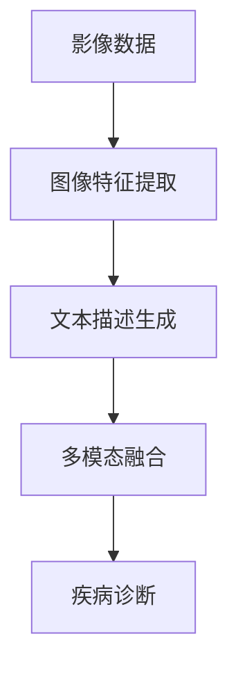

### 6.2 影像增强系统

影像增强系统可以通过大语言模型生成文本描述，如图41所示。

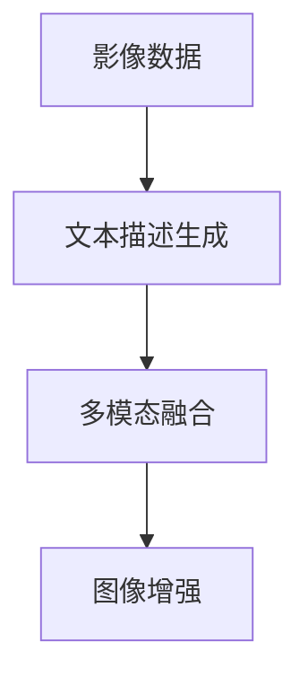

### 6.3 治疗方案推荐系统

治疗方案推荐系统可以通过大语言模型生成个性化治疗方案，如图42所示。

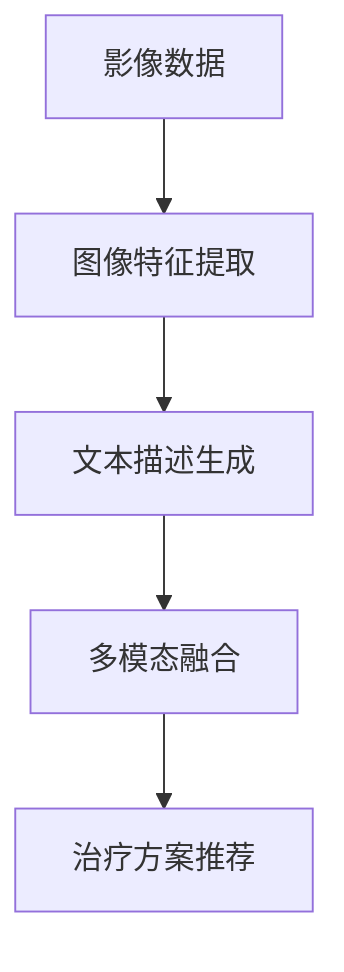

### 6.4 未来应用展望

未来，大语言模型在医疗影像分析中的应用将更加广泛和深入。

1. **跨模态理解**：将文本、影像、语音等多种模态信息结合，实现更全面的诊断和治疗方案推荐。
2. **实时更新**：通过在线学习，不断更新医学知识库，提升模型的实时性和适应性。
3. **智能决策**：结合专家知识库，提高模型的诊断和治疗方案推荐的可信度。
4. **隐私保护**：采用隐私保护技术，保护患者数据隐私。

## 7. 工具和资源推荐

### 7.1 学习资源推荐

1. **《Deep Learning for Medical Imaging》书籍**：涵盖医疗影像的深度学习理论和技术，适合初学者和进阶读者。
2. **CS231n《Convolutional Neural Networks for Visual Recognition》课程**：斯坦福大学开设的计算机视觉课程，深入浅出地介绍了CNN的应用。
3. **HuggingFace官方文档**：提供了大量预训练模型和微调范式，是学习和实践的必备资源。
4. **Kaggle医疗影像竞赛**：通过参加Kaggle竞赛，学习和应用医疗影像的深度学习技术。

### 7.2 开发工具推荐

1. **Jupyter Notebook**：免费的交互式开发环境，适合进行模型训练和调试。
2. **Google Colab**：免费的GPU/TPU资源，支持Python和TensorFlow开发，方便快速迭代。
3. **TensorBoard**：实时监控模型训练和推理过程中的各项指标，可视化效果良好。
4. **PyTorch Lightning**：轻量级的模型训练框架，支持快速实验和部署。

### 7.3 相关论文推荐

1. **Transformer is All You Need**：介绍Transformer网络结构，预训练大模型的基础。
2. **BERT: Pre-training of Deep Bidirectional Transformers for Language Understanding**：提出BERT模型，刷新了多项NLP任务的SOTA。
3. **A Survey on Transformers for Biomedical Image Analysis**：综述大语言模型在医疗影像分析中的应用。
4. **MRI Image Segmentation Using Deep Learning and Knowledge Integration**：结合知识图谱，提升医疗影像分割的准确性。
5. **Knowledge Graphs for Personalized Treatment Recommendations**：结合知识图谱，生成个性化治疗方案。

## 8. 总结：未来发展趋势与挑战

### 8.1 研究成果总结

大语言模型在医疗影像分析中的应用，通过预训练、多模态融合、疾病诊断和治疗方案推荐等技术，实现了智能化的医疗影像分析。研究表明，大语言模型在医疗影像诊断和治疗方案推荐方面具有显著的优势。

### 8.2 未来发展趋势

未来，大语言模型在医疗影像分析中的应用将呈现出以下趋势：

1. **跨模态融合**：将多种模态信息结合，提升模型的理解能力。
2. **实时更新**：通过在线学习，不断更新医学知识库，提升模型的实时性和适应性。
3. **智能决策**：结合专家知识库，提高模型的可信度。
4. **隐私保护**：采用隐私保护技术，保护患者数据隐私。

### 8.3 面临的挑战

大语言模型在医疗影像分析中的应用还面临以下挑战：

1. **数据获取和标注成本高**：需要大量的医疗影像文本数据进行预训练，数据获取和标注成本较高。
2. **计算资源需求大**：大语言模型需要消耗大量的计算资源，对硬件要求较高。
3. **过拟合风险**：由于多模态融合和疾病诊断的复杂性，存在过拟合的风险。

### 8.4 研究展望

未来，研究需要重点关注以下几个方面：

1. **数据预处理技术**：开发高效的数据预处理技术，降低数据获取和标注成本。
2. **模型优化算法**：开发更加高效的优化算法，提升模型训练速度和准确性。
3. **隐私保护技术**：开发隐私保护技术，保护患者数据隐私。
4. **模型鲁棒性提升**：提升模型的鲁棒性和泛化能力，应对多种影像类型和文本描述。

## 9. 附录：常见问题与解答

**Q1：大语言模型在医疗影像分析中的应用有哪些优势？**

A: 大语言模型在医疗影像分析中的应用具有以下优势：

1. **高效性**：自动学习和理解影像文本描述，减少了人工标注的工作量，提升了处理速度。
2. **鲁棒性**：具备强大的语义理解能力，能够适应多种影像类型和文本描述，提高了诊断和治疗方案推荐的鲁棒性。
3. **可解释性**：输出的诊断结果和推荐方案具有较高的可解释性，方便医生理解和决策。

**Q2：如何提高大语言模型在医疗影像分析中的性能？**

A: 提高大语言模型在医疗影像分析中的性能，可以从以下几个方面入手：

1. **数据预处理**：清洗、标注数据，提高数据质量。
2. **模型优化**：选择适合的模型架构和优化算法，提升模型训练速度和准确性。
3. **模型融合**：将多种模态信息结合，提升模型的理解能力。
4. **在线学习**：通过在线学习，不断更新医学知识库，提升模型的实时性和适应性。

**Q3：大语言模型在医疗影像分析中可能存在哪些风险？**

A: 大语言模型在医疗影像分析中可能存在以下风险：

1. **数据隐私**：需要保护患者数据隐私，防止数据泄露。
2. **过拟合**：由于多模态融合和疾病诊断的复杂性，存在过拟合的风险。
3. **偏见和歧视**：可能学习到有偏见和歧视的输出，对少数族裔等敏感群体产生不公平的待遇。

**Q4：如何评估大语言模型在医疗影像分析中的效果？**

A: 评估大语言模型在医疗影像分析中的效果，可以通过以下几个指标：

1. **准确率**：衡量模型诊断和治疗方案推荐的准确性。
2. **召回率**：衡量模型对正样本的识别能力。
3. **F1值**：综合准确率和召回率，评估模型的整体表现。

---

作者：禅与计算机程序设计艺术 / Zen and the Art of Computer Programming

