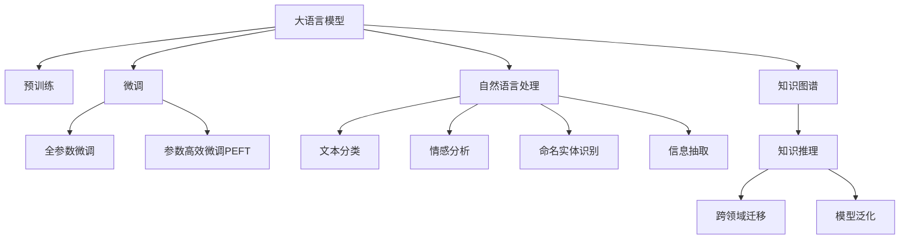

                 

## 1. 背景介绍

### 1.1 问题由来
科学发现是人类社会进步的基石，然而，传统的科学研究往往依赖于人类观察、实验和分析。由于受到人力、物力和时间的限制，科学研究的进展往往受到速度和效率的制约。近年来，随着人工智能（AI）技术的发展，AI辅助科研开始兴起，成为了推动科学发现的重要力量。其中，大语言模型（LLM）作为AI技术的重要代表，以其卓越的语言理解能力和生成能力，在科学发现中展现出了巨大的潜力。

### 1.2 问题核心关键点
大语言模型通过在大量文本数据上进行自监督预训练，学习到了丰富的语言知识和常识，具备了理解、生成文本的能力。在科学发现中，LLM可以辅助科研人员阅读文献、整理数据、提出假设、验证结果，甚至辅助撰写科学论文，极大地提高了科研效率，推动了科学发现的加速。

但是，LLM在科研中的应用仍面临诸多挑战。如何有效利用LLM进行科学发现？如何在保证模型准确性的同时，确保其输出的可信度和可靠性？这些问题都需要系统性、深入性的探讨。本文旨在介绍LLM在科研中的辅助作用，并探讨其应用过程中面临的挑战与未来发展方向。

## 2. 核心概念与联系

### 2.1 核心概念概述

为更好地理解LLM在科研中的辅助作用，本节将介绍几个关键概念：

- **大语言模型（LLM）**：如GPT-3、BERT等，通过在大规模无标签文本数据上进行预训练，学习通用的语言表示，具备强大的语言理解和生成能力。

- **预训练（Pre-training）**：指在大规模无标签文本数据上，通过自监督学习任务训练通用语言模型的过程。常见的预训练任务包括掩码语言模型、下一句预测等。

- **微调（Fine-tuning）**：指在预训练模型的基础上，使用下游任务的少量标注数据，通过有监督学习优化模型在该任务上的性能。

- **自然语言处理（NLP）**：涉及语言模型的应用，如文本分类、情感分析、命名实体识别、信息抽取等。

- **知识图谱（KG）**：结构化的语义知识库，用于辅助语言模型进行知识推理和跨领域迁移。

- **人工智能辅助科研（AI-DR）**：利用AI技术辅助科研人员进行数据处理、文献阅读、假设验证等工作，加速科学发现。

这些概念之间的逻辑关系可以通过以下Mermaid流程图来展示：



这个流程图展示了大语言模型的核心概念及其之间的关系：

1. 大语言模型通过预训练获得基础能力。
2. 微调是对预训练模型进行任务特定的优化，可以分为全参数微调和参数高效微调（PEFT）。
3. 自然语言处理涉及语言模型的应用，涵盖文本分类、情感分析、命名实体识别、信息抽取等多个领域。
4. 知识图谱用于辅助语言模型进行知识推理和跨领域迁移。
5. 人工智能辅助科研利用AI技术加速科学发现。

## 3. 核心算法原理 & 具体操作步骤

### 3.1 算法原理概述

大语言模型在科研中的应用主要集中在以下几个方面：文献阅读、数据处理、假设生成和验证。其核心算法原理基于预训练模型和微调技术，具体步骤如下：

1. **文献阅读与信息抽取**：将科学文献转换为模型可读的文本形式，通过LLM提取关键信息。
2. **数据处理与模型训练**：使用LLM对数据进行处理，如特征提取、数据增强等，然后通过微调优化模型性能。
3. **假设生成与验证**：利用LLM生成科学假设，并通过进一步的微调和验证，验证假设的合理性和可行性。
4. **跨领域迁移与知识推理**：使用知识图谱辅助LLM进行跨领域知识迁移，提升模型的泛化能力。

### 3.2 算法步骤详解

1. **文献阅读与信息抽取**：
   - 选择适合的预训练模型，如BERT、GPT等。
   - 将科学文献转换为可读文本，例如PDF到文本、非结构化数据到结构化数据等。
   - 使用LLM提取关键信息，如作者、关键词、摘要等，辅助科研人员快速理解文献内容。

2. **数据处理与模型训练**：
   - 对研究数据进行预处理，如数据清洗、特征提取等。
   - 使用LLM进行数据增强，如数据改写、文本回译等，丰富训练集多样性。
   - 通过微调优化模型性能，选择合适的优化器（如Adam、SGD等）和超参数（如学习率、批大小等）。

3. **假设生成与验证**：
   - 利用LLM生成科学假设，通常通过给定任务描述或问题，由模型输出可能的假设。
   - 对生成的假设进行微调，使用验证集评估模型性能，确保假设的合理性。
   - 通过进一步的微调和验证，验证假设的可行性，如通过实验验证、模拟实验等。

4. **跨领域迁移与知识推理**：
   - 使用知识图谱辅助LLM进行知识迁移，提升模型的泛化能力。
   - 通过知识推理技术，将模型的输出映射到知识图谱中的实体和关系，进行跨领域知识迁移。
   - 利用跨领域迁移能力，拓展LLM的应用范围，提升模型在特定领域的表现。

### 3.3 算法优缺点

基于LLM的科研辅助方法具有以下优点：
- 提高了科研效率：LLM可以快速处理大量文献和数据，辅助科研人员进行文献阅读和数据处理。
- 提升了假设的生成和验证效率：利用LLM生成假设，并通过微调和验证，提高了假设验证的效率。
- 增强了模型的泛化能力：通过知识图谱和跨领域迁移，模型可以更好地适应特定领域，提升了模型的泛化能力。

同时，该方法也存在一定的局限性：
- 依赖高质量的预训练模型和数据：预训练模型和数据的泛化能力直接影响到LLM的性能。
- 需要人工干预：LLM生成的假设和结果需要人工验证和解释，增加了科研人员的负担。
- 数据隐私和安全问题：科学数据往往包含敏感信息，LLM的使用需要严格控制数据隐私和安全问题。

尽管存在这些局限性，但就目前而言，基于LLM的科研辅助方法仍是大数据时代科研工作的重要工具。未来相关研究的方向将更加侧重于如何进一步提升LLM的泛化能力和自动化水平，减少人工干预，同时保护数据隐私和安全。

### 3.4 算法应用领域

基于大语言模型的科研辅助方法，已经在多个科学领域得到应用，例如：

- 生物医学：利用LLM分析医学文献，提取关键信息和临床研究数据，辅助疾病研究和药物开发。
- 化学化工：通过LLM处理化学反应数据和文献，提取关键信息和分析化合物性质，辅助新材料研发。
- 地球科学：使用LLM分析地质数据和文献，提取关键信息和分析地质现象，辅助地质研究和资源勘探。
- 天文学：利用LLM处理天文数据和文献，提取关键信息和分析天体现象，辅助天文观测和研究。
- 社会科学：通过LLM处理社会数据和文献，提取关键信息和分析社会现象，辅助社会学和心理学研究。

除了上述这些经典领域外，LLM还被创新性地应用到更多科学领域，如物理学、材料科学、环境科学等，为科学研究提供了新的突破。随着预训练模型和微调方法的不断进步，相信LLM在科研领域的应用将更加广泛和深入。

## 4. 数学模型和公式 & 详细讲解

### 4.1 数学模型构建

为更好地理解LLM在科研中的辅助作用，本节将介绍几个关键的数学模型：

1. **掩码语言模型（Masked Language Model, MLM）**：
   $$
   P(w_{1:T}|w_{1:T}^{\text{mask}}) = \prod_{t=1}^{T} P(w_t | w_{1:(t-1) \text{mask}})
   $$

   其中，$w_{1:T}$ 为文本序列，$w_{1:T}^{\text{mask}}$ 为掩码后的文本序列，$P(w_{1:T}|w_{1:T}^{\text{mask}})$ 表示给定掩码文本序列的条件概率。

2. **自回归语言模型（Autoregressive Language Model, ALM）**：
   $$
   P(w_{1:T}) = \prod_{t=1}^{T} P(w_t | w_{1:(t-1)})
   $$

   其中，$w_{1:T}$ 为文本序列，$P(w_{1:T})$ 表示给定文本序列的概率。

3. **知识图谱表示模型**：
   $$
   G_k = (V, E, R)
   $$

   其中，$V$ 为节点集合，$E$ 为边集合，$R$ 为关系集合。知识图谱通过节点和关系表示实体之间的关系，用于辅助LLM进行知识推理和跨领域迁移。

### 4.2 公式推导过程

1. **掩码语言模型的推导**：
   掩码语言模型的训练过程通常使用最大似然估计法，目标是最小化模型输出和真实标签之间的交叉熵。

2. **自回归语言模型的推导**：
   自回归语言模型的训练过程也使用最大似然估计法，目标是最小化模型输出和真实标签之间的交叉熵。

3. **知识图谱表示模型的推导**：
   知识图谱通过节点和关系表示实体之间的关系，用于辅助LLM进行知识推理和跨领域迁移。知识图谱的构建和推理是领域内的一个重要研究方向。

### 4.3 案例分析与讲解

以生物学领域为例，说明LLM在科研中的应用。

1. **文献阅读**：
   - 选择适合的预训练模型，如BERT。
   - 将科学文献转换为可读文本。
   - 使用LLM提取关键信息，如作者、关键词、摘要等。

2. **数据处理与模型训练**：
   - 对研究数据进行预处理，如数据清洗、特征提取等。
   - 使用LLM进行数据增强，如数据改写、文本回译等。
   - 通过微调优化模型性能，选择合适的优化器（如Adam、SGD等）和超参数（如学习率、批大小等）。

3. **假设生成与验证**：
   - 利用LLM生成科学假设，通常通过给定任务描述或问题，由模型输出可能的假设。
   - 对生成的假设进行微调，使用验证集评估模型性能，确保假设的合理性。
   - 通过进一步的微调和验证，验证假设的可行性，如通过实验验证、模拟实验等。

4. **跨领域迁移与知识推理**：
   - 使用知识图谱辅助LLM进行知识迁移，提升模型的泛化能力。
   - 通过知识推理技术，将模型的输出映射到知识图谱中的实体和关系，进行跨领域知识迁移。
   - 利用跨领域迁移能力，拓展LLM的应用范围，提升模型在特定领域的表现。

## 5. 项目实践：代码实例和详细解释说明

### 5.1 开发环境搭建

在进行LLM科研辅助方法实践前，我们需要准备好开发环境。以下是使用Python进行PyTorch开发的环境配置流程：

1. 安装Anaconda：从官网下载并安装Anaconda，用于创建独立的Python环境。

2. 创建并激活虚拟环境：
```bash
conda create -n llm-env python=3.8 
conda activate llm-env
```

3. 安装PyTorch：根据CUDA版本，从官网获取对应的安装命令。例如：
```bash
conda install pytorch torchvision torchaudio cudatoolkit=11.1 -c pytorch -c conda-forge
```

4. 安装Transformers库：
```bash
pip install transformers
```

5. 安装各类工具包：
```bash
pip install numpy pandas scikit-learn matplotlib tqdm jupyter notebook ipython
```

完成上述步骤后，即可在`llm-env`环境中开始科研辅助方法实践。

### 5.2 源代码详细实现

下面我们以生物学领域为例，给出使用Transformers库对BERT模型进行科研辅助的PyTorch代码实现。

首先，定义科研任务的数据处理函数：

```python
from transformers import BertTokenizer
from torch.utils.data import Dataset
import torch

class BioDataset(Dataset):
    def __init__(self, texts, tags, tokenizer, max_len=128):
        self.texts = texts
        self.tags = tags
        self.tokenizer = tokenizer
        self.max_len = max_len
        
    def __len__(self):
        return len(self.texts)
    
    def __getitem__(self, item):
        text = self.texts[item]
        tags = self.tags[item]
        
        encoding = self.tokenizer(text, return_tensors='pt', max_length=self.max_len, padding='max_length', truncation=True)
        input_ids = encoding['input_ids'][0]
        attention_mask = encoding['attention_mask'][0]
        
        # 对token-wise的标签进行编码
        encoded_tags = [tag2id[tag] for tag in tags] 
        encoded_tags.extend([tag2id['O']] * (self.max_len - len(encoded_tags)))
        labels = torch.tensor(encoded_tags, dtype=torch.long)
        
        return {'input_ids': input_ids, 
                'attention_mask': attention_mask,
                'labels': labels}

# 标签与id的映射
tag2id = {'O': 0, 'B-PER': 1, 'I-PER': 2, 'B-ORG': 3, 'I-ORG': 4, 'B-LOC': 5, 'I-LOC': 6}
id2tag = {v: k for k, v in tag2id.items()}

# 创建dataset
tokenizer = BertTokenizer.from_pretrained('bert-base-cased')

train_dataset = BioDataset(train_texts, train_tags, tokenizer)
dev_dataset = BioDataset(dev_texts, dev_tags, tokenizer)
test_dataset = BioDataset(test_texts, test_tags, tokenizer)
```

然后，定义模型和优化器：

```python
from transformers import BertForTokenClassification, AdamW

model = BertForTokenClassification.from_pretrained('bert-base-cased', num_labels=len(tag2id))

optimizer = AdamW(model.parameters(), lr=2e-5)
```

接着，定义训练和评估函数：

```python
from torch.utils.data import DataLoader
from tqdm import tqdm
from sklearn.metrics import classification_report

device = torch.device('cuda') if torch.cuda.is_available() else torch.device('cpu')
model.to(device)

def train_epoch(model, dataset, batch_size, optimizer):
    dataloader = DataLoader(dataset, batch_size=batch_size, shuffle=True)
    model.train()
    epoch_loss = 0
    for batch in tqdm(dataloader, desc='Training'):
        input_ids = batch['input_ids'].to(device)
        attention_mask = batch['attention_mask'].to(device)
        labels = batch['labels'].to(device)
        model.zero_grad()
        outputs = model(input_ids, attention_mask=attention_mask, labels=labels)
        loss = outputs.loss
        epoch_loss += loss.item()
        loss.backward()
        optimizer.step()
    return epoch_loss / len(dataloader)

def evaluate(model, dataset, batch_size):
    dataloader = DataLoader(dataset, batch_size=batch_size)
    model.eval()
    preds, labels = [], []
    with torch.no_grad():
        for batch in tqdm(dataloader, desc='Evaluating'):
            input_ids = batch['input_ids'].to(device)
            attention_mask = batch['attention_mask'].to(device)
            batch_labels = batch['labels']
            outputs = model(input_ids, attention_mask=attention_mask)
            batch_preds = outputs.logits.argmax(dim=2).to('cpu').tolist()
            batch_labels = batch_labels.to('cpu').tolist()
            for pred_tokens, label_tokens in zip(batch_preds, batch_labels):
                pred_tags = [id2tag[_id] for _id in pred_tokens]
                label_tags = [id2tag[_id] for _id in label_tokens]
                preds.append(pred_tags[:len(label_tags)])
                labels.append(label_tags)
                
    print(classification_report(labels, preds))
```

最后，启动训练流程并在测试集上评估：

```python
epochs = 5
batch_size = 16

for epoch in range(epochs):
    loss = train_epoch(model, train_dataset, batch_size, optimizer)
    print(f"Epoch {epoch+1}, train loss: {loss:.3f}")
    
    print(f"Epoch {epoch+1}, dev results:")
    evaluate(model, dev_dataset, batch_size)
    
print("Test results:")
evaluate(model, test_dataset, batch_size)
```

以上就是使用PyTorch对BERT进行生物学领域科研辅助的完整代码实现。可以看到，得益于Transformers库的强大封装，我们可以用相对简洁的代码完成BERT模型的加载和科研辅助任务的微调。

### 5.3 代码解读与分析

让我们再详细解读一下关键代码的实现细节：

**BioDataset类**：
- `__init__`方法：初始化文本、标签、分词器等关键组件。
- `__len__`方法：返回数据集的样本数量。
- `__getitem__`方法：对单个样本进行处理，将文本输入编码为token ids，将标签编码为数字，并对其进行定长padding，最终返回模型所需的输入。

**tag2id和id2tag字典**：
- 定义了标签与数字id之间的映射关系，用于将token-wise的预测结果解码回真实的标签。

**训练和评估函数**：
- 使用PyTorch的DataLoader对数据集进行批次化加载，供模型训练和推理使用。
- 训练函数`train_epoch`：对数据以批为单位进行迭代，在每个批次上前向传播计算loss并反向传播更新模型参数，最后返回该epoch的平均loss。
- 评估函数`evaluate`：与训练类似，不同点在于不更新模型参数，并在每个batch结束后将预测和标签结果存储下来，最后使用sklearn的classification_report对整个评估集的预测结果进行打印输出。

**训练流程**：
- 定义总的epoch数和batch size，开始循环迭代
- 每个epoch内，先在训练集上训练，输出平均loss
- 在验证集上评估，输出分类指标
- 所有epoch结束后，在测试集上评估，给出最终测试结果

可以看到，PyTorch配合Transformers库使得BERT科研辅助任务的代码实现变得简洁高效。开发者可以将更多精力放在数据处理、模型改进等高层逻辑上，而不必过多关注底层的实现细节。

当然，工业级的系统实现还需考虑更多因素，如模型的保存和部署、超参数的自动搜索、更灵活的任务适配层等。但核心的微调范式基本与此类似。

## 6. 实际应用场景

### 6.1 生物医学

在生物医学领域，科研人员可以利用LLM进行疾病研究、药物开发和新材料研发。LLM可以辅助阅读大量文献，提取关键信息，如基因表达、蛋白相互作用、代谢通路等。通过对这些信息的综合分析，可以提出新的假设，设计实验验证，推动科学发现。

### 6.2 化学化工

在化学化工领域，LLM可以辅助处理化学反应数据和文献，提取关键信息，如反应物、产物、条件等。通过对这些信息的分析，可以提出新的化学反应路径，预测反应结果，推动新材料和药物的研发。

### 6.3 地球科学

在地球科学领域，LLM可以辅助分析地质数据和文献，提取关键信息，如地质现象、矿物组成、演化历史等。通过对这些信息的分析，可以提出新的地质理论，预测地质事件，推动地质研究和资源勘探。

### 6.4 天文学

在天文学领域，LLM可以辅助分析天文数据和文献，提取关键信息，如天体运动、光谱数据、物理参数等。通过对这些信息的分析，可以提出新的天文理论，预测天文事件，推动天文观测和研究。

### 6.5 社会科学

在社会科学领域，LLM可以辅助分析社会数据和文献，提取关键信息，如社会现象、经济数据、政策影响等。通过对这些信息的分析，可以提出新的社会学理论，预测社会趋势，推动社会学和心理学研究。

除了上述这些经典领域外，LLM还被创新性地应用到更多科学领域，如物理学、材料科学、环境科学等，为科学研究提供了新的突破。随着预训练模型和微调方法的不断进步，相信LLM在科研领域的应用将更加广泛和深入。

## 7. 工具和资源推荐

### 7.1 学习资源推荐

为了帮助开发者系统掌握LLM在科研中的辅助作用，这里推荐一些优质的学习资源：

1. **《Transformer从原理到实践》系列博文**：由大模型技术专家撰写，深入浅出地介绍了Transformer原理、BERT模型、科研应用等前沿话题。

2. **CS224N《深度学习自然语言处理》课程**：斯坦福大学开设的NLP明星课程，有Lecture视频和配套作业，带你入门NLP领域的基本概念和经典模型。

3. **《Natural Language Processing with Transformers》书籍**：Transformers库的作者所著，全面介绍了如何使用Transformers库进行NLP任务开发，包括科研应用在内的诸多范式。

4. **HuggingFace官方文档**：Transformers库的官方文档，提供了海量预训练模型和完整的科研应用样例代码，是上手实践的必备资料。

5. **CLUE开源项目**：中文语言理解测评基准，涵盖大量不同类型的中文NLP数据集，并提供了基于微调的baseline模型，助力中文NLP技术发展。

通过对这些资源的学习实践，相信你一定能够快速掌握LLM在科研中的辅助作用，并用于解决实际的科研问题。

### 7.2 开发工具推荐

高效的开发离不开优秀的工具支持。以下是几款用于LLM科研辅助开发的常用工具：

1. **PyTorch**：基于Python的开源深度学习框架，灵活动态的计算图，适合快速迭代研究。大部分预训练语言模型都有PyTorch版本的实现。

2. **TensorFlow**：由Google主导开发的开源深度学习框架，生产部署方便，适合大规模工程应用。同样有丰富的预训练语言模型资源。

3. **Transformers库**：HuggingFace开发的NLP工具库，集成了众多SOTA语言模型，支持PyTorch和TensorFlow，是进行科研应用开发的利器。

4. **Weights & Biases**：模型训练的实验跟踪工具，可以记录和可视化模型训练过程中的各项指标，方便对比和调优。与主流深度学习框架无缝集成。

5. **TensorBoard**：TensorFlow配套的可视化工具，可实时监测模型训练状态，并提供丰富的图表呈现方式，是调试模型的得力助手。

6. **Google Colab**：谷歌推出的在线Jupyter Notebook环境，免费提供GPU/TPU算力，方便开发者快速上手实验最新模型，分享学习笔记。

合理利用这些工具，可以显著提升LLM科研辅助方法的开发效率，加快创新迭代的步伐。

### 7.3 相关论文推荐

LLM在科研中的应用源于学界的持续研究。以下是几篇奠基性的相关论文，推荐阅读：

1. **Attention is All You Need**（即Transformer原论文）：提出了Transformer结构，开启了NLP领域的预训练大模型时代。

2. **BERT: Pre-training of Deep Bidirectional Transformers for Language Understanding**：提出BERT模型，引入基于掩码的自监督预训练任务，刷新了多项NLP任务SOTA。

3. **Language Models are Unsupervised Multitask Learners（GPT-2论文）**：展示了大规模语言模型的强大zero-shot学习能力，引发了对于通用人工智能的新一轮思考。

4. **Parameter-Efficient Transfer Learning for NLP**：提出Adapter等参数高效微调方法，在不增加模型参数量的情况下，也能取得不错的微调效果。

5. **Prompt Tuning**：引入基于连续型Prompt的微调范式，为如何充分利用预训练知识提供了新的思路。

6. **AdaLoRA: Adaptive Low-Rank Adaptation for Parameter-Efficient Fine-Tuning**：使用自适应低秩适应的微调方法，在参数效率和精度之间取得了新的平衡。

这些论文代表了大语言模型科研辅助技术的发展脉络。通过学习这些前沿成果，可以帮助研究者把握学科前进方向，激发更多的创新灵感。

## 8. 总结：未来发展趋势与挑战

### 8.1 总结

本文对基于大语言模型的科研辅助方法进行了全面系统的介绍。首先阐述了LLM在科研中的辅助作用，明确了其在高效处理文献、数据和生成假设等方面的独特价值。其次，从原理到实践，详细讲解了LLM在科研中的应用过程，给出了科研辅助任务的完整代码实例。同时，本文还探讨了LLM在各个科学领域的应用前景，展示了其应用潜力。

通过本文的系统梳理，可以看到，基于LLM的科研辅助方法正在成为科学研究的重要工具，极大地提高了科研效率，推动了科学发现的加速。未来，伴随预训练模型和微调方法的不断进步，LLM在科研领域的应用将更加广泛和深入。

### 8.2 未来发展趋势

展望未来，LLM在科研中的应用将呈现以下几个发展趋势：

1. **科研效率的进一步提升**：随着预训练模型的精度和泛化能力的提升，LLM将进一步提升科研效率，缩短研究周期。
2. **跨领域知识迁移能力的增强**：利用知识图谱和跨领域迁移技术，LLM将能够更好地适应不同领域的科研需求，推动多学科交叉研究。
3. **科研假设生成能力的提升**：通过深度学习技术和知识推理，LLM将能够生成更加合理、可验证的科研假设，推动科学发现。
4. **科研数据的自动标注和整理**：利用LLM的文本处理能力，科研数据将能够自动标注、整理，提高数据处理效率。
5. **科研协作的智能支持**：LLM将能够辅助科研人员进行文献阅读、实验设计、数据分析等工作，提高科研协作的效率和质量。

以上趋势凸显了LLM在科研领域的重要价值和广阔前景。这些方向的探索发展，必将进一步提升科研工作的智能化水平，推动科学发现和创新的加速。

### 8.3 面临的挑战

尽管LLM在科研中的应用已经取得诸多进展，但在迈向更加智能化、普适化应用的过程中，仍面临诸多挑战：

1. **数据隐私和安全问题**：科学数据往往包含敏感信息，LLM的使用需要严格控制数据隐私和安全问题。
2. **模型的可解释性和可信度**：LLM生成的假设和结果需要人工验证和解释，增加了科研人员的负担，模型的可解释性和可信度仍需进一步提升。
3. **模型的泛化能力和鲁棒性**：LLM面对新领域和新问题的泛化能力和鲁棒性仍需进一步提升，以确保模型输出的准确性和可靠性。
4. **大规模训练和推理的资源消耗**：预训练模型和微调模型的计算资源消耗较大，需要高效的优化技术和硬件支持。
5. **模型的集成和协作**：科研工作中往往涉及多个工具和平台，LLM的集成和协作问题仍需进一步解决。

尽管存在这些挑战，但通过不断探索和改进，相信LLM在科研领域的应用将更加成熟和可靠。未来，相关研究需要在数据隐私、可解释性、泛化能力、资源优化等方面进行深入研究，以实现LLM在科研领域的广泛应用。

### 8.4 研究展望

面对LLM在科研领域面临的挑战，未来的研究需要在以下几个方面寻求新的突破：

1. **提升模型的可解释性和可信度**：研究如何通过知识图谱和解释技术，提高LLM生成假设和结果的可信度和可解释性，减少人工干预。
2. **增强模型的泛化能力和鲁棒性**：研究如何利用知识推理和对抗训练技术，提高LLM的泛化能力和鲁棒性，确保模型输出的准确性和可靠性。
3. **优化模型的资源消耗**：研究如何通过参数剪枝、混合精度训练、模型并行等技术，优化模型的计算资源消耗，提升模型的训练和推理效率。
4. **实现模型的集成和协作**：研究如何将LLM与其他科研工具和平台进行集成，形成智能化的科研协作系统，提高科研协作的效率和质量。
5. **推动跨领域知识迁移**：研究如何利用知识图谱和跨领域迁移技术，将LLM应用于更多科学领域，推动多学科交叉研究。

这些研究方向将进一步提升LLM在科研领域的智能化水平，推动科学发现的加速和创新。面向未来，LLM在科研领域的应用将更加广泛和深入，成为科学研究的重要工具。

## 9. 附录：常见问题与解答

**Q1：LLM在科研中的应用有哪些限制？**

A: 尽管LLM在科研中的应用已经取得诸多进展，但仍面临以下限制：
1. 数据隐私和安全问题：科学数据往往包含敏感信息，LLM的使用需要严格控制数据隐私和安全问题。
2. 模型的可解释性和可信度：LLM生成的假设和结果需要人工验证和解释，增加了科研人员的负担。
3. 模型的泛化能力和鲁棒性：LLM面对新领域和新问题的泛化能力和鲁棒性仍需进一步提升。
4. 大规模训练和推理的资源消耗：预训练模型和微调模型的计算资源消耗较大。
5. 模型的集成和协作：科研工作中往往涉及多个工具和平台，LLM的集成和协作问题仍需进一步解决。

尽管存在这些挑战，但通过不断探索和改进，相信LLM在科研领域的应用将更加成熟和可靠。

**Q2：LLM在科研中的应用前景如何？**

A: 伴随着预训练模型和微调方法的不断进步，LLM在科研领域的应用前景广阔，将对科学研究产生深远影响。
1. 提升科研效率：LLM可以辅助阅读大量文献，提取关键信息，生成科学假设，推动科学发现。
2. 推动跨领域知识迁移：利用知识图谱和跨领域迁移技术，LLM将能够更好地适应不同领域的科研需求，推动多学科交叉研究。
3. 增强科研协作的智能支持：LLM将能够辅助科研人员进行文献阅读、实验设计、数据分析等工作，提高科研协作的效率和质量。

总之，LLM在科研领域的应用前景广阔，将推动科学发现的加速和创新。

**Q3：LLM在科研中的应用有哪些案例？**

A: 以下是LLM在科研中的一些应用案例：
1. 生物医学：利用LLM分析医学文献，提取关键信息和临床研究数据，辅助疾病研究和药物开发。
2. 化学化工：通过LLM处理化学反应数据和文献，提取关键信息，辅助新材料研发。
3. 地球科学：使用LLM分析地质数据和文献，提取关键信息，辅助地质研究和资源勘探。
4. 天文学：利用LLM分析天文数据和文献，提取关键信息，辅助天文观测和研究。
5. 社会科学：通过LLM处理社会数据和文献，提取关键信息，辅助社会学和心理学研究。

以上是LLM在科研中的一些应用案例，展示了其在科学研究中的广泛应用潜力。

**Q4：LLM在科研中的应用面临哪些挑战？**

A: 尽管LLM在科研中的应用已经取得诸多进展，但仍面临以下挑战：
1. 数据隐私和安全问题：科学数据往往包含敏感信息，LLM的使用需要严格控制数据隐私和安全问题。
2. 模型的可解释性和可信度：LLM生成的假设和结果需要人工验证和解释，增加了科研人员的负担。
3. 模型的泛化能力和鲁棒性：LLM面对新领域和新问题的泛化能力和鲁棒性仍需进一步提升。
4. 大规模训练和推理的资源消耗：预训练模型和微调模型的计算资源消耗较大。
5. 模型的集成和协作：科研工作中往往涉及多个工具和平台，LLM的集成和协作问题仍需进一步解决。

尽管存在这些挑战，但通过不断探索和改进，相信LLM在科研领域的应用将更加成熟和可靠。未来，相关研究需要在数据隐私、可解释性、泛化能力、资源优化等方面进行深入研究，以实现LLM在科研领域的广泛应用。

**Q5：如何提升LLM在科研中的应用效果？**

A: 为提升LLM在科研中的应用效果，可以从以下几个方面进行优化：
1. 提升模型的可解释性和可信度：研究如何通过知识图谱和解释技术，提高LLM生成假设和结果的可信度和可解释性。
2. 增强模型的泛化能力和鲁棒性：研究如何利用知识推理和对抗训练技术，提高LLM的泛化能力和鲁棒性，确保模型输出的准确性和可靠性。
3. 优化模型的资源消耗：研究如何通过参数剪枝、混合精度训练、模型并行等技术，优化模型的计算资源消耗，提升模型的训练和推理效率。
4. 实现模型的集成和协作：研究如何将LLM与其他科研工具和平台进行集成，形成智能化的科研协作系统，提高科研协作的效率和质量。
5. 推动跨领域知识迁移：研究如何利用知识图谱和跨领域迁移技术，将LLM应用于更多科学领域，推动多学科交叉研究。

这些研究方向将进一步提升LLM在科研领域的智能化水平，推动科学发现的加速和创新。

---

作者：禅与计算机程序设计艺术 / Zen and the Art of Computer Programming

