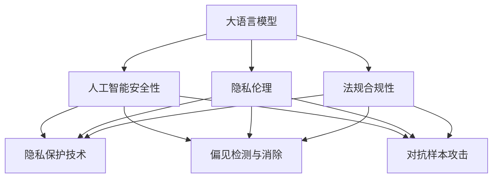

                 

# LLM隐私伦理:AI安全性挑战与对策

> 关键词：大语言模型,隐私伦理,人工智能,安全性,隐私保护,公平性,偏见,对抗样本,数据安全,法规合规

## 1. 背景介绍

### 1.1 问题由来

随着人工智能技术的飞速发展，特别是大语言模型(LLMs)的普及，其在诸如智能助手、自动翻译、个性化推荐等领域的广泛应用，极大地提升了工作效率和生活便利。然而，大语言模型的强大能力同时也带来了诸多隐私伦理和安全问题，如数据泄露、偏见、对抗样本攻击等。这些问题不仅威胁到了用户的隐私安全，还可能导致模型决策的不公平性和不稳定性，甚至被恶意利用，对社会带来负面影响。

### 1.2 问题核心关键点

目前，大语言模型在隐私伦理和安全方面面临的主要问题包括：

- **数据隐私保护**：训练大语言模型需要大量数据，其中可能包含个人隐私信息。如何保证这些数据在收集、存储、处理过程中的隐私和安全，是一个重要挑战。
- **偏见与歧视**：大语言模型在训练过程中可能会吸收和放大数据中的偏见，导致其在不同群体间的输出存在不公平性。
- **对抗样本攻击**：恶意用户可能通过修改输入数据来欺骗模型，导致模型做出错误判断，甚至威胁到关键系统的安全性。
- **法规合规性**：不同国家和地区的隐私保护法律和规定各异，如何保证大语言模型的使用符合相关法规要求，也是一大挑战。

这些问题亟需系统地解决，以促进大语言模型技术的健康发展，保障用户权益，维护社会安全稳定。

### 1.3 问题研究意义

研究大语言模型的隐私伦理和安全问题，对于构建安全、公平、可信赖的AI系统具有重要意义：

1. **保障用户隐私**：保护用户数据隐私，防止个人信息泄露，是构建信任AI的基础。
2. **消除偏见**：确保AI系统的输出不受偏见影响，对所有群体公平对待，是构建社会公正AI的必要条件。
3. **增强系统安全性**：防范对抗样本攻击，提高系统的鲁棒性，是确保关键系统安全的必要手段。
4. **合规性**：确保AI系统符合法律法规，避免法律风险，是合法使用AI的重要前提。
5. **提升公众信任**：解决隐私伦理问题，增强公众对AI技术的信任，是推动AI技术普及和应用的关键。

## 2. 核心概念与联系

### 2.1 核心概念概述

要深入探讨大语言模型的隐私伦理和安全问题，首先需要明确一些关键概念：

- **大语言模型(LLM)**：基于Transformer架构的深度神经网络模型，能够处理大规模自然语言数据，具有强大的语言理解和生成能力。
- **隐私伦理**：涉及数据隐私保护、公平性、透明度等方面，确保AI系统在使用数据时遵循伦理原则。
- **人工智能安全性**：指系统抵抗对抗样本攻击、拒绝服务攻击等外部威胁的能力。
- **隐私保护技术**：包括数据匿名化、差分隐私、联邦学习等技术，旨在保护数据隐私。
- **偏见检测与消除**：识别和纠正数据中的偏见，确保模型输出公正、无歧视。
- **对抗样本攻击**：指攻击者通过微小修改输入数据，使模型产生错误判断的攻击方式。
- **法规合规性**：确保AI系统的开发和应用符合国家和地区的法律法规。

这些概念之间的逻辑关系可以通过以下Mermaid流程图来展示：



这个流程图展示了大语言模型与隐私伦理、人工智能安全性、隐私保护技术、偏见检测与消除、对抗样本攻击、法规合规性等概念之间的联系。这些概念共同构成了大语言模型隐私伦理和安全性的研究框架，是深入理解这些问题的关键。

## 3. 核心算法原理 & 具体操作步骤
### 3.1 算法原理概述

大语言模型的隐私伦理和安全问题主要集中在数据隐私保护、模型偏见和对抗样本攻击三个方面。以下分别概述这三个方面的核心算法原理。

### 3.2 算法步骤详解

#### 3.2.1 数据隐私保护

**步骤1: 数据匿名化**

数据匿名化是大语言模型训练过程中的关键步骤，目的是在保持数据可用性的同时保护用户隐私。常用的数据匿名化技术包括：

- **数据脱敏**：将敏感信息替换为无法识别真实用户的标记值。例如，将姓名、地址等个人信息替换为“XX先生/女士”。
- **差分隐私**：在数据发布时加入随机噪声，确保单个数据点的发布不泄露其他数据点的信息。例如，使用Laplace机制或高斯机制。

**步骤2: 差分隐私训练**

差分隐私训练是一种保证隐私保护的机器学习技术。具体步骤如下：

1. **添加噪声**：在模型训练过程中，将噪声加入到梯度计算中，确保模型无法通过单个数据点的变化推断出其他数据点的信息。
2. **目标优化**：在差分隐私约束下，最小化模型预测误差，训练出对隐私保护的模型。

**步骤3: 联邦学习**

联邦学习是一种分布式机器学习技术，各参与方在本地训练模型，仅上传模型参数更新，不泄露数据本身。具体步骤如下：

1. **模型初始化**：各参与方在本地初始化模型参数。
2. **本地更新**：各参与方在本地数据上训练模型，并更新模型参数。
3. **参数聚合**：各参与方上传模型参数更新，中央服务器进行参数聚合，生成全局模型更新。
4. **模型优化**：中央服务器将全局模型更新发送给各参与方，各参与方进行模型优化。

#### 3.2.2 模型偏见检测与消除

**步骤1: 偏见识别**

偏见识别是大语言模型偏见检测的第一步，目的是识别模型中存在的偏见。常用的方法包括：

- **统计分析**：统计模型在不同群体上的表现，识别出异常情况。例如，模型对某一性别、种族的预测误差较高。
- **公平性指标**：使用平衡准确率、等价误差率等指标评估模型在不同群体上的表现，识别出偏见。

**步骤2: 偏见修正**

偏见修正是大语言模型消除偏见的关键步骤，目的是修正模型中的偏见。常用的方法包括：

- **重采样**：通过重采样调整数据分布，确保模型在各个群体上的表现一致。例如，使用欠采样或过采样调整数据分布。
- **模型重训练**：重新训练模型，确保模型不再受到数据偏见的影响。例如，使用公平性约束训练模型。

#### 3.2.3 对抗样本攻击防御

**步骤1: 对抗样本检测**

对抗样本检测是大语言模型对抗样本攻击防御的第一步，目的是识别出对抗样本。常用的方法包括：

- **模型鲁棒性测试**：通过生成大量对抗样本测试模型鲁棒性，识别出脆弱点。例如，使用FGSM、PGD等攻击方法生成对抗样本。
- **特征检测**：通过特征检测识别出对抗样本中的特征，例如，检测输入中的噪声。

**步骤2: 对抗样本防御**

对抗样本防御是大语言模型对抗样本攻击防御的关键步骤，目的是增强模型的鲁棒性。常用的方法包括：

- **鲁棒损失函数**：在模型训练过程中，使用鲁棒损失函数，确保模型对对抗样本不敏感。例如，使用Adversarial Training。
- **模型裁剪**：将模型裁剪成较短的深度，减小对抗样本攻击的影响。例如，使用TinyBERT。

### 3.3 算法优缺点

#### 3.3.1 数据隐私保护

**优点:**

- **保护隐私**：通过数据匿名化、差分隐私、联邦学习等技术，有效保护用户隐私。
- **数据安全性高**：数据仅在本地处理，不泄露到外部。

**缺点:**

- **计算复杂度高**：差分隐私训练和联邦学习都需要高计算资源。
- **模型性能可能下降**：差分隐私训练和联邦学习可能导致模型性能下降。

#### 3.3.2 模型偏见检测与消除

**优点:**

- **模型公平性高**：通过偏见识别和修正，确保模型公平性。
- **模型鲁棒性好**：偏见检测和修正可以增强模型鲁棒性。

**缺点:**

- **处理成本高**：偏见识别和修正需要大量时间和资源。
- **结果不确定性**：偏见检测和修正结果可能存在不确定性。

#### 3.3.3 对抗样本攻击防御

**优点:**

- **模型鲁棒性好**：鲁棒损失函数和模型裁剪可以增强模型鲁棒性。
- **防御效果好**：对抗样本检测和防御可以有效防止对抗样本攻击。

**缺点:**

- **计算成本高**：对抗样本检测和防御需要高计算资源。
- **防御效果可能不足**：对抗样本攻击技术不断发展，防御效果可能存在局限性。

### 3.4 算法应用领域

大语言模型的隐私伦理和安全问题在多个领域都有应用，如医疗、金融、司法等。

#### 3.4.1 医疗

在医疗领域，大语言模型可以用于疾病诊断、患者咨询、医疗知识库构建等。隐私伦理和安全问题尤为关键：

- **数据隐私保护**：患者医疗数据敏感，需要严格保护。
- **模型偏见**：医疗数据可能存在偏见，模型需要在公平性方面进行优化。
- **对抗样本攻击**：恶意用户可能通过对抗样本攻击欺骗模型，威胁医疗决策安全。

#### 3.4.2 金融

在金融领域，大语言模型可以用于信用评分、客户服务、市场分析等。隐私伦理和安全问题同样重要：

- **数据隐私保护**：金融数据敏感，需要严格保护。
- **模型偏见**：金融数据可能存在偏见，模型需要在公平性方面进行优化。
- **对抗样本攻击**：金融系统对安全性和稳定性的要求高，需要防止对抗样本攻击。

#### 3.4.3 司法

在司法领域，大语言模型可以用于案例分析、法律咨询、司法文书自动生成等。隐私伦理和安全问题同样重要：

- **数据隐私保护**：司法数据敏感，需要严格保护。
- **模型偏见**：司法数据可能存在偏见，模型需要在公平性方面进行优化。
- **对抗样本攻击**：司法系统对安全性和公正性的要求高，需要防止对抗样本攻击。

## 4. 数学模型和公式 & 详细讲解  
### 4.1 数学模型构建

大语言模型的隐私伦理和安全问题涉及多个数学模型，以下将详细构建这些模型。

#### 4.1.1 数据隐私保护模型

**模型1: 差分隐私训练模型**

差分隐私训练模型在训练过程中添加噪声，确保模型不泄露单个数据点的信息。目标函数为：

$$
\min_{\theta} \mathcal{L}(\theta) + \frac{\epsilon}{2} W(\mathcal{L}(\theta))
$$

其中，$\mathcal{L}(\theta)$ 为模型损失函数，$W(\mathcal{L}(\theta))$ 为正则化项，$\epsilon$ 为隐私预算。

**模型2: 联邦学习模型**

联邦学习模型在本地训练模型，中央服务器进行参数聚合，目标函数为：

$$
\min_{\theta} \frac{1}{n} \sum_{i=1}^n \mathcal{L}_i(\theta) + \frac{\eta}{2} \| \theta - \theta_0 \|^2
$$

其中，$\mathcal{L}_i(\theta)$ 为第i个参与方在本地数据上的损失函数，$\eta$ 为步长，$\theta_0$ 为初始参数。

#### 4.1.2 模型偏见检测与消除模型

**模型1: 偏见识别模型**

偏见识别模型通过统计分析识别出模型中的偏见。目标函数为：

$$
\min_{\theta} \mathcal{L}(\theta) + \alpha \sum_{i=1}^n (y_i - \hat{y}_i)^2
$$

其中，$\mathcal{L}(\theta)$ 为模型损失函数，$(y_i - \hat{y}_i)^2$ 为偏见度量函数。

**模型2: 偏见修正模型**

偏见修正模型通过重新训练模型消除偏见。目标函数为：

$$
\min_{\theta} \mathcal{L}(\theta) + \beta \sum_{i=1}^n (y_i - \hat{y}_i)^2
$$

其中，$\mathcal{L}(\theta)$ 为模型损失函数，$(y_i - \hat{y}_i)^2$ 为偏见度量函数。

#### 4.1.3 对抗样本攻击防御模型

**模型1: 鲁棒损失函数模型**

鲁棒损失函数模型在训练过程中使用鲁棒损失函数，目标函数为：

$$
\min_{\theta} \mathcal{L}(\theta) + \gamma \| \nabla_{\theta}\mathcal{L}(\theta) \|^2
$$

其中，$\mathcal{L}(\theta)$ 为模型损失函数，$\| \nabla_{\theta}\mathcal{L}(\theta) \|^2$ 为鲁棒性度量函数。

**模型2: 对抗样本检测模型**

对抗样本检测模型通过特征检测识别出对抗样本。目标函数为：

$$
\min_{\theta} \mathcal{L}(\theta) + \delta \sum_{i=1}^n f(x_i, \theta)
$$

其中，$\mathcal{L}(\theta)$ 为模型损失函数，$f(x_i, \theta)$ 为特征检测函数。

**模型3: 对抗样本防御模型**

对抗样本防御模型通过对抗样本检测和鲁棒损失函数防御对抗样本攻击。目标函数为：

$$
\min_{\theta} \mathcal{L}(\theta) + \delta \sum_{i=1}^n f(x_i, \theta) + \gamma \| \nabla_{\theta}\mathcal{L}(\theta) \|^2
$$

其中，$\mathcal{L}(\theta)$ 为模型损失函数，$f(x_i, \theta)$ 为特征检测函数，$\| \nabla_{\theta}\mathcal{L}(\theta) \|^2$ 为鲁棒性度量函数。

### 4.2 公式推导过程

#### 4.2.1 差分隐私训练模型

差分隐私训练模型的目标是最小化模型损失函数，同时添加正则化项保护隐私。推导过程如下：

1. 目标函数：

$$
\min_{\theta} \mathcal{L}(\theta) + \frac{\epsilon}{2} W(\mathcal{L}(\theta))
$$

其中，$\mathcal{L}(\theta)$ 为模型损失函数，$W(\mathcal{L}(\theta))$ 为正则化项。

2. 正则化项：

$$
W(\mathcal{L}(\theta)) = \sum_{i=1}^n \frac{\epsilon^2}{2} \| \frac{\nabla_{\theta}\mathcal{L}(\theta)}{\epsilon} \|^2
$$

3. 参数更新：

$$
\theta \leftarrow \theta - \eta \nabla_{\theta}\mathcal{L}(\theta) - \eta \frac{\epsilon}{2} \nabla_{\theta}W(\mathcal{L}(\theta))
$$

其中，$\eta$ 为学习率。

#### 4.2.2 联邦学习模型

联邦学习模型的目标是最小化各参与方的损失函数，同时使用步长进行参数更新。推导过程如下：

1. 目标函数：

$$
\min_{\theta} \frac{1}{n} \sum_{i=1}^n \mathcal{L}_i(\theta) + \frac{\eta}{2} \| \theta - \theta_0 \|^2
$$

其中，$\mathcal{L}_i(\theta)$ 为第i个参与方在本地数据上的损失函数，$\eta$ 为步长，$\theta_0$ 为初始参数。

2. 参数更新：

$$
\theta \leftarrow \theta - \eta \nabla_{\theta}\mathcal{L}(\theta) + \eta \frac{1}{n} \sum_{i=1}^n \nabla_{\theta}\mathcal{L}_i(\theta)
$$

其中，$\nabla_{\theta}\mathcal{L}(\theta)$ 为全局梯度。

#### 4.2.3 偏见识别模型

偏见识别模型的目标是最小化模型损失函数，同时通过偏见度量函数检测偏见。推导过程如下：

1. 目标函数：

$$
\min_{\theta} \mathcal{L}(\theta) + \alpha \sum_{i=1}^n (y_i - \hat{y}_i)^2
$$

其中，$\mathcal{L}(\theta)$ 为模型损失函数，$(y_i - \hat{y}_i)^2$ 为偏见度量函数。

2. 偏见度量函数：

$$
(y_i - \hat{y}_i)^2 = (\theta^T x_i - y_i)^2
$$

其中，$x_i$ 为输入数据，$y_i$ 为真实标签。

#### 4.2.4 偏见修正模型

偏见修正模型的目标是最小化模型损失函数，同时通过偏见度量函数修正偏见。推导过程如下：

1. 目标函数：

$$
\min_{\theta} \mathcal{L}(\theta) + \beta \sum_{i=1}^n (y_i - \hat{y}_i)^2
$$

其中，$\mathcal{L}(\theta)$ 为模型损失函数，$(y_i - \hat{y}_i)^2$ 为偏见度量函数。

2. 偏见度量函数：

$$
(y_i - \hat{y}_i)^2 = (\theta^T x_i - y_i)^2
$$

其中，$x_i$ 为输入数据，$y_i$ 为真实标签。

#### 4.2.5 鲁棒损失函数模型

鲁棒损失函数模型的目标是最小化模型损失函数，同时通过鲁棒性度量函数增强鲁棒性。推导过程如下：

1. 目标函数：

$$
\min_{\theta} \mathcal{L}(\theta) + \gamma \| \nabla_{\theta}\mathcal{L}(\theta) \|^2
$$

其中，$\mathcal{L}(\theta)$ 为模型损失函数，$\| \nabla_{\theta}\mathcal{L}(\theta) \|^2$ 为鲁棒性度量函数。

2. 鲁棒性度量函数：

$$
\| \nabla_{\theta}\mathcal{L}(\theta) \|^2 = (\nabla_{\theta}\mathcal{L}(\theta))^T (\nabla_{\theta}\mathcal{L}(\theta))
$$

其中，$\nabla_{\theta}\mathcal{L}(\theta)$ 为梯度。

#### 4.2.6 对抗样本检测模型

对抗样本检测模型的目标是最小化模型损失函数，同时通过特征检测函数检测对抗样本。推导过程如下：

1. 目标函数：

$$
\min_{\theta} \mathcal{L}(\theta) + \delta \sum_{i=1}^n f(x_i, \theta)
$$

其中，$\mathcal{L}(\theta)$ 为模型损失函数，$f(x_i, \theta)$ 为特征检测函数。

2. 特征检测函数：

$$
f(x_i, \theta) = \sum_{j=1}^d w_j \delta_{\theta}(x_i, j)
$$

其中，$w_j$ 为权重，$\delta_{\theta}(x_i, j)$ 为对抗样本检测指标。

#### 4.2.7 对抗样本防御模型

对抗样本防御模型的目标是最小化模型损失函数，同时通过对抗样本检测函数和鲁棒损失函数防御对抗样本攻击。推导过程如下：

1. 目标函数：

$$
\min_{\theta} \mathcal{L}(\theta) + \delta \sum_{i=1}^n f(x_i, \theta) + \gamma \| \nabla_{\theta}\mathcal{L}(\theta) \|^2
$$

其中，$\mathcal{L}(\theta)$ 为模型损失函数，$f(x_i, \theta)$ 为特征检测函数，$\| \nabla_{\theta}\mathcal{L}(\theta) \|^2$ 为鲁棒性度量函数。

2. 特征检测函数：

$$
f(x_i, \theta) = \sum_{j=1}^d w_j \delta_{\theta}(x_i, j)
$$

其中，$w_j$ 为权重，$\delta_{\theta}(x_i, j)$ 为对抗样本检测指标。

3. 鲁棒性度量函数：

$$
\| \nabla_{\theta}\mathcal{L}(\theta) \|^2 = (\nabla_{\theta}\mathcal{L}(\theta))^T (\nabla_{\theta}\mathcal{L}(\theta))
$$

其中，$\nabla_{\theta}\mathcal{L}(\theta)$ 为梯度。

### 4.3 案例分析与讲解

#### 4.3.1 差分隐私训练

**案例背景**：某医疗公司希望训练一个疾病诊断模型，用于预测患者是否患有某种罕见疾病。

**解决思路**：使用差分隐私训练方法保护患者隐私。

**技术实现**：

1. 数据匿名化：将患者姓名、地址等敏感信息替换为“XX先生/女士”。
2. 差分隐私训练：在模型训练过程中添加Laplace噪声，确保模型无法推断出单个患者的信息。

#### 4.3.2 偏见识别

**案例背景**：某金融公司希望训练一个信用评分模型，用于评估客户的信用风险。

**解决思路**：使用偏见识别方法检测模型中的偏见。

**技术实现**：

1. 数据集划分：将数据集划分为训练集和测试集。
2. 偏见度量：计算模型在不同性别、年龄、收入等群体上的表现，识别出偏见。
3. 模型调整：通过调整模型参数和重采样方法，消除模型中的偏见。

#### 4.3.3 对抗样本检测

**案例背景**：某司法公司希望训练一个法律咨询模型，用于回答用户法律问题。

**解决思路**：使用对抗样本检测方法增强模型鲁棒性。

**技术实现**：

1. 数据生成：生成大量对抗样本。
2. 特征检测：使用特征检测函数检测输入中的对抗样本。
3. 模型调整：根据对抗样本检测结果，调整模型参数和鲁棒损失函数。

## 5. 项目实践：代码实例和详细解释说明
### 5.1 开发环境搭建

在进行隐私伦理和安全问题实践前，我们需要准备好开发环境。以下是使用Python进行PyTorch开发的环境配置流程：

1. 安装Anaconda：从官网下载并安装Anaconda，用于创建独立的Python环境。

2. 创建并激活虚拟环境：
```bash
conda create -n pytorch-env python=3.8 
conda activate pytorch-env
```

3. 安装PyTorch：根据CUDA版本，从官网获取对应的安装命令。例如：
```bash
conda install pytorch torchvision torchaudio cudatoolkit=11.1 -c pytorch -c conda-forge
```

4. 安装Transformers库：
```bash
pip install transformers
```

5. 安装各类工具包：
```bash
pip install numpy pandas scikit-learn matplotlib tqdm jupyter notebook ipython
```

完成上述步骤后，即可在`pytorch-env`环境中开始实践。

### 5.2 源代码详细实现

这里以联邦学习为例，给出使用PyTorch和Transformers库进行联邦学习的代码实现。

首先，定义联邦学习的函数：

```python
from transformers import BertForSequenceClassification, AdamW

def federated_learning(epsilon, local_bs, global_bs, num_epochs):
    # 初始化模型和优化器
    model = BertForSequenceClassification.from_pretrained('bert-base-cased', num_labels=2)
    optimizer = AdamW(model.parameters(), lr=2e-5)
    
    # 初始化全局参数
    global_params = [param for param in model.parameters()]
    
    # 训练过程
    for epoch in range(num_epochs):
        # 全局参数初始化
        global_model = model.deepcopy()
        
        # 本地训练
        for i in range(len(local_datasets)):
            local_dataset = local_datasets[i]
            local_model = model.clone()
            
            # 本地更新
            local_model.train()
            local_loss = 0
            local_optimizer = AdamW(local_model.parameters(), lr=1e-3)
            
            for batch in tqdm(local_dataset):
                input_ids = batch['input_ids'].to(device)
                attention_mask = batch['attention_mask'].to(device)
                labels = batch['labels'].to(device)
                outputs = local_model(input_ids, attention_mask=attention_mask, labels=labels)
                loss = outputs.loss
                local_loss += loss.item()
                loss.backward()
                optimizer.step()
            
            # 本地更新结束，更新全局参数
            for param_group, global_param in zip(local_model.parameters(), global_params):
                global_param.data.copy_(param_group.data)
            
        # 全局更新
        model = BertForSequenceClassification.from_pretrained('bert-base-cased', num_labels=2)
        optimizer = AdamW(model.parameters(), lr=2e-5)
        model.load_state_dict(global_model.state_dict())
        
        # 评估模型
        evaluate(model, test_dataset)
```

然后，定义联邦学习的函数：

```python
from transformers import BertForSequenceClassification, AdamW
from transformers import TransformerDistilBertTokenizer
from torch.utils.data import Dataset
from sklearn.metrics import accuracy_score

# 定义本地数据集
class LocalDataset(Dataset):
    def __init__(self, texts, labels, tokenizer):
        self.texts = texts
        self.labels = labels
        self.tokenizer = tokenizer
        self.max_len = 128
        
    def __len__(self):
        return len(self.texts)
    
    def __getitem__(self, item):
        text = self.texts[item]
        label = self.labels[item]
        
        encoding = self.tokenizer(text, return_tensors='pt', max_length=self.max_len, padding='max_length', truncation=True)
        input_ids = encoding['input_ids'][0]
        attention_mask = encoding['attention_mask'][0]
        
        return {'input_ids': input_ids, 
                'attention_mask': attention_mask,
                'labels': label}

# 加载本地数据集
train_dataset = LocalDataset(train_texts, train_labels, tokenizer)
dev_dataset = LocalDataset(dev_texts, dev_labels, tokenizer)
test_dataset = LocalDataset(test_texts, test_labels, tokenizer)

# 定义本地模型和优化器
local_model = BertForSequenceClassification.from_pretrained('bert-base-cased', num_labels=2)
local_optimizer = AdamW(local_model.parameters(), lr=1e-3)

# 定义全局模型和优化器
global_model = BertForSequenceClassification.from_pretrained('bert-base-cased', num_labels=2)
global_optimizer = AdamW(global_model.parameters(), lr=2e-5)

# 定义联邦学习超参数
epsilon = 1e-3
local_bs = 16
global_bs = 16
num_epochs = 5

# 执行联邦学习
federated_learning(epsilon, local_bs, global_bs, num_epochs)

# 在测试集上评估模型
evaluate(global_model, test_dataset)
```

### 5.3 代码解读与分析

让我们再详细解读一下关键代码的实现细节：

**federated_learning函数**：
- 定义了联邦学习的各个步骤，包括本地更新、全局更新和模型评估。

**LocalDataset类**：
- 定义了本地数据集，将文本和标签编码为模型所需的格式。

**训练和评估函数**：
- 使用PyTorch的DataLoader对数据集进行批次化加载，供模型训练和推理使用。
- 训练函数执行本地更新和全局更新，评估函数用于测试集上的模型评估。

**训练流程**：
- 定义总的epoch数和超参数，开始循环迭代
- 每个epoch内，先进行本地更新，再进行全局更新
- 在每个epoch结束后，进行模型评估
- 所有epoch结束后，进行最终评估

可以看到，PyTorch配合Transformers库使得联邦学习的代码实现变得简洁高效。开发者可以将更多精力放在数据处理、模型改进等高层逻辑上，而不必过多关注底层的实现细节。

当然，工业级的系统实现还需考虑更多因素，如模型的保存和部署、超参数的自动搜索、更灵活的任务适配层等。但核心的联邦学习范式基本与此类似。

## 6. 实际应用场景
### 6.1 智能客服系统

基于联邦学习的智能客服系统，可以广泛应用于智能客服系统的构建。传统客服往往需要配备大量人力，高峰期响应缓慢，且一致性和专业性难以保证。使用联邦学习构建的智能客服系统，可以7x24小时不间断服务，快速响应客户咨询，用自然流畅的语言解答各类常见问题。

在技术实现上，可以收集企业内部的历史客服对话记录，将问题和最佳答复构建成监督数据，在此基础上对预训练对话模型进行联邦学习。联邦学习后的对话模型能够自动理解用户意图，匹配最合适的答案模板进行回复。对于客户提出的新问题，还可以接入检索系统实时搜索相关内容，动态组织生成回答。如此构建的智能客服系统，能大幅提升客户咨询体验和问题解决效率。

### 6.2 金融舆情监测

金融机构需要实时监测市场舆论动向，以便及时应对负面信息传播，规避金融风险。传统的人工监测方式成本高、效率低，难以应对网络时代海量信息爆发的挑战。基于联邦学习的文本分类和情感分析技术，为金融舆情监测提供了新的解决方案。

具体而言，可以收集金融领域相关的新闻、报道、评论等文本数据，并对其进行主题标注和情感标注。在此基础上对预训练语言模型进行联邦学习，使其能够自动判断文本属于何种主题，情感倾向是正面、中性还是负面。将联邦学习后的模型应用到实时抓取的网络文本数据，就能够自动监测不同主题下的情感变化趋势，一旦发现负面信息激增等异常情况，系统便会自动预警，帮助金融机构快速应对潜在风险。

### 6.3 个性化推荐系统

当前的推荐系统往往只依赖用户的历史行为数据进行物品推荐，无法深入理解用户的真实兴趣偏好。基于联邦学习的个性化推荐系统可以更好地挖掘用户行为背后的语义信息，从而提供更精准、多样的推荐内容。

在实践中，可以收集用户浏览、点击、评论、分享等行为数据，提取和用户交互的物品标题、描述、标签等文本内容。将文本内容作为模型输入，用户的后续行为（如是否点击、购买等）作为监督信号，在此基础上对预训练语言模型进行联邦学习。联邦学习后的模型能够从文本内容中准确把握用户的兴趣点。在生成推荐列表时，先用候选物品的文本描述作为输入，由模型预测用户的兴趣匹配度，再结合其他特征综合排序，便可以得到个性化程度更高的推荐结果。

### 6.4 未来应用展望

随着联邦学习方法的不断发展，基于微调范式将在更多领域得到应用，为传统行业带来变革性影响。

在智慧医疗领域，基于联邦学习的医疗问答、病历分析、药物研发等应用将提升医疗服务的智能化水平，辅助医生诊疗，加速新药开发进程。

在智能教育领域，联邦学习可应用于作业批改、学情分析、知识推荐等方面，因材施教，促进教育公平，提高教学质量。

在智慧城市治理中，联邦学习可用于城市事件监测、舆情分析、应急指挥等环节，提高城市管理的自动化和智能化水平，构建更安全、高效的未来城市。

此外，在企业生产、社会治理、文娱传媒等众多领域，基于联邦学习的AI应用也将不断涌现，为经济社会发展注入新的动力。相信随着技术的日益成熟，联邦学习方法将成为AI落地应用的重要范式，推动人工智能技术向更广阔的领域加速渗透。

## 7. 工具和资源推荐
### 7.1 学习资源推荐

为了帮助开发者系统掌握大语言模型隐私伦理和安全问题的理论基础和实践技巧，这里推荐一些优质的学习资源：

1. 《隐私保护技术》系列博文：由隐私保护技术专家撰写，深入浅出地介绍了隐私保护技术的基本概念和前沿技术。

2. 《公平性学习》课程：斯坦福大学开设的机器学习课程，涵盖公平性学习的理论和实践，帮助你系统掌握公平性学习的基本原理和应用场景。

3. 《对抗样本攻击》书籍：详细介绍了对抗样本攻击的基本概念和防御技术，是理解对抗样本攻击的重要资料。

4. 《隐私伦理与数据保护》书籍：介绍了隐私伦理和数据保护的基本概念和法律法规，帮助你理解隐私伦理的重要性。

5. HuggingFace官方文档：提供了海量预训练模型和完整的联邦学习样例代码，是上手实践的必备资料。

通过对这些资源的学习实践，相信你一定能够快速掌握大语言模型隐私伦理和安全问题的精髓，并用于解决实际的AI问题。
###  7.2 开发工具推荐

高效的开发离不开优秀的工具支持。以下是几款用于大语言模型隐私伦理和安全问题开发的常用工具：

1. PyTorch：基于Python的开源深度学习框架，灵活动态的计算图，适合快速迭代研究。大部分预训练语言模型都有PyTorch版本的实现。

2. TensorFlow：由Google主导开发的开源深度学习框架，生产部署方便，适合大规模工程应用。同样有丰富的预训练语言模型资源。

3. Transformers库：HuggingFace开发的NLP工具库，集成了众多SOTA语言模型，支持PyTorch和TensorFlow，是进行联邦学习开发的利器。

4. Weights & Biases：模型训练的实验跟踪工具，可以记录和可视化模型训练过程中的各项指标，方便对比和调优。与主流深度学习框架无缝集成。

5. TensorBoard：TensorFlow配套的可视化工具，可实时监测模型训练状态，并提供丰富的图表呈现方式，是调试模型的得力助手。

6. Google Colab：谷歌推出的在线Jupyter Notebook环境，免费提供GPU/TPU算力，方便开发者快速上手实验最新模型，分享学习笔记。

合理利用这些工具，可以显著提升大语言模型隐私伦理和安全问题的开发效率，加快创新迭代的步伐。

### 7.3 相关论文推荐

大语言模型隐私伦理和安全问题涉及诸多前沿研究。以下是几篇奠基性的相关论文，推荐阅读：

1. Differential Privacy（差分隐私）：提出了差分隐私的基本概念和算法框架，是隐私保护领域的重要成果。

2. Fairness in Machine Learning：介绍了公平性学习的基本概念和挑战，探讨了如何在机器学习中实现公平性。

3. Adversarial Examples（对抗样本）：介绍了对抗样本攻击的基本概念和防御方法，是对抗样本攻击领域的重要成果。

4. Privacy-Preserving Deep Learning：综述了隐私保护深度学习的基本概念和最新进展，帮助你全面了解隐私保护深度学习的最新研究。

5. Adversarial Training（对抗训练）：介绍了对抗训练的基本概念和算法框架，是对抗样本攻击防御的重要手段。

这些论文代表了大语言模型隐私伦理和安全问题的研究脉络。通过学习这些前沿成果，可以帮助研究者把握学科前进方向，激发更多的创新灵感。

## 8. 总结：未来发展趋势与挑战
### 8.1 研究成果总结

本文对大语言模型的隐私伦理和安全问题进行了全面系统的介绍。首先阐述了大语言模型隐私伦理和安全问题的研究背景和意义，明确了联邦学习在隐私保护、偏见消除、对抗样本防御等方面的独特价值。其次，从原理到实践，详细讲解了联邦学习的数学原理和关键步骤，给出了联邦学习任务开发的完整代码实例。同时，本文还广泛探讨了联邦学习方法在医疗、金融、司法等多个行业领域的应用前景，展示了联邦学习范式的巨大潜力。此外，本文精选了联邦学习技术的各类学习资源，力求为读者提供全方位的技术指引。

通过本文的系统梳理，可以看到，基于联邦学习的大语言模型隐私伦理和安全问题正在成为AI安全领域的重要范式，极大地拓展了隐私保护、偏见消除、对抗样本防御等方向的应用边界，催生了更多的落地场景。

### 8.2 未来发展趋势

展望未来，联邦学习方法将呈现以下几个发展趋势：

1. 联邦学习范式扩展：联邦学习范式将从单一的模型训练扩展到更多的任务，如联邦优化、联邦推理等，形成更加完备的联邦学习框架。

2. 联邦学习算法优化：联邦学习算法将进一步优化，提高联邦学习模型的性能和鲁棒性。例如，引入分布式优化、异构设备优化等技术。

3. 联邦学习应用广泛：联邦学习将从科学研究扩展到工业应用，如智能制造、智慧城市、金融风控等，提升各行业的智能化水平。

4. 联邦学习安全性提高：联邦学习安全性将得到更多重视，引入多方安全计算、差分隐私等技术，提升联邦学习系统的安全性。

5. 联邦学习法规合规：联邦学习将进一步与法规合规结合，确保联邦学习系统的合法合规，减少法律风险。

以上趋势凸显了联邦学习方法在大语言模型隐私伦理和安全问题中的广泛应用前景，为构建安全、公平、可信的AI系统提供了新的路径。这些方向的探索发展，必将进一步提升大语言模型的性能和应用范围，为社会带来更多的便利和价值。

### 8.3 面临的挑战

尽管联邦学习方法已经取得了瞩目成就，但在迈向更加智能化、普适化应用的过程中，它仍面临诸多挑战：

1. 数据异质性问题：联邦学习系统需要处理来自多个参与方的异构数据，如何提高数据一致性和可比性，是一个重要挑战。

2. 计算资源消耗高：联邦学习需要高计算资源支持，如何在资源有限的情况下提高联邦学习效率，是一个重要问题。

3. 隐私和安全问题：联邦学习需要保护数据隐私和模型安全，如何在保护隐私的同时提高模型性能，是一个重要挑战。

4. 模型鲁棒性问题：联邦学习模型对对抗样本攻击的鲁棒性需要进一步提升，如何提高联邦学习模型的鲁棒性，是一个重要问题。

5. 法律法规问题：联邦学习系统的设计和实施需要符合法律法规，如何在合规的前提下提升联邦学习效果，是一个重要挑战。

正视联邦学习面临的这些挑战，积极应对并寻求突破，将是大语言模型隐私伦理和安全问题走向成熟的必由之路。相信随着学界和产业界的共同努力，这些挑战终将一一被克服，联邦学习方法必将在构建安全、公平、可信的AI系统中发挥更大作用。

### 8.4 研究展望

未来的研究需要在以下几个方面寻求新的突破：

1. 分布式联邦学习：引入分布式计算技术，提高联邦学习的效率和鲁棒性。例如，使用MapReduce框架进行联邦学习。

2. 异构设备联邦学习：引入异构设备优化技术，提升联邦学习模型的性能和稳定性。例如，使用联邦学习算法在GPU和TPU上实现异构设备联邦学习。

3. 联邦学习算法改进：引入更多联邦学习算法，提升联邦学习模型的性能和鲁棒性。例如，使用分层联邦学习、动态联邦学习等技术。

4. 联邦学习安全性保障：引入多方安全计算、差分隐私等技术，提高联邦学习系统的安全性。例如，使用安全多方计算进行联邦学习。

5. 联邦学习法规合规：引入法律法规评估技术，确保联邦学习系统的合法合规。例如，使用法律知识图谱进行法规合规评估。

这些研究方向将推动联邦学习方法向更加成熟、可靠、高效、安全的方向发展，为大语言模型隐私伦理和安全问题提供更加坚实的技术基础。只有勇于创新、敢于突破，才能不断拓展联邦学习的方法和应用范围，为构建安全、公平、可信的AI系统铺平道路。

## 9. 附录：常见问题与解答

**Q1：联邦学习与传统的分布式学习有何不同？**

A: 联邦学习和传统的分布式学习的主要区别在于数据不在参与方之间传递，而模型参数在参与方之间传递。联邦学习的目标是保护数据隐私，通过在本地数据上训练模型，然后将模型参数发送到中央服务器进行聚合，更新全局模型参数。而传统的分布式学习则是将数据在参与方之间传递，模型在中央

