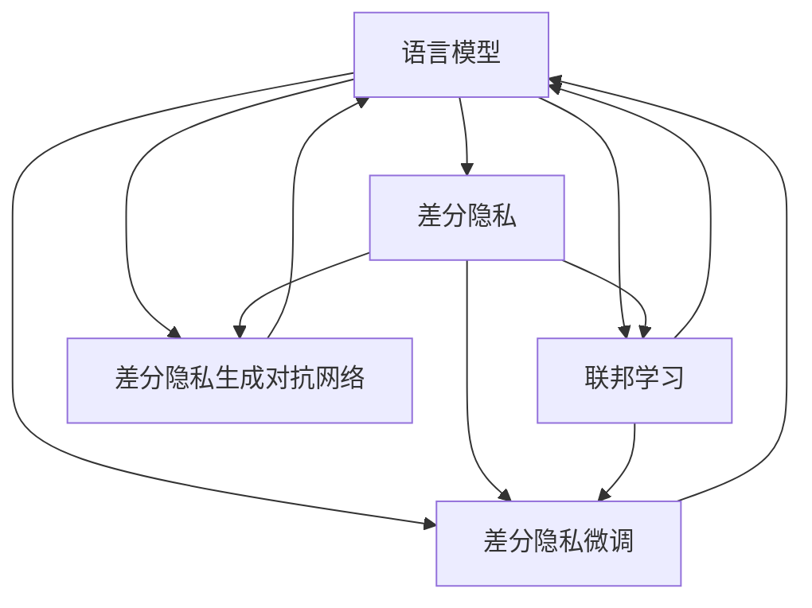

                 

## 1. 背景介绍

### 1.1 问题由来

随着人工智能技术在各个领域的广泛应用，深度学习模型已经成为推动产业发展的关键引擎。然而，伴随其带来的强大算力和创新能力，也产生了隐私、安全、伦理等诸多挑战。特别是在自然语言处理(NLP)领域，语言模型（如BERT、GPT-3）通过大规模无标签文本数据预训练，已展现出强大的语言理解和生成能力，但其数据隐私风险也愈发凸显。

语言模型在训练和应用过程中，不可避免地涉及用户数据的收集、存储和使用。这些数据通常包含敏感信息，如个人信息、行为数据等，一旦泄露或被滥用，将对用户的隐私安全造成严重威胁。此外，语言模型在多模态融合、跨域推理等方面的能力，使其在利用用户数据时面临更多潜在的隐私泄露风险。

近年来，伴随数据隐私保护意识的提升，如何在保障用户隐私的同时，充分利用语言模型，成为人工智能研究者和从业者共同关注的问题。围绕隐私保护，语言模型的研究和应用亟需新的策略和方法，以应对智能时代的隐私挑战。

### 1.2 问题核心关键点

语言模型隐私保护的核心问题在于如何在充分利用其高性能的前提下，最小化对用户隐私的损害。主要包括以下几个关键点：

- **隐私威胁分析**：分析语言模型在数据预训练、微调和推理阶段可能导致的隐私泄露风险。
- **隐私保护策略**：提出并实施有效的隐私保护措施，如差分隐私、联邦学习、差分隐私生成对抗网络等。
- **隐私保护技术**：开发和优化相关技术，以实现隐私保护与模型性能的双赢。
- **隐私保护的合规与伦理**：确保隐私保护措施符合法律法规和伦理标准，避免技术滥用。

本文旨在从隐私保护的视角，系统介绍语言模型的相关隐私问题，提出隐私保护策略和具体方法，并展望未来技术的发展方向。

## 2. 核心概念与联系

### 2.1 核心概念概述

为更好地理解隐私保护在语言模型中的应用，本节将介绍几个关键概念：

- **语言模型 (Language Model, LM)**：通过大规模无标签文本数据的自监督学习，学习语言规则和词汇的概率分布，具备语言理解和生成的能力。
- **差分隐私 (Differential Privacy, DP)**：一种隐私保护技术，通过在模型训练或推理中引入噪声，使得单个样本的输入无法显著影响模型输出，从而保护用户隐私。
- **联邦学习 (Federated Learning, FL)**：一种分布式机器学习方法，在本地设备上进行模型训练，不集中存储用户数据，保障用户隐私。
- **差分隐私生成对抗网络 (Differentially Private Generative Adversarial Network, DP-GAN)**：结合生成对抗网络(GAN)与差分隐私技术，用于生成隐私保护的数据或模型，减少隐私泄露风险。
- **差分隐私微调 (Differential Privacy Fine-Tuning)**：在微调过程中引入差分隐私技术，保护数据隐私，同时保留预训练模型的效果。

这些概念之间的联系可以通过以下Mermaid流程图来展示：



这个流程图展示了大语言模型在隐私保护方面的关键技术及其之间的关系：

1. 语言模型通过差分隐私技术，保障训练和推理过程中的数据隐私。
2. 差分隐私与联邦学习相结合，用于分布式环境中的模型训练和微调。
3. 差分隐私生成对抗网络通过生成隐私保护的数据或模型，进一步增强隐私安全性。
4. 差分隐私微调结合差分隐私技术，在微调过程中保护数据隐私，减少隐私泄露风险。

## 3. 核心算法原理 & 具体操作步骤
### 3.1 算法原理概述

基于差分隐私的语言模型隐私保护，本质上是一种在确保模型性能的同时，最小化隐私泄露风险的方法。其核心思想是：在模型的训练和推理过程中，通过引入随机噪声，使得模型的输出对单个样本的变化不敏感，从而保护用户隐私。

形式化地，假设预训练语言模型为 $M_{\theta}$，其中 $\theta$ 为模型参数。给定用户数据集 $D$，差分隐私语言模型的目标是在满足隐私预算 $\epsilon$ 的情况下，最小化损失函数 $\mathcal{L}$，即：

$$
\hat{\theta}=\mathop{\arg\min}_{\theta} \mathcal{L}(M_{\theta},D)
$$

其中 $\mathcal{L}$ 为损失函数，如交叉熵损失等，$\epsilon$ 为隐私预算，表示在保证隐私的前提下，单个样本的变化对模型输出的影响不超过 $\epsilon$。

差分隐私语言模型通过在损失函数中引入噪声，使得模型在处理单个样本时，输出的变化不超过 $\delta$，从而实现隐私保护。具体而言，差分隐私语言模型可表示为：

$$
\hat{\theta}=\mathop{\arg\min}_{\theta} \mathcal{L}(M_{\theta},D) + \lambda\mathcal{N}_{\sigma}(\hat{\theta})
$$

其中 $\lambda$ 为噪声强度，$\mathcal{N}_{\sigma}(\hat{\theta})$ 表示均值为0、标准差为 $\sigma$ 的正态分布随机噪声。

### 3.2 算法步骤详解

基于差分隐私的语言模型隐私保护，一般包括以下几个关键步骤：

**Step 1: 定义隐私预算和噪声强度**
- 根据隐私需求，选择合适的隐私预算 $\epsilon$ 和噪声强度 $\sigma$。隐私预算越小，噪声强度越大，隐私保护效果越强。

**Step 2: 数据预处理**
- 将用户数据进行标准化、归一化等预处理操作，避免噪声引入的偏差。

**Step 3: 模型训练**
- 在预处理后的数据集上进行差分隐私的模型训练。对于每个样本，在计算梯度时引入噪声，保证单个样本的变化对模型输出的影响不超过 $\delta$。
- 模型参数的更新公式为：
$$
\theta_{t+1}=\theta_t - \eta \frac{\partial \mathcal{L}(M_{\theta_t},D)}{\partial \theta_t} + \lambda \mathcal{N}_{\sigma}(\theta_t)
$$
其中 $\eta$ 为学习率，$M_{\theta_t}$ 为当前模型，$D$ 为数据集。

**Step 4: 模型推理**
- 在推理阶段，同样在计算梯度时引入噪声，保证模型对单个样本的变化不敏感。
- 推理输出公式为：
$$
y = M_{\hat{\theta}}(x) + \lambda \mathcal{N}_{\sigma}(y)
$$
其中 $\hat{\theta}$ 为差分隐私后的模型参数，$x$ 为输入样本，$y$ 为输出。

**Step 5: 结果后处理**
- 对差分隐私保护后的模型输出进行后处理，如剪枝、归一化等，以优化输出结果。

### 3.3 算法优缺点

基于差分隐私的语言模型隐私保护方法具有以下优点：

1. 可量化隐私保护效果：通过设置隐私预算 $\epsilon$ 和噪声强度 $\sigma$，可以精确控制隐私保护水平。
2. 适用范围广：适用于各种类型的语言模型和推理任务，不需要对模型结构做过多修改。
3. 技术成熟：差分隐私技术已经经过广泛研究和应用，形成一套完整的理论框架和技术实现。

同时，该方法也存在一定的局限性：

1. 增加计算开销：引入噪声会增加模型训练和推理的计算复杂度，影响模型性能。
2. 隐私预算限制：隐私预算的限制可能会导致隐私保护与模型性能之间的权衡。
3. 鲁棒性不足：差分隐私保护在对抗攻击等方面存在一定的脆弱性。

尽管存在这些局限性，但就目前而言，差分隐私仍是语言模型隐私保护的主流方法，适用于对隐私保护要求较高的场景。

### 3.4 算法应用领域

基于差分隐私的语言模型隐私保护方法，已经在以下几个领域得到了应用：

1. **医疗健康**：语言模型在医疗健康领域的应用，如电子病历分析、疾病预测等，通常涉及大量敏感的病人信息。差分隐私保护能够有效保障病患隐私，避免数据泄露风险。

2. **金融服务**：金融领域的数据隐私保护尤为重要，差分隐私语言模型可用于信用评分、欺诈检测等任务，保护用户和金融机构的数据安全。

3. **社交媒体**：社交媒体平台上的用户行为数据敏感，差分隐私语言模型可用于分析用户情感、行为等数据，同时保障用户隐私。

4. **政府公共服务**：政府机构处理大量敏感数据，差分隐私语言模型可用于人口统计、公共卫生等领域，保障数据隐私。

5. **智能家居**：智能家居系统涉及用户隐私数据，差分隐私保护技术可用于保护用户语音、行为等数据。

这些领域的应用展示了差分隐私语言模型的广泛前景，未来有望在更多场景中得到推广和应用。

## 4. 数学模型和公式 & 详细讲解 & 举例说明

### 4.1 数学模型构建

本节将使用数学语言对差分隐私语言模型的训练和推理过程进行详细描述。

假设语言模型为 $M_{\theta}$，给定用户数据集 $D=\{x_1, x_2, ..., x_n\}$，其中 $x_i$ 为样本。假设隐私预算为 $\epsilon$，噪声强度为 $\sigma$。

定义损失函数 $\mathcal{L}(\theta, D)$，如交叉熵损失等。差分隐私语言模型的训练过程如下：

$$
\hat{\theta}=\mathop{\arg\min}_{\theta} \mathcal{L}(M_{\theta},D) + \lambda\sum_{i=1}^n\|M_{\theta}(x_i) - M_{\theta}(x'_i)\|_{\delta} \leq \epsilon
$$

其中 $\|M_{\theta}(x_i) - M_{\theta}(x'_i)\|_{\delta}$ 表示模型对单个样本的变化不敏感程度。

### 4.2 公式推导过程

以下我们以二分类任务为例，推导差分隐私语言模型的训练和推理公式。

假设语言模型在输入 $x$ 上的输出为 $\hat{y}=M_{\theta}(x) \in [0,1]$，表示样本属于正类的概率。真实标签 $y \in \{0,1\}$。

差分隐私语言模型在训练阶段，通过在损失函数中引入噪声，保证模型对单个样本的变化不敏感。具体而言，差分隐私语言模型的训练目标为：

$$
\mathcal{L}_{\epsilon}(\theta, D) = \frac{1}{n}\sum_{i=1}^n \big[\ell(M_{\theta}(x_i), y_i) + \lambda\sigma\max(0, y_i - \hat{y}_i)\big]
$$

其中 $\ell$ 为损失函数，如交叉熵损失。

在推理阶段，差分隐私语言模型的输出为：

$$
y = M_{\hat{\theta}}(x) + \lambda\sigma\mathcal{N}_{\sigma}(y)
$$

其中 $\hat{\theta}$ 为差分隐私后的模型参数，$\mathcal{N}_{\sigma}(y)$ 表示均值为0、标准差为 $\sigma$ 的正态分布随机噪声。

### 4.3 案例分析与讲解

下面我们以医疗健康领域为例，详细分析差分隐私语言模型的应用。

假设有一个电子病历分析系统，涉及大量病人的病历数据，包括病史、诊断、治疗记录等。为了保护病人的隐私，系统中使用了差分隐私语言模型进行分析。

具体步骤如下：

1. **数据预处理**：对病人的病历数据进行标准化和归一化处理，去除噪声和异常值。

2. **隐私预算和噪声强度定义**：根据隐私保护需求，设定隐私预算 $\epsilon$ 和噪声强度 $\sigma$。

3. **模型训练**：在预处理后的数据集上，使用差分隐私技术进行语言模型训练。模型参数的更新公式为：
$$
\theta_{t+1}=\theta_t - \eta \frac{\partial \mathcal{L}_{\epsilon}(\theta_t, D)}{\partial \theta_t} + \lambda \mathcal{N}_{\sigma}(\theta_t)
$$

4. **模型推理**：在推理阶段，同样在计算梯度时引入噪声，保证模型对单个样本的变化不敏感。

5. **结果后处理**：对差分隐私保护后的模型输出进行后处理，如剪枝、归一化等，以优化输出结果。

通过差分隐私技术，该系统能够有效保障病人的隐私安全，同时通过语言模型分析病历数据，提供诊断和治疗建议，提升医疗服务质量。

## 5. 项目实践：代码实例和详细解释说明

### 5.1 开发环境搭建

在进行差分隐私语言模型实践前，我们需要准备好开发环境。以下是使用Python进行TensorFlow开发的环境配置流程：

1. 安装Anaconda：从官网下载并安装Anaconda，用于创建独立的Python环境。

2. 创建并激活虚拟环境：
```bash
conda create -n dp-env python=3.8 
conda activate dp-env
```

3. 安装TensorFlow：根据CUDA版本，从官网获取对应的安装命令。例如：
```bash
conda install tensorflow -c tf -c conda-forge
```

4. 安装各类工具包：
```bash
pip install numpy pandas scikit-learn matplotlib tqdm jupyter notebook ipython
```

完成上述步骤后，即可在`dp-env`环境中开始差分隐私语言模型的实践。

### 5.2 源代码详细实现

下面我们以二分类任务为例，给出使用TensorFlow和PyTorch实现差分隐私语言模型的代码实现。

首先，定义二分类任务的数据处理函数：

```python
import tensorflow as tf
import numpy as np

class Dataset:
    def __init__(self, X, y, batch_size):
        self.X = X
        self.y = y
        self.batch_size = batch_size
        self.num_samples = len(self.X)

    def __len__(self):
        return self.num_samples // self.batch_size

    def __getitem__(self, item):
        batch_X = self.X[item * self.batch_size: (item + 1) * self.batch_size]
        batch_y = self.y[item * self.batch_size: (item + 1) * self.batch_size]
        return batch_X, batch_y

    def get_next(self, batch_size):
        return np.random.choice(len(self), batch_size)
```

然后，定义差分隐私语言模型的超参数：

```python
epsilon = 1e-6
delta = 1e-6
sigma = 0.1
learning_rate = 0.01
batch_size = 64
num_epochs = 10
```

接着，定义差分隐私语言模型：

```python
class DPModel(tf.keras.Model):
    def __init__(self, input_dim):
        super(DPModel, self).__init__()
        self.linear = tf.keras.layers.Dense(1, activation='sigmoid')
        self.noise = tf.keras.layers.Lambda(lambda x: x + tf.random.normal(shape=tf.shape(x), stddev=sigma))

    def call(self, x):
        output = self.linear(self.noise(x))
        return output
```

然后，定义差分隐私损失函数：

```python
def differential_privacy_loss(y_true, y_pred, epsilon, delta):
    loss = tf.keras.losses.binary_crossentropy(y_true, y_pred)
    clip = tf.maximum(tf.abs(y_true - y_pred), epsilon / (1 - delta))
    return loss + tf.reduce_sum(clip)
```

最后，定义训练函数：

```python
@tf.function
def train_step(batch_X, batch_y):
    with tf.GradientTape() as tape:
        y_pred = model(batch_X)
        loss = differential_privacy_loss(batch_y, y_pred, epsilon, delta)
    gradients = tape.gradient(loss, model.trainable_variables)
    optimizer.apply_gradients(zip(gradients, model.trainable_variables))

    return loss
```

启动训练流程：

```python
dataset = Dataset(X_train, y_train, batch_size)
model = DPModel(input_dim)
optimizer = tf.keras.optimizers.Adam(learning_rate)

for epoch in range(num_epochs):
    for i in range(len(dataset)):
        train_step(dataset.get_next(batch_size))
    epoch_loss = np.mean(train_loss)
    print(f"Epoch {epoch+1}, loss: {epoch_loss:.4f}")
```

以上就是使用TensorFlow实现差分隐私语言模型的完整代码实现。可以看到，TensorFlow提供了丰富的库和工具，使得差分隐私语言模型的实现变得相对简单。

### 5.3 代码解读与分析

让我们再详细解读一下关键代码的实现细节：

**Dataset类**：
- `__init__`方法：初始化数据集，设置批量大小等关键参数。
- `__len__`方法：返回数据集样本数量。
- `__getitem__`方法：对单个批次进行采样。

**DPModel类**：
- `__init__`方法：定义差分隐私语言模型的结构。
- `call`方法：对输入数据进行处理和预测。

**differential_privacy_loss函数**：
- 计算差分隐私损失函数，将交叉熵损失和隐私损失结合起来，最小化模型预测与真实标签的差异。

**train_step函数**：
- 在每个批次上计算差分隐私损失，反向传播更新模型参数。

**训练流程**：
- 定义总训练轮数，对数据集进行迭代训练。
- 在每个批次上调用`train_step`函数，更新模型参数。
- 记录每个epoch的平均损失，输出训练结果。

可以看到，TensorFlow提供了方便的API接口，使得差分隐私语言模型的实现变得简洁高效。开发者可以根据实际需求，灵活组合API和自定义函数，高效实现差分隐私语言模型。

## 6. 实际应用场景

### 6.1 智能医疗

差分隐私语言模型在智能医疗领域的应用，可以帮助医疗机构保护病人的隐私数据，同时利用语言模型对病历数据进行分析和预测，提升医疗服务的质量和效率。

具体而言，差分隐私语言模型可用于：

- **疾病预测**：通过分析电子病历数据，预测病人的疾病风险，提供个性化的治疗建议。
- **诊断辅助**：结合医生输入的描述，利用语言模型进行疾病诊断，辅助医生快速定位问题。
- **症状分析**：分析病人的症状描述，预测可能的疾病，并提供相应的处理方案。

差分隐私语言模型通过引入差分隐私技术，保护病人的隐私数据，同时提升医疗服务的智能化水平。

### 6.2 金融服务

金融领域的数据隐私保护尤为重要，差分隐私语言模型可用于信用评分、欺诈检测等任务，保护用户和金融机构的数据安全。

具体而言，差分隐私语言模型可用于：

- **信用评分**：利用客户的交易数据和行为数据，通过差分隐私语言模型进行信用评分，保护客户隐私。
- **欺诈检测**：分析客户的交易记录，通过差分隐私语言模型检测潜在的欺诈行为，保护客户和金融机构的利益。
- **风险评估**：结合客户的个人信息和行为数据，通过差分隐私语言模型评估风险水平，提供个性化的金融服务。

差分隐私语言模型通过保障数据隐私，同时提升金融服务的智能水平，保护用户和金融机构的安全。

### 6.3 社交媒体

社交媒体平台上的用户行为数据敏感，差分隐私语言模型可用于分析用户情感、行为等数据，同时保障用户隐私。

具体而言，差分隐私语言模型可用于：

- **情感分析**：分析用户的评论和帖子，通过差分隐私语言模型进行情感分类，保护用户隐私。
- **行为预测**：分析用户的社交行为数据，通过差分隐私语言模型预测用户的偏好和行为，提供个性化的推荐。
- **隐私保护**：结合用户的社交行为数据，通过差分隐私语言模型保护用户隐私，避免数据泄露。

差分隐私语言模型通过保障用户隐私，同时提升社交媒体的智能水平，保护用户的数据安全。

## 7. 工具和资源推荐

### 7.1 学习资源推荐

为了帮助开发者系统掌握差分隐私语言模型的理论基础和实践技巧，这里推荐一些优质的学习资源：

1. **差分隐私官网**：差分隐私技术的权威网站，提供详细的定义、算法和应用案例，是学习差分隐私的必备资源。
2. **TensorFlow差分隐私文档**：TensorFlow的差分隐私文档，提供了详细的API接口和示例代码，方便开发者实践差分隐私语言模型。
3. **TensorFlow差分隐私教学视频**：由TensorFlow官方制作的差分隐私教学视频，适合入门学习，涵盖差分隐私的基本概念和实现技巧。
4. **差分隐私论文和博客**：通过阅读相关论文和博客，可以了解差分隐私的最新研究和应用，拓展知识视野。

通过对这些资源的学习实践，相信你一定能够快速掌握差分隐私语言模型的精髓，并用于解决实际的隐私保护问题。

### 7.2 开发工具推荐

高效的开发离不开优秀的工具支持。以下是几款用于差分隐私语言模型开发的常用工具：

1. **TensorFlow**：基于Python的开源深度学习框架，支持差分隐私技术，提供了丰富的API接口和示例代码。
2. **PyTorch**：基于Python的开源深度学习框架，同样支持差分隐私技术，适合进行深度学习模型的设计和优化。
3. **Weights & Biases**：模型训练的实验跟踪工具，可以记录和可视化模型训练过程中的各项指标，方便对比和调优。
4. **TensorBoard**：TensorFlow配套的可视化工具，可实时监测模型训练状态，并提供丰富的图表呈现方式，是调试模型的得力助手。

合理利用这些工具，可以显著提升差分隐私语言模型的开发效率，加快创新迭代的步伐。

### 7.3 相关论文推荐

差分隐私语言模型的研究源自学界的持续探索。以下是几篇奠基性的相关论文，推荐阅读：

1. **《Differential Privacy》**：差分隐私技术的奠基性论文，提供了差分隐私的定义和基本理论。
2. **《On the Value of Privacy: Provable Security vs. Utility》**：研究差分隐私在实际应用中的价值，提供了隐私保护与模型性能的双赢策略。
3. **《Differential Privacy is Still Learning》**：探讨差分隐私在模型训练中的应用，展示了差分隐私语言模型的训练方法和效果。
4. **《Adversarial Robustness in Machine Learning》**：研究差分隐私在对抗攻击中的应用，探讨了差分隐私在提高模型鲁棒性方面的作用。
5. **《Federated Learning with Differential Privacy》**：将差分隐私技术应用于联邦学习，探讨了差分隐私在分布式环境中的应用，提高了隐私保护水平。

这些论文代表了大语言模型隐私保护技术的发展脉络。通过学习这些前沿成果，可以帮助研究者把握学科前进方向，激发更多的创新灵感。

## 8. 总结：未来发展趋势与挑战

### 8.1 总结

本文对基于差分隐私的语言模型隐私保护方法进行了全面系统的介绍。首先阐述了差分隐私语言模型在隐私保护方面的重要性，明确了隐私保护在智能时代的重要地位。其次，从原理到实践，详细讲解了差分隐私语言模型的数学原理和关键步骤，给出了差分隐私语言模型的代码实现。同时，本文还广泛探讨了差分隐私语言模型在智能医疗、金融服务、社交媒体等多个领域的应用前景，展示了差分隐私语言模型的广泛价值。

通过本文的系统梳理，可以看到，差分隐私语言模型在保障用户隐私的同时，提升了语言模型的智能水平，具有重要的实际应用价值。未来，随着隐私保护意识的增强和隐私保护技术的不断演进，差分隐私语言模型必将在更多场景中得到推广和应用。

### 8.2 未来发展趋势

展望未来，差分隐私语言模型将呈现以下几个发展趋势：

1. **隐私预算的优化**：通过优化隐私预算，平衡隐私保护与模型性能，实现更高的隐私保护水平。
2. **差分隐私与其他隐私保护技术的结合**：结合联邦学习、差分隐私生成对抗网络等技术，提升隐私保护的鲁棒性和安全性。
3. **差分隐私的实时应用**：引入差分隐私的实时应用技术，保障用户隐私的同时，提升智能系统的实时响应能力。
4. **差分隐私的自动化应用**：开发自动化的差分隐私保护工具，降低隐私保护技术的门槛，方便开发者实践和使用。
5. **差分隐私的可解释性**：提升差分隐私保护的可解释性，帮助用户理解隐私保护的效果，增强用户信任。

这些趋势凸显了差分隐私语言模型的广阔前景，将进一步推动隐私保护技术与智能系统的结合，保障用户隐私的同时，提升系统的智能化水平。

### 8.3 面临的挑战

尽管差分隐私语言模型已经取得了显著进展，但在隐私保护技术的应用过程中，仍面临诸多挑战：

1. **隐私保护与性能的权衡**：如何在保障隐私的同时，最大化模型性能，是隐私保护技术面临的核心问题。
2. **差分隐私的泛化性**：差分隐私在实际应用中，可能存在泛化性不足的问题，难以应对多样化的隐私保护需求。
3. **差分隐私的鲁棒性**：差分隐私在对抗攻击等方面存在一定的脆弱性，如何增强其鲁棒性，是隐私保护技术的重要研究方向。
4. **差分隐私的可解释性**：差分隐私保护的可解释性不足，难以向用户解释隐私保护的效果，影响用户信任。
5. **差分隐私的应用复杂度**：差分隐私保护技术的应用复杂度高，需要开发者具备一定的技术基础和实践经验。

正视差分隐私面临的这些挑战，积极应对并寻求突破，将是大语言模型隐私保护技术迈向成熟的必由之路。相信随着学界和产业界的共同努力，这些挑战终将一一被克服，差分隐私语言模型必将在构建安全、可靠、可解释、可控的智能系统铺平道路。

### 8.4 研究展望

面对差分隐私面临的诸多挑战，未来的研究需要在以下几个方面寻求新的突破：

1. **差分隐私与联邦学习的结合**：结合差分隐私和联邦学习技术，提高隐私保护的鲁棒性和安全性。
2. **差分隐私的可解释性研究**：提升差分隐私保护的可解释性，帮助用户理解隐私保护的效果，增强用户信任。
3. **差分隐私的自动化应用**：开发自动化的差分隐私保护工具，降低隐私保护技术的门槛，方便开发者实践和使用。
4. **差分隐私的实时应用研究**：引入差分隐私的实时应用技术，保障用户隐私的同时，提升智能系统的实时响应能力。
5. **差分隐私的隐私预算优化**：优化隐私预算，平衡隐私保护与模型性能，实现更高的隐私保护水平。

这些研究方向的探索，必将引领差分隐私语言模型技术迈向更高的台阶，为构建安全、可靠、可解释、可控的智能系统铺平道路。面向未来，差分隐私语言模型还需要与其他隐私保护技术进行更深入的融合，如安全多方计算、隐私同态加密等，多路径协同发力，共同推动隐私保护技术与智能系统的结合。只有勇于创新、敢于突破，才能不断拓展隐私保护技术的边界，让智能技术更好地造福人类社会。

## 9. 附录：常见问题与解答

**Q1：差分隐私语言模型的隐私保护效果如何评估？**

A: 差分隐私语言模型的隐私保护效果通常通过隐私预算 $\epsilon$ 和噪声强度 $\sigma$ 来评估。隐私预算越小，噪声强度越大，隐私保护效果越强。具体评估方法包括：

1. **隐私预算评估**：通过分析模型的输出分布，计算隐私预算 $\epsilon$，确保单个样本的变化对模型输出的影响不超过 $\epsilon$。
2. **噪声强度评估**：通过分析模型的输出噪声，计算噪声强度 $\sigma$，确保噪声引入的偏差在可控范围内。
3. **隐私泄露评估**：通过模拟攻击者，评估差分隐私模型对隐私泄露的风险，确保模型的隐私保护水平。

**Q2：差分隐私语言模型的应用场景有哪些？**

A: 差分隐私语言模型已经在多个领域得到应用，包括：

1. **医疗健康**：保护病人隐私，利用语言模型进行疾病预测、诊断和治疗建议。
2. **金融服务**：保护用户和金融机构的数据安全，利用语言模型进行信用评分、欺诈检测和风险评估。
3. **社交媒体**：保护用户隐私，利用语言模型进行情感分析、行为预测和隐私保护。
4. **政府公共服务**：保护个人隐私，利用语言模型进行人口统计、公共卫生和应急响应。
5. **智能家居**：保护用户隐私，利用语言模型进行语音识别和行为分析。

**Q3：差分隐私语言模型是否适用于所有NLP任务？**

A: 差分隐私语言模型在大多数NLP任务上都能取得不错的效果，特别是对于数据量较小的任务。但对于一些特定领域的任务，如医学、法律等，仅仅依靠通用语料预训练的模型可能难以很好地适应。此时需要在特定领域语料上进一步预训练，再进行差分隐私微调，才能获得理想效果。

**Q4：差分隐私语言模型的计算开销大吗？**

A: 差分隐私语言模型在引入噪声时，会增加模型训练和推理的计算复杂度，影响模型性能。然而，通过优化算法和硬件资源，可以显著降低计算开销，实现高效的差分隐私语言模型。例如，使用GPU/TPU等高性能设备，以及混合精度训练等技术，可以大幅提升模型的推理速度和效率。

**Q5：差分隐私语言模型在实际应用中面临哪些挑战？**

A: 差分隐私语言模型在实际应用中面临以下挑战：

1. **隐私预算的优化**：需要在隐私保护和模型性能之间找到平衡点，实现最优的隐私保护效果。
2. **差分隐私的泛化性**：需要考虑多样化的隐私保护需求，提升差分隐私技术的泛化能力。
3. **差分隐私的鲁棒性**：需要增强差分隐私技术的鲁棒性，避免在对抗攻击中的脆弱性。
4. **差分隐私的可解释性**：需要提升差分隐私保护的可解释性，增强用户对隐私保护效果的理解。
5. **差分隐私的应用复杂度**：差分隐私保护技术的应用复杂度高，需要开发者具备一定的技术基础和实践经验。

---

作者：禅与计算机程序设计艺术 / Zen and the Art of Computer Programming

