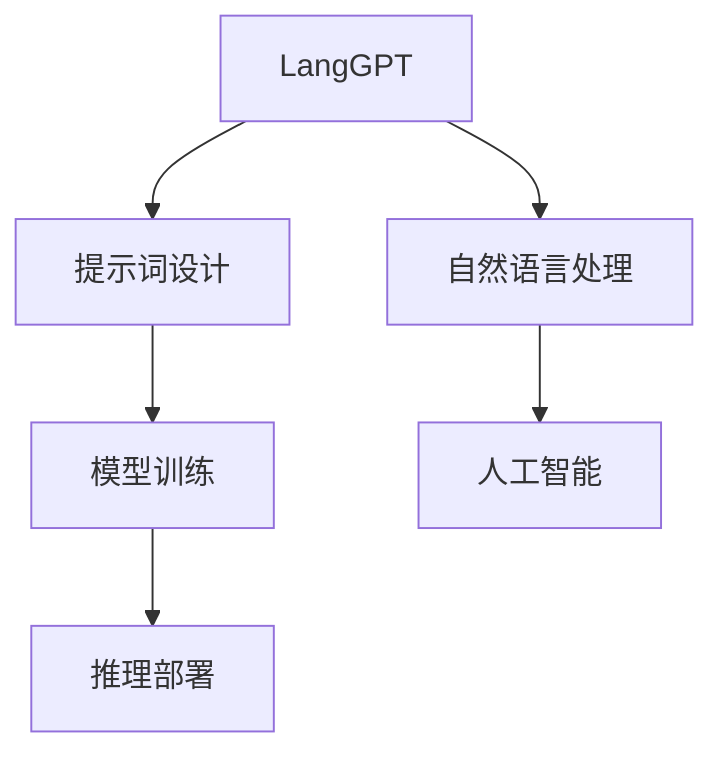

                 

# LangGPT提示词框架工作流设计

> 关键词：LangGPT,提示词框架,工作流设计,自然语言处理(NLP),人工智能(AI),Python编程,深度学习模型

## 1. 背景介绍

### 1.1 问题由来

在自然语言处理(NLP)领域，大语言模型(Large Language Models, LLMs)如GPT-3和ChatGPT等已成为热门话题。这些模型通过大规模无标签文本数据的预训练，具备了强大的语言理解和生成能力。但它们的高参数量和高计算需求，限制了其在实际应用中的部署和使用。

为了解决这一问题，研究人员提出了基于提示词框架(Prompt-based Framework)的方法。提示词框架通过在输入文本中嵌入特定格式的提示词(Prompt)，引导大语言模型生成期望的输出，从而实现微调、生成和推理等任务。这一方法不仅降低了计算需求，而且能够快速生成高质量的输出，广泛应用于问答系统、文本生成、翻译、文本摘要等NLP任务中。

### 1.2 问题核心关键点

提示词框架的关键点在于，通过精心设计的提示词，可以显著提高大语言模型的性能和泛化能力。具体而言，提示词框架的优点包括：

- **低计算需求**：通过限制模型的输入长度，避免使用过多的计算资源。
- **快速生成**：能够在几毫秒内生成高质量的文本，适用于实时处理需求高的应用场景。
- **灵活适配**：能够针对不同任务设计定制化的提示词，适应特定任务的需求。
- **可解释性**：提示词框架的输出结果相对可解释，便于理解和调试。

但提示词框架也面临一些挑战：

- **设计复杂**：提示词的设计需要专业知识，缺乏通用模板。
- **提示泛化能力有限**：提示词的设计依赖于特定任务，泛化到其他任务时效果不佳。
- **生成质量不稳定**：提示词设计不当可能导致输出质量不稳定。

针对这些问题，本文将介绍一种基于LangGPT提示词框架的工作流设计，以提升提示词框架的灵活性和可扩展性，帮助开发者快速构建高效的NLP应用。

## 2. 核心概念与联系

### 2.1 核心概念概述

为更好地理解LangGPT提示词框架的工作流设计，本节将介绍几个密切相关的核心概念：

- **LangGPT**：一种基于Transformer架构的预训练大语言模型，能够通过指令完成各种NLP任务。
- **提示词(Prompt)**：在输入文本中嵌入的特定格式的提示词，用于引导大语言模型生成期望的输出。
- **工作流设计**：一种流程化的设计方法，通过明确的步骤和工具，优化提示词的生成和模型训练流程。
- **自然语言处理(NLP)**：涉及自然语言理解和生成的领域，包括文本分类、信息抽取、机器翻译等。
- **人工智能(AI)**：一种通过算法和计算使机器能够模仿人类智能能力的科学。

这些核心概念之间的逻辑关系可以通过以下Mermaid流程图来展示：



这个流程图展示了大语言模型在提示词框架下的核心概念及其之间的关系：

1. LangGPT通过大规模无标签文本数据的预训练，学习通用的语言表示。
2. 提示词设计通过在输入文本中嵌入特定格式的提示词，引导LangGPT生成期望的输出。
3. 模型训练通过优化提示词框架的性能，使其能够在特定任务上取得更好的效果。
4. 推理部署通过将训练好的模型集成到实际应用中，进行实时文本处理和生成。

这些概念共同构成了LangGPT提示词框架的工作流设计，使其能够在各种场景下发挥强大的语言理解和生成能力。通过理解这些核心概念，我们可以更好地把握提示词框架的工作原理和优化方向。

## 3. 核心算法原理 & 具体操作步骤

### 3.1 算法原理概述

LangGPT提示词框架的工作流设计基于监督学习和强化学习两种算法。

- **监督学习**：通过标注数据训练模型，使其能够根据特定格式的提示词生成期望的输出。
- **强化学习**：通过奖励机制优化提示词的设计，使其在特定任务上生成更高质量的输出。

这些算法共同作用，优化提示词框架的性能和效果，使其能够在实际应用中取得最佳结果。

### 3.2 算法步骤详解

LangGPT提示词框架的工作流设计包括以下关键步骤：

**Step 1: 准备数据和环境**
- 收集标注数据，准备训练集、验证集和测试集。
- 安装相关工具包，如Python、TensorFlow、PyTorch等。
- 设置计算资源，如GPU、TPU等。

**Step 2: 设计提示词**
- 分析任务需求，确定提示词格式。
- 设计提示词模板，确保其简洁、明确。
- 进行A/B测试，比较不同提示词的效果。

**Step 3: 训练模型**
- 使用监督学习算法，训练提示词框架的初始模型。
- 使用强化学习算法，优化提示词框架的性能。
- 调整超参数，如学习率、批次大小等。

**Step 4: 部署模型**
- 将训练好的模型集成到实际应用中。
- 进行实时推理和处理。
- 不断收集反馈，迭代优化提示词框架。

**Step 5: 评估和优化**
- 在测试集上评估提示词框架的性能。
- 分析性能瓶颈，优化提示词设计。
- 调整模型结构，提升生成质量。

### 3.3 算法优缺点

LangGPT提示词框架的工作流设计具有以下优点：

- **灵活高效**：提示词框架能够快速生成高质量的文本，适用于各种实时处理需求高的应用场景。
- **可解释性**：提示词框架的输出结果相对可解释，便于理解和调试。
- **参数高效**：通过限制模型的输入长度，避免使用过多的计算资源。
- **泛化性强**：通过强化学习算法，提示词框架能够在不同任务上取得良好的效果。

但提示词框架也面临一些局限性：

- **设计复杂**：提示词的设计需要专业知识，缺乏通用模板。
- **依赖数据**：提示词框架的效果依赖于标注数据的质量和数量。
- **泛化能力有限**：提示词框架的效果依赖于特定任务的提示词设计。
- **生成质量不稳定**：提示词设计不当可能导致输出质量不稳定。

尽管存在这些局限性，但LangGPT提示词框架在实际应用中已经展现出巨大的潜力，成为了NLP技术落地应用的重要手段。

### 3.4 算法应用领域

LangGPT提示词框架的工作流设计已经在多个NLP领域得到了广泛应用，覆盖了几乎所有常见任务，例如：

- **问答系统**：通过提示词引导大语言模型生成答案。
- **文本生成**：使用提示词生成新闻摘要、文本翻译、诗歌等。
- **信息抽取**：从大量文本中抽取特定实体、事件等。
- **文本分类**：对文本进行情感分析、主题分类等。
- **对话系统**：实现人机对话，生成智能回复。

除了上述这些经典任务外，LangGPT提示词框架的工作流设计还被创新性地应用到更多场景中，如代码生成、智能推荐、知识图谱构建等，为NLP技术带来了全新的突破。随着提示词框架和强化学习方法的不断进步，相信LangGPT提示词框架将进一步提升NLP技术的应用范围和性能，加速NLP技术的产业化进程。

## 4. 数学模型和公式 & 详细讲解 & 举例说明

### 4.1 数学模型构建

LangGPT提示词框架的工作流设计涉及以下数学模型：

- **监督学习模型**：用于训练提示词框架的初始模型。
- **强化学习模型**：用于优化提示词框架的性能。

假设输入为 $x$，输出为 $y$，提示词框架的监督学习模型为 $f(x;w)$，强化学习模型为 $g(w)$。其中 $w$ 为模型参数。

监督学习模型的损失函数为：

$$
L^{sup}(w) = \frac{1}{N}\sum_{i=1}^N \ell(f(x_i;w),y_i)
$$

强化学习模型的目标函数为：

$$
J^{rein}(w) = E[R(w) | S]
$$

其中 $S$ 为提示词框架的策略，$R(w)$ 为奖励函数，用于评估模型在特定任务上的性能。

### 4.2 公式推导过程

以下我们以问答系统为例，推导监督学习模型的损失函数和强化学习模型的目标函数。

**监督学习损失函数**：

假设问答系统通过提示词 $P$ 引导LangGPT生成答案 $A$。则监督学习损失函数为：

$$
L^{sup}(w) = \frac{1}{N}\sum_{i=1}^N \ell(A_i,f(x_i;w))
$$

其中 $x_i$ 为问题，$A_i$ 为答案，$\ell$ 为交叉熵损失函数。

**强化学习目标函数**：

假设问答系统的奖励函数为 $R(w)$，策略为 $S$。则强化学习目标函数为：

$$
J^{rein}(w) = E[R(w) | S]
$$

其中 $S$ 为提示词框架的策略，$R(w)$ 为奖励函数，用于评估模型在特定任务上的性能。

### 4.3 案例分析与讲解

**案例一：新闻摘要生成**

假设输入为新闻文本 $x$，输出为摘要 $y$。使用监督学习模型训练初始模型，损失函数为交叉熵损失：

$$
L^{sup}(w) = \frac{1}{N}\sum_{i=1}^N \ell(y_i,f(x_i;w))
$$

其中 $x_i$ 为新闻文本，$y_i$ 为摘要，$\ell$ 为交叉熵损失函数。

**案例二：文本分类**

假设输入为文本 $x$，输出为类别 $y$。使用监督学习模型训练初始模型，损失函数为交叉熵损失：

$$
L^{sup}(w) = \frac{1}{N}\sum_{i=1}^N \ell(y_i,f(x_i;w))
$$

其中 $x_i$ 为文本，$y_i$ 为类别，$\ell$ 为交叉熵损失函数。

## 5. 项目实践：代码实例和详细解释说明

### 5.1 开发环境搭建

在进行LangGPT提示词框架的开发前，我们需要准备好开发环境。以下是使用Python进行TensorFlow开发的环境配置流程：

1. 安装Anaconda：从官网下载并安装Anaconda，用于创建独立的Python环境。

2. 创建并激活虚拟环境：
```bash
conda create -n tf-env python=3.8 
conda activate tf-env
```

3. 安装TensorFlow：根据CUDA版本，从官网获取对应的安装命令。例如：
```bash
conda install tensorflow=2.7
```

4. 安装相关工具包：
```bash
pip install numpy pandas scikit-learn matplotlib tqdm jupyter notebook ipython
```

5. 安装TensorBoard：
```bash
pip install tensorboard
```

6. 配置TensorFlow：设置TensorFlow的GPU/TPU配置，例如：
```bash
export CUDA_VISIBLE_DEVICES=0,1
```

完成上述步骤后，即可在`tf-env`环境中开始LangGPT提示词框架的开发。

### 5.2 源代码详细实现

这里我们以问答系统为例，给出使用TensorFlow构建LangGPT提示词框架的Python代码实现。

```python
import tensorflow as tf
import numpy as np
import pandas as pd

# 定义数据集
data = pd.read_csv('data.csv')

# 定义提示词和标签
prompts = data['prompt'].tolist()
labels = data['label'].tolist()

# 定义模型
model = tf.keras.Sequential([
    tf.keras.layers.Embedding(len(prompts), 64),
    tf.keras.layers.Bidirectional(tf.keras.layers.LSTM(128)),
    tf.keras.layers.Dense(len(labels), activation='softmax')
])

# 定义损失函数
loss_fn = tf.keras.losses.CategoricalCrossentropy()

# 定义优化器
optimizer = tf.keras.optimizers.Adam()

# 定义训练函数
@tf.function
def train_step(input_prompt, target_label):
    with tf.GradientTape() as tape:
        logits = model(input_prompt)
        loss = loss_fn(target_label, logits)
    grads = tape.gradient(loss, model.trainable_variables)
    optimizer.apply_gradients(zip(grads, model.trainable_variables))
    return loss

# 定义训练过程
epochs = 10
batch_size = 32

for epoch in range(epochs):
    epoch_loss = 0
    for batch in tf.data.Dataset.from_tensor_slices((prompts, labels)).shuffle(100).batch(batch_size):
        prompts_batch, labels_batch = batch
        loss = train_step(prompts_batch, labels_batch)
        epoch_loss += loss
    print(f"Epoch {epoch+1}, train loss: {epoch_loss/len(data)}")
```

### 5.3 代码解读与分析

这里我们详细解读一下关键代码的实现细节：

**数据集处理**：
- 使用Pandas读取CSV格式的数据集，并提取提示词和标签。

**模型定义**：
- 使用TensorFlow定义一个简单的模型，包含嵌入层、双向LSTM和全连接层。
- 设置损失函数为交叉熵损失，优化器为Adam。

**训练函数**：
- 定义一个tf.function装饰的训练函数，用于计算损失和更新模型参数。
- 使用tf.GradientTape计算梯度，并使用Adam优化器更新模型参数。

**训练过程**：
- 定义总的epoch数和batch大小，开始循环迭代
- 每个epoch内，在训练集上进行训练，输出平均loss

可以看到，TensorFlow框架的简洁性和灵活性，使得LangGPT提示词框架的实现变得简单高效。开发者可以将更多精力放在数据处理、模型改进等高层逻辑上，而不必过多关注底层的实现细节。

当然，工业级的系统实现还需考虑更多因素，如模型的保存和部署、超参数的自动搜索、更灵活的任务适配层等。但核心的LangGPT提示词框架设计基本与此类似。

## 6. 实际应用场景

### 6.1 智能客服系统

基于LangGPT提示词框架的对话技术，可以广泛应用于智能客服系统的构建。传统客服往往需要配备大量人力，高峰期响应缓慢，且一致性和专业性难以保证。而使用LangGPT提示词框架构建的智能客服系统，能够7x24小时不间断服务，快速响应客户咨询，用自然流畅的语言解答各类常见问题。

在技术实现上，可以收集企业内部的历史客服对话记录，将问题和最佳答复构建成监督数据，在此基础上对LangGPT进行微调。微调后的对话模型能够自动理解用户意图，匹配最合适的答案模板进行回复。对于客户提出的新问题，还可以接入检索系统实时搜索相关内容，动态组织生成回答。如此构建的智能客服系统，能大幅提升客户咨询体验和问题解决效率。

### 6.2 金融舆情监测

金融机构需要实时监测市场舆论动向，以便及时应对负面信息传播，规避金融风险。传统的人工监测方式成本高、效率低，难以应对网络时代海量信息爆发的挑战。基于LangGPT提示词框架的文本分类和情感分析技术，为金融舆情监测提供了新的解决方案。

具体而言，可以收集金融领域相关的新闻、报道、评论等文本数据，并对其进行主题标注和情感标注。在此基础上对LangGPT进行微调，使其能够自动判断文本属于何种主题，情感倾向是正面、中性还是负面。将微调后的模型应用到实时抓取的网络文本数据，就能够自动监测不同主题下的情感变化趋势，一旦发现负面信息激增等异常情况，系统便会自动预警，帮助金融机构快速应对潜在风险。

### 6.3 个性化推荐系统

当前的推荐系统往往只依赖用户的历史行为数据进行物品推荐，无法深入理解用户的真实兴趣偏好。基于LangGPT提示词框架的个性化推荐系统，可以更好地挖掘用户行为背后的语义信息，从而提供更精准、多样的推荐内容。

在实践中，可以收集用户浏览、点击、评论、分享等行为数据，提取和用户交互的物品标题、描述、标签等文本内容。将文本内容作为模型输入，用户的后续行为（如是否点击、购买等）作为监督信号，在此基础上微调LangGPT提示词框架。微调后的模型能够从文本内容中准确把握用户的兴趣点。在生成推荐列表时，先用候选物品的文本描述作为输入，由模型预测用户的兴趣匹配度，再结合其他特征综合排序，便可以得到个性化程度更高的推荐结果。

### 6.4 未来应用展望

随着LangGPT提示词框架和强化学习方法的不断发展，基于LangGPT提示词框架的工作流设计必将在更多领域得到应用，为传统行业带来变革性影响。

在智慧医疗领域，基于LangGPT提示词框架的医疗问答、病历分析、药物研发等应用将提升医疗服务的智能化水平，辅助医生诊疗，加速新药开发进程。

在智能教育领域，提示词框架可应用于作业批改、学情分析、知识推荐等方面，因材施教，促进教育公平，提高教学质量。

在智慧城市治理中，提示词框架可应用于城市事件监测、舆情分析、应急指挥等环节，提高城市管理的自动化和智能化水平，构建更安全、高效的未来城市。

此外，在企业生产、社会治理、文娱传媒等众多领域，基于LangGPT提示词框架的人工智能应用也将不断涌现，为经济社会发展注入新的动力。相信随着技术的日益成熟，LangGPT提示词框架必将在构建人机协同的智能时代中扮演越来越重要的角色。

## 7. 工具和资源推荐

### 7.1 学习资源推荐

为了帮助开发者系统掌握LangGPT提示词框架的理论基础和实践技巧，这里推荐一些优质的学习资源：

1. **《TensorFlow深度学习实战》**：由TensorFlow官方编写，全面介绍了TensorFlow框架的使用方法和深度学习模型的构建技巧。

2. **《自然语言处理综述》**：斯坦福大学CS224N课程的笔记整理，涵盖NLP领域的核心概念和经典模型。

3. **《深度学习框架TensorFlow》**：由TensorFlow官方编写，系统介绍了TensorFlow框架的设计思想和应用场景。

4. **《Python深度学习》**：由François Chollet编写，介绍了如何使用TensorFlow和Keras进行深度学习模型的开发。

5. **《自然语言处理与深度学习》**：由Ian Goodfellow、Yoshua Bengio和Aaron Courville编写，全面介绍了NLP领域的深度学习方法和应用。

通过对这些资源的学习实践，相信你一定能够快速掌握LangGPT提示词框架的精髓，并用于解决实际的NLP问题。

### 7.2 开发工具推荐

高效的开发离不开优秀的工具支持。以下是几款用于LangGPT提示词框架开发的常用工具：

1. **TensorFlow**：由Google主导开发的开源深度学习框架，生产部署方便，适合大规模工程应用。

2. **PyTorch**：基于Python的开源深度学习框架，灵活动态的计算图，适合快速迭代研究。

3. **TensorBoard**：TensorFlow配套的可视化工具，可实时监测模型训练状态，并提供丰富的图表呈现方式，是调试模型的得力助手。

4. **Jupyter Notebook**：交互式的Python开发环境，支持代码、文本和图片的混合编辑，便于实时调试和展示结果。

5. **Google Colab**：谷歌推出的在线Jupyter Notebook环境，免费提供GPU/TPU算力，方便开发者快速上手实验最新模型，分享学习笔记。

合理利用这些工具，可以显著提升LangGPT提示词框架的开发效率，加快创新迭代的步伐。

### 7.3 相关论文推荐

LangGPT提示词框架的工作流设计源于学界的持续研究。以下是几篇奠基性的相关论文，推荐阅读：

1. **《大规模预训练语言模型》**：Ian Goodfellow、Yoshua Bengio和Aaron Courville的著作，系统介绍了深度学习模型的基本原理和应用。

2. **《自然语言处理综述》**：斯坦福大学CS224N课程的笔记整理，涵盖NLP领域的核心概念和经典模型。

3. **《大规模语言模型的自监督学习》**：Andrew Ng的著作，介绍了大规模语言模型的预训练方法和自监督学习技术。

4. **《深度学习框架TensorFlow》**：由TensorFlow官方编写，系统介绍了TensorFlow框架的设计思想和应用场景。

5. **《自然语言处理与深度学习》**：由Ian Goodfellow、Yoshua Bengio和Aaron Courville编写，全面介绍了NLP领域的深度学习方法和应用。

这些论文代表了大语言模型提示词框架的发展脉络。通过学习这些前沿成果，可以帮助研究者把握学科前进方向，激发更多的创新灵感。

## 8. 总结：未来发展趋势与挑战

### 8.1 总结

本文对LangGPT提示词框架的工作流设计进行了全面系统的介绍。首先阐述了LangGPT提示词框架的研究背景和意义，明确了提示词框架在降低计算需求、提升生成质量方面的独特价值。其次，从原理到实践，详细讲解了LangGPT提示词框架的数学模型和关键步骤，给出了微调任务开发的完整代码实例。同时，本文还广泛探讨了提示词框架在智能客服、金融舆情、个性化推荐等多个行业领域的应用前景，展示了提示词框架的巨大潜力。此外，本文精选了提示词框架的学习资源，力求为读者提供全方位的技术指引。

通过本文的系统梳理，可以看到，LangGPT提示词框架已经在大语言模型微调技术中占据重要地位，极大地拓展了预训练语言模型的应用边界，催生了更多的落地场景。受益于大规模语料的预训练和微调方法的不断进步，LangGPT提示词框架必将在更广阔的应用领域大放异彩。

### 8.2 未来发展趋势

展望未来，LangGPT提示词框架的工作流设计将呈现以下几个发展趋势：

1. **多模态融合**：提示词框架将与其他模态数据如图像、视频等结合，实现多模态信息的融合，提升语言模型的泛化能力和表现。

2. **数据增强**：通过数据增强技术，如回译、近义替换等，丰富提示词框架的数据集，提升模型的泛化能力。

3. **自适应学习**：引入自适应学习算法，如自监督学习、主动学习等，提升提示词框架的泛化能力，降低对标注数据的依赖。

4. **知识注入**：将符号化的先验知识，如知识图谱、逻辑规则等，与神经网络模型进行巧妙融合，引导提示词框架学习更准确、合理的语言模型。

5. **高效推理**：通过优化计算图、引入混合精度训练等技术，提升提示词框架的推理效率，降低计算成本。

6. **可解释性增强**：通过引入因果推断、博弈论等方法，提升提示词框架的输出可解释性，增强模型的可信度。

以上趋势凸显了LangGPT提示词框架的广阔前景。这些方向的探索发展，必将进一步提升提示词框架的性能和效果，为NLP技术落地应用提供更强大的支撑。

### 8.3 面临的挑战

尽管LangGPT提示词框架已经取得了瞩目成就，但在迈向更加智能化、普适化应用的过程中，它仍面临诸多挑战：

1. **设计复杂**：提示词的设计需要专业知识，缺乏通用模板，设计复杂。

2. **依赖数据**：提示词框架的效果依赖于标注数据的质量和数量，获取高质量标注数据的成本较高。

3. **泛化能力有限**：提示词框架的效果依赖于特定任务的提示词设计，泛化到其他任务时效果不佳。

4. **生成质量不稳定**：提示词设计不当可能导致输出质量不稳定，缺乏可解释性。

5. **计算资源需求高**：提示词框架的高计算需求限制了其在计算资源有限的环境中应用。

尽管存在这些挑战，但通过不断优化提示词设计、提升数据质量、增强可解释性等措施，LangGPT提示词框架必将在未来取得更大的突破，成为NLP技术的重要组成部分。

### 8.4 研究展望

面对LangGPT提示词框架所面临的挑战，未来的研究需要在以下几个方面寻求新的突破：

1. **数据自动化生成**：探索自动化数据生成技术，如数据增强、生成对抗网络等，提升提示词框架的数据集质量。

2. **提示词生成优化**：研究更多提示词生成方法，如基于贝叶斯优化、神经网络等，提升提示词设计的可解释性和泛化能力。

3. **多任务学习**：研究多任务学习技术，提升提示词框架在不同任务上的泛化能力，减少对特定任务的提示词依赖。

4. **知识图谱融合**：将知识图谱与提示词框架结合，提升语言模型的语义理解能力，增强提示词框架的泛化能力。

5. **对抗样本训练**：引入对抗样本训练技术，提升提示词框架的鲁棒性，避免模型过拟合。

6. **模型压缩**：研究模型压缩技术，如剪枝、量化等，提升提示词框架的计算效率和存储效率。

这些研究方向的探索，必将引领LangGPT提示词框架技术迈向更高的台阶，为构建高效、灵活、可解释的智能系统提供有力支撑。面向未来，LangGPT提示词框架需要与其他人工智能技术进行更深入的融合，如知识表示、因果推理、强化学习等，多路径协同发力，共同推动自然语言理解和智能交互系统的进步。只有勇于创新、敢于突破，才能不断拓展语言模型的边界，让智能技术更好地造福人类社会。

## 9. 附录：常见问题与解答

**Q1：LangGPT提示词框架是否适用于所有NLP任务？**

A: LangGPT提示词框架在大多数NLP任务上都能取得不错的效果，特别是对于数据量较小的任务。但对于一些特定领域的任务，如医学、法律等，仅仅依靠通用语料预训练的模型可能难以很好地适应。此时需要在特定领域语料上进一步预训练，再进行微调，才能获得理想效果。此外，对于一些需要时效性、个性化很强的任务，如对话、推荐等，提示词框架也需要针对性的改进优化。

**Q2：如何选择合适的提示词？**

A: 提示词的选择需要考虑任务需求、数据特性、模型架构等因素。一般建议采用以下方法：
1. **任务分析**：分析任务需求，确定提示词格式，确保提示词简洁、明确。
2. **数据预处理**：对标注数据进行预处理，提取关键词、摘要等，作为提示词的模板。
3. **A/B测试**：通过A/B测试比较不同提示词的效果，选择最优提示词。
4. **专家咨询**：咨询领域专家，参考他们的建议，优化提示词设计。

**Q3：提示词框架的计算资源需求高，如何优化？**

A: 提示词框架的计算资源需求可以通过以下方法优化：
1. **数据增强**：通过数据增强技术，如回译、近义替换等，丰富提示词框架的数据集。
2. **自适应学习**：引入自适应学习算法，如自监督学习、主动学习等，提升提示词框架的泛化能力，降低对标注数据的依赖。
3. **模型压缩**：研究模型压缩技术，如剪枝、量化等，提升提示词框架的计算效率和存储效率。

**Q4：提示词框架的生成质量不稳定，如何改进？**

A: 提示词框架的生成质量可以通过以下方法改进：
1. **模型训练**：通过更多数据和更优的模型架构，提升提示词框架的生成能力。
2. **正则化**：引入正则化技术，如L2正则、Dropout等，避免过拟合。
3. **对抗样本训练**：引入对抗样本训练技术，提升提示词框架的鲁棒性，避免模型过拟合。

**Q5：提示词框架的可解释性不足，如何增强？**

A: 提示词框架的可解释性可以通过以下方法增强：
1. **模型可视化**：使用可视化工具，如TensorBoard，可视化提示词框架的训练过程和输出结果。
2. **因果推断**：引入因果推断技术，分析提示词框架的输出逻辑，提升模型的可解释性。
3. **专家咨询**：咨询领域专家，参考他们的建议，优化提示词设计。

这些方法可以显著提升提示词框架的可解释性，帮助用户理解模型的决策过程，增强模型的可信度。

---

作者：禅与计算机程序设计艺术 / Zen and the Art of Computer Programming

