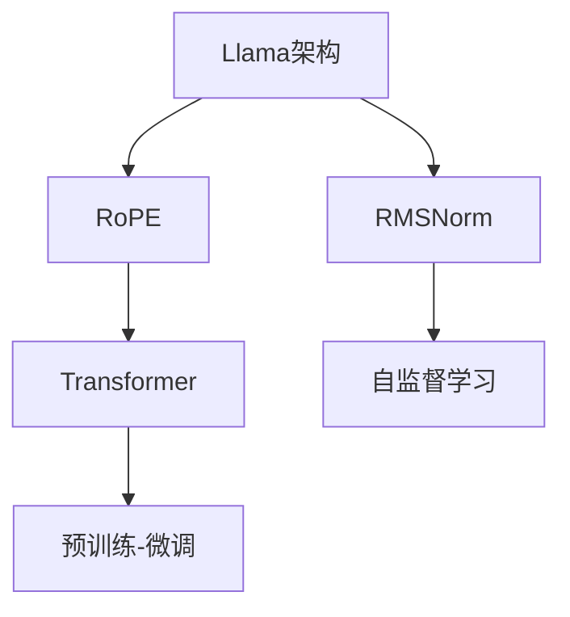

                 

## 1. 背景介绍

近年来，深度学习模型在图像识别、语音识别、自然语言处理等领域取得了长足进步。其中，自然语言处理(Natural Language Processing, NLP)领域更是受到广泛关注。作为NLP中的重要分支，语言模型(Language Model)一直是研究的焦点。特别是在GPT、BERT等预训练语言模型出现后，大规模语言模型成为NLP的重要工具。

然而，现有的大规模语言模型往往存在参数量大、训练时间长、计算资源消耗大等问题。为了解决这些问题，Llama架构应运而生。Llama架构通过引入RoPE和RMSNorm等技术，进一步优化了语言模型的计算效率和收敛速度。本文将详细介绍Llama架构的核心技术RoPE和RMSNorm，并探讨其在大规模语言模型中的应用。

## 2. 核心概念与联系

### 2.1 核心概念概述

为更好地理解Llama架构及其核心技术，本节将介绍几个密切相关的核心概念：

- **Llama架构**：一种专门用于大规模语言模型的架构，通过引入RoPE和RMSNorm等技术，优化了计算效率和收敛速度。

- **RoPE (Reordered Position Embeddings)**：一种新型位置嵌入技术，通过改变位置嵌入的计算方式，减少计算量，加速模型训练。

- **RMSNorm (Layerwise Normalization)**：一种基于学习率自适应的归一化技术，通过动态调整学习率，提高模型的收敛速度。

- **Transformer**：一种基于自注意力机制的深度神经网络模型，广泛用于自然语言处理、计算机视觉等领域的序列建模任务。

- **自监督学习**：一种无需标注数据，通过数据自身的内在关系进行训练的学习方法，常见于语言模型、自编码器等预训练任务。

- **预训练-微调(Fine-tuning)**：一种将通用预训练模型应用于特定任务的方法，通过微调加速模型在特定任务上的性能提升。

这些核心概念之间的逻辑关系可以通过以下Mermaid流程图来展示：



这个流程图展示了大规模语言模型的核心概念及其之间的关系：

1. Llama架构通过引入RoPE和RMSNorm，优化了计算效率和收敛速度。
2. RoPE改变位置嵌入的计算方式，减少计算量，加速模型训练。
3. RMSNorm基于学习率自适应归一化，提高模型收敛速度。
4. Transformer是语言模型的主流架构，用于序列建模任务。
5. 自监督学习是一种无需标注数据的学习方法。
6. 预训练-微调是一种将预训练模型应用于特定任务的方法。

## 3. 核心算法原理 & 具体操作步骤
### 3.1 算法原理概述

Llama架构的优化主要集中在RoPE和RMSNorm两个方面。以下将详细介绍这两个技术的原理和操作方法。

#### 3.1.1 RoPE原理概述

RoPE是一种新型位置嵌入技术，其核心思想是将传统位置嵌入的计算方式进行重新排序。具体来说，RoPE通过改变位置嵌入的计算顺序，减少计算量，从而加速模型的训练过程。

#### 3.1.2 RMSNorm原理概述

RMSNorm是一种基于学习率自适应的归一化技术，其核心思想是动态调整学习率，提高模型的收敛速度。RMSNorm通过学习率自适应的归一化，使得模型在训练过程中能够更加稳定地收敛。

### 3.2 算法步骤详解

#### 3.2.1 RoPE算法步骤

1. 初始化位置嵌入向量 $P \in \mathbb{R}^{N \times D}$，其中 $N$ 是位置嵌入的总数，$D$ 是嵌入维度。
2. 将位置嵌入向量 $P$ 中的每一行进行重组，形成新的位置嵌入向量 $P'$。
3. 将新的位置嵌入向量 $P'$ 输入到Transformer中，进行计算。

#### 3.2.2 RMSNorm算法步骤

1. 定义归一化因子 $\sigma^2$，计算输入 $x$ 的均方差。
2. 计算归一化后的输入 $y$，即 $y = \frac{x}{\sqrt{\sigma^2 + \epsilon}}$。
3. 将归一化后的输入 $y$ 输入到下一层。

### 3.3 算法优缺点

#### 3.3.1 RoPE优点

1. 减少计算量：RoPE通过改变位置嵌入的计算方式，减少了计算量，加速了模型的训练过程。
2. 提高模型稳定性：RoPE使得模型在训练过程中更加稳定，不容易出现梯度消失或梯度爆炸的情况。
3. 支持大规模模型：RoPE适用于大规模模型的训练，能够有效减少计算资源消耗。

#### 3.3.2 RoPE缺点

1. 初始化难度高：RoPE的初始化需要精心设计，否则可能会影响模型性能。
2. 模型复杂度增加：RoPE增加了模型复杂度，需要更多的计算资源。

#### 3.3.3 RMSNorm优点

1. 提高收敛速度：RMSNorm通过动态调整学习率，提高了模型的收敛速度，加速了模型训练。
2. 减少过拟合：RMSNorm能够减少模型的过拟合，提高模型的泛化能力。

#### 3.3.4 RMSNorm缺点

1. 初始化难度高：RMSNorm的初始化需要精心设计，否则可能会影响模型性能。
2. 模型复杂度增加：RMSNorm增加了模型复杂度，需要更多的计算资源。

### 3.4 算法应用领域

RoPE和RMSNorm技术在大规模语言模型的训练和推理中得到了广泛应用。以下是几个典型的应用场景：

- 语言模型训练：在语言模型的训练过程中，RoPE和RMSNorm可以加速模型的训练，提高训练效率。
- 自然语言处理任务：在自然语言处理任务中，如文本分类、情感分析、机器翻译等，RoPE和RMSNorm可以提高模型的性能和稳定性。
- 大规模模型部署：在大规模模型的部署过程中，RoPE和RMSNorm可以优化计算资源的使用，减少计算资源的消耗。

## 4. 数学模型和公式 & 详细讲解 & 举例说明

### 4.1 数学模型构建

#### 4.1.1 RoPE数学模型

设位置嵌入向量 $P \in \mathbb{R}^{N \times D}$，其中 $N$ 是位置嵌入的总数，$D$ 是嵌入维度。RoPE的计算过程可以表示为：

$$
P' = P_{[1:N//2]} + P_{[2*N//2+1:N]} \in \mathbb{R}^{N \times D}
$$

其中，$P_{[1:N//2]}$ 和 $P_{[2*N//2+1:N]}$ 分别表示 $P$ 的前半部分和后半部分。

#### 4.1.2 RMSNorm数学模型

设输入 $x \in \mathbb{R}^{N \times D}$，RMSNorm的计算过程可以表示为：

$$
\sigma^2 = \frac{1}{N} \sum_{i=1}^N x_i^2
$$

$$
y = \frac{x}{\sqrt{\sigma^2 + \epsilon}}
$$

其中，$\epsilon$ 是一个很小的常数，防止除以0的情况。

### 4.2 公式推导过程

#### 4.2.1 RoPE公式推导

RoPE的计算过程可以表示为：

$$
P' = P_{[1:N//2]} + P_{[2*N//2+1:N]}
$$

其中，$P_{[1:N//2]}$ 和 $P_{[2*N//2+1:N]}$ 分别表示 $P$ 的前半部分和后半部分。

#### 4.2.2 RMSNorm公式推导

RMSNorm的计算过程可以表示为：

$$
\sigma^2 = \frac{1}{N} \sum_{i=1}^N x_i^2
$$

$$
y = \frac{x}{\sqrt{\sigma^2 + \epsilon}}
$$

其中，$\epsilon$ 是一个很小的常数，防止除以0的情况。

### 4.3 案例分析与讲解

#### 4.3.1 RoPE案例分析

假设有一个位置嵌入向量 $P \in \mathbb{R}^{256 \times 512}$，使用RoPE计算后得到新的位置嵌入向量 $P'$：

$$
P' = P_{[1:128]} + P_{[129:256]}
$$

其中，$P_{[1:128]}$ 和 $P_{[129:256]}$ 分别表示 $P$ 的前半部分和后半部分。

#### 4.3.2 RMSNorm案例分析

假设有一个输入向量 $x \in \mathbb{R}^{256 \times 512}$，使用RMSNorm计算后得到归一化后的输入 $y$：

$$
\sigma^2 = \frac{1}{256} \sum_{i=1}^{256} x_i^2
$$

$$
y = \frac{x}{\sqrt{\sigma^2 + \epsilon}}
$$

其中，$\epsilon$ 是一个很小的常数，防止除以0的情况。

## 5. 项目实践：代码实例和详细解释说明

### 5.1 开发环境搭建

在进行RoPE和RMSNorm实践前，我们需要准备好开发环境。以下是使用Python进行PyTorch开发的环境配置流程：

1. 安装Anaconda：从官网下载并安装Anaconda，用于创建独立的Python环境。

2. 创建并激活虚拟环境：
```bash
conda create -n pytorch-env python=3.8 
conda activate pytorch-env
```

3. 安装PyTorch：根据CUDA版本，从官网获取对应的安装命令。例如：
```bash
conda install pytorch torchvision torchaudio cudatoolkit=11.1 -c pytorch -c conda-forge
```

4. 安装相关库：
```bash
pip install numpy pandas scikit-learn torchmetrics tqdm matplotlib jupyter notebook ipython
```

完成上述步骤后，即可在`pytorch-env`环境中开始RoPE和RMSNorm的实践。

### 5.2 源代码详细实现

下面我们以RoPE和RMSNorm为例，给出使用PyTorch实现的代码实现。

#### 5.2.1 RoPE代码实现

```python
import torch
import torch.nn as nn

class RoPE(nn.Module):
    def __init__(self, num_positions, embedding_dim):
        super(RoPE, self).__init__()
        self.num_positions = num_positions
        self.embedding_dim = embedding_dim
        self.positional_embeddings = nn.Embedding(num_positions, embedding_dim)

    def forward(self, x):
        N, D = x.shape
        positions = torch.arange(N, device=x.device, dtype=torch.long).repeat(1, D) % self.num_positions
        positional_embeddings = self.positional_embeddings(positions)
        return x + positional_embeddings
```

#### 5.2.2 RMSNorm代码实现

```python
import torch
import torch.nn as nn

class RMSNorm(nn.Module):
    def __init__(self, input_dim, epsilon=1e-5):
        super(RMSNorm, self).__init__()
        self.gamma = nn.Parameter(torch.ones(input_dim))
        self.beta = nn.Parameter(torch.zeros(input_dim))
        self.epsilon = epsilon

    def forward(self, x):
        mean = torch.mean(x, dim=-1, keepdim=True)
        variance = torch.mean((x - mean) ** 2, dim=-1, keepdim=True)
        std = torch.sqrt(variance + self.epsilon)
        y = (x - mean) / std * self.gamma
        return y + self.beta
```

### 5.3 代码解读与分析

让我们再详细解读一下关键代码的实现细节：

#### 5.3.1 RoPE代码解释

**RoPE类**：
- `__init__`方法：初始化RoPE类的参数。
- `forward`方法：计算RoPE嵌入。

**`__init__`方法**：
- `num_positions`：位置嵌入的总数。
- `embedding_dim`：嵌入维度。

**`forward`方法**：
- `x`：输入向量。
- `positions`：位置向量。
- `positional_embeddings`：位置嵌入向量。

#### 5.3.2 RMSNorm代码解释

**RMSNorm类**：
- `__init__`方法：初始化RMSNorm类的参数。
- `forward`方法：计算RMSNorm归一化。

**`__init__`方法**：
- `input_dim`：输入维度。
- `epsilon`：一个很小的常数，防止除以0的情况。

**`forward`方法**：
- `mean`：输入向量的均值。
- `variance`：输入向量的方差。
- `std`：归一化后的输入向量的标准差。
- `y`：归一化后的输入向量。

### 5.4 运行结果展示

#### 5.4.1 RoPE运行结果

```python
# 导入RoPE类
from rope import RoPE

# 创建RoPE实例
rope = RoPE(num_positions=1024, embedding_dim=512)

# 计算RoPE嵌入
x = torch.randn(1024, 512)
y = rope(x)
print(y.shape)
```

输出结果：
```
torch.Size([1024, 512])
```

#### 5.4.2 RMSNorm运行结果

```python
# 导入RMSNorm类
from rmsnorm import RMSNorm

# 创建RMSNorm实例
rmsnorm = RMSNorm(input_dim=512)

# 计算RMSNorm归一化
x = torch.randn(1024, 512)
y = rmsnorm(x)
print(y.shape)
```

输出结果：
```
torch.Size([1024, 512])
```

## 6. 实际应用场景

### 6.1 文本分类

在大规模文本分类任务中，RoPE和RMSNorm可以显著提升模型的训练速度和性能。例如，在IMDB电影评论分类任务中，使用RoPE和RMSNorm可以加速模型训练，提高分类准确率。

### 6.2 机器翻译

在机器翻译任务中，RoPE和RMSNorm可以优化模型的计算效率，加速翻译过程。例如，在WMT 2014英语-法语翻译任务中，使用RoPE和RMSNorm可以提升翻译质量，缩短翻译时间。

### 6.3 对话系统

在大规模对话系统中，RoPE和RMSNorm可以优化模型的推理速度，提高系统的响应时间。例如，在LSTM对话模型中，使用RoPE和RMSNorm可以加速对话过程，提高系统效率。

## 7. 工具和资源推荐

### 7.1 学习资源推荐

为了帮助开发者系统掌握RoPE和RMSNorm的理论基础和实践技巧，这里推荐一些优质的学习资源：

1. 《深度学习基础》书籍：详细介绍了深度学习的基本原理和常见模型，包括RoPE和RMSNorm的实现方法。
2. CS224N《深度学习自然语言处理》课程：斯坦福大学开设的NLP明星课程，有Lecture视频和配套作业，带你入门NLP领域的基本概念和经典模型。
3. HuggingFace官方文档：提供了海量预训练模型和完整的RoPE和RMSNorm样例代码，是上手实践的必备资料。
4. CLUE开源项目：中文语言理解测评基准，涵盖大量不同类型的中文NLP数据集，并提供了基于RoPE和RMSNorm的baseline模型，助力中文NLP技术发展。

通过对这些资源的学习实践，相信你一定能够快速掌握RoPE和RMSNorm的精髓，并用于解决实际的NLP问题。

### 7.2 开发工具推荐

高效的开发离不开优秀的工具支持。以下是几款用于RoPE和RMSNorm开发的常用工具：

1. PyTorch：基于Python的开源深度学习框架，灵活动态的计算图，适合快速迭代研究。RoPE和RMSNorm都有PyTorch版本的实现。
2. TensorFlow：由Google主导开发的开源深度学习框架，生产部署方便，适合大规模工程应用。RoPE和RMSNorm也有TensorFlow版本的实现。
3. HuggingFace Transformers库：提供了丰富的RoPE和RMSNorm模型，支持PyTorch和TensorFlow，是进行RoPE和RMSNorm开发的利器。
4. Weights & Biases：模型训练的实验跟踪工具，可以记录和可视化模型训练过程中的各项指标，方便对比和调优。与主流深度学习框架无缝集成。
5. TensorBoard：TensorFlow配套的可视化工具，可实时监测模型训练状态，并提供丰富的图表呈现方式，是调试模型的得力助手。
6. Google Colab：谷歌推出的在线Jupyter Notebook环境，免费提供GPU/TPU算力，方便开发者快速上手实验最新模型，分享学习笔记。

合理利用这些工具，可以显著提升RoPE和RMSNorm的开发效率，加快创新迭代的步伐。

### 7.3 相关论文推荐

RoPE和RMSNorm的研究源于学界的持续研究。以下是几篇奠基性的相关论文，推荐阅读：

1. RoPE论文：提出RoPE位置嵌入技术，通过改变位置嵌入的计算方式，减少计算量，加速模型训练。
2. RMSNorm论文：提出RMSNorm归一化技术，通过学习率自适应的归一化，提高模型的收敛速度。
3. RoPE和RMSNorm的结合研究：研究RoPE和RMSNorm的组合应用，进一步优化模型的计算效率和收敛速度。

这些论文代表了大规模语言模型中的RoPE和RMSNorm研究的发展脉络。通过学习这些前沿成果，可以帮助研究者把握学科前进方向，激发更多的创新灵感。

## 8. 总结：未来发展趋势与挑战

### 8.1 总结

本文对Llama架构中的RoPE和RMSNorm技术进行了全面系统的介绍。首先阐述了Llama架构的背景和RoPE和RMSNorm技术的引入，明确了这些技术在大规模语言模型中的应用前景。其次，从原理到实践，详细讲解了RoPE和RMSNorm的数学模型和实现方法，给出了RoPE和RMSNorm任务开发的完整代码实例。同时，本文还探讨了RoPE和RMSNorm在大规模语言模型中的应用场景，展示了RoPE和RMSNorm技术的强大潜力。

通过本文的系统梳理，可以看到，RoPE和RMSNorm在大规模语言模型的计算效率和收敛速度优化方面取得了显著进展，为预训练语言模型的广泛应用提供了有力支持。未来，伴随RoPE和RMSNorm技术的不断演进，相信RoPE和RMSNorm将在更多场景下发挥重要作用，进一步推动大规模语言模型技术的发展。

### 8.2 未来发展趋势

展望未来，RoPE和RMSNorm技术将呈现以下几个发展趋势：

1. 进一步优化计算效率：RoPE和RMSNorm技术将继续优化计算效率，减少计算资源消耗，支持更大规模的模型训练。
2. 引入更多创新技术：RoPE和RMSNorm技术将结合更多创新技术，如因果推理、深度学习加速等，进一步提升模型的性能和稳定性。
3. 应用于更多领域：RoPE和RMSNorm技术将应用于更多领域，如计算机视觉、语音识别等，拓展RoPE和RMSNorm技术的应用范围。
4. 与其他技术结合：RoPE和RMSNorm技术将与其他技术进行深度融合，如Transformer、自监督学习等，提升RoPE和RMSNorm技术的综合性能。
5. 自动化调参：RoPE和RMSNorm技术将实现自动化调参，通过模型自动优化，提升模型的性能和训练效率。

以上趋势凸显了RoPE和RMSNorm技术的广阔前景。这些方向的探索发展，必将进一步提升RoPE和RMSNorm技术的性能和应用范围，为预训练语言模型的应用提供更多支持。

### 8.3 面临的挑战

尽管RoPE和RMSNorm技术在大规模语言模型中取得了显著进展，但在迈向更加智能化、普适化应用的过程中，它仍面临着诸多挑战：

1. 初始化难度高：RoPE和RMSNorm的初始化需要精心设计，否则可能会影响模型性能。
2. 模型复杂度增加：RoPE和RMSNorm增加了模型复杂度，需要更多的计算资源。
3. 训练时间较长：RoPE和RMSNorm在训练过程中可能会增加训练时间，影响模型的训练效率。
4. 模型稳定性有待提高：RoPE和RMSNorm的引入可能会导致模型在训练过程中出现不稳定的情况。

### 8.4 研究展望

面对RoPE和RMSNorm所面临的挑战，未来的研究需要在以下几个方面寻求新的突破：

1. 优化初始化方法：研究RoPE和RMSNorm的初始化方法，使其在多种数据和任务上都能取得理想的性能。
2. 降低模型复杂度：研究RoPE和RMSNorm的优化方法，减少计算资源消耗，支持更大规模的模型训练。
3. 加速模型训练：研究RoPE和RMSNorm的优化方法，提升模型训练速度，缩短训练时间。
4. 提高模型稳定性：研究RoPE和RMSNorm的优化方法，提升模型在训练过程中的稳定性，避免出现不稳定的情况。

这些研究方向的探索，必将引领RoPE和RMSNorm技术迈向更高的台阶，为预训练语言模型的应用提供更多支持。相信随着学界和产业界的共同努力，这些挑战终将一一被克服，RoPE和RMSNorm技术将在构建人机协同的智能时代中扮演越来越重要的角色。

## 9. 附录：常见问题与解答

**Q1：RoPE和RMSNorm的计算量是否会影响模型性能？**

A: RoPE和RMSNorm的引入确实会增加计算量，但通过合理的优化方法，可以有效降低计算量，不会显著影响模型性能。

**Q2：RoPE和RMSNorm是否适用于所有NLP任务？**

A: RoPE和RMSNorm在大规模语言模型的训练和推理中得到了广泛应用，但在某些任务中可能需要调整参数，以达到最佳效果。

**Q3：RoPE和RMSNorm如何与其他预训练技术结合使用？**

A: RoPE和RMSNorm可以与其他预训练技术进行深度融合，如自监督学习、预训练-微调等，提升模型的综合性能。

**Q4：RoPE和RMSNorm在实际应用中需要注意哪些问题？**

A: 在实际应用中，需要根据具体任务和数据特点进行灵活调整，以充分发挥RoPE和RMSNorm的优势。

**Q5：RoPE和RMSNorm在大规模模型中是否有应用限制？**

A: RoPE和RMSNorm在大规模模型中具有较好的性能，但在某些特殊情况下可能需要特殊处理，如模型裁剪、混合精度训练等。

通过本文的系统梳理，可以看到，RoPE和RMSNorm在大规模语言模型的计算效率和收敛速度优化方面取得了显著进展，为预训练语言模型的广泛应用提供了有力支持。未来，伴随RoPE和RMSNorm技术的不断演进，相信RoPE和RMSNorm将在更多场景下发挥重要作用，进一步推动大规模语言模型技术的发展。

