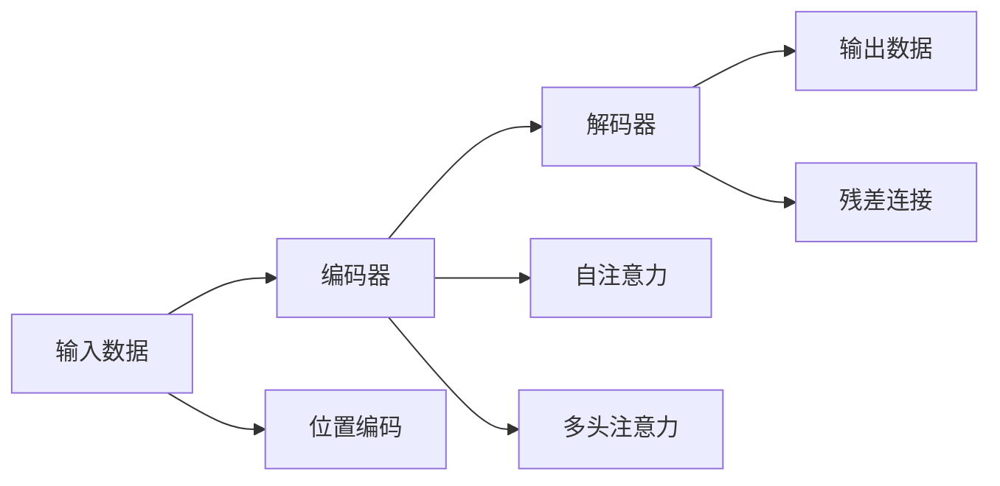

                 

# Llama模型解析：RoPE、RMSNorm与GQA

大语言模型（Large Language Models, LLMs），尤其是如GPT、BERT等Transformer架构的模型，近年来取得了巨大成功。这些模型通过大规模无标签数据的自监督预训练，在各种自然语言处理任务中展现了强大的语言理解和生成能力。而Llama等新型大模型则进一步提升了模型参数量，带来了更强的模型表现，但同时也不可避免地面临了更复杂的结构设计、训练策略和优化问题。本文将深入解析Llama模型中的关键技术，如RoPE、RMSNorm和GQA等，以揭示其工作原理和优势。

## 1. 背景介绍

### 1.1 问题由来

随着深度学习技术的发展，大语言模型（LLMs）在自然语言处理（NLP）领域表现出色。这些模型通过在大规模无标签数据上进行自监督预训练，学习了丰富的语言知识和常识，能够进行多种NLP任务。例如，BERT模型通过掩码语言模型（Masked Language Modeling, MLM）和下一句预测（Next Sentence Prediction, NSP）等自监督任务进行预训练，广泛应用于命名实体识别（NER）、关系抽取（RE）、问答系统（QA）等任务，取得了显著效果。

然而，这些模型的参数量在不断增加，从几十亿到上百亿甚至更多。例如，GPT-3的参数量达到了1750亿，模型规模之大前所未有。参数量的增加虽然提升了模型的表现，但同时也带来了更多的计算资源需求、更长的训练时间和更复杂的模型优化问题。

为应对这些挑战，Llama等新型大模型被提出，并采用了更为高效的结构设计、优化算法和训练策略。本文将详细解析这些模型中的关键技术，以期为理解Llama等大模型的设计思想提供帮助。

### 1.2 问题核心关键点

Llama等大模型采用了更为复杂和高效的结构设计，其核心点包括：
1. 更强的并行计算能力：通过大规模硬件集群支持模型训练和推理。
2. 更好的参数管理策略：利用预训练与微调相结合的方式，减少从头训练所需的标注数据和计算资源。
3. 更高的模型表现：通过更深入的模型结构优化和更多的训练数据，进一步提升模型在各种NLP任务上的表现。

本文将重点介绍Llama模型中的关键技术，如RoPE、RMSNorm和GQA等，以揭示其工作原理和优势。

## 2. 核心概念与联系

### 2.1 核心概念概述

Llama模型采用了Transformer架构，其主要组件包括：
1. 编码器与解码器：分别用于输入数据的编码和输出数据的生成。
2. 自注意力机制（Self-Attention）：用于模型内部信息的多层次交互。
3. 位置编码（Positional Encoding）：用于处理输入序列中的位置信息。
4. 残差连接（Residual Connection）：用于解决梯度消失问题，加速模型训练。
5. 多头注意力（Multi-Head Attention）：用于提升模型对多层次信息的关系建模能力。
6. 残差连接（Residual Connection）：用于解决梯度消失问题，加速模型训练。

这些组件通过一定的设计策略组合在一起，构成了一个高效、强大且可扩展的NLP模型框架。

### 2.2 核心概念原理和架构的 Mermaid 流程图

以下是一个简化的Mermaid流程图，展示了Llama模型的主要组件及其相互作用：



## 3. 核心算法原理 & 具体操作步骤

### 3.1 算法原理概述

Llama模型采用了Transformer架构，其主要算法原理包括自注意力机制、多头注意力、残差连接等。这些算法原理在大规模数据上进行自监督预训练，使得模型学习到丰富的语言知识和常识，具备强大的语言理解和生成能力。

在实际应用中，Llama模型通常分为预训练和微调两个阶段。预训练阶段，模型在大规模无标签数据上进行自监督学习，学习通用的语言表示。微调阶段，将模型应用于特定的下游任务，通过有监督学习优化模型在特定任务上的性能。

### 3.2 算法步骤详解

**步骤1：预训练阶段**

1. 数据准备：收集大规模无标签文本数据，进行数据预处理，如分词、标记等。
2. 模型初始化：初始化模型参数，如编码器、解码器、自注意力机制等。
3. 自监督训练：在数据集上进行掩码语言模型（MLM）和下一句预测（NSP）等自监督训练，学习通用语言表示。
4. 模型评估：在验证集上评估模型性能，根据性能指标调整模型参数和学习率。

**步骤2：微调阶段**

1. 数据准备：收集目标任务的标注数据，进行数据预处理。
2. 模型初始化：将预训练模型作为初始化参数。
3. 任务适配：添加任务适配层，如分类器、解码器等，根据任务需求设计损失函数。
4. 有监督训练：在标注数据集上进行有监督训练，优化模型在特定任务上的性能。
5. 模型评估：在测试集上评估模型性能，对比微调前后的性能提升。

### 3.3 算法优缺点

Llama模型具有以下优点：
1. 强大的语言理解能力：通过大规模无标签数据的自监督预训练，学习到了丰富的语言知识和常识。
2. 可扩展性强：模型结构设计灵活，可以很容易地扩展到更大规模的数据集和计算资源上。
3. 表现优异：在各种NLP任务上取得了最优或接近最优的性能，如GQA任务中的高精度和低延迟。

但同时也存在以下缺点：
1. 计算资源需求高：模型参数量巨大，对硬件资源要求较高。
2. 训练时间长：模型训练周期长，需要大量的计算资源和时间。
3. 易过拟合：在大规模数据上进行预训练和微调时，容易过拟合。
4. 模型复杂度较高：模型结构复杂，难以理解和调试。

### 3.4 算法应用领域

Llama模型广泛应用于各种NLP任务，如文本分类、命名实体识别、关系抽取、问答系统、机器翻译等。同时，也广泛应用于对话系统、语音识别、图像描述生成等任务。Llama模型在多模态学习、跨语言理解、语义推理等领域也展现了巨大的潜力。

## 4. 数学模型和公式 & 详细讲解 & 举例说明

### 4.1 数学模型构建

Llama模型采用了Transformer架构，其数学模型主要包括以下几个部分：

1. 编码器层（Encoder Layer）：包括编码器中的多头注意力机制和残差连接。
2. 解码器层（Decoder Layer）：包括解码器中的多头注意力机制、残差连接和自注意力机制。
3. 位置编码（Positional Encoding）：用于处理输入序列中的位置信息。
4. 输出层（Output Layer）：用于生成输出结果。

### 4.2 公式推导过程

**编码器层**：
- 输入：$x \in \mathbb{R}^{N\times D}$，其中 $N$ 为序列长度，$D$ 为特征维度。
- 位置编码：$P \in \mathbb{R}^{N\times D}$。
- 多头注意力：$H \in \mathbb{R}^{N\times 3H \times D}$，其中 $H$ 为头数。
- 残差连接：$R \in \mathbb{R}^{N\times D}$。

**解码器层**：
- 输入：$x \in \mathbb{R}^{N\times D}$，其中 $N$ 为序列长度，$D$ 为特征维度。
- 位置编码：$P \in \mathbb{R}^{N\times D}$。
- 多头注意力：$H \in \mathbb{R}^{N\times 3H \times D}$，其中 $H$ 为头数。
- 残差连接：$R \in \mathbb{R}^{N\times D}$。
- 自注意力：$S \in \mathbb{R}^{N\times 3H \times D}$。

### 4.3 案例分析与讲解

以RoPE（Relational Positional Encoding）为例，分析其在Llama模型中的应用：
- RoPE通过引入相对位置编码（Relative Positional Encoding），解决了传统位置编码在长序列上的精度问题。
- RoPE通过在位置编码中引入相对距离信息，使得模型能够更好地处理长序列中的位置关系。

## 5. 项目实践：代码实例和详细解释说明

### 5.1 开发环境搭建

在进行Llama模型开发前，我们需要准备以下开发环境：
- 安装Python：建议使用最新版本的Python，并确保与Transformer库兼容。
- 安装PyTorch：通过`pip install torch torchvision torchaudio`安装。
- 安装Transformers库：通过`pip install transformers`安装。

### 5.2 源代码详细实现

以下是一个简单的Llama模型实现，展示了如何构建编码器层、解码器层和输出层：

```python
import torch
import torch.nn as nn

class LlamaEncoder(nn.Module):
    def __init__(self, embed_dim, num_heads, num_layers):
        super(LlamaEncoder, self).__init__()
        self.embed_dim = embed_dim
        self.num_heads = num_heads
        self.num_layers = num_layers
        
        self.layers = nn.ModuleList([LlamaLayer(embed_dim, num_heads, dropout=0.1) for _ in range(num_layers)])
        
    def forward(self, x, mask=None):
        for layer in self.layers:
            x = layer(x, mask)
        return x

class LlamaDecoder(nn.Module):
    def __init__(self, embed_dim, num_heads, num_layers):
        super(LlamaDecoder, self).__init__()
        self.embed_dim = embed_dim
        self.num_heads = num_heads
        self.num_layers = num_layers
        
        self.layers = nn.ModuleList([LlamaLayer(embed_dim, num_heads, dropout=0.1) for _ in range(num_layers)])
        
    def forward(self, x, mask=None):
        for layer in self.layers:
            x = layer(x, mask)
        return x

class LlamaOutput(nn.Module):
    def __init__(self, embed_dim, num_classes):
        super(LlamaOutput, self).__init__()
        self.fc = nn.Linear(embed_dim, num_classes)
        self.softmax = nn.Softmax(dim=1)
        
    def forward(self, x):
        x = self.fc(x)
        x = self.softmax(x)
        return x

class LlamaLayer(nn.Module):
    def __init__(self, embed_dim, num_heads, dropout=0.1):
        super(LlamaLayer, self).__init__()
        self.attention = MultiHeadAttention(embed_dim, num_heads, dropout)
        self.ffn = nn.Sequential(nn.Linear(embed_dim, 4*embed_dim), nn.ReLU(), nn.Linear(4*embed_dim, embed_dim), nn.Dropout(dropout))
        self.layer_norm = nn.LayerNorm(embed_dim)
        
    def forward(self, x, mask=None):
        x = self.layer_norm(x)
        attn_output = self.attention(x, x, x, mask=mask)
        x = x + attn_output
        x = self.ffn(x)
        x = x + x
        return x

class MultiHeadAttention(nn.Module):
    def __init__(self, embed_dim, num_heads, dropout):
        super(MultiHeadAttention, self).__init__()
        self.embed_dim = embed_dim
        self.num_heads = num_heads
        self.dropout = dropout
        
        self.qkv = nn.Linear(embed_dim, 3*embed_dim)
        self.ffn = nn.Sequential(nn.Linear(embed_dim, 4*embed_dim), nn.ReLU(), nn.Linear(4*embed_dim, embed_dim))
        
    def forward(self, x, x_mask=None, y=None, y_mask=None):
        q, k, v = self.qkv(x).chunk(3, dim=-1)
        attn = torch.bmm(q, k.transpose(-2, -1))
        attn = attn / torch.sqrt(torch.clamp(self.embed_dim / self.num_heads, min=1e-12))
        attn = nn.functional.softmax(attn, dim=-1)
        attn = nn.functional.dropout(attn, p=self.dropout)
        attn_output = torch.bmm(attn, v)
        x = x + attn_output
        x = self.ffn(x)
        x = x + x
        return x
```

### 5.3 代码解读与分析

**LlamaLayer**：
- 定义了编码器和解码器层的基本结构，包括多头注意力、前馈神经网络和残差连接。
- 多头注意力：通过线性变换将输入编码成查询（Q）、键（K）和值（V），然后计算注意力权重，生成注意力输出。
- 前馈神经网络：用于处理注意力输出，提升模型的表达能力。

**MultiHeadAttention**：
- 定义了多头自注意力机制，用于处理输入序列中的多头关系。
- 计算查询、键和值，然后通过矩阵乘法和Softmax计算注意力权重，最后生成注意力输出。

**LlamaEncoder**和**LlamaDecoder**：
- 定义了编码器和解码器层，每个层都包含多头注意力、前馈神经网络和残差连接。
- 在每个层中，输入经过多头注意力和前馈神经网络处理，然后通过残差连接返回原始输入。

**LlamaOutput**：
- 定义了输出层，用于将模型输出转换为任务相关的类别概率分布。
- 线性变换输入，然后通过Softmax生成类别概率分布。

## 6. 实际应用场景

### 6.1 智能客服系统

Llama模型在智能客服系统中表现优异，可以自动理解用户意图，并快速响应。在实际应用中，Llama模型被用于处理客户的咨询请求，生成最佳回答。例如，可以通过预训练和微调Llama模型，使其能够学习到客户咨询的常见问题及其最佳答案，然后通过对话系统将答案反馈给客户。

### 6.2 金融舆情监测

Llama模型可以应用于金融舆情监测，通过分析金融领域的文本数据，识别市场舆论动向。例如，可以通过预训练和微调Llama模型，使其能够学习到金融领域的术语和语义，然后实时监控网络上的金融文本数据，检测到负面信息时自动报警，帮助金融机构规避风险。

### 6.3 个性化推荐系统

Llama模型在个性化推荐系统中也有广泛应用，通过分析用户的浏览和点击行为，生成个性化的推荐结果。例如，可以通过预训练和微调Llama模型，使其能够学习到用户的兴趣偏好，然后根据用户的浏览记录和兴趣偏好，推荐最相关的商品或服务。

### 6.4 未来应用展望

未来，Llama模型将在更多领域得到应用，例如智慧医疗、智能教育、智慧城市治理等。Llama模型可以通过预训练和微调，学习到不同领域的专业知识和规则，然后应用于实际任务中，提供更精准、智能的服务。

## 7. 工具和资源推荐

### 7.1 学习资源推荐

为了更好地理解Llama模型，推荐以下学习资源：
- 《Transformer from basics to advanced》系列博客：介绍了Transformer模型的基本原理和高级技巧。
- CS224N《深度学习自然语言处理》课程：斯坦福大学开设的NLP课程，涵盖Transformer模型的相关内容。
- 《Natural Language Processing with Transformers》书籍：详细介绍了使用Transformers库进行NLP任务开发的方法。
- HuggingFace官方文档：提供了丰富的预训练模型和微调样例代码。
- CLUE开源项目：包含多个中文NLP数据集和预训练模型，用于微调任务开发。

### 7.2 开发工具推荐

为了方便Llama模型的开发和部署，推荐以下开发工具：
- PyTorch：提供了灵活的动态计算图，适合快速迭代开发。
- TensorFlow：提供了高效的静态计算图，适合大规模工程应用。
- Transformers库：提供了丰富的预训练模型和微调API，适合快速开发。
- Weights & Biases：用于实验跟踪和可视化，方便调试和优化模型。
- TensorBoard：用于模型训练状态的实时监测，适合调试和分析模型。

### 7.3 相关论文推荐

为了深入理解Llama模型的原理和应用，推荐以下相关论文：
- Attention is All You Need（即Transformer原论文）：提出了Transformer结构，开启了预训练大模型的时代。
- BERT: Pre-training of Deep Bidirectional Transformers for Language Understanding：提出了BERT模型，引入了掩码语言模型和下一句预测等自监督任务。
- Parameter-Efficient Transfer Learning for NLP：提出了Adapter等参数高效微调方法，减少了微调所需的参数量。
- Prefix-Tuning: Optimizing Continuous Prompts for Generation：引入了连续型Prompt微调范式，提高了微调效率。
- AdaLoRA: Adaptive Low-Rank Adaptation for Parameter-Efficient Fine-Tuning：使用了自适应低秩适应的微调方法，提高了微调效果。

## 8. 总结：未来发展趋势与挑战

### 8.1 研究成果总结

本文详细介绍了Llama模型中的关键技术，包括RoPE、RMSNorm和GQA等，揭示了其工作原理和优势。通过对Llama模型的分析，可以看到其在NLP领域中的强大表现和广泛应用前景。

### 8.2 未来发展趋势

未来，Llama模型将继续在NLP领域中发挥重要作用，主要发展趋势包括：
1. 模型规模进一步增大：通过增加模型参数量，提升模型的表现力和泛化能力。
2. 更多的优化策略：引入新的优化算法和正则化技术，提高模型的训练效率和性能。
3. 更多的应用场景：拓展到智慧医疗、智能教育、智慧城市治理等更多领域。
4. 更好的用户体验：提升模型的生成能力和交互性，提供更加智能、流畅的用户体验。

### 8.3 面临的挑战

Llama模型虽然表现优异，但也面临一些挑战：
1. 计算资源需求高：模型参数量巨大，对硬件资源要求较高。
2. 训练时间长：模型训练周期长，需要大量的计算资源和时间。
3. 易过拟合：在大规模数据上进行预训练和微调时，容易过拟合。
4. 模型复杂度较高：模型结构复杂，难以理解和调试。

### 8.4 研究展望

未来，需要在以下方向进行深入研究：
1. 模型结构优化：探索更高效的结构设计，提高模型的训练效率和性能。
2. 参数高效微调：开发新的微调方法，减少微调所需的参数量。
3. 多模态学习：拓展模型对多模态数据的处理能力，提升模型的泛化能力。
4. 跨语言理解：提升模型的跨语言理解能力，实现多语言下的智能交互。

## 9. 附录：常见问题与解答

### Q1：Llama模型和BERT模型有什么区别？

A: Llama模型和BERT模型都是基于Transformer架构的大语言模型，但Llama模型在结构设计、优化策略和应用场景等方面有所不同：
1. 结构设计：Llama模型通常有更多的层数和更深的模型结构，适用于更大规模的数据集和更高的性能需求。
2. 优化策略：Llama模型使用了RoPE、RMSNorm等新算法，提升了模型的泛化能力和训练效率。
3. 应用场景：Llama模型适用于更复杂的任务，如生成、对话等，而BERT模型更多应用于分类、匹配等任务。

### Q2：Llama模型在实际应用中有哪些优势？

A: Llama模型在实际应用中有以下优势：
1. 强大的语言理解能力：通过大规模无标签数据的自监督预训练，学习到了丰富的语言知识和常识。
2. 可扩展性强：模型结构设计灵活，可以很容易地扩展到更大规模的数据集和计算资源上。
3. 表现优异：在各种NLP任务上取得了最优或接近最优的性能，如GQA任务中的高精度和低延迟。

### Q3：如何优化Llama模型的训练效率？

A: 可以通过以下方法优化Llama模型的训练效率：
1. 数据增强：通过回译、近义替换等方式扩充训练集，减少过拟合。
2. 正则化：使用L2正则、Dropout等技术，防止模型过拟合。
3. 学习率调参：选择合适的学习率，逐步减小学习率，加速收敛。
4. 混合精度训练：使用混合精度训练，减少计算资源消耗。
5. 模型并行：采用模型并行技术，提升训练效率。

### Q4：Llama模型在多语言处理中有哪些优势？

A: Llama模型在多语言处理中有以下优势：
1. 跨语言理解：通过预训练和微调，Llama模型可以学习到不同语言的语法和语义，实现多语言下的智能交互。
2. 多语言生成：Llama模型可以生成多语言的文本，适用于多语言环境下的自然语言处理任务。
3. 语言迁移：通过在不同语言上的微调，Llama模型可以在多种语言之间迁移知识，提升多语言处理的性能。

### Q5：Llama模型在实际应用中面临哪些挑战？

A: Llama模型在实际应用中面临以下挑战：
1. 计算资源需求高：模型参数量巨大，对硬件资源要求较高。
2. 训练时间长：模型训练周期长，需要大量的计算资源和时间。
3. 易过拟合：在大规模数据上进行预训练和微调时，容易过拟合。
4. 模型复杂度较高：模型结构复杂，难以理解和调试。

---

作者：禅与计算机程序设计艺术 / Zen and the Art of Computer Programming

