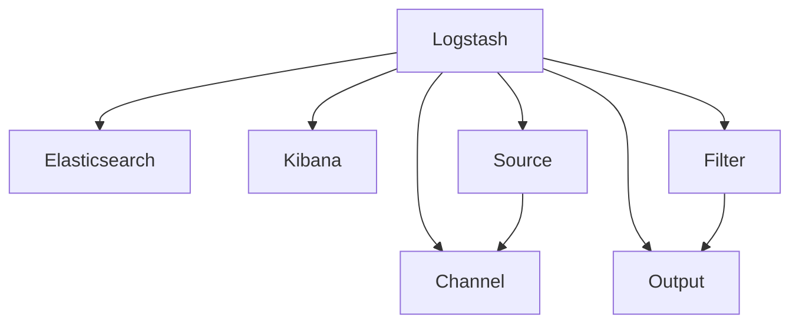

                 

# Logstash原理与代码实例讲解

> 关键词：Logstash, Elastic Stack, 日志管理, 数据处理, 代码实例, 开源工具

## 1. 背景介绍

### 1.1 问题由来
在当今数字化时代，企业和组织生成的大量数据需要被高效、安全地收集、存储、处理和分析，以便从中提取有价值的洞察和决策支持。日志数据作为数据的重要组成部分，记录了系统运行过程中的各种操作和事件，是系统调优、安全审计、事故追根溯源等方面的重要依据。然而，由于日志数据种类繁多、结构复杂、产生量巨大，对日志数据的自动化管理和处理需求日益增加。

### 1.2 问题核心关键点
为了解决上述问题，开源社区孕育了Elastic Stack这一工具栈，Logstash作为其核心组件之一，专注于日志数据的收集、过滤、转换和存储。Logstash使用灵活的插件化架构，支持多源、多宿、多处理和多输出，能够与Elasticsearch、Kibana等其他组件无缝集成，提供强大的日志管理和分析能力。

Logstash的核心功能包括：
- 数据收集：从多个数据源（如文件、数据库、网络、系统日志等）中收集数据。
- 数据处理：通过插件对数据进行过滤、转换、丰富和清洗。
- 数据存储：将处理后的数据存储到文件、数据库或Elasticsearch中。
- 数据可视化：利用Kibana对日志数据进行可视化展示。

这些功能使得Logstash成为大数据、高可用性、高性能的日志管理解决方案，广泛应用于Web应用、网络设备、云服务、安全监控等多个领域。

### 1.3 问题研究意义
研究Logstash原理与代码实例，对于掌握日志管理和数据分析的关键技术，理解Elastic Stack的整体架构，提升系统运维和安全保障能力具有重要意义：

1. 提升运维效率：通过Logstash对日志数据的自动化处理，减少人工操作，提高系统运维效率。
2. 强化安全保障：利用Logstash进行实时监控和日志审计，发现并修复潜在的安全漏洞。
3. 优化系统性能：通过Logstash对日志数据进行分析，优化系统配置和性能，提升服务质量。
4. 加速数据分析：将日志数据与业务数据进行关联分析，挖掘潜在价值，辅助决策。
5. 扩展日志应用：借助Logstash，将日志数据应用于大数据分析、机器学习、NLP等前沿技术，拓展日志数据的更多应用场景。

## 2. 核心概念与联系

### 2.1 核心概念概述

为更好地理解Logstash的工作原理和架构，本节将介绍几个密切相关的核心概念：

- **Logstash**：Elastic Stack的日志收集和处理工具，使用插件化架构，支持多源、多宿、多处理和多输出。
- **Elastic Stack**：包括Logstash、Elasticsearch和Kibana的完整解决方案，用于数据收集、存储和可视化。
- **Elasticsearch**：用于分布式存储和搜索的分布式数据库，支持全文检索、地理空间查询和复杂聚合。
- **Kibana**：基于Web的Elasticsearch可视化工具，用于数据探索、仪表盘制作和报告生成。
- **插件化架构**：Logstash的核心设计理念，通过插件实现扩展和功能增强，支持模块化开发。
- **多源、多宿、多处理和多输出**：Logstash处理数据的四个关键步骤，覆盖数据收集、处理、存储和输出的全流程。
- **过滤器(Filter)和插件(Plugin)**：Logstash的核心组件，用于数据处理和扩展。
- **通道(Channel)和宿主(Host)**：通道是数据流动的管道，宿主是通道的终点或源点。

这些核心概念之间的逻辑关系可以通过以下Mermaid流程图来展示：



这个流程图展示Logstash的核心概念及其之间的关系：

1. Logstash收集来自多个数据源(D)的数据，并通过通道(E)进行传递。
2. 通道(E)中数据经过多个过滤器(F)的处理，实现数据清洗、转换和增强。
3. 处理后的数据通过通道(E)传递到多个宿主(G)，如Elasticsearch或Kibana。

## 3. 核心算法原理 & 具体操作步骤
### 3.1 算法原理概述

Logstash的数据处理过程基于插件化架构，主要包含四个关键步骤：数据收集、数据处理、数据存储和数据可视化。这一过程由插件化框架进行支持，每个插件可以完成特定的功能，并通过输入和输出通道实现数据的流动和处理。

**数据收集**：Logstash通过多种插件收集来自不同数据源的数据，如文件、数据库、网络、系统日志等。

**数据处理**：Logstash中的数据处理插件可以对数据进行多种操作，包括过滤、映射、分割、解析、合并等。通过插件化的方式，可以灵活配置和扩展数据处理流程。

**数据存储**：处理后的数据可以通过插件保存到不同的存储介质，如文件、数据库、Elasticsearch等。

**数据可视化**：利用Kibana，对处理后的数据进行可视化展示，实现数据的探索和分析。

### 3.2 算法步骤详解

以下是Logstash的核心算法步骤和具体操作步骤：

1. **配置文件设置**：创建并编辑配置文件(`logstash.conf`)，指定输入、输出、过滤器的类型和配置参数。
2. **启动Logstash**：使用命令`bin/logstash -f logstash.conf`启动Logstash，监听指定的数据源和通道。
3. **数据处理**：Logstash接收到数据后，通过输入通道进行分流，进入相应的过滤器进行处理。
4. **数据输出**：处理后的数据通过输出通道传递到宿主，完成数据的存储或可视化展示。
5. **持续运行**：Logstash在后台持续运行，自动处理接收到的数据流，并进行必要的维护和监控。

### 3.3 算法优缺点

Logstash的优势在于其灵活性和可扩展性，具体如下：
1. **灵活性**：支持多种数据源和宿主，能够适应不同的数据处理需求。
2. **可扩展性**：通过插件化架构，支持模块化开发，可以灵活添加和配置各种功能。
3. **高效性**：使用Elasticsearch作为宿主，支持分布式存储和搜索，能够处理大规模数据。
4. **可视化支持**：与Kibana集成，提供强大的数据可视化能力，帮助用户直观地理解数据。

同时，Logstash也存在一些局限性：
1. **配置复杂**：需要编写配置文件，配置不当可能导致数据处理失败。
2. **性能瓶颈**：在高并发情况下，可能存在性能瓶颈，影响数据处理效率。
3. **安全性问题**：配置文件暴露在明处，可能被恶意修改，造成数据泄露。
4. **资源消耗**：运行时占用大量系统资源，需要高性能硬件支持。

### 3.4 算法应用领域

Logstash作为一种强大的日志管理工具，可以广泛应用于以下几个领域：

1. **系统运维**：用于收集、处理和分析服务器、应用、数据库等系统日志，及时发现和解决故障。
2. **网络监控**：从网络设备收集日志数据，进行流量分析、性能监控和安全审计。
3. **安全审计**：收集和分析安全日志，发现潜在的安全威胁和异常行为。
4. **性能优化**：通过分析业务日志，识别性能瓶颈，优化系统配置和参数。
5. **数据仓库建设**：将日志数据与业务数据整合，构建完整的数据仓库，支持业务分析和决策支持。
6. **日志审计和归档**：对重要日志数据进行审计和归档，确保数据安全性和完整性。
7. **微服务监控**：在微服务架构中，对各个服务进行日志收集和处理，实现服务监控和性能追踪。

## 4. 数学模型和公式 & 详细讲解 & 举例说明

### 4.1 数学模型构建

Logstash的数据处理过程主要涉及以下几个数学模型：

1. **过滤器插件**：通过配置文件设置过滤器的类型和参数，实现数据的清洗、转换和增强。
2. **输入插件**：通过配置文件设置输入插件的类型和参数，实现数据源的收集。
3. **输出插件**：通过配置文件设置输出插件的类型和参数，实现数据的存储或可视化展示。

### 4.2 公式推导过程

Logstash的核心公式推导过程主要集中在配置文件的设置和插件的配置上。以下是一个简单的例子，演示如何通过配置文件设置Logstash的输入、过滤和输出插件：

```logstash
input {
  file {
    path => "/var/log/myapp.log"
  }
}

filter {
  grok {
    match => { "message" => "%{TIMESTAMP:timestamp}" }
  }
}

output {
  elasticsearch {
    hosts => ["localhost:9200"]
    index => "myapp"
  }
}
```

上述配置文件的作用是：
- 从文件路径`/var/log/myapp.log`中收集日志数据。
- 使用Grok过滤器对日志数据进行解析，提取时间戳信息。
- 将处理后的数据保存到Elasticsearch索引`myapp`中。

### 4.3 案例分析与讲解

以一个实际案例来分析Logstash在数据处理中的应用：

假设一个电商网站需要收集和处理其服务器日志，以便监控系统性能、审计安全事件、分析用户行为。具体步骤如下：

1. **配置输入插件**：
   - 在配置文件中，添加文件输入插件，指定日志文件的路径。
   - 通过配置文件设置Grok过滤器，解析日志中的时间和事件信息。
   
   ```logstash
   input {
     file {
       path => "/var/log/myapp.log"
     }
     
     filter {
       grok {
         match => { "message" => "%{TIMESTAMP:timestamp}" }
       }
     }
   }
   ```

2. **配置过滤插件**：
   - 添加字段处理插件，如`field`、`date`等，对日志数据进行进一步的清洗和转换。
   - 使用`mutate`插件，对日志数据进行字段添加、分割、替换等操作。
   
   ```logstash
   filter {
     field {
       name => "remote_addr"
       value => "127.0.0.1"
     }
     
     date {
       match => { "timestamp" => "%{YEAR:YYYY-MM-DD HH:mm:ss}" }
     }
     
     mutate {
       add_field => { "status" => "$status" }
     }
   }
   ```

3. **配置输出插件**：
   - 添加Elasticsearch输出插件，指定索引名称和服务器地址。
   - 配置索引模板，确保数据的完整性和一致性。
   
   ```logstash
   output {
     elasticsearch {
       hosts => ["localhost:9200"]
       index => "myapp"
       index_template => "myapp_template.json"
     }
   }
   ```

4. **运行Logstash**：
   - 启动Logstash，监控日志数据流，自动处理接收到的数据流。
   
   ```bash
   bin/logstash -f logstash.conf
   ```

## 5. 项目实践：代码实例和详细解释说明
### 5.1 开发环境搭建

在搭建Logstash开发环境前，需要先安装以下依赖：

1. **JDK安装**：安装最新版本的Java Development Kit，Logstash依赖JDK。
2. **Elasticsearch安装**：下载并安装Elasticsearch，用于存储和搜索处理后的日志数据。
3. **Logstash安装**：从官网下载并安装Logstash，获取最新的稳定版本。
4. **Kibana安装**：下载并安装Kibana，用于可视化处理后的日志数据。

完成上述步骤后，即可在本地启动Logstash和Elasticsearch，进行数据处理和可视化。

### 5.2 源代码详细实现

以下是Logstash处理日志数据的完整代码实例，包括配置文件和过滤器的详细实现：

```logstash
input {
  file {
    path => "/var/log/myapp.log"
  }
}

filter {
  grok {
    match => { "message" => "%{TIMESTAMP:timestamp}" }
  }
  
  field {
    name => "remote_addr"
    value => "127.0.0.1"
  }
  
  date {
    match => { "timestamp" => "%{YEAR:YYYY-MM-DD HH:mm:ss}" }
  }
  
  mutate {
    add_field => { "status" => "$status" }
  }
}

output {
  elasticsearch {
    hosts => ["localhost:9200"]
    index => "myapp"
    index_template => "myapp_template.json"
  }
}
```

### 5.3 代码解读与分析

让我们详细解读一下关键代码的实现细节：

**配置文件**：
- `input`块：定义数据输入插件，这里使用文件输入插件，指定日志文件路径。
- `filter`块：定义数据处理插件，这里使用Grok过滤器、字段处理插件和日期处理插件，对日志数据进行解析、添加和转换。
- `output`块：定义数据输出插件，这里使用Elasticsearch输出插件，指定索引名称和服务器地址。

**输入插件**：
- 文件输入插件：从指定的文件路径中收集日志数据。
- Grok过滤器：通过正则表达式解析日志中的时间和事件信息。

**过滤插件**：
- 字段处理插件：对日志数据进行字段添加、替换等操作。
- 日期处理插件：对时间戳进行格式化，确保时间一致性。

**输出插件**：
- Elasticsearch输出插件：将处理后的数据保存到Elasticsearch索引中。
- 索引模板：定义Elasticsearch索引的结构，确保数据的一致性和完整性。

## 6. 实际应用场景

### 6.1 智能运维监控

Logstash在智能运维监控中具有重要应用，通过收集和分析系统日志，能够及时发现和解决故障，优化系统性能，提升运维效率。具体场景包括：

- 服务器监控：收集服务器日志，进行性能监控和异常检测，及时发现资源瓶颈。
- 应用监控：收集应用日志，进行错误日志分析和性能追踪，优化应用配置。
- 数据库监控：收集数据库日志，进行慢查询分析和错误日志审计，确保数据一致性和完整性。

### 6.2 安全审计与风险管理

Logstash在安全审计和风险管理中，通过收集和分析安全日志，发现潜在的安全威胁和异常行为，帮助组织防范和应对安全事件。具体场景包括：

- 入侵检测：收集网络设备日志，进行入侵检测和防御，防范恶意攻击。
- 用户行为分析：收集用户登录日志和操作日志，分析用户行为模式，发现异常行为。
- 恶意软件分析：收集系统日志和应用日志，分析恶意软件行为，进行防护和隔离。

### 6.3 业务分析和决策支持

Logstash在业务分析和决策支持中，通过将日志数据与业务数据整合，挖掘潜在价值，辅助决策。具体场景包括：

- 用户行为分析：收集用户点击日志和行为日志，分析用户行为模式，制定个性化推荐策略。
- 交易监控：收集交易日志和支付日志，监控交易行为，发现异常交易和欺诈行为。
- 客户服务：收集客户服务日志，分析客户反馈，提升服务质量和客户满意度。

## 7. 工具和资源推荐
### 7.1 学习资源推荐

为了帮助开发者系统掌握Logstash的理论基础和实践技巧，这里推荐一些优质的学习资源：

1. **官方文档**：Elastic官方提供的Logstash文档，详细介绍了Logstash的配置、插件和扩展。
2. **Elastic Blog**：Elastic官方博客，包含大量的Logstash使用案例和最佳实践。
3. **Logstash Cookbook**：社区整理的Logstash实用技巧和插件，供开发者参考和学习。
4. **Stack Overflow**：开发者社区，可以通过搜索和学习其他开发者的经验和问题，快速解决Logstash使用中的疑难杂症。

通过对这些资源的学习实践，相信你一定能够快速掌握Logstash的精髓，并用于解决实际的日志管理问题。

### 7.2 开发工具推荐

高效的开发离不开优秀的工具支持。以下是几款用于Logstash开发和部署的常用工具：

1. **JDK**：Java Development Kit，用于Logstash和Elasticsearch的运行环境。
2. **Elasticsearch**：分布式存储和搜索数据库，用于处理和存储日志数据。
3. **Kibana**：可视化工具，用于处理后的日志数据的探索和展示。
4. **Logstash**：日志收集和处理工具，通过插件化架构进行灵活配置和扩展。
5. **Kopf**：自动部署工具，用于Logstash的自动部署和管理。
6. **Elastic Stack**：包括Logstash、Elasticsearch和Kibana的完整解决方案，用于数据收集、存储和可视化。

合理利用这些工具，可以显著提升Logstash的开发效率，加快创新迭代的步伐。

### 7.3 相关论文推荐

Logstash作为Elastic Stack的核心组件之一，其设计和实现已经得到了学界的广泛关注和研究。以下是几篇奠基性的相关论文，推荐阅读：

1. **"Logstash: Simplified Log Processing"**：Elastic官方论文，介绍Logstash的设计思想和关键特性。
2. **"Real-Time Log Analysis and Monitoring"**：Elastic官方博客，介绍如何使用Logstash进行实时日志分析和监控。
3. **"Logstash Cookbook: Recipes for Processing Logs"**：社区整理的实用技巧和插件，供开发者参考和学习。
4. **"Logstash: Building the Plugins"**：官方文档，详细介绍Logstash插件的开发和扩展。

这些论文代表了大语言模型微调技术的发展脉络。通过学习这些前沿成果，可以帮助研究者把握学科前进方向，激发更多的创新灵感。

## 8. 总结：未来发展趋势与挑战

### 8.1 总结

本文对Logstash原理与代码实例进行了全面系统的介绍。首先阐述了Logstash的工作原理和应用场景，明确了其在Elastic Stack中的核心地位。其次，从原理到实践，详细讲解了Logstash的数据处理过程和关键步骤，给出了完整的代码实例。同时，本文还探讨了Logstash在智能运维、安全审计和业务分析等多个领域的应用前景，展示了其强大的数据处理能力。

通过本文的系统梳理，可以看到，Logstash在日志管理和数据分析中扮演着关键角色，通过灵活的插件化架构，能够适应多种数据处理需求，显著提升系统运维效率和数据处理能力。未来，伴随Elastic Stack的持续演进和社区的不断创新，Logstash必将在更多应用场景中发挥重要作用，推动数据驱动的智能化发展。

### 8.2 未来发展趋势

展望未来，Logstash作为Elastic Stack的核心组件，将在以下几个方面呈现新的发展趋势：

1. **更强的扩展性**：通过增加更多插件和过滤器，进一步扩展Logstash的功能，支持更多数据源和宿主。
2. **更高的性能**：优化数据处理流程，提升Logstash的吞吐量和处理效率，支持大规模数据处理。
3. **更丰富的可视化**：利用Kibana进行更强大的数据可视化，提供更直观的数据分析和展示。
4. **更好的安全性**：加强数据保护和访问控制，确保日志数据的安全性和隐私性。
5. **更高的可靠性**：增强系统的稳定性和可用性，提供更完善的监控和告警机制。

以上趋势凸显了Logstash作为日志管理工具的广阔前景。这些方向的探索发展，必将进一步提升Elastic Stack的整体性能和用户体验，为数据驱动的智能化发展提供更坚实的技术支撑。

### 8.3 面临的挑战

尽管Logstash已经在日志管理领域取得了显著成果，但在迈向更加智能化、普适化应用的过程中，它仍面临一些挑战：

1. **配置复杂性**：配置文件暴露在明处，可能被恶意修改，造成数据泄露。
2. **性能瓶颈**：在高并发情况下，可能存在性能瓶颈，影响数据处理效率。
3. **安全性问题**：配置文件暴露在明处，可能被恶意修改，造成数据泄露。
4. **资源消耗**：运行时占用大量系统资源，需要高性能硬件支持。
5. **维护成本**：大规模部署和维护Logstash系统，需要投入大量人力和时间。

正视Logstash面临的这些挑战，积极应对并寻求突破，将使其在未来的应用中更加稳健和可靠。

### 8.4 研究展望

未来，Logstash需要进一步优化和改进，以应对日益增长的数据处理需求。以下是一些可能的研究方向：

1. **自动化配置**：通过自动化配置工具，简化Logstash的配置过程，避免人为错误。
2. **分布式处理**：利用容器化和微服务技术，实现Logstash的分布式部署和管理。
3. **跨平台支持**：支持更多的操作系统和硬件平台，提升Logstash的普及和应用范围。
4. **实时处理**：提升Logstash的实时处理能力，支持实时监控和分析。
5. **多模态融合**：支持处理多种数据格式，如文本、图像、音频等，实现多模态数据的融合处理。

这些研究方向将进一步拓展Logstash的应用场景和功能，使其在数据驱动的智能化发展中扮演更加重要的角色。

## 9. 附录：常见问题与解答

**Q1：Logstash是如何实现数据收集和处理的？**

A: Logstash通过配置文件和插件化架构，实现数据收集和处理。具体步骤如下：
1. 配置文件设置：创建并编辑配置文件，指定输入、输出、过滤器的类型和参数。
2. 启动Logstash：使用命令启动Logstash，监听指定的数据源和通道。
3. 数据处理：Logstash接收到数据后，通过输入通道进行分流，进入相应的过滤器进行处理。
4. 数据输出：处理后的数据通过输出通道传递到宿主，完成数据的存储或可视化展示。

**Q2：Logstash中常用的过滤器有哪些？**

A: Logstash中常用的过滤器包括：
1. Grok：通过正则表达式解析日志中的时间和事件信息。
2. Field：添加、替换、删除字段。
3. Date：格式化时间戳，确保时间一致性。
4. Mutate：添加、分割、替换字段。
5. Print：输出调试信息。
6. Stats：统计数据处理性能。

这些过滤器可以组合使用，实现复杂的数据处理需求。

**Q3：Logstash在性能瓶颈处理方面有哪些优化策略？**

A: Logstash在性能瓶颈处理方面有以下优化策略：
1. 增加批处理：将多个日志记录合并为一个批次进行处理，减少网络传输和处理开销。
2. 启用多线程：利用多线程技术，提升Logstash的处理效率。
3. 缓存数据：使用缓存技术，减少磁盘I/O和网络传输。
4. 优化插件：优化插件的代码实现，提升处理效率。
5. 分布式部署：利用分布式处理技术，提升Logstash的并发处理能力。

**Q4：Logstash如何与Elasticsearch集成？**

A: Logstash可以通过Elasticsearch输出插件，将处理后的数据保存到Elasticsearch中。具体步骤如下：
1. 配置Elasticsearch输出插件：在配置文件中添加输出插件，指定Elasticsearch服务器地址和索引名称。
2. 定义索引模板：在Elasticsearch中定义索引模板，确保数据的完整性和一致性。
3. 启动Logstash：使用命令启动Logstash，处理日志数据并保存到Elasticsearch中。

**Q5：Logstash在业务分析和决策支持中的作用是什么？**

A: Logstash在业务分析和决策支持中的作用是：
1. 收集和分析日志数据，发现业务中的问题和异常行为。
2. 将日志数据与业务数据整合，挖掘潜在价值，辅助决策。
3. 利用Kibana进行数据可视化，提供直观的业务分析工具。

通过Logstash的这些功能，企业可以更好地理解业务运营状况，制定更加科学的决策。

---

作者：禅与计算机程序设计艺术 / Zen and the Art of Computer Programming

