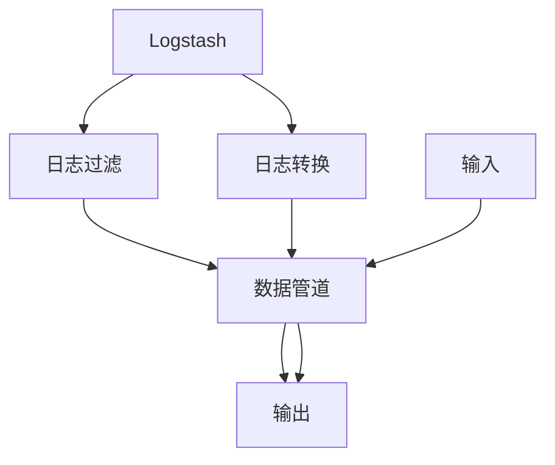

                 

# Logstash日志过滤与转换

> 关键词：Logstash, 日志过滤, 日志转换, 日志分析, 数据处理

## 1. 背景介绍

### 1.1 问题由来
在现代社会中，日志（log）是企业运行的重要记录，包含了大量关于系统行为、事件、错误信息等关键数据。合理地分析、过滤、转换这些日志数据，能够帮助企业快速定位问题、优化系统性能、保障数据安全。传统的日志处理方式往往依赖于手工操作，费时费力，且难以形成统一的标准。随着数据量的激增，如何自动化、高效地处理日志数据，成为了企业IT部门面临的重要挑战。

在数据分析领域，日志数据的处理和分析通常被称为日志分析（Log Analysis）。Logstash作为一种流行的日志处理工具，其功能强大，灵活可扩展，能够帮助企业快速构建高效、自动化、可扩展的日志处理系统。

### 1.2 问题核心关键点
Logstash的核心功能包括日志过滤（Log Filtering）和日志转换（Log Transformation）。通过对日志数据的过滤和转换，Logstash能够提供强大的数据分析能力，支持多种格式的数据输入和输出，满足不同场景下的日志处理需求。本文将详细介绍Logstash的核心功能和应用，帮助读者掌握Logstash的使用技巧，从而高效地处理和分析企业日志数据。

## 2. 核心概念与联系

### 2.1 核心概念概述

为更好地理解Logstash的功能和架构，本节将介绍几个关键概念：

- **Logstash**：一个开源的数据收集、处理和分析工具，由ELK Stack（Elasticsearch, Logstash, Kibana）组成。
- **日志过滤**：指根据特定的过滤规则，筛选出符合条件的日志记录。通常用于剔除噪声、限制输出量、提高处理效率。
- **日志转换**：指对日志记录的格式、内容、结构等进行转换，以便更好地进行存储、分析和展示。通常用于标准化数据格式、提取有用信息、生成报告等。
- **数据管道（Pipeline）**：Logstash的核心概念，指的是从输入到输出的数据处理流程。数据管道由多个组件组成，每个组件负责数据的不同处理任务。

这些核心概念之间的关系可以通过以下Mermaid流程图来展示：



这个流程图展示了Logstash的核心组件和处理流程：

1. Logstash接收输入数据。
2. 数据经过过滤和转换，形成处理后的数据。
3. 处理后的数据最终输出到指定的存储或展示系统。

## 3. 核心算法原理 & 具体操作步骤
### 3.1 算法原理概述

Logstash的核心算法原理主要集中在两个方面：日志过滤和日志转换。

**日志过滤**：通过设置不同的过滤规则，Logstash能够自动地从日志数据中筛选出符合条件的部分，剔除无用信息，减少处理量。常见的过滤规则包括正则表达式、关键字匹配、时间范围限制等。

**日志转换**：Logstash提供了多种插件，用于对日志记录进行格式转换、内容提取、字段重命名、数据合并等操作。常见的转换插件包括JSON插件、CSV插件、grok插件、template插件等。

### 3.2 算法步骤详解

#### 3.2.1 日志过滤

1. **配置Filter插件**：
   - 在Logstash配置文件中，使用`filter`标签配置过滤规则。例如：
   ```logstash
   filter {
       grok {
           match => ["message", "%{MESSAGE:message}"]
       }
   }
   ```
   - 上述配置中，`grok`插件用于解析日志记录中的指定字段，将`message`字段中的信息提取出来。

2. **应用Filter规则**：
   - 启动Logstash后，配置文件中的Filter插件将被自动应用到输入数据中。
   - 例如，对于以下日志记录：
   ```
   [2021-05-18T14:30:00,000Z] [INFO] 请求ID：123，URL：http://www.example.com，IP：192.168.0.1
   ```
   - Logstash将使用grok插件提取`message`字段，得到`123`、`http://www.example.com`、`192.168.0.1`等关键信息。

#### 3.2.2 日志转换

1. **配置Pipeline插件**：
   - 在Logstash配置文件中，使用`pipeline`标签配置数据管道。例如：
   ```logstash
   pipeline {
       filter {
           grok {
               match => ["message", "%{MESSAGE:message}"]
           }
       }
       output {
           stdout {
           }
       }
   }
   ```
   - 上述配置中，`pipeline`标签定义了数据管道，其中`filter`标签用于配置过滤规则，`output`标签用于指定数据输出方式。

2. **应用Pipeline规则**：
   - 启动Logstash后，配置文件中的Pipeline插件将被自动应用到输入数据中。
   - 例如，对于以下日志记录：
   ```
   [2021-05-18T14:30:00,000Z] [INFO] 请求ID：123，URL：http://www.example.com，IP：192.168.0.1
   ```
   - Logstash将使用`filter`标签中的grok插件解析日志记录中的指定字段，得到`123`、`http://www.example.com`、`192.168.0.1`等关键信息，并将结果输出到`stdout`插件中。

#### 3.3 算法优缺点

**优点**：
1. **自动化处理**：Logstash提供了自动化的数据处理能力，能够大大提高处理效率，减少人工操作。
2. **灵活扩展**：Logstash支持插件化扩展，可以根据不同的需求灵活配置数据处理规则。
3. **丰富的插件**：Logstash提供了多种插件，能够处理多种数据格式和内容，适应不同的应用场景。
4. **支持多种输出**：Logstash支持多种数据输出方式，如JSON、CSV、Elasticsearch等，方便数据存储和分析。

**缺点**：
1. **配置复杂**：Logstash配置文件较为复杂，需要仔细配置才能达到理想的效果。
2. **性能瓶颈**：在处理大量数据时，Logstash的性能可能成为瓶颈，需要仔细调优。
3. **学习成本**：Logstash的学习成本较高，需要掌握一定的配置和开发技巧。

### 3.4 算法应用领域

Logstash广泛应用于日志分析、数据清洗、数据提取、数据聚合、数据展示等多个领域。具体应用场景包括但不限于：

- **系统监控**：收集和分析系统运行日志，定位系统故障和性能瓶颈。
- **安全审计**：分析网络流量、系统日志等，发现潜在的安全威胁和违规行为。
- **性能优化**：分析和优化应用程序性能，提取性能瓶颈和错误信息。
- **业务分析**：收集和分析业务日志，生成业务报表和分析报告，辅助决策。

## 4. 数学模型和公式 & 详细讲解 & 举例说明

### 4.1 数学模型构建

Logstash的数据处理过程可以抽象为数据管道模型，其中数据管道由多个插件组成，每个插件负责不同的处理任务。

设输入数据为$X$，经过Logstash处理后输出的数据为$Y$。Logstash的数据管道模型可以表示为：

$$
Y = F(X, P)
$$

其中，$F$表示数据管道中的处理函数，$P$表示配置文件中的数据管道规则，$X$表示输入数据，$Y$表示输出数据。

### 4.2 公式推导过程

以日志过滤为例，假设输入日志记录为：

$$
X = [2021-05-18T14:30:00,000Z] [INFO] 请求ID：123，URL：http://www.example.com，IP：192.168.0.1
$$

设过滤规则为：

$$
F = \{\text{grok}\{message=/%{MESSAGE:message}\}, \text{output}\{\text{stdout}\}
$$

其中，`grok`插件用于解析日志记录中的指定字段，`output`插件用于指定数据输出方式。

将输入日志记录和过滤规则代入数据管道模型，得：

$$
Y = \text{grok}\{message=/%{MESSAGE:message}\}(\text{output}\{\text{stdout}\})([2021-05-18T14:30:00,000Z] [INFO] 请求ID：123，URL：http://www.example.com，IP：192.168.0.1)
$$

经过`grok`插件解析后，得到：

$$
Y = [123, http://www.example.com, 192.168.0.1]
$$

最后，输出到`stdout`插件中，得到：

$$
\text{stdout}(Y) = 123, http://www.example.com, 192.168.0.1
$$

### 4.3 案例分析与讲解

假设有一个Web服务器，其日志记录格式如下：

```
[2021-05-18T14:30:00,000Z] [INFO] 请求ID：123，URL：http://www.example.com，IP：192.168.0.1
```

我们需要从日志记录中提取`request ID`、`URL`和`IP`三个字段，并将结果输出到Elasticsearch中。

配置文件如下：

```logstash
input {
    file {
        path => "/var/log/httpd/access.log"
        start_position => "beginning"
    }
}

filter {
    grok {
        match => ["message", "%{DATE:timestamp} %{LEVEL:level} %{REQUEST_ID:request_id} %{URL:url} %{IP:ip}"]
    }
    json {
        target => "json"
    }
}

output {
    elasticsearch {
        hosts => ["localhost:9200"]
        index => "logs_2021"
    }
}
```

在上述配置中，`file`插件用于读取日志文件，`grok`插件用于解析日志记录，`json`插件用于将解析后的结果转换为JSON格式，`elasticsearch`插件用于将数据输出到Elasticsearch中。

启动Logstash后，配置文件中的各个插件将被自动应用到输入数据中，处理后的数据将被输出到Elasticsearch中，形成统一的日志数据集。

## 5. 项目实践：代码实例和详细解释说明

### 5.1 开发环境搭建

在Logstash项目实践中，我们需要准备好开发环境。以下是使用Python进行开发的环境配置流程：

1. 安装Anaconda：从官网下载并安装Anaconda，用于创建独立的Python环境。

2. 创建并激活虚拟环境：
```bash
conda create -n logstash-env python=3.8 
conda activate logstash-env
```

3. 安装Elasticsearch：
```bash
conda install elasticsearch
```

4. 安装Logstash：
```bash
conda install logstash
```

5. 配置Elasticsearch：
```bash
sudo systemctl start elasticsearch
```

6. 启动Logstash：
```bash
logstash -f your_logstash_conf_file.conf
```

完成上述步骤后，即可在`logstash-env`环境中开始项目实践。

### 5.2 源代码详细实现

下面我们以Web服务器日志分析为例，给出使用Logstash进行日志过滤和转换的配置文件实现。

```logstash
input {
    file {
        path => "/var/log/httpd/access.log"
        start_position => "beginning"
    }
}

filter {
    grok {
        match => ["message", "%{DATE:timestamp} %{LEVEL:level} %{REQUEST_ID:request_id} %{URL:url} %{IP:ip}"]
    }
    json {
        target => "json"
    }
}

output {
    elasticsearch {
        hosts => ["localhost:9200"]
        index => "logs_2021"
    }
}
```

在上述代码中，`input`标签定义了日志文件读取，`filter`标签定义了日志过滤和转换，`output`标签定义了数据输出方式。

### 5.3 代码解读与分析

让我们再详细解读一下关键代码的实现细节：

**input标签**：
- `file`插件用于读取日志文件，`path`属性指定日志文件路径，`start_position`属性指定从日志文件的起始位置开始读取。

**filter标签**：
- `grok`插件用于解析日志记录中的指定字段，`match`属性指定正则表达式，用于匹配日志格式。
- `json`插件用于将解析后的结果转换为JSON格式，`target`属性指定目标字段名。

**output标签**：
- `elasticsearch`插件用于将数据输出到Elasticsearch中，`hosts`属性指定Elasticsearch服务器地址，`index`属性指定日志索引名。

**5.4 运行结果展示**

启动Logstash后，配置文件中的各个插件将被自动应用到输入数据中，处理后的数据将被输出到Elasticsearch中。

例如，对于以下日志记录：

```
[2021-05-18T14:30:00,000Z] [INFO] 请求ID：123，URL：http://www.example.com，IP：192.168.0.1
```

Logstash将使用`grok`插件解析日志记录中的指定字段，得到`123`、`http://www.example.com`、`192.168.0.1`等关键信息，并将结果转换为JSON格式，输出到Elasticsearch中。

在Elasticsearch中，可以通过查询语句获取相应的日志记录：

```
GET /logs_2021/_search
{
  "query": {
    "match": {
      "timestamp": "2021-05-18T14:30:00"
    }
  }
}
```

最终，Logstash通过过滤和转换，将日志记录转换为结构化数据，方便后续分析和展示。

## 6. 实际应用场景

### 6.1 系统监控

在系统监控场景中，Logstash可以实时收集和分析服务器日志，帮助IT团队快速定位系统故障和性能瓶颈。

例如，一个Web服务器记录了访问日志，Logstash可以将日志记录中的访问信息、请求ID、URL、IP等字段提取出来，并根据时间范围和请求状态进行过滤，生成日、周、月、年的访问报表，帮助IT团队分析服务器性能、流量变化趋势，及时发现和解决系统问题。

### 6.2 安全审计

在安全审计场景中，Logstash可以收集和分析网络流量、系统日志等，发现潜在的安全威胁和违规行为。

例如，一个防火墙记录了访问日志，Logstash可以将日志记录中的IP地址、访问时间、访问协议等字段提取出来，并根据规则进行过滤和转换，生成访问日志报表和安全警报，帮助安全团队及时发现和应对潜在的安全威胁。

### 6.3 性能优化

在性能优化场景中，Logstash可以分析和优化应用程序性能，提取性能瓶颈和错误信息。

例如，一个Web应用记录了服务日志，Logstash可以将日志记录中的请求ID、URL、响应时间、错误信息等字段提取出来，并根据时间范围和请求状态进行过滤和转换，生成性能报表和错误日志，帮助开发团队分析性能瓶颈，优化应用程序性能。

### 6.4 未来应用展望

随着Logstash功能的不断拓展和应用场景的不断丰富，Logstash将在更多领域得到应用，为企业的数字化转型升级提供新的技术路径。

在智慧医疗领域，Logstash可以帮助医院实时收集和分析患者日志，提取病情信息、治疗记录、护理日志等，为医生的诊断和治疗提供支持，提高医疗服务质量。

在智能制造领域，Logstash可以帮助工厂实时收集和分析生产日志，提取设备状态、生产数据、异常记录等，为生产调度和维护提供支持，提高生产效率和设备利用率。

在智慧教育领域，Logstash可以帮助学校实时收集和分析学生日志，提取学习行为、考试记录、课堂互动等，为教师的教学和学生的学习提供支持，提高教学效果和学习效率。

此外，在金融、电商、交通、能源等多个领域，Logstash都可以发挥重要作用，为企业的数字化转型提供强有力的技术支持。

## 7. 工具和资源推荐

### 7.1 学习资源推荐

为了帮助开发者系统掌握Logstash的使用技巧，这里推荐一些优质的学习资源：

1. **官方文档**：Logstash官方文档详细介绍了Logstash的安装、配置和使用方法，是初学者和进阶用户必不可少的学习资料。
   - [Logstash官方文档](https://www.elastic.co/guide/en/logstash/current/)

2. **Elastic Stack官方博客**：Elastic官方博客提供了大量实用的Logstash案例和最佳实践，帮助你快速上手并深入理解Logstash的使用技巧。
   - [Elastic官方博客](https://www.elastic.co/blog)

3. **Elastic认证课程**：Elastic提供了一系列官方认证课程，帮助用户系统掌握Logstash的使用技巧，并通过认证获得官方认可。
   - [Elastic认证课程](https://www.elastic.co/training/certifications)

4. **在线课程**：Udemy、Coursera等在线平台提供了多种Logstash相关课程，适合初学者和进阶用户。
   - [Udemy Logstash课程](https://www.udemy.com/topic/logstash/)
   - [Coursera Logstash课程](https://www.coursera.org/courses?query=logstash)

5. **社区资源**：Stack Overflow、GitHub等社区提供了大量的Logstash代码示例和社区讨论，帮助用户解决实际问题。
   - [Stack Overflow Logstash讨论](https://stackoverflow.com/questions/tagged/logstash)
   - [GitHub Logstash示例](https://github.com/logstash-community/logstash/tree/master/examples)

通过对这些资源的学习实践，相信你一定能够快速掌握Logstash的使用技巧，并应用于实际的日志处理和分析场景。

### 7.2 开发工具推荐

在开发过程中，我们推荐使用以下工具来提高开发效率和代码质量：

1. **Visual Studio Code**：一款轻量级的开发工具，支持多种插件和扩展，是Logstash开发的理想选择。
   - [Visual Studio Code](https://code.visualstudio.com/)

2. **Jupyter Notebook**：一款交互式开发工具，支持Python、R等多种编程语言，方便进行日志分析和处理。
   - [Jupyter Notebook](https://jupyter.org/)

3. **Git**：版本控制系统，支持多人协作开发，是开发和部署Logstash项目的必备工具。
   - [Git](https://git-scm.com/)

4. **Elasticsearch**：Logstash的主要数据输出目的地，支持快速查询和分析。
   - [Elasticsearch](https://www.elastic.co/)

5. **Kibana**：Elastic Stack的一部分，提供了可视化的日志分析仪表盘，方便用户查看日志数据。
   - [Kibana](https://www.elastic.co/kibana/)

合理利用这些工具，可以显著提升Logstash项目的开发效率，加速创新迭代的步伐。

### 7.3 相关论文推荐

Logstash作为一种流行的日志处理工具，在研究领域也得到了广泛关注。以下是几篇具有代表性的相关论文，推荐阅读：

1. **Logstash: A data processing pipeline**：
   - 论文介绍了Logstash的架构和设计思想，详细描述了数据管道和插件化的处理方式。
   - [Logstash: A data processing pipeline](https://www.elastic.co/guide/en/logstash/current/logstash-data-pipelines.html)

2. **Elastic Logstash: A scalable, automatic pipeline for log analysis**：
   - 论文介绍了Elastic Logstash的实现原理和应用场景，详细描述了如何构建高性能、可扩展的日志处理系统。
   - [Elastic Logstash: A scalable, automatic pipeline for log analysis](https://www.elastic.co/labs/logstash-introduction/)

3. **Elastic Stack: A unified approach to log analysis and monitoring**：
   - 论文介绍了Elastic Stack的架构和功能，详细描述了Elastic Search、Logstash、Kibana的协作机制。
   - [Elastic Stack: A unified approach to log analysis and monitoring](https://www.elastic.co/labs/intro-to-elasticsearch/)

这些论文代表了大数据处理领域的最新研究成果，通过学习这些前沿成果，可以帮助研究者掌握Logstash的核心技术和应用方法。

## 8. 总结：未来发展趋势与挑战

### 8.1 总结

本文对Logstash的日志过滤与转换功能进行了全面系统的介绍。首先阐述了Logstash的核心功能和应用场景，明确了其在数据处理和分析中的独特价值。其次，从原理到实践，详细讲解了Logstash的核心功能和应用技巧，帮助读者掌握Logstash的使用技巧，从而高效地处理和分析企业日志数据。最后，本文还广泛探讨了Logstash在实际应用中的各种场景，展示了Logstash的巨大潜力。

通过本文的系统梳理，可以看到，Logstash作为一项强大的日志处理工具，正在成为企业数据处理和分析的重要范式，极大地提高了企业的数字化转型速度和数据处理能力。未来，随着大数据和人工智能技术的不断进步，Logstash将在更多领域得到应用，为企业的数字化转型提供新的技术路径。

### 8.2 未来发展趋势

展望未来，Logstash的发展趋势将呈现以下几个方面：

1. **自动化和智能化**：未来的Logstash将进一步加强自动化和智能化能力，通过机器学习和智能算法，自动识别日志数据中的模式和规律，提升日志分析的效率和准确性。
2. **插件化扩展**：未来的Logstash将提供更多的插件和扩展，支持更多的数据格式和处理任务，满足不同场景下的需求。
3. **容器化和微服务**：未来的Logstash将支持容器化和微服务架构，方便部署和管理，提高系统的灵活性和可扩展性。
4. **跨平台支持**：未来的Logstash将支持更多的操作系统和平台，提供跨平台的数据处理和分析能力。
5. **社区和生态系统**：未来的Logstash将进一步加强社区和生态系统建设，吸引更多的开发者和企业参与，共同推动Logstash的发展。

以上趋势凸显了Logstash未来的广阔前景。这些方向的探索发展，必将进一步提升Logstash的性能和应用范围，为企业的数字化转型提供强有力的技术支持。

### 8.3 面临的挑战

尽管Logstash已经取得了显著的成就，但在迈向更加智能化、普适化应用的过程中，它仍面临着诸多挑战：

1. **性能瓶颈**：在处理大量数据时，Logstash的性能可能成为瓶颈，需要仔细调优。
2. **配置复杂**：Logstash配置文件较为复杂，需要仔细配置才能达到理想的效果。
3. **学习成本**：Logstash的学习成本较高，需要掌握一定的配置和开发技巧。
4. **资源消耗**：Logstash在运行过程中会占用大量系统资源，需要合理配置资源才能保证系统稳定性。
5. **数据安全**：Logstash需要处理敏感数据，需要采取措施确保数据安全。

这些挑战需要开发者在实际应用中不断优化和改进，确保Logstash的性能和稳定性。

### 8.4 研究展望

面对Logstash面临的种种挑战，未来的研究需要在以下几个方面寻求新的突破：

1. **性能优化**：开发更加高效、低消耗的Logstash组件，提升处理大规模数据的性能。
2. **智能化增强**：引入机器学习算法，增强Logstash的自动分析和智能处理能力。
3. **可视化改进**：提高Logstash的可视化能力，方便用户实时监控和调试系统。
4. **生态系统建设**：加强社区和生态系统建设，吸引更多的开发者和企业参与，共同推动Logstash的发展。
5. **安全性保障**：开发更加安全的Logstash组件，确保数据处理和分析过程中的安全性。

这些研究方向将推动Logstash不断进步，为企业的数字化转型提供更加高效、可靠、安全的技术支持。

## 9. 附录：常见问题与解答

**Q1：如何使用Logstash进行日志过滤？**

A: 在Logstash配置文件中，使用`filter`标签配置过滤规则。例如：
```logstash
filter {
    grok {
        match => ["message", "%{DATE:timestamp} %{LEVEL:level} %{REQUEST_ID:request_id} %{URL:url} %{IP:ip}"]
    }
}
```

**Q2：如何使用Logstash进行日志转换？**

A: 在Logstash配置文件中，使用`output`标签配置数据输出方式。例如：
```logstash
output {
    elasticsearch {
        hosts => ["localhost:9200"]
        index => "logs_2021"
    }
}
```

**Q3：Logstash支持哪些数据格式？**

A: Logstash支持多种数据格式，如JSON、CSV、XML、Text等。在配置文件中，使用相应的插件进行数据转换。

**Q4：Logstash有哪些应用场景？**

A: Logstash广泛应用于日志分析、数据清洗、数据提取、数据聚合、数据展示等多个领域。具体应用场景包括但不限于系统监控、安全审计、性能优化、业务分析等。

**Q5：Logstash的性能瓶颈在哪里？**

A: 在处理大量数据时，Logstash的性能可能成为瓶颈。需要仔细调优，例如增加并发处理能力、优化插件性能等。

通过本文的系统梳理，可以看到，Logstash作为一项强大的日志处理工具，正在成为企业数据处理和分析的重要范式，极大地提高了企业的数字化转型速度和数据处理能力。未来，随着大数据和人工智能技术的不断进步，Logstash将在更多领域得到应用，为企业的数字化转型提供新的技术路径。

